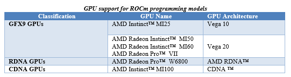
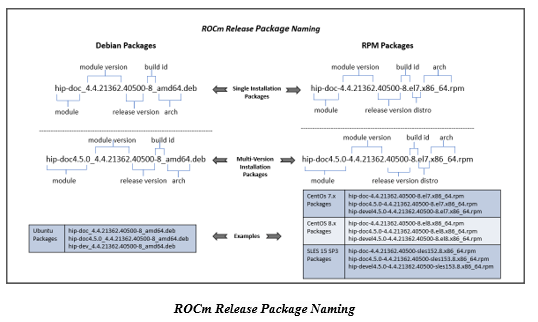
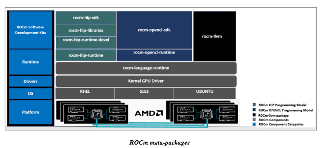
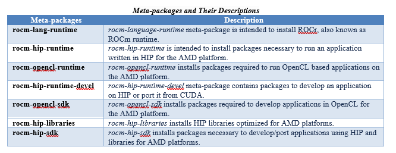
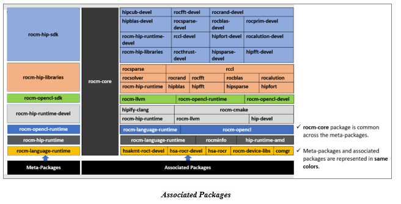

.. image:: /Installation_Guide/amdblack.jpg
|
==============================================
ROCm Installation Guide v4.5
==============================================

.. contents::

Overview of ROCm Installation Methods
--------------------------------------

In addition to the installation method using the native Package Manager, AMD ROCm v4.5 introduces new methods to install ROCm. With this release, the ROCm installation uses the amdgpu-install and amdgpu-uninstall scripts.  

The amdgpu-install script streamlines the installation process by:

- Abstracting the distribution-specific package installation logic

- Performing the repository set-up

- Allowing a user to specify the use case and automating the installation of all the required packages

- Performing post-install checks to verify whether the installation was completed successfully 

- Installing the uninstallation script

The amdgpu-uninstall script allows the removal of the entire ROCm stack by using a single command.

Some of the ROCm-specific use cases that the installer currently supports are: 

- OpenCL (ROCr/KFD based) runtime

- HIP runtimes

- ROCm libraries and applications

- ROCm Compiler and device libraries

- ROCr runtime and thunk

For more information, refer to the Installation Methods section in this guide.

About This Document
====================

This document is intended for users familiar with the Linux environments and discusses the installation/uninstallation of ROCm programming models on the various flavors of Linux. 

This document also refers to Radeon™ Software for Linux® as AMDGPU stack, including the kernel-mode driver amdgpu-dkms.

The guide provides the installation instructions for the following:

- ROCm Installation

- Heterogeneous-Computing Interface for Portability (HIP) SDK

- OPENCL ™ SDK

- Kernel Mode Driver

System Requirements
======================

The system requirements for the ROCm v4.5 installation are as follows:

.. image:: SuppEnv.png
   :alt: Screenshot     

 
 
**NOTE**: Installing ROCm on Linux will require superuser privileges. For systems that have enabled sudo packages, ensure you use the sudo prefix for all required commands.
 
 
 

Prerequisite Actions
---------------------
 

You must perform the following steps before installing ROCm programming models and check if the system meets all of the requirements to proceed with the installation.
 
- Confirm the system has a supported Linux distribution version

- Confirm the system has a ROCm-capable GPU

- Confirm the system has standard compilers and tools installed

Confirm You Have a Supported Linux Distribution Version
=========================================================

The ROCm installation is supported only on specific Linux distributions and their kernel versions. 

**NOTE**: The ROCm installation is not supported on 32-bit operating systems.

How to Check Linux Distribution and Kernel Versions on Your System
*******************************************************************

Linux Distribution Information
^^^^^^^^^^^^^^^^^^^^^^^^^^^^^^^

Ensure you obtain the distribution information of the system by using the following command on your system from the Command Line Interface (CLI),

:: 
               

            $ uname -m && cat /etc/*release
            

For example, running the command above on an Ubuntu system results in the following output: 
 
::
 
            x86_64
            DISTRIB_ID=Ubuntu
            DISTRIB_RELEASE=18.04
            DISTRIB_CODENAME=bionic
            DISTRIB_DESCRIPTION="Ubuntu 18.04.5 LTS"
         

Kernel Information
^^^^^^^^^^^^^^^^^^^

Type the following command to check the kernel version of your Linux system.

::

               $ uname -srmv

The output of the command above lists the kernel version in the following format: 

::
           
           
            Linux 5.4.0-77-generic #86~18.04.5-Ubuntu SMP Fri Jun 18 01:23:22 UTC 2021 x86_64

OS and Kernel Version Match
^^^^^^^^^^^^^^^^^^^^^^^^^^^^^

Confirm that the obtained Linux distribution and kernel versions match with System Requirements.

Confirm You Have a ROCm-Capable GPU
=====================================

The ROCm platform is designed to support the following list of GPUs: 

   
   
How to Verify Your System Has a ROCm-Capable GPU
**************************************************

To verify that your system has a ROCm-capable GPU, enter the following command from the Command Line Interface (CLI):

::

               $ sudo lshw -class display
               The command displays the details of detected GPUs on the system in the following format:
               *-display
               description: VGA compatible controller
               product: Vega 20
               vendor: Advanced Micro Devices, Inc. [AMD/ATI]
               physical id: 0
               bus info: pci@0000:43:00.
               version: c1
               width: 64 bits
                      clock: 33MHz
                      capabilities: vga_controller bus_master cap_list rom
                      configuration: driver=amdgpu latency=0
                      resources: irq:66 memory:80000000-8fffffff memory:90000000-901fffff ioport:2000(size=256) memory:9f600000-9f67ffff memory:c0000-dffff
                      
                      

**NOTE**: Verify from the output that the product field value matches the supported GPU Architecture in the table above.
      
      

Confirm the System Has Compiler and Tools Installed
======================================================

You must install and configure Devtoolset-7 to use RHEL/CentOS 7.9

How to Install and Configure Devtoolset-7
*******************************************

Refer to the RHEL/CentOS Environment section for more information on the steps necessary for installing and setting up Devtoolset-7. 

Required packages
*******************

Verify if the wget package for downloading files from server, is installed on your system using command below:

**UBUNTU/DEBIAN**

::

               $ sudo apt list --installed | grep wget gnupg2

**RHEL/CentOS**

::

               $ sudo yum list installed | grep wget 
               
               

**SLES/OPENSUSE**

::

               $ sudo zypper search --installed-only | grep wget
               
               
               
If the wget package not installed , execute the following command to install it: 

**UBUNTU/DEBIAN**

::

               $ sudo apt-get update
               $ sudo apt-get install wget gnupg2
               
**RHEL/CentOS**

::
               $ sudo yum update 
               
               $ sudo yum install wget 
               
               
**SLES/OPENSUSE**

::

               $ zypper install wget

Meta-packages in ROCm Programming Models 
------------------------------------------

This section provides information about the required meta-packages for the following AMD ROCm™ programming models:

- Heterogeneous-Computing Interface for Portability (HIP) 

- OpenCL™

ROCm Package Naming Conventions
================================

A meta-package is a grouping of related packages and dependencies used to support a specific use-case, for example, running HIP applications. All meta-packages exist in both versioned and non-versioned forms.

- Non-versioned packages – For a single installation of the latest version of ROCm

- Versioned packages – For multiple installations of ROCm

The image above demonstrates the single and multi-version ROCm packages' naming structure, including examples for various Linux distributions.

Components of ROCm Programming Models
=======================================

The following image demonstrates the high-level layered architecture of ROCm programming models and their meta-packages. All meta-packages are a combination of required packages and libraries. For example, 

- rocm-hip-runtime is used to deploy on supported machines to execute HIP applications. 

- rocm-hip-sdk contains runtime components to deploy and execute HIP applications and tools to develop the applications. 

   
   
**NOTE**: rocm-llvm is a single package that installs the required ROCm compiler files.

   
   
Packages in ROCm Programming Models
======================================

This section discusses the available meta-packages and their packages. In a ROCm programming model, packages refer to a collection of scripts, libraries, text files, a manifest, license, and other associated files that enable you to install a meta-package. 

The following image visualizes the meta-packages and their associated packages in a ROCm programming model.

   
**NOTE**: The image above is for informational purposes only as the individual packages in a meta-package are subject to change. Users should install meta-packages, and not individual packages, to avoid conflicts.   

Installation Methods
----------------------

You may use the following installation methods to install ROCm:

- Installer Script Method

- Package Manager Method

Installer Script Method
==========================

The Installer script method automates the installation process for the AMDGPU and ROCm stack. The Installer script handles the complete installation process for ROCm, including setting up the repository, cleaning the system, updating and installing the desired drivers and meta-packages. With this approach, the system has more control over the ROCm installation process. Thus, users who are less familiar with the Linux standard commands can choose this method for ROCm installation.

For a fresh AMDGPU and ROCm installation using the Installer script method on Linux distribution, you must:

- Meet Prerequisites - Ensure the Prerequisite Actions are met before downloading and installing the installer using the Installer Script method.

- Download and Install the Installer – Ensure you download and install the installer script from the recommended URL. Note, the installer package is updated periodically to resolve known issues and add new features. The links for each Linux distribution always point to the latest available build.

- Use the Installer Script on Linux Distributions – Ensure you execute the script for installing use cases.

Downloading and Installing the Installer Script on Ubuntu
**********************************************************

Ubuntu 18.04
^^^^^^^^^^^^^^

Install the wget package on your system using the command below to download the repo installer package:

::

               $ sudo apt-get install wget
               
               

Download and install the repo installer package using the following command:

::

               $ wget http://repo.radeon.com/amdgpu-install/21.40/ubuntu/bionic/amdgpu-install-21.40.40500-1_all.deb
               
               $ sudo apt-get install ./amdgpu-install-21.40.40500-1_all.deb
 

Ubuntu 20.04
^^^^^^^^^^^^^^

Install the wget package on your system using the following command to download the repo installer package.

::

               $ sudo apt-get install wget
               
               
Download and install the repo installer package.

::

               $ wget http://repo.radeon.com/amdgpu-install/21.40/ubuntu/focal/amdgpu-install-21.40.40500-1_all.deb
               
               $ sudo apt-get install ./amdgpu-install-21.40.40500-1_all.deb

Downloading and Installing the Installer Script on RHEL/CentOS
****************************************************************

RHEL/CentOS 7.9
^^^^^^^^^^^^^^^^^

Use the following command to download and install the installer on RHEL/CentOS 7.9.

::

               $ sudo yum install http://repo.radeon.com/amdgpu-install/21.40/rhel/7.9/amdgpu-install-21.40.40500-1.noarch.rpm
               
               
               
RHEL/CentOS 8.4
^^^^^^^^^^^^^^^^

Use the following command to download and install the installer on RHEL/CentOS 8.4.

::

               $ sudo yum install http://repo.radeon.com/amdgpu-install/21.40/rhel/8.4/amdgpu-install-21.40.40500-1.noarch.rpm
               
               

Downloading and Installing the Installer Script on SLES 15
**************************************************************

SLES 15 Service Pack 3
^^^^^^^^^^^^^^^^^^^^^^^^

Use the following command to download and install the installer on SLES 

::

               $ sudo zypper install http://repo.radeon.com/amdgpu-install/21.40/sle/15/amdgpu-install-21.40.40500-1.noarch.rpm
               
 

Using the Installer Script on Linux Distributions 
***************************************************

To install use cases specific to your requirements, use the installer amdgpu-install as follows:

::

               # To install a single use case 
               $ sudo amdgpu-install --usecase=rocm
               
               
::
              
               # To install multiple use-cases 
               $ sudo amdgpu-install --usecase=hiplibsdk,rocm 
               
               
:: 

               # To display a list of available use cases. Note, the list in this section represents only a sample of available use cases for ROCm.
               $ sudo amdgpu-install --list-usecase
               If --usecase option is not present, the default selection is "graphics,opencl,hip"

               Available use cases:
               rocm(for users and developers requiring full ROCm stack)
               - OpenCL (ROCr/KFD based) runtime
               - HIP runtimes
               - Machine learning framework
               - All ROCm libraries and applications
               - ROCm Compiler and device libraries
               - ROCr runtime and thunk
               lrt(for users of applications requiring ROCm runtime)
               - ROCm Compiler and device libraries
               - ROCr runtime and thunk
               opencl(for users of applications requiring OpenCL on Vega or       
               later products)
               - ROCr based OpenCL
               - ROCm Language runtime

               openclsdk (for application developers requiring ROCr based OpenCL)
               - ROCr based OpenCL
               - ROCm Language runtime
               - development and SDK files for ROCr based OpenCL

               hip(for users of HIP runtime on AMD products)
               - HIP runtimes
               hiplibsdk for application developers requiring HIP on AMD products)
               - HIP runtimes
               - ROCm math libraries
               - HIP development libraries

**NOTE**: Adding -y as a parameter to amdgpu-install will skip user prompts (for automation). For example, 

::

               amdgpu-install -y --usecase=rocm
               
              
 

Package Manager Method
========================
 
The Package Manager method involves a manual set up of the repository, which includes cleaning up the system, updating and installing/uninstalling meta-packages using standard commands such as yum, apt, and others respective to the Linux distribution. 

**NOTE**: Users must enter the desired meta-package as the <package-name> in the command. To utilize the newly installed packages, users must install the relevant drivers and restart the system after the installation.

The typical functions of a package manager installation system include:

- Working with file archivers to extract package archives.

- Ensuring the integrity and authenticity of the package by verifying them checksums and digital certificates, respectively.

- Looking up, downloading, installing, or updating existing packages from an online repository. 

- Grouping packages by function to reduce user confusion.

- Managing dependencies to ensure a package is installed with all packages it requires, thus avoiding dependency.

**NOTE**: Users may consult the documentation for their package manager for more details.
              
               

Installing ROCm on Linux Distributions
****************************************

For a fresh ROCm installation using the Package Manager method on a Linux distribution, follow the steps below:

1.	Meet prerequisites - Ensure the Prerequisite Actions are met before the ROCm installation

2.	Install kernel headers and development packages - Ensure kernel headers and development packages are installed on the system

3.	Select the base URLs for AMDGPU and ROCm stack repository – Ensure the base URLs for AMDGPU, and ROCm stack repositories are selected

4.	Add AMDGPU stack repository – Ensure AMDGPU stack repository is added

5.	Install the kernel-mode driver and reboot the system – Ensure the kernel-mode driver is installed and the system is rebooted

6.	Add ROCm stack repository – Ensure the ROCm stack repository is added

7.	Install ROCm meta-packages – Users may install the desired meta-packages

8.	Verify installation for the applicable distributions – Verify if the installation is successful.

**NOTE**: Refer to the sections below for specific commands to install each Linux distribution's ROCm and AMDGPU stack.

Understanding AMDGPU and ROCm Stack Repositories on Linux Distributions
***************************************************************************

The AMDGPU and ROCm stack repositories are divided into two categories:

- Repositories with latest release packages

- Repositories for specific releases

Repositories with Latest Packages
^^^^^^^^^^^^^^^^^^^^^^^^^^^^^^^^^^

These repositories contain the latest AMDGPU and ROCm packages available at the time. Based on the operating system's configuration, choosing this repository updates the packages automatically.

Repositories for Specific Releases
^^^^^^^^^^^^^^^^^^^^^^^^^^^^^^^^^^^^^

The release-specific repositories consist of packages from a specific release of the AMDGPU stack and ROCm stack. The repositories are not updated for the latest packages with subsequent releases. When a new ROCm release is available, the new repository, specific to that release, is added. Users can select a specific release to install, update the previously installed single version to the later available release, or add the latest version of ROCm and currently installed by using the multi-version ROCm packages.

Using Package Manager on Ubuntu
********************************

Installation Of Kernel Headers and Development Packages on Ubuntu
^^^^^^^^^^^^^^^^^^^^^^^^^^^^^^^^^^^^^^^^^^^^^^^^^^^^^^^^^^^^^^^^^^^^^

The following instructions to install kernel headers and development packages apply to all versions and kernels of Ubuntu.

The ROCm installation requires the linux-headers and linux-modules-extra package to be installed with the correct version corresponding to the kernel's version. For example, if the system is running the Linux kernel version 4.0-77, the identical versions of linux-headers and development packages must be installed. You may refer to the Kernel Information section to check the kernel version of the system.

For the Ubuntu/Debian environment, execute the following command to verify the kernel headers and development packages are installed with the respective versions. 

::

               $ sudo dpkg -l | grep linux-headers
               
               
The command indicates if there are Linux headers installed as shown below:

::

               linux-headers-5.4.0-77-generic  5.4.0-77.86~18.04.1     amd64 Linux kernel headers for version 5.4.0 on 64 bit x86 SMP

Execute the following command to check whether the development packages are installed,

::

               $ sudo dpkg -l | grep linux-modules-extra
               

When run, the command mentioned above lists the installed linux-modules-extra packages like the output below:

::

               linux-modules-extra-5.4.0-77-generic 5.4.0-77.86~18.04.1   amd64  Linux kernel extra modules for version 5.4.0 on 64-bit x86 SMP
               

If the supported version installation of Linux headers and development packages are not installed on the system, execute the following command to install the packages:

::

               $ sudo apt install linux-headers-`uname -r` linux-modules-extra-`uname -r`

Base URLs For AMDGPU and ROCm Stack Repositories
^^^^^^^^^^^^^^^^^^^^^^^^^^^^^^^^^^^^^^^^^^^^^^^^^^^^

**Ubuntu 18.04**

Repositories with Latest Packages

- amdgpu baseurl:https://repo.radeon.com/amdgpu/latest/ubuntu

- rocm baseurl:https://repo.radeon.com/rocm/apt/debian/

Repositories for Specific Releases

   - amdgpu baseurl:https://repo.radeon.com/amdgpu/21.40/bionic
   
   - rocm base url:https://repo.radeon.com/rocm/apt/4.5   

**Ubuntu 20.04**

Repositories with Latest Packages

- amdgpu baseurl:https://repo.radeon.com/amdgpu/latest/ubuntu
    
- rocm baseurl:https://repo.radeon.com/rocm/apt/debian/

Repositories for Specific Release

- amdgpu baseurl:https://repo.radeon.com/amdgpu/21.40/focal
   
- rocm base url:https://repo.radeon.com/rocm/apt/4.5   

               
Adding AMDGPU Stack Repository
^^^^^^^^^^^^^^^^^^^^^^^^^^^^^^^

**Add GPG Key for AMDGPU and ROCm Stack**

Add the gpg key for AMDGPU and ROCm repositories. For Debian-based systems like Ubuntu, configure the Debian ROCm repository as follows:

::

               $ sudo apt install wget gnupg2
               
              $ wget -q -O - https://repo.radeon.com/rocm/rocm.gpg.key | sudo apt-key add -

**NOTE**: The gpg key may change. Ensure it is updated when installing a new release. If the key signature verification fails while updating, re-add the key from the ROCm apt repository as mentioned above. The current rocm.gpg.key is not available in a standard key ring distribution. However, it has the following sha1sum hash:

::

               777947b2579611bf4d377687b5013c69642c5762 rocm.gpg.key
               

**Add the AMDGPU Stack Repository**

You may skip this section if you have a version of the kernel-mode driver installed. If you do not have a version of the kernel-mode driver installed, follow the commands below to add the AMDGPU stack repository.

For <amdgpu baseurl>  in the command below, refer to the AMDGPU base URLs as documented in Base URLs for AMDGPU and ROCm Stack Repositories

**Ubuntu 18.04**

::

               $ echo 'deb [arch=amd64] <amdgpu baseurl> bionic main' | sudo tee /etc/apt/sources.list.d/amdgpu.list
               

**Ubuntu 20.04**

::

               $ echo 'deb [arch=amd64] <amdgpu baseurl> focal main' | sudo tee /etc/apt/sources.list.d/amdgpu.list
               
               
Install the Kernel Mode Driver and Reboot System
^^^^^^^^^^^^^^^^^^^^^^^^^^^^^^^^^^^^^^^^^^^^^^^^^^^

You may skip this section if you have the kernel-mode driver installed on your system. If you do not have the kernel-mode driver on your system, follow the instructions below. 
Ensure the system is rebooted after the kernel-mode driver is installed. 

::

               $ sudo apt install amdgpu-dkms
               
               $ sudo reboot
               

Add ROCm Stack Repository
^^^^^^^^^^^^^^^^^^^^^^^^^^

Add the ROCm repository. 

For <rocm baseurl> in the command below, refer to the ROCm base URLs as documented in Base URLs for AMDGPU and ROCm Stack Repositories

::

               $ echo 'deb [arch=amd64] <rocm baseurl> ubuntu main' | sudo tee /etc/apt/sources.list.d/rocm.list
               
               
Install ROCm Meta-packages
^^^^^^^^^^^^^^^^^^^^^^^^^^^^^

Install ROCm meta-packages. Specify the name of the meta-package you want to install as <package-name>, as shown below:

::

               $ sudo apt install <package-name>
               
               

For example:

::

               - $ sudo apt install rocm-hip-sdk

               - $ sudo apt install rocm-hip-sdk rocm-opencl-sdk 
               
               
Using Package Manager on RHEL/CentOS 
**************************************

Installation Of Kernel Headers and Development Packages on RHEL/CentOS
^^^^^^^^^^^^^^^^^^^^^^^^^^^^^^^^^^^^^^^^^^^^^^^^^^^^^^^^^^^^^^^^^^^^^^^

The ROCm installation requires the linux-headers and linux-modules-extra package to be installed with the correct version corresponding to the kernel's version. For example, if the system is running Linux kernel version 4.0-77, the identical versions of linux-headers and development packages must be installed.

Refer to the Kernel Information section to check the kernel version on your system.

To verify you have the supported version of the installed linux-headers and linux-modules-extra package, type the following on the command line:

::

               $ sudo yum list installed | grep linux-headers
                              

The command mentioned above displays the list of linux headers versions currently present on your system. Verify if the listed linux headers have the same versions as the kernel. 

The following command lists the development packages on your system. Verify if the listed development package's version number matches the kernel version number.

::

               $ sudo yum list installed | grep linux-modules-extra
               
               
If the supported version installation of linux headers and development packages does not exist on the system, execute the commands below to install:

::

               $ sudo yum install dkms kernel-headers-`uname -r` kernel-devel-`uname -r`

**Preparing RHEL 7.9 for Installation**

You must enable the external repositories to install on the devtoolset-7 environment and the support files.

**NOTE**: Devtoolset is not required for CentOS/RHEL v8.4.

**NOTE**: The subscription for RHEL must be enabled and attached to a pool ID. See the Obtaining an RHEL image and license page for instructions on registering your system with the RHEL subscription server and linking to a pool id.

Enable the following repositories for RHEL v7.9:

::

               $ sudo subscription-manager repos --enable rhel-server-rhscl-7-rpms
               $ sudo subscription-manager repos --enable rhel-7-server-optional-rpms
               $ sudo subscription-manager repos --enable rhel-7-server-extras-rpms

**Preparing CentOS for Installation** 

The following steps help users prepare the CentOS system for the ROCm installation.

Extra Packages for Enterprise Linux (EPEL) provides additional packages for CENTOS that are not available in their standard repositories. Install the EPEL repository configuration package using the following command.

::

               $ sudo yum install epel-release
             

Base URLs For AMDGPU and ROCm Stack Repositories
^^^^^^^^^^^^^^^^^^^^^^^^^^^^^^^^^^^^^^^^^^^^^^^^^

**CentOS/RHEL 7.9**

Repositories with Latest Packages

- amdgpu baseurl=https://repo.radeon.com/amdgpu/latest/rhel/7.9/main/x86_64

- rocm base url:https://repo.radeon.com/rocm/yum/rpm

Repositories for Specific Releases

- amdgpu baseurl=https://repo.radeon.com/amdgpu/21.40/rhel/7.9/main/x86_64

- rocm baseurl=https://repo.radeon.com/rocm/rpm/4.5/yum/main

**CentOS/RHEL 8.4**

Repositories with Latest Packages

- amdgpu baseurl=https://repo.radeon.com/amdgpu/latest/rhel/8.4/main/x86_64

- rocm base url:https://repo.radeon.com/rocm/centos8/rpm

Repositories for Specific Releases

- amdgpu baseurl=https://repo.radeon.com/amdgpu/21.40/rhel/8.4/main/x86_64

- rocm baseurl=https://repo.radeon.com/rocm/rpm/4.5/centos8/main

Adding AMDGPU Stack Repository
^^^^^^^^^^^^^^^^^^^^^^^^^^^^^^^^^

You may skip this section if you have a version of the kernel-mode driver installed. If you do not have a version of the kernel-mode driver installed, follow the commands below to add the AMDGPU stack repository.

**Add the AMDGPU Stack Repository**

Create a /etc/yum.repos.d/amdgpu.repo file with the following contents with right amdgpu base URL as provided above.

For <amdgpu baseurl>  in the command below, refer to the AMDGPU base URLs as documented in Base URLs for AMDGPU and ROCm Stack Repositories

::

               [amdgpu]
               Name=amdgpu main
               baseurl=<amdgpu baseurl>
               enabled=1
               gpgcheck=1
               gpgkey=https://repo.radeon.com/rocm/rocm.gpg.key
               

**NOTE**: The gpg key may change; ensure it is updated when installing a new release. If the key signature verification fails while updating, re-add the key from the ROCm to the yum repository as mentioned above. The current rocm.gpg.key is not available in a standard key ring distribution but has the following sha1sum hash:

::

               777947b2579611bf4d377687b5013c69642c5762 rocm.gpg.key

Install the Kernel Mode Driver and Reboot System
^^^^^^^^^^^^^^^^^^^^^^^^^^^^^^^^^^^^^^^^^^^^^^^^^^^^^

You may skip this section if the kernel-mode driver is already installed on your system. If you do not have a version of the kernel-mode driver installed, follow the commands below to install the kernel-mode driver:

::

               $ sudo yum update  
               
               $ sudo yum install amdgpu-dkms
               

Reboot the system after the completion of driver installation.

::

               $ sudo reboot
               
               
Add the ROCm Stack Repository
^^^^^^^^^^^^^^^^^^^^^^^^^^^^^^^^^

Create a */etc/yum.repos.d/rocm.repo* file with the following content. 

For <rocm baseurl> in the command below, refer to the ROCm base URLs documented in Base URLs for AMDGPU and ROCm Stack Repositories.

::

               [ROCm]
               Name=ROCm
               baseurl=<rocm baseurl>
               enabled=1
               gpgcheck=1
               gpgkey=https://repo.radeon.com/rocm/rocm.gpg.key
               

**NOTE**: The gpg key may change; ensure it is updated when installing a new release. If the key signature verification fails while updating, re-add the key from the ROCm yum repository as mentioned above. The current rocm.gpg.key is not available in a standard key ring distribution, but has the following sha1sum hash:

::

               777947b2579611bf4d377687b5013c69642c5762 rocm.gpg.key
               
               
Install ROCm Meta-Packages
^^^^^^^^^^^^^^^^^^^^^^^^^^^

Use the following command to install the ROCm packages.

::

               $ sudo yum install <package-name>
               

Specify the meta-package name as <package-name>, which you want to install, in the command given above.

For example, 

- $ sudo yum install rocm-hip-sdk

- $ sudo yum install rocm-hip-sdk rocm-opencl-sdk 

Using Package Manager on SLES/OpenSUSE 
****************************************

This section introduces the ROCm installation process on SLES/OpenSUSE.

Installation of Kernel Headers and Development Packages 
^^^^^^^^^^^^^^^^^^^^^^^^^^^^^^^^^^^^^^^^^^^^^^^^^^^^^^^^

ROCm installation requires linux-headers and linux-modules-extra package to be installed with the correct version corresponding to the kernel's version. For example, if the system is running the Linux kernel version 4.0-77, the same versions of linux-headers and development packages must be installed. 

Refer to the Kernel Information section to check the kernel version on your system.

Ensure that the correct version of the latest kernel-default-devel and kernel-default packages are installed. The following command lists the installed kernel-default-devel and kernel-default package.

::

               $ sudo zypper info kernel-default-devel or kernel-default
               

**NOTE**: This next step is only required if you find from the above command that the "kernel-default-devel" and "kernel-default" versions of the package, corresponding to the kernel release version, do not exist on your system.

If the required version of packages does not exist on the system, install with the command below:

::

               $ sudo zypper install kernel-default-devel or kernel-default 
               
               

Base URLs For AMDGPU And ROCm Stack Repositories
^^^^^^^^^^^^^^^^^^^^^^^^^^^^^^^^^^^^^^^^^^^^^^^^^^^

Repositories with Latest Packages

- amdgpu baseurl=https://repo.radeon.com/amdgpu/latest/sle/15/main/x86_64

- rocm baseurl:https://repo.radeon.com/rocm/zyp/

Repositories for Specific Releases

- amdgpu baseurl=https://repo.radeon.com/amdgpu/21.40/sle/15/main/x86_64

- rocm baseurl=https://repo.radeon.com/rocm/rpm/4.5/zyp/main

Adding AMDGPU Stack Repository
^^^^^^^^^^^^^^^^^^^^^^^^^^^^^^^^^

You may skip this section if you have a version of the kernel-mode driver installed. If you do not have a version of the kernel-mode driver installed, follow the commands below to add the AMDGPU stack repository.

**Add the AMDGPU Stack Repository**

For <amdgpu baseurl>  in the command below, refer to the AMDGPU base URLs as documented in Base URLs for AMDGPU and ROCm Stack Repositories.

::

               $ sudo zypper clean ––all
               $ sudo zypper addrepo https://download.opensuse.org/repositories/devel:languages:perl/SLE_15/devel:languages:perl.repo
               $ sudo zypper ref
               $ sudo rpm --import https://repo.radeon.com/rocm/rocm.gpg.key
               $ sudo SUSEConnect --product PackageHub/15.2/x86_64
               $ sudo zypper addrepo <amdgpu baseurl>  amdgpu

**NOTE**: The gpg key may change; ensure it is updated when installing a new release. If the key signature verification fails while updating, re-add the key from the ROCm zypper repository as mentioned above. The current rocm.gpg.key is not available in a standard key ring distribution but has the following sha1sum hash:

::

                 777947b2579611bf4d377687b5013c69642c5762 rocm.gpg.key
                 
                 
Install ROCm Meta-Packages
^^^^^^^^^^^^^^^^^^^^^^^^^^^

Install the ROCm package by typing the command below:

::

               $ sudo zypper --gpg-auto-import-keys install <package-name>
               

Specify the name of the meta-package name as <package-name>, which you want to install, in the command given above.
For example, 

- $  sudo zypper --gpg-auto-import-keys install rocm-hip-sdk

- $  sudo zypper --gpg-auto-import-keys install rocm-hip-sdk rocm-opencl-sdk 

Verification Process
======================

Verifying ROCm Installation 
****************************

After completing the ROCm installation, users can execute the following commands on the system to verify if the installation is successful. If you see your GPUs listed by both commands, the installation is considered successful.

*/opt/rocm-<version>/bin/rocminfo*

OR

*/opt/rocm-<version>/bin/clinfo*

**NOTE**: For convenience, users may add the ROCm binaries in your PATH, as shown in the example below.

::

               $ echo ‘export PATH=$PATH:/opt/rocm-<version>/bin:/opt/rocm-<version>/profiler/bin’
               
               
Verifying Package Installation
***********************************

Users can use the following commands to ensure the packages are installed successfully.

+-----------------+---------------------------------------+
|Linux Distro     |             Command                   | 
+=================+=======================================+
| Ubuntu/Debian   | $ sudo apt list --installed           | 
+-----------------+------------+--------------------------+
| RHEL/CentOS     | $ sudo yum list installed             | 
+-----------------+---------------------------------------+
| OpenSUSE / SLES | $ sudo zypper search --installed-only | 
+-----------------+---------------------------------------+

ROCm Stack Uninstallation
---------------------------

Uninstallation of ROCm entails removing ROCm packages, tools, and libraries from the system. 

Uninstalling ROCm Stack
=========================

Removing ROCm Toolkit and Driver
**********************************

This section describes the uninstallation process in detail. The following methods remove the ROCm stack from the system.

Choosing an Uninstallation Method
***********************************

You can uninstall using the following methods: 

- Uninstallation using the Uninstall Script

- Package Manager uninstallation

Uninstallation Using Uninstall Script
^^^^^^^^^^^^^^^^^^^^^^^^^^^^^^^^^^^^^^^^^

The following commands uninstall all installed ROCm packages:

::

               $ sudo amdgpu-uninstall
               

**NOTE**: amdgpu-uninstall ignores all parameters/arguments and uninstalls all ROCm packages. 

Refer to the Uninstall Kernel Mode Driver section to uninstall the kernel-mode driver.

Uninstallation Using Package Manager
^^^^^^^^^^^^^^^^^^^^^^^^^^^^^^^^^^^^^

The Package Manager uninstallation offers a method for a clean uninstallation process for ROCm. This section describes how to uninstall the ROCm for various Linux distributions. 

Use the following commands to remove the specific meta-packages from the system.

**Uninstalling Specific Meta-packages**

Use the following command to uninstall specific meta-packages. You may specify the name of the meta-package name as <package-name> you want to uninstall in the command given below.

**UBUNTU/DEBIAN**

::

               $ sudo apt autoremove <package-name>
               
               
**RHEL/CentOS**

::

               $ sudo yum remove <package-name>
                 
                 
**SLES/OPENSUSE**

::

               $ sudo zypper remove <package-name>

**Complete Uninstallation of ROCm Packages**

If you want to uninstall all installed ROCm packages, use the following command as uninstallation of rocm-core package removes all the ROCm specific packages from the system.

**UBUNTU/DEBIAN**

::

               $ sudo apt autoremove rocm-core
               
               
**RHEL/CentOS**

::

               $ sudo yum remove rocm-core
               
               
**SLES/OPENSUSE**

::

               $ sudo zypper remove rocm-core
               

**NOTE**: The command above removes all ROCm-specific packages. 

Refer to the Uninstall Kernel Mode Driver section below to uninstall the kernel-mode driver uninstallation.

**Uninstall Kernel Mode Driver**

Users can uninstall the kernel-mode driver by entering the following command on the system.

**UBUNTU/DEBIAN**

::

               $ sudo apt autoremove amdgpu-dkms
               
               
**RHEL/CentOS**

::

               $ sudo yum remove amdgpu-dkms
               
               
**SLES/OPENSUSE**

::

               $ sudo zypper remove amdgpu-dkms
               
               
**Remove ROCm and AMDGPU Repositories**

**UBUNTU/DEBIAN**

Use the following commands to remove the AMDGPU and ROCm repository from the Ubuntu/Debian system:

::

               $ sudo rm /etc/apt/sources.list.d/<rocm_repository-name>.list
               $ sudo rm /etc/apt/sources.list.d/<amdgpu_repository-name>.list

Clear cache and clean the system.

::

               $ sudo rm -rf /var/cache/apt/*
               $ sudo apt-get clean all

Reboot the system.

::

               $ sudo reboot

**RHEL/CentOS**

This section describes the process of removing  AMDGPU and ROCm repositories from the RHEL/CentOS environment.

Remove the reference to the AMDGPU and ROCm repository from the system using the following instructions

::

               $ sudo rm -rf /etc/yum.repos.d/<rocm_repository-name> # Remove only rocm repo
               $ sudo rm -rf /etc/yum.repos.d/<amdgpu_repository-name> # Remove only amdgpu repo
               

Clear cache and clean the system.

::

               $ sudo rm -rf /var/cache/yum   #Remove the cache
               $ sudo yum clean all
               

Restart the system.

::

               $ sudo reboot
               
               
**SLES/OPENSUSE**

This section describes the process of removing AMDGPU and ROCm repositories from the SLES/OPENSUSE environment.

Remove the reference to the amdgpu and ROCm repository from the system with the commands below.

::

               $ sudo zypper removerepo <rocm_repository-name>
               $ sudo zypper removerepo <amdgpu_repository-name>
               

Clear cache and clean the system. 

::

               $ sudo zypper clean –all
               

Restart the system.

::

               $ sudo reboot

Troubleshooting
------------------

**Issue**

If the amdgpu-install script is executed inside Docker, the system may display the following error while installing various use cases.

::

               $ sudo amdgpu-install --usecase=rocm

.. image:: TShoot1.png
   :alt: Screenshot 
   
**Resolution**

When the installation is initiated in Docker, the installer tries to install the use case along with the kernel-mode driver. However, the kernel-mode driver cannot be installed in a Docker system. To skip the installation of the kernel-mode driver, proceed with the option --no-dkms, as shown in the command below.

::

               $ sudo amdgpu-install --usecase=rocm --no-dkms
 
 
Frequently Asked Questions
----------------------------

Question: Can users install multiple packages at the same time with the installer script?

Ans: Yes, users can install multiple packages at the same time with the installer script.  Provide package names in the --usecase parameter, separated by a comma, as shown below.

::

               $ sudo amdgpu-install --usecase=hiplibsdk,rocm 
               

Question: How to list all the possible inputs for the --usecase parameter in the amdgpu-install script?

Ans: The following command lists all the possible options for –usecase

::

               amdgpu-install --list-usecase

Question: What are the available options other than the --usecase in the amdgpu-install script?

Ans: The following command lists all possible options users can provide in the amdgpu-install script.

::

               $ sudo amdgpu-install --help

Question: How to check if the kernel module is installed successfully?

Ans:  Type the following command on the system.

::

               $ sudo dkms status
               

The command displays the output in the following format if the installation of the kernel module is successful.

::

               amdgpu, 4.3-52.el7, 3.10.0-1160.11.1.el7.x86_64, x86_64: installed (original_module exists)
