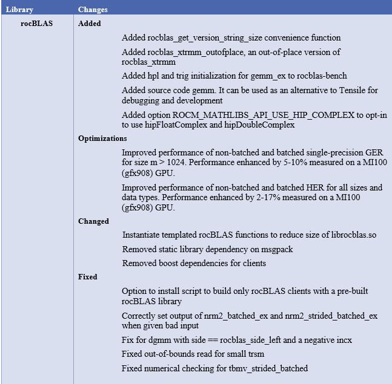
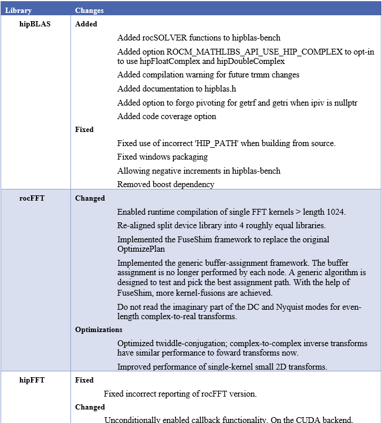
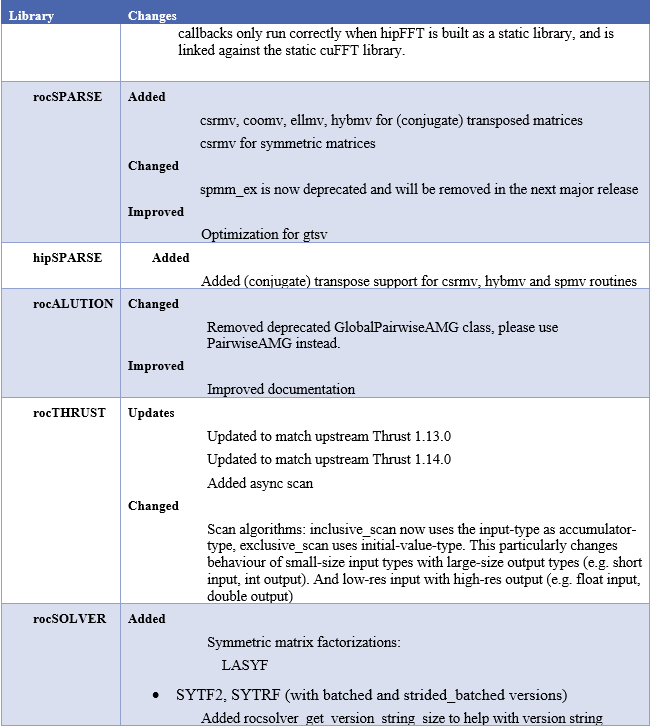
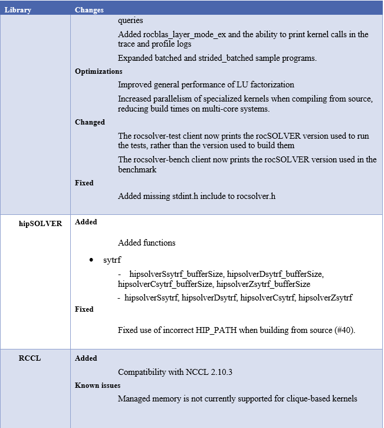
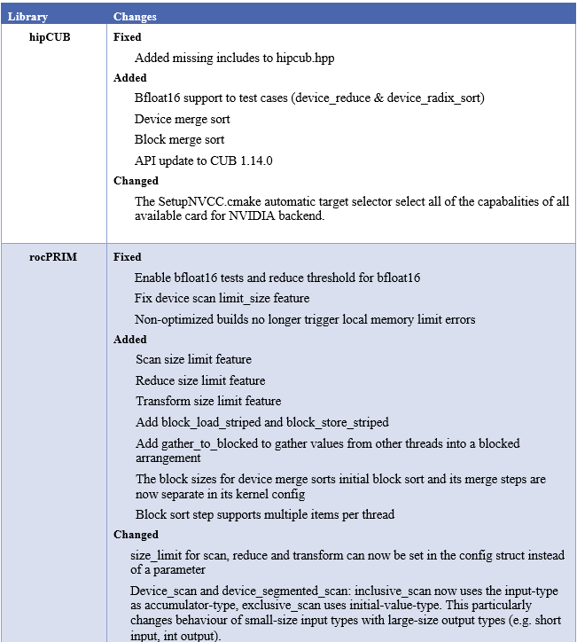
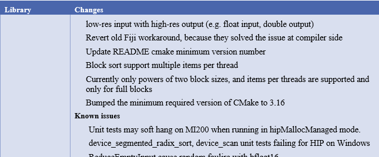

.. image:: /Current_Release_Notes/amdblack.jpg
|

======================================================
New AMD ROCm Information Portal for ROCm v4.5 and Above
======================================================

Beginning ROCm release v5.0, AMD ROCm documentation has a new portal at `https://docs.amd.com <https://docs.amd.com/>`__. This portal consists
of ROCm documentation v4.5 and above.

For documentation prior to ROCm v4.5, you may continue to access `http://rocmdocs.amd.com <http://rocmdocs.amd.com/>`__.

==========================
AMD ROCm™ v5.2.1 Release
==========================
July, 2022

AMD ROCm™ v5.2.1 is released. The release documentation is available at https://docs.amd.com.

==========================
AMD ROCm™ v5.2 Release
==========================
June, 2022

AMD ROCm™ v5.2 is released. The release documentation is available at https://docs.amd.com.

==========================
AMD ROCm™ v5.1.3 Release
==========================
May, 2022

AMD ROCm™ v5.1.3 is released. The release documentation is available at https://docs.amd.com.

==========================
AMD ROCm™ v5.1.1 Release
==========================
April, 2022

AMD ROCm™ v5.1.1 is released. The release documentation is available at https://docs.amd.com.

================================
AMD ROCm™ v5.1 Release Notes
================================
March, 2022

AMD ROCm™ v5.1 is released. The release documentation is available at https://docs.amd.com.

================================
AMD ROCm™ v5.0.2 Release Notes
================================
March, 2022

Fixed Defects in This Release
===============================

The following defects are fixed in the ROCm v5.0.2 release.

Issue with hostcall Facility in HIP Runtime
------------------------------------------------

In ROCm v5.0, when using the “assert()” call in a HIP kernel, the compiler may sometimes fail to emit kernel metadata related to the hostcall facility, which results in incomplete initialization of the hostcall facility in the HIP runtime. This can cause the HIP kernel to crash when it attempts to execute the “assert()” call. 
The root cause was an incorrect check in the compiler to determine whether the hostcall facility is required by the kernel. This is fixed in the ROCm v5.0.2 release. 
The resolution includes a compiler change, which emits the required metadata by default, unless the compiler can prove that the hostcall facility is not required by the kernel. This ensures that the “assert()” call never fails. 

**Note**: This fix may lead to breakage in some OpenMP offload use cases, which use print inside a target region and result in an abort in device code. The issue will be fixed in a future release. 

Compatibility Matrix Updates to ROCm Deep Learning Guide
----------------------------------------------------------

The compatibility matrix in the AMD Deep Learning Guide is updated for ROCm v5.0.2.

For more information and documentation updates, refer to https://docs.amd.com.

================================
AMD ROCm™ Release Notes v5.0.1
================================
February, 2022

Deprecations and Warnings
==========================

Refactor of HIPCC/HIPCONFIG
-----------------------------

In prior ROCm releases, by default, the hipcc/hipconfig Perl scripts were used to identify and set target compiler options, target platform, compiler, and runtime appropriately.

In ROCm v5.0.1, hipcc.bin and hipconfig.bin have been added as the compiled binary implementations of the hipcc and hipconfig. These new binaries are currently a work-in-progress, considered, and marked as experimental. ROCm plans to fully transition to hipcc.bin and hipconfig.bin in the a future ROCm release. The existing hipcc and hipconfig Perl scripts are renamed to hipcc.pl and hipconfig.pl respectively. New top-level hipcc and hipconfig Perl scripts are created, which can switch between the Perl script or the compiled binary based on the environment variable HIPCC_USE_PERL_SCRIPT. 

In ROCm 5.0.1, by default, this environment variable is set to use hipcc and hipconfig through the Perl scripts.

Subsequently, Perl scripts will no longer be available in ROCm in a future release.

ROCM DOCUMENTATION UPDATES FOR ROCM 5.0.1
------------------------------------------

* ROCm Downloads Guide

* ROCm Installation Guide

* ROCm Release Notes

For more information, see  `https://docs.amd.com <https://docs.amd.com/>`__.

================================
AMD ROCm™ Release Notes v5.0
================================
February, 2022

ROCm Installation Updates
=========================

This document describes the features, fixed issues, and information about downloading and installing the AMD ROCm™ software.

It also covers known issues and deprecations in this release.

Notice for Open-source and Closed-source ROCm Repositories in Future Releases
-----------------------------------------------------------------------------

To make a distinction between open-source and closed-source components,
all ROCm repositories will consist of sub-folders in future releases.

-  All open-source components will be placed in the
   *base-url/&lt;rocm-ver&gt;/main* sub-folder
-  All closed-source components will reside in the
   *base-url/&lt;rocm-ver&gt;/ proprietary* sub-folder

List of Supported Operating Systems
-----------------------------------

The AMD ROCm platform supports the following operating systems:

=============================== ===========================
**OS-Version (64-bit)**         **Kernel Versions**
=============================== ===========================
CentOS 8.3                      4.18.0-193.el8
CentOS 7.9                      3.10.0-1127
RHEL 8.5                        4.18.0-348.7.1.el8_5.x86_64
RHEL 8.4                        4.18.0-305.el8.x86_64
RHEL 7.9                        3.10.0-1160.6.1.el7
SLES 15 SP3                     5.3.18-59.16-default
Ubuntu 20.04.3                  5.8.0 LTS / 5.11 HWE
Ubuntu 18.04.5 [5.4 HWE kernel] 5.4.0-71-generic
=============================== ===========================

Support for RHEL v8.5
~~~~~~~~~~~~~~~~~~~~~

This release extends support for RHEL v8.5.

Supported GPUs
~~~~~~~~~~~~~~

Radeon Pro V620 and W6800 Workstation GPUs
^^^^^^^^^^^^^^^^^^^^^^^^^^^^^^^^^^^^^^^^^^

This release extends ROCm support for Radeon Pro V620 and W6800
Workstation GPUs.

-  SRIOV virtualization support for Radeon Pro V620

-  KVM Hypervisor (1VF support only) on Ubuntu Host OS with Ubuntu,
   CentOs, and RHEL Guest

-  Support for ROCm-SMI in an SRIOV environment. For more details, refer
   to the ROCm SMI API documentation.

**Note:** Radeon Pro v620 is not supported on SLES.

ROCm Installation Updates for ROCm v5.0
---------------------------------------

This release has the following ROCm installation enhancements.

Support for Kernel Mode Driver
~~~~~~~~~~~~~~~~~~~~~~~~~~~~~~

In this release, users can install the kernel-mode driver using the
Installer method. Some of the ROCm-specific use cases that the installer
currently supports are:

-  OpenCL (ROCr/KFD based) runtime
-  HIP runtimes
-  ROCm libraries and applications
-  ROCm Compiler and device libraries
-  ROCr runtime and thunk
-  Kernel-mode driver

Support for Multi-version ROCm Installation and Uninstallation
~~~~~~~~~~~~~~~~~~~~~~~~~~~~~~~~~~~~~~~~~~~~~~~~~~~~~~~~~~~~~~

Users now can install multiple ROCm releases simultaneously on a system
using the newly introduced installer script and package manager install
mechanism.

Users can also uninstall multi-version ROCm releases using the
*amdgpu-uninstall* script and package manager.

Support for Updating Information on Local Repositories
~~~~~~~~~~~~~~~~~~~~~~~~~~~~~~~~~~~~~~~~~~~~~~~~~~~~~~

In this release, the *amdgpu-install* script automates the process of
updating local repository information before proceeding to ROCm
installation.

Support for Release Upgrades
~~~~~~~~~~~~~~~~~~~~~~~~~~~~

Users can now upgrade the existing ROCm installation to specific or
latest ROCm releases.

For more details, refer to the AMD ROCm Installation Guide v5.0.

AMD ROCm V5.0 Documentation Updates
===================================

New AMD ROCm Information Portal ROCm v4.5 and Above
-----------------------------------------------------

Beginning ROCm release v5.0, AMD ROCm documentation has a new portal at
`https://docs.amd.com <https://docs.amd.com/>`__. This portal consists
of ROCm documentation v4.5 and above.

For documentation prior to ROCm v4.5, you may continue to access
`http://rocmdocs.amd.com <http://rocmdocs.amd.com/>`__.

Documentation Updates for ROCm 5.0
----------------------------------

Deployment Tools
~~~~~~~~~~~~~~~~

ROCm Data Center Tool Documentation Updates
^^^^^^^^^^^^^^^^^^^^^^^^^^^^^^^^^^^^^^^^^^^

-  ROCm Data Center Tool User Guide
-  ROCm Data Center Tool API Guide

ROCm System Management Interface Updates
^^^^^^^^^^^^^^^^^^^^^^^^^^^^^^^^^^^^^^^^

-  System Management Interface Guide
-  System Management Interface API Guide

ROCm Command Line Interface Updates
^^^^^^^^^^^^^^^^^^^^^^^^^^^^^^^^^^^

-  Command Line Interface Guide

Machine Learning/AI Documentation Updates
~~~~~~~~~~~~~~~~~~~~~~~~~~~~~~~~~~~~~~~~~

-  Deep Learning Guide
-  MIGraphX API Guide
-  MIOpen API Guide
-  MIVisionX API Guide

ROCm Libraries Documentation Updates
~~~~~~~~~~~~~~~~~~~~~~~~~~~~~~~~~~~~

-  hipSOLVER User Guide
-  RCCL User Guide
-  rocALUTION User Guide
-  rocBLAS User Guide
-  rocFFT User Guide
-  rocRAND User Guide
-  rocSOLVER User Guide
-  rocSPARSE User Guide
-  rocThrust User Guide

Compilers and Tools
~~~~~~~~~~~~~~~~~~~

ROCDebugger Documentation Updates
^^^^^^^^^^^^^^^^^^^^^^^^^^^^^^^^^

-  ROCDebugger User Guide
-  ROCDebugger API Guide

ROCTracer
^^^^^^^^^

-  ROCTracer User Guide
-  ROCTracer API Guide

Compilers
^^^^^^^^^

-  AMD Instinct High Performance Computing and Tuning Guide
-  AMD Compiler Reference Guide

HIPify Documentation
^^^^^^^^^^^^^^^^^^^^

-  HIPify User Guide
-  HIP Supported CUDA API Reference Guide

ROCm Debug Agent
^^^^^^^^^^^^^^^^

-  ROCm Debug Agent Guide
-  System Level Debug Guide
-  ROCm Validation Suite

Programming Models Documentation
~~~~~~~~~~~~~~~~~~~~~~~~~~~~~~~~

HIP Documentation
^^^^^^^^^^^^^^^^^

-  HIP Programming Guide
-  HIP API Guide
-  HIP FAQ Guide

OpenMP Documentation
^^^^^^^^^^^^^^^^^^^^

-  OpenMP Support Guide

ROCm Glossary
~~~~~~~~~~~~~

-  ROCm Glossary - Terms and Definitions

AMD ROCm Legacy Documentation Links ROCm v4.3 and Prior
---------------------------------------------------------

-  For AMD ROCm documentation, see

https://rocmdocs.amd.com/en/latest/

-  For installation instructions on supported platforms, see

https://rocmdocs.amd.com/en/latest/Installation_Guide/Installation-Guide.html

-  For AMD ROCm binary structure, see

https://rocmdocs.amd.com/en/latest/Installation_Guide/Software-Stack-for-AMD-GPU.html

-  For AMD ROCm release history, see

*https://rocmdocs.amd.com/en/latest/Current_Release_Notes/ROCm-Version-History.html*

What's New in This Release
==========================

HIP Enhancements
----------------

The ROCm v5.0 release consists of the following HIP enhancements.

HIP Installation Guide Updates
~~~~~~~~~~~~~~~~~~~~~~~~~~~~~~

The HIP Installation Guide is updated to include building HIP from
source on the NVIDIA platform.

Refer to the HIP Installation Guide v5.0 for more details.

Managed Memory Allocation
~~~~~~~~~~~~~~~~~~~~~~~~~

Managed memory, including the ``__managed__`` keyword, is now supported
in the HIP combined host/device compilation. Through unified memory
allocation, managed memory allows data to be shared and accessible to
both the CPU and GPU using a single pointer. The allocation is managed
by the AMD GPU driver using the Linux Heterogeneous Memory Management
(HMM) mechanism. The user can call managed memory API hipMallocManaged
to allocate a large chunk of HMM memory, execute kernels on a device,
and fetch data between the host and device as needed.

**Note:** In a HIP application, it is recommended to do a capability
check before calling the managed memory APIs. For example,

::

   int managed\_memory = 0;

   HIPCHECK(hipDeviceGetAttribute(&amp;managed\_memory,

   hipDeviceAttributeManagedMemory,p\_gpuDevice));

   if (!managed\_memory ) {

   printf (&quot;info: managed memory access not supported on the device %d\n Skipped\n&quot;, p\_gpuDevice);

   }

   else {

   HIPCHECK(hipSetDevice(p\_gpuDevice));

   HIPCHECK(hipMallocManaged(&amp;Hmm, N \* sizeof(T)));

   . . .

   }

**Note:** The managed memory capability check may not be necessary;
however, if HMM is not supported, managed malloc will fall back to using
system memory. Other managed memory API calls will, then, have

Refer to the HIP API documentation for more details on managed memory
APIs.

For the application, see

https://github.com/ROCm-Developer-Tools/HIP/blob/rocm-4.5.x/tests/src/runtimeApi/memory/hipMallocManaged.cpp

New Environment Variable
------------------------

The following new environment variable is added in this release:

+-----------------------+-----------------------+-----------------------+
| **Environment         | **Value**             | **Description**       |
| Variable**            |                       |                       |
+=======================+=======================+=======================+
| **HSA_COOP_CU_COUNT** | 0 or 1 (default is 0) | Some processors       |
|                       |                       | support more CUs than |
|                       |                       | can reliably be used  |
|                       |                       | in a cooperative      |
|                       |                       | dispatch. Setting the |
|                       |                       | environment variable  |
|                       |                       | HSA_COOP_CU_COUNT to  |
|                       |                       | 1 will cause ROCr to  |
|                       |                       | return the correct CU |
|                       |                       | count for cooperative |
|                       |                       | groups through the    |
|                       |                       | HSA_AMD               |
|                       |                       | _AGENT_INFO_COOPERATI |
|                       |                       | VE_COMPUTE_UNIT_COUNT |
|                       |                       | attribute of          |
|                       |                       | hsa_agent_get_info(). |
|                       |                       | Setting               |
|                       |                       | HSA_COOP_CU_COUNT to  |
|                       |                       | other values, or      |
|                       |                       | leaving it unset,     |
|                       |                       | will cause ROCr to    |
|                       |                       | return the same CU    |
|                       |                       | count for the         |
|                       |                       | attributes            |
|                       |                       | HSA_AMD               |
|                       |                       | _AGENT_INFO_COOPERATI |
|                       |                       | VE_COMPUTE_UNIT_COUNT |
|                       |                       | and                   |
|                       |                       | HSA_AMD_AGENT_INF     |
|                       |                       | O_COMPUTE_UNIT_COUNT. |
|                       |                       | Future ROCm releases  |
|                       |                       | will make             |
|                       |                       | HSA_COOP_CU_COUNT=1   |
|                       |                       | the default.          |
+-----------------------+-----------------------+-----------------------+
|                       |                       |                       |
+-----------------------+-----------------------+-----------------------+

ROCm Math and Communication Libraries
-------------------------------------

System Management Interface
---------------------------

Clock Throttling for GPU Events
~~~~~~~~~~~~~~~~~~~~~~~~~~~~~~~

This feature lists GPU events as they occur in real-time and can be used
with *kfdtest* to produce *vm_fault* events for testing.

The command can be called with either " **-e**" or " **-“showevents**"
like this:

::

     **-e** [EVENT [EVENT ...]], **--showevents** [EVENT [EVENT ...]]  Show event list
     

Where "EVENT" is any list combination of ' **VM_FAULT**', '
**THERMAL_THROTTLE**', or ' **GPU_RESET**' and is NOT case sensitive.

**Note:** If no event arguments are passed, all events will be watched
by default.

CLI Commands
^^^^^^^^^^^^

::

   ./rocm-smi --showevents vm\_fault thermal\_throttle gpu\_reset

   =========== ROCm System Management Interface ======================

   ========================== Show Events ============================

   press &#39;q&#39; or &#39;ctrl + c&#39; to quit

   DEVICE          TIME            TYPE            DESCRIPTION

   ========================= End of ROCm SMI Log =====================

   \*run kfdtest in another window to test for vm\_fault events

**Note:** Unlike other rocm-smi CLI commands, this command does not quit
unless specified by the user. Users may press either ' **q**' or '
**ctrl + c**' to quit.

Display XGMI Bandwidth Between Nodes
~~~~~~~~~~~~~~~~~~~~~~~~~~~~~~~~~~~~

The *rsmi_minmax_bandwidth_get* API reads the HW Topology file and
displays bandwidth (min-max) between any two NUMA nodes in a matrix
format.

The Command Line Interface (CLI) command can be called as follows:

::

   ./rocm-smi --shownodesbw

   CLI ---shownodesbw

   usage- We show maximum theoretical xgmi bandwidth between 2 numa nodes

   sample output-

   ================= ROCm System Management Interface ================
    ================= Bandwidth ===================================
    GPU0 GPU1 GPU2 GPU3 GPU4 GPU5 GPU6 GPU7
    GPU0 N/A 50000-200000 50000-50000 0-0 0-0 0-0 50000-100000 0-0
    GPU1 50000-200000 N/A 0-0 50000-50000 0-0 50000-50000 0-0 0-0
    GPU2 50000-50000 0-0 N/A 50000-200000 50000-100000 0-0 0-0 0-0
    GPU3 0-0 50000-50000 50000-200000 N/A 0-0 0-0 0-0 50000-50000
    GPU4 0-0 0-0 50000-100000 0-0 N/A 50000-200000 50000-50000 0-0
    GPU5 0-0 50000-50000 0-0 0-0 50000-200000 N/A 0-0 50000-50000
    GPU6 50000-100000 0-0 0-0 0-0 50000-50000 0-0 N/A 50000-200000
    GPU7 0-0 0-0 0-0 50000-50000 0-0 50000-50000 50000-200000 N/A
    Format: min-max; Units: mps
    

**Note:**\ "0-0" min-max bandwidth indicates devices are not connected
directly.

P2P Connection Status
~~~~~~~~~~~~~~~~~~~~~

The *rsmi_is_p2p_accessible* API returns "True" if P2P can be
implemented between two nodes, and returns "False" if P2P cannot be
implemented between the two nodes.

The Command Line Interface command can be called as follows:

::

   ./rocm-smi -showtopoaccess

   Sample Output:

   ./rocm-smi --showtopoaccess

   ====================== ROCm System Management Interface =======================

   ==================== Link accessibility between two GPUs ======================

   GPU0 GPU1

   GPU0 True True

   GPU1 True True

   ============================= End of ROCm SMI Log ============================

   # Breaking Changes

   ## Runtime Breaking Change

   Re-ordering of the enumerated type in hip\_runtime\_api.h to better match NV.  See below for the difference in enumerated types.

   ROCm software will be affected if any of the defined enums listed below are used in the code.  Applications built with ROCm v5.0 enumerated types will work with a ROCm 4.5.2 driver. However, an undefined behavior error will occur with a ROCm v4.5.2 application that uses these enumerated types with a ROCm 5.0 runtime.

   typedef enum hipDeviceAttribute\_t {

   - hipDeviceAttributeMaxThreadsPerBlock, ///\&lt; Maximum number of threads per block.

   - hipDeviceAttributeMaxBlockDimX, ///\&lt; Maximum x-dimension of a block.

   - hipDeviceAttributeMaxBlockDimY, ///\&lt; Maximum y-dimension of a block.

   - hipDeviceAttributeMaxBlockDimZ, ///\&lt; Maximum z-dimension of a block.

   - hipDeviceAttributeMaxGridDimX, ///\&lt; Maximum x-dimension of a grid.

   - hipDeviceAttributeMaxGridDimY, ///\&lt; Maximum y-dimension of a grid.

   - hipDeviceAttributeMaxGridDimZ, ///\&lt; Maximum z-dimension of a grid.

   - hipDeviceAttributeMaxSharedMemoryPerBlock, ///\&lt; Maximum shared memory available per block in

   - ///\&lt; bytes.

   - hipDeviceAttributeTotalConstantMemory, ///\&lt; Constant memory size in bytes.

   - hipDeviceAttributeWarpSize, ///\&lt; Warp size in threads.

   - hipDeviceAttributeMaxRegistersPerBlock, ///\&lt; Maximum number of 32-bit registers available to a

   - ///\&lt; thread block. This number is shared by all thread

   - ///\&lt; blocks simultaneously resident on a

   - ///\&lt; multiprocessor.

   - hipDeviceAttributeClockRate, ///\&lt; Peak clock frequency in kilohertz.

   - hipDeviceAttributeMemoryClockRate, ///\&lt; Peak memory clock frequency in kilohertz.

   - hipDeviceAttributeMemoryBusWidth, ///\&lt; Global memory bus width in bits.

   - hipDeviceAttributeMultiprocessorCount, ///\&lt; Number of multiprocessors on the device.

   - hipDeviceAttributeComputeMode, ///\&lt; Compute mode that device is currently in.

   - hipDeviceAttributeL2CacheSize, ///\&lt; Size of L2 cache in bytes. 0 if the device doesn&#39;t have L2

   - ///\&lt; cache.

   - hipDeviceAttributeMaxThreadsPerMultiProcessor, ///\&lt; Maximum resident threads per

   - ///\&lt; multiprocessor.

   - hipDeviceAttributeComputeCapabilityMajor, ///\&lt; Major compute capability version number.

   - hipDeviceAttributeComputeCapabilityMinor, ///\&lt; Minor compute capability version number.

   - hipDeviceAttributeConcurrentKernels, ///\&lt; Device can possibly execute multiple kernels

   - ///\&lt; concurrently.

   - hipDeviceAttributePciBusId, ///\&lt; PCI Bus ID.

   - hipDeviceAttributePciDeviceId, ///\&lt; PCI Device ID.

   - hipDeviceAttributeMaxSharedMemoryPerMultiprocessor, ///\&lt; Maximum Shared Memory Per

   - ///\&lt; Multiprocessor.

   - hipDeviceAttributeIsMultiGpuBoard, ///\&lt; Multiple GPU devices.

   - hipDeviceAttributeIntegrated, ///\&lt; iGPU

   - hipDeviceAttributeCooperativeLaunch, ///\&lt; Support cooperative launch

   - hipDeviceAttributeCooperativeMultiDeviceLaunch, ///\&lt; Support cooperative launch on multiple devices

   - hipDeviceAttributeMaxTexture1DWidth, ///\&lt; Maximum number of elements in 1D images

   - hipDeviceAttributeMaxTexture2DWidth, ///\&lt; Maximum dimension width of 2D images in image elements

   - hipDeviceAttributeMaxTexture2DHeight, ///\&lt; Maximum dimension height of 2D images in image elements

   - hipDeviceAttributeMaxTexture3DWidth, ///\&lt; Maximum dimension width of 3D images in image elements

   - hipDeviceAttributeMaxTexture3DHeight, ///\&lt; Maximum dimensions height of 3D images in image elements

   - hipDeviceAttributeMaxTexture3DDepth, ///\&lt; Maximum dimensions depth of 3D images in image elements

   + hipDeviceAttributeCudaCompatibleBegin = 0,

   - hipDeviceAttributeHdpMemFlushCntl, ///\&lt; Address of the HDP\_MEM\_COHERENCY\_FLUSH\_CNTL register

   - hipDeviceAttributeHdpRegFlushCntl, ///\&lt; Address of the HDP\_REG\_COHERENCY\_FLUSH\_CNTL register

   + hipDeviceAttributeEccEnabled = hipDeviceAttributeCudaCompatibleBegin, ///\&lt; Whether ECC support is enabled.

   + hipDeviceAttributeAccessPolicyMaxWindowSize, ///\&lt; Cuda only. The maximum size of the window policy in bytes.

   + hipDeviceAttributeAsyncEngineCount, ///\&lt; Cuda only. Asynchronous engines number.

   + hipDeviceAttributeCanMapHostMemory, ///\&lt; Whether host memory can be mapped into device address space

   + hipDeviceAttributeCanUseHostPointerForRegisteredMem,///\&lt; Cuda only. Device can access host registered memory

   + ///\&lt; at the same virtual address as the CPU

   + hipDeviceAttributeClockRate, ///\&lt; Peak clock frequency in kilohertz.

   + hipDeviceAttributeComputeMode, ///\&lt; Compute mode that device is currently in.

   + hipDeviceAttributeComputePreemptionSupported, ///\&lt; Cuda only. Device supports Compute Preemption.

   + hipDeviceAttributeConcurrentKernels, ///\&lt; Device can possibly execute multiple kernels concurrently.

   + hipDeviceAttributeConcurrentManagedAccess, ///\&lt; Device can coherently access managed memory concurrently with the CPU

   + hipDeviceAttributeCooperativeLaunch, ///\&lt; Support cooperative launch

   + hipDeviceAttributeCooperativeMultiDeviceLaunch, ///\&lt; Support cooperative launch on multiple devices

   + hipDeviceAttributeDeviceOverlap, ///\&lt; Cuda only. Device can concurrently copy memory and execute a kernel.

   + ///\&lt; Deprecated. Use instead asyncEngineCount.

   + hipDeviceAttributeDirectManagedMemAccessFromHost, ///\&lt; Host can directly access managed memory on

   + ///\&lt; the device without migration

   + hipDeviceAttributeGlobalL1CacheSupported, ///\&lt; Cuda only. Device supports caching globals in L1

   + hipDeviceAttributeHostNativeAtomicSupported, ///\&lt; Cuda only. Link between the device and the host supports native atomic operations

   + hipDeviceAttributeIntegrated, ///\&lt; Device is integrated GPU

   + hipDeviceAttributeIsMultiGpuBoard, ///\&lt; Multiple GPU devices.

   + hipDeviceAttributeKernelExecTimeout, ///\&lt; Run time limit for kernels executed on the device

   + hipDeviceAttributeL2CacheSize, ///\&lt; Size of L2 cache in bytes. 0 if the device doesn&#39;t have L2 cache.

   + hipDeviceAttributeLocalL1CacheSupported, ///\&lt; caching locals in L1 is supported

   + hipDeviceAttributeLuid, ///\&lt; Cuda only. 8-byte locally unique identifier in 8 bytes. Undefined on TCC and non-Windows platforms

   + hipDeviceAttributeLuidDeviceNodeMask, ///\&lt; Cuda only. Luid device node mask. Undefined on TCC and non-Windows platforms

   + hipDeviceAttributeComputeCapabilityMajor, ///\&lt; Major compute capability version number.

   + hipDeviceAttributeManagedMemory, ///\&lt; Device supports allocating managed memory on this system

   + hipDeviceAttributeMaxBlocksPerMultiProcessor, ///\&lt; Cuda only. Max block size per multiprocessor

   + hipDeviceAttributeMaxBlockDimX, ///\&lt; Max block size in width.

   + hipDeviceAttributeMaxBlockDimY, ///\&lt; Max block size in height.

   + hipDeviceAttributeMaxBlockDimZ, ///\&lt; Max block size in depth.

   + hipDeviceAttributeMaxGridDimX, ///\&lt; Max grid size in width.

   + hipDeviceAttributeMaxGridDimY, ///\&lt; Max grid size in height.

   + hipDeviceAttributeMaxGridDimZ, ///\&lt; Max grid size in depth.

   + hipDeviceAttributeMaxSurface1D, ///\&lt; Maximum size of 1D surface.

   + hipDeviceAttributeMaxSurface1DLayered, ///\&lt; Cuda only. Maximum dimensions of 1D layered surface.

   + hipDeviceAttributeMaxSurface2D, ///\&lt; Maximum dimension (width, height) of 2D surface.

   + hipDeviceAttributeMaxSurface2DLayered, ///\&lt; Cuda only. Maximum dimensions of 2D layered surface.

   + hipDeviceAttributeMaxSurface3D, ///\&lt; Maximum dimension (width, height, depth) of 3D surface.

   + hipDeviceAttributeMaxSurfaceCubemap, ///\&lt; Cuda only. Maximum dimensions of Cubemap surface.

   + hipDeviceAttributeMaxSurfaceCubemapLayered, ///\&lt; Cuda only. Maximum dimension of Cubemap layered surface.

   + hipDeviceAttributeMaxTexture1DWidth, ///\&lt; Maximum size of 1D texture.

   + hipDeviceAttributeMaxTexture1DLayered, ///\&lt; Cuda only. Maximum dimensions of 1D layered texture.

   + hipDeviceAttributeMaxTexture1DLinear, ///\&lt; Maximum number of elements allocatable in a 1D linear texture.

   + ///\&lt; Use cudaDeviceGetTexture1DLinearMaxWidth() instead on Cuda.

   + hipDeviceAttributeMaxTexture1DMipmap, ///\&lt; Cuda only. Maximum size of 1D mipmapped texture.

   + hipDeviceAttributeMaxTexture2DWidth, ///\&lt; Maximum dimension width of 2D texture.

   + hipDeviceAttributeMaxTexture2DHeight, ///\&lt; Maximum dimension hight of 2D texture.

   + hipDeviceAttributeMaxTexture2DGather, ///\&lt; Cuda only. Maximum dimensions of 2D texture if gather operations performed.

   + hipDeviceAttributeMaxTexture2DLayered, ///\&lt; Cuda only. Maximum dimensions of 2D layered texture.

   + hipDeviceAttributeMaxTexture2DLinear, ///\&lt; Cuda only. Maximum dimensions (width, height, pitch) of 2D textures bound to pitched memory.

   + hipDeviceAttributeMaxTexture2DMipmap, ///\&lt; Cuda only. Maximum dimensions of 2D mipmapped texture.

   + hipDeviceAttributeMaxTexture3DWidth, ///\&lt; Maximum dimension width of 3D texture.

   + hipDeviceAttributeMaxTexture3DHeight, ///\&lt; Maximum dimension height of 3D texture.

   + hipDeviceAttributeMaxTexture3DDepth, ///\&lt; Maximum dimension depth of 3D texture.

   + hipDeviceAttributeMaxTexture3DAlt, ///\&lt; Cuda only. Maximum dimensions of alternate 3D texture.

   + hipDeviceAttributeMaxTextureCubemap, ///\&lt; Cuda only. Maximum dimensions of Cubemap texture

   + hipDeviceAttributeMaxTextureCubemapLayered, ///\&lt; Cuda only. Maximum dimensions of Cubemap layered texture.

   + hipDeviceAttributeMaxThreadsDim, ///\&lt; Maximum dimension of a block

   + hipDeviceAttributeMaxThreadsPerBlock, ///\&lt; Maximum number of threads per block.

   + hipDeviceAttributeMaxThreadsPerMultiProcessor, ///\&lt; Maximum resident threads per multiprocessor.

   + hipDeviceAttributeMaxPitch, ///\&lt; Maximum pitch in bytes allowed by memory copies

   + hipDeviceAttributeMemoryBusWidth, ///\&lt; Global memory bus width in bits.

   + hipDeviceAttributeMemoryClockRate, ///\&lt; Peak memory clock frequency in kilohertz.

   + hipDeviceAttributeComputeCapabilityMinor, ///\&lt; Minor compute capability version number.

   + hipDeviceAttributeMultiGpuBoardGroupID, ///\&lt; Cuda only. Unique ID of device group on the same multi-GPU board

   + hipDeviceAttributeMultiprocessorCount, ///\&lt; Number of multiprocessors on the device.

   + hipDeviceAttributeName, ///\&lt; Device name.

   + hipDeviceAttributePageableMemoryAccess, ///\&lt; Device supports coherently accessing pageable memory

   + ///\&lt; without calling hipHostRegister on it

   + hipDeviceAttributePageableMemoryAccessUsesHostPageTables, ///\&lt; Device accesses pageable memory via the host&#39;s page tables

   + hipDeviceAttributePciBusId, ///\&lt; PCI Bus ID.

   + hipDeviceAttributePciDeviceId, ///\&lt; PCI Device ID.

   + hipDeviceAttributePciDomainID, ///\&lt; PCI Domain ID.

   + hipDeviceAttributePersistingL2CacheMaxSize, ///\&lt; Cuda11 only. Maximum l2 persisting lines capacity in bytes

   + hipDeviceAttributeMaxRegistersPerBlock, ///\&lt; 32-bit registers available to a thread block. This number is shared

   + ///\&lt; by all thread blocks simultaneously resident on a multiprocessor.

   + hipDeviceAttributeMaxRegistersPerMultiprocessor, ///\&lt; 32-bit registers available per block.

   + hipDeviceAttributeReservedSharedMemPerBlock, ///\&lt; Cuda11 only. Shared memory reserved by CUDA driver per block.

   + hipDeviceAttributeMaxSharedMemoryPerBlock, ///\&lt; Maximum shared memory available per block in bytes.

   + hipDeviceAttributeSharedMemPerBlockOptin, ///\&lt; Cuda only. Maximum shared memory per block usable by special opt in.

   + hipDeviceAttributeSharedMemPerMultiprocessor, ///\&lt; Cuda only. Shared memory available per multiprocessor.

   + hipDeviceAttributeSingleToDoublePrecisionPerfRatio, ///\&lt; Cuda only. Performance ratio of single precision to double precision.

   + hipDeviceAttributeStreamPrioritiesSupported, ///\&lt; Cuda only. Whether to support stream priorities.

   + hipDeviceAttributeSurfaceAlignment, ///\&lt; Cuda only. Alignment requirement for surfaces

   + hipDeviceAttributeTccDriver, ///\&lt; Cuda only. Whether device is a Tesla device using TCC driver

   + hipDeviceAttributeTextureAlignment, ///\&lt; Alignment requirement for textures

   + hipDeviceAttributeTexturePitchAlignment, ///\&lt; Pitch alignment requirement for 2D texture references bound to pitched memory;

   + hipDeviceAttributeTotalConstantMemory, ///\&lt; Constant memory size in bytes.

   + hipDeviceAttributeTotalGlobalMem, ///\&lt; Global memory available on devicice.

   + hipDeviceAttributeUnifiedAddressing, ///\&lt; Cuda only. An unified address space shared with the host.

   + hipDeviceAttributeUuid, ///\&lt; Cuda only. Unique ID in 16 byte.

   + hipDeviceAttributeWarpSize, ///\&lt; Warp size in threads.

   - hipDeviceAttributeMaxPitch, ///\&lt; Maximum pitch in bytes allowed by memory copies

   - hipDeviceAttributeTextureAlignment, ///\&lt;Alignment requirement for textures

   - hipDeviceAttributeTexturePitchAlignment, ///\&lt;Pitch alignment requirement for 2D texture references bound to pitched memory;

   - hipDeviceAttributeKernelExecTimeout, ///\&lt;Run time limit for kernels executed on the device

   - hipDeviceAttributeCanMapHostMemory, ///\&lt;Device can map host memory into device address space

   - hipDeviceAttributeEccEnabled, ///\&lt;Device has ECC support enabled

   + hipDeviceAttributeCudaCompatibleEnd = 9999,

   + hipDeviceAttributeAmdSpecificBegin = 10000,

   - hipDeviceAttributeCooperativeMultiDeviceUnmatchedFunc, ///\&lt; Supports cooperative launch on multiple

   - ///devices with unmatched functions

   - hipDeviceAttributeCooperativeMultiDeviceUnmatchedGridDim, ///\&lt; Supports cooperative launch on multiple

   - ///devices with unmatched grid dimensions

   - hipDeviceAttributeCooperativeMultiDeviceUnmatchedBlockDim, ///\&lt; Supports cooperative launch on multiple

   - ///devices with unmatched block dimensions

   - hipDeviceAttributeCooperativeMultiDeviceUnmatchedSharedMem, ///\&lt; Supports cooperative launch on multiple

   - ///devices with unmatched shared memories

   - hipDeviceAttributeAsicRevision, ///\&lt; Revision of the GPU in this device

   - hipDeviceAttributeManagedMemory, ///\&lt; Device supports allocating managed memory on this system

   - hipDeviceAttributeDirectManagedMemAccessFromHost, ///\&lt; Host can directly access managed memory on

   - /// the device without migration

   - hipDeviceAttributeConcurrentManagedAccess, ///\&lt; Device can coherently access managed memory

   - /// concurrently with the CPU

   - hipDeviceAttributePageableMemoryAccess, ///\&lt; Device supports coherently accessing pageable memory

   - /// without calling hipHostRegister on it

   - hipDeviceAttributePageableMemoryAccessUsesHostPageTables, ///\&lt; Device accesses pageable memory via

   - /// the host&#39;s page tables

   - hipDeviceAttributeCanUseStreamWaitValue ///\&lt; &#39;1&#39; if Device supports hipStreamWaitValue32() and

   - ///\&lt; hipStreamWaitValue64() , &#39;0&#39; otherwise.

   + hipDeviceAttributeClockInstructionRate = hipDeviceAttributeAmdSpecificBegin, ///\&lt; Frequency in khz of the timer used by the device-side &quot;clock\*&quot;

   + hipDeviceAttributeArch, ///\&lt; Device architecture

   + hipDeviceAttributeMaxSharedMemoryPerMultiprocessor, ///\&lt; Maximum Shared Memory PerMultiprocessor.

   + hipDeviceAttributeGcnArch, ///\&lt; Device gcn architecture

   + hipDeviceAttributeGcnArchName, ///\&lt; Device gcnArch name in 256 bytes

   + hipDeviceAttributeHdpMemFlushCntl, ///\&lt; Address of the HDP\_MEM\_COHERENCY\_FLUSH\_CNTL register

   + hipDeviceAttributeHdpRegFlushCntl, ///\&lt; Address of the HDP\_REG\_COHERENCY\_FLUSH\_CNTL register

   + hipDeviceAttributeCooperativeMultiDeviceUnmatchedFunc, ///\&lt; Supports cooperative launch on multiple

   + ///\&lt; devices with unmatched functions

   + hipDeviceAttributeCooperativeMultiDeviceUnmatchedGridDim, ///\&lt; Supports cooperative launch on multiple

   + ///\&lt; devices with unmatched grid dimensions

   + hipDeviceAttributeCooperativeMultiDeviceUnmatchedBlockDim, ///\&lt; Supports cooperative launch on multiple

   + ///\&lt; devices with unmatched block dimensions

   + hipDeviceAttributeCooperativeMultiDeviceUnmatchedSharedMem, ///\&lt; Supports cooperative launch on multiple

   + ///\&lt; devices with unmatched shared memories

   + hipDeviceAttributeIsLargeBar, ///\&lt; Whether it is LargeBar

   + hipDeviceAttributeAsicRevision, ///\&lt; Revision of the GPU in this device

   + hipDeviceAttributeCanUseStreamWaitValue, ///\&lt; &#39;1&#39; if Device supports hipStreamWaitValue32() and

   + ///\&lt; hipStreamWaitValue64() , &#39;0&#39; otherwise.

   + hipDeviceAttributeAmdSpecificEnd = 19999,

   + hipDeviceAttributeVendorSpecificBegin = 20000,

   + // Extended attributes for vendors

   } hipDeviceAttribute\_t;

   enum hipComputeMode {

Known Issues in This Release
============================

Incorrect dGPU Behavior When Using AMDVBFlash Tool
--------------------------------------------------

The AMDVBFlash tool, used for flashing the VBIOS image to dGPU, does not
communicate with the ROM Controller specifically when the driver is
present. This is because the driver, as part of its runtime power
management feature, puts the dGPU to a sleep state.

As a workaround, users can run *amdgpu.runpm=0*, which temporarily
disables the runtime power management feature from the driver and
dynamically changes some power control-related sysfs files.

Issue with START Timestamp in ROCProfiler
-----------------------------------------

Users may encounter an issue with the enabled timestamp functionality
for monitoring one or multiple counters. ROCProfiler outputs the
following four timestamps for each kernel:

-  Dispatch
-  Start
-  End
-  Complete

**Issue**

This defect is related to the Start timestamp functionality, which
incorrectly shows an earlier time than the Dispatch timestamp.

To reproduce the issue,

1. Enable timing using the --timestamp on* flag_.\_
2. Use the *-i* option with the input filename that contains the name of
   the counter(s) to monitor.
3. Run the program.
4. Check the output result file.

**Current behavior**

BeginNS is lower than DispatchNS, which is incorrect.

**Expected behavior**

The correct order is:

*Dispatch &lt; Start &lt; End &lt; Complete*

Users cannot use ROCProfiler to measure the time spent on each kernel
because of the incorrect timestamp with counter collection enabled.

**Recommended Workaround**

Users are recommended to collect kernel execution timestamps without
monitoring counters, as follows:

1. Enable timing using the *–timestamp on* flag, and run the
   application.
2. Rerun the application using the *-i* option with the input filename
   that contains the name of the counter(s) to monitor, and save this to
   a different output file using the *-o* flag.
3. Check the output result file from step 1.
4. The order of timestamps correctly displays as:

*DispathNS &lt; BeginNS &lt; EndNS &lt; CompleteNS*

5. Users can find the values of the collected counters in the output
   file generated in step 2.

.. _radeon-pro-v620-and-w6800-workstation-gpus-1:

Radeon Pro V620 and W6800 Workstation GPUs
------------------------------------------

No Support for SMI and ROCDebugger on SRIOV
~~~~~~~~~~~~~~~~~~~~~~~~~~~~~~~~~~~~~~~~~~~

System Management Interface (SMI) and ROCDebugger are not supported in
the SRIOV environment on any GPU. For more information, refer to the
Systems Management Interface documentation.

Deprecations and Warnings in This Release
=========================================

ROCm Libraries Changes Deprecations and Deprecation Removal
-------------------------------------------------------------

-  The hipFFT.h header is now provided only by the hipFFT package. Up to
   ROCm 5.0, users would get hipFFT.h in the rocFFT package too.
-  The GlobalPairwiseAMG class is now entirely removed, users should use
   the PairwiseAMG class instead.
-  The rocsparse_spmm signature in 5.0 was changed to match that of
   rocsparse_spmm_ex. In 5.0, rocsparse_spmm_ex is still present, but
   deprecated. Signature diff for rocsparse_spmm

*rocsparse_spmm in 5.0*
~~~~~~~~~~~~~~~~~~~~~~~

rocsparse_status rocsparse_spmm(rocsparse_handle handle,

::

                               rocsparse\_operation         trans\_A,

                               rocsparse\_operation         trans\_B,

                               const void\*                 alpha,

                               const rocsparse\_spmat\_descr mat\_A,

                               const rocsparse\_dnmat\_descr mat\_B,

                               const void\*                 beta,

                               const rocsparse\_dnmat\_descr mat\_C,

                               rocsparse\_datatype          compute\_type,

                               rocsparse\_spmm\_alg          alg,

                               rocsparse\_spmm\_stage        stage,

                               size\_t\*                     buffer\_size,

                               void\*                       temp\_buffer);

*rocSPARSE_spmm in 4.0*
~~~~~~~~~~~~~~~~~~~~~~~

rocsparse_status rocsparse_spmm(rocsparse_handle handle,

::

                               rocsparse\_operation         trans\_A,

                               rocsparse\_operation         trans\_B,

                               const void\*                 alpha,

                               const rocsparse\_spmat\_descr mat\_A,

                               const rocsparse\_dnmat\_descr mat\_B,

                               const void\*                 beta,

                               const rocsparse\_dnmat\_descr mat\_C,

                               rocsparse\_datatype          compute\_type,

                               rocsparse\_spmm\_alg          alg,

                               size\_t\*                     buffer\_size,

                               void\*                       temp\_buffer);

HIP API Deprecations and Warnings
---------------------------------

Warning - Arithmetic Operators of HIP Complex and Vector Types
~~~~~~~~~~~~~~~~~~~~~~~~~~~~~~~~~~~~~~~~~~~~~~~~~~~~~~~~~~~~~~

In this release, arithmetic operators of HIP complex and vector types
are deprecated.

-  As alternatives to arithmetic operators of HIP complex types, users
   can use arithmetic operators of std::complex types.
-  As alternatives to arithmetic operators of HIP vector types, users
   can use the operators of the native clang vector type associated with
   the data member of HIP vector types.

During the deprecation, two macros_HIP_ENABLE_COMPLEX_OPERATORS
and_HIP_ENABLE_VECTOR_OPERATORS are provided to allow users to
conditionally enable arithmetic operators of HIP complex or vector
types.

Note, the two macros are mutually exclusive and, by default, set to
*Off*.

The arithmetic operators of HIP complex and vector types will be removed
in a future release.

Refer to the HIP API Guide for more information.

Refactor of HIPCC/HIPCONFIG
~~~~~~~~~~~~~~~~~~~~~~~~~~~

In prior ROCm releases, by default, the hipcc/hipconfig Perl scripts
were used to identify and set target compiler options, target platform,
compiler, and runtime appropriately.

In ROCm v5.0, hipcc.bin and hipconfig.bin have been added as the
compiled binary implementations of the hipcc and hipconfig. These new
binaries are currently a work-in-progress, considered, and marked as
experimental. ROCm plans to fully transition to hipcc.bin and
hipconfig.bin in the a future ROCm release. The existing hipcc and
hipconfig Perl scripts are renamed to hipcc.pl and hipconfig.pl
respectively. New top-level hipcc and hipconfig Perl scripts are
created, which can switch between the Perl script or the compiled binary
based on the environment variable HIPCC_USE_PERL_SCRIPT.

In ROCm 5.0, by default, this environment variable is set to use hipcc
and hipconfig through the Perl scripts.

Subsequently, Perl scripts will no longer be available in ROCm in a
future release.

Warning - Compiler-Generated Code Object Version 4 Deprecation
--------------------------------------------------------------

Support for loading compiler-generated code object version 4 will be
deprecated in a future release with no release announcement and replaced
with code object 5 as the default version.

The current default is code object version 4.

Warning - MIOpenTensile Deprecation
-----------------------------------

MIOpenTensile will be deprecated in a future release.

Disclaimer
==========

The information presented in this document is for informational purposes
only and may contain technical inaccuracies, omissions, and
typographical errors. The information contained herein is subject to
change and may be rendered inaccurate for many reasons, including but
not limited to product and roadmap changes, component and motherboard
versionchanges, new model and/or product releases, product differences
between differing manufacturers, software changes, BIOS flashes,
firmware upgrades, or the like. Any computer system has risks of
security vulnerabilities that cannot be completely prevented or
mitigated.AMD assumes no obligation to update or otherwise correct or
revise this information. However, AMD reserves the right to revise this
information and to make changes from time to time to the content hereof
without obligation of AMD to notify any person of such revisions or
changes.THIS INFORMATION IS PROVIDED ‘AS IS.” AMD MAKES NO
REPRESENTATIONS OR WARRANTIES WITH RESPECT TO THE CONTENTS HEREOF AND
ASSUMES NO RESPONSIBILITY FOR ANY INACCURACIES, ERRORS, OR OMISSIONS
THAT MAY APPEAR IN THIS INFORMATION. AMD SPECIFICALLY DISCLAIMS ANY
IMPLIED WARRANTIES OF NON-INFRINGEMENT, MERCHANTABILITY, OR FITNESS FOR
ANY PARTICULAR PURPOSE. IN NO EVENT WILL AMD BE LIABLE TO ANY PERSON FOR
ANY RELIANCE, DIRECT, INDIRECT, SPECIAL, OR OTHER CONSEQUENTIAL DAMAGES
ARISING FROM THE USE OF ANY INFORMATION CONTAINED HEREIN, EVEN IF AMD IS
EXPRESSLY ADVISED OF THE POSSIBILITY OF SUCH DAMAGES.AMD, the AMD Arrow
logo, and combinations thereof are trademarks of Advanced Micro Devices,
Inc.Other product names used in this publication are for identification
purposes only and may be trademarks of their respective companies.
©[2021]Advanced Micro Devices, Inc.All rights reserved.

Third-party Disclaimer
----------------------

Third-party content is licensed to you directly by the third party that
owns the content and is not licensed to you by AMD. ALL LINKED
THIRD-PARTY CONTENT IS PROVIDED “AS IS” WITHOUT A WARRANTY OF ANY KIND.
USE OF SUCH THIRD-PARTY CONTENT IS DONE AT YOUR SOLE DISCRETION AND
UNDER NO CIRCUMSTANCES WILL AMD BE LIABLE TO YOU FOR ANY THIRD-PARTY
CONTENT. YOU ASSUME ALL RISK AND ARE SOLELY RESPONSIBLE FOR ANY DAMAGES
THAT MAY ARISE FROM YOUR USE OF THIRD-PARTY CONTENT.
