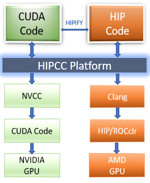
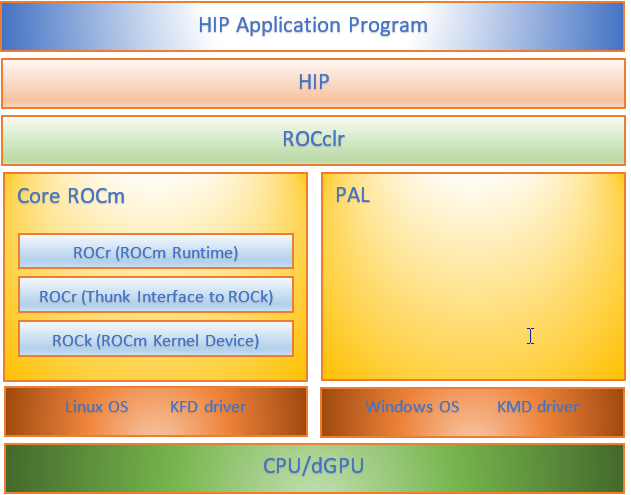
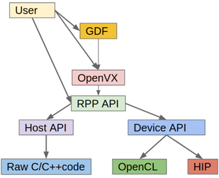

.. image:: /Current_Release_Notes/amdblack.jpg

|

=============================================================
AMD Radeon Open Compute platforM (ROCm) Release Notes v3.5
=============================================================
June 03, 2020

AMD ROCm Release Notes v3.5
=============================

This page describes the features, fixed issues, and information about
downloading and installing the ROCm software. It also covers known
issues and deprecated features in the ROCm v3.5.0 release.

-  `Supported Operating Systems and Documentation
   Updates <#Supported-Operating-Systems-and-Documentation-Updates>`__

   -  `Supported Operating Systems <#Supported-Operating-Systems>`__
   -  `Documentation Updates <#Documentation-Updates>`__

-  `What's New in This Release <#Whats-New-in-This-Release>`__

   -  `Upgrading to This Release <#Upgrading-to-This-Release>`__
   -  `Heterogeneous-Compute Interface for Portability <#Heterogeneous-Compute-Interface-for-Portability>`__
   -  `Radeon Open Compute Common Language Runtime <#Radeon-Open-Compute-Common-Language-Runtime>`__
   -  `OpenCL Runtime <#OpenCL-Runtime>`__
   -  `AMD ROCm GNU Debugger-ROCgdb <#AMD-ROCm-GNU-Debugger-ROCgdb>`__
   -  `AMD ROCm Debugger API Library <#AMD-ROCm-Debugger-API-Library>`_
   -  `rocProfiler Dispatch Callbacks Start-Stop API <#rocProfiler-Dispatch-Callbacks-Start-Stop-API>`__
   -  `ROCm Communications Collective Library <#ROCm-Communications-Collective-Library>`__
   -  `NVIDIA Communications Collective Library Version Compatibility<#NVIDIA-Communications-Collective-Library-Version -Compatibility>`__
   -  `MIOpen - Optional Kernel Package Installation <#MIOpen-Optional-Kernel-Package-Installation>`__
   -  `New SMI Event Interface and Library <#New-SMI-Event-Interface-and-Library>`__
   -  `API for CPU Affinity <#API-for-CPU-Affinity>`__
   -  `Radeon Performance Primitives Library <#Radeon-Performance-Primitives-Library>`__

-  `Fixed Issues <#Fixed-Issues>`__

-  `Known Issues <#Known-Issues>`__

-  `Deprecations <#Deprecations>`__

   -  `Heterogeneous Compute
      Compiler <#Heterogeneous-Compute-Compiler>`__

-  `Deploying ROCm <#Deploying-ROCm>`__

-  `Hardware and Software Support <#Hardware-and-Software-Support>`__

-  `Machine Learning and High Performance Computing Software Stack for
   AMD
   GPU <#Machine-Learning-and-High-Performance-Computing-Software-Stack-for-AMD-GPU>`__

   -  `ROCm Binary Package Structure <#ROCm-Binary-Package-Structure>`__
   -  `ROCm Platform Packages <#ROCm-Platform-Packages>`__

Supported Operating Systems and Documentation Updates
=====================================================

Supported Operating Systems
---------------------------

The AMD ROCm v3.5.x platform is designed to support the following
operating systems:

-  Ubuntu 16.04.6(Kernel 4.15) and 18.04.4(Kernel 5.3)
-  CentOS 7.7 (Kernel 3.10-1062) and RHEL 7.8(Kernel 3.10.0-1127)(Using
   devtoolset-7 runtime support)
-  SLES 15 SP1
-  CentOS and RHEL 8.1(Kernel 4.18.0-147)

**NOTE**: Framework support (TensorFlow, pyTorch & Caffe2) for v8.1 is
not available.

Documentation Updates
---------------------

HIP-Clang Compile
~~~~~~~~~~~~~~~~~

-  `HIP FAQ - Transition from HCC to
   HIP-Clang <https://rocmdocs.amd.com/en/latest/Programming_Guides/HIP-FAQ.html#hip-faq>`__
-  `HIP-Clang Porting
   Guide <https://rocmdocs.amd.com/en/latest/Programming_Guides/HIP-porting-guide.html#hip-porting-guide>`__
-  `HIP - Glossary of
   Terms <https://rocmdocs.amd.com/en/latest/ROCm_Glossary/ROCm-Glossary.html>`__

AMD ROCDebugger (ROCbdg)
~~~~~~~~~~~~~~~~~~~~~~~~

-  `ROCgdb User Guide <https://github.com/RadeonOpenCompute/ROCm/blob/master/gdb.pdf>`__

-  `ROCgdbapi Guide <https://github.com/RadeonOpenCompute/ROCm/blob/master/amd-dbgapi.pdf>`__

AMD ROCm Systems Management Interface
~~~~~~~~~~~~~~~~~~~~~~~~~~~~~~~~~~~~~

-  `System Management Interface Event API Guide <https://github.com/RadeonOpenCompute/ROCm/blob/master/ROCm_SMI_Manual.pdf>`__

AMD ROCm Deep Learning
~~~~~~~~~~~~~~~~~~~~~~

-  `MIOpen API <https://github.com/ROCmSoftwarePlatform/MIOpen>`__

AMD ROCm Glossary of Terms
~~~~~~~~~~~~~~~~~~~~~~~~~~

-  `Updated Glossary of Terms and
   Definitions <https://rocmdocs.amd.com/en/latest/ROCm_Glossary/ROCm-Glossary.html>`__

General AMD ROCm Documentatin Links
~~~~~~~~~~~~~~~~~~~~~~~~~~~~~~~~~~~

Access the following links for more information on:

-  For AMD ROCm documentation, see

   https://rocmdocs.amd.com/en/latest/

-  For installation instructions on supported platforms, see

   https://rocmdocs.amd.com/en/latest/Installation_Guide/Installation-Guide.html

-  For AMD ROCm binary structure, see

   https://rocmdocs.amd.com/en/latest/Installation_Guide/Installation-Guide.html#machine-learning-and-high-performance-computing-software-stack-for-amd-gpu-v3-3-0

-  For AMD ROCm Release History, see

   https://rocmdocs.amd.com/en/latest/Installation_Guide/Installation-Guide.html#amd-rocm-version-history

What's New in This Release
==========================

Upgrading to This Release
~~~~~~~~~~~~~~~~~~~~~~~~~~~~~~

You must perform a fresh and a clean AMD ROCm install to successfully
upgrade from v3.3 to v3.5. The following changes apply in this release:

-  HCC is deprecated and replaced with the HIP-Clang compiler
-  HIP-HCC runtime is changed to Radeon Open Compute Common Language
   Runtime (HIP-ROCClr)
-  In the v3.5 release, the firmware is separated from the kernel
   package. The difference is as follows:

   -  v3.5 release has two separate rock-dkms and rock-dkms-firmware
      packages
   -  v3.3 release had the firmware as part of the rock-dkms package

Heterogeneous-Compute Interface for Portability
~~~~~~~~~~~~~~~~~~~~~~~~~~~~~~~~~~~~~~~~~~~~~~~

In this release, the Heterogeneous Compute Compiler (HCC) compiler is
deprecated and the HIP-Clang compiler is introduced for compiling
Heterogeneous-Compute Interface for Portability (HIP) programs.

NOTE: The HCC environment variables will be gradually deprecated in
subsequent releases.

The majority of the codebase for the HIP-Clang compiler has been
upstreamed to the Clang trunk. The HIP-Clang implementation has
undergone a strict code review by the LLVM/Clang community and
comprehensive tests consisting of LLVM/Clang build bots. These reviews
and tests resulted in higher productivity, code quality, and lower cost
of maintenance.

   

For most HIP applications, the transition from HCC to HIP-Clang is
transparent and efficient as the HIPCC and HIP cmake files automatically
choose compilation options for HIP-Clang and hide the difference between
the HCC and HIP-Clang code. However, minor changes may be required as
HIP-Clang has a stricter syntax and semantic checks compared to HCC.

NOTE: Native HCC language features are no longer supported.

Radeon Open Compute Common Language Runtime
~~~~~~~~~~~~~~~~~~~~~~~~~~~~~~~~~~~~~~~~~~~

Radeon Open Compute Common Language Runtime (ROCclr) is a virtual device
interface that computes runtime interaction with backends such as ROCr
or PAL.

In this release, HIP is implemented on top of ROCclr, which is a layer
abstracting ROCm and PAL (Platform Abstraction Library) APIs. This
abstraction allows runtimes to work easily on Linux and Windows
machines.

The following image summarizes the HIP stack for HIP-Clang.

   

OpenCL Runtime
~~~~~~~~~~~~~~

The following OpenCL runtime changes are made in this release:

-  AMD ROCm OpenCL Runtime extends support to OpenCL2.2
-  The developer branch is changed from master to master-next

AMD ROCm GNU Debugger ROCgdb
~~~~~~~~~~~~~~~~~~~~~~~~~~~~~~

The AMD ROCm Debugger (ROCgdb) is the AMD ROCm source-level debugger for
Linux based on the GNU Debugger (GDB). It enables heterogeneous
debugging on the AMD ROCm platform of an x86-based host architecture
along with AMD GPU architectures and supported by the AMD Debugger API
Library (ROCdbgapi).

The AMD ROCm Debugger is installed by the rocm-gdb package. The rocm-gdb
package is part of the rocm-dev meta-package, which is in the rocm-dkms
package.

The current AMD ROCm Debugger (ROCgdb) is an initial prototype that
focuses on source line debugging. Note, symbolic variable debugging
capabilities are not currently supported.

You can use the standard GDB commands for both CPU and GPU code
debugging. For more information about ROCgdb, refer to the ROCgdb User
Guide, which is installed at:

-  /opt/rocm/share/info/gdb.info as a texinfo file
-  /opt/rocm/share/doc/gdb/gdb.pdf as a PDF file

The AMD ROCm Debugger User Guide is available as a PDF at:

https://github.com/RadeonOpenCompute/ROCm/blob/master/gdb.pdf

For more information about GNU Debugger (GDB), refer to the GNU Debugger
(GDB) web site at: http://www.gnu.org/software/gdb

AMD ROCm Debugger API Library
~~~~~~~~~~~~~~~~~~~~~~~~~~~~~

The AMD ROCm Debugger API Library (ROCdbgapi) implements an AMD GPU
debugger application programming interface (API) that provides the
support necessary for a client of the library to control the execution
and inspect the state of AMD GPU devices.

The following AMD GPU architectures are supported: \* Vega 10 \* Vega
7nm

The AMD ROCm Debugger API Library is installed by the rocm-dbgapi
package. The rocm-gdb package is part of the rocm-dev meta-package,
which is in the rocm-dkms package. The AMD ROCm Debugger API
Specification is available as a PDF at:

https://github.com/RadeonOpenCompute/ROCm/blob/master/amd-dbgapi.pdf

rocProfiler Dispatch Callbacks Start Stop API
~~~~~~~~~~~~~~~~~~~~~~~~~~~~~~~~~~~~~~~~~~~~~~

In this release, a new rocprofiler start/stop API is added to
enable/disable GPU kernel HSA dispatch callbacks. The callback can be
registered with the ‘rocprofiler_set_hsa_callbacks’ API. The API helps
you eliminate some profiling performance impact by invoking the profiler
only for kernel dispatches of interest. This optimization will result in
significant performance gains.

The API provides the following functions: \* *hsa_status_t
rocprofiler_start_queue_callbacks();* is used to start profiling \*
*hsa_status_t rocprofiler_stop_queue_callbacks();* is used to stop
profiling.

For more information on kernel dispatches, see the HSA Platform System
Architecture Specification guide at
http://www.hsafoundation.com/standards/.

ROCm Communications Collective Library
~~~~~~~~~~~~~~~~~~~~~~~~~~~~~~~~~~~~~~

The ROCm Communications Collective Library (RCCL) consists of the
following enhancements: \* Re-enable target 0x803 \* Build time
improvements for the HIP-Clang compiler

NVIDIA Communications Collective Library Version Compatibility
~~~~~~~~~~~~~~~~~~~~~~~~~~~~~~~~~~~~~~~~~~~~~~~~~~~~~~~~~~~~~~

AMD RCCL is now compatible with NVIDIA Communications Collective Library
(NCCL) v2.6.4 and provides the following features: \* Network interface
improvements with API v3 \* Network topology detection \* Improved CPU
type detection \* Infiniband adaptive routing support

.. _amd-rocm-deep-learning-1:

MIOpen - Optional Kernel Package Installation
~~~~~~~~~~~~~~~~~~~~~~~~~~~~~~~~~~~~~~~~~~~~~

MIOpen provides an optional pre-compiled kernel package to reduce
startup latency.

NOTE: The installation of this package is optional. MIOpen will continue
to function as expected even if you choose to not install the
pre-compiled kernel package. This is because MIOpen compiles the kernels
on the target machine once the kernel is run. However, the compilation
step may significantly increase the startup time for different
operations.

To install the kernel package for your GPU architecture, use the
following command:

*apt-get install miopen-kernels--*

-   is the GPU architecture. Ror example, gfx900, gfx906
-   is the number of CUs available in the GPU. Ffor example, 56 or 64

New SMI Event Interface and Library
~~~~~~~~~~~~~~~~~~~~~~~~~~~~~~~~~~~

An SMI event interface is added to the kernel and ROCm SMI lib for
system administrators to get notified when specific events occur. On the
kernel side, AMDKFD_IOC_SMI_EVENTS input/output control is enhanced to
allow notifications propagation to user mode through the event channel.

On the ROCm SMI lib side, APIs are added to set an event mask and
receive event notifications with a timeout option. Further, ROCm SMI API
details can be found in the PDF generated by Doxygen from source or by
referring to the rocm_smi.h header file (see the
rsmi_event_notification_\* functions).

For the more details about ROCm SMI API, see

https://github.com/RadeonOpenCompute/ROCm/blob/master/ROCm_SMI_Manual.pdf

API for CPU Affinity
~~~~~~~~~~~~~~~~~~~~

A new API is introduced for aiding applications to select the
appropriate memory node for a given accelerator(GPU).

The API for CPU affinity has the following signature:

*rsmi_status_t rsmi_topo_numa_affinity_get(uint32_t dv_ind,
uint32_t*\ numa_node);\*

This API takes as input, device index (dv_ind), and returns the NUMA
node (CPU affinity), stored at the location pointed by numa_node
pointer, associated with the device.

Non-Uniform Memory Access (NUMA) is a computer memory design used in
multiprocessing, where the memory access time depends on the memory
location relative to the processor.

Radeon Performance Primitives Library
~~~~~~~~~~~~~~~~~~~~~~~~~~~~~~~~~~~~~

The new Radeon Performance Primitives (RPP) library is a comprehensive
high-performance computer vision library for AMD (CPU and GPU) with the
HIP and OpenCL backend. The target operating system is Linux.

  

For more information about prerequisites and library functions, see

https://github.com/GPUOpen-ProfessionalCompute-Libraries/MIVisionX/tree/master/docs

Fixed Issues
============

Device printf Support for HIP-Clang
~~~~~~~~~~~~~~~~~~~~~~~~~~~~~~~~~~~~~~

HIP now supports the use of printf in the device code. The parameters
and return value for the device-side printf follow the POSIX.1 standard,
with the exception that the “%n” specifier is not supported. A call to
printf blocks the calling wavefront until the operation is completely
processed by the host.

No host-side runtime calls by the application are needed to cause the
output to appear. There is also no limit on the number of device-side
calls to printf or the amount of data that is printed.

For more details, refer the HIP Programming Guide at:
https://rocmdocs.amd.com/en/latest/Programming_Guides/HIP-GUIDE.html#hip-guide

Assertions in HIP Device Code
~~~~~~~~~~~~~~~~~~~~~~~~~~~~~~~~~

Previously, a failing assertion caused early termination of kernels and
the application to exit with a line number, file, and failing condition
printed to the screen. This issue is now fixed and the assert() and
abort() functions are implemented for HIP device code. NOTE: There may
be a performance impact in the use of device assertions in its current
form.

You may choose to disable the assertion in the production code. For
example, to disable an assertion of:

*assert(foo != 0);*

you may comment it out as:

*//assert(foo != 0);*

NOTE: Assertions are currently enabled by default.

Known Issues
============

The following are the known issues in the v3.5 release.

Failure to Process Breakpoint before Queue Destroy Results in ROCm Debugger Error
~~~~~~~~~~~~~~~~~~~~~~~~~~~~~~~~~~~~~~~~~~~~~~~~~~~~~~~~~~~~~~~~~~~~~~~~~~~~~~~~~~~~

When ROCgdb is in non-stop mode with an application that rapidly creates and destroys queues, a breakpoint may be reported that is not processed by the debugger before the queue is deleted. In some cases, this can result in the following error that prevents further debugging:

*[amd-dbgapi]: fatal error: kfd_queue_id 2 should have been reported as a NEW_QUEUE before next_pending_event failed (rc=-2)*

There are no known workarounds at this time.

Failure to Process Breakpoint before Queue Destroy Results in ROCm Debugger API Error
~~~~~~~~~~~~~~~~~~~~~~~~~~~~~~~~~~~~~~~~~~~~~~~~~~~~~~~~~~~~~~~~~~~~~~~~~~~~~~~~~~~~~~

When the ROCdbgapi library is used with an application that rapidly creates and destroys queues, a breakpoint may be reported that is not processed by the client before the queue is deleted. In some cases, this can result in a fatal error and the following error log message is produced:

*[amd-dbgapi]: fatal error: kfd_queue_id 2 should have been reported as a NEW_QUEUE before next_pending_event failed (rc=-2)*

There are no known workarounds at this time.

rocThrust and hipCUB Unit Test Failures 
~~~~~~~~~~~~~~~~~~~~~~~~~~~~~~~~~~~~~~~~~~

The following unit test failures have been observed due to known issues in the ROCclr runtime. 

rocThrust

* sort 
* sort_by_key

hipCUB

* BlockDiscontinuity 
* BlockExchange 
* BlockHistogram 
* BlockRadixSort
* BlockReduce 
* BlockScan

**Workaround**: Use AMD ROCm v3.3 or older versions. 

PEBB & PQT Tests Freeze and Remain Incomplete
~~~~~~~~~~~~~~~~~~~~~~~~~~~~~~~~~~~~~~~~~~~~~~~

The measuring of the PCIe and GPU <-> GPU bandwidth is not supported in this release.

There are no known workarounds at this time.

Multiple GPU Configuration Freezes with Imagenet Training and tf_cnn_benchmark on TensorFlow 
~~~~~~~~~~~~~~~~~~~~~~~~~~~~~~~~~~~~~~~~~~~~~~~~~~~~~~~~~~~~~~~~~~~~~~~~~~~~~~~~~~~~~~~~~~~~~~

A random freeze has been observed with Imagenet training and tf_cnn_benchmark on TensorFlow when multiple GPU configurations are involved. 

There is no freeze observed with single GPUs.  

There are no known workarounds at this time.

Deprecations
==============

Heterogeneous Compute Compiler
~~~~~~~~~~~~~~~~~~~~~~~~~~~~~~~~~

In this release, the Heterogeneous Compute Compiler (HCC) compiler is
deprecated and the HIP-Clang compiler is introduced for compiling
Heterogeneous-Compute Interface for Portability (HIP) programs.

For more information, see HIP documentation at:
https://rocmdocs.amd.com/en/latest/Programming_Guides/Programming-Guides.html

Deploying ROCm
=================

AMD hosts both Debian and RPM repositories for the ROCm v3.5.x packages.

For more information on ROCM installation on all platforms, see

https://rocmdocs.amd.com/en/latest/Installation_Guide/Installation-Guide.html

DISCLAIMER 
===========
The information contained herein is for informational purposes only and is subject to change without notice. While every precaution has been taken in the preparation of this document, it may contain technical inaccuracies, omissions and typographical errors, and AMD is under no obligation to update or otherwise correct this information.  Advanced Micro Devices, Inc. makes no representations or warranties with respect to the accuracy or completeness of the contents of this document, and assumes no liability of any kind, including the implied warranties of noninfringement, merchantability or fitness for particular purposes, with respect to the operation or use of AMD hardware, software or other products described herein.  No license, including implied or arising by estoppel, to any intellectual property rights is granted by this document.  Terms and limitations applicable to the purchase or use of AMD’s products are as set forth in a signed agreement between the parties or in AMD’s Standard Terms and Conditions of Sale. S
AMD, the AMD Arrow logo, Radeon, Ryzen, Epyc, and combinations thereof are trademarks of Advanced Micro Devices, Inc.  
Google®  is a registered trademark of Google LLC.
PCIe® is a registered trademark of PCI-SIG Corporation.
Linux is the registered trademark of Linus Torvalds in the U.S. and other countries.
Ubuntu and the Ubuntu logo are registered trademarks of Canonical Ltd.
Other product names used in this publication are for identification purposes only and may be trademarks of their respective companies.

