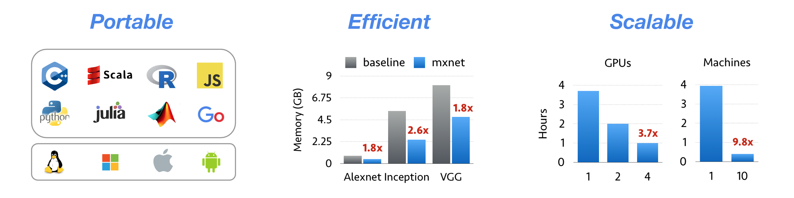

.. _mxnet:

=========
MXNet 
=========

MXNet is a deep learning framework that has been ported to the HIP port of MXNet. It works both on HIP/ROCm and HIP/CUDA platforms.
Mxnet makes use of rocBLAS,rocRAND,hcFFT and MIOpen APIs.

**MXNet**

Installation Guide for MXNet library
#####################################

Prerequisites
**************

`GCC 4.8 <https://gcc.gnu.org/gcc-4.8/>`_ or later to compile C++ 11.
`GNU Make <https://www.gnu.org/software/make/>`_

ROCm installation
********************

Follow the instructions from here -`ROCm Installation Guide <http://rocm-documentation.readthedocs.io/en/latest/Installation_Guide/Installation-Guide.html#installing-from-amd-rocm-repositories>`_

**Install Dependencies to build mxnet for HIP/ROCm**
::
 sudo apt-get install rocm-device-libs rocm-libs rocblas hipblas rocrand 
 sudo apt-get install rocm-opencl rocm-opencl-dev rocm-utils
 sudo apt-get install miopengemm miopen-hip
 
`Install hcfft from source <https://github.com/ROCmSoftwarePlatform/hcFFT/wiki/Installation>`_ 
 
**Install Dependencies to build mxnet for HIP/CUDA**

Install CUDA following the NVIDIA’s `installation guide <http://docs.nvidia.com/cuda/cuda-installation-guide-linux/>`_ to setup MXNet with GPU support

.. note:: 
   * Make sure to add CUDA install path to LD_LIBRARY_PATH 
   * Example - export LD_LIBRARY_PATH=/usr/local/cuda/lib64/:$LD_LIBRARY_PATH
   
Install the dependencies hipblas, rocrand, hcfft from source.

Build the MXNet library
########################

**Step 1: Install build tools.**
::
 $ sudo apt-get update
 $ sudo apt-get install -y build-essential 
 
**Step 2: Install OpenBLAS.** 
MXNet uses BLAS and LAPACK libraries for accelerated numerical computations on CPU machine. There are several flavors of BLAS/LAPACK libraries - OpenBLAS, ATLAS and MKL. In this step we install OpenBLAS. You can choose to install ATLAS or MKL.
::
 $ sudo apt-get install -y libopenblas-dev liblapack-dev libomp-dev libatlas-dev libatlas-base-dev

**Step 3: Install `OpenCV <https://opencv.org/>`_.**
MXNet uses OpenCV for efficient image loading and augmentation operations.
::
 $ sudo apt-get install -y libopencv-dev
 

 
**Step 4: Download MXNet sources and build MXNet core shared library.**
::
 $ git clone --recursive https://github.com/ROCmSoftwarePlatform/mxnet.git
 $ cd mxnet
 $ export PATH=/opt/rocm/bin:$PATH

**Step 5:**

**To compile on HCC PLATFORM(HIP/ROCm):**
::
 $ export HIP_PLATFORM=hcc

**To compile on NVCC PLATFORM(HIP/CUDA):**
::
 $ export HIP_PLATFORM=nvcc
 
**Step 6:**

**If building on CPU:**
::
 make -jn(n=number of cores) USE_CUDA=0
 
**If building on GPU:**
::
 make -jn(n=number of cores) USE_CUDA=1
 
**Step 7: To enable MIOpen for higher acceleration :**
::
 make -jn(n=number of cores) USE_CUDNN=1  
 
NOTE: Currently this feature is under development

On succesfull compilation a library called libmxnet.so is created in mxnet/lib path.

**Note:**
 1. USE_CUDA, USE_CUDNN flags can be changed in make/config.mk.
 2. To compile on HIP/CUDA make sure to set USE_CUDA_PATH to right CUDA installation path in make/config.mk. In most cases it is - /usr/local/cuda.

Install the MXNet Python binding
##################################

**Step 1: Install prerequisites - python, setup-tools, python-pip and numpy.**
::
 $ sudo apt-get install -y python-dev python-setuptools python-numpy python-pip

**Step 2: Install the MXNet Python binding.**
::
 $ cd python
 $ sudo python setup.py install 

**Step 3: Execute sample example**
::
 $ cd example/
 $ cd bayesian-methods/
 To run on gpu change mx.cpu() to mx.gpu() in python script (Example- bdk_demo.py)
 $ python bdk_demo.py

