.. _testdocbook:

===================================
"Vega" Instruction Set Architecture
===================================

Preface
=======

About This Document
-------------------

This document describes the environment, organization and program state of AMD GCN "VEGA" Generation devices. It details the instruction set and the microcode formats native to this family of processors that are accessible to programmers and compilers.

The document specifies the instructions (include the format of each type of instruction) and the relevant program state (including how the program state interacts with the instructions). Some instruction fields are mutually dependent; not all possible settings for all fields are legal. This document specifies the valid combinations.

The main purposes of this document are to:

1. Specify the language constructs and behavior, including the organization of each type of instruction in both text syntax and binary format.

2. Provide a reference of instruction operation that compiler writers can use to maximize performance of the processor.

Audience
--------

This document is intended for programmers writing application and system software, including operating systems, compilers, loaders, linkers,device drivers, and system utilities. It assumes that programmers are writing compute-intensive parallel applications (streaming applications) and assumes an understanding of requisite programming practices.

Organization
------------

| This document begins with an overview of the AMD GCN processor's hardware and programming environment (Chapter 1).
| Chapter 2 describes the organization of GCN programs.
| Chapter 3 describes the program state that is maintained.
| Chapter 4 describes the program flow.
| Chapter 5 describes the scalar ALU operations.
| Chapter 6 describes the vector ALU operations.
| Chapter 7 describes the scalar memory operations.
| Chapter 8 describes the vector memory operations.
| Chapter 9 provides information about the flat memory instructions.
| Chapter 10 describes the data share operations.
| Chapter 11 describes exporting the parameters of pixel color and vertex shaders.
| Chapter 12 describes instruction details, first by the microcode format to which they belong, then in alphabetic order.
| Finally, Chapter 13 provides a detailed specification of each microcode format.

Conventions
-----------

The following conventions are used in this document:

+-----------------------+----------------------------------------------------+
| mono-spaced font      | A filename, file path or code.                     |
+-----------------------+----------------------------------------------------+
| \*                    | Any number of alphanumeric characters in the name  |
|                       | of a code format, parameter, or instruction.       |
+-----------------------+----------------------------------------------------+
| < >                   | Angle brackets denote streams.                     |
+-----------------------+----------------------------------------------------+
| [1,2)                 | A range that includes the left-most value (in this |
|                       | case, 1), but excludes the right-most value (in    |
|                       | this case, 2).                                     |
+-----------------------+----------------------------------------------------+
| [1,2]                 | A range that includes both the left-most and       |
|                       | right-most values.                                 |
+-----------------------+----------------------------------------------------+
| {x \| y}              | One of the multiple options listed. In this case,  |
|                       | X or Y.                                            |
+-----------------------+----------------------------------------------------+
| 0.0                   | A single-precision (32-bit) floating-point value.  |
+-----------------------+----------------------------------------------------+
| 1011b                 | A binary value, in this example a 4-bit value.     |
+-----------------------+----------------------------------------------------+
| 7:4                   | A bit range, from bit 7 to bit 4, inclusive. The   |
|                       | high-order bit is shown first.                     |
+-----------------------+----------------------------------------------------+
| *italicized word or   | The first use of a term or concept basic to the    |
| phrase*               | understanding of stream computing.                 |
+-----------------------+----------------------------------------------------+

Related Documents
-----------------

-  Intermediate Language (IL) Reference Manual. Published by AMD.

-  AMD Accelerated Parallel Processing OpenCL Programming Guide.
   Published by AMD.

-  The OpenCL Specification. Published by Khronos Group. Aaftab Munshi,
   editor.

-  OpenGL Programming Guide, at http://www.glprogramming.com/red/

-  Microsoft DirectX Reference Website, here at `DirectX <https://msdn.microsoft.com/en-us/library/windows/desktop/ee663274(v=vs.85)>`_

-  GPGPU: http://www.gpgpu.org

Differences Between VEGA and Previous Devices
---------------------------------------------

Summary of kernel instruction changes in Vega GPUs:

-  New packed 16-bit math instructions.

   ::
    
    V_PK_MAD_I16       V_PK_MUL_LO_U16    V_PK_ADD_I16       V_PK_SUB_I16
    V_PK_LSHLREV_B16   V_PK_LSHRREV_B16   V_PK_ASHRREV_I16   V_PK_MAX_I16
    V_PK_MIN_I16       V_PK_MAD_U16       V_PK_ADD_U16       V_PK_SUB_U16
    V_PK_MAX_U16       V_PK_MIN_U16       V_PK_FMA_F16       V_PK_ADD_F16
    V_PK_MUL_F16       V_PK_MIN_F16       V_PK_MAX_F16       V_MAD_MIX_F32
    V_MAD_MIXLO_F16    V_MAD_MIXHI_F16    S_PACK_{LL,LH,HH}_B16_B32

-  TMA and TBA registers are stored one per VM-ID, not per draw or
   dispatch.

-  Added Image operations support 16-bit address and data.

-  Added Global and Scratch memory read/write operations.

   -  Also added Scratch load/store to scalar memory.

-  Added Scalar memory atomic instructions.

-  MIMG Microcode format: removed the R128 bit.

-  FLAT Microcode format: added an offset field.

-  Removed V\_MOVEREL instructions.

-  Added control over arithmetic overflow for FP16 VALU operations.

-  Modified bit packing of surface descriptors and samplers:

   -  T#: removed heap, elem\_size, last\_array, interlaced,
      uservm\_mode bits.

   -  V#: removed mtype.

   -  S#: removed astc\_hdr field.

Contact Information
-------------------

For information concerning AMD Accelerated Parallel Processing developing, please see: http://developer.amd.com/ .

For information about developing with AMD Accelerated Parallel Processing, please see: http://developer.amd.com/amd-accelerated-parallel-processing-app-sdk/ .

We also have a growing community of AMD Accelerated Parallel Processing users. Come visit us at the AMD Accelerated Parallel Processing Developer Forum ( http://developer.amd.com/openclforum ) to find out what applications other users are trying on their AMD Accelerated Parallel Processing products.

Introduction
============

AMD GCN processors implement a parallel micro-architecture that provides an excellent platform not only for computer graphics applications but also for general-purpose data parallel applications. Any data-intensive application that requires high bandwidth or is computationally intensive is a candidate for running on an AMD GCN processor.

The figure below shows a block diagram of the AMD GCN Vega Generation series processors

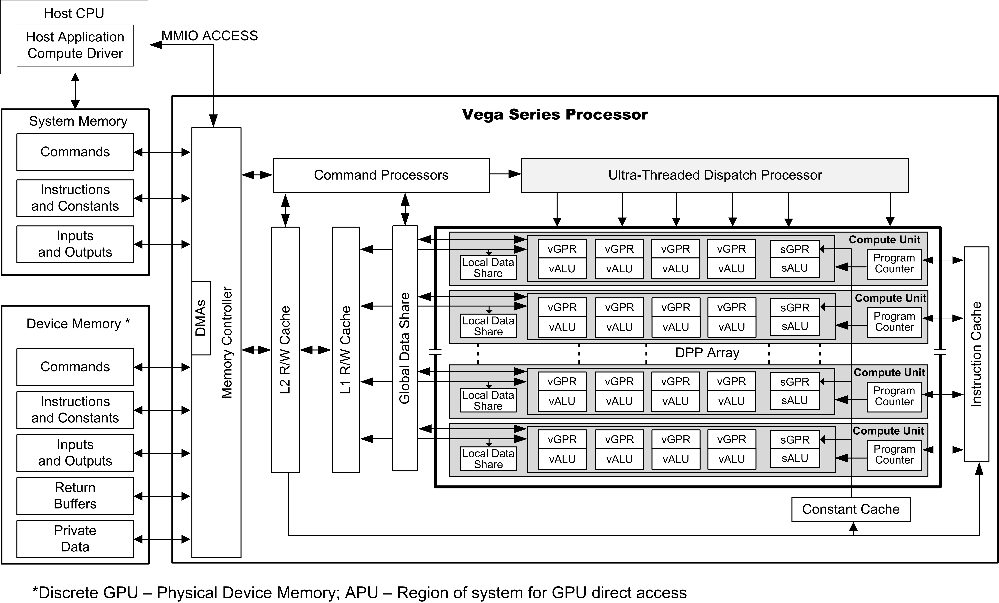

AMD GCN VEGA Generation Series Block Diagram

The GCN device includes a data-parallel processor (DPP) array, a command processor, a memory controller, and other logic (not shown). The GCN command processor reads commands that the host has written to memory-mapped GCN registers in the system-memory address space. The command processor sends hardware-generated interrupts to the host when the command is completed. The GCN memory controller has direct access to all GCN device memory and the host-specified areas of system memory. To satisfy read and write requests, the memory controller performs the functions of a direct-memory access (DMA) controller, including computing memory-address offsets based on the format of the requested data in memory. In the GCN environment, a complete application includes two parts: 
-  a program running on the host processor, and

-  programs, called kernels, running on the GCN processor.

The GCN programs are controlled by host commands that

-  set GCN internal base-address and other configuration registers,

-  specify the data domain on which the GCN GPU is to operate,

-  invalidate and flush caches on the GCN GPU, and

-  cause the GCN GPU to begin execution of a program.

The GCN driver program runs on the host.
 
The DPP array is the heart of the GCN processor. The array is organized as a set of compute unit pipelines, each independent from the others, that operate in parallel on streams of floating-point or integer data.The compute unit pipelines can process data or, through the memory controller, transfer data to, or from, memory. Computation in a compute unit pipeline can be made conditional. Outputs written to memory can also be made conditional.

When it receives a request, the compute unit pipeline loads instructions and data from memory, begins execution, and continues until the end of the kernel. As kernels are running, the GCN hardware automatically fetches instructions from memory into on-chip caches; GCN software plays no role in this. GCN kernels can load data from off-chip memory into on-chip general-purpose registers (GPRs) and caches. 

The AMD GCN devices can detect floating point exceptions and can generate interrupts. In particular, they detect IEEE floating-point
exceptions in hardware; these can be recorded for post-execution analysis. The software interrupts shown in the previous figure from the command processor to the host represent hardware-generated interrupts for signaling command-completion and related management functions.

The GCN processor hides memory latency by keeping track of potentially hundreds of work-items in different stages of execution, and by
overlapping compute operations with memory-access operations. 

The figure below shows the dataflow for a GCN application. For general-purpose applications, only one processing block performs all
computation.

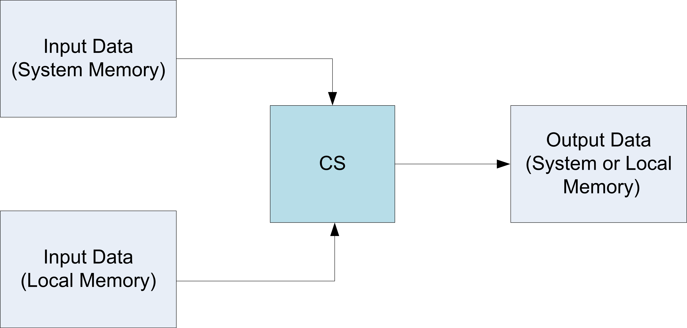

   GCN VEGA Generation Dataflow

Terminology
-----------

+-----------------------+----------------------------------------------------+
| Term                  | Description                                        |
+=======================+====================================================+
| GCN Processor         | The Graphics Core Next shader processor is a       |
|                       | scalar and vector ALU capable of running complex   |
|                       | programs on behalf of a wavefront.                 |
+-----------------------+----------------------------------------------------+
| Dispatch              | A dispatch launches a 1D, 2D, or 3D grid of work   |
|                       | to the GCN processor array.                        |
+-----------------------+----------------------------------------------------+
| Workgroup             | A workgroup is a collection of wavefronts that     |
|                       | have the ability to synchronize with each other    |
|                       | quickly; they also can share data through the      |
|                       | Local Data Share.                                  |
+-----------------------+----------------------------------------------------+
| Wavefront             | A collection of 64 work-items that execute in      |
|                       | parallel on a single GCN processor.                |
+-----------------------+----------------------------------------------------+
| Work-item             | A single element of work: one element from the     |
|                       | dispatch grid, or in graphics a pixel or vertex.   |
+-----------------------+----------------------------------------------------+
| Literal Constant      | A 32-bit integer or float constant that is placed  |
|                       | in the instruction stream.                         |
+-----------------------+----------------------------------------------------+
| Scalar ALU (SALU)     | The scalar ALU operates on one value per wavefront |
|                       | and manages all control flow.                      |
+-----------------------+----------------------------------------------------+
| Vector ALU (VALU)     | The vector ALU maintains Vector GPRs that are      |
|                       | unique for each work item and execute arithmetic   |
|                       | operations uniquely on each work-item.             |
+-----------------------+----------------------------------------------------+
| Microcode format      | The microcode format describes the bit patterns    |
|                       | used to encode instructions. Each instruction is   |
|                       | either 32 or 64 bits.                              |
+-----------------------+----------------------------------------------------+
| Instruction           | An instruction is the basic unit of the kernel.    |
|                       | Instructions include: vector ALU, scalar ALU,      |
|                       | memory transfer, and control flow operations.      |
+-----------------------+----------------------------------------------------+
| Quad                  | A quad is a 2x2 group of screen-aligned pixels.    |
|                       | This is relevant for sampling texture maps.        |
+-----------------------+----------------------------------------------------+
| Texture Sampler       | A texture sampler is a 128-bit entity that         |
|                       | describes how the vector memory system reads and   |
|                       | samples (filters) a texture map.                   |
+-----------------------+----------------------------------------------------+
| Texture Resource      | A texture resource describes a block of memory:    |
|                       | address, data format, stride, etc.                 |
+-----------------------+----------------------------------------------------+

	**Table : Basic Terms Uses** 

Program Organization
====================

GCN kernels are programs executed by the GCN processor. Conceptually, the kernel is executed independently on every work-item, but in reality the GCN processor groups 64 work-items into a wavefront, which executes the kernel on all 64 work-items in one pass.

The GCN processor consists of:

-  A scalar ALU, which operates on one value per wavefront (common to all work items).

-  A vector ALU, which operates on unique values per work-item.

-  Local data storage, which allows work-items within a workgroup to communicate and share data.

-  Scalar memory, which can transfer data between SGPRs and memory through a cache.

-  Vector memory, which can transfer data between VGPRs and memory,including sampling texture maps.

All kernel control flow is handled using scalar ALU instructions. This includes if/else, branches and looping. Scalar ALU (SALU) and memory instructions work on an entire wavefront and operate on up to two SGPRs,as well as literal constants.

Vector memory and ALU instructions operate on all work-items in the wavefront at one time. In order to support branching and conditional execute, every wavefront has an EXECute mask that determines which work-items are active at that moment, and which are dormant. Active work-items execute the vector instruction, and dormant ones treat the instruction as a NOP. The EXEC mask can be changed at any time by Scalar ALU instructions.

Vector ALU instructions can take up to three arguments, which can come from VGPRs, SGPRs, or literal constants that are part of the instruction stream. They operate on all work-items enabled by the EXEC mask. Vector compare and add with- carryout return a bit-per-work-item mask back to the SGPRs to indicate, per work-item, which had a "true" result from the compare or generated a carry-out.

Vector memory instructions transfer data between VGPRs and memory. Each work-item supplies its own memory address and supplies or receives unique data. These instructions are also subject to the EXEC mask.

Compute Shaders
---------------

Compute kernels (shaders) are generic programs that can run on the GCN processor, taking data from memory, processing it, and writing results back to memory. Compute kernels are created by a dispatch, which causes the GCN processors to run the kernel over all of the work-items in a 1D, 2D, or 3D grid of data. The GCN processor walks through this grid and generates wavefronts, which then run the compute kernel. Each work-item is initialized with its unique address (index) within the grid. Based on this index, the work-item computes the address of the data it is required to work on and what to do with the results.

Data Sharing
------------

The AMD GCN stream processors can share data between different work-items. Data sharing can significantly boost performance. The figure below shows the memory hierarchy that is available to each work-item.

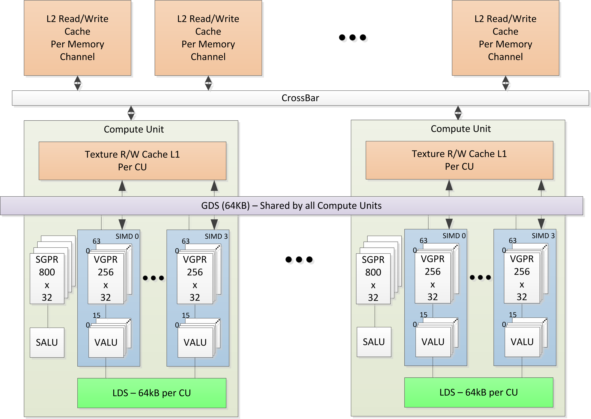

   Shared Memory Hierarchy

Local Data Share (LDS)
~~~~~~~~~~~~~~~~~~~~~~

Each compute unit has a 64 kB memory space that enables low-latency communication between work-items within a work-group, or the work-items within a wavefront; this is the local data share (LDS). This memory is configured with 32 banks, each with 512 entries of 4 bytes. The AMD GCN processors use a 64 kB local data share (LDS) memory for each compute unit; this enables 64 kB of low-latency bandwidth to the processing elements. The shared memory contains 32 integer atomic units to enable fast, unordered atomic operations. This memory can be used as a software cache for predictable re-use of data, a data exchange machine for the work-items of a work-group, or as a cooperative way to enable efficient access to off-chip memory.

Global Data Share (GDS)
~~~~~~~~~~~~~~~~~~~~~~~

The AMD GCN devices use a 64 kB global data share (GDS) memory that can be used by wavefronts of a kernel on all compute units. This memory provides 128 bytes per cycle of memory access to all the processing elements. The GDS is configured with 32 banks, each with 512 entries of 4 bytes each. It provides full access to any location for any processor. The shared memory contains 32 integer atomic units to enable fast, unordered atomic operations. This memory can be used as a software cache to store important control data for compute kernels, reduction operations, or a small global shared surface. Data can be preloaded from memory prior to kernel launch and written to memory after kernel completion. The GDS block contains support logic for unordered append/consume and domain launch ordered append/consume operations to buffers in memory. These dedicated circuits enable fast compaction of data or the creation of complex data structures in memory.

Device Memory
-------------

The AMD GCN devices offer several methods for access to off-chip memory from the processing elements (PE) within each compute unit. On the primary read path, the device consists of multiple channels of L2 read-only cache that provides data to an L1 cache for each compute unit. Special cache-less load instructions can force data to be retrieved from device memory during an execution of a load clause. Load requests that overlap within the clause are cached with respect to each other. The output cache is formed by two levels of cache: the first for write-combining cache (collect scatter and store operations and combine them to provide good access patterns to memory); the second is a read/write cache with atomic units that lets each processing element complete unordered atomic accesses that return the initial value. Each processing element provides the destination address on which the atomic operation acts, the data to be used in the atomic operation, and a return address for the read/write atomic unit to store the pre-op value in memory. Each store or atomic operation can be set up to return an acknowledgment to the requesting PE upon write confirmation of the return value (pre-atomic op value at destination) being stored to device memory.

This acknowledgment has two purposes:

-  enabling a PE to recover the pre-op value from an atomic operation by performing a cache-less load from its return address after  	receipt of the write confirmation acknowledgment, and

-  enabling the system to maintain a relaxed consistency model.

Each scatter write from a given PE to a given memory channel always maintains order. The acknowledgment enables one processing element to implement a fence to maintain serial consistency by ensuring all writes have been posted to memory prior to completing a subsequent write. In this manner, the system can maintain a relaxed consistency model between all parallel work-items operating on the system.

Kernel State
============

This chapter describes the kernel states visible to the shader program.

State Overview
--------------

The table below shows all of the hardware states readable or writable by
a shader program.

+--------------+----------------------+--------+-----------------------------------+
| Abbrev.      | Name                 | Size   | Description                       |
|              |                      | (bits) |                                   |
+==============+======================+========+===================================+
| PC           | Program Counter      | 48     | Points to the memory address of   |
|              |                      |        | the next shader instruction to    |
|              |                      |        | execute.                          |
+--------------+----------------------+--------+-----------------------------------+
| V0-V255      | VGPR                 | 32     | Vector general-purpose register.  |
+--------------+----------------------+--------+-----------------------------------+
| S0-S103      | SGPR                 | 32     | Vector general-purpose register.  |
+--------------+----------------------+--------+-----------------------------------+
| LDS          | Local Data Share     | 64kB   | Local data share is a scratch RAM |
|              |                      |        | with built-in arithmetic          |
|              |                      |        | capabilities that allow data to   |
|              |                      |        | be shared between threads in a    |
|              |                      |        | workgroup.                        |
+--------------+----------------------+--------+-----------------------------------+
| EXEC         | Execute Mask         | 64     | A bit mask with one bit per       |
|              |                      |        | thread, which is applied to       |
|              |                      |        | vector instructions and controls  |
|              |                      |        | that threads execute and that     |
|              |                      |        | ignore the instruction.           |
+--------------+----------------------+--------+-----------------------------------+
| EXECZ        | EXEC is zero         | 1      | A single bit flag indicating that |
|              |                      |        | the EXEC mask is all zeros.       |
+--------------+----------------------+--------+-----------------------------------+
| VCC          | Vector Condition     | 64     | A bit mask with one bit per       |
|              | Code                 |        | thread; it holds the result of a  |
|              |                      |        | vector compare operation.         |
+--------------+----------------------+--------+-----------------------------------+
| VCCZ         | VCC is zero          | 1      | A single bit-flag indicating that |
|              |                      |        | the VCC mask is all zeros.        |
+--------------+----------------------+--------+-----------------------------------+
| SCC          | Scalar Condition     | 1      | Result from a scalar ALU          |
|              | Code                 |        | comparison instruction.           |
+--------------+----------------------+--------+-----------------------------------+
| FLAT\_SCRATC | Flat scratch address | 64     | The base address of scratch       |
| H            |                      |        | memory.                           |
+--------------+----------------------+--------+-----------------------------------+
| XNACK\_MASK  | Address translation  | 64     | Bit mask of threads that have     |
|              | failure.             |        | failed their address translation. |
+--------------+----------------------+--------+-----------------------------------+
| STATUS       | Status               | 32     | Read-only shader status bits.     |
+--------------+----------------------+--------+-----------------------------------+
| MODE         | Mode                 | 32     | Writable shader mode bits.        |
+--------------+----------------------+--------+-----------------------------------+
| M0           | Memory Reg           | 32     | A temporary register that has     |
|              |                      |        | various uses, including GPR       |
|              |                      |        | indexing and bounds checking.     |
+--------------+----------------------+--------+-----------------------------------+
| TRAPSTS      | Trap Status          | 32     | Holds information about           |
|              |                      |        | exceptions and pending traps.     |
+--------------+----------------------+--------+-----------------------------------+
| TBA          | Trap Base Address    | 64     | Holds the pointer to the current  |
|              |                      |        | trap handler program.             |
+--------------+----------------------+--------+-----------------------------------+
| TMA          | Trap Memory Address  | 64     | Temporary register for shader     |
|              |                      |        | operations. For example, can hold |
|              |                      |        | a pointer to memory used by the   |
|              |                      |        | trap handler.                     |
+--------------+----------------------+--------+-----------------------------------+
| TTMP0-TTMP15 | Trap Temporary SGPRs | 32     | 16 SGPRs available only to the    |
|              |                      |        | Trap Handler for temporary        |
|              |                      |        | storage.                          |
+--------------+----------------------+--------+-----------------------------------+
| VMCNT        | Vector memory        | 6      | Counts the number of VMEM         |
|              | instruction count    |        | instructions issued but not yet   |
|              |                      |        | completed.                        |
+--------------+----------------------+--------+-----------------------------------+
| EXPCNT       | Export Count         | 3      | Counts the number of Export and   |
|              |                      |        | GDS instructions issued but not   |
|              |                      |        | yet completed. Also counts VMEM   |
|              |                      |        | writes that have not yet sent     |
|              |                      |        | their write-data to the TC.       |
+--------------+----------------------+--------+-----------------------------------+
| LGKMCNT      | LDS, GDS, Constant   | 4      | Counts the number of LDS, GDS,    |
|              | and Message count    |        | constant-fetch (scalar memory     |
|              |                      |        | read), and message instructions   |
|              |                      |        | issued but not yet completed.     |
+--------------+----------------------+--------+-----------------------------------+

**Table : Readable and Writable Hardware States**

Program Counter (PC)
--------------------

The program counter (PC) is a byte address pointing to the next instruction to execute. When a wavefront is created, the PC is
initialized to the first instruction in the program.

The PC interacts with three instructions: S\_GET\_PC, S\_SET\_PC,S\_SWAP\_PC. These transfer the PC to, and from, an even-aligned SGPR
pair.

Branches jump to (PC\_of\_the\_instruction\_after\_the\_branch +offset). The shader program cannot directly read from, or write to, the PC. Branches, GET\_PC and SWAP\_PC, are PC-relative to the next instruction, not the current one. S\_TRAP saves the PC of the S\_TRAP instruction itself.

EXECute Mask
------------

| The Execute mask (64-bit) determines which threads in the vector are
  executed:
| **1 = execute, 0 = do not execute.**

EXEC can be read from, and written to, through scalar instructions; it also can be written as a result of a vector-ALU compare. This mask affects vector-ALU, vector-memory, LDS, and export instructions. It does not affect scalar execution or branches.

A helper bit (EXECZ) can be used as a condition for branches to skip code when EXEC is zero.

.. Note::    This GPU does no optimization when EXEC = 0. The shader hardware executes every instruction, wasting instruction issue bandwidth. Use CBRANCH or VSKIP to rapidly skip over code when it is likely that the EXEC mask is zero.

Status registers
----------------

Status register fields can be read, but not written to, by the shader.These bits are initialized at wavefront-creation time. The table below lists and briefly describes the status register fields.

+-------------------+---------+-------------------------------------------------+
| Field             | Bit     | Description                                     |
|                   | Positio |                                                 |
|                   | n       |                                                 |
+===================+=========+=================================================+
| SCC               | 1       | Scalar condition code. Used as a carry-out bit. |
|                   |         | For a comparison instruction, this bit          |
|                   |         | indicates failure or success. For logical       |
|                   |         | operations, this is 1 if the result was         |
|                   |         | non-zero.                                       |
+-------------------+---------+-------------------------------------------------+
| SPI\_PRIO         | 2:1     | Wavefront priority set by the shader processor  |
|                   |         | interpolator (SPI) when the wavefront is        |
|                   |         | created. See the S\_SETPRIO instruction (page   |
|                   |         | 12-49) for details. 0 is lowest, 3 is highest   |
|                   |         | priority.                                       |
+-------------------+---------+-------------------------------------------------+
| WAVE\_PRIO        | 4:3     | Wavefront priority set by the shader program.   |
|                   |         | See the S\_SETPRIO instruction (page 12-49) for |
|                   |         | details.                                        |
+-------------------+---------+-------------------------------------------------+
| PRIV              | 5       | Privileged mode. Can only be active when in the |
|                   |         | trap handler. Gives write access to the TTMP,   |
|                   |         | TMA, and TBA registers.                         |
+-------------------+---------+-------------------------------------------------+
| TRAP\_EN          | 6       | Indicates that a trap handler is present. When  |
|                   |         | set to zero, traps are not taken.               |
+-------------------+---------+-------------------------------------------------+
| TTRACE\_EN        | 7       | Indicates whether thread trace is enabled for   |
|                   |         | this wavefront. If zero, also ignore any        |
|                   |         | shader-generated (instruction) thread-trace     |
|                   |         | data.                                           |
+-------------------+---------+-------------------------------------------------+
| EXPORT\_RDY       | 8       | This status bit indicates if export buffer      |
|                   |         | space has been allocated. The shader stalls any |
|                   |         | export instruction until this bit becomes 1. It |
|                   |         | is set to 1 when export buffer space has been   |
|                   |         | allocated. Before a Pixel or Vertex shader can  |
|                   |         | export, the hardware checks the state of this   |
|                   |         | bit. If the bit is 1, export can be issued. If  |
|                   |         | the bit is zero, the wavefront sleeps until     |
|                   |         | space becomes available in the export buffer.   |
|                   |         | Then, this bit is set to 1, and the wavefront   |
|                   |         | resumes.                                        |
+-------------------+---------+-------------------------------------------------+
| EXECZ             | 9       | Exec mask is zero.                              |
+-------------------+---------+-------------------------------------------------+
| VCCZ              | 10      | Vector condition code is zero.                  |
+-------------------+---------+-------------------------------------------------+
| IN\_TG            | 11      | Wavefront is a member of a work-group of more   |
|                   |         | than one wavefront.                             |
+-------------------+---------+-------------------------------------------------+
| IN\_BARRIER       | 12      | Wavefront is waiting at a barrier.              |
+-------------------+---------+-------------------------------------------------+
| HALT              | 13      | Wavefront is halted or scheduled to halt. HALT  |
|                   |         | can be set by the host through                  |
|                   |         | wavefront-control messages, or by the shader.   |
|                   |         | This bit is ignored while in the trap handler   |
|                   |         | (PRIV = 1); it also is ignored if a             |
|                   |         | host-initiated trap is received (request to     |
|                   |         | enter the trap handler).                        |
+-------------------+---------+-------------------------------------------------+
| TRAP              | 14      | Wavefront is flagged to enter the trap handler  |
|                   |         | as soon as possible.                            |
+-------------------+---------+-------------------------------------------------+
| TTRACE\_CU\_EN    | 15      | Enables/disables thread trace for this compute  |
|                   |         | unit (CU). This bit allows more than one CU to  |
|                   |         | be outputting USERDATA (shader initiated writes |
|                   |         | to the thread-trace buffer). Note that          |
|                   |         | wavefront data is only traced from one CU per   |
|                   |         | shader array. Wavefront user data (instruction  |
|                   |         | based) can be output if this bit is zero.       |
+-------------------+---------+-------------------------------------------------+
| VALID             | 16      | Wavefront is active (has been created and not   |
|                   |         | yet ended).                                     |
+-------------------+---------+-------------------------------------------------+
| ECC\_ERR          | 17      | An ECC error has occurred.                      |
+-------------------+---------+-------------------------------------------------+
| SKIP\_EXPORT      | 18      | For Vertex Shaders only. 1 = this shader is not |
|                   |         | allocated export buffer space; all export       |
|                   |         | instructions are ignored (treated as NOPs).     |
|                   |         | Formerly called VS\_NO\_ALLOC. Used for         |
|                   |         | stream-out of multiple streams (multiple passes |
|                   |         | over the same VS), and for DS running in the VS |
|                   |         | stage for wavefronts that produced no           |
|                   |         | primitives.                                     |
+-------------------+---------+-------------------------------------------------+
| PERF\_EN          | 19      | Performance counters are enabled for this       |
|                   |         | wavefront.                                      |
+-------------------+---------+-------------------------------------------------+
| COND\_DBG\_USER   | 20      | Conditional debug indicator for user mode       |
+-------------------+---------+-------------------------------------------------+
| COND\_DBG\_SYS    | 21      | Conditional debug indicator for system mode.    |
+-------------------+---------+-------------------------------------------------+
| ALLOW\_REPLAY     | 22      | Indicates that ATC replay is enabled.           |
+-------------------+---------+-------------------------------------------------+
| MUST\_EXPORT      | 27      | This wavefront is required to perform an export |
|                   |         | with Done=1 before terminating.                 |
+-------------------+---------+-------------------------------------------------+

	**Table : Status Register Fields**

Mode register
-------------

Mode register fields can be read from, and written to, by the shader
through scalar instructions. The table below lists and briefly describes
the mode register fields.

+-----------------+---------+--------------------------------------------------+
| Field           | Bit     | Description                                      |
|                 | Positio |                                                  |
|                 | n       |                                                  |
+=================+=========+==================================================+
| FP\_ROUND       | 3:0     | | [1:0] Single precision round mode. [3:2]       |
|                 |         |   Double precision round mode.                   |
|                 |         | | Round Modes: 0=nearest even, 1= +infinity, 2=  |
|                 |         |   -infinity, 3= toward zero.                     |
+-----------------+---------+--------------------------------------------------+
| FP\_DENORM      | 7:4     | | [1:0] Single denormal mode. [3:2] Double       |
|                 |         |   denormal mode. Denorm modes:                   |
|                 |         | | 0 = flush input and output denorms.            |
|                 |         | | 1 = allow input denorms, flush output denorms. |
|                 |         | | 2 = flush input denorms, allow output denorms. |
|                 |         | | 3 = allow input and output denorms.            |
+-----------------+---------+--------------------------------------------------+
| DX10\_CLAMP     | 8       | Used by the vector ALU to force DX10-style       |
|                 |         | treatment of NaNs: when set, clamp NaN to zero;  |
|                 |         | otherwise, pass NaN through.                     |
+-----------------+---------+--------------------------------------------------+
| IEEE            | 9       | Floating point opcodes that support exception    |
|                 |         | flag gathering quiet and propagate signaling NaN |
|                 |         | inputs per IEEE 754-2008. Min\_dx10 and          |
|                 |         | max\_dx10 become IEEE 754-2008 compliant due to  |
|                 |         | signaling NaN propagation and quieting.          |
+-----------------+---------+--------------------------------------------------+
| LOD\_CLAMPED    | 10      | Sticky bit indicating that one or more texture   |
|                 |         | accesses had their LOD clamped.                  |
+-----------------+---------+--------------------------------------------------+
| DEBUG           | 11      | Forces the wavefront to jump to the exception    |
|                 |         | handler after each instruction is executed (but  |
|                 |         | not after ENDPGM). Only works if TRAP\_EN = 1.   |
+-----------------+---------+--------------------------------------------------+
| EXCP\_EN        | 18:12   | | Enable mask for exceptions. Enabled means if   |
|                 |         |   the exception occurs and TRAP\_EN==1, a trap   |
|                 |         |   is taken.                                      |
|                 |         | | [12] : invalid.                                |
|                 |         | | [13] : inputDenormal.                          |
|                 |         | | [14] : float\_div0.                            |
|                 |         | | [15] : overflow.                               |
|                 |         | | [16] : underflow.                              |
|                 |         | | [17] : inexact.                                |
|                 |         | | [18] : int\_div0.                              |
|                 |         | | [19] : address watch                           |
|                 |         | | [20] : memory violation                        |
+-----------------+---------+--------------------------------------------------+
| FP16\_OVFL      | 23      | If set, an overflowed FP16 result is clamped to  |
|                 |         | +/- MAX\_FP16, regardless of round mode, while   |
|                 |         | still preserving true INF values.                |
+-----------------+---------+--------------------------------------------------+
| POPS\_PACKER0   | 24      | 1 = this wave is associated with packer 0. User  |
|                 |         | shader must set this to !PackerID from the POPS  |
|                 |         | initialized SGPR (load\_collision\_waveID), or   |
|                 |         | zero if not using POPS.                          |
+-----------------+---------+--------------------------------------------------+
| POPS\_PACKER1   | 25      | 1 = this wave is associated with packer 1. User  |
|                 |         | shader must set this to PackerID from the POPS   |
|                 |         | initialized SGPR (load\_collision\_waveID), or   |
|                 |         | zero if not using POPS.                          |
+-----------------+---------+--------------------------------------------------+
| DISABLE\_PERF   | 26      | 1 = disable performance counting for this wave   |
+-----------------+---------+--------------------------------------------------+
| GPR\_IDX\_EN    | 27      | GPR index enable.                                |
+-----------------+---------+--------------------------------------------------+
| VSKIP           | 28      | 0 = normal operation. 1 = skip (do not execute)  |
|                 |         | any vector instructions: valu, vmem, export,     |
|                 |         | lds, gds. "Skipping" instructions occurs at      |
|                 |         | high-speed (10 wavefronts per clock cycle can    |
|                 |         | skip one instruction). This is much faster than  |
|                 |         | issuing and discarding instructions.             |
+-----------------+---------+--------------------------------------------------+
| CSP             | 31:29   | Conditional branch stack pointer.                |
+-----------------+---------+--------------------------------------------------+

	**Table : Mode Register Fields**

GPRs and LDS
------------

This section describes how GPR and LDS space is allocated to a wavefront, as well as how out-of-range and misaligned accesses are
handled.

Out-of-Range behavior
~~~~~~~~~~~~~~~~~~~~~

This section defines the behavior when a source or destination GPR or memory address is outside the legal range for a wavefront.

Out-of-range can occur through GPR-indexing or bad programming. It is illegal to index from one register type into another (for example: SGPRs into trap registers or inline constants). It is also illegal to index within inline constants.

The following describe the out-of-range behavior for various storage types.

-  SGPRs

   -  Source or destination out-of-range = (sgpr < 0 \|\| (sgpr >=
      sgpr\_size)).

   -  Source out-of-range: returns the value of SGPR0 (not the value 0).

   -  Destination out-of-range: instruction writes no SGPR result.

-  VGPRs

   -  Similar to SGPRs. It is illegal to index from SGPRs into VGPRs, or
      vice versa.

   -  Out-of-range = (vgpr < 0 \|\| (vgpr >= vgpr\_size))

   -  If a source VGPR is out of range, VGPR0 is used.

   -  If a destination VGPR is out-of-range, the instruction is ignored
      (treated as an NOP).

-  LDS

   -  If the LDS-ADDRESS is out-of-range (addr < 0 or > (MIN(lds\_size,
      m0)):

      -  Writes out-of-range are discarded; it is undefined if SIZE is
         not a multiple of write-data-size.

      -  Reads return the value zero.

   -  If any source-VGPR is out-of-range, use the VGPR0 value is used.

   -  If the dest-VGPR is out of range, nullify the instruction (issue
      with exec=0)

-  Memory, LDS, and GDS: Reads and atomics with returns.

   -  If any source VGPR or SGPR is out-of-range, the data value is
      undefined.

   -  If any destination VGPR is out-of-range, the operation is
      nullified by issuing the instruction as if the EXEC mask were
      cleared to 0.

      -  This out-of-range check must check all VGPRs that can be
         returned (for example: VDST to VDST+3 for a
         BUFFER\_LOAD\_DWORDx4).

      -  This check must also include the extra PRT (partially resident
         texture) VGPR and nullify the fetch if this VGPR is
         out-of-range, no matter whether the texture system actually
         returns this value or not.

      -  Atomic operations with out-of-range destination VGPRs are
         nullified: issued, but with exec mask of zero.

Instructions with multiple destinations (for example: V\_ADDC): if any destination is out-of-range, no results are written.

SGPR Allocation and storage
~~~~~~~~~~~~~~~~~~~~~~~~~~~

A wavefront can be allocated 16 to 102 SGPRs, in units of 16 GPRs (Dwords). These are logically viewed as SGPRs 0-101. The VCC is
physically stored as part of the wavefront’s SGPRs in the highest numbered two SGPRs (SGPR 106 and 107; the source/destination VCC is an alias for those two SGPRs). When a trap handler is present, 16 additional SGPRs are reserved after VCC to hold the trap addresses, as well as saved-PC and trap-handler temps. These all are privileged (cannot be written to unless privilege is set). Note that if a wavefront allocates 16 SGPRs, 2 SGPRs are normally used as VCC, the remaining 14 are available to the shader. Shader hardware does not prevent use of all 16 SGPRs.

SGPR Alignment
~~~~~~~~~~~~~~

Even-aligned SGPRs are required in the following cases.

-  When 64-bit data is used. This is required for moves to/from 64-bit
   registers, including the PC.

-  When scalar memory reads that the address-base comes from an
   SGPR-pair (either in SGPR).

Quad-alignment is required for the data-GPR when a scalar memory read returns four or more Dwords. When a 64-bit quantity is stored in SGPRs, the LSBs are in SGPR[n], and the MSBs are in SGPR[n+1].

VGPR Allocation and Alignment
~~~~~~~~~~~~~~~~~~~~~~~~~~~~~

VGPRs are allocated in groups of four Dwords. Operations using pairs of VGPRs (for example: double-floats) have no alignment restrictions. Physically, allocations of VGPRs can wrap around the VGPR memory pool.

LDS Allocation and Clamping
~~~~~~~~~~~~~~~~~~~~~~~~~~~

LDS is allocated per work-group or per-wavefront when work-groups are not in use. LDS space is allocated to a work-group or wavefront in contiguous blocks of 128 Dwords on 128-Dword alignment. LDS allocations do not wrap around the LDS storage. All accesses to LDS are restricted to the space allocated to that wavefront/work-group.

Clamping of LDS reads and writes is controlled by two size registers, which contain values for the size of the LDS space allocated by SPI to this wavefront or work-group, and a possibly smaller value specified in the LDS instruction (size is held in M0). The LDS operations use the smaller of these two sizes to determine how to clamp the read/write addresses.

M# Memory Descriptor
--------------------

There is one 32-bit M# (M0) register per wavefront, which can be used
for:

-  Local Data Share (LDS)

   -  Interpolation: holds { 1’b0, new\_prim\_mask[15:1],
      parameter\_offset[15:0] } // in bytes

   -  LDS direct-read offset and data type: { 13’b0, DataType[2:0],
      LDS\_address[15:0] } // addr in bytes

   -  LDS addressing for Memory/Vfetch → LDS: {16’h0, lds\_offset[15:0]}
      // in bytes

-  Global Data Share (GDS)

   -  { base[15:0] , size[15:0] } // base and size are in bytes

-  Indirect GPR addressing for both vector and scalar instructions. M0
   is an unsigned index.

-  Send-message value. EMIT/CUT use M0 and EXEC as the send-message
   data.

SCC: Scalar Condition code
--------------------------

Most scalar ALU instructions set the Scalar Condition Code (SCC) bit,indicating the result of the operation.

.. raw:: html

   

| Compare operations: 1 = true
| Arithmetic operations: 1 = carry out
| Bit/logical operations: 1 = result was not zero
| Move: does not alter SCC

.. raw:: html

   

The SCC can be used as the carry-in for extended-precision integer arithmetic, as well as the selector for conditional moves and branches.

Vector Compares: VCC and VCCZ
-----------------------------

Vector ALU comparisons always set the Vector Condition Code (VCC) register (1=pass, 0=fail). Also, vector compares have the option of
setting EXEC to the VCC value.

There is also a VCC summary bit (vccz) that is set to 1 when the VCC result is zero. This is useful for early-exit branch tests. VCC is also set for selected integer ALU operations (carry-out).

Vector compares have the option of writing the result to VCC (32-bit instruction encoding) or to any SGPR (64-bit instruction encoding). VCCZ is updated every time VCC is updated: vector compares and scalar writes to VCC.

The EXEC mask determines which threads execute an instruction. The VCC indicates which executing threads passed the conditional test, or which threads generated a carry-out from an integer add or subtract.

.. raw:: html

   

V\_CMP\_\* ⇒ VCC[n] = EXEC[n] & (test passed for thread[n])

.. raw:: html

   

VCC is always fully written; there are no partial mask updates.

.. Note:: VCC physically resides in the SGPR register file, so when an instruction sources VCC, that counts against the limit on the total number of SGPRs that can be sourced for a given instruction. VCC physically resides in the highest two user SGPRs.

**Shader Hazard with VCC** The user/compiler must prevent a scalar-ALU
write to the SGPR holding VCC, immediately followed by a conditional
branch using VCCZ. The hardware cannot detect this, and inserts the one
required wait state (hardware does detect it when the SALU writes to
VCC, it only fails to do this when the SALU instruction references the
SGPRs that happen to hold VCC).

Trap and Exception registers
----------------------------

Each type of exception can be enabled or disabled independently by setting, or clearing, bits in the TRAPSTS register’s EXCP\_EN field.This section describes the registers which control and report kernel exceptions.

All Trap temporary SGPRs (TTMP\*) are privileged for writes - they can be written only when in the trap handler (status.priv = 1). When not privileged, writes to these are ignored. TMA and TBA are read-only; they can be accessed through S\_GETREG\_B32.

When a trap is taken (either user initiated, exception or host initiated), the shader hardware generates an S\_TRAP instruction. This
loads trap information into a pair of SGPRS:

::

    {TTMP1, TTMP0} = {3'h0, pc_rewind[3:0], HT[0],trapID[7:0], PC[47:0]}.

HT is set to one for host initiated traps, and zero for user traps
(s\_trap) or exceptions. TRAP\_ID is zero for exceptions, or the
user/host trapID for those traps. When the trap handler is entered, the
PC of the faulting instruction will be: (PC - PC\_rewind\*4).

**STATUS . TRAP\_EN** - This bit indicates to the shader whether or not
a trap handler is present. When one is not present, traps are not taken,
no matter whether they’re floating point, user-, or host-initiated
traps. When the trap handler is present, the wavefront uses an extra 16
SGPRs for trap processing. If trap\_en == 0, all traps and exceptions
are ignored, and s\_trap is converted by hardware to NOP.

**MODE . EXCP\_EN[8:0]** - Floating point exception enables. Defines
which exceptions and events cause a trap.

+----------------+-----------------------------------------------------------+
| Bit            | Exception                                                 |
+================+===========================================================+
| 0              | Invalid                                                   |
+----------------+-----------------------------------------------------------+
| 1              | Input Denormal                                            |
+----------------+-----------------------------------------------------------+
| 2              | Divide by zero                                            |
+----------------+-----------------------------------------------------------+
| 3              | Overflow                                                  |
+----------------+-----------------------------------------------------------+
| 4              | Underflow                                                 |
+----------------+-----------------------------------------------------------+
| 5              | Inexact                                                   |
+----------------+-----------------------------------------------------------+
| 6              | Integer divide by zero                                    |
+----------------+-----------------------------------------------------------+
| 7              | Address Watch - TC (L1) has witnessed a thread access to  |
|                | an 'address of interest'                                  |
+----------------+-----------------------------------------------------------+

Trap Status register
~~~~~~~~~~~~~~~~~~~~

The trap status register records previously seen traps or exceptions. It
can be read and written by the kernel.

+----------------+---------+----------------------------------------------------+
| Field          | Bits    | Description                                        |
+================+=========+====================================================+
| EXCP           | 8:0     | | Status bits of which exceptions have occurred.   |
|                |         |   These bits are sticky and accumulate results     |
|                |         |   until the shader program clears them. These bits |
|                |         |   are accumulated regardless of the setting of     |
|                |         |   EXCP\_EN. These can be read or written without   |
|                |         |   shader privilege. Bit Exception 0 invalid        |
|                |         | | 1 Input Denormal                                 |
|                |         | | 2 Divide by zero                                 |
|                |         | | 3 overflow                                       |
|                |         | | 4 underflow                                      |
|                |         | | 5 inexact                                        |
|                |         | | 6 integer divide by zero                         |
|                |         | | 7 address watch                                  |
|                |         | | 8 memory violation                               |
+----------------+---------+----------------------------------------------------+
| SAVECTX        | 10      | A bit set by the host command indicating that this |
|                |         | wave must jump to its trap handler and save its    |
|                |         | context. This bit must be cleared by the trap      |
|                |         | handler using S\_SETREG. Note - a shader can set   |
|                |         | this bit to 1 to cause a save-context trap, and    |
|                |         | due to hardware latency the shader may execute up  |
|                |         | to 2 additional instructions before taking the     |
|                |         | trap.                                              |
+----------------+---------+----------------------------------------------------+
| ILLEGAL\_INST  | 11      | An illegal instruction has been detected.          |
+----------------+---------+----------------------------------------------------+
| ADDR\_WATCH1-3 | 14:12   | Indicates that address watch 1, 2, or 3 has been   |
|                |         | hit. Bit 12 is address watch 1; bit 13 is 2; bit   |
|                |         | 14 is 3.                                           |
+----------------+---------+----------------------------------------------------+
| EXCP\_CYCLE    | 21:16   | | When a float exception occurs, this tells the    |
|                |         |   trap handler on which cycle the exception        |
|                |         |   occurred on. 0-3 for normal float operations,    |
|                |         |   0-7 for double float add, and 0-15 for double    |
|                |         |   float muladd or transcendentals. This register   |
|                |         |   records the cycle number of the first occurrence |
|                |         |   of an enabled (unmasked) exception.              |
|                |         |   EXCP\_CYCLE[1:0] Phase: threads 0-15 are in      |
|                |         |   phase 0, 48-63 in phase 3.                       |
|                |         | | EXCP\_CYCLE[3:2] Multi-slot pass.                |
|                |         | | EXCP\_CYCLE[5:4] Hybrid pass: used for machines  |
|                |         |   running at lower rates.                          |
+----------------+---------+----------------------------------------------------+
| DP\_RATE       | 31:29   | Determines how the shader interprets the           |
|                |         | TRAP\_STS.cycle. Different Vector Shader           |
|                |         | Processors (VSP) process instructions at different |
|                |         | rates.                                             |
+----------------+---------+----------------------------------------------------+

	**Table : Exception Field Bits**

Memory Violations
-----------------

A Memory Violation is reported from:

-  LDS alignment error.

-  Memory read/write/atomic alignment error.

-  Flat access where the address is invalid (does not fall in any
   aperture).

-  Write to a read-only surface.

-  GDS alignment or address range error.

-  GWS operation aborted (semaphore or barrier not executed).

Memory violations are not reported for instruction or scalar-data accesses.

Memory Buffer to LDS does NOT return a memory violation if the LDS address is out of range, but masks off EXEC bits of threads that would go out of range.

When a memory access is in violation, the appropriate memory (LDS or TC) returns MEM\_VIOL to the wave. This is stored in the wave’s
TRAPSTS.mem\_viol bit. This bit is sticky, so once set to 1, it remains at 1 until the user clears it.

There is a corresponding exception enable bit (EXCP\_EN.mem\_viol). If this bit is set when the memory returns with a violation, the wave jumps to the trap handler.

Memory violations are not precise. The violation is reported when the LDS or TC processes the address; during this time, the wave may have processed many more instructions. When a mem\_viol is reported, the Program Counter saved is that of the next instruction to execute; it has no relationship the faulting instruction.

Program Flow Control
====================

All program flow control is programmed using scalar ALU instructions. This includes loops, branches, subroutine calls, and traps. The program uses SGPRs to store branch conditions and loop counters. Constants can be fetched from the scalar constant cache directly into SGPRs.

Program Control
---------------

The instructions in the table below control the priority and termination of a shader program, as well as provide support for trap handlers.

+--------------------------------------+--------------------------------------+
| Instructions                         | Description                          |
+======================================+======================================+
| S\_ENDPGM                            | Terminates the wavefront. It can     |
|                                      | appear anywhere in the kernel and    |
|                                      | can appear multiple times.           |
+--------------------------------------+--------------------------------------+
| S\_ENDPGM\_SAVED                     | Terminates the wavefront due to      |
|                                      | context save. It can appear anywhere |
|                                      | in the kernel and can appear         |
|                                      | multiple times.                      |
+--------------------------------------+--------------------------------------+
| S\_NOP                               | Does nothing; it can be repeated in  |
|                                      | hardware up to eight times.          |
+--------------------------------------+--------------------------------------+
| S\_TRAP                              | Jumps to the trap handler.           |
+--------------------------------------+--------------------------------------+
| S\_RFE                               | Returns from the trap handler        |
+--------------------------------------+--------------------------------------+
| S\_SETPRIO                           | Modifies the priority of this        |
|                                      | wavefront: 0=lowest, 3 = highest.    |
+--------------------------------------+--------------------------------------+
| S\_SLEEP                             | Causes the wavefront to sleep for 64 |
|                                      | - 960 clock cycles.                  |
+--------------------------------------+--------------------------------------+
| S\_SENDMSG                           | Sends a message (typically an        |
|                                      | interrupt) to the host CPU.          |
+--------------------------------------+--------------------------------------+

	**Table : Control Instructions**

Branching
---------

Branching is done using one of the following scalar ALU instructions.

+--------------------------------------+--------------------------------------+
| Instructions                         | Description                          |
+======================================+======================================+
| S\_BRANCH                            | Unconditional branch.                |
+--------------------------------------+--------------------------------------+
| S\_CBRANCH\_<test>                   | Conditional branch. Branch only if   |
|                                      | <test> is true. Tests are VCCZ,      |
|                                      | VCCNZ, EXECZ, EXECNZ, SCCZ, and      |
|                                      | SCCNZ.                               |
+--------------------------------------+--------------------------------------+
| S\_CBRANCH\_CDBGSYS                  | Conditional branch, taken if the     |
|                                      | COND\_DBG\_SYS status bit is set.    |
+--------------------------------------+--------------------------------------+
| S\_CBRANCH\_CDBGUSER                 | Conditional branch, taken if the     |
|                                      | COND\_DBG\_USER status bit is set.   |
+--------------------------------------+--------------------------------------+
| S\_CBRANCH\_CDBGSYS\_AND\_USER       | Conditional branch, taken only if    |
|                                      | both COND\_DBG\_SYS and              |
|                                      | COND\_DBG\_USER are set.             |
+--------------------------------------+--------------------------------------+
| S\_SETPC                             | Directly set the PC from an SGPR     |
|                                      | pair.                                |
+--------------------------------------+--------------------------------------+
| S\_SWAPPC                            | Swap the current PC with an address  |
|                                      | in an SGPR pair.                     |
+--------------------------------------+--------------------------------------+
| S\_GETPC                             | Retrieve the current PC value (does  |
|                                      | not cause a branch).                 |
+--------------------------------------+--------------------------------------+
| S\_CBRANCH\_FORK and                 | Conditional branch for complex       |
| S\_CBRANCH\_JOIN                     | branching.                           |
+--------------------------------------+--------------------------------------+
| S\_SETVSKIP                          | Set a bit that causes all vector     |
|                                      | instructions to be ignored. Useful   |
|                                      | alternative to branching.            |
+--------------------------------------+--------------------------------------+
| S\_CALL\_B64                         | Jump to a subroutine, and save       |
|                                      | return address. SGPR\_pair = PC+4;   |
|                                      | PC = PC+4+SIMM16\*4.                 |
+--------------------------------------+--------------------------------------+

	**Table : Branch Instructions**

For conditional branches, the branch condition can be determined by either scalar or vector operations. A scalar compare operation sets the Scalar Condition Code (SCC), which then can be used as a conditional branch condition. Vector compare operations set the VCC mask, and VCCZ or VCCNZ then can be used to determine branching.

Workgroups
----------

Work-groups are collections of wavefronts running on the same compute unit which can synchronize and share data. Up to 16 wavefronts (1024 work-items) can be combined into a work-group. When multiple wavefronts are in a workgroup, the S\_BARRIER instruction can be used to force each wavefront to wait until all other wavefronts reach the same instruction; then, all wavefronts continue. Any wavefront can terminate early using S\_ENDPGM, and the barrier is considered satisfied when the remaining
live waves reach their barrier instruction.

Data Dependency Resolution
--------------------------

Shader hardware resolves most data dependencies, but a few cases must be explicitly handled by the shader program. In these cases, the program must insert S\_WAITCNT instructions to ensure that previous operations have completed before continuing.

The shader has three counters that track the progress of issued instructions. S\_WAITCNT waits for the values of these counters to be
at, or below, specified values before continuing.

These allow the shader writer to schedule long-latency instructions,execute unrelated work, and specify when results of long-latency
operations are needed.

Instructions of a given type return in order, but instructions of different types can complete out-of-order. For example, both GDS and LDS instructions use LGKM\_cnt, but they can return out-of-order.

-  | VM\_CNT: Vector memory count.
   | Determines when memory reads have returned data to VGPRs, or memory
     writes have completed.

   -  Incremented every time a vector-memory read or write (MIMG, MUBUF,
      or MTBUF format) instruction is issued.

   -  Decremented for reads when the data has been written back to the
      VGPRs, and for writes when the data has been written to the L2
      cache. Ordering: Memory reads and writes return in the order they
      were issued, including mixing reads and writes.

-  LGKM\_CNT: (LDS, GDS, (K)constant, (M)essage) Determines when one of
   these low-latency instructions have completed.

   -  Incremented by 1 for every LDS or GDS instruction issued, as well
      as by Dword-count for scalar-memory reads. For example, s\_memtime
      counts the same as an s\_load\_dwordx2.

   -  Decremented by 1 for LDS/GDS reads or atomic-with-return when the
      data has been returned to VGPRs.

   -  Incremented by 1 for each S\_SENDMSG issued. Decremented by 1 when
      message is sent out.

   -  Decremented by 1 for LDS/GDS writes when the data has been written
      to LDS/GDS.

   -  | Decremented by 1 for each Dword returned from the data-cache
        (SMEM).
      | **Ordering:**

      -  Instructions of different types are returned out-of-order.

      -  Instructions of the same type are returned in the order they
         were issued, except scalar-memory-reads, which can return
         out-of-order (in which case only S\_WAITCNT 0 is the only
         legitimate value).

-  | EXP\_CNT: VGPR-export count.
   | Determines when data has been read out of the VGPR and sent to GDS,
     at which time it is safe to overwrite the contents of that VGPR.

   -  Incremented when an Export/GDS instruction is issued from the
      wavefront buffer.

   -  Decremented for exports/GDS when the last cycle of the export
      instruction is granted and executed (VGPRs read out). Ordering

      -  Exports are kept in order only within each export type
         (color/null, position, parameter cache).

Manually Inserted Wait States (NOPs)
------------------------------------

The hardware does not check for the following dependencies; they must be resolved by inserting NOPs or independent instructions.

+---------------------------+----------------------+-------+----------------------+
| First Instruction         | Second Instruction   | Wait  | Notes                |
+===========================+======================+=======+======================+
| S\_SETREG <\*>            | S\_GETREG <same reg> | 2     |                      |
+---------------------------+----------------------+-------+----------------------+
| S\_SETREG <\*>            | S\_SETREG <same reg> | 2     |                      |
+---------------------------+----------------------+-------+----------------------+
| SET\_VSKIP                | S\_GETREG MODE       | 2     | Reads VSKIP from     |
|                           |                      |       | MODE.                |
+---------------------------+----------------------+-------+----------------------+
| S\_SETREG MODE.vskip      | any vector op        | 2     | Requires two nops or |
|                           |                      |       | non-vector           |
|                           |                      |       | instructions.        |
+---------------------------+----------------------+-------+----------------------+
| VALU that sets VCC or     | VALU that uses EXECZ | 5     |                      |
| EXEC                      | or VCCZ as a data    |       |                      |
|                           | source               |       |                      |
+---------------------------+----------------------+-------+----------------------+
| VALU writes SGPR/VCC      | V\_{READ,WRITE}LANE  | 4     |                      |
| (readlane, cmp, add/sub,  | using that SGPR/VCC  |       |                      |
| div\_scale)               | as the lane select   |       |                      |
+---------------------------+----------------------+-------+----------------------+
| VALU writes VCC           | V\_DIV\_FMAS         | 4     |                      |
| (including v\_div\_scale) |                      |       |                      |
+---------------------------+----------------------+-------+----------------------+
|   FLAT\_STORE\_X3         | Write VGPRs holding  | 1     | BUFFER\_STORE\_\*    |
|   FLAT\_STORE\_X4         | writedata from those |       | operations that use  |
|   FLAT\_ATOMIC\_{F}CMPSWA | instructions.        |       | an SGPR for "offset" |
| P\_X2                     |                      |       | do not require any   |
|   BUFFER\_STORE\_DWORD\_X |                      |       | wait states.         |
| 3                         |                      |       |                      |
|                           |                      |       | IMAGE\_STORE\_\* and |
|   BUFFER\_STORE\_DWORD\_X |                      |       | IMAGE\_{F}CMPSWAP\*  |
| 4                         |                      |       | ops with more than   |
|   BUFFER\_STORE\_FORMAT\_ |                      |       | two DMASK bits set   |
| XYZ                       |                      |       | require this one     |
|   BUFFER\_STORE\_FORMAT\_ |                      |       | wait state. Ops that |
| XYZW                      |                      |       | use a 256-bit T# do  |
|   BUFFER\_ATOMIC\_{F}CMPS |                      |       | not need a wait      |
| WAP\_X2                   |                      |       | state.               |
|   IMAGE\_STORE\_\* > 64   |                      |       |                      |
|   bits                    |                      |       |                      |
|   IMAGE\_ATOMIC\_{F}CMPSW |                      |       |                      |
| AP                        |                      |       |                      |
|   > + 64bits              |                      |       |                      |
+---------------------------+----------------------+-------+----------------------+
| VALU writes SGPR          | VMEM reads that SGPR | 5     | Hardware assumes     |
|                           |                      |       | that there is no     |
|                           |                      |       | dependency here. If  |
|                           |                      |       | the VALU writes the  |
|                           |                      |       | SGPR that is used by |
|                           |                      |       | a VMEM, the user     |
|                           |                      |       | must add five wait   |
|                           |                      |       | states.              |
+---------------------------+----------------------+-------+----------------------+
| SALU writes M0            | GDS, S\_SENDMSG or   | 1     |                      |
|                           | S\_TTRACE\_DATA      |       |                      |
+---------------------------+----------------------+-------+----------------------+
| VALU writes VGPR          | VALU DPP reads that  | 2     |                      |
|                           | VGPR                 |       |                      |
+---------------------------+----------------------+-------+----------------------+
| VALU writes EXEC          | VALU DPP op          | 5     | ALU does not forward |
|                           |                      |       | EXEC to DPP.         |
+---------------------------+----------------------+-------+----------------------+
|   Mixed use of VCC: alias | VALU which reads VCC | 1     | VCC can be accessed  |
|   vs                      | as a constant (not   |       | by name or by the    |
|   SGPR#                   | as a carry-in which  |       | logical SGPR which   |
|   v\_readlane,            | is 0 wait states).   |       | holds VCC. The data  |
|   v\_readfirstlane        |                      |       | dependency check     |
|   v\_cmp                  |                      |       | logic does not       |
|   v\_add\*\ *i/u          |                      |       | understand that      |
|   v\_sub\*\_i/u           |                      |       | these are the same   |
|   v\_div\_scale*\ \*      |                      |       | register and do not  |
|   (writes vcc)            |                      |       | prevent races.       |
+---------------------------+----------------------+-------+----------------------+
| S\_SETREG TRAPSTS         | RFE, RFE\_restore    | 1     |                      |
+---------------------------+----------------------+-------+----------------------+
| SALU writes M0            | LDS "add-TID"        | 1     |                      |
|                           | instruction,         |       |                      |
|                           | buffer\_store\_LDS\_ |       |                      |
|                           | dword,               |       |                      |
|                           | scratch or global    |       |                      |
|                           | with LDS = 1,        |       |                      |
|                           | VINTERP or           |       |                      |
|                           | LDS\_direct          |       |                      |
+---------------------------+----------------------+-------+----------------------+
| SALU writes M0            | S\_MOVEREL           | 1     |                      |
+---------------------------+----------------------+-------+----------------------+

	**Table : Required Software-inserted Wait States**

Arbitrary Divergent Control Flow
--------------------------------

In the GCN architecture, conditional branches are handled in one of the
following ways.

1. S\_CBRANCH This case is used for simple control flow, where the decision to take a branch is based on a previous compare operation.
   This is the most common method for conditional branching.

2. S\_CBRANCH\_I/G\_FORK and S\_CBRANCH\_JOIN This method, intended for complex, irreducible control flow graphs, is described in the 	 rest of this section. The performance of this method is lower than that for S\_CBRANCH on simple flow control; use it only when   	necessary.

Conditional Branch (CBR) graphs are grouped into self-contained code blocks, denoted by FORK at the entrance point, and JOIN and the exit point. The shader compiler must add these instructions into the code.This method uses a six-deep stack and requires three SGPRs for each fork/join block. Fork/Join blocks can be hierarchically nested to any depth (subject to SGPR requirements); they also can coexist with other conditional flow control or computed jumps.

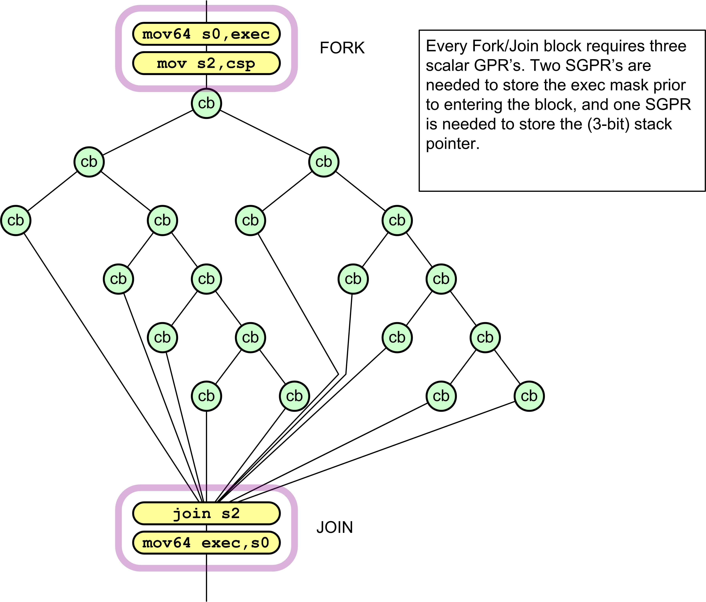

   Example of Complex Control Flow Graph

The register requirements per wavefront are:

-  CSP [2:0] - control stack pointer.

-  Six stack entries of 128-bits each, stored in SGPRS: { exec[63:0],
   PC[47:2] }

This method compares how many of the 64 threads go down the PASS path instead of the FAIL path; then, it selects the path with the fewer number of threads first. This means at most 50% of the threads are active, and this limits the necessary stack depth to Log264 = 6.

The following pseudo-code shows the details of CBRANCH Fork and Join operations.

::
   
    S_CBRANCH_G_FORK arg0, arg1
        // arg1 is an sgpr-pair which holds 64bit (48bit) target address

    S_CBRANCH_I_FORK arg0, #target_addr_offset[17:2]
        // target_addr_offset: 16b signed immediate offset

    // PC: in this pseudo-code is pointing to the cbranch_*_fork instruction
    mask_pass = SGPR[arg0] & exec
    mask_fail = ~SGPR[arg0] & exec

    if (mask_pass == exec)
        I_FORK : PC += 4 + target_addr_offset
        G_FORK: PC = SGPR[arg1]
    else if (mask_fail == exec)
        PC += 4
    else if (bitcount(mask_fail) < bitcount(mask_pass))
        exec = mask_fail
        I_FORK : SGPR[CSP*4] = { (pc + 4 + target_addr_offset), mask_pass }
        G_FORK: SGPR[CSP*4] = { SGPR[arg1], mask_pass }
        CSP++
        PC += 4
    else
        exec = mask_pass
        SGPR[CSP*4] = { (pc+4), mask_fail }
        CSP++
        I_FORK : PC += 4 + target_addr_offset
        G_FORK: PC = SGPR[arg1]

    S_CBRANCH_JOIN arg0
    if (CSP == SGPR[arg0]) // SGPR[arg0] holds the CSP value when the FORK started
        PC += 4 // this is the 2nd time to JOIN: continue with pgm
    else
        CSP -- // this is the 1st time to JOIN: jump to other FORK path
        {PC, EXEC} = SGPR[CSP*4] // read 128-bits from 4 consecutive SGPRs
    
    

Scalar ALU Operations
=====================

Scalar ALU (SALU) instructions operate on a single value per wavefront.These operations consist of 32-bit integer arithmetic and 32- or 64-bit bit-wise operations. The SALU also can perform operations directly on the Program Counter, allowing the program to create a call stack in SGPRs. Many operations also set the Scalar Condition Code bit (SCC) to indicate the result of a comparison, a carry-out, or whether the instruction result was zero.

SALU Instruction Formats
------------------------

SALU instructions are encoded in one of five microcode formats, shown
below:

|microcode sop1|

|microcode sop2|

|microcode sopk|

|microcode sopc|

|microcode sopp|

Each of these instruction formats uses some of these fields:

+-----------------------+----------------------------------------------------+
| Field                 | Description                                        |
+=======================+====================================================+
| OP                    | Opcode: instruction to be executed.                |
+-----------------------+----------------------------------------------------+
| SDST                  | Destination SGPR.                                  |
+-----------------------+----------------------------------------------------+
| SSRC0                 | First source operand.                              |
+-----------------------+----------------------------------------------------+
| SSRC1                 | Second source operand.                             |
+-----------------------+----------------------------------------------------+
| SIMM16                | Signed immediate 16-bit integer constant.          |
+-----------------------+----------------------------------------------------+

The lists of similar instructions sometimes use a condensed form using curly braces { } to express a list of possible names. For example, S\_AND\_{B32, B64} defines two legal instructions: S\_AND\_B32 and S\_AND\_B64.

Scalar ALU Operands
-------------------

Valid operands of SALU instructions are:

-  SGPRs, including trap temporary SGPRs.

-  Mode register.

-  Status register (read-only).

-  M0 register.

-  TrapSts register.

-  EXEC mask.

-  VCC mask.

-  SCC.

-  PC.

-  Inline constants: integers from -16 to 64, and a some floating point
   values.

-  VCCZ, EXECZ, and SCC.

-  Hardware registers.

-  32-bit literal constant.

In the table below, 0-127 can be used as scalar sources or destinations;
128-255 can only be used as sources.

+------------------------------+-----------------------+---------------------------------------------------------------+
| Code scalar Dest (0-7 bits)  | Meaning               | Description                                                   |
+==============================+=======================+===============================================================+
| 0-101                        | SGPR 0 to 101         | Scalar GPRs                                                   |
+------------------------------+-----------------------+---------------------------------------------------------------+
| 102                          | FLAT\_SCR             | Holds the low\_LO Dword of the flatscratch memory descriptor  |
+------------------------------+-----------------------+---------------------------------------------------------------+
| 103                          | FLAT\_SCR             | Holds the high\_HI Dword of the flatscratch memory descriptor |
+------------------------------+-----------------------+---------------------------------------------------------------+
| 104                          | XNACK\_MA             | Holds the lowSK\_LO Dword of the XNACK mask                   |
+------------------------------+-----------------------+---------------------------------------------------------------+
| 105                          | XNACK\_MA             | Holds the high SK\_HI Dword of the XNACK mask                 |
+------------------------------+-----------------------+---------------------------------------------------------------+
| 106                          | VCC\_LO               | Holds the low Dword of the vector condition code              |
+------------------------------+-----------------------+---------------------------------------------------------------+
| 107                          | VCC\_HI               | Holds the high Dword of the vector condition code             |
+------------------------------+-----------------------+---------------------------------------------------------------+
| 108-123                      | TTMP0 to   Trap temps | TTMP15 (privileged)                                           |
+------------------------------+-----------------------+---------------------------------------------------------------+
| 124                          | M0                    | Holds the low Dword of the flatscratch memory descriptor      |
+------------------------------+-----------------------+---------------------------------------------------------------+
| 125                          | reserved              | reserved                                                      |
+------------------------------+-----------------------+---------------------------------------------------------------+
| 126                          | EXEC\_LO              | Execute mask, low Dword                                       |
+------------------------------+-----------------------+---------------------------------------------------------------+
| 127                          | EXEC\_HI              | Execute mask, high Dword                                      |
+------------------------------+-----------------------+---------------------------------------------------------------+
| 128                          | 0                     | zero                                                          |
+------------------------------+-----------------------+---------------------------------------------------------------+
| 129-192                      | int 1 to 64           | Positive integer values.                                      |
+------------------------------+-----------------------+---------------------------------------------------------------+
| 193-208                      | int 1 to 16           | Negative integer values.                                      |
+------------------------------+-----------------------+---------------------------------------------------------------+
| 209-234                      | reserved              | Unused.                                                       |
+------------------------------+-----------------------+---------------------------------------------------------------+
| 235                          |  SHARED\_BASE         | Memory Aperture definition.                                   |
+------------------------------+-----------------------+---------------------------------------------------------------+
| 236                          |  SHARED\_LIMIT        |                                                               |
+------------------------------+-----------------------+---------------------------------------------------------------+
| 237                          | PRIVATE\_BASE         |                                                               |
+------------------------------+-----------------------+---------------------------------------------------------------+
| 238                          | PRIVATE\_LIMIT        |                                                               |
+------------------------------+-----------------------+---------------------------------------------------------------+
| 239                          | POPS\_EXITING\_WAV    | Primitive Ordered Pixel Shading E\_IDwave ID.                 |
+------------------------------+-----------------------+---------------------------------------------------------------+
| 240                          | 0.5                   | single or double floats                                       |
+------------------------------+-----------------------+---------------------------------------------------------------+
| 241                          | 0.5                   |                                                               |
+------------------------------+-----------------------+---------------------------------------------------------------+
| 242                          | 1.0                   |                                                               |
+------------------------------+-----------------------+---------------------------------------------------------------+
| 243                          | 1.0                   |                                                               |
+------------------------------+-----------------------+---------------------------------------------------------------+
| 244                          | 2.0                   |                                                               |
+------------------------------+-----------------------+---------------------------------------------------------------+
| 245                          | 2.0                   |                                                               |
+------------------------------+-----------------------+---------------------------------------------------------------+
| 246                          | 4.0                   |                                                               |
+------------------------------+-----------------------+---------------------------------------------------------------+
| 247                          | 4.0                   |                                                               |
+------------------------------+-----------------------+---------------------------------------------------------------+
| 248                          | 1.0 / (2 \* PI)       |                                                               |
+------------------------------+-----------------------+---------------------------------------------------------------+
| 249-250                      | reserved              | unused                                                        |
+------------------------------+-----------------------+---------------------------------------------------------------+
| 251                          | VCCZ                  | { zeros, VCCZ }                                               |
+------------------------------+-----------------------+---------------------------------------------------------------+
| 252                          | EXECZ                 | { zeros, EXECZ}                                               |
+------------------------------+-----------------------+---------------------------------------------------------------+
| 253                          | SCC                   | { zeros, SCC }                                                |
+------------------------------+-----------------------+---------------------------------------------------------------+
| 254                          | reserved              | unused                                                        |
+------------------------------+-----------------------+---------------------------------------------------------------+
| 255                          | Literal               | constant 32bit constant from instruction stream.              |
+------------------------------+-----------------------+---------------------------------------------------------------+

	**Table : Scalar Operands**

The SALU cannot use VGPRs or LDS. SALU instructions can use a 32-bit literal constant. This constant is part of the instruction stream and is available to all SALU microcode formats except SOPP and SOPK. Literal constants are used by setting the source instruction field to "literal" (255), and then the following instruction dword is used as the source value.

If any source SGPR is out-of-range, the value of SGPR0 is used instead.

If the destination SGPR is out-of-range, no SGPR is written with the result. However, SCC and possibly EXEC (if saveexec) will still be written.

If an instruction uses 64-bit data in SGPRs, the SGPR pair must be aligned to an even boundary. For example, it is legal to use SGPRs 2 and 3 or 8 and 9 (but not 11 and 12) to represent 64-bit data.

Scalar Condition Code (SCC)
---------------------------

The scalar condition code (SCC) is written as a result of executing most SALU instructions.

The SCC is set by many instructions:

-  Compare operations: 1 = true.

-  Arithmetic operations: 1 = carry out.

   -  SCC = overflow for signed add and subtract operations. For add, overflow = both operands are of the same sign, and the MSB (sign
      bit) of the result is different than the sign of the operands. For subtract (AB), overflow = A and B have opposite signs and the
      resulting sign is not the same as the sign of A.

-  Bit/logical operations: 1 = result was not zero.

Integer Arithmetic Instructions
-------------------------------

This section describes the arithmetic operations supplied by the SALU.
The table below shows the scalar integer arithmetic instructions:

+-------------------+------------+------------+------------------------------------+
| Instruction       | Encoding   | Sets SCC?  | Operation                          |
+===================+============+============+====================================+
| S\_ADD\_I32       | SOP2       | y          | D = S0 + S1, SCC = overflow.       |
+-------------------+------------+------------+------------------------------------+
| S\_ADD\_U32       | SOP2       | y          | D = S0 + S1, SCC = carry out.      |
+-------------------+------------+------------+------------------------------------+
| S\_ADDC\_U32      | SOP2       | y          | D = S0 + S1 + SCC = overflow.      |
+-------------------+------------+------------+------------------------------------+
| S\_SUB\_I32       | SOP2       | y          | D = S0 - S1, SCC = overflow.       |
+-------------------+------------+------------+------------------------------------+
| S\_SUB\_U32       | SOP2       | y          | D = S0 - S1, SCC = carry out.      |
+-------------------+------------+------------+------------------------------------+
| S\_SUBB\_U32      | SOP2       | y          | D = S0 - S1 - SCC = carry out.     |
+-------------------+------------+------------+------------------------------------+
| S\_ABSDIFF\_I32   | SOP2       | y          | D = abs (s1 - s2), SCC = result    |
|                   |            |            | not zero.                          |
+-------------------+------------+------------+------------------------------------+
| | S\_MIN\_I32     | SOP2       | y          | D = (S0 < S1) ? S0 : S1. SCC = 1   |
| | S\_MIN\_U32     |            |            | if S0 was min.                     |
+-------------------+------------+------------+------------------------------------+
| | S\_MAX\_I32     | SOP2       | y          | D = (S0 > S1) ? S0 : S1. SCC = 1   |
| | S\_MAX\_U32     |            |            | if S0 was max.                     |
+-------------------+------------+------------+------------------------------------+
| S\_MUL\_I32       | SOP2       | n          | D = S0 \* S1. Low 32 bits of       |
|                   |            |            | result.                            |
+-------------------+------------+------------+------------------------------------+
| S\_ADDK\_I32      | SOPK       | y          | D = D + simm16, SCC = overflow.    |
|                   |            |            | Sign extended version of simm16.   |
+-------------------+------------+------------+------------------------------------+
| S\_MULK\_I32      | SOPK       | n          | D = D \* simm16. Return low        |
|                   |            |            | 32bits. Sign extended version of   |
|                   |            |            | simm16.                            |
+-------------------+------------+------------+------------------------------------+
| S\_ABS\_I32       | SOP1       | y          | D.i = abs (S0.i). SCC=result not   |
|                   |            |            | zero.                              |
+-------------------+------------+------------+------------------------------------+
| S\_SEXT\_I32\_I8  | SOP1       | n          | D = { 24{S0[7]}, S0[7:0] }.        |
+-------------------+------------+------------+------------------------------------+
| S\_SEXT\_I32\_I16 | SOP1       | n          | D = { 16{S0[15]}, S0[15:0] }.      |
+-------------------+------------+------------+------------------------------------+

Table: Integer Arithmetic Instructions

Conditional Instructions
------------------------

Conditional instructions use the SCC flag to determine whether to
perform the operation, or (for CSELECT) which source operand to use.

+-------------+--------------------+--------------------+--------------------------+
| Instruction | Encoding           | Sets SCC?          | Operation                |
+=============+====================+====================+==========================+
| S\_CSELECT\ | SOP2               | n                  | D = SCC ? S0 : S1.       |
| _{B32,      |                    |                    |                          |
| B64}        |                    |                    |                          |
+-------------+--------------------+--------------------+--------------------------+
| S\_CMOVK\_I | SOPK               | n                  | if (SCC) D =             |
| 32          |                    |                    | signext(simm16).         |
+-------------+--------------------+--------------------+--------------------------+
| S\_CMOV\_{B | SOP1               | n                  | if (SCC) D = S0, else    |
| 32,B64}     |                    |                    | NOP.                     |
+-------------+--------------------+--------------------+--------------------------+

	**Table : Conditional Instructions**

Comparison Instructions
-----------------------

These instructions compare two values and set the SCC to 1 if the
comparison yielded a TRUE result.

+----------------------+----------+----------+------------------------------------+
| Instruction          | Encoding | Sets     | Operation                          |
|                      |          | SCC?     |                                    |
+======================+==========+==========+====================================+
| S\_CMP\_EQ\_U64,     | SOPC     | y        | Compare two 64-bit source values.  |
| S\_CMP\_NE\_U64      |          |          | SCC = S0 <cond> S1.                |
+----------------------+----------+----------+------------------------------------+
| S\_CMP\_{EQ,NE,GT,GE | SOPC     | y        | Compare two source values. SCC =   |
| ,LE,LT}\_{I32,U32}   |          |          | S0 <cond> S1.                      |
+----------------------+----------+----------+------------------------------------+
| S\_CMPK\_{EQ,NE,GT,G | SOPK     | y        | Compare Dest SGPR to a constant.   |
| E,LE,LT}\_{I32,U32}  |          |          | SCC = DST <cond> simm16. simm16 is |
|                      |          |          | zero-extended (U32) or             |
|                      |          |          | sign-extended (I32).               |
+----------------------+----------+----------+------------------------------------+
| S\_BITCMP0\_{B32,B64 | SOPC     | y        | Test for "is a bit zero". SCC =    |
| }                    |          |          | !S0[S1].                           |
+----------------------+----------+----------+------------------------------------+
| S\_BITCMP1\_{B32,B64 | SOPC     | y        | Test for "is a bit one". SCC =     |
| }                    |          |          | S0[S1].                            |
+----------------------+----------+----------+------------------------------------+
	
	**Table : Conditional Instructions**

Bit-Wise Instructions
---------------------

Bit-wise instructions operate on 32- or 64-bit data without interpreting
it has having a type. For bit-wise operations if noted in the table
below, SCC is set if the result is nonzero.

+---------------------------+---------+--------+----------------------------------+
| Instruction               | Encodin | Sets   | Operation                        |
|                           | g       | SCC?   |                                  |
+===========================+=========+========+==================================+
| S\_MOV\_{B32,B64}         | SOP1    | n      | D = S0                           |
+---------------------------+---------+--------+----------------------------------+
| S\_MOVK\_I32              | SOPK    | n      | D = signext(simm16)              |
+---------------------------+---------+--------+----------------------------------+
| {S\_AND,S\_OR,S\_XOR}\_{B | SOP2    | y      | D = S0 & S1, S0 OR S1, S0 XOR S1 |
| 32,B64}                   |         |        |                                  |
+---------------------------+---------+--------+----------------------------------+
| {S\_ANDN2,S\_ORN2}\_{B32, | SOP2    | y      | D = S0 & ~S1, S0 OR ~S1, S0 XOR  |
| B64}                      |         |        | ~S1,                             |
+---------------------------+---------+--------+----------------------------------+
| {S\_NAND,S\_NOR,S\_XNOR}\ | SOP2    | y      | D = ~(S0 & S1), ~(S0 OR S1),     |
| _{B32,B64}                |         |        | ~(S0 XOR S1)                     |
+---------------------------+---------+--------+----------------------------------+
| S\_LSHL\_{B32,B64}        | SOP2    | y      | D = S0 << S1[4:0], [5:0] for     |
|                           |         |        | B64.                             |
+---------------------------+---------+--------+----------------------------------+
| S\_LSHR\_{B32,B64}        | SOP2    | y      | D = S0 >> S1[4:0], [5:0] for     |
|                           |         |        | B64.                             |
+---------------------------+---------+--------+----------------------------------+
| S\_ASHR\_{I32,I64}        | SOP2    | y      | D = sext(S0 >> S1[4:0]) ([5:0]   |
|                           |         |        | for I64).                        |
+---------------------------+---------+--------+----------------------------------+
| S\_BFM\_{B32,B64}         | SOP2    | n      | Bit field mask. D = ((1 <<       |
|                           |         |        | S0[4:0]) - 1) << S1[4:0].        |
+---------------------------+---------+--------+----------------------------------+
| | S\_BFE\_U32,            | SOP2    | n      | | Bit Field Extract, then        |
|   S\_BFE\_U64             |         |        |   sign-extend result for I32/64  |
| | S\_BFE\_I32,            |         |        |   instructions.                  |
|   S\_BFE\_I64             |         |        | | S0 = data,                     |
| | (signed/unsigned)       |         |        | | S1[5:0] = offset, S1[22:16]=   |
|                           |         |        |   width.                         |
+---------------------------+---------+--------+----------------------------------+
| S\_NOT\_{B32,B64}         | SOP1    | y      | D = ~S0.                         |
+---------------------------+---------+--------+----------------------------------+
| S\_WQM\_{B32,B64}         | SOP1    | y      | D = wholeQuadMode(S0). If any    |
|                           |         |        | bit in a group of four is set to |
|                           |         |        | 1, set the resulting group of    |
|                           |         |        | four bits all to 1.              |
+---------------------------+---------+--------+----------------------------------+
| S\_QUADMASK\_{B32,B64}    | SOP1    | y      | D[0] = OR(S0[3:0]),              |
|                           |         |        | D[1]=OR(S0[7:4]), etc.           |
+---------------------------+---------+--------+----------------------------------+
| S\_BREV\_{B32,B64}        | SOP1    | n      | D = S0[0:31] are reverse bits.   |
+---------------------------+---------+--------+----------------------------------+
| S\_BCNT0\_I32\_{B32,B64}  | SOP1    | y      | D = CountZeroBits(S0).           |
+---------------------------+---------+--------+----------------------------------+
| S\_BCNT1\_I32\_{B32,B64}  | SOP1    | y      | D = CountOneBits(S0).            |
+---------------------------+---------+--------+----------------------------------+
| S\_FF0\_I32\_{B32,B64}    | SOP1    | n      | D = Bit position of first zero   |
|                           |         |        | in S0 starting from LSB. -1 if   |
|                           |         |        | not found.                       |
+---------------------------+---------+--------+----------------------------------+
| S\_FF1\_I32\_{B32,B64}    | SOP1    | n      | D = Bit position of first one in |
|                           |         |        | S0 starting from LSB. -1 if not  |
|                           |         |        | found.                           |
+---------------------------+---------+--------+----------------------------------+
| S\_FLBIT\_I32\_{B32,B64}  | SOP1    | n      | Find last bit. D = the number of |
|                           |         |        | zeros before the first one       |
|                           |         |        | starting from the MSB. Returns   |
|                           |         |        | -1 if none.                      |
+---------------------------+---------+--------+----------------------------------+
| | S\_FLBIT\_I32           | SOP1    | n      | | Count how many bits in a row   |
| | S\_FLBIT\_I32\_I64      |         |        |   (from MSB to LSB) are the same |
|                           |         |        |   as the sign bit. Return -1 if  |
|                           |         |        |   the input is zero or all 1’s   |
|                           |         |        |   (-1). 32-bit pseudo-code:      |
|                           |         |        | | if (S0 == 0 \|\| S0 == -1) D = |
|                           |         |        |   -1                             |
|                           |         |        | | else                           |
|                           |         |        | | D = 0                          |
|                           |         |        | | for (I = 31 .. 0)              |
|                           |         |        | | if (S0[I] == S0[31])           |
|                           |         |        | | D++                            |
|                           |         |        | | else break                     |
|                           |         |        | | This opcode behaves the same   |
|                           |         |        |   as V\_FFBH\_I32.               |
+---------------------------+---------+--------+----------------------------------+
| S\_BITSET0\_{B32,B64}     | SOP1    | n      | D[S0[4:0], [5:0] for B64] = 0    |
+---------------------------+---------+--------+----------------------------------+
| S\_BITSET1\_{B32,B64}     | SOP1    | n      | D[S0[4:0], [5:0] for B64] = 1    |
+---------------------------+---------+--------+----------------------------------+
| S\_{and,or,xor,andn2,orn2 | SOP1    | y      | | Save the EXEC mask, then apply |
| ,nand,                    |         |        |   a bit-wise operation to it.    |
| nor,xnor}\_SAVEEXEC\_B64  |         |        | | D = EXEC                       |
|                           |         |        | | EXEC = S0 <op> EXEC            |
|                           |         |        | | SCC = (exec != 0)              |
+---------------------------+---------+--------+----------------------------------+
| S\_{ANDN{1,2}\_WREXEC\_B6 | SOP1    | y      | | N1: EXEC, D = ~S0 & EXEC       |
| 4                         |         |        | | N2: EXEC, D = S0 & ~EXEC       |
|                           |         |        | | Both D and EXEC get the same   |
|                           |         |        |   result. SCC = (result != 0).   |
+---------------------------+---------+--------+----------------------------------+
| | S\_MOVRELS\_{B32,B64}   | SOP1    | n      | | Move a value into an SGPR      |
| | S\_MOVRELD\_{B32,B64}   |         |        |   relative to the value in M0.   |
|                           |         |        | | MOVERELS: D = SGPR[S0+M0]      |
|                           |         |        | | MOVERELD: SGPR[D+M0] = S0      |
|                           |         |        | | Index must be even for 64. M0  |
|                           |         |        |   is an unsigned index.          |
+---------------------------+---------+--------+----------------------------------+

	**Table : Bit-Wise Instructions**

Special Instructions
--------------------

These instructions access hardware internal registers.

+-------------------+---------+--------+------------------------------------------+
| Instruction       | Encodin | Sets   | Operation                                |
|                   | g       | SCC?   |                                          |
+===================+=========+========+==========================================+
| S\_GETREG\_B32    | SOPK\*  | n      | Read a hardware register into the LSBs   |
|                   |         |        | of D.                                    |
+-------------------+---------+--------+------------------------------------------+
| S\_SETREG\_B32    | SOPK\*  | n      | Write the LSBs of D into a hardware      |
|                   |         |        | register. (Note that D is a source       |
|                   |         |        | SGPR.) Must add an S\_NOP between two    |
|                   |         |        | consecutive S\_SETREG to the same        |
|                   |         |        | register.                                |
+-------------------+---------+--------+------------------------------------------+
| S\_SETREG\_IMM32\ | SOPK\*  | n      | S\_SETREG where 32-bit data comes from a |
| _B32              |         |        | literal constant (so this is a 64-bit    |
|                   |         |        | instruction format).                     |
+-------------------+---------+--------+------------------------------------------+

	**Table : Hardware Internal Registers**

The hardware register is specified in the DEST field of the instruction,using the values in the table above. Some bits of the DEST specify which register to read/write, but additional bits specify which bits in the
special register to read/write:

::

    SIMM16 = {size[4:0], offset[4:0], hwRegId[5:0]}; offset is 0..31, size is 1..32.

+-----------------------+-----------------------+------------------------------+
| Code                  | Register              | Description                  |
+=======================+=======================+==============================+
| 0                     | reserved              |                              |
+-----------------------+-----------------------+------------------------------+
| 1                     | MODE                  | R/W.                         |
+-----------------------+-----------------------+------------------------------+
| 2                     | STATUS                | Read only.                   |
+-----------------------+-----------------------+------------------------------+
| 3                     | TRAPSTS               | R/W.                         |
+-----------------------+-----------------------+------------------------------+
| 4                     | HW\_ID                | Read only. Debug only.       |
+-----------------------+-----------------------+------------------------------+
| 5                     | GPR\_ALLOC            | Read only. {sgpr\_size,      |
|                       |                       | sgpr\_base, vgpr\_size,      |
|                       |                       | vgpr\_base }.                |
+-----------------------+-----------------------+------------------------------+
| 6                     | LDS\_ALLOC            | Read only. {lds\_size,       |
|                       |                       | lds\_base}.                  |
+-----------------------+-----------------------+------------------------------+
| 7                     | IB\_STS               | Read only. {valu\_cnt,       |
|                       |                       | lgkm\_cnt, exp\_cnt,         |
|                       |                       | vm\_cnt}.                    |
+-----------------------+-----------------------+------------------------------+
| 8 - 15                |                       | reserved.                    |
+-----------------------+-----------------------+------------------------------+
| 16                    | TBA\_LO               | Trap base address register   |
|                       |                       | [31:0].                      |
+-----------------------+-----------------------+------------------------------+
| 17                    | TBA\_HI               | Trap base address register   |
|                       |                       | [47:32].                     |
+-----------------------+-----------------------+------------------------------+
| 18                    | TMA\_LO               | Trap memory address register |
|                       |                       | [31:0].                      |
+-----------------------+-----------------------+------------------------------+
| 19                    | TMA\_HI               | Trap memory address register |
|                       |                       | [47:32].                     |
+-----------------------+-----------------------+------------------------------+

	**Table : Hardware Register Values**

+-----------------------+-----------------------+------------------------------+
| Code                  | Register              | Description                  |
+=======================+=======================+==============================+
| VM\_CNT               | | 23:22,              | Number of VMEM instructions  |
|                       | | 3:0                 | issued but not yet returned. |
+-----------------------+-----------------------+------------------------------+
| EXP\_CNT              | 6:4                   | Number of Exports issued but |
|                       |                       | have not yet read their data |
|                       |                       | from VGPRs.                  |
+-----------------------+-----------------------+------------------------------+
| LGKM\_CNT             | 11:8                  | LDS, GDS, Constant-memory    |
|                       |                       | and Message instructions     |
|                       |                       | issued-but-not-completed     |
|                       |                       | count.                       |
+-----------------------+-----------------------+------------------------------+
| VALU\_CNT             | 14:12                 | Number of VALU instructions  |
|                       |                       | outstanding for this         |
|                       |                       | wavefront.                   |
+-----------------------+-----------------------+------------------------------+

	**Table : IB\_STS**

+-----------------------+-----------------------+------------------------------+
| Code                  | Register              | Description                  |
+=======================+=======================+==============================+
| VGPR\_BASE            | 5:0                   | Physical address of first    |
|                       |                       | VGPR assigned to this        |
|                       |                       | wavefront, as [7:2]          |
+-----------------------+-----------------------+------------------------------+
| VGPR\_SIZE            | 13:8                  | Number of VGPRs assigned to  |
|                       |                       | this wavefront, as [7:2].    |
|                       |                       | 0=4 VGPRs, 1=8 VGPRs, etc.   |
+-----------------------+-----------------------+------------------------------+
| SGPR\_BASE            | 21:16                 | Physical address of first    |
|                       |                       | SGPR assigned to this        |
|                       |                       | wavefront, as [7:3].         |
+-----------------------+-----------------------+------------------------------+
| SGPR\_SIZE            | 27:24                 | Number of SGPRs assigned to  |
|                       |                       | this wave, as [7:3]. 0=8     |
|                       |                       | SGPRs, 1=16 SGPRs, etc.      |
+-----------------------+-----------------------+------------------------------+

	**Table  : GPR\_ALLOC**

+-----------------------+-----------------------+------------------------------+
| Code                  | Register              | Description                  |
+=======================+=======================+==============================+
| LDS\_BASE             | 7:0                   | Physical address of first    |
|                       |                       | LDS location assigned to     |
|                       |                       | this wavefront, in units of  |
|                       |                       | 64 Dwords.                   |
+-----------------------+-----------------------+------------------------------+
| LDS\_SIZE             | 20:12                 | Amount of LDS space assigned |
|                       |                       | to this wavefront, in units  |
|                       |                       | of 64 Dwords.                |
+-----------------------+-----------------------+------------------------------+

**Table : LDS\_ALLOC**

Vector ALU Operations
=====================

Vector ALU instructions (VALU) perform an arithmetic or logical operation on data for each of 64 threads and write results back to
VGPRs, SGPRs or the EXEC mask.

Parameter interpolation is a mixed VALU and LDS instruction, and is described in the Data Share chapter.

Microcode Encodings
-------------------

Most VALU instructions are available in two encodings: VOP3 which uses 64-bits of instruction and has the full range of capabilities, and one of three 32-bit encodings that offer a restricted set of capabilities. A few instructions are only available in the VOP3 encoding. The only instructions that cannot use the VOP3 format are the parameter interpolation instructions.

When an instruction is available in two microcode formats, it is up to the user to decide which to use. It is recommended to use the 32-bit encoding whenever possible.

The microcode encodings are shown below.

VOP2 is for instructions with two inputs and a single vector destination. Instructions that have a carry-out implicitly write the
carry-out to the VCC register.

|microcode vop2|

VOP1 is for instructions with no inputs or a single input and one destination.

|microcode vop1|

VOPC is for comparison instructions.

|microcode vopc|

VINTRP is for parameter interpolation instructions.

|microcode vintrp|

VOP3 is for instructions with up to three inputs, input modifiers
(negate and absolute value), and output modifiers. There are two forms
of VOP3: one which uses a scalar destination field (used only for
div\_scale, integer add and subtract); this is designated VOP3b. All
other instructions use the common form, designated VOP3a.

|microcode vop3a|

|microcode vop3b|

Any of the 32-bit microcode formats may use a 32-bit literal constant,
but not VOP3.

VOP3P is for instructions that use "packed math": They perform the operation on a pair of input values that are packed into the high and low 16-bits of each operand; the two 16-bit results are written to a single VGPR as two packed values.

|microcode vop3p|

Operands
--------

All VALU instructions take at least one input operand (except V\_NOP and V\_CLREXCP). The data-size of the operands is explicitly defined in the name of the instruction. For example, V\_MAD\_F32 operates on 32-bit floating point data.

Instruction Inputs
~~~~~~~~~~~~~~~~~~

VALU instructions can use any of the following sources for input,
subject to restrictions listed below:

-  VGPRs.

-  SGPRs.

-  Inline constants - constant selected by a specific VSRC value.

-  Literal constant - 32-bit value in the instruction stream. When a
   literal constant is used with a 64bit instruction, the literal is
   expanded to 64 bits by: padding the LSBs with zeros for floats,
   padding the MSBs with zeros for unsigned ints, and by sign-extending
   signed ints.

-  LDS direct data read.

-  M0.

-  EXEC mask.

**Limitations**

-  At most one SGPR can be read per instruction, but the value can be
   used for more than one operand.

-  At most one literal constant can be used, and only when an SGPR or M0
   is not used as a source.

-  Only SRC0 can use LDS\_DIRECT (see Chapter 10, "Data Share
   Operations").

   Special Cases for Constants
       | VALU "ADDC", "SUBB" and CNDMASK all implicitly use an
       | SGPR value (VCC), so these instructions cannot use an
         additional SGPR or literal constant.

Instructions using the VOP3 form and also using floating-point inputs
have the option of applying absolute value (ABS field) or negate (NEG
field) to any of the input operands.

Literal Expansion to 64 bits
^^^^^^^^^^^^^^^^^^^^^^^^^^^^

Literal constants are 32-bits, but they can be used as sources which
normally require 64-bit data:

-  64 bit float: the lower 32-bit are padded with zero.

-  64-bit unsigned integer: zero extended to 64 bits

-  64-bit signed integer: sign extended to 64 bits

Instruction Outputs
~~~~~~~~~~~~~~~~~~~

VALU instructions typically write their results to VGPRs specified in
the VDST field of the microcode word. A thread only writes a result if
the associated bit in the EXEC mask is set to 1.

All V\_CMPX instructions write the result of their comparison (one bit
per thread) to both an SGPR (or VCC) and the EXEC mask.

Instructions producing a carry-out (integer add and subtract) write
their result to VCC when used in the VOP2 form, and to an arbitrary
SGPR-pair when used in the VOP3 form.

When the VOP3 form is used, instructions with a floating-point result
can apply an output modifier (OMOD field) that multiplies the result by:
0.5, 1.0, 2.0 or 4.0. Optionally, the result can be clamped (CLAMP
field) to the range [0.0, +1.0].

In the table below, all codes can be used when the vector source is nine
bits; codes 0 to 255 can be the scalar source if it is eight bits; codes
0 to 127 can be the scalar source if it is seven bits; and codes 256 to
511 can be the vector source or destination.

+-----------+--------------------+-----------------------------------------------+
| Field     | Bit Position       | Description                                   |
+===========+====================+===============================================+
| 0-101     | SGPR               | 0 .. 101                                      |
+-----------+--------------------+-----------------------------------------------+
| 102       | FLATSCR\_LO        | Flat Scratch[31:0].                           |
+-----------+--------------------+-----------------------------------------------+
| 103       | FLATSCR\_HI        | Flat Scratch[63:32].                          |
+-----------+--------------------+-----------------------------------------------+
| 104       | XNACK\_MASK\_LO    |                                               |
+-----------+--------------------+-----------------------------------------------+
| 105       | XNACK\_MASK\_HI    |                                               |
+-----------+--------------------+-----------------------------------------------+
| 106       | VCC\_LO            | vcc[31:0].                                    |
+-----------+--------------------+-----------------------------------------------+
| 107       | VCC\_HI            | vcc[63:32].                                   |
+-----------+--------------------+-----------------------------------------------+
| 108-123   | TTMP0 to TTMP 15   | Trap handler temps (privileged).              |
+-----------+--------------------+-----------------------------------------------+
| 124       | M0                 |                                               |
+-----------+--------------------+-----------------------------------------------+
| 125       | reserved           |                                               |
+-----------+--------------------+-----------------------------------------------+
| 126       | EXEC\_LO           | exec[31:0].                                   |
+-----------+--------------------+-----------------------------------------------+
| 127       | EXEC\_HI           | exec[63:32].                                  |
+-----------+--------------------+-----------------------------------------------+
| 128       | 0                  |                                               |
+-----------+--------------------+-----------------------------------------------+
| 129-192   | int 1.. 64         | Integer inline constants.                     |
+-----------+--------------------+-----------------------------------------------+
| 193-208   | int -1 .. -16      |                                               |
+-----------+--------------------+-----------------------------------------------+
| 209-234   | reserved           | Unused.                                       |
+-----------+--------------------+-----------------------------------------------+
| 235       | SHARED\_BASE       | Memory Aperture definition.                   |
+-----------+--------------------+-----------------------------------------------+
| 236       | SHARED\_LIMIT      |                                               |
+-----------+--------------------+-----------------------------------------------+
| 237       | PRIVATE\_BASE      |                                               |      
+-----------+--------------------+-----------------------------------------------+
| 238       | PRIVATE\_LIMIT     |                                               |
+-----------+--------------------+-----------------------------------------------+
| 239       | POPS\_EXITING\_WAV | Primitive Ordered Pixel Shading wave ID.      |
|           | E\_ID              |                                               |
+-----------+--------------------+-----------------------------------------------+
| 240       | 0.5                | | Single, double, or half-precision inline    |
|           |                    |   floats.                                     |
|           |                    | | 1/(2\*PI) is 0.15915494.                    |
|           |                    | | The exact value used is:                    |
|           |                    | | half: 0x3118                                |
|           |                    | | single: 0x3e22f983                          |
|           |                    | | double: 0x3fc45f306dc9c882                  |
+-----------+--------------------+-----------------------------------------------+
| 241       | -0.5               |                                               |
+-----------+--------------------+-----------------------------------------------+
| 242       | 1.0                |                                               |
+-----------+--------------------+-----------------------------------------------+
| 243       | -1.0               |                                               |
+-----------+--------------------+-----------------------------------------------+
| 244       | 2.0                |                                               |       
+-----------+--------------------+-----------------------------------------------+
| 245       | -2.0               |                                               |
+-----------+--------------------+-----------------------------------------------+
| 246       | 4.0                |                                               |
+-----------+--------------------+-----------------------------------------------+
| 247       | -4.0               |                                               |
+-----------+--------------------+-----------------------------------------------+
| 248       | 1/(2\*PI)          |                                               |
+-----------+--------------------+-----------------------------------------------+
| 249       | SDWA               | 250                                           |
+-----------+--------------------+-----------------------------------------------+
| DPP       | 251                | VCCZ                                          |
+-----------+--------------------+-----------------------------------------------+
| { zeros,  | 252                | EXECZ                                         |
| VCCZ }    |                    |                                               |
+-----------+--------------------+-----------------------------------------------+
| { zeros,  | 253                | SCC                                           |
| EXECZ }   |                    |                                               |
+-----------+--------------------+-----------------------------------------------+
| { zeros,  | 254                | LDS direct                                    |
| SCC }     |                    |                                               |
+-----------+--------------------+-----------------------------------------------+
| Use LDS   | 255                | Literal                                       |
| direct    |                    |                                               |
| read to   |                    |                                               |
| supply    |                    |                                               |
| 32-bit    |                    |                                               |
| value     |                    |                                               |
| Vector-al |                    |                                               |
| u         |                    |                                               |
| instructi |                    |                                               |
| ons       |                    |                                               |
| only.     |                    |                                               |
+-----------+--------------------+-----------------------------------------------+
| constant  | 256-511            | VGPR                                          |
| 32-bit    |                    |                                               |
| constant  |                    |                                               |
| from      |                    |                                               |
| instructi |                    |                                               |
| on        |                    |                                               |
| stream.   |                    |                                               |
+-----------+--------------------+-----------------------------------------------+

Table: Instruction Operands

Out-of-Range GPRs
~~~~~~~~~~~~~~~~~

When a source VGPR is out-of-range, the instruction uses as input the
value from VGPR0.

When the destination GPR is out-of-range, the instruction executes but
does not write the results.

Instructions
------------

The table below lists the complete VALU instruction set by microcode
encoding.

+----------------+----------------+----------------+------------------------------+
| VOP3           | VOP3 - 1-2     | VOP2           | VOP1                         |
|                | operand        |                |                              |
|                | opcodes        |                |                              |
+================+================+================+==============================+
| V\_MAD\_LEGACY | V\_ADD\_F64    | V\_ADD\_{      | V\_NOP                       |
| \_F32          |                | F16,F32,       |                              |
|                |                | U16,U32}       |                              |
+----------------+----------------+----------------+------------------------------+
| V\_MAD\_{      | V\_MUL\_F64    | V\_SUB\_{      | V\_MOV\_B32                  |
| F16,I16,U16,F3 |                | F16,F32,U16,   |                              |
| 2}             |                | U32}           |                              |
+----------------+----------------+----------------+------------------------------+
| V\_MAD\_LEGACY | V\_MIN\_F64    | V\_SUBREV\_{   |                              |
| \_{F16,U16,I16 |                | F16,F32,       |                              |
| }              |                | U16,U32}       |                              |
+----------------+----------------+----------------+------------------------------+
| V\_MAD\_I32\_I | V\_MAX\_F64    | V\_ADD\_CO\_U3 | V\_READFIRSTLANE\_B32        |
| 24             |                | 2              |                              |
+----------------+----------------+----------------+------------------------------+
| V\_MAD\_U32\_U | V\_LDEXP\_F64  | V\_SUB\_CO\_U3 | V\_CVT\_F32\_{I32,U32,F16,F6 |
| 24             |                | 2              | 4                            |
|                |                |                | }                            |
+----------------+----------------+----------------+------------------------------+
| V\_CUBEID\_F32 | V\_MUL\_LO\_U3 | V\_SUBREV\_CO\ | V\_CVT\_{I32,U32,F16,        |
|                | 2              | _U32           | F64}\_F32                    |
+----------------+----------------+----------------+------------------------------+
| V\_CUBESC\_F32 | V\_MUL\_HI\_{I | V\_ADDC\_U32   | V\_CVT\_{I32,U32}\_F64       |
|                | 32,U32}        |                |                              |
+----------------+----------------+----------------+------------------------------+
| V\_CUBETC\_F32 | V\_LSHLREV\_B6 | V\_SUBB\_U32   | V\_CVT\_F64\_{I32,U32}       |
|                | 4              |                |                              |
+----------------+----------------+----------------+------------------------------+
| V\_CUBEMA\_F32 | V\_LSHRREV\_B6 | V\_SUBBREV\_U3 | V\_CVT\_F32\_UBYTE{0,1,2,3}  |
|                | 4              | 2              |                              |
+----------------+----------------+----------------+------------------------------+
| V\_BFE\_{U32 , | V\_ASHRREV\_I6 | V\_MUL\_LEGACY | V\_CVT\_F16\_{U16, I16}      |
| I32 }          | 4              | \_F32          |                              |
+----------------+----------------+----------------+------------------------------+
| V\_FMA\_{ F16, | V\_LDEXP\_F32  | V\_MUL\_{F16,  | V\_CVT\_RPI\_I32\_F32        |
| F32 , F64}     |                | F32}           |                              |
+----------------+----------------+----------------+------------------------------+
| V\_FMA\_LEGACY | V\_READLANE\_B | V\_MUL\_I32\_I | V\_CVT\_FLR\_I32\_F32        |
| \_F16          | 32             | 24             |                              |
+----------------+----------------+----------------+------------------------------+
| V\_BFI\_B32    | V\_WRITELANE\_ | V\_MUL\_HI\_I3 | V\_CVT\_OFF\_F32\_I4         |
|                | B32            | 2\_I24         |                              |
+----------------+----------------+----------------+------------------------------+
| V\_LERP\_U8    | V\_BCNT\_U32\_ | V\_MUL\_U32\_U | V\_FRACT\_{ F16,F32,F64}     |
|                | B32            | 24             |                              |
+----------------+----------------+----------------+------------------------------+
| V\_ALIGNBIT\_B | V\_MBCNT\_LO\_ | V\_MUL\_HI\_U3 | V\_TRUNC\_{ F16,F32, F64}    |
| 32             | U32\_B32       | 2\_U24         |                              |
+----------------+----------------+----------------+------------------------------+
| V\_ALIGNBYTE\_ | V\_MBCNT\_HI\_ | V\_MIN\_{      | V\_CEIL\_{ F16,F32, F64}     |
| B32            | U32\_B32       | F16,U16,       |                              |
|                |                | I16,F32,I32,U3 |                              |
|                |                | 2}             |                              |
+----------------+----------------+----------------+------------------------------+
| V\_MIN3\_{F32, | V\_CVT\_PKACCU | V\_MAX\_{      | V\_RNDNE\_{ F16,F32, F64}    |
| I32,U32}       | M\_U8\_F32     | F16,U16,       |                              |
|                |                | I16,F32,I32,U3 |                              |
|                |                | 2}             |                              |
+----------------+----------------+----------------+------------------------------+
| V\_MAX3\_{F32, | V\_CVT\_PKNORM | V\_LSHRREV\_{  | V\_FLOOR\_{ F16,F32, F64}    |
| I32,U32}       | \_I16\_F32     | B16,B32}       |                              |
+----------------+----------------+----------------+------------------------------+
| V\_MED3\_{F32, | V\_CVT\_PKNORM | V\_ASHRREV\_{I | V\_EXP\_{ F16,F32}           |
| I32,U32}       | \_U16\_F32     | 16,I32}        |                              |
+----------------+----------------+----------------+------------------------------+
| V\_SAD\_{U8,   | V\_CVT\_PKRTZ\ | V\_LSHLREV\_{  | V\_LOG\_ {F16,F32}           |
| HI\_U8, U16,   | _F16\_F32      | B16,B32}       |                              |
| U32}           |                |                |                              |
+----------------+----------------+----------------+------------------------------+
| V\_CVT\_PK\_U8 | V\_CVT\_PK\_U1 | V\_AND\_B32    | V\_RCP\_{ F16,F32,F64}       |
| \_F32          | 6\_U32         |                |                              |
+----------------+----------------+----------------+------------------------------+
| V\_DIV\_FIXUP\ | V\_CVT\_PK\_I1 | V\_OR\_B32     | V\_RCP\_IFLAG\_F32           |
| _{             | 6\_I32         |                |                              |
| F16,F32,F64}   |                |                |                              |
+----------------+----------------+----------------+------------------------------+
| V\_DIV\_FIXUP\ | V\_MAC\_LEGACY | V\_XOR\_B32    | V\_RSQ\_{ F16,F32, F64}      |
| _LEGACY\_F16   | \_F32          |                |                              |
+----------------+----------------+----------------+------------------------------+
| V\_DIV\_SCALE\ | V\_BFM\_B32    | V\_MAC\_{      | V\_SQRT\_{ F16,F32,F64}      |
| _{F32,F64}     |                | F16,F32}       |                              |
+----------------+----------------+----------------+------------------------------+
| V\_DIV\_FMAS\_ | V\_INTERP\_P1\ | V\_MADMK\_{    | V\_SIN\_ {F16,F32}           |
| {F32,F64}      | _F32           | F16,F32}       |                              |
+----------------+----------------+----------------+------------------------------+
| V\_MSAD\_U8    | V\_INTERP\_P2\ | V\_MADAK\_{    | V\_COS\_ {F16,F32}           |
|                | _F32           | F16,F32}       |                              |
+----------------+----------------+----------------+------------------------------+
| V\_QSAD\_PK\_U | V\_INTERP\_MOV | V\_CNDMASK\_B3 | V\_NOT\_B32                  |
| 16\_U8         | \_F32          | 2              |                              |
+----------------+----------------+----------------+------------------------------+
| V\_MQSAD\_PK\_ | V\_INTERP\_P1L | V\_LDEXP\_F16  | V\_BFREV\_B32                |
| U16\_U8        | L\_F16         |                |                              |
+----------------+----------------+----------------+------------------------------+
| V\_MQSAD\_PK\_ | V\_INTERP\_P1L | MUL\_LO\_U16   | V\_FFBH\_{U32, I32}          |
| U32\_U8        | V\_F16         |                |                              |
+----------------+----------------+----------------+------------------------------+
| V\_TRIG\_PREOP | V\_INTERP\_P2\ |                | V\_FFBL\_B32                 |
| \_F64          | _F16           |                |                              |
+----------------+----------------+----------------+------------------------------+
| V\_MAD\_{U64\_ | V\_INTERP\_P2\ |                | V\_FREXP\_EXP\_I32\_F64      |
| U32,           | _LEGACY\_F16   |                |                              |
| I64\_I32}      |                |                |                              |
+----------------+----------------+----------------+------------------------------+
|                | V\_CVT\_PKNORM |                | V\_FREXP\_MANT\_{            |
|                | \_I16\_F16     |                | F16,F32,64}                  |
+----------------+----------------+----------------+------------------------------+
|                | V\_CVT\_PKNORM |                | V\_FREXP\_EXP\_I32\_F32      |
|                | \_U16\_F16     |                |                              |
+----------------+----------------+----------------+------------------------------+
|                | V\_MAD\_U32\_U |                | V\_FREXP\_EXP\_I16\_F16      |
|                | 16             |                |                              |
+----------------+----------------+----------------+------------------------------+
|                | V\_MAD\_I32\_I |                | V\_CLREXCP                   |
|                | 16             |                |                              |
+----------------+----------------+----------------+------------------------------+
|                | V\_XAD\_U32    |                | V\_MOV\_FED\_B32             |
+----------------+----------------+----------------+------------------------------+
|                | V\_MIN3\_{F16, |                | V\_CVT\_NORM\_I16\_F16       |
|                | I16,U16}       |                |                              |
+----------------+----------------+----------------+------------------------------+
|                | V\_MAX3\_{F16, |                | V\_CVT\_NORM\_U16\_F16       |
|                | I16,U16}       |                |                              |
+----------------+----------------+----------------+------------------------------+
|                | V\_MED3\_{F16, |                | V\_SAT\_PK\_U8\_I16          |
|                | I16,U16}       |                |                              |
+----------------+----------------+----------------+------------------------------+
|                | V\_CVT\_PKNORM |                | V\_WRITELANE\_REGWR          |
|                | \_{I16\_F16,   |                |                              |
|                | U16\_F16}      |                |                              |
+----------------+----------------+----------------+------------------------------+
|                | V\_READLANE\_R |                | V\_SWAP\_B32                 |
|                | EGRD\_B32      |                |                              |
+----------------+----------------+----------------+------------------------------+
|                | V\_PACK\_B32\_ |                | V\_SCREEN\_PARTITION\_4SE\_B |
|                | F16            |                | 32                           |
+----------------+----------------+----------------+------------------------------+

Table: VALU Instruction Set

| 
| The next table lists the compare instructions.

+----------------+----------------+------------------------------+------------------------------+
| Op             | Formats        | Functions                    | Result                       |
+================+================+==============================+==============================+
| V\_CMP         | I16, I32, I64, | F, LT, EQ, LE, GT, LG, GE, T | Write VCC..                  |
|                | U16, U32, U64  |                              |                              |
+----------------+----------------+------------------------------+------------------------------+
| V\_CMPX        | Write VCC and  |                              |                              | 
|                | exec.          |                              |                              |
+----------------+----------------+------------------------------+------------------------------+
| V\_CMP         | F16, F32, F64  | | F, LT, EQ,LE, GT, LG, GE,  | Write VCC.                   |
|                |                |   T, GE, T,                  |                              |
|                |                |                              |                              |
|                |                | | O, U, NGE,                 |                              |
|                |                |   NLG, NGT,                  |                              |
|                |                |   NLE, NEQ,                  |                              |
|                |                |   NLT                        |                              |
|                |                | | (o = total order, u =      |                              |
|                |                |   unordered,                 |                              |
|                |                |                              |                              |
|                |                | | N = NaN or                 |                              |
|                |                |   normal                     |                              |
|                |                |   compare)                   |                              |
+----------------+----------------+------------------------------+------------------------------+
| V\_CMPX        | Write VCC and  |                              |                              |
|                | exec.          |                              |                              |
+----------------+----------------+------------------------------+------------------------------+
| V\_CMP\_CLASS  | F16, F32, F64  | | Test for one of: signaling | Write VCC.                   |
|                |                |   -NaN quiet-NaN,            |                              |
|                |                | |positive or negative :      |                              |
|                |                |  infinity,normal,subnormal,  |                              |
|                |                |  zero                        |                              |
|                |                |                              |                              |
|                |                |                              |                              |
|                |                |                              |                              |
|                |                |                              |                              |
|                |                |                              |                              |
|                |                |                              |                              |
+----------------+----------------+------------------------------+------------------------------+
| V\_CMPX\_CLASS | Write VCC and  |                              |                              |
|                | exec.          |                              |                              |
+----------------+----------------+------------------------------+------------------------------+

Table: VALU Instruction Set

Denormalized and Rounding Modes
-------------------------------

The shader program has explicit control over the rounding mode applied
and the handling of denormalized inputs and results. The MODE register
is set using the S\_SETREG instruction; it has separate bits for
controlling the behavior of single and double-precision floating-point
numbers.

+-------------+-------------+---------------------------------------------------+
| Field       | Bit         | Description                                       |
|             | Position    |                                                   |
+=============+=============+===================================================+
| FP\_ROUND   | 3:0         | | [1:0] Single-precision round mode.              |
|             |             | | [3:2] Double-precision round mode.              |
|             |             | | Round Modes: 0=nearest even; 1= +infinity; 2=   |
|             |             |   -infinity, 3= toward zero.                      |
+-------------+-------------+---------------------------------------------------+
| FP\_DENORM  | 7:4         | | [5:4] Single-precision denormal mode.           |
|             |             | | [7:6] Double-precision denormal mode.           |
|             |             | | Denormal modes:                                 |
|             |             | | 0 = Flush input and output denorms.             |
|             |             | | 1 = Allow input denorms, flush output denorms.  |
|             |             | | 2 = Flush input denorms, allow output denorms.  |
|             |             | | 3 = Allow input and output denorms.             |
+-------------+-------------+---------------------------------------------------+

Table: Round and Denormal Modes

ALU Clamp Bit Usage
-------------------

In GCN Vega Generation, the meaning of the "Clamp" bit in the VALU
instructions has changed. For V\_CMP instructions, setting the clamp bit
to 1 indicates that the compare signals if a floating point exception
occurs. For integer operations, it clamps the result to the largest and
smallest representable value. For floating point operations, it clamps
the result to the range: [0.0, 1.0].

VGPR Indexing
-------------

VGPR Indexing allows a value stored in the M0 register to act as an
index into the VGPRs either for the source or destination registers in
VALU instructions.

Indexing Instructions
~~~~~~~~~~~~~~~~~~~~~

The table below describes the instructions which enable, disable and
control VGPR indexing.

+--------------------+----------+--------+---------------------------------------+
| Instruction        | Encoding | Sets   | Operation                             |
|                    |          | SCC?   |                                       |
+====================+==========+========+=======================================+
| S\_SET\_GPR\_IDX\_ | SOPP     | N      | Disable VGPR indexing mode. Sets:     |
| OFF                |          |        | mode.gpr\_idx\_en = 0.                |
+--------------------+----------+--------+---------------------------------------+
| S\_SET\_GPR\_IDX\_ | SOPC     | N      | | Enable VGPR indexing, and set the   |
| ON                 |          |        |   index value and mode from an SGPR.  |
|                    |          |        |   mode.gpr\_idx\_en = 1               |
|                    |          |        | | M0[7:0] = S0.u[7:0]                 |
|                    |          |        | | M0[15:12] = SIMM4                   |
+--------------------+----------+--------+---------------------------------------+
| S\_SET\_GPR\_IDX\_ | SOP1     | N      | | Set the VGPR index value:           |
| IDX                |          |        | | M0[7:0] = S0.u[7:0]                 |
+--------------------+----------+--------+---------------------------------------+
| S\_SET\_GPR\_IDX\_ | SOPP     | N      | | Change the VGPR indexing mode,      |
| MODE               |          |        |   which is stored in                  |
|                    |          |        | | M0[15:12].                          |
|                    |          |        | | M0[15:12] = SIMM4                   |
+--------------------+----------+--------+---------------------------------------+

Table: VGPR Indexing Instructions

Indexing is enabled and disabled by a bit in the MODE register:
gpr\_idx\_en. When enabled, two fields from M0 are used to determine the
index value and what it applies to:

-  M0[7:0] holds the unsigned index value, added to selected source or
   destination VGPR addresses.

-  M0[15:12] holds a four-bit mask indicating to which source or
   destination the index is applied.

   -  M0[15] = dest\_enable.

   -  M0[14] = src2\_enable.

   -  M0[13] = src1\_enable.

   -  M0[12] = src0\_enable.

Indexing only works on VGPR source and destinations, not on inline
constants or SGPRs. It is illegal for the index attempt to address VGPRs
that are out of range.

Special Cases
~~~~~~~~~~~~~

This section describes how VGPR indexing is applied to instructions that
use source and destination registers in unusual ways. The table below
shows which M0 bits control indexing of the sources and destination
registers for these special instructions.

+-----------------+-----------------+-----------------+--------+--------+--------+--------+
| Instruction     | Microcode       | VALU Receives   | M0[15] | M0[15] | M0[15] | M0[12] |
|                 | Encodes         |                 | (dst)  | (s2)   | (s1)   | (s0)   |
+=================+=================+=================+========+========+========+========+
| v\_readlane     | sdst = src0,    |                 | x      | x      | x      | src0   |
|                 | SS1             |                 |        |        |        |        |
+-----------------+-----------------+-----------------+--------+--------+--------+--------+
| v\_readfirstlan | sdst =          |                 | x      | x      | x      | src0   |
| e               | func(src0)      |                 |        |        |        |        |
+-----------------+-----------------+-----------------+--------+--------+--------+--------+
| v\_writelane    | dst = func(ss0, |                 | dst    | x      | x      | x      |
|                 | ss1)            |                 |        |        |        |        |
+-----------------+-----------------+-----------------+--------+--------+--------+--------+
| v\_mac\_\*      | dst = src0 \*   | mad: dst, src0, | dst,   | x      | src1   | src0   |
|                 | src1 + dst      | src1, src2      | s2     |        |        |        |
+-----------------+-----------------+-----------------+--------+--------+--------+--------+
| v\_madak        | dst = src0 \*   | mad: dst, src0, | dst    | x      | src1   | src0   |
|                 | src1 + imm      | src1, src2      |        |        |        |        |
+-----------------+-----------------+-----------------+--------+--------+--------+--------+
| v\_madmk        | dst = S0 \* imm | mad: dst, src0, | dst    | src2   | x      | src0   |
|                 | + src1          | src1, src2      |        |        |        |        |
+-----------------+-----------------+-----------------+--------+--------+--------+--------+
| v\_\*sh\*\_rev  | dst = S1 << S0  | <shift> (src1,  | dst    | x      | src1   | src0   |
|                 |                 | src0)           |        |        |        |        |
+-----------------+-----------------+-----------------+--------+--------+--------+--------+
| v\_cvt\_pkaccum | uses dst as     |                 | dst,   | x      | src1   | src0   |
|                 | src2            |                 | s2     |        |        |        |
+-----------------+-----------------+-----------------+--------+--------+--------+--------+
| SDWA (dest      | uses dst as     |                 |        | dst,   |        |        |
| preserve,       | src2 for        |                 |        | s2     |        |        |
| sub-Dword mask) | read-mod-write  |                 |        |        |        |        |
+-----------------+-----------------+-----------------+--------+--------+--------+--------+

| where:
| src= vector source
| SS = scalar source
| dst = vector destination
| sdst = scalar destination

Packed Math
-----------

Vega adds support for **packed math**, which performs operations on two
16-bit values within a Dword as if they were separate threads. For
example, a packed add of V0=V1+V2 is really two separate adds: adding
the low 16 bits of each Dword and storing the result in the low 16 bit s
of V0, and adding the high halves.

Packed math uses the instructions below and the microcode format
"VOP3P". This format adds op\_sel and neg fields for both the low and
high operands, and removes ABS and OMOD.

Packed Math Opcodes:

+--------------------+--------------------+--------------------+--------------------+
| V\_PK\_MAD\_I16    | V\_PK\_MUL\_LO\_U1 | V\_PK\_ADD\_I16    | V\_PK\_SUB\_I16    |
|                    | 6                  |                    |                    |
+--------------------+--------------------+--------------------+--------------------+
| V\_PK\_LSHLREV\_B1 | V\_PK\_LSHRREV\_B1 | V\_PK\_ASHRREV\_I1 | V\_PK\_MAX\_I16    |
| 6                  | 6                  | 6                  |                    |
+--------------------+--------------------+--------------------+--------------------+
| V\_PK\_MIN\_I16    | V\_PK\_MAD\_U16    | V\_PK\_ADD\_U16    | V\_PK\_SUB\_U16    |
+--------------------+--------------------+--------------------+--------------------+
| V\_PK\_MAX\_U16    | V\_PK\_MIN\_U16    | V\_PK\_FMA\_F16    | V\_PK\_ADD\_F16    |
+--------------------+--------------------+--------------------+--------------------+
| V\_PK\_MUL\_F16    | V\_PK\_MIN\_F16    | V\_PK\_MAX\_F16    | V\_MAD\_MIX\_F32   |
+--------------------+--------------------+--------------------+--------------------+

.. note:: V\_MAD\_MIX\_\* are not packed math, but perform a single MAD operation on a mixture of 16- and 32-bit inputs. They are listed here because they use the VOP3P encoding.

Scalar Memory Operations
========================

Scalar Memory Read (SMEM) instructions allow a shader program to load
data from memory into SGPRs through the Scalar Data Cache, or write data
from SGPRs to memory through the Scalar Data Cache. Instructions can
read from 1 to 16 Dwords, or write 1 to 4 Dwords at a time. Data is read
directly into SGPRs without any format conversion.

The scalar unit reads and writes consecutive Dwords between memory and
the SGPRs. This is intended primarily for loading ALU constants and for
indirect T#/S# lookup. No data formatting is supported, nor is byte or
short data.

Microcode Encoding
------------------

Scalar memory read, write and atomic instructions are encoded using the
SMEM microcode format.

|microcode smem|

The fields are described in the table below:

+-------------------------+-------------------------+--------------------------+
| Field                   | Size                    | Description              |
+=========================+=========================+==========================+
| OP                      | 8                       | Opcode.                  |
+-------------------------+-------------------------+--------------------------+
| IMM                     | 1                       | | Determines how the     |
|                         |                         |   OFFSET field is        |
|                         |                         |   interpreted.           |
|                         |                         | | IMM=1 : Offset is a    |
|                         |                         |   20-bit unsigned byte   |
|                         |                         |   offset to the address. |
|                         |                         | | IMM=0 : Offset[6:0]    |
|                         |                         |   specifies an SGPR or   |
|                         |                         |   M0 which provides an   |
|                         |                         |   unsigned byte offset.  |
|                         |                         |   STORE and ATOMIC       |
|                         |                         |   instructions cannot    |
|                         |                         |   use an SGPR: only imm  |
|                         |                         |   or M0.                 |
+-------------------------+-------------------------+--------------------------+
| GLC                     | 1                       | | Globally Coherent.     |
|                         |                         | | For loads, controls L1 |
|                         |                         |   cache policy:          |
|                         |                         |   0=hit\_lru,            |
|                         |                         |   1=miss\_evict.         |
|                         |                         | | For stores, controls   |
|                         |                         |   L1 cache bypass:       |
|                         |                         |   0=write-combine,       |
|                         |                         |   1=write-thru.          |
|                         |                         | | For atomics, "1"       |
|                         |                         |   indicates that the     |
|                         |                         |   atomic returns the     |
|                         |                         |   pre-op value.          |
+-------------------------+-------------------------+--------------------------+
| SDATA                   | 7                       | | SGPRs to return read   |
|                         |                         |   data to, or to source  |
|                         |                         |   write-data from.       |
|                         |                         | | Reads of two Dwords    |
|                         |                         |   must have an even      |
|                         |                         |   SDST-sgpr.             |
|                         |                         | | Reads of four or more  |
|                         |                         |   Dwords must have their |
|                         |                         |   DST-gpr aligned to a   |
|                         |                         |   multiple of 4.         |
|                         |                         | | SDATA must be: SGPR or |
|                         |                         |   VCC. Not: exec or m0.  |
+-------------------------+-------------------------+--------------------------+
| SBASE                   | 6                       | SGPR-pair (SBASE has an  |
|                         |                         | implied LSB of zero)     |
|                         |                         | which provides a base    |
|                         |                         | address, or for BUFFER   |
|                         |                         | instructions, a set of 4 |
|                         |                         | SGPRs (4-sgpr aligned)   |
|                         |                         | which hold the resource  |
|                         |                         | constant. For BUFFER     |
|                         |                         | instructions, the only   |
|                         |                         | resource fields used     |
|                         |                         | are: base, stride,       |
|                         |                         | num\_records.            |
+-------------------------+-------------------------+--------------------------+
| OFFSET                  | 20                      | An unsigned byte offset, |
|                         |                         | or the address of an     |
|                         |                         | SGPR holding the offset. |
|                         |                         | Writes and atomics: M0   |
|                         |                         | or immediate only, not   |
|                         |                         | SGPR.                    |
+-------------------------+-------------------------+--------------------------+
| NV                      | 1                       | Non-volatile.            |
+-------------------------+-------------------------+--------------------------+
| SOE                     | 1                       | Scalar Offset Enable.    |
+-------------------------+-------------------------+--------------------------+

Table: SMEM Encoding Field Descriptions

Operations
----------

S\_LOAD\_DWORD, S\_STORE\_DWORD
~~~~~~~~~~~~~~~~~~~~~~~~~~~~~~~

These instructions load 1-16 Dwords or store 1-4 Dwords between SGPRs
and memory. The data in SGPRs is specified in SDATA, and the address is
composed of the SBASE, OFFSET, and SOFFSET fields.

Scalar Memory Addressing
^^^^^^^^^^^^^^^^^^^^^^^^

S\_LOAD / S\_STORE / S\_DACHE\_DISCARD:

.. raw:: html

   

ADDR = SGPR[base] + inst\_offset + { M0 or SGPR[offset] or zero }

.. raw:: html

   

S\_SCRATCH\_LOAD / S\_SCRATCH\_STORE:

.. raw:: html

   

ADDR = SGPR[base] + inst\_offset + { M0 or SGPR[offset] or zero } \* 64

.. raw:: html

   

Use of offset fields:

+-------------------------+-------------------------+--------------------------+
| IMM                     | SOFFSET\_EN (SOE)       | Address                  |
+=========================+=========================+==========================+
| 0                       | 0                       | SGPR[base] +             |
|                         |                         | (SGPR[offset] or M0)     |
+-------------------------+-------------------------+--------------------------+
| 0                       | 1                       | SGPR[base] +             |
|                         |                         | (SGPR[soffset] or M0)    |
+-------------------------+-------------------------+--------------------------+
| 1                       | 0                       | SGPR[base] +             |
|                         |                         | inst\_offset             |
+-------------------------+-------------------------+--------------------------+
| 1                       | 1                       | SGPR[base] +             |
|                         |                         | inst\_offset +           |
|                         |                         | (SGPR[soffset] or M0)    |
+-------------------------+-------------------------+--------------------------+

All components of the address (base, offset, inst\_offset, M0) are in
bytes, but the two LSBs are ignored and treated as if they were zero.
S\_DCACHE\_DISCARD ignores the six LSBs to make the address
64-byte-aligned.

| It is illegal and undefined if the inst\_offset is negative and the
  resulting
| (inst\_offset + (M0 or SGPR[offset])) is negative.

Scalar access to private space must either use a buffer constant or
manually convert the address:

.. raw:: html

   

Addr = Addr - private\_base + private\_base\_addr +
scratch\_baseOffset\_for\_this\_wave

.. raw:: html

   

"Hidden private base" is not available to the shader through hardware:
It must be preloaded into an SGPR or made available through a constant
buffer. This is equivalent to what the driver must do to calculate the
base address from scratch for buffer constants.

A scalar instruction must not overwrite its own source registers because
the possibility of the instruction being replayed due to an ATC XNACK.
Similarly, instructions in scalar memory clauses must not overwrite the
sources of any of the instructions in the clause. A clause is defined as
a string of memory instructions of the same type. A clause is broken by
any non-memory instruction.

Atomics are a special case because they are always naturally aligned and
they must be in a single-instruction clause. By definition, an atomic
that returns the pre-op value overwrites its data source, which is
acceptable.

Reads/Writes/Atomics using Buffer Constant
''''''''''''''''''''''''''''''''''''''''''

Buffer constant fields used: base\_address, stride, num\_records, NV.
Other fields are ignored.

Scalar memory read/write does not support "swizzled" buffers. **Stride**
is used only for memory address bounds checking, not for computing the
address to access.

The SMEM supplies only a SBASE address (byte) and an offset (byte or
Dword). Any "index \* stride" must be calculated manually in shader code
and added to the offset prior to the SMEM.

The two LSBs of V#.base and of the final address are ignored to force
Dword alignment.

::

    "m_*" components come from the buffer constant (V#):
      offset     = IMM ? OFFSET : SGPR[OFFSET]
      m_base     = { SGPR[SBASE * 2 +1][15:0], SGPR[SBASE] }
      m_stride   = SGPR[SBASE * 2 +1][31:16]
      m_num_records = SGPR[SBASE * 2 + 2]
      m_size     = (m_stride == 0) ? 1 : m_num_records
      m_addr     = (SGPR[SBASE * 2] + offset) & ~0x3
      SGPR[SDST] = read_Dword_from_dcache(m_base, offset, m_size)

      If more than 1 dword is being read, it is returned to SDST+1, SDST+2, etc,
      and the offset is incremented by 4 bytes per DWORD.

Scalar Atomic Operations
~~~~~~~~~~~~~~~~~~~~~~~~

The scalar memory unit supports the same set of memory atomics as the
vector memory unit. Addressing is the same as for scalar memory loads
and stores. Like the vector memory atomics, scalar atomic operations can
return the "pre-operation value" to the SDATA SGPRs. This is enabled by
setting the microcode GLC bit to 1.

S\_DCACHE\_INV, S\_DCACHE\_WB
~~~~~~~~~~~~~~~~~~~~~~~~~~~~~

This instruction invalidates, or does a "write back" of dirty data, for
the entire data cache. It does not return anything to SDST.

S\_MEMTIME
~~~~~~~~~~

This instruction reads a 64-bit clock counter into a pair of SGPRs: SDST
and SDST+1.

S\_MEMREALTIME
~~~~~~~~~~~~~~

This instruction reads a 64-bit "real time-counter" and returns the
value into a pair of SGPRS: SDST and SDST+1. The time value is from a
clock for which the frequency is constant (not affected by power modes
or core clock frequency changes).

Dependency Checking
-------------------

Scalar memory reads and writes can return data out-of-order from how
they were issued; they can return partial results at different times
when the read crosses two cache lines. The shader program uses the
LGKM\_CNT counter to determine when the data has been returned to the
SDST SGPRs. This is done as follows.

-  LGKM\_CNT is incremented by 1 for every fetch of a single Dword.

-  LGKM\_CNT is incremented by 2 for every fetch of two or more Dwords.

-  LGKM\_CNT is decremented by an equal amount when each instruction
   completes.

Because the instructions can return out-of-order, the only sensible way
to use this counter is to implement S\_WAITCNT 0; this imposes a wait
for all data to return from previous SMEMs before continuing.

Alignment and Bounds Checking
-----------------------------

SDST
    The value of SDST must be even for fetches of two Dwords (including
    S\_MEMTIME), or a multiple of four for larger fetches. If this rule
    is not followed, invalid data can result. If SDST is out-of-range,
    the instruction is not executed.

SBASE
    The value of SBASE must be even for S\_BUFFER\_LOAD (specifying the
    address of an SGPR which is a multiple of four). If SBASE is
    out-of-range, the value from SGPR0 is used.

OFFSET
    The value of OFFSET has no alignment restrictions.

**Memory Address** : If the memory address is out-of-range (clamped),
the operation is not performed for any Dwords that are out-of-range.

.. _Vector Memory Operations:

Vector Memory Operations
========================

Vector Memory (VMEM) instructions read or write one piece of data
separately for each work-item in a wavefront into, or out of, VGPRs.
This is in contrast to Scalar Memory instructions, which move a single
piece of data that is shared by all threads in the wavefront. All Vector
Memory (VM) operations are processed by the texture cache system (level
1 and level 2 caches).

Software initiates a load, store or atomic operation through the texture
cache through one of three types of VMEM instructions:

-  MTBUF: Memory typed-buffer operations.

-  MUBUF: Memory untyped-buffer operations.

-  MIMG: Memory image operations.

The instruction defines which VGPR(s) supply the addresses for the
operation, which VGPRs supply or receive data from the operation, and a
series of SGPRs that contain the memory buffer descriptor (V# or T#).
Also, MIMG operations supply a texture sampler from a series of four
SGPRs; this sampler defines texel filtering operations to be performed
on data read from the image.

Vector Memory Buffer Instructions
---------------------------------

Vector-memory (VM) operations transfer data between the VGPRs and buffer
objects in memory through the texture cache (TC). **Vector** means that
one or more piece of data is transferred uniquely for every thread in
the wavefront, in contrast to scalar memory reads, which transfer only
one value that is shared by all threads in the wavefront.

Buffer reads have the option of returning data to VGPRs or directly into
LDS.

Examples of buffer objects are vertex buffers, raw buffers, stream-out
buffers, and structured buffers.

Buffer objects support both homogeneous and heterogeneous data, but no
filtering of read-data (no samplers). Buffer instructions are divided
into two groups:

-  MUBUF: Untyped buffer objects.

   -  Data format is specified in the resource constant.

   -  Load, store, atomic operations, with or without data format
      conversion.

-  MTBUF: Typed buffer objects.

   -  Data format is specified in the instruction.

   -  The only operations are Load and Store, both with data format
      conversion.

Atomic operations take data from VGPRs and combine them arithmetically
with data already in memory. Optionally, the value that was in memory
before the operation took place can be returned to the shader.

All VM operations use a buffer resource constant (V#) which is a 128-bit
value in SGPRs. This constant is sent to the texture cache when the
instruction is executed. This constant defines the address and
characteristics of the buffer in memory. Typically, these constants are
fetched from memory using scalar memory reads prior to executing VM
instructions, but these constants also can be generated within the
shader.

Simplified Buffer Addressing
~~~~~~~~~~~~~~~~~~~~~~~~~~~~

The equation below shows how the hardware calculates the memory address
for a buffer access.

|fig 8 1|

Buffer Instructions
~~~~~~~~~~~~~~~~~~~

Buffer instructions (MTBUF and MUBUF) allow the shader program to read
from, and write to, linear buffers in memory. These operations can
operate on data as small as one byte, and up to four Dwords per
work-item. Atomic arithmetic operations are provided that can operate on
the data values in memory and, optionally, return the value that was in
memory before the arithmetic operation was performed.

The D16 instruction variants convert the results to packed 16-bit
values. For example, BUFFER\_LOAD\_FORMAT\_D16\_XYZW will write two
VGPRs.

+-------------------------------+--------------------------------------------+
| Instruction                   | Description                                |
+===============================+============================================+
| MTBUF Instructions            |                                            |
+-------------------------------+--------------------------------------------+
| | TBUFFER\_LOAD\_FORMAT\_{x,x | Read from, or write to, a typed buffer     |
|   y,xyz,xyzw}                 | object. Also used for a vertex fetch.      |
| | TBUFFER\_STORE\_FORMAT\_{x, |                                            |
|   xy,xyz,xyzw}                |                                            |
+-------------------------------+--------------------------------------------+
| MUBUF Instructions            |                                            | 
+-------------------------------+--------------------------------------------+
| | BUFFER\_LOAD\_FORMAT\_{x,xy | | Read to, or write from, an untyped       |
|   ,xyz,xyzw}                  |   buffer object.                           |
| | BUFFER\_STORE\_FORMAT\_{x,x | | <size> = byte, ubyte, short, ushort,     |
|   y,xyz,xyzw}                 |   Dword, Dwordx2, Dwordx3, Dwordx4         |
| | BUFFER\_LOAD\_<size>        |   BUFFER\_ATOMIC\_<op>                     |
| | BUFFER\_STORE\_<size>       | | BUFFER\_ATOMIC\_<op>\_ x2                |
+-------------------------------+--------------------------------------------+

Table: Buffer Instructions

+-------------------------+-------------------------+--------------------------+
| Field                   | Bit Size                | Description              |
+=========================+=========================+==========================+
| OP                      | | 4                     | | MTBUF: Opcode for      |
|                         | | 7                     |   Typed buffer           |
|                         |                         |   instructions.          |
|                         |                         | | MUBUF: Opcode for      |
|                         |                         |   Untyped buffer         |
|                         |                         |   instructions.          |
+-------------------------+-------------------------+--------------------------+
| VADDR                   | 8                       | Address of VGPR to       |
|                         |                         | supply first component   |
|                         |                         | of address (offset or    |
|                         |                         | index). When both index  |
|                         |                         | and offset are used,     |
|                         |                         | index is in the first    |
|                         |                         | VGPR, offset in the      |
|                         |                         | second.                  |
+-------------------------+-------------------------+--------------------------+
| VDATA                   | 8                       | Address of VGPR to       |
|                         |                         | supply first component   |
|                         |                         | of write data or receive |
|                         |                         | first component of       |
|                         |                         | read-data.               |
+-------------------------+-------------------------+--------------------------+
| SOFFSET                 | 8                       | SGPR to supply unsigned  |
|                         |                         | byte offset. Must be an  |
|                         |                         | SGPR, M0, or inline      |
|                         |                         | constant.                |
+-------------------------+-------------------------+--------------------------+
| SRSRC                   | 5                       | Specifies which SGPR     |
|                         |                         | supplies T# (resource    |
|                         |                         | constant) in four or     |
|                         |                         | eight consecutive SGPRs. |
|                         |                         | This field is missing    |
|                         |                         | the two LSBs of the SGPR |
|                         |                         | address, since this      |
|                         |                         | address must be aligned  |
|                         |                         | to a multiple of four    |
|                         |                         | SGPRs.                   |
+-------------------------+-------------------------+--------------------------+
| DFMT                    | 4                       | | Data Format of data in |
|                         |                         |   memory buffer:         |
|                         |                         | | 0 invalid              |
|                         |                         | | 1 8                    |
|                         |                         | | 2 16                   |
|                         |                         | | 3 8\_8                 |
|                         |                         | | 4 32                   |
|                         |                         | | 5 16\_16               |
|                         |                         | | 6 10\_11\_11           |
|                         |                         | | 7 11\_11\_10           |
|                         |                         | | 8 10\_10\_10\_2        |
|                         |                         | | 9 2\_10\_10\_10        |
|                         |                         | | 10 8\_8\_8\_8          |
|                         |                         | | 11 32\_32              |
|                         |                         | | 12 16\_16\_16\_16      |
|                         |                         | | 13 32\_32\_32          |
|                         |                         | | 14 32\_32\_32\_32      |
|                         |                         | | 15 reserved            |
+-------------------------+-------------------------+--------------------------+
| NFMT                    | 3                       | | Numeric format of data |
|                         |                         |   in memory:             |
|                         |                         | | 0 unorm                |
|                         |                         | | 1 snorm                |
|                         |                         | | 2 uscaled              |
|                         |                         | | 3 sscaled              |
|                         |                         | | 4 uint                 |
|                         |                         | | 5 sint                 |
|                         |                         | | 6 reserved             |
|                         |                         | | 7 float                |
+-------------------------+-------------------------+--------------------------+
| OFFSET                  | 12                      | Unsigned byte offset.    |
+-------------------------+-------------------------+--------------------------+
| OFFEN                   | 1                       | 1 = Supply an offset     |
|                         |                         | from VGPR (VADDR). 0 =   |
|                         |                         | Do not (offset = 0).     |
+-------------------------+-------------------------+--------------------------+
| IDXEN                   | 1                       | 1 = Supply an index from |
|                         |                         | VGPR (VADDR). 0 = Do not |
|                         |                         | (index = 0).             |
+-------------------------+-------------------------+--------------------------+
| GLC                     | 1                       | | Globally Coherent.     |
|                         |                         |   Controls how reads and |
|                         |                         |   writes are handled by  |
|                         |                         |   the L1 texture cache.  |
|                         |                         | | **READ**               |
|                         |                         | | GLC = 0 Reads can hit  |
|                         |                         |   on the L1 and persist  |
|                         |                         |   across wavefronts      |
|                         |                         | | GLC = 1 Reads always   |
|                         |                         |   miss the L1 and force  |
|                         |                         |   fetch to L2. No L1     |
|                         |                         |   persistence across     |
|                         |                         |   waves.                 |
|                         |                         | | **WRITE**              |
|                         |                         | | GLC = 0 Writes miss    |
|                         |                         |   the L1, write through  |
|                         |                         |   to L2, and persist in  |
|                         |                         |   L1 across wavefronts.  |
|                         |                         | | GLC = 1 Writes miss    |
|                         |                         |   the L1, write through  |
|                         |                         |   to L2. No persistence  |
|                         |                         |   across wavefronts.     |
|                         |                         | | **ATOMIC**             |
|                         |                         | | GLC = 0 Previous data  |
|                         |                         |   value is not returned. |
|                         |                         |   No L1 persistence      |
|                         |                         |   across wavefronts.     |
|                         |                         | | GLC = 1 Previous data  |
|                         |                         |   value is returned. No  |
|                         |                         |   L1 persistence across  |
|                         |                         |   wavefronts.            |
|                         |                         | | Note: GLC means        |
|                         |                         |   "return pre-op value"  |
|                         |                         |   for atomics.           |
+-------------------------+-------------------------+--------------------------+
| SLC                     | 1                       | System Level Coherent.   |
|                         |                         | When set, accesses are   |
|                         |                         | forced to miss in level  |
|                         |                         | 2 texture cache and are  |
|                         |                         | coherent with system     |
|                         |                         | memory.                  |
+-------------------------+-------------------------+--------------------------+
| TFE                     | 1                       | Texel Fail Enable for    |
|                         |                         | PRT (partially resident  |
|                         |                         | textures). When set to   |
|                         |                         | 1, fetch can return a    |
|                         |                         | NACK that causes a VGPR  |
|                         |                         | write into DST+1 (first  |
|                         |                         | GPR after all fetch-dest |
|                         |                         | GPRs).                   |
+-------------------------+-------------------------+--------------------------+
| LDS                     | 1                       | MUBUF-ONLY: 0 = Return   |
|                         |                         | read-data to VGPRs. 1 =  |
|                         |                         | Return read-data to LDS  |
|                         |                         | instead of VGPRs.        |
+-------------------------+-------------------------+--------------------------+

Table: Microcode Formats

VGPR Usage
~~~~~~~~~~

VGPRs supply address and write-data; also, they can be the destination
for return data (the other option is LDS).

Address
    Zero, one or two VGPRs are used, depending of the offset-enable
    (OFFEN) and index-enable (IDXEN) in the instruction word, as shown
    in the table below:

+--------------------+--------------------+--------------------+--------------------+
| IDXEN              | OFFEN              | VGPRn              | VGPRn+1            |
+====================+====================+====================+====================+
| 0                  | 0                  | nothing            |                    |
+--------------------+--------------------+--------------------+--------------------+
| 0                  | 1                  | uint offset        |                    |
+--------------------+--------------------+--------------------+--------------------+
| 1                  | 0                  | uint index         |                    |
+--------------------+--------------------+--------------------+--------------------+
| 1                  | 1                  | uint index         | uint offset        |
+--------------------+--------------------+--------------------+--------------------+

Table: Address VGPRs

**Write Data** : N consecutive VGPRs, starting at VDATA. The data format
specified in the instruction word (NFMT, DFMT for MTBUF, or encoded in
the opcode field for MUBUF) determines how many Dwords to write.

**Read Data** : Same as writes. Data is returned to consecutive GPRs.

**Read Data Format** : Read data is always 32 bits, based on the data
format in the instruction or resource. Float or normalized data is
returned as floats; integer formats are returned as integers (signed or
unsigned, same type as the memory storage format). Memory reads of data
in memory that is 32 or 64 bits do not undergo any format conversion.

**Atomics with Return** : Data is read out of the VGPR(s) starting at
VDATA to supply to the atomic operation. If the atomic returns a value
to VGPRs, that data is returned to those same VGPRs starting at VDATA.

Buffer Data
~~~~~~~~~~~

The amount and type of data that is read or written is controlled by the
following: data-format (dfmt), numeric-format (nfmt),
destination-component-selects (dst\_sel), and the opcode. Dfmt and nfmt
can come from the resource, instruction fields, or the opcode itself.
Dst\_sel comes from the resource, but is ignored for many operations.

+--------------------+--------------------+--------------------+--------------------+
| Instruction        | Data Format        | Num Format         | DST SEL            |
+====================+====================+====================+====================+
| TBUFFER\_LOAD\_FOR | instruction        | instruction        | identity           |
| MAT\_\*            |                    |                    |                    |
+--------------------+--------------------+--------------------+--------------------+
| TBUFFER\_STORE\_FO | instruction        | instruction        | identity           |
| RMAT\_\*           |                    |                    |                    |
+--------------------+--------------------+--------------------+--------------------+
| BUFFER\_LOAD\_<typ | derived            | derived            | identity           |
| e>                 |                    |                    |                    |
+--------------------+--------------------+--------------------+--------------------+
| BUFFER\_STORE\_<ty | derived            | derived            | identity           |
| pe>                |                    |                    |                    |
+--------------------+--------------------+--------------------+--------------------+
| BUFFER\_LOAD\_FORM | resource           | resource           | resource           |
| AT\_\*             |                    |                    |                    |
+--------------------+--------------------+--------------------+--------------------+
| BUFFER\_STORE\_FOR | resource           | resource           | resource           |
| MAT\_\*            |                    |                    |                    |
+--------------------+--------------------+--------------------+--------------------+
| BUFFER\_ATOMIC\_\* | derived            | derived            | identity           |
+--------------------+--------------------+--------------------+--------------------+

Table: Buffer Instructions

**Instruction** : The instruction’s dfmt and nfmt fields are used
instead of the resource’s fields.

**Data format derived** : The data format is derived from the opcode and
ignores the resource definition. For example, buffer\_load\_ubyte sets
the data-format to 8 and number-format to uint.

.. note:: The resource’s data format must not be INVALID; that format has special meaning (unbound resource), and for that case the data format is not replaced by the instruction’s implied data format.

**DST\_SEL identity** : Depending on the number of components in the
data-format, this is: X000, XY00, XYZ0, or XYZW.

The MTBUF derives the data format from the instruction. The MUBUF
BUFFER\_LOAD\_FORMAT and BUFFER\_STORE\_FORMAT instructions use dst\_sel
from the resource; other MUBUF instructions derive data-format from the
instruction itself.

**D16 Instructions** : Load-format and store-format instructions also
come in a "d16" variant. For stores, each 32-bit VGPR holds two 16-bit
data elements that are passed to the texture unit. This texture unit
converts them to the texture format before writing to memory. For loads,
data returned from the texture unit is converted to 16 bits, and a pair
of data are stored in each 32-bit VGPR (LSBs first, then MSBs). Control
over int vs. float is controlled by NFMT.

Buffer Addressing
~~~~~~~~~~~~~~~~~

A **buffer** is a data structure in memory that is addressed with an
**index** and an **offset**. The index points to a particular record of
size **stride** bytes, and the offset is the byte-offset within the
record. The **stride** comes from the resource, the index from a VGPR
(or zero), and the offset from an SGPR or VGPR and also from the
instruction itself.

+-------------------------+-------------------------+--------------------------+
| Field                   | Size                    | Description              |
+=========================+=========================+==========================+
| inst\_offset            | 12                      | Literal byte offset from |
|                         |                         | the instruction.         |
+-------------------------+-------------------------+--------------------------+
| inst\_idxen             | 1                       | Boolean: get index from  |
|                         |                         | VGPR when true, or no    |
|                         |                         | index when false.        |
+-------------------------+-------------------------+--------------------------+
| inst\_offen             | 1                       | Boolean: get offset from |
|                         |                         | VGPR when true, or no    |
|                         |                         | offset when false. Note  |
|                         |                         | that inst\_offset is     |
|                         |                         | always present,          |
|                         |                         | regardless of this bit.  |
+-------------------------+-------------------------+--------------------------+

Table: BUFFER Instruction Fields for Addressing

The "element size" for a buffer instruction is the amount of data the
instruction transfers. It is determined by the DFMT field for MTBUF
instructions, or from the opcode for MUBUF instructions. It can be 1, 2,
4, 8, or 16 bytes.

+-------------------------+-------------------------+--------------------------+
| Field                   | Size                    | Description              |
+=========================+=========================+==========================+
| const\_base             | 48                      | Base address, in bytes,  |
|                         |                         | of the buffer resource.  |
+-------------------------+-------------------------+--------------------------+
| const\_stride           | | 14                    | | Stride of the record   |
|                         | | or                    |   in bytes (0 to 16,383  |
|                         | | 18                    |   bytes, or 0 to 262,143 |
|                         |                         |   bytes). Normally 14    |
|                         |                         |   bits, but is extended  |
|                         |                         |   to 18-bits when:       |
|                         |                         | | const\_add\_tid\_enabl |
|                         |                         |   e                      |
|                         |                         |   = true used with MUBUF |
|                         |                         |   instructions which are |
|                         |                         |   not **format** types   |
|                         |                         |   (or cache              |
|                         |                         |   invalidate/WB).        |
|                         |                         | | This is extension      |
|                         |                         |   intended for use with  |
|                         |                         |   scratch (private)      |
|                         |                         |   buffers.               |
|                         |                         |                          |
|                         |                         | ::                       |
|                         |                         |                          |
|                         |                         |   If (const_add_tid_en   |
|                         |                         |   able && MUBUF-non-     |
|                         |                         |   format instr.)         |
|                         |                         |       const_stride [17:0 |
|                         |                         |   ] = { V#.DFMT[3:0],    |
|                         |                         |                          |
|                         |                         |       V#.const_stride[13 |
|                         |                         |   :0] }                  |
|                         |                         |     else                 |
|                         |                         |       const_stride is 14 |
|                         |                         |   bits: {4'b0, V#.const_s|
|                         |                         |   tride[13:0]}           |
+-------------------------+-------------------------+--------------------------+
| const\_num\_records     | 32                      | | Number of records in   |
|                         |                         |   the buffer.            |
|                         |                         | | In units of Bytes for  |
|                         |                         |   raw buffers, units of  |
|                         |                         |   Stride for structured  |
|                         |                         |   buffers, and ignored   |
|                         |                         |   for private (scratch)  |
|                         |                         |   buffers.               |
|                         |                         | | In units of:           |
|                         |                         |   (inst\_idxen == 1) ?   |
|                         |                         |   Bytes : Stride         |
+-------------------------+-------------------------+--------------------------+
| const\_add\_tid\_enable | 1                       | Boolean. Add thread\_ID  |
|                         |                         | within the wavefront to  |
|                         |                         | the index when true.     |
+-------------------------+-------------------------+--------------------------+
| const\_swizzle\_enable  | 1                       | Boolean. Indicates that  |
|                         |                         | the surface is swizzled  |
|                         |                         | when true.               |
+-------------------------+-------------------------+--------------------------+
| const\_element\_size    | 2                       | | Used only when         |
|                         |                         |   const\_swizzle\_en =   |
|                         |                         |   true. Number of        |
|                         |                         |   contiguous bytes of a  |
|                         |                         |   record for a given     |
|                         |                         |   index (2, 4, 8, or 16  |
|                         |                         |   bytes).                |
|                         |                         | | Must be >= the maximum |
|                         |                         |   element size in the    |
|                         |                         |   structure.             |
|                         |                         |   const\_stride must be  |
|                         |                         |   an integer multiple of |
|                         |                         |   const\_element\_size.  |
+-------------------------+-------------------------+--------------------------+
| const\_index\_stride    | 2                       | Used only when           |
|                         |                         | const\_swizzle\_en =     |
|                         |                         | true. Number of          |
|                         |                         | contiguous indices for a |
|                         |                         | single element (of       |
|                         |                         | const\_element\_size)    |
|                         |                         | before switching to the  |
|                         |                         | next element. There are  |
|                         |                         | 8, 16, 32, or 64         |
|                         |                         | indices.                 |
+-------------------------+-------------------------+--------------------------+

Table: V# Buffer Resource Constant Fields for Addressing

+-------------------------+-------------------------+--------------------------+
| Field                   | Size                    | Description              |
+=========================+=========================+==========================+
| SGPR\_offset            | 32                      | An unsigned byte-offset  |
|                         |                         | to the address. Comes    |
|                         |                         | from an SGPR or M0.      |
+-------------------------+-------------------------+--------------------------+
| VGPR\_offset            | 32                      | An optional unsigned     |
|                         |                         | byte-offset. It is       |
|                         |                         | per-thread, and comes    |
|                         |                         | from a VGPR.             |
+-------------------------+-------------------------+--------------------------+
| VGPR\_index             | 32                      | An optional index value. |
|                         |                         | It is per-thread and     |
|                         |                         | comes from a VGPR.       |
+-------------------------+-------------------------+--------------------------+

Table: Address Components from GPRs

The final buffer memory address is composed of three parts:

-  the base address from the buffer resource (V#),

-  the offset from the SGPR, and

-  a buffer-offset that is calculated differently, depending on whether
   the buffer is linearly addressed (a simple Array-of-Structures
   calculation) or is swizzled.

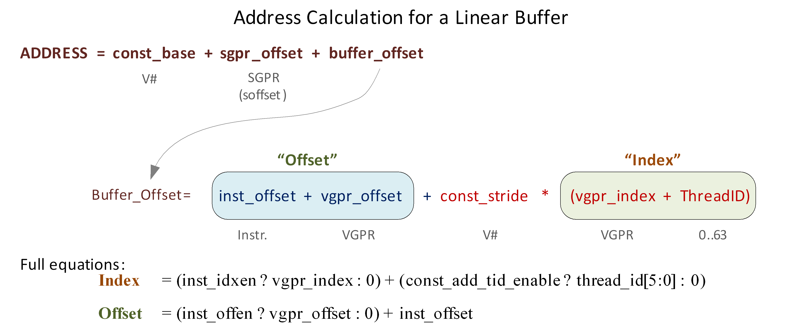

   Address Calculation for a Linear Buffer

Range Checking
^^^^^^^^^^^^^^

Addresses can be checked to see if they are in or out of range. When an
address is out of range, reads will return zero, and writes and atomics
will be dropped. The address range check algorithm depends on the buffer
type.

Private (Scratch) Buffer
    | Used when: AddTID==1 && IdxEn==0
    | For this buffer, there is no range checking.

Raw Buffer
    | Used when: AddTID==0 && SWizzleEn==0 && IdxEn==0
    | Out of Range if: (InstOffset + (OffEN ? vgpr\_offset : 0)) >=
      NumRecords

Structured Buffer
    | Used when: AddTID==0 && Stride!=0 && IdxEn==1
    | Out of Range if: Index(vgpr) >= NumRecords

**Notes:**

1. Reads that go out-of-range return zero (except for components with
   V#.dst\_sel = SEL\_1 that return 1).

2. Writes that are out-of-range do not write anything.

3. Load/store-format-\* instruction and atomics are range-checked "all
   or nothing" - either entirely in or out.

4. Load/store-Dword-x{2,3,4} and range-check per component.

Swizzled Buffer Addressing
^^^^^^^^^^^^^^^^^^^^^^^^^^

Swizzled addressing rearranges the data in the buffer to help provide
improved cache locality for arrays of structures. Swizzled addressing
also requires Dword-aligned accesses. A single fetch instruction cannot
attempt to fetch a unit larger than const-element-size. The buffer’s
STRIDE must be a multiple of element\_size.

::

    Index = (inst_idxen ? vgpr_index : 0) +
            (const_add_tid_enable ? thread_id[5:0] : 0)

    Offset = (inst_offen ? vgpr_offset : 0) + inst_offset

    index_msb = index / const_index_stride
    index_lsb = index % const_index_stride
    offset_msb = offset / const_element_size
    offset_lsb = offset % const_element_size

    buffer_offset = (index_msb * const_stride + offset_msb *
                      const_element_size) * const_index_stride + index_lsb *
                      const_element_size + offset_lsb

    Final Address = const_base + sgpr_offset + buffer_offset

Remember that the "sgpr\_offset" is not a part of the "offset" term in
the above equations.

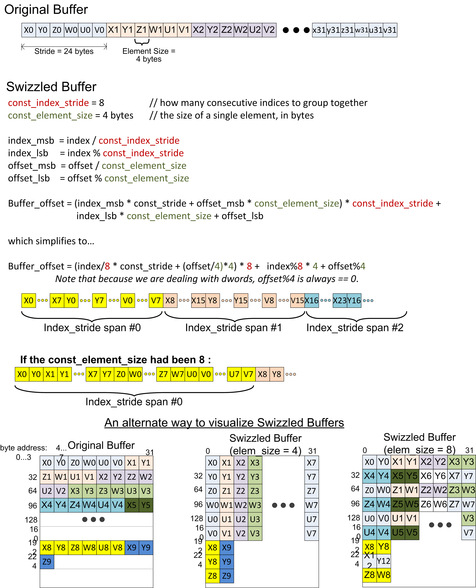

   Example of Buffer Swizzling

Proposed Use Cases for Swizzled Addressing
^^^^^^^^^^^^^^^^^^^^^^^^^^^^^^^^^^^^^^^^^^

Here are few proposed uses of swizzled addressing in common graphics
buffers.

+-------------+-------------+-------------+-------------+---------+---------+----------+
|             | DX11 Raw    | Dx11        | Dx11        | Scratch | Ring /  | Const    |
|             | Uav OpenCL  | Structured  | Structured  |         | stream- | Buffer   |
|             | Buffer      | (literal    | (gpr        |         | out     |          |
|             | Object      | offset)     | offset)     |         |         |          |
+=============+=============+=============+=============+=========+=========+==========+
| inst\_vgpr\ | T           | F           | T           | T       | T       | T        |
| _offset\_en |             |             |             |         |         |          |
+-------------+-------------+-------------+-------------+---------+---------+----------+
| inst\_vgpr\ | F           | T           | T           | F       | F       | F        |
| _index\_en  |             |             |             |         |         |          |
+-------------+-------------+-------------+-------------+---------+---------+----------+
| const\_stri | na          | <api>       | <api>       | scratch | na      | na       |
| de          |             |             |             | Size    |         |          |
+-------------+-------------+-------------+-------------+---------+---------+----------+
| const\_add\ | F           | F           | F           | T       | T       | F        |
| _tid\_enabl |             |             |             |         |         |          |
| e           |             |             |             |         |         |          |
+-------------+-------------+-------------+-------------+---------+---------+----------+
| const\_buff | F           | T           | T           | T       | F       | F        |
| er\_swizzle |             |             |             |         |         |          |
+-------------+-------------+-------------+-------------+---------+---------+----------+
| const\_elem | na          | 4           | 4           | 4 or 16 | na      | 4        |
| \_size      |             |             |             |         |         |          |
+-------------+-------------+-------------+-------------+---------+---------+----------+
| const\_inde | na          | 16          | 16          | 64      |         |          |
| x\_stride   |             |             |             |         |         |          |
+-------------+-------------+-------------+-------------+---------+---------+----------+

Table: Swizzled Buffer Use Cases

16-bit Memory Operations
~~~~~~~~~~~~~~~~~~~~~~~~

The D16 buffer instructions allow a kernel to load or store just 16 bits
per work item between VGPRs and memory. There are two variants of these
instructions:

-  D16 loads data into or stores data from the lower 16 bits of a VGPR.

-  D16\_HI loads data into or stores data from the upper 16 bits of a
   VGPR.

For example, BUFFER\_LOAD\_UBYTE\_D16 reads a byte per work-item from
memory, converts it to a 16-bit integer, then loads it into the lower 16
bits of the data VGPR.

Alignment
~~~~~~~~~

For Dword or larger reads or writes, the two LSBs of the byte-address
are ignored, thus forcing Dword alignment.

Buffer Resource
~~~~~~~~~~~~~~~

The buffer resource describes the location of a buffer in memory and the
format of the data in the buffer. It is specified in four consecutive
SGPRs (four aligned SGPRs) and sent to the texture cache with each
buffer instruction.

The table below details the fields that make up the buffer resource
descriptor.

+----------+-------+-----------------+-----------------------------------------------------------------------------+
| Bits     | Size  | Name            | Description                                                                 |
+==========+=======+=================+=============================================================================+
| 47:0     | 48    | Base address    | Byte address.                                                               |
+----------+-------+-----------------+-----------------------------------------------------------------------------+
| 61:48    | 14    | Stride          | Bytes 0 to 16383                                                            |
+----------+-------+-----------------+-----------------------------------------------------------------------------+
| 62       | 1     | Cache swizzle   | Buffer access. Optionally, swizzle texture cache TC L1 cache banks.         |
+----------+-------+-----------------+-----------------------------------------------------------------------------+
| 63       | 1     | Swizzle enable  | Swizzle AOS according to stride,                                            |
|          |       |                 | index\_stride, and element\_size, else linear (stride \* index offset).     |
+----------+-------+-----------------+-----------------------------------------------------------------------------+
| 95:64    | 32    | Num\_records    | In units of stride or bytes.                                                |
+----------+-------+-----------------+-----------------------------------------------------------------------------+
| 98:96    | 3     | Dst\_sel\_x     | | Destination channel select:                                               |
|          |       |                 | | 0=0, 1=1, 4=R, 5=G, 6=B, 7=A                                              |
+----------+-------+-----------------+-----------------------------------------------------------------------------+
| 101:99   | 3     | Dst\_sel\_y     |                                                                             |
+----------+-------+-----------------+-----------------------------------------------------------------------------+
| 104:102  | 3     | Dst\_sel\_z     |                                                                             |
+----------+-------+-----------------+-----------------------------------------------------------------------------+
| 107:105  | 3     | Dst\_sel\_w     |                                                                             |
+----------+-------+-----------------+-----------------------------------------------------------------------------+
| 110:108  | 3     | Num format      | Numeric data type (float, int, .... ). See instruction encoding for values. |
+----------+-------+-----------------+-----------------------------------------------------------------------------+
| 114:111  | 4     | Data format     | Number of fields and size of each field.                                    |
|          |       |                 | See instruction encoding for values.                                        |
|          |       |                 | For MUBUF instructions with ADD\_TID\_EN = 1                                |
|          |       |                 | This field holds Stride [17:14].                                            |
+----------+-------+-----------------+-----------------------------------------------------------------------------+
| 115      | 1     | User VM  Enable | Resource is mapped via tiled pool / heap.                                   |
+----------+-------+-----------------+-----------------------------------------------------------------------------+
| 116      | 1     | User VM mode    | Unmapped behavior: 0: null (return 0/drop,write);                           |
|          |       |                 | 1:invalid (results in error)                                                |
+----------+-------+-----------------+-----------------------------------------------------------------------------+
| 118:117  | 2     | Index stride    | 8, 16, 32, or 64. Used for swizzled buffer addressing.                      |
+----------+-------+-----------------+-----------------------------------------------------------------------------+
| 119      | 1     | Add tid enable  | Add thread ID to the index for to calculate the address.                    |
+----------+-------+-----------------+-----------------------------------------------------------------------------+
| 122:120  | 3     | RSVD            | Reserved. Must be set to zero.                                              |
+----------+-------+-----------------+-----------------------------------------------------------------------------+
| 123      | 1     | NV              | Nonvolatile (0=volatile)                                                    |
+----------+-------+-----------------+-----------------------------------------------------------------------------+
| 125:124  | 2     | RSVD            | Reserved. Must be set to zero.                                              |
+----------+-------+-----------------+-----------------------------------------------------------------------------+
| 127:126  | 2     | Type            | Value 0 for buffer. Overlaps upper two bits of                              |
|          |       |                 | fourbit TYPE field in 128bit T# resource.                                   |
+----------+-------+-----------------+-----------------------------------------------------------------------------+

**Table: Buffer Resource Descriptor**

A resource set to all zeros acts as an unbound texture or buffer (return
0,0,0,0).

Memory Buffer Load to LDS
~~~~~~~~~~~~~~~~~~~~~~~~~

The MUBUF instruction format allows reading data from a memory buffer
directly into LDS without passing through VGPRs. This is supported for
the following subset of MUBUF instructions.

-  BUFFER\_LOAD\_{ubyte, sbyte, ushort, sshort, dword, format\_x}.

-  It is illegal to set the instruction’s TFE bit for loads to LDS.

.. raw:: html

   

| LDS\_offset = 16-bit unsigned byte offset from M0[15:0].
| Mem\_offset = 32-bit unsigned byte offset from an SGPR (the SOFFSET
  SGPR).
| idx\_vgpr = index value from a VGPR (located at VADDR). (Zero if
  idxen=0.)
| off\_vgpr = offset value from a VGPR (located at VADDR or VADDR+1).
  (Zero if offen=0.)

.. raw:: html

   

The figure below shows the components of the LDS and memory address
calculation:

|fig 8 5|

TIDinWave is only added if the resource (T#) has the ADD\_TID\_ENABLE
field set to 1, whereas LDS always adds it. The MEM\_ADDR M# is in the
VDATA field; it specifies M0.

Clamping Rules
^^^^^^^^^^^^^^

Memory address clamping follows the same rules as any other buffer
fetch. LDS address clamping: the return data must not be written outside
the LDS space allocated to this wave.

-  Set the active-mask to limit buffer reads to those threads that
   return data to a legal LDS location.

-  The LDSbase (alloc) is in units of 32 Dwords, as is LDSsize.

-  M0[15:0] is in bytes.

GLC Bit Explained
~~~~~~~~~~~~~~~~~

The GLC bit means different things for loads, stores, and atomic ops.

**GLC Meaning for Loads**

-  For GLC==0

   -  The load can read data from the GPU L1.

   -  Typically, all loads (except load-acquire) use GLC==0.

-  For GLC==1

   -  The load intentionally misses the GPU L1 and reads from L2. If
      there was a line in the GPU L1 that matched, it is invalidated; L2
      is reread.

   -  NOTE: L2 is not re-read for every work-item in the same wave-front
      for a single load instruction. For example: b=uav[N+tid] // assume
      this is a byte read w/ glc==1 and N is aligned to 64B In the above
      op, the first Tid of the wavefront brings in the line from L2 or
      beyond, and all 63 of the other Tids read from same 64 B cache
      line in the L1.

**GLC Meaning for Stores**

-  For GLC==0 This causes a write-combine across work-items of the
   wavefront store op; dirtied lines are written to the L2
   automatically.

   -  If the store operation dirtied all bytes of the 64 B line, it is
      left clean and valid in the L1; subsequent accesses to the cache
      are allowed to hit on this cache line.

   -  Else do not leave write-combined lines in L1.

-  For GLC==1 Same as GLC==0, except the write-combined lines are not
   left in the line, even if all bytes are dirtied.

**Atomics**

-  For GLC == 0 No return data (this is "write-only" atomic op).

-  For GLC == 1 Returns previous value in memory (before the atomic
   operation).

Vector Memory (VM) Image Instructions
-------------------------------------

Vector Memory (VM) operations transfer data between the VGPRs and memory
through the texture cache (TC). Vector means the transfer of one or more
pieces of data uniquely for every work-item in the wavefront. This is in
contrast to scalar memory reads, which transfer only one value that is
shared by all work-items in the wavefront.

Examples of image objects are texture maps and typed surfaces.

Image objects are accessed using from one to four dimensional addresses;
they are composed of homogeneous data of one to four elements. These
image objects are read from, or written to, using IMAGE\_\* or
SAMPLE\_\* instructions, all of which use the MIMG instruction format.
IMAGE\_LOAD instructions read an element from the image buffer directly
into VGPRS, and SAMPLE instructions use sampler constants (S#) and apply
filtering to the data after it is read. IMAGE\_ATOMIC instructions
combine data from VGPRs with data already in memory, and optionally
return the value that was in memory before the operation.

All VM operations use an image resource constant (T#) that is a 256-bit
value in SGPRs. This constant is sent to the texture cache when the
instruction is executed. This constant defines the address, data format,
and characteristics of the surface in memory. Some image instructions
also use a sampler constant that is a 128-bit constant in SGPRs.
Typically, these constants are fetched from memory using scalar memory
reads prior to executing VM instructions, but these constants can also
be generated within the shader.

Texture fetch instructions have a data mask (DMASK) field. DMASK
specifies how many data components it receives. If DMASK is less than
the number of components in the texture, the texture unit only sends
DMASK components, starting with R, then G, B, and A. if DMASK specifies
more than the texture format specifies, the shader receives zero for the
missing components.

Image Instructions
~~~~~~~~~~~~~~~~~~

This section describes the image instruction set, and the microcode
fields available to those instructions.

+--------------------------------------+--------------------------------------+
| MIMG                                 | Description                          |
+======================================+======================================+
| SAMPLE\_\*                           | Read and filter data from a image    |
|                                      | object.                              |
+--------------------------------------+--------------------------------------+
| IMAGE\_LOAD\_<op>                    | Read data from an image object using |
|                                      | one of the following: image\_load,   |
|                                      | image\_load\_mip, image\_load\_{pck, |
|                                      | pck\_sgn, mip\_pck, mip\_pck\_sgn}.  |
+--------------------------------------+--------------------------------------+
| | IMAGE\_STORE                       | Store data to an image object. Store |
| | IMAGE\_STORE\_MIP                  | data to a specific mipmap level.     |
+--------------------------------------+--------------------------------------+
| IMAGE\_ATOMIC\_<op>                  | Image atomic operation, which is one |
|                                      | of the following: swap, cmpswap,     |
|                                      | add, sub, rsub, {u,s}{min,max}, and, |
|                                      | or, xor, inc, dec, fcmpswap, fmin,   |
|                                      | fmax.                                |
+--------------------------------------+--------------------------------------+

Table: Image Instructions

+-------------------------+-------------------------+--------------------------+
| Field                   | Bit Size                | Description              |
+=========================+=========================+==========================+
| OP                      | 7                       | Opcode.                  |
+-------------------------+-------------------------+--------------------------+
| VADDR                   | 8                       | Address of VGPR to       |
|                         |                         | supply first component   |
|                         |                         | of address.              |
+-------------------------+-------------------------+--------------------------+
| VDATA                   | 8                       | Address of VGPR to       |
|                         |                         | supply first component   |
|                         |                         | of write data or receive |
|                         |                         | first component of       |
|                         |                         | read-data.               |
+-------------------------+-------------------------+--------------------------+
| SSAMP                   | 5                       | SGPR to supply S#        |
|                         |                         | (sampler constant) in    |
|                         |                         | four consecutive SGPRs.  |
|                         |                         | Missing two LSBs of      |
|                         |                         | SGPR-address since must  |
|                         |                         | be aligned to a multiple |
|                         |                         | of four SGPRs.           |
+-------------------------+-------------------------+--------------------------+
| SRSRC                   | 5                       | SGPR to supply T#        |
|                         |                         | (resource constant) in   |
|                         |                         | four or eight            |
|                         |                         | consecutive SGPRs.       |
|                         |                         | Missing two LSBs of      |
|                         |                         | SGPR-address since must  |
|                         |                         | be aligned to a multiple |
|                         |                         | of four SGPRs.           |
+-------------------------+-------------------------+--------------------------+
| UNRM                    | 1                       | Force address to be      |
|                         |                         | un-normalized regardless |
|                         |                         | of T#. Must be set to 1  |
|                         |                         | for image stores and     |
|                         |                         | atomics.                 |
+-------------------------+-------------------------+--------------------------+
| DA                      | 1                       | | Shader declared an     |
|                         |                         |   array resource to be   |
|                         |                         |   used with this fetch.  |
|                         |                         | | When 1, the shader     |
|                         |                         |   provides an            |
|                         |                         |   array-index with the   |
|                         |                         |   instruction.           |
|                         |                         | | When 0, no array index |
|                         |                         |   is provided.           |
+-------------------------+-------------------------+--------------------------+
| DMASK                   | 4                       | | Data VGPR enable mask: |
|                         |                         |   one to four            |
|                         |                         |   consecutive VGPRs.     |
|                         |                         |   Reads: defines which   |
|                         |                         |   components are         |
|                         |                         |   returned.              |
|                         |                         | | 0 = red, 1 = green, 2  |
|                         |                         |   = blue, 3 = alpha      |
|                         |                         | | Writes: defines which  |
|                         |                         |   components are written |
|                         |                         |   with data from VGPRs   |
|                         |                         |   (missing components    |
|                         |                         |   get 0). Enabled        |
|                         |                         |   components come from   |
|                         |                         |   consecutive VGPRs.     |
|                         |                         | | For example:           |
|                         |                         |   DMASK=1001: Red is in  |
|                         |                         |   VGPRn and alpha in     |
|                         |                         |   VGPRn+1. For D16       |
|                         |                         |   writes, DMASK is used  |
|                         |                         |   only as a word count:  |
|                         |                         |   each bit represents 16 |
|                         |                         |   bits of data to be     |
|                         |                         |   written, starting at   |
|                         |                         |   the LSBs of VADDR, the |
|                         |                         |   MSBs, VADDR+1, etc.    |
|                         |                         |   Bit position is        |
|                         |                         |   ignored.               |
+-------------------------+-------------------------+--------------------------+
| GLC                     | 1                       | | Globally Coherent.     |
|                         |                         |   Controls how reads and |
|                         |                         |   writes are handled by  |
|                         |                         |   the L1 texture cache.  |
|                         |                         | | **READ:**              |
|                         |                         | | GLC = 0 Reads can hit  |
|                         |                         |   on the L1 and persist  |
|                         |                         |   across waves.          |
|                         |                         | | GLC = 1 Reads always   |
|                         |                         |   miss the L1 and force  |
|                         |                         |   fetch to L2. No L1     |
|                         |                         |   persistence across     |
|                         |                         |   waves.                 |
|                         |                         | | **WRITE:**             |
|                         |                         | | GLC = 0 Writes miss    |
|                         |                         |   the L1, write through  |
|                         |                         |   to L2, and persist in  |
|                         |                         |   L1 across wavefronts.  |
|                         |                         | | GLC = 1 Writes miss    |
|                         |                         |   the L1, write through  |
|                         |                         |   to L2. No persistence  |
|                         |                         |   across wavefronts.     |
|                         |                         | | **ATOMIC:**            |
|                         |                         | | GLC = 0 Previous data  |
|                         |                         |   value is not returned. |
|                         |                         |   No L1 persistence      |
|                         |                         |   across wavefronts.     |
|                         |                         | | GLC = 1 Previous data  |
|                         |                         |   value is returned. No  |
|                         |                         |   L1 persistence across  |
|                         |                         |   wavefronts.            |
+-------------------------+-------------------------+--------------------------+
| SLC                     | 1                       | System Level Coherent.   |
|                         |                         | When set, accesses are   |
|                         |                         | forced to miss in level  |
|                         |                         | 2 texture cache and are  |
|                         |                         | coherent with system     |
|                         |                         | memory.                  |
+-------------------------+-------------------------+--------------------------+
| TFE                     | 1                       | Texel Fail Enable for    |
|                         |                         | PRT (partially resident  |
|                         |                         | textures). When set, a   |
|                         |                         | fetch can return a NACK, |
|                         |                         | which causes a VGPR      |
|                         |                         | write into DST+1 (first  |
|                         |                         | GPR after all fetch-dest |
|                         |                         | GPRs).                   |
+-------------------------+-------------------------+--------------------------+
| LWE                     | 1                       | Force data to be         |
|                         |                         | un-normalized,           |
|                         |                         | regardless of T#.        |
+-------------------------+-------------------------+--------------------------+
| A16                     | 1                       | | Address components are |
|                         |                         |   16-bits (instead of    |
|                         |                         |   the usual 32 bits).    |
|                         |                         |   When set, all address  |
|                         |                         |   components are 16 bits |
|                         |                         |   (packed into two per   |
|                         |                         |   Dword), except:        |
|                         |                         | | Texel offsets (three   |
|                         |                         |   6-bit uint packed into |
|                         |                         |   one Dword).            |
|                         |                         | | PCF reference (for \_C |
|                         |                         |   instructions).         |
|                         |                         | | Address components are |
|                         |                         |   16-bit uint for image  |
|                         |                         |   ops without sampler;   |
|                         |                         |   16-bit float with      |
|                         |                         |   sampler.               |
+-------------------------+-------------------------+--------------------------+
| D16                     | 1                       | | VGPR-Data-16bit. On    |
|                         |                         |   loads, convert data in |
|                         |                         |   memory to 16-bit       |
|                         |                         |   format before storing  |
|                         |                         |   it in VGPRs. For       |
|                         |                         |   stores, convert 16-bit |
|                         |                         |   data in VGPRs to 32    |
|                         |                         |   bits before going to   |
|                         |                         |   memory. Whether the    |
|                         |                         |   data is treated as     |
|                         |                         |   float or int is        |
|                         |                         |   decided by NFMT.       |
|                         |                         |   Allowed only with      |
|                         |                         |   these opcodes:         |
|                         |                         | | IMAGE\_SAMPLE\*        |
|                         |                         | | IMAGE\_GATHER4\*, but  |
|                         |                         |   not GATHER4H\_PCK      |
|                         |                         | | IMAGE\_LOAD            |
|                         |                         | | IMAGE\_LOAD\_MIP       |
|                         |                         | | IMAGE\_STORE           |
|                         |                         | | IMAGE\_STORE\_MIP      |
+-------------------------+-------------------------+--------------------------+

Table: Instruction Fields

Image Opcodes with No Sampler
-----------------------------

For image opcodes with no sampler, all VGPR address values are taken as
uint. For cubemaps, face\_id = slice \* 6 + face.

The table below shows the contents of address VGPRs for the various
image opcodes.

+--------------------+--------+-------------+-----------+-----------+-----------+-----------+
| Image Opcode       | Acnt   | dim         | VGPRn     | VGPRn+1   | VGPRn+2   | VGPRn+3   |
| (Resource w/o      |        |             |           |           |           |           |
| Sampler)           |        |             |           |           |           |           |
+====================+========+=============+===========+===========+===========+===========+
| get\_resinfo       | 0      | Any         | mipid     |           |           |           |
+--------------------+--------+-------------+-----------+-----------+-----------+-----------+
| load / store /     | 0      | 1D          | x         |           |           |           |
| atomics            |        |             |           |           |           |           |
+--------------------+--------+-------------+-----------+-----------+-----------+-----------+
| 1                  | 1D     | x           | slice     |           |           |           |
|                    | Array  |             |           |           |           |           |
+--------------------+--------+-------------+-----------+-----------+-----------+-----------+
| 1                  | 2D     | x           | y         |           |           |           | 
+--------------------+--------+-------------+-----------+-----------+-----------+-----------+
| 2                  | 2D     | x           | y         | fragid    |           |           |
|                    | MSAA   |             |           |           |           |           |
+--------------------+--------+-------------+-----------+-----------+-----------+-----------+
| 2                  | 2D     | x           | y         | slice     |           |           | 
|                    | Array  |             |           |           |           |           | 
+--------------------+--------+-------------+-----------+-----------+-----------+-----------+
| 3                  | 2D     | x           | y         | slice     | fragid    |           |
|                    | Array  |             |           |           |           |           |
|                    | MSAA   |             |           |           |           |           | 
+--------------------+--------+-------------+-----------+-----------+-----------+-----------+
| 2                  | 3D     | x           | y         | z         |           |           | 
+--------------------+--------+-------------+-----------+-----------+-----------+-----------+
| 2                  | Cube   | x           | y         | face\_id  |           |           |
+--------------------+--------+-------------+-----------+-----------+-----------+-----------+
| load\_mip /        | 1      | 1D          | x         | mipid     |           |           |
| store\_mip         |        |             |           |           |           |           |
+--------------------+--------+-------------+-----------+-----------+-----------+-----------+
| 2                  | 1D     | x           | slice     | mipid     |           |           |
|                    | Array  |             |           |           |           |           |
+--------------------+--------+-------------+-----------+-----------+-----------+-----------+
| 2                  | 2D     | x           | y         | mipid     |           |           |
+--------------------+--------+-------------+-----------+-----------+-----------+-----------+
| 3                  | 2D     | x           | y         | slice     | mipid     |           | 
|                    | Array  |             |           |           |           |           |
+--------------------+--------+-------------+-----------+-----------+-----------+-----------+
| 3                  | 3D     | x           | y         | z         | mipid     |           |
+--------------------+--------+-------------+-----------+-----------+-----------+-----------+
| 3                  | Cube   | x           | y         | face\_id  | mipid     |           |
+--------------------+--------+-------------+-----------+-----------+-----------+-----------+

Table: Image Opcodes with No Sampler

Image Opcodes with a Sampler
----------------------------

For image opcodes with a sampler, all VGPR address values are taken as
float. For cubemaps, face\_id = slice \* 8 + face.

Certain sample and gather opcodes require additional values from VGPRs
beyond what is shown. These values are: offset, bias, z-compare, and
gradients.

+--------------------+--------+-------------+-----------+-----------+-----------+-----------+
| Image Opcode       | Acnt   | dim         | VGPRn     | VGPRn+1   | VGPRn+2   | VGPRn+3   |
| (w/ Sampler)       |        |             |           |           |           |           |
+====================+========+=============+===========+===========+===========+===========+
| sample             | 0      | 1D          | x         |           |           |           |
+--------------------+--------+-------------+-----------+-----------+-----------+-----------+
| 1                  | 1D     | x           | slice     |           |           |           |
|                    | Array  |             |           |           |           |           |
+--------------------+--------+-------------+-----------+-----------+-----------+-----------+
| 1                  | 2D     | x           | y         |           |           |           |
+--------------------+--------+-------------+-----------+-----------+-----------+-----------+
| 2                  | 2D     | x           | y         | field     |           |           |
|                    | interl |             |           |           |           |           |
|                    | aced   |             |           |           |           |           |
+--------------------+--------+-------------+-----------+-----------+-----------+-----------+
| 2                  | 2D     | x           | y         | slice     |           |           |
|                    | Array  |             |           |           |           |           |
+--------------------+--------+-------------+-----------+-----------+-----------+-----------+
| 2                  | 3D     | x           | y         | z         |           |           |
+--------------------+--------+-------------+-----------+-----------+-----------+-----------+
| 2                  | Cube   | x           | y         | face\_id  |           |           | 
+--------------------+--------+-------------+-----------+-----------+-----------+-----------+
| sample\_l          | 1      | 1D          | x         | lod       |           |           |
+--------------------+--------+-------------+-----------+-----------+-----------+-----------+
| 2                  | 1D     | x           | slice     | lod       |           |           | 
|                    | Array  |             |           |           |           |           |
+--------------------+--------+-------------+-----------+-----------+-----------+-----------+
| 2                  | 2D     | x           | y         | lod       |           |           |
+--------------------+--------+-------------+-----------+-----------+-----------+-----------+
| 3                  | 2D     | x           | y         | field     | lod       |           |
|                    | interl |             |           |           |           |           |
|                    | aced   |             |           |           |           |           |
+--------------------+--------+-------------+-----------+-----------+-----------+-----------+
| 3                  | 2D     | x           | y         | slice     | lod       |           | 
|                    | Array  |             |           |           |           |           |
+--------------------+--------+-------------+-----------+-----------+-----------+-----------+
| 3                  | 3D     | x           | y         | z         | lod       |           | 
+--------------------+--------+-------------+-----------+-----------+-----------+-----------+
| 3                  | Cube   | x           | y         | face\_id  | lod       |           |
+--------------------+--------+-------------+-----------+-----------+-----------+-----------+
| sample\_cl         | 1      | 1D          | x         | clamp     |           |           |
+--------------------+--------+-------------+-----------+-----------+-----------+-----------+
| 2                  | 1D     | x           | slice     | clamp     |           |           |
|                    | Array  |             |           |           |           |           | 
| 2                  | 2D     | x           | y         | clamp     |           |           |
+--------------------+--------+-------------+-----------+-----------+-----------+-----------+
| 3                  | 2D     | x           | y         | field     | clamp     |           |   
|                    | interl |             |           |           |           |           |
|                    | aced   |             |           |           |           |           |
+--------------------+--------+-------------+-----------+-----------+-----------+-----------+
| 3                  | 2D     | x           | y         | slice     | clamp     |           |
|                    | Array  |             |           |           |           |           |
+--------------------+--------+-------------+-----------+-----------+-----------+-----------+
| 3                  | 3D     | x           | y         | z         | clamp     |           |
+--------------------+--------+-------------+-----------+-----------+-----------+-----------+
| 3                  | Cube   | x           | y         | face\_id  | clamp     |           | 
+--------------------+--------+-------------+-----------+-----------+-----------+-----------+
| gather4            | 1      | 2D          | x         | y         |           |           |
+--------------------+--------+-------------+-----------+-----------+-----------+-----------+
| 2                  | 2D     | x           | y         | field     |           |           |
|                    | interl |             |           |           |           |           |
|                    | aced   |             |           |           |           |           |
+--------------------+--------+-------------+-----------+-----------+-----------+-----------+
| 2                  | 2D     | x           | y         | slice     |           |           |
|                    | Array  |             |           |           |           |           |
+--------------------+--------+-------------+-----------+-----------+-----------+-----------+
| 2                  | Cube   | x           | y         | face\_id  |           |           | 
+--------------------+--------+-------------+-----------+-----------+-----------+-----------+
| gather4\_l         | 2      | 2D          | x         | y         | lod       |           |
+--------------------+--------+-------------+-----------+-----------+-----------+-----------+
| 3                  | 2D     | x           | y         | field     | lod       |           |     
|                    | interl |             |           |           |           |           |
|                    | aced   |             |           |           |           |           |
+--------------------+--------+-------------+-----------+-----------+-----------+-----------+
| 3                  | 2D     | x           | y         | slice     | lod       |           |
|                    | Array  |             |           |           |           |           |
+--------------------+--------+-------------+-----------+-----------+-----------+-----------+
| 3                  | Cube   | x           | y         | face\_id  | lod       |           | 
+--------------------+--------+-------------+-----------+-----------+-----------+-----------+
| gather4\_cl        | 2      | 2D          | x         | y         | clamp     |           |
+--------------------+--------+-------------+-----------+-----------+-----------+-----------+
| 3                  | 2D     | x           | y         | field     | clamp     |           |
|                    | interl |             |           |           |           |           | 
|                    | aced   |             |           |           |           |           |
+--------------------+--------+-------------+-----------+-----------+-----------+-----------+
| 3                  | 2D     | x           | y         | slice     | clamp     |           |
|                    | Array  |             |           |           |           |           | 
+--------------------+--------+-------------+-----------+-----------+-----------+-----------+
| 3                  | Cube   | x           | y         | face\_id  | clamp     |           | 
+--------------------+--------+-------------+-----------+-----------+-----------+-----------+

Table: Image Opcodes with Sampler

1. Sample includes sample, sample\_d, sample\_b, sample\_lz, sample\_c,
   sample\_c\_d, sample\_c\_b, sample\_c\_lz, and getlod.

2. Sample\_l includes sample\_l and sample\_c\_l.

3. Sample\_cl includes sample\_cl, sample\_d\_cl, sample\_b\_cl,
   sample\_c\_cl, sample\_c\_d\_cl, and sample\_c\_b\_cl.

4. Gather4 includes gather4, gather4\_lz, gather4\_c, and
   gather4\_c\_lz.

The table below lists and briefly describes the legal suffixes for image
instructions:

+--------------------+--------------------+--------------------+--------------------+
| Suffix             | Meaning            | Extra Addresses    | Description        |
+====================+====================+====================+====================+
| \_L                | LOD                | -                  | LOD is used        |
|                    |                    |                    | instead of TA      |
|                    |                    |                    | computed LOD.      |
+--------------------+--------------------+--------------------+--------------------+
| \_B                | LOD BIAS           | 1: lod bias        | Add this BIAS to   |
|                    |                    |                    | the LOD TA         |
|                    |                    |                    | computes.          |
+--------------------+--------------------+--------------------+--------------------+
| \_CL               | LOD CLAMP          | -                  | Clamp the LOD to   |
|                    |                    |                    | be no larger than  |
|                    |                    |                    | this value.        |
+--------------------+--------------------+--------------------+--------------------+
| \_D                | Derivative         | 2,4 or 6: slopes   | Send dx/dv, dx/dy, |
|                    |                    |                    | etc. slopes to TA  |
|                    |                    |                    | for it to used in  |
|                    |                    |                    | LOD computation.   |
+--------------------+--------------------+--------------------+--------------------+
| \_CD               | Coarse Derivative  | Send dx/dv, dx/dy, |                    | 
|                    |                    | etc. slopes to TA  |                    |
|                    |                    | for it to used in  |                    |
|                    |                    | LOD computation.   |                    |
+--------------------+--------------------+--------------------+--------------------+
| \_LZ               | Level 0            | -                  | Force use of MIP   |
|                    |                    |                    | level 0.           |
+--------------------+--------------------+--------------------+--------------------+
| \_C                | PCF                | 1: z-comp          | Percentage closer  |
|                    |                    |                    | filtering.         |
+--------------------+--------------------+--------------------+--------------------+
| \_O                | Offset             | 1: offsets         | Send X, Y, Z       |
|                    |                    |                    | integer offsets    |
|                    |                    |                    | (packed into 1     |
|                    |                    |                    | Dword) to offset   |
|                    |                    |                    | XYZ address.       |
+--------------------+--------------------+--------------------+--------------------+

Table: Sample Instruction Suffix Key

VGPR Usage
~~~~~~~~~~

Address: The address consists of up to four parts:

.. raw:: html

   

{ offset } { bias } { z-compare } { derivative } { body }

.. raw:: html

   

These are all packed into consecutive VGPRs.

-  | Offset: SAMPLE\*\ *O*\ \*, GATHER\*\ *O*\ \*
   | One Dword of offset\_xyz. The offsets are six-bit signed integers:
     X=[5:0], Y=[13:8], and Z=[21:16].

-  Bias: SAMPLE\*\ *B*\ \*, GATHER\*\ *B*\ \*. One Dword float.

-  Z-compare: SAMPLE\*\ *C*\ \*, GATHER\*\ *C*\ \*. One Dword.

-  Derivatives (sample\_d, sample\_cd): 2, 4, or 6 Dwords, packed one
   Dword per derivative as:

+------------+------------+------------+------------+------------+------------+------------+
| Image Dim  | Vgpr N     | N+1        | N+2        | N+3        | N+4        | N+5        |
+============+============+============+============+============+============+============+
| 1D         | DX/DH      | DX/DV      | -          | -          | -          | -          |
+------------+------------+------------+------------+------------+------------+------------+
| 2D         | DX/DH      | DY/DH      | DX/DV      | DY/DV      | -          | -          |
+------------+------------+------------+------------+------------+------------+------------+
| 3D         | DX/DH      | DY/DH      | DZ/DH      | DX/DV      | DY/DV      | DZ/DV      |
+------------+------------+------------+------------+------------+------------+------------+

-  Body: One to four Dwords, as defined by the table:
   Address components are X,Y,Z,W
   with X in VGPR\_M, Y in VGPR\_M+1, etc. The number of components in
   "body" is the value of the ACNT field in the table, plus one.

-  Data: Written from, or returned to, one to four consecutive VGPRs.
   The amount of data read or written is determined by the DMASK field
   of the instruction.

-  Reads: DMASK specifies which elements of the resource are returned to
   consecutive VGPRs. The texture system reads data from memory and
   based on the data format expands it to a canonical RGBA form, filling
   in zero or one for missing components. Then, DMASK is applied, and
   only those components selected are returned to the shader.

-  Writes: When writing an image object, it is only possible to write an
   entire element (all components), not just individual components. The
   components come from consecutive VGPRs, and the texture system fills
   in the value zero for any missing components of the image’s data
   format; it ignores any values that are not part of the stored data
   format. For example, if the DMASK=1001, the shader sends Red from
   VGPR\_N, and Alpha from VGPR\_N+1, to the texture unit. If the image
   object is RGB, the texel is overwritten with Red from the VGPR\_N,
   Green and Blue set to zero, and Alpha from the shader ignored.

-  | Atomics: Image atomic operations are supported only on 32- and
     64-bit-per pixel surfaces. The surface data format is specified in
     the resource constant. Atomic operations treat the element as a
     single component of 32- or 64-bits. For atomic operations, DMASK is
     set to the number of VGPRs (Dwords) to send to the texture unit.
     DMASK legal values for atomic image operations: no other values of
     DMASK are legal.
   | 0x1 = 32-bit atomics except cmpswap.
   | 0x3 = 32-bit atomic cmpswap.
   | 0x3 = 64-bit atomics except cmpswap.
   | 0xf = 64-bit atomic cmpswap.

-  Atomics with Return: Data is read out of the VGPR(s), starting at
   VDATA, to supply to the atomic operation. If the atomic returns a
   value to VGPRs, that data is returned to those same VGPRs starting at
   VDATA.

-  D16 Instructions: Load-format and store-format instructions also come
   in a "d16" variant. For stores, each 32-bit VGPR holds two 16-bit
   data elements that are passed to the texture unit. The texture unit
   converts them to the texture format before writing to memory. For
   loads, data returned from the texture unit is converted to 16 bits,
   and a pair of data are stored in each 32- bit VGPR (LSBs first, then
   MSBs). The DMASK bit represents individual 16- bit elements; so, when
   DMASK=0011 for an image-load, two 16-bit components are loaded into a
   single 32-bit VGPR.

Image Resource
~~~~~~~~~~~~~~

The image resource (also referred to as T#) defines the location of the
image buffer in memory, its dimensions, tiling, and data format. These
resources are stored in four or eight consecutive SGPRs and are read by
MIMG instructions.

+----------+--------+---------------+---------------------------------------------+
| Bits     | Size   | Name          | Comments                                    |
+==========+========+===============+=============================================+
| **128-bi |        |               |                                             |  
| t        |        |               |                                             |
| Resource |        |               |                                             |
| :        |        |               |                                             |
| 1D-tex,  |        |               |                                             |
| 2d-tex,  |        |               |                                             |
| 2d-msaa  |        |               |                                             |
| (multi-s |        |               |                                             |
| ample    |        |               |                                             |
| auto-ali |        |               |                                             |
| asing)** |        |               |                                             |
+----------+--------+---------------+---------------------------------------------+
| 39:0     | 40     | base address  | 256-byte aligned. Also used for fmask-ptr.  |
+----------+--------+---------------+---------------------------------------------+
| 51:40    | 12     | min lod       | 4.8 (four uint bits, eight fraction bits)   |
|          |        |               | format.                                     |
+----------+--------+---------------+---------------------------------------------+
| 57:52    | 6      | data format   | Number of comps, number of bits/comp.       |
+----------+--------+---------------+---------------------------------------------+
| 61:58    | 4      | num format    | Numeric format.                             |
+----------+--------+---------------+---------------------------------------------+
| 62       | 1      | NV            | Non-volatile (0=volatile)                   |
+----------+--------+---------------+---------------------------------------------+
| 77:64    | 14     | width         | width-1 of mip0 in texels                   |
+----------+--------+---------------+---------------------------------------------+
| 91:78    | 14     | height        | height-1 of mip0 in texels                  |
+----------+--------+---------------+---------------------------------------------+
| 94:92    | 3      | perf          | Scales sampler’s perf\_z, perf\_mip,        |
|          |        | modulation    | aniso\_bias, lod\_bias\_sec.                |
+----------+--------+---------------+---------------------------------------------+
| 98:96    | 3      | dst\_sel\_x   | 0 = 0, 1 = 1, 4 = R, 5 = G, 6 = B, 7 = A.   |
+----------+--------+---------------+---------------------------------------------+
| 101:99   | 3      | dst\_sel\_y   |                                             | 
+----------+--------+---------------+---------------------------------------------+
| 104:102  | 3      | dst\_sel\_z   |                                             |
+----------+--------+---------------+---------------------------------------------+ 
| 107:105  | 3      | dst\_sel\_w   |                                             | 
+----------+--------+---------------+---------------------------------------------+
| 111:108  | 4      | base level    | largest mip level in the resource view. For |
|          |        |               | msaa, set to zero.                          |
+----------+--------+---------------+---------------------------------------------+
| 115:112  | 4      | last level    | For msaa, holds number of samples           |
+----------+--------+---------------+---------------------------------------------+
| 120:116  | 5      | Tiling index  | | Lookuptable: 32 x 16                      |
|          |        |               | | bank\_width[2], bank\_height[2],          |
|          |        |               |   num\_banks[2], tile\_split[2],            |
|          |        |               |   macro\_tile\_aspect[2],                   |
|          |        |               |   micro\_tile\_mode[2], array\_mode[4].     |
+----------+--------+---------------+---------------------------------------------+
| 127:124  | 4      | type          | 0 = buf, 8 = 1d, 9 = 2d, 10 = 3d, 11 =      |
|          |        |               | cube, 12 = 1d-array, 13 = 2d-array, 14 =    |
|          |        |               | 2d-msaa, 15 = 2d-msaa-array. 1-7 are        |
|          |        |               | reserved.                                   |
+----------+--------+---------------+---------------------------------------------+
| **256-bi |        |               |                                             |        
| t        |        |               |                                             |
| Resource |        |               |                                             |
| :        |        |               |                                             |
| 1d-array |        |               |                                             |
| ,        |        |               |                                             |
| 2d-array |        |               |                                             |
| ,        |        |               |                                             |
| 3d,      |        |               |                                             |
| cubemap, |        |               |                                             |
| MSAA**   |        |               |                                             |
+----------+--------+---------------+---------------------------------------------+
| 140:128  | 13     | depth         | depth-1 of mip0 for 3d map                  |
+----------+--------+---------------+---------------------------------------------+
| 156:141  | 16     | pitch         | In texel units.                             |
+----------+--------+---------------+---------------------------------------------+
| 159:157  | 3      | border color  | Specifies the channel ordering for border   |
|          |        | swizzle       | color independent of the T# dst\_sel        |
|          |        |               | fields. 0=xyzw, 1=xwyz, 2=wqyx, 3=wxyz,     |
|          |        |               | 4=zyxw, 5=yxwz                              |
+----------+--------+---------------+---------------------------------------------+
| 176:173  | 4      | Array Pitch   | array pitch for quilts, encoded as:         |
|          |        |               | trunc(log2(array\_pitch))+1                 |
+----------+--------+---------------+---------------------------------------------+
| 184:177  | 8      | meta data     | bits[47:40]                                 |
|          |        | address       |                                             |
+----------+--------+---------------+---------------------------------------------+
| 185      | 1      | meta\_linear  | forces metadata surface to be linear        |
+----------+--------+---------------+---------------------------------------------+
| 186      | 1      | meta\_pipe\_a | maintain pipe alignment in metadata         |
|          |        | ligned        | addressing                                  |
+----------+--------+---------------+---------------------------------------------+
| 187      | 1      | meta\_rb\_ali | maintain RB alignment in metadata           |
|          |        | gned          | addressing                                  |
+----------+--------+---------------+---------------------------------------------+
| 191:188  | 4      | Max Mip       | Resource mipLevel-1. Describes the          |
|          |        |               | resource, as opposed to base\_level and     |
|          |        |               | last\_level, which describes the resouce    |
|          |        |               | view. For MSAA, holds log2(number of        |
|          |        |               | samples).                                   |
+----------+--------+---------------+---------------------------------------------+
| 203:192  | 12     | min LOD warn  | Feedback trigger for LOD, in U4.8 format.   |
+----------+--------+---------------+---------------------------------------------+
| 211:204  | 8      | counter bank  | PRT counter ID                              |
|          |        | ID            |                                             |
+----------+--------+---------------+---------------------------------------------+
| 212      | 1      | LOD hardware  | PRT hardware counter enable                 |
|          |        | count enable  |                                             |
+----------+--------+---------------+---------------------------------------------+
| 213      | 1      | Compression   | enable delta color compression              |
|          |        | Enable        |                                             |
+----------+--------+---------------+---------------------------------------------+
| 214      | 1      | Alpha is on   | Set to 1 if the surface’s component swap is |
|          |        | MSB           | not reversed (DCC)                          |
+----------+--------+---------------+---------------------------------------------+
| 215      | 1      | Color         | Auto=0, none=1 (DCC)                        |
|          |        | Transform     |                                             |
+----------+--------+---------------+---------------------------------------------+
| 255:216  | 40     | Meta Data     | Upper bits of meta-data address (DCC)       |
|          |        | Address       | [47:8]                                      |
+----------+--------+---------------+---------------------------------------------+

Table: Image Resource Definition

All image resource view descriptors (T#'s) are written by the driver as
256 bits.

The MIMG-format instructions have a DeclareArray (DA) bit that reflects
whether the shader was expecting an array-texture or simple texture to
be bound. When DA is zero, the hardware does not send an array index to
the texture cache. If the texture map was indexed, the hardware supplies
an index value of zero. Indices sent for non-indexed texture maps are
ignored.

Image Sampler
~~~~~~~~~~~~~

The sampler resource (also referred to as S#) defines what operations to
perform on texture map data read by **sample** instructions. These are
primarily address clamping and filter options. Sampler resources are
defined in four consecutive SGPRs and are supplied to the texture cache
with every sample instruction.

+--------------------+--------------------+--------------------+--------------------+
| Bits               | Size               | Name               | Description        |
+====================+====================+====================+====================+
| 2:0                | 3                  | clamp x            | Clamp/wrap mode.   |
+--------------------+--------------------+--------------------+--------------------+
| 5:3                | 3                  | clamp y            |                    |  
+--------------------+--------------------+--------------------+--------------------+
| 8:6                | 3                  | clamp z            |                    |
+--------------------+--------------------+--------------------+--------------------+
| 11:9               | 3                  | max aniso ratio    |                    |
+--------------------+--------------------+--------------------+--------------------+
| 14:12              | 3                  | depth compare func |                    |
+--------------------+--------------------+--------------------+--------------------+
| 15                 | 1                  | force unnormalized | Force address      |
|                    |                    |                    | cords to be unorm. |
+--------------------+--------------------+--------------------+--------------------+
| 18:16              | 3                  | aniso threshold    |                    |
+--------------------+--------------------+--------------------+--------------------+
| 19                 | 1                  | mc coord trunc     |                    |
+--------------------+--------------------+--------------------+--------------------+
| 20                 | 1                  | force degamma      |                    |
+--------------------+--------------------+--------------------+--------------------+
| 26:21              | 6                  | aniso bias         | u1.5.              |
+--------------------+--------------------+--------------------+--------------------+
| 27                 | 1                  | trunc coord        |                    |
+--------------------+--------------------+--------------------+--------------------+
| 28                 | 1                  | disable cube wrap  |                    |
+--------------------+--------------------+--------------------+--------------------+
| 30:29              | 2                  | filter\_mode       | Normal lerp, min,  |
|                    |                    |                    | or max filter.     |
+--------------------+--------------------+--------------------+--------------------+
| 31                 | 1                  | compat\_mode       | 1 = new mode; 0 =  |
|                    |                    |                    | legacy             |
+--------------------+--------------------+--------------------+--------------------+
| 43:32              | 12                 | min lod            | u4.8.              |
+--------------------+--------------------+--------------------+--------------------+
| 55:44              | 12                 | max lod            | u4.8.              |
+--------------------+--------------------+--------------------+--------------------+
| 59:56              | 4                  | perf\_mip          |                    |
+--------------------+--------------------+--------------------+--------------------+
| 63:60              | 4                  | perf z             |                    |
+--------------------+--------------------+--------------------+--------------------+
| 77:64              | 14                 | lod bias           | s5.8.              |
+--------------------+--------------------+--------------------+--------------------+
| 83:78              | 6                  | lod bias sec       | s1.4.              |
+--------------------+--------------------+--------------------+--------------------+
| 85:84              | 2                  | xy mag filter      | Magnification      |
|                    |                    |                    | filter.            |
+--------------------+--------------------+--------------------+--------------------+
| 87:86              | 2                  | xy min filter      | Minification       |
|                    |                    |                    | filter.            |
+--------------------+--------------------+--------------------+--------------------+
| 89:88              | 2                  | z filter           |                    |
+--------------------+--------------------+--------------------+--------------------+
| 91:90              | 2                  | mip filter         |                    |
+--------------------+--------------------+--------------------+--------------------+
| 92                 | 1                  | mip\_point\_precla | When mipfilter =   |
|                    |                    | mp                 | point, add 0.5     |
|                    |                    |                    | before clamping.   |
+--------------------+--------------------+--------------------+--------------------+
| 93                 | 1                  | disable\_lsb\_ceil | Disable ceiling    |
|                    |                    |                    | logic in filter    |
|                    |                    |                    | (rounds up).       |
+--------------------+--------------------+--------------------+--------------------+
| 94                 | 1                  | Filter\_Prec\_Fix  |                    |
+--------------------+--------------------+--------------------+--------------------+
| 95                 | 1                  | Aniso\_override    | Disable Aniso      |
|                    |                    |                    | filtering if       |
|                    |                    |                    | base\_level =      |
|                    |                    |                    | last\_level        |
+--------------------+--------------------+--------------------+--------------------+
| 107:96             | 12                 | border color ptr   |                    |
+--------------------+--------------------+--------------------+--------------------+
| 125:108            | 18                 | unused             |                    |
+--------------------+--------------------+--------------------+--------------------+
| 127:126            | 2                  | border color type  | Opaque-black,      |
|                    |                    |                    | transparent-black, |
|                    |                    |                    | white, use border  |
|                    |                    |                    | color ptr.         |
+--------------------+--------------------+--------------------+--------------------+

Table: Image Sampler Definition

Data Formats
~~~~~~~~~~~~

Data formats 0-15 are available to buffer resources, and all formats are
available to image formats. The table below details all the data formats
that can be used by image and buffer resources.

|gfx9 valid texture formats|

Vector Memory Instruction Data Dependencies
~~~~~~~~~~~~~~~~~~~~~~~~~~~~~~~~~~~~~~~~~~~

When a VM instruction is issued, the address is immediately read out of
VGPRs and sent to the texture cache. Any texture or buffer resources and
samplers are also sent immediately. However, write-data is not
immediately sent to the texture cache.

The shader developer’s responsibility to avoid data hazards associated
with VMEM instructions include waiting for VMEM read instruction
completion before reading data fetched from the TC (VMCNT).

This is explained in the section: 

:ref:`Vector Memory Operations`

Flat Memory Instructions
========================

Flat Memory instructions read, or write, one piece of data into, or out
of, VGPRs; they do this separately for each work-item in a wavefront.
Unlike buffer or image instructions, Flat instructions do not use a
resource constant to define the base address of a surface. Instead, Flat
instructions use a single flat address from the VGPR; this addresses
memory as a single flat memory space. This memory space includes video
memory, system memory, LDS memory, and scratch (private) memory. It does
not include GDS memory. Parts of the flat memory space may not map to
any real memory, and accessing these regions generates a
memory-violation error. The determination of the memory space to which
an address maps is controlled by a set of "memory aperture" base and
size registers.

Flat Memory Instruction
-----------------------

Flat memory instructions let the kernel read or write data in memory, or
perform atomic operations on data already in memory. These operations
occur through the texture L2 cache. The instruction declares which VGPR
holds the address (either 32- or 64-bit, depending on the memory
configuration), the VGPR which sends and the VGPR which receives data.
Flat instructions also use M0 as described in the table below:

+-------------------------+-------------------------+--------------------------+
| Field                   | Bit Size                | Description              |
+=========================+=========================+==========================+
| OP                      | 7                       | Opcode. Can be Flat,     |
|                         |                         | Scratch or Global        |
|                         |                         | instruction. See next    |
|                         |                         | table.                   |
+-------------------------+-------------------------+--------------------------+
| ADDR                    | 8                       | VGPR which holds the     |
|                         |                         | address. For 64-bit      |
|                         |                         | addresses, ADDR has the  |
|                         |                         | LSBs, and ADDR+1 has the |
|                         |                         | MSBs.                    |
+-------------------------+-------------------------+--------------------------+
| DATA                    | 8                       | VGPR which holds the     |
|                         |                         | first Dword of data.     |
|                         |                         | Instructions can use 0-4 |
|                         |                         | Dwords.                  |
+-------------------------+-------------------------+--------------------------+
| VDST                    | 8                       | VGPR destination for     |
|                         |                         | data returned to the     |
|                         |                         | kernel, either from      |
|                         |                         | LOADs or Atomics with    |
|                         |                         | GLC=1 (return pre-op     |
|                         |                         | value).                  |
+-------------------------+-------------------------+--------------------------+
| SLC                     | 1                       | System Level Coherent.   |
|                         |                         | Used in conjunction with |
|                         |                         | GLC to determine cache   |
|                         |                         | policies.                |
+-------------------------+-------------------------+--------------------------+
| GLC                     | 1                       | Global Level Coherent.   |
|                         |                         | For Atomics, GLC: 1      |
|                         |                         | means return pre-op      |
|                         |                         | value, 0 means do not    |
|                         |                         | return pre-op value.     |
+-------------------------+-------------------------+--------------------------+
| SEG                     | 2                       | Memory Segment: 0=FLAT,  |
|                         |                         | 1=SCRATCH, 2=GLOBAL,     |
|                         |                         | 3=reserved.              |
+-------------------------+-------------------------+--------------------------+
| LDS                     | 1                       | When set, data is moved  |
|                         |                         | between LDS and memory   |
|                         |                         | instead of VGPRs and     |
|                         |                         | memory. For Global and   |
|                         |                         | Scratch only; must be    |
|                         |                         | zero for Flat.           |
+-------------------------+-------------------------+--------------------------+
| NV                      | 1                       | Non-volatile. When set,  |
|                         |                         | the read/write is        |
|                         |                         | operating on             |
|                         |                         | non-volatile memory.     |
+-------------------------+-------------------------+--------------------------+
| OFFSET                  | 13                      | | Address offset.        |
|                         |                         | | Scratch, Global:       |
|                         |                         |   13-bit signed byte     |
|                         |                         |   offset.                |
|                         |                         | | Flat: 12-bit unsigned  |
|                         |                         |   offset (MSB is         |
|                         |                         |   ignored).              |
+-------------------------+-------------------------+--------------------------+
| SADDR                   | 7                       | | Scalar SGPR that       |
|                         |                         |   provides an offset     |
|                         |                         |   address. To disable,   |
|                         |                         |   set this field to      |
|                         |                         |   0x7F. Meaning of this  |
|                         |                         |   field is different for |
|                         |                         |   Scratch and Global:    |
|                         |                         | | Flat: Unused.          |
|                         |                         | | Scratch: Use an SGPR   |
|                         |                         |   (instead of VGPR) for  |
|                         |                         |   the address.           |
|                         |                         | | Global: Use the SGPR   |
|                         |                         |   to provide a base      |
|                         |                         |   address; the VGPR      |
|                         |                         |   provides a 32-bit      |
|                         |                         |   offset.                |
+-------------------------+-------------------------+--------------------------+
| M0                      | 16                      | Implied use of M0 for    |
|                         |                         | SCRATCH and GLOBAL only  |
|                         |                         | when LDS=1. Provides the |
|                         |                         | LDS address-offset.      |
+-------------------------+-------------------------+--------------------------+

Table: Flat, Global and Scratch Microcode Formats

+-------------------------+-------------------------+--------------------------+
| Flat Opcodes            | Global Opcodes          | Scratch Opcodes          |
+=========================+=========================+==========================+
| FLAT                    | GLOBAL                  | SCRATCH                  |
+-------------------------+-------------------------+--------------------------+
| FLAT\_LOAD\_UBYTE       | GLOBAL\_LOAD\_UBYTE     | SCRATCH\_LOAD\_UBYTE     |
+-------------------------+-------------------------+--------------------------+
| FLAT\_LOAD\_UBYTE\_D16  | GLOBAL\_LOAD\_UBYTE\_D1 | SCRATCH\_LOAD\_UBYTE\_D1 |
|                         | 6                       | 6                        |
+-------------------------+-------------------------+--------------------------+
| FLAT\_LOAD\_UBYTE\_D16\ | GLOBAL\_LOAD\_UBYTE\_D1 | SCRATCH\_LOAD\_UBYTE\_D1 |
| _HI                     | 6\_HI                   | 6\_HI                    |
+-------------------------+-------------------------+--------------------------+
| FLAT\_LOAD\_SBYTE       | GLOBAL\_LOAD\_SBYTE     | SCRATCH\_LOAD\_SBYTE     |
+-------------------------+-------------------------+--------------------------+
| FLAT\_LOAD\_SBYTE\_D16  | GLOBAL\_LOAD\_SBYTE\_D1 | SCRATCH\_LOAD\_SBYTE\_D1 |
|                         | 6                       | 6                        |
+-------------------------+-------------------------+--------------------------+
| FLAT\_LOAD\_SBYTE\_D16\ | GLOBAL\_LOAD\_SBYTE\_D1 | SCRATCH\_LOAD\_SBYTE\_D1 |
| _HI                     | 6\_HI                   | 6\_HI                    |
+-------------------------+-------------------------+--------------------------+
| FLAT\_LOAD\_USHORT      | GLOBAL\_LOAD\_USHORT    | SCRATCH\_LOAD\_USHORT    |
+-------------------------+-------------------------+--------------------------+
| FLAT\_LOAD\_SSHORT      | GLOBAL\_LOAD\_SSHORT    | SCRATCH\_LOAD\_SSHORT    |
+-------------------------+-------------------------+--------------------------+
| FLAT\_LOAD\_SHORT\_D16  | GLOBAL\_LOAD\_SHORT\_D1 | SCRATCH\_LOAD\_SHORT\_D1 |
|                         | 6                       | 6                        |
+-------------------------+-------------------------+--------------------------+
| FLAT\_LOAD\_SHORT\_D16\ | GLOBAL\_LOAD\_SHORT\_D1 | SCRATCH\_LOAD\_SHORT\_D1 |
| _HI                     | 6\_HI                   | 6\_HI                    |
+-------------------------+-------------------------+--------------------------+
| FLAT\_LOAD\_DWORD       | GLOBAL\_LOAD\_DWORD     | SCRATCH\_LOAD\_DWORD     |
+-------------------------+-------------------------+--------------------------+
| FLAT\_LOAD\_DWORDX2     | GLOBAL\_LOAD\_DWORDX2   | SCRATCH\_LOAD\_DWORDX2   |
+-------------------------+-------------------------+--------------------------+
| FLAT\_LOAD\_DWORDX3     | GLOBAL\_LOAD\_DWORDX3   | SCRATCH\_LOAD\_DWORDX3   |
+-------------------------+-------------------------+--------------------------+
| FLAT\_LOAD\_DWORDX4     | GLOBAL\_LOAD\_DWORDX4   | SCRATCH\_LOAD\_DWORDX4   |
+-------------------------+-------------------------+--------------------------+
| FLAT\_STORE\_BYTE       | GLOBAL\_STORE\_BYTE     | SCRATCH\_STORE\_BYTE     |
+-------------------------+-------------------------+--------------------------+
| FLAT\_STORE\_BYTE\_D16\ | GLOBAL\_STORE\_BYTE\_D1 | SCRATCH\_STORE\_BYTE\_D1 |
| _HI                     | 6\_HI                   | 6\_HI                    |
+-------------------------+-------------------------+--------------------------+
| FLAT\_STORE\_SHORT      | GLOBAL\_STORE\_SHORT    | SCRATCH\_STORE\_SHORT    |
+-------------------------+-------------------------+--------------------------+
| FLAT\_STORE\_SHORT\_D16 | GLOBAL\_STORE\_SHORT\_D | SCRATCH\_STORE\_SHORT\_D |
| \_HI                    | 16\_HI                  | 16\_HI                   |
+-------------------------+-------------------------+--------------------------+
| FLAT\_STORE\_DWORD      | GLOBAL\_STORE\_DWORD    | SCRATCH\_STORE\_DWORD    |
+-------------------------+-------------------------+--------------------------+
| FLAT\_STORE\_DWORDX2    | GLOBAL\_STORE\_DWORDX2  | SCRATCH\_STORE\_DWORDX2  |
+-------------------------+-------------------------+--------------------------+
| FLAT\_STORE\_DWORDX3    | GLOBAL\_STORE\_DWORDX3  | SCRATCH\_STORE\_DWORDX3  |
+-------------------------+-------------------------+--------------------------+
| FLAT\_STORE\_DWORDX4    | GLOBAL\_STORE\_DWORDX4  | SCRATCH\_STORE\_DWORDX4  |
+-------------------------+-------------------------+--------------------------+
| FLAT\_ATOMIC\_SWAP      | GLOBAL\_ATOMIC\_SWAP    | none                     |
+-------------------------+-------------------------+--------------------------+
| FLAT\_ATOMIC\_CMPSWAP   | GLOBAL\_ATOMIC\_CMPSWAP | none                     |
+-------------------------+-------------------------+--------------------------+
| FLAT\_ATOMIC\_ADD       | GLOBAL\_ATOMIC\_ADD     | none                     |
+-------------------------+-------------------------+--------------------------+
| FLAT\_ATOMIC\_SUB       | GLOBAL\_ATOMIC\_SUB     | none                     |
+-------------------------+-------------------------+--------------------------+
| FLAT\_ATOMIC\_SMIN      | GLOBAL\_ATOMIC\_SMIN    | none                     |
+-------------------------+-------------------------+--------------------------+
| FLAT\_ATOMIC\_UMIN      | GLOBAL\_ATOMIC\_UMIN    | none                     |
+-------------------------+-------------------------+--------------------------+
| FLAT\_ATOMIC\_SMAX      | GLOBAL\_ATOMIC\_SMAX    | none                     |
+-------------------------+-------------------------+--------------------------+
| FLAT\_ATOMIC\_UMAX      | GLOBAL\_ATOMIC\_UMAX    | none                     |
+-------------------------+-------------------------+--------------------------+
| FLAT\_ATOMIC\_AND       | GLOBAL\_ATOMIC\_AND     | none                     |
+-------------------------+-------------------------+--------------------------+
| FLAT\_ATOMIC\_OR        | GLOBAL\_ATOMIC\_OR      | none                     |
+-------------------------+-------------------------+--------------------------+
| FLAT\_ATOMIC\_XOR       | GLOBAL\_ATOMIC\_XOR     | none                     |
+-------------------------+-------------------------+--------------------------+
| FLAT\_ATOMIC\_INC       | GLOBAL\_ATOMIC\_INC     | none                     |
+-------------------------+-------------------------+--------------------------+
| FLAT\_ATOMIC\_DEC       | GLOBAL\_ATOMIC\_DEC     | none                     |
+-------------------------+-------------------------+--------------------------+
| The atomic instructions |                         |			       | 
| above are also          |                         |			       | 
| available in "\_X2"     |                         |			       | 
| versions (64-bit).      |                         |			       | 
+-------------------------+-------------------------+--------------------------+

Table: Flat, Global and Scratch Opcodes

Instructions
------------

The FLAT instruction set is nearly identical to the Buffer instruction
set, but without the FORMAT reads and writes. Unlike Buffer
instructions, FLAT instructions cannot return data directly to LDS, but
only to VGPRs.

FLAT instructions do not use a resource constant (V#) or sampler (S#);
however, they do require a special SGPR-pair to hold scratch-space
information in case any threads' address resolves to scratch space. See
the Scratch section for details.

Internally, FLAT instruction are executed as both an LDS and a Buffer
instruction; so, they increment both VM\_CNT and LGKM\_CNT and are not
considered done until both have been decremented. There is no way
beforehand to determine whether a FLAT instruction uses only LDS or TA
memory space.

Ordering
~~~~~~~~

Flat instructions can complete out of order with each other. If one flat
instruction finds all of its data in Texture cache, and the next finds
all of its data in LDS, the second instruction might complete first. If
the two fetches return data to the same VGPR, the result are unknown.

Importing Timing Consideration
~~~~~~~~~~~~~~~~~~~~~~~~~~~~~~

Since the data for a FLAT load can come from either LDS or the texture
cache, and because these units have different latencies, there is a
potential race condition with respect to the VM\_CNT and LGKM\_CNT
counters. Because of this, the only sensible S\_WAITCNT value to use
after FLAT instructions is zero.

Addressing
----------

FLAT instructions support both 64- and 32-bit addressing. The address
size is set using a mode register (PTR32), and a local copy of the value
is stored per wave.

The addresses for the aperture check differ in 32- and 64-bit mode;
however, this is not covered here.

64-bit addresses are stored with the LSBs in the VGPR at ADDR, and the
MSBs in the VGPR at ADDR+1.

For scratch space, the texture unit takes the address from the VGPR and
does the following.

::

    Address = VGPR[addr] + TID_in_wave * Size
              - private aperture base (in SH_MEM_BASES)
              + offset (from flat_scratch)

Global
------

Global instructions are similar to Flat instructions, but the programmer
must ensure that no threads access LDS space; thus, no LDS bandwidth is
used by global instructions.

Global instructions offer two types of addressing:

-  Memory\_addr = VGPR-address + instruction offset.

-  Memory\_addr = SGPR-address + VGPR-offset + instruction offset.

The size of the address component is dependent on ADDRESS\_MODE: 32-bits
or 64-bit pointers. The VGPR-offset is always 32 bits.

These instructions also allow direct data movement between LDS and
memory without going through VGPRs.

Since these instructions do not access LDS, only VM\_CNT is used, not
LGKM\_CNT. If a global instruction does attempt to access LDS, the
instruction returns MEM\_VIOL.

Scratch
-------

Scratch instructions are similar to Flat, but the programmer must ensure
that no threads access LDS space, and the memory space is swizzled.
Thus, no LDS bandwidth is used by scratch instructions.

Scratch instructions also support multi-Dword access and mis-aligned
access (although mis-aligned is slower).

Scratch instructions use the following addressing:

-  Memory\_addr = flat\_scratch.addr + swizzle(V/SGPR\_offset +
   inst\_offset, threadID)

-  The offset can come from either an SGPR or a VGPR, and is always a
   32- bit unsigned byte.

The size of the address component is dependent on the ADDRESS\_MODE:
32-bits or 64-bit pointers. The VGPR-offset is always 32 bits.

These instructions also allow direct data movement between LDS and
memory without going through VGPRs.

Since these instructions do not access LDS, only VM\_CNT is used, not
LGKM\_CNT. It is not possible for a Scratch instruction to access LDS;
thus, no error or aperture checking is done.

Memory Error Checking
---------------------

Both TA and LDS can report that an error occurred due to a bad address.
This can occur for the following reasons:

-  invalid address (outside any aperture)

-  write to read-only surface

-  misaligned data

-  out-of-range address:

   -  LDS access with an address outside the range: [ 0, MIN(M0,
      LDS\_SIZE)-1 ]

   -  Scratch access with an address outside the range: [0, scratch-size
      -1 ]

The policy for threads with bad addresses is: writes outside this range
do not write a value, and reads return zero.

Addressing errors from either LDS or TA are returned on their respective
"instruction done" busses as MEM\_VIOL. This sets the wave’s MEM\_VIOL
TrapStatus bit and causes an exception (trap) if the corresponding
EXCPEN bit is set.

Data
----

FLAT instructions can use zero to four consecutive Dwords of data in
VGPRs and/or memory. The DATA field determines which VGPR(s) supply
source data (if any), and the VDST VGPRs hold return data (if any). No
data-format conversion is done.

Scratch Space (Private)
-----------------------

Scratch (thread-private memory) is an area of memory defined by the
aperture registers. When an address falls in scratch space, additional
address computation is automatically performed by the hardware. The
kernel must provide additional information for this computation to occur
in the form of the FLAT\_SCRATCH register.

The FLAT\_SCRATCH address is automatically sent with every FLAT request.

FLAT\_SCRATCH is a 64-bit, byte address. The shader composes the value
by adding together two separate values: the base address, which can be
passed in via an initialized SGPR, or perhaps through a constant buffer,
and the per-wave allocation offset (also initialized in an SGPR).

Data Share Operations
=====================

Local data share (LDS) is a very low-latency, RAM scratchpad for
temporary data with at least one order of magnitude higher effective
bandwidth than direct, uncached global memory. It permits sharing of
data between work-items in a work-group, as well as holding parameters
for pixel shader parameter interpolation. Unlike read-only caches, the
LDS permits high-speed write-to-read re-use of the memory space (full
gather/read/load and scatter/write/store operations).

Overview
--------

The figure below shows the conceptual framework of the LDS is
integration into the memory of AMD GPUs using OpenCL.

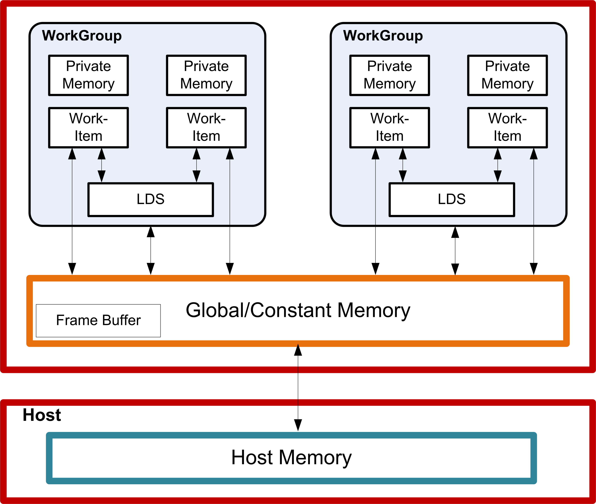

:alt: High-Level Memory Configuration

   High-Level Memory Configuration

Physically located on-chip, directly next to the ALUs, the LDS is
approximately one order of magnitude faster than global memory (assuming
no bank conflicts).

There are 64 kB memory per compute unit, segmented into 32 of 512
Dwords. Each bank is a 256x32 two-port RAM (1R/1W per clock cycle).
Dwords are placed in the banks serially, but all banks can execute a
store or load simultaneously. One work-group can request up to 64 kB
memory. Reads across wavefront are dispatched over four cycles in
waterfall.

The high bandwidth of the LDS memory is achieved not only through its
proximity to the ALUs, but also through simultaneous access to its
memory banks. Thus, it is possible to concurrently execute 32 write or
read instructions, each nominally 32-bits; extended instructions,
read2/write2, can be 64-bits each. If, however, more than one access
attempt is made to the same bank at the same time, a bank conflict
occurs. In this case, for indexed and atomic operations, hardware
prevents the attempted concurrent accesses to the same bank by turning
them into serial accesses. This decreases the effective bandwidth of the
LDS. For maximum throughput (optimal efficiency), therefore, it is
important to avoid bank conflicts. A knowledge of request scheduling and
address mapping is key to achieving this.

Dataflow in Memory Hierarchy
----------------------------

The figure below is a conceptual diagram of the dataflow withing the
memory structure.

|fig 10 2|

To load data into LDS from global memory, it is read from global memory
and placed into the work-item’s registers; then, a store is performed to
LDS. Similarly, to store data into global memory, data is read from LDS
and placed into the workitem’s registers, then placed into global
memory. To make effective use of the LDS, an algorithm must perform many
operations on what is transferred between global memory and LDS. It also
is possible to load data from a memory buffer directly into LDS,
bypassing VGPRs.

LDS atomics are performed in the LDS hardware. (Thus, although ALUs are
not directly used for these operations, latency is incurred by the LDS
executing this function.)

LDS Access
----------

The LDS is accessed in one of three ways:

-  Direct Read

-  Parameter Read

-  Indexed or Atomic

The following subsections describe these methods.

LDS Direct Reads
~~~~~~~~~~~~~~~~

Direct reads are only available in LDS, not in GDS.

LDS Direct reads occur in vector ALU (VALU) instructions and allow the
LDS to supply a single DWORD value which is broadcast to all threads in
the wavefront and is used as the SRC0 input to the ALU operations. A
VALU instruction indicates that input is to be supplied by LDS by using
the LDS\_DIRECT for the SRC0 field.

The LDS address and data-type of the data to be read from LDS comes from
the M0 register:

::

    LDS_addr = M0[15:0] (byte address and must be Dword aligned)
    DataType = M0[18:16]
        0 unsigned byte
        1 unsigned short
        2 Dword
        3 unused
        4 signed byte
        5 signed short

LDS Parameter Reads
~~~~~~~~~~~~~~~~~~~

Parameter reads are only available in LDS, not in GDS.

Pixel shaders use LDS to read vertex parameter values; the pixel shader
then interpolates them to find the per-pixel parameter values. LDS
parameter reads occur when the following opcodes are used.

-  V\_INTERP\_P1\_F32 D = P10 \* S + P0 Parameter interpolation, first
   step.

-  V\_INTERP\_P2\_F32D = P20 \* S + DParameter interpolation, second
   step.

-  V\_INTERP\_MOV\_F32D = {P10,P20,P0}[S]Parameter load.

The typical parameter interpolation operations involves reading three
parameters: P0, P10, and P20, and using the two barycentric coordinates,
I and J, to determine the final per-pixel value:

.. raw:: html

   

Final value = P0 + P10 \* I + P20 \* J

.. raw:: html

   

Parameter interpolation instructions indicate the parameter attribute
number (0 to 32) and the component number (0=x, 1=y, 2=z and 3=w).

+-------------+-------------+--------------------------------------------------+
| Field       | Size        | Description                                      |
+=============+=============+==================================================+
| VDST        | 8           | Destination VGPR. Also acts as source for        |
|             |             | v\_interp\_p2\_f32.                              |
+-------------+-------------+--------------------------------------------------+
| OP          | 2           | | Opcode:                                        |
|             |             | | 0: v\_interp\_p1\_f32 VDST = P10 \* VSRC + P0  |
|             |             | | 1: v\_interp\_p2\_f32 VDST = P20 \* VSRC +     |
|             |             |   VDST                                           |
|             |             | | 2: v\_interp\_mov\_f32 VDST = (P0, P10 or P20  |
|             |             |   selected by VSRC[1:0])                         |
|             |             | | P0, P10 and P20 are parameter values read from |
|             |             |   LDS                                            |
+-------------+-------------+--------------------------------------------------+
| ATTR        | 6           | Attribute number: 0 to 32.                       |
+-------------+-------------+--------------------------------------------------+
| ATTRCHAN    | 2           | 0=X, 1=Y, 2=Z, 3=W                               |
+-------------+-------------+--------------------------------------------------+
| VSRC        | 8           | Source VGPR supplies interpolation "I" or "J"    |
|             |             | value. For OP==v\_interp\_mov\_f32: 0=P10,       |
|             |             | 1=P20, 2=P0. VSRC must not be the same register  |
|             |             | as VDST because 16-bank LDS chips implement      |
|             |             | v\_interp\_p1 as a macro of two instructions.    |
+-------------+-------------+--------------------------------------------------+
| ( M0 )      | 32          | Use of the M0 register is automatic. M0 must     |
|             |             | contain: { 1’b0, new\_prim\_mask[15:1],          |
|             |             | lds\_param\_offset[15:0] }                       |
+-------------+-------------+--------------------------------------------------+

Table: Parameter Instruction Fields

Parameter interpolation and parameter move instructions must initialize
the M0 register before using it. The lds\_param\_offset[15:0] is an
address offset from the beginning of LDS storage allocated to this
wavefront to where parameters begin in LDS memory for this wavefront.
The new\_prim\_mask is a 15-bit mask with one bit per quad; a one in
this mask indicates that this quad begins a new primitive, a zero
indicates it uses the same primitive as the previous quad. The mask is
15 bits, not 16, since the first quad in a wavefront always begins a new
primitive and so it is not included in the mask.

Data Share Indexed and Atomic Access
~~~~~~~~~~~~~~~~~~~~~~~~~~~~~~~~~~~~

Both LDS and GDS can perform indexed and atomic data share operations.
For brevity, "LDS" is used in the text below and, except where noted,
also applies to GDS.

Indexed and atomic operations supply a unique address per work-item from
the VGPRs to the LDS, and supply or return unique data per work-item
back to VGPRs. Due to the internal banked structure of LDS, operations
can complete in as little as two cycles, or take as many 64 cycles,
depending upon the number of bank conflicts (addresses that map to the
same memory bank).

Indexed operations are simple LDS load and store operations that read
data from, and return data to, VGPRs.

Atomic operations are arithmetic operations that combine data from VGPRs
and data in LDS, and write the result back to LDS. Atomic operations
have the option of returning the LDS "pre-op" value to VGPRs.

The table below lists and briefly describes the LDS instruction fields.

+-------------+-------------+--------------------------------------------------+
| Field       | Size        | Description                                      |
+=============+=============+==================================================+
| OP          | 7           | LDS opcode.                                      |
+-------------+-------------+--------------------------------------------------+
| GDS         | 1           | 0 = LDS, 1 = GDS.                                |
+-------------+-------------+--------------------------------------------------+
| OFFSET0     | 8           | Immediate offset, in bytes. Instructions with    |
|             |             | one address combine the offset fields into a     |
|             |             | single 16-bit unsigned offset: {offset1,         |
|             |             | offset0}. Instructions with two addresses (for   |
|             |             | example: READ2) use the offsets separately as    |
|             |             | two 8- bit unsigned offsets. DS\_\*\_SRC2\_\*    |
|             |             | ops treat the offset as a 16-bit signed Dword    |
|             |             | offset.                                          |
+-------------+-------------+--------------------------------------------------+
| OFFSET1     | 8           |                                                  | 
+-------------+-------------+--------------------------------------------------+
| VDST        | 8           | VGPR to which result is written: either from     |
|             |             | LDS-load or atomic return value.                 |
+-------------+-------------+--------------------------------------------------+
| ADDR        | 8           | VGPR that supplies the byte address offset.      |
+-------------+-------------+--------------------------------------------------+
| DATA0       | 8           | VGPR that supplies first data source.            |
+-------------+-------------+--------------------------------------------------+
| DATA1       | 8           | VGPR that supplies second data source.           |
+-------------+-------------+--------------------------------------------------+

Table: LDS Instruction Fields

All LDS operations require that M0 be initialized prior to use. M0
contains a size value that can be used to restrict access to a subset of
the allocated LDS range. If no clamping is wanted, set M0 to 0xFFFFFFFF.

+----------------+-----------------------------------------------------------+
| Load / Store   | Description                                               |
+================+===========================================================+
| DS\_READ\_{B32 | Read one value per thread; sign extend to Dword, if       |
| ,B64,B96,B128, | signed.                                                   |
| U8,I8,U16,I16} |                                                           |
+----------------+-----------------------------------------------------------+
| DS\_READ2\_{B3 | Read two values at unique addresses.                      |
| 2,B64}         |                                                           |
+----------------+-----------------------------------------------------------+
| DS\_READ2ST64\ | Read 2 values at unique addresses; offset \*= 64.         |
| _{B32,B64}     |                                                           |
+----------------+-----------------------------------------------------------+
| DS\_WRITE\_{B3 | Write one value.                                          |
| 2,B64,B96,B128 |                                                           |
| ,B8,B16}       |                                                           |
+----------------+-----------------------------------------------------------+
| DS\_WRITE2\_{B | Write two values.                                         |
| 32,B64}        |                                                           |
+----------------+-----------------------------------------------------------+
| DS\_WRITE2ST64 | Write two values, offset \*= 64.                          |
| \_{B32,B64}    |                                                           |
+----------------+-----------------------------------------------------------+
| DS\_WRXCHG2\_R | Exchange GPR with LDS-memory.                             |
| TN\_{B32,B64}  |                                                           |
+----------------+-----------------------------------------------------------+
| DS\_WRXCHG2ST6 | Exchange GPR with LDS-memory; offset \*= 64.              |
| 4\_RTN\_{B32,B |                                                           |
| 64}            |                                                           |
+----------------+-----------------------------------------------------------+
| DS\_PERMUTE\_B | | Forward permute. Does not write any LDS memory.         |
| 32             | | LDS[dst] = src0                                         |
|                | | returnVal = LDS[thread\_id]                             |
|                | | where thread\_id is 0..63.                              |
+----------------+-----------------------------------------------------------+
| DS\_BPERMUTE\_ | | Backward permute. Does not actually write any LDS       |
| B32            |   memory.                                                 |
|                | | LDS[thread\_id] = src0                                  |
|                | | where thread\_id is 0..63, and returnVal = LDS[dst].    |
+----------------+-----------------------------------------------------------+

Table: LDS Indexed Load/Store

| **Single Address Instructions**

::

    LDS_Addr = LDS_BASE + VGPR[ADDR] + {InstrOffset1,InstrOffset0}

| **Double Address Instructions**

::

    LDS_Addr0 = LDS_BASE + VGPR[ADDR] + InstrOffset0*ADJ +
    LDS_Addr1 = LDS_BASE + VGPR[ADDR] + InstrOffset1*ADJ
       Where ADJ = 4 for 8, 16 and 32-bit data types; and ADJ = 8 for 64-bit.

Note that LDS\_ADDR1 is used only for READ2\*, WRITE2\*, and WREXCHG2\*.

M0[15:0] provides the size in bytes for this access. The size sent to
LDS is MIN(M0, LDS\_SIZE), where LDS\_SIZE is the amount of LDS space
allocated by the shader processor interpolator, SPI, at the time the
wavefront was created.

The address comes from VGPR, and both ADDR and InstrOffset are byte
addresses.

At the time of wavefront creation, LDS\_BASE is assigned to the physical
LDS region owned by this wavefront or work-group.

Specify only one address by setting both offsets to the same value. This
causes only one read or write to occur and uses only the first DATA0.

**SRC2 Ops** The ds\_<op>\_src2\_<type> opcodes are different. These
operands perform an atomic operation on 2 operands from the LDS memory:
one is viewed as the data and the other is the second source operand and
the final destination. The addressing for these can operate in two
different modes depending on the MSB of offset1[7]: If it is 0, the
offset for the data term is derived by the offset fields as a SIGNED
dword offset:

::

    LDS_Addr0 = LDS_BASE + VGPR(ADDR) + SIGNEXTEND(InstrOffset1[6:0],InstrOffset0))<<2    // data term
    LDS_Addr1 = LDS_BASE + VGPR(ADDR)                 // second source and final destination address

If the bit is 1, the offset for the data term becomes per thread and is
a SIGNED dword offset derived from the msbs read from the VGPR for the
index. The addressing becomes:

::

    LDS_Addr0 = LDS_BASE + VGPR(ADDR)[16:0] + SIGNEXTEND(VGPR(ADDR)[31:17])<<2      // data term
    LDS_Addr1 = LDS_BASE + VGPR(ADDR)[16:0]     // second source and final destination address

**LDS Atomic Ops** DS\_<atomicOp> OP, GDS=0, OFFSET0, OFFSET1, VDST,
ADDR, Data0, Data1

Data size is encoded in atomicOp: byte, word, Dword, or double.

.. raw:: html

   

LDS\_Addr0 = LDS\_BASE + VGPR[ADDR] + {InstrOffset1,InstrOffset0}

.. raw:: html

   

ADDR is a Dword address. VGPRs 0,1 and dst are double-GPRs for doubles
data.

VGPR data sources can only be VGPRs or constant values, not SGPRs.

Exporting Pixel and Vertex Data
===============================

The export instruction copies pixel or vertex shader data from VGPRs
into a dedicated output buffer. The export instruction outputs the
following types of data.

-  Vertex Position

-  Vertex Parameter

-  Pixel color

-  Pixel depth (Z)

Microcode Encoding
------------------

The export instruction uses the EXP microcode format.

|microcode exp|

+-------------------------+-------------------------+--------------------------+
| Field                   | Size                    | Description              |
+=========================+=========================+==========================+
| VM                      | 1                       | Valid Mask. When set to  |
|                         |                         | 1, this indicates that   |
|                         |                         | the EXEC mask represents |
|                         |                         | the valid-mask for this  |
|                         |                         | wavefront. It can be     |
|                         |                         | sent multiple times per  |
|                         |                         | shader (the final value  |
|                         |                         | is used), but must be    |
|                         |                         | sent at least once per   |
|                         |                         | pixel shader.            |
+-------------------------+-------------------------+--------------------------+
| DONE                    | 1                       | This is the final pixel  |
|                         |                         | shader or                |
|                         |                         | vertex-position export   |
|                         |                         | of the program. Used     |
|                         |                         | only for pixel and       |
|                         |                         | position exports. Set to |
|                         |                         | zero for parameters.     |
+-------------------------+-------------------------+--------------------------+
| COMPR                   | 1                       | Compressed data. When    |
|                         |                         | set, indicates that the  |
|                         |                         | data being exported is   |
|                         |                         | 16-bits per component    |
|                         |                         | rather than the usual    |
|                         |                         | 32-bit.                  |
+-------------------------+-------------------------+--------------------------+
| TARGET                  | 6                       | | Indicates type of data |
|                         |                         |   exported.              |
|                         |                         | | 0..7 MRT 0..7          |
|                         |                         | | 8 Z                    |
|                         |                         | | 9 Null (no data)       |
|                         |                         | | 12-15 Position 0..3    |
|                         |                         | | 32-63 Param 0..31      |
+-------------------------+-------------------------+--------------------------+
| EN                      | 4                       | | **COMPR==1**: export   |
|                         |                         |   half-Dword enable.     |
|                         |                         |   Valid values are:      |
|                         |                         |   0x0,3,C,F.             |
|                         |                         | | [0] enables VSRC0 :    |
|                         |                         |   R,G from one VGPGR     |
|                         |                         | | [2] enables VSRC1 :    |
|                         |                         |   B,A from one VGPR      |
|                         |                         | | **COMPR==0**: [0-3] =  |
|                         |                         |   enables for VSRC0..3.  |
|                         |                         | | EN can be zero (used   |
|                         |                         |   when exporting only    |
|                         |                         |   valid mask to NULL     |
|                         |                         |   target).               |
+-------------------------+-------------------------+--------------------------+
| VSRC3                   | 8                       | | VGPR from which to     |
|                         |                         |   read data.             |
|                         |                         | | Pos & Param: vsrc0=X,  |
|                         |                         |   1=Y, 2=Z, 3=W          |
|                         |                         | | MRT: vsrc0=R, 1=G,     |
|                         |                         |   2=B, 3=A               |
+-------------------------+-------------------------+--------------------------+
| VSRC2                   | 8                       |                          |    
+-------------------------+-------------------------+--------------------------+
| VSRC1                   | 8                       |                          |
+-------------------------+-------------------------+--------------------------+
| VSRC0                   | 8                       |                          |
+-------------------------+-------------------------+--------------------------+

Table: EXP Encoding Field Descriptions

Operations
----------

Pixel Shader Exports
~~~~~~~~~~~~~~~~~~~~

Export instructions copy color data to the MRTs. Data always has four
components (R, G, B, A). Optionally, export instructions also output
depth (Z) data.

Every pixel shader must have at least one export instruction. The last
export instruction executed must have the DONE bit set to one.

The EXEC mask is applied to all exports. Only pixels with the
corresponding EXEC bit set to 1 export data to the output buffer.
Results from multiple exports are accumulated in the output buffer.

At least one export must have the VM bit set to 1. This export, in
addition to copying data to the color or depth output buffer, also
informs the color buffer which pixels are valid and which have been
discarded. The value of the EXEC mask communicates the pixel valid mask.
If multiple exports are sent with VM set to 1, the mask from the final
export is used. If the shader program wants to only update the valid
mask but not send any new data, the program can do an export to the NULL
target.

Vertex Shader Exports
~~~~~~~~~~~~~~~~~~~~~

The vertex shader uses export instructions to output vertex position
data and vertex parameter data to the output buffer. This data is passed
on to subsequent pixel shaders.

Every vertex shader must output at least one position vector (x, y, z; w
is optional) to the POS0 target. The last position export must have the
DONE bit set to 1. A vertex shader can export zero or more parameters.
For best performance, it is best to output all position data as early as
possible in the vertex shader.

Dependency Checking
-------------------

Export instructions are executed by the hardware in two phases. First,
the instruction is selected to be executed, and EXPCNT is incremented by
1. At this time, the hardware requests the use of internal busses needed
to complete the instruction.

When access to the bus is granted, the EXEC mask is read and the VGPR
data sent out. After the last of the VGPR data is sent, the EXPCNT
counter is decremented by 1.

Use S\_WAITCNT on EXPCNT to prevent the shader program from overwriting
EXEC or the VGPRs holding the data to be exported before the export
operation has completed.

Multiple export instructions can be outstanding at one time. Exports of
the same type (for example: position) are completed in order, but
exports of different types can be completed out of order.

If the STATUS register’s SKIP\_EXPORT bit is set to one, the hardware
treats all EXPORT instructions as if they were NOPs.

Instructions
============

This chapter lists, and provides descriptions for, all instructions in
the GCN Vega Generation environment. Instructions are grouped according
to their format.

**Instruction suffixes have the following definitions:**

-  | B32 Bitfield (untyped data) 32-bit

-  | B64 Bitfield (untyped data) 64-bit

-  | F32 floating-point 32-bit (IEEE 754 single-precision float)

-  | F64 floating-point 64-bit (IEEE 754 double-precision float)

-  | I32 signed 32-bit integer

-  | I64 signed 64-bit integer

-  | U32 unsigned 32-bit integer

-  U64 unsigned 64-bit integer

If an instruction has two suffixes (for example, \_I32\_F32), the first
suffix indicates the destination type, the second the source type.

The following abbreviations are used in instruction definitions:

-  | D = destination

-  | U = unsigned integer

-  | S = source

-  | SCC = scalar condition code

-  | I = signed integer

-  B = bitfield

Note: .u or .i specifies to interpret the argument as an unsigned or
signed float.

Note: Rounding and Denormal modes apply to all floating-point operations
unless otherwise specified in the instruction description.

SOP2 Instructions
-----------------

|microcode sop2|

Instructions in this format may use a 32-bit literal constant which
occurs immediately after the instruction.

+--------+----------------+----------------------------------------------------+
| Opcode | Name           | Description                                        |
+========+================+====================================================+
| 0      | S\_ADD\_U32    | D.u = S0.u + S1.u; SCC = (S0.u + S1.u >=           |
|        |                | 0x100000000ULL ? 1 : 0). // unsigned               |
|        |                | overflow/carry-out, S\_ADDC\_U32                   |
+--------+----------------+----------------------------------------------------+
| 1      | S\_SUB\_U32    | D.u = S0.u - S1.u; SCC = (S1.u > S0.u ? 1 : 0). // |
|        |                | unsigned overflow or carry-out for S\_SUBB\_U32.   |
+--------+----------------+----------------------------------------------------+
| 2      | S\_ADD\_I32    | D.i = S0.i + S1.i; SCC = (S0.u[31] == S1.u[31] &&  |
|        |                | S0.u[31] != D.u[31]). // signed overflow. This     |
|        |                | opcode is not suitable for use with S\_ADDC\_U32   |
|        |                | for implementing 64-bit operations.                |
+--------+----------------+----------------------------------------------------+
| 3      | S\_SUB\_I32    | D.i = S0.i - S1.i; SCC = (S0.u[31] != S1.u[31] &&  |
|        |                | S0.u[31] != D.u[31]). // signed overflow. This     |
|        |                | opcode is not suitable for use with S\_SUBB\_U32   |
|        |                | for implementing 64-bit operations.                |
+--------+----------------+----------------------------------------------------+
| 4      | S\_ADDC\_U32   | D.u = S0.u + S1.u + SCC; SCC = (S0.u + S1.u + SCC  |
|        |                | >= 0x100000000ULL ? 1 : 0). // unsigned overflow.  |
+--------+----------------+----------------------------------------------------+
| 5      | S\_SUBB\_U32   | D.u = S0.u - S1.u - SCC; SCC = (S1.u + SCC > S0.u  |
|        |                | ? 1 : 0). // unsigned overflow.                    |
+--------+----------------+----------------------------------------------------+
| 6      | S\_MIN\_I32    | D.i = (S0.i < S1.i) ? S0.i : S1.i; SCC = (S0.i <   |
|        |                | S1.i).                                             |
+--------+----------------+----------------------------------------------------+
| 7      | S\_MIN\_U32    | D.u = (S0.u < S1.u) ? S0.u : S1.u; SCC = (S0.u <   |
|        |                | S1.u).                                             |
+--------+----------------+----------------------------------------------------+
| 8      | S\_MAX\_I32    | D.i = (S0.i > S1.i) ? S0.i : S1.i; SCC = (S0.i >   |
|        |                | S1.i).                                             |
+--------+----------------+----------------------------------------------------+
| 9      | S\_MAX\_U32    | D.u = (S0.u > S1.u) ? S0.u : S1.u; SCC = (S0.u >   |
|        |                | S1.u).                                             |
+--------+----------------+----------------------------------------------------+
| 10     | S\_CSELECT\_B3 | D.u = SCC ? S0.u : S1.u. Conditional select.       |
|        | 2              |                                                    |
+--------+----------------+----------------------------------------------------+
| 11     | S\_CSELECT\_B6 | D.u64 = SCC ? S0.u64 : S1.u64. Conditional select. |
|        | 4              |                                                    |
+--------+----------------+----------------------------------------------------+
| 12     | S\_AND\_B32    | D = S0 & S1; SCC = (D != 0).                       |
+--------+----------------+----------------------------------------------------+
| 13     | S\_AND\_B64    | D = S0 & S1; SCC = (D != 0).                       |
+--------+----------------+----------------------------------------------------+
| 14     | S\_OR\_B32     | D = S0 \| S1; SCC = (D != 0).                      |
+--------+----------------+----------------------------------------------------+
| 15     | S\_OR\_B64     | D = S0 \| S1; SCC = (D != 0).                      |
+--------+----------------+----------------------------------------------------+
| 16     | S\_XOR\_B32    | D = S0 ^ S1; SCC = (D != 0).                       |
+--------+----------------+----------------------------------------------------+
| 17     | S\_XOR\_B64    | D = S0 ^ S1; SCC = (D != 0).                       |
+--------+----------------+----------------------------------------------------+
| 18     | S\_ANDN2\_B32  | D = S0 & ~S1; SCC = (D != 0).                      |
+--------+----------------+----------------------------------------------------+
| 19     | S\_ANDN2\_B64  | D = S0 & ~S1; SCC = (D != 0).                      |
+--------+----------------+----------------------------------------------------+
| 20     | S\_ORN2\_B32   | D = S0 \| ~S1; SCC = (D != 0).                     |
+--------+----------------+----------------------------------------------------+
| 21     | S\_ORN2\_B64   | D = S0 \| ~S1; SCC = (D != 0).                     |
+--------+----------------+----------------------------------------------------+
| 22     | S\_NAND\_B32   | D = ~(S0 & S1); SCC = (D != 0).                    |
+--------+----------------+----------------------------------------------------+
| 23     | S\_NAND\_B64   | D = ~(S0 & S1); SCC = (D != 0).                    |
+--------+----------------+----------------------------------------------------+
| 24     | S\_NOR\_B32    | D = ~(S0 \| S1); SCC = (D != 0).                   |
+--------+----------------+----------------------------------------------------+
| 25     | S\_NOR\_B64    | D = ~(S0 \| S1); SCC = (D != 0).                   |
+--------+----------------+----------------------------------------------------+
| 26     | S\_XNOR\_B32   | D = ~(S0 ^ S1); SCC = (D != 0).                    |
+--------+----------------+----------------------------------------------------+
| 27     | S\_XNOR\_B64   | D = ~(S0 ^ S1); SCC = (D != 0).                    |
+--------+----------------+----------------------------------------------------+
| 28     | S\_LSHL\_B32   | D.u = S0.u << S1.u[4:0]; SCC = (D.u != 0).         |
+--------+----------------+----------------------------------------------------+
| 29     | S\_LSHL\_B64   | D.u64 = S0.u64 << S1.u[5:0]; SCC = (D.u64 != 0).   |
+--------+----------------+----------------------------------------------------+
| 30     | S\_LSHR\_B32   | D.u = S0.u >> S1.u[4:0]; SCC = (D.u != 0).         |
+--------+----------------+----------------------------------------------------+
| 31     | S\_LSHR\_B64   | D.u64 = S0.u64 >> S1.u[5:0]; SCC = (D.u64 != 0).   |
+--------+----------------+----------------------------------------------------+
| 32     | S\_ASHR\_I32   | D.i = signext(S0.i) >> S1.u[4:0]; SCC = (D.i !=    |
|        |                | 0).                                                |
+--------+----------------+----------------------------------------------------+
| 33     | S\_ASHR\_I64   | D.i64 = signext(S0.i64) >> S1.u[5:0]; SCC = (D.i64 |
|        |                | != 0).                                             |
+--------+----------------+----------------------------------------------------+
| 34     | S\_BFM\_B32    | D.u = ((1 << S0.u[4:0]) - 1) << S1.u[4:0].         |
|        |                | Bitfield mask.                                     |
+--------+----------------+----------------------------------------------------+
| 35     | S\_BFM\_B64    | D.u64 = ((1ULL << S0.u[5:0]) - 1) << S1.u[5:0].    |
|        |                | Bitfield mask.                                     |
+--------+----------------+----------------------------------------------------+
| 36     | S\_MUL\_I32    | D.i = S0.i \* S1.i.                                |
+--------+----------------+----------------------------------------------------+
| 37     | S\_BFE\_U32    | D.u = (S0.u >> S1.u[4:0]) & ((1 << S1.u[22:16]) -  |
|        |                | 1); SCC = (D.u != 0). Bit field extract. S0 is     |
|        |                | Data, S1[4:0] is field offset, S1[22:16] is field  |
|        |                | width.                                             |
+--------+----------------+----------------------------------------------------+
| 38     | S\_BFE\_I32    | D.i = signext((S0.i >> S1.u[4:0]) & ((1 <<         |
|        |                | S1.u[22:16]) - 1)); SCC = (D.i != 0). Bit field    |
|        |                | extract. S0 is Data, S1[4:0] is field offset,      |
|        |                | S1[22:16] is field width.                          |
+--------+----------------+----------------------------------------------------+
| 39     | S\_BFE\_U64    | D.u64 = (S0.u64 >> S1.u[5:0]) & ((1 <<             |
|        |                | S1.u[22:16]) - 1); SCC = (D.u64 != 0). Bit field   |
|        |                | extract. S0 is Data, S1[5:0] is field offset,      |
|        |                | S1[22:16] is field width.                          |
+--------+----------------+----------------------------------------------------+
| 40     | S\_BFE\_I64    | D.i64 = signext((S0.i64 >> S1.u[5:0]) & ((1 <<     |
|        |                | S1.u[22:16]) - 1)); SCC = (D.i64 != 0). Bit field  |
|        |                | extract. S0 is Data, S1[5:0] is field offset,      |
|        |                | S1[22:16] is field width.                          |
+--------+----------------+----------------------------------------------------+
| 41     | S\_CBRANCH\_G\ | mask\_pass = S0.u64 & EXEC; mask\_fail = ~S0.u64 & |
|        | _FORK          | EXEC; if(mask\_pass == EXEC) then PC = S1.u64;     |
|        |                | elsif(mask\_fail == EXEC) then PC += 4;            |
|        |                | elsif(bitcount(mask\_fail) < bitcount(mask\_pass)) |
|        |                | EXEC = mask\_fail; SGPR[CSP\*4] = { S1.u64,        |
|        |                | mask\_pass }; CSP += 1; PC += 4; else EXEC =       |
|        |                | mask\_pass; SGPR[CSP\*4] = { PC + 4, mask\_fail }; |
|        |                | CSP += 1; PC = S1.u64; endif. Conditional branch   |
|        |                | using branch-stack. S0 = compare mask(vcc or any   |
|        |                | sgpr) and S1 = 64-bit byte address of target       |
|        |                | instruction. See also S\_CBRANCH\_JOIN.            |
+--------+----------------+----------------------------------------------------+
| 42     | S\_ABSDIFF\_I3 | D.i = S0.i - S1.i; if(D.i < 0) then D.i = -D.i;    |
|        | 2              | endif; SCC = (D.i != 0). Compute the absolute      |
|        |                | value of difference between two values. Examples:  |
|        |                | S\_ABSDIFF\_I32(0x00000002, 0x00000005) =>         |
|        |                | 0x00000003 S\_ABSDIFF\_I32(0xffffffff, 0x00000000) |
|        |                | => 0x00000001 S\_ABSDIFF\_I32(0x80000000,          |
|        |                | 0x00000000) => 0x80000000 // Note: result is       |
|        |                | negative! S\_ABSDIFF\_I32(0x80000000, 0x00000001)  |
|        |                | => 0x7fffffff S\_ABSDIFF\_I32(0x80000000,          |
|        |                | 0xffffffff) => 0x7fffffff                          |
|        |                | S\_ABSDIFF\_I32(0x80000000, 0xfffffffe) =>         |
|        |                | 0x7ffffffe                                         |
+--------+----------------+----------------------------------------------------+
| 43     | S\_RFE\_RESTOR | PRIV = 0; PC = S0.u64. Return from exception       |
|        | E\_B64         | handler and continue. This instruction may only be |
|        |                | used within a trap handler. This instruction is    |
|        |                | provided for compatibility with older ASICs. New   |
|        |                | shader code must use S\_RFE\_B64. The second       |
|        |                | argument is ignored.                               |
+--------+----------------+----------------------------------------------------+
| 44     | S\_MUL\_HI\_U3 | D.u = (S0.u \* S1.u) >> 32.                        |
|        | 2              |                                                    |
+--------+----------------+----------------------------------------------------+
| 45     | S\_MUL\_HI\_I3 | D.i = (S0.i \* S1.i) >> 32.                        |
|        | 2              |                                                    |
+--------+----------------+----------------------------------------------------+
| 46     | S\_LSHL1\_ADD\ | D.u = (S0.u << 1) + S1.u; SCC = (((S0.u << 1) +    |
|        | _U32           | S1.u) >= 0x100000000ULL ? 1 : 0). // unsigned      |
|        |                | overflow.                                          |
+--------+----------------+----------------------------------------------------+
| 47     | S\_LSHL2\_ADD\ | D.u = (S0.u << 2) + S1.u; SCC = (((S0.u << 2) +    |
|        | _U32           | S1.u) >= 0x100000000ULL ? 1 : 0). // unsigned      |
|        |                | overflow.                                          |
+--------+----------------+----------------------------------------------------+
| 48     | S\_LSHL3\_ADD\ | D.u = (S0.u << 3) + S1.u; SCC = (((S0.u << 3) +    |
|        | _U32           | S1.u) >= 0x100000000ULL ? 1 : 0). // unsigned      |
|        |                | overflow.                                          |
+--------+----------------+----------------------------------------------------+
| 49     | S\_LSHL4\_ADD\ | D.u = (S0.u << 4) + S1.u; SCC = (((S0.u << 4) +    |
|        | _U32           | S1.u) >= 0x100000000ULL ? 1 : 0). // unsigned      |
|        |                | overflow.                                          |
+--------+----------------+----------------------------------------------------+
| 50     | S\_PACK\_LL\_B | D.u[31:0] = { S1.u[15:0], S0.u[15:0] }.            |
|        | 32\_B16        |                                                    |
+--------+----------------+----------------------------------------------------+
| 51     | S\_PACK\_LH\_B | D.u[31:0] = { S1.u[31:16], S0.u[15:0] }.           |
|        | 32\_B16        |                                                    |
+--------+----------------+----------------------------------------------------+
| 52     | S\_PACK\_HH\_B | D.u[31:0] = { S1.u[31:16], S0.u[31:16] }.          |
|        | 32\_B16        |                                                    |
+--------+----------------+----------------------------------------------------+

SOPK Instructions
-----------------

|microcode sopk|

Instructions in this format may use a 32-bit literal constant which
occurs immediately after the instruction.

+--------+----------------+----------------------------------------------------+
| Opcode | Name           | Description                                        |
+========+================+====================================================+
| 0      | S\_MOVK\_I32   | D.i = signext(SIMM16). Sign extension from a       |
|        |                | 16-bit constant.                                   |
+--------+----------------+----------------------------------------------------+
| 1      | S\_CMOVK\_I32  | if(SCC) then D.i = signext(SIMM16); endif.         |
|        |                | Conditional move with sign extension.              |
+--------+----------------+----------------------------------------------------+
| 2      | S\_CMPK\_EQ\_I | SCC = (S0.i == signext(SIMM16)).                   |
|        | 32             |                                                    |
+--------+----------------+----------------------------------------------------+
| 3      | S\_CMPK\_LG\_I | SCC = (S0.i != signext(SIMM16)).                   |
|        | 32             |                                                    |
+--------+----------------+----------------------------------------------------+
| 4      | S\_CMPK\_GT\_I | SCC = (S0.i > signext(SIMM16)).                    |
|        | 32             |                                                    |
+--------+----------------+----------------------------------------------------+
| 5      | S\_CMPK\_GE\_I | SCC = (S0.i >= signext(SIMM16)).                   |
|        | 32             |                                                    |
+--------+----------------+----------------------------------------------------+
| 6      | S\_CMPK\_LT\_I | SCC = (S0.i < signext(SIMM16)).                    |
|        | 32             |                                                    |
+--------+----------------+----------------------------------------------------+
| 7      | S\_CMPK\_LE\_I | SCC = (S0.i <= signext(SIMM16)).                   |
|        | 32             |                                                    |
+--------+----------------+----------------------------------------------------+
| 8      | S\_CMPK\_EQ\_U | SCC = (S0.u == SIMM16).                            |
|        | 32             |                                                    |
+--------+----------------+----------------------------------------------------+
| 9      | S\_CMPK\_LG\_U | SCC = (S0.u != SIMM16).                            |
|        | 32             |                                                    |
+--------+----------------+----------------------------------------------------+
| 10     | S\_CMPK\_GT\_U | SCC = (S0.u > SIMM16).                             |
|        | 32             |                                                    |
+--------+----------------+----------------------------------------------------+
| 11     | S\_CMPK\_GE\_U | SCC = (S0.u >= SIMM16).                            |
|        | 32             |                                                    |
+--------+----------------+----------------------------------------------------+
| 12     | S\_CMPK\_LT\_U | SCC = (S0.u < SIMM16).                             |
|        | 32             |                                                    |
+--------+----------------+----------------------------------------------------+
| 13     | S\_CMPK\_LE\_U | SCC = (S0.u <= SIMM16).                            |
|        | 32             |                                                    |
+--------+----------------+----------------------------------------------------+
| 14     | S\_ADDK\_I32   | tmp = D.i; // save value so we can check sign bits |
|        |                | for overflow later. D.i = D.i + signext(SIMM16);   |
|        |                | SCC = (tmp[31] == SIMM16[15] && tmp[31] !=         |
|        |                | D.i[31]). // signed overflow.                      |
+--------+----------------+----------------------------------------------------+
| 15     | S\_MULK\_I32   | D.i = D.i \* signext(SIMM16).                      |
+--------+----------------+----------------------------------------------------+
| 16     | S\_CBRANCH\_I\ | mask\_pass = S0.u64 & EXEC; mask\_fail = ~S0.u64 & |
|        | _FORK          | EXEC; target\_addr = PC + signext(SIMM16 \* 4) +   |
|        |                | 4; if(mask\_pass == EXEC) PC = target\_addr;       |
|        |                | elsif(mask\_fail == EXEC) PC += 4;                 |
|        |                | elsif(bitcount(mask\_fail) < bitcount(mask\_pass)) |
|        |                | EXEC = mask\_fail; SGPR[CSP\*4] = { target\_addr,  |
|        |                | mask\_pass }; CSP += 1; PC += 4; else EXEC =       |
|        |                | mask\_pass; SGPR[CSP\*4] = { PC + 4, mask\_fail }; |
|        |                | CSP += 1; PC = target\_addr; endif. Conditional    |
|        |                | branch using branch-stack. S0 = compare mask(vcc   |
|        |                | or any sgpr), and SIMM16 = signed DWORD branch     |
|        |                | offset relative to next instruction. See also      |
|        |                | S\_CBRANCH\_JOIN.                                  |
+--------+----------------+----------------------------------------------------+
| 17     | S\_GETREG\_B32 | D.u = hardware-reg. Read some or all of a hardware |
|        |                | register into the LSBs of D. SIMM16 = {size[4:0],  |
|        |                | offset[4:0], hwRegId[5:0]}; offset is 0..31, size  |
|        |                | is 1..32.                                          |
+--------+----------------+----------------------------------------------------+
| 18     | S\_SETREG\_B32 | hardware-reg = S0.u. Write some or all of the LSBs |
|        |                | of D into a hardware register. SIMM16 =            |
|        |                | {size[4:0], offset[4:0], hwRegId[5:0]}; offset is  |
|        |                | 0..31, size is 1..32.                              |
+--------+----------------+----------------------------------------------------+
| 20     | S\_SETREG\_IMM | Write some or all of the LSBs of IMM32 into a      |
|        | 32\_B32        | hardware register; this instruction requires a     |
|        |                | 32-bit literal constant. SIMM16 = {size[4:0],      |
|        |                | offset[4:0], hwRegId[5:0]}; offset is 0..31, size  |
|        |                | is 1..32.                                          |
+--------+----------------+----------------------------------------------------+
| 21     | S\_CALL\_B64   | D.u64 = PC + 4; PC = PC + signext(SIMM16 \* 4) +   |
|        |                | 4. Implements a short call, where the return       |
|        |                | address (the next instruction after the            |
|        |                | S\_CALL\_B64) is saved to D. Long calls should     |
|        |                | consider S\_SWAPPC\_B64 instead. Note that this    |
|        |                | instruction is always 4 bytes.                     |
+--------+----------------+----------------------------------------------------+

SOP1 Instructions
-----------------

|microcode sop1|

Instructions in this format may use a 32-bit literal constant which
occurs immediately after the instruction.

+--------+----------------+----------------------------------------------------+
| Opcode | Name           | Description                                        |
+========+================+====================================================+
| 0      | S\_MOV\_B32    | D.u = S0.u.                                        |
+--------+----------------+----------------------------------------------------+
| 1      | S\_MOV\_B64    | D.u64 = S0.u64.                                    |
+--------+----------------+----------------------------------------------------+
| 2      | S\_CMOV\_B32   | if(SCC) then D.u = S0.u; endif. Conditional move.  |
+--------+----------------+----------------------------------------------------+
| 3      | S\_CMOV\_B64   | if(SCC) then D.u64 = S0.u64; endif. Conditional    |
|        |                | move.                                              |
+--------+----------------+----------------------------------------------------+
| 4      | S\_NOT\_B32    | D = ~S0; SCC = (D != 0). Bitwise negation.         |
+--------+----------------+----------------------------------------------------+
| 5      | S\_NOT\_B64    | D = ~S0; SCC = (D != 0). Bitwise negation.         |
+--------+----------------+----------------------------------------------------+
| 6      | S\_WQM\_B32    | for i in 0 ... opcode\_size\_in\_bits - 1 do D[i]  |
|        |                | = (S0[(i & ~3):(i \| 3)] != 0); endfor; SCC = (D   |
|        |                | != 0). Computes whole quad mode for an             |
|        |                | active/valid mask. If any pixel in a quad is       |
|        |                | active, all pixels of the quad are marked active.  |
+--------+----------------+----------------------------------------------------+
| 7      | S\_WQM\_B64    | for i in 0 ... opcode\_size\_in\_bits - 1 do D[i]  |
|        |                | = (S0[(i & ~3):(i \| 3)] != 0); endfor; SCC = (D   |
|        |                | != 0). Computes whole quad mode for an             |
|        |                | active/valid mask. If any pixel in a quad is       |
|        |                | active, all pixels of the quad are marked active.  |
+--------+----------------+----------------------------------------------------+
| 8      | S\_BREV\_B32   | D.u[31:0] = S0.u[0:31]. Reverse bits.              |
+--------+----------------+----------------------------------------------------+
| 9      | S\_BREV\_B64   | D.u64[63:0] = S0.u64[0:63]. Reverse bits.          |
+--------+----------------+----------------------------------------------------+
| 10     | S\_BCNT0\_I32\ | D = 0; for i in 0 ... opcode\_size\_in\_bits - 1   |
|        | _B32           | do D += (S0[i] == 0 ? 1 : 0) endfor; SCC = (D !=   |
|        |                | 0). Examples: S\_BCNT0\_I32\_B32(0x00000000) => 32 |
|        |                | S\_BCNT0\_I32\_B32(0xcccccccc) => 16               |
|        |                | S\_BCNT0\_I32\_B32(0xffffffff) => 0                |
+--------+----------------+----------------------------------------------------+
| 11     | S\_BCNT0\_I32\ | D = 0; for i in 0 ... opcode\_size\_in\_bits - 1   |
|        | _B64           | do D += (S0[i] == 0 ? 1 : 0) endfor; SCC = (D !=   |
|        |                | 0). Examples: S\_BCNT0\_I32\_B32(0x00000000) => 32 |
|        |                | S\_BCNT0\_I32\_B32(0xcccccccc) => 16               |
|        |                | S\_BCNT0\_I32\_B32(0xffffffff) => 0                |
+--------+----------------+----------------------------------------------------+
| 12     | S\_BCNT1\_I32\ | D = 0; for i in 0 ... opcode\_size\_in\_bits - 1   |
|        | _B32           | do D += (S0[i] == 1 ? 1 : 0) endfor; SCC = (D !=   |
|        |                | 0). Examples: S\_BCNT1\_I32\_B32(0x00000000) => 0  |
|        |                | S\_BCNT1\_I32\_B32(0xcccccccc) => 16               |
|        |                | S\_BCNT1\_I32\_B32(0xffffffff) => 32               |
+--------+----------------+----------------------------------------------------+
| 13     | S\_BCNT1\_I32\ | D = 0; for i in 0 ... opcode\_size\_in\_bits - 1   |
|        | _B64           | do D += (S0[i] == 1 ? 1 : 0) endfor; SCC = (D !=   |
|        |                | 0). Examples: S\_BCNT1\_I32\_B32(0x00000000) => 0  |
|        |                | S\_BCNT1\_I32\_B32(0xcccccccc) => 16               |
|        |                | S\_BCNT1\_I32\_B32(0xffffffff) => 32               |
+--------+----------------+----------------------------------------------------+
| 14     | S\_FF0\_I32\_B | D.i = -1; // Set if no zeros are found for i in 0  |
|        | 32             | ... opcode\_size\_in\_bits - 1 do // Search from   |
|        |                | LSB if S0[i] == 0 then D.i = i; break for; endif;  |
|        |                | endfor. Returns the bit position of the first zero |
|        |                | from the LSB, or -1 if there are no zeros.         |
|        |                | Examples: S\_FF0\_I32\_B32(0xaaaaaaaa) => 0        |
|        |                | S\_FF0\_I32\_B32(0x55555555) => 1                  |
|        |                | S\_FF0\_I32\_B32(0x00000000) => 0                  |
|        |                | S\_FF0\_I32\_B32(0xffffffff) => 0xffffffff         |
|        |                | S\_FF0\_I32\_B32(0xfffeffff) => 16                 |
+--------+----------------+----------------------------------------------------+
| 15     | S\_FF0\_I32\_B | D.i = -1; // Set if no zeros are found for i in 0  |
|        | 64             | ... opcode\_size\_in\_bits - 1 do // Search from   |
|        |                | LSB if S0[i] == 0 then D.i = i; break for; endif;  |
|        |                | endfor. Returns the bit position of the first zero |
|        |                | from the LSB, or -1 if there are no zeros.         |
|        |                | Examples: S\_FF0\_I32\_B32(0xaaaaaaaa) => 0        |
|        |                | S\_FF0\_I32\_B32(0x55555555) => 1                  |
|        |                | S\_FF0\_I32\_B32(0x00000000) => 0                  |
|        |                | S\_FF0\_I32\_B32(0xffffffff) => 0xffffffff         |
|        |                | S\_FF0\_I32\_B32(0xfffeffff) => 16                 |
+--------+----------------+----------------------------------------------------+
| 16     | S\_FF1\_I32\_B | D.i = -1; // Set if no ones are found for i in 0   |
|        | 32             | ... opcode\_size\_in\_bits - 1 do // Search from   |
|        |                | LSB if S0[i] == 1 then D.i = i; break for; endif;  |
|        |                | endfor. Returns the bit position of the first one  |
|        |                | from the LSB, or -1 if there are no ones.          |
|        |                | Examples: S\_FF1\_I32\_B32(0xaaaaaaaa) => 1        |
|        |                | S\_FF1\_I32\_B32(0x55555555) => 0                  |
|        |                | S\_FF1\_I32\_B32(0x00000000) => 0xffffffff         |
|        |                | S\_FF1\_I32\_B32(0xffffffff) => 0                  |
|        |                | S\_FF1\_I32\_B32(0x00010000) => 16                 |
+--------+----------------+----------------------------------------------------+
| 17     | S\_FF1\_I32\_B | D.i = -1; // Set if no ones are found for i in 0   |
|        | 64             | ... opcode\_size\_in\_bits - 1 do // Search from   |
|        |                | LSB if S0[i] == 1 then D.i = i; break for; endif;  |
|        |                | endfor. Returns the bit position of the first one  |
|        |                | from the LSB, or -1 if there are no ones.          |
|        |                | Examples: S\_FF1\_I32\_B32(0xaaaaaaaa) => 1        |
|        |                | S\_FF1\_I32\_B32(0x55555555) => 0                  |
|        |                | S\_FF1\_I32\_B32(0x00000000) => 0xffffffff         |
|        |                | S\_FF1\_I32\_B32(0xffffffff) => 0                  |
|        |                | S\_FF1\_I32\_B32(0x00010000) => 16                 |
+--------+----------------+----------------------------------------------------+
| 18     | S\_FLBIT\_I32\ | D.i = -1; // Set if no ones are found for i in 0   |
|        | _B32           | ... opcode\_size\_in\_bits - 1 do // Note: search  |
|        |                | is from the MSB if S0[opcode\_size\_in\_bits - 1 - |
|        |                | i] == 1 then D.i = i; break for; endif; endfor.    |
|        |                | Counts how many zeros before the first one         |
|        |                | starting from the MSB. Returns -1 if there are no  |
|        |                | ones. Examples: S\_FLBIT\_I32\_B32(0x00000000) =>  |
|        |                | 0xffffffff S\_FLBIT\_I32\_B32(0x0000cccc) => 16    |
|        |                | S\_FLBIT\_I32\_B32(0xffff3333) => 0                |
|        |                | S\_FLBIT\_I32\_B32(0x7fffffff) => 1                |
|        |                | S\_FLBIT\_I32\_B32(0x80000000) => 0                |
|        |                | S\_FLBIT\_I32\_B32(0xffffffff) => 0                |
+--------+----------------+----------------------------------------------------+
| 19     | S\_FLBIT\_I32\ | D.i = -1; // Set if no ones are found for i in 0   |
|        | _B64           | ... opcode\_size\_in\_bits - 1 do // Note: search  |
|        |                | is from the MSB if S0[opcode\_size\_in\_bits - 1 - |
|        |                | i] == 1 then D.i = i; break for; endif; endfor.    |
|        |                | Counts how many zeros before the first one         |
|        |                | starting from the MSB. Returns -1 if there are no  |
|        |                | ones. Examples: S\_FLBIT\_I32\_B32(0x00000000) =>  |
|        |                | 0xffffffff S\_FLBIT\_I32\_B32(0x0000cccc) => 16    |
|        |                | S\_FLBIT\_I32\_B32(0xffff3333) => 0                |
|        |                | S\_FLBIT\_I32\_B32(0x7fffffff) => 1                |
|        |                | S\_FLBIT\_I32\_B32(0x80000000) => 0                |
|        |                | S\_FLBIT\_I32\_B32(0xffffffff) => 0                |
+--------+----------------+----------------------------------------------------+
| 20     | S\_FLBIT\_I32  | D.i = -1; // Set if all bits are the same for i in |
|        |                | 1 ... opcode\_size\_in\_bits - 1 do // Note:       |
|        |                | search is from the MSB if                          |
|        |                | S0[opcode\_size\_in\_bits - 1 - i] !=              |
|        |                | S0[opcode\_size\_in\_bits - 1] then D.i = i; break |
|        |                | for; endif; endfor. Counts how many bits in a row  |
|        |                | (from MSB to LSB) are the same as the sign bit.    |
|        |                | Returns -1 if all bits are the same. Examples:     |
|        |                | S\_FLBIT\_I32(0x00000000) => 0xffffffff            |
|        |                | S\_FLBIT\_I32(0x0000cccc) => 16                    |
|        |                | S\_FLBIT\_I32(0xffff3333) => 16                    |
|        |                | S\_FLBIT\_I32(0x7fffffff) => 1                     |
|        |                | S\_FLBIT\_I32(0x80000000) => 1                     |
|        |                | S\_FLBIT\_I32(0xffffffff) => 0xffffffff            |
+--------+----------------+----------------------------------------------------+
| 21     | S\_FLBIT\_I32\ | D.i = -1; // Set if all bits are the same for i in |
|        | _I64           | 1 ... opcode\_size\_in\_bits - 1 do // Note:       |
|        |                | search is from the MSB if                          |
|        |                | S0[opcode\_size\_in\_bits - 1 - i] !=              |
|        |                | S0[opcode\_size\_in\_bits - 1] then D.i = i; break |
|        |                | for; endif; endfor. Counts how many bits in a row  |
|        |                | (from MSB to LSB) are the same as the sign bit.    |
|        |                | Returns -1 if all bits are the same. Examples:     |
|        |                | S\_FLBIT\_I32(0x00000000) => 0xffffffff            |
|        |                | S\_FLBIT\_I32(0x0000cccc) => 16                    |
|        |                | S\_FLBIT\_I32(0xffff3333) => 16                    |
|        |                | S\_FLBIT\_I32(0x7fffffff) => 1                     |
|        |                | S\_FLBIT\_I32(0x80000000) => 1                     |
|        |                | S\_FLBIT\_I32(0xffffffff) => 0xffffffff            |
+--------+----------------+----------------------------------------------------+
| 22     | S\_SEXT\_I32\_ | D.i = signext(S0.i[7:0]). Sign extension.          |
|        | I8             |                                                    |
+--------+----------------+----------------------------------------------------+
| 23     | S\_SEXT\_I32\_ | D.i = signext(S0.i[15:0]). Sign extension.         |
|        | I16            |                                                    |
+--------+----------------+----------------------------------------------------+
| 24     | S\_BITSET0\_B3 | D.u[S0.u[4:0]] = 0.                                |
|        | 2              |                                                    |
+--------+----------------+----------------------------------------------------+
| 25     | S\_BITSET0\_B6 | D.u64[S0.u[5:0]] = 0.                              |
|        | 4              |                                                    |
+--------+----------------+----------------------------------------------------+
| 26     | S\_BITSET1\_B3 | D.u[S0.u[4:0]] = 1.                                |
|        | 2              |                                                    |
+--------+----------------+----------------------------------------------------+
| 27     | S\_BITSET1\_B6 | D.u64[S0.u[5:0]] = 1.                              |
|        | 4              |                                                    |
+--------+----------------+----------------------------------------------------+
| 28     | S\_GETPC\_B64  | D.u64 = PC + 4. Destination receives the byte      |
|        |                | address of the next instruction. Note that this    |
|        |                | instruction is always 4 bytes.                     |
+--------+----------------+----------------------------------------------------+
| 29     | S\_SETPC\_B64  | PC = S0.u64. S0.u64 is a byte address of the       |
|        |                | instruction to jump to.                            |
+--------+----------------+----------------------------------------------------+
| 30     | S\_SWAPPC\_B64 | D.u64 = PC + 4; PC = S0.u64. S0.u64 is a byte      |
|        |                | address of the instruction to jump to. Destination |
|        |                | receives the byte address of the instruction       |
|        |                | immediately following the SWAPPC instruction. Note |
|        |                | that this instruction is always 4 bytes.           |
+--------+----------------+----------------------------------------------------+
| 31     | S\_RFE\_B64    | PRIV = 0; PC = S0.u64. Return from exception       |
|        |                | handler and continue. This instruction may only be |
|        |                | used within a trap handler.                        |
+--------+----------------+----------------------------------------------------+
| 32     | S\_AND\_SAVEEX | D.u64 = EXEC; EXEC = S0.u64 & EXEC; SCC = (EXEC != |
|        | EC\_B64        | 0).                                                |
+--------+----------------+----------------------------------------------------+
| 33     | S\_OR\_SAVEEXE | D.u64 = EXEC; EXEC = S0.u64 \| EXEC; SCC = (EXEC   |
|        | C\_B64         | != 0).                                             |
+--------+----------------+----------------------------------------------------+
| 34     | S\_XOR\_SAVEEX | D.u64 = EXEC; EXEC = S0.u64 ^ EXEC; SCC = (EXEC != |
|        | EC\_B64        | 0).                                                |
+--------+----------------+----------------------------------------------------+
| 35     | S\_ANDN2\_SAVE | D.u64 = EXEC; EXEC = S0.u64 & ~EXEC; SCC = (EXEC   |
|        | EXEC\_B64      | != 0).                                             |
+--------+----------------+----------------------------------------------------+
| 36     | S\_ORN2\_SAVEE | D.u64 = EXEC; EXEC = S0.u64 \| ~EXEC; SCC = (EXEC  |
|        | XEC\_B64       | != 0).                                             |
+--------+----------------+----------------------------------------------------+
| 37     | S\_NAND\_SAVEE | D.u64 = EXEC; EXEC = ~(S0.u64 & EXEC); SCC = (EXEC |
|        | XEC\_B64       | != 0).                                             |
+--------+----------------+----------------------------------------------------+
| 38     | S\_NOR\_SAVEEX | D.u64 = EXEC; EXEC = ~(S0.u64 \| EXEC); SCC =      |
|        | EC\_B64        | (EXEC != 0).                                       |
+--------+----------------+----------------------------------------------------+
| 39     | S\_XNOR\_SAVEE | D.u64 = EXEC; EXEC = ~(S0.u64 ^ EXEC); SCC = (EXEC |
|        | XEC\_B64       | != 0).                                             |
+--------+----------------+----------------------------------------------------+
| 40     | S\_QUADMASK\_B | D = 0; for i in 0 ... (opcode\_size\_in\_bits / 4) |
|        | 32             | - 1 do D[i] = (S0[i \* 4 + 3:i \* 4] != 0);        |
|        |                | endfor; SCC = (D != 0). Reduce a pixel mask to a   |
|        |                | quad mask. To perform the inverse operation see    |
|        |                | S\_BITREPLICATE\_B64\_B32.                         |
+--------+----------------+----------------------------------------------------+
| 41     | S\_QUADMASK\_B | D = 0; for i in 0 ... (opcode\_size\_in\_bits / 4) |
|        | 64             | - 1 do D[i] = (S0[i \* 4 + 3:i \* 4] != 0);        |
|        |                | endfor; SCC = (D != 0). Reduce a pixel mask to a   |
|        |                | quad mask. To perform the inverse operation see    |
|        |                | S\_BITREPLICATE\_B64\_B32.                         |
+--------+----------------+----------------------------------------------------+
| 42     | S\_MOVRELS\_B3 | addr = SGPR address appearing in instruction SRC0  |
|        | 2              | field; addr += M0.u; D.u = SGPR[addr].u. Move from |
|        |                | a relative source address. For example, the        |
|        |                | following instruction sequence will perform a move |
|        |                | s5 <== s17: s\_mov\_b32 m0, 10 s\_movrels\_b32 s5, |
|        |                | s7                                                 |
+--------+----------------+----------------------------------------------------+
| 43     | S\_MOVRELS\_B6 | addr = SGPR address appearing in instruction SRC0  |
|        | 4              | field; addr += M0.u; D.u64 = SGPR[addr].u64. Move  |
|        |                | from a relative source address. The index in M0.u  |
|        |                | must be even for this operation.                   |
+--------+----------------+----------------------------------------------------+
| 44     | S\_MOVRELD\_B3 | addr = SGPR address appearing in instruction DST   |
|        | 2              | field; addr += M0.u; SGPR[addr].u = S0.u. Move to  |
|        |                | a relative destination address. For example, the   |
|        |                | following instruction sequence will perform a move |
|        |                | s15 <== s7: s\_mov\_b32 m0, 10 s\_movreld\_b32 s5, |
|        |                | s7                                                 |
+--------+----------------+----------------------------------------------------+
| 45     | S\_MOVRELD\_B6 | addr = SGPR address appearing in instruction DST   |
|        | 4              | field; addr += M0.u; SGPR[addr].u64 = S0.u64. Move |
|        |                | to a relative destination address. The index in    |
|        |                | M0.u must be even for this operation.              |
+--------+----------------+----------------------------------------------------+
| 46     | S\_CBRANCH\_JO | saved\_csp = S0.u; if(CSP == saved\_csp) then PC   |
|        | IN             | += 4; // Second time to JOIN: continue with        |
|        |                | program. else CSP -= 1; // First time to JOIN;     |
|        |                | jump to other FORK path. {PC, EXEC} = SGPR[CSP \*  |
|        |                | 4]; // Read 128 bits from 4 consecutive SGPRs.     |
|        |                | endif. Conditional branch join point (end of       |
|        |                | conditional branch block). S0 is saved CSP value.  |
|        |                | See S\_CBRANCH\_G\_FORK and S\_CBRANCH\_I\_FORK    |
|        |                | for related instructions.                          |
+--------+----------------+----------------------------------------------------+
| 48     | S\_ABS\_I32    | D.i = (S.i < 0 ? -S.i : S.i); SCC = (D.i != 0).    |
|        |                | Integer absolute value. Examples:                  |
|        |                | S\_ABS\_I32(0x00000001) => 0x00000001              |
|        |                | S\_ABS\_I32(0x7fffffff) => 0x7fffffff              |
|        |                | S\_ABS\_I32(0x80000000) => 0x80000000 // Note this |
|        |                | is negative! S\_ABS\_I32(0x80000001) => 0x7fffffff |
|        |                | S\_ABS\_I32(0x80000002) => 0x7ffffffe              |
|        |                | S\_ABS\_I32(0xffffffff) => 0x00000001              |
+--------+----------------+----------------------------------------------------+
| 50     | S\_SET\_GPR\_I | M0[7:0] = S0.u[7:0]. Modify the index used in      |
|        | DX\_IDX        | vector GPR indexing. S\_SET\_GPR\_IDX\_ON,         |
|        |                | S\_SET\_GPR\_IDX\_OFF, S\_SET\_GPR\_IDX\_MODE and  |
|        |                | S\_SET\_GPR\_IDX\_IDX are related instructions.    |
+--------+----------------+----------------------------------------------------+
| 51     | S\_ANDN1\_SAVE | D.u64 = EXEC; EXEC = ~S0.u64 & EXEC; SCC = (EXEC   |
|        | EXEC\_B64      | != 0).                                             |
+--------+----------------+----------------------------------------------------+
| 52     | S\_ORN1\_SAVEE | D.u64 = EXEC; EXEC = ~S0.u64 \| EXEC; SCC = (EXEC  |
|        | XEC\_B64       | != 0).                                             |
+--------+----------------+----------------------------------------------------+
| 53     | S\_ANDN1\_WREX | EXEC = ~S0.u64 & EXEC; D.u64 = EXEC; SCC = (EXEC   |
|        | EC\_B64        | != 0).                                             |
+--------+----------------+----------------------------------------------------+
| 54     | S\_ANDN2\_WREX | EXEC = S0.u64 & ~EXEC; D.u64 = EXEC; SCC = (EXEC   |
|        | EC\_B64        | != 0).                                             |
+--------+----------------+----------------------------------------------------+
| 55     | S\_BITREPLICAT | for i in 0 ... 31 do D.u64[i \* 2 + 0] = S0.u32[i] |
|        | E\_B64\_B32    | D.u64[i \* 2 + 1] = S0.u32[i] endfor. Replicate    |
|        |                | the low 32 bits of S0 by 'doubling' each bit. This |
|        |                | opcode can be used to convert a quad mask into a   |
|        |                | pixel mask; given quad mask in s0, the following   |
|        |                | sequence will produce a pixel mask in s1:          |
|        |                | s\_bitreplicate\_b64 s1, s0 s\_bitreplicate\_b64   |
|        |                | s1, s1 To perform the inverse operation see        |
|        |                | S\_QUADMASK\_B64.                                  |
+--------+----------------+----------------------------------------------------+

SOPC Instructions
-----------------

|microcode sopc|

Instructions in this format may use a 32-bit literal constant which
occurs immediately after the instruction.

+--------+----------------+----------------------------------------------------+
| Opcode | Name           | Description                                        |
+========+================+====================================================+
| 0      | S\_CMP\_EQ\_I3 | SCC = (S0 == S1). Note that S\_CMP\_EQ\_I32 and    |
|        | 2              | S\_CMP\_EQ\_U32 are identical opcodes, but both    |
|        |                | are provided for symmetry.                         |
+--------+----------------+----------------------------------------------------+
| 1      | S\_CMP\_LG\_I3 | SCC = (S0 != S1). Note that S\_CMP\_LG\_I32 and    |
|        | 2              | S\_CMP\_LG\_U32 are identical opcodes, but both    |
|        |                | are provided for symmetry.                         |
+--------+----------------+----------------------------------------------------+
| 2      | S\_CMP\_GT\_I3 | SCC = (S0.i > S1.i).                               |
|        | 2              |                                                    |
+--------+----------------+----------------------------------------------------+
| 3      | S\_CMP\_GE\_I3 | SCC = (S0.i >= S1.i).                              |
|        | 2              |                                                    |
+--------+----------------+----------------------------------------------------+
| 4      | S\_CMP\_LT\_I3 | SCC = (S0.i < S1.i).                               |
|        | 2              |                                                    |
+--------+----------------+----------------------------------------------------+
| 5      | S\_CMP\_LE\_I3 | SCC = (S0.i <= S1.i).                              |
|        | 2              |                                                    |
+--------+----------------+----------------------------------------------------+
| 6      | S\_CMP\_EQ\_U3 | SCC = (S0 == S1). Note that S\_CMP\_EQ\_I32 and    |
|        | 2              | S\_CMP\_EQ\_U32 are identical opcodes, but both    |
|        |                | are provided for symmetry.                         |
+--------+----------------+----------------------------------------------------+
| 7      | S\_CMP\_LG\_U3 | SCC = (S0 != S1). Note that S\_CMP\_LG\_I32 and    |
|        | 2              | S\_CMP\_LG\_U32 are identical opcodes, but both    |
|        |                | are provided for symmetry.                         |
+--------+----------------+----------------------------------------------------+
| 8      | S\_CMP\_GT\_U3 | SCC = (S0.u > S1.u).                               |
|        | 2              |                                                    |
+--------+----------------+----------------------------------------------------+
| 9      | S\_CMP\_GE\_U3 | SCC = (S0.u >= S1.u).                              |
|        | 2              |                                                    |
+--------+----------------+----------------------------------------------------+
| 10     | S\_CMP\_LT\_U3 | SCC = (S0.u < S1.u).                               |
|        | 2              |                                                    |
+--------+----------------+----------------------------------------------------+
| 11     | S\_CMP\_LE\_U3 | SCC = (S0.u <= S1.u).                              |
|        | 2              |                                                    |
+--------+----------------+----------------------------------------------------+
| 12     | S\_BITCMP0\_B3 | SCC = (S0.u[S1.u[4:0]] == 0).                      |
|        | 2              |                                                    |
+--------+----------------+----------------------------------------------------+
| 13     | S\_BITCMP1\_B3 | SCC = (S0.u[S1.u[4:0]] == 1).                      |
|        | 2              |                                                    |
+--------+----------------+----------------------------------------------------+
| 14     | S\_BITCMP0\_B6 | SCC = (S0.u64[S1.u[5:0]] == 0).                    |
|        | 4              |                                                    |
+--------+----------------+----------------------------------------------------+
| 15     | S\_BITCMP1\_B6 | SCC = (S0.u64[S1.u[5:0]] == 1).                    |
|        | 4              |                                                    |
+--------+----------------+----------------------------------------------------+
| 16     | S\_SETVSKIP    | VSKIP = S0.u[S1.u[4:0]]. Enables and disables      |
|        |                | VSKIP mode. When VSKIP is enabled, no              |
|        |                | VOP\*/M\*BUF/MIMG/DS/FLAT/EXP instuctions are      |
|        |                | issued. Note that VSKIPped memory instructions do  |
|        |                | not manipulate the waitcnt counters; as a result,  |
|        |                | if you have outstanding memory requests you may    |
|        |                | want to issue S\_WAITCNT 0 prior to enabling       |
|        |                | VSKIP, otherwise you'll need to be careful not to  |
|        |                | count VSKIPped instructions in your waitcnt        |
|        |                | calculations. Examples: s\_setvskip 1, 0 // Enable |
|        |                | vskip mode. s\_setvskip 0, 0 // Disable vskip      |
|        |                | mode.                                              |
+--------+----------------+----------------------------------------------------+
| 17     | S\_SET\_GPR\_I | MODE.gpr\_idx\_en = 1; M0[7:0] = S0.u[7:0];        |
|        | DX\_ON         | M0[15:12] = SIMM4; // this is the direct content   |
|        |                | of S1 field // Remaining bits of M0 are            |
|        |                | unmodified. Enable GPR indexing mode. Vector       |
|        |                | operations after this will perform relative GPR    |
|        |                | addressing based on the contents of M0. The        |
|        |                | structure SQ\_M0\_GPR\_IDX\_WORD may be used to    |
|        |                | decode M0. The raw contents of the S1 field are    |
|        |                | read and used to set the enable bits. S1[0] =      |
|        |                | VSRC0\_REL, S1[1] = VSRC1\_REL, S1[2] = VSRC2\_REL |
|        |                | and S1[3] = VDST\_REL. S\_SET\_GPR\_IDX\_ON,       |
|        |                | S\_SET\_GPR\_IDX\_OFF, S\_SET\_GPR\_IDX\_MODE and  |
|        |                | S\_SET\_GPR\_IDX\_IDX are related instructions.    |
+--------+----------------+----------------------------------------------------+
| 18     | S\_CMP\_EQ\_U6 | SCC = (S0.i64 == S1.i64).                          |
|        | 4              |                                                    |
+--------+----------------+----------------------------------------------------+
| 19     | S\_CMP\_LG\_U6 | SCC = (S0.i64 != S1.i64).                          |
|        | 4              |                                                    |
+--------+----------------+----------------------------------------------------+

SOPP Instructions
-----------------

|microcode sopp|

+--------+------------------+--------------------------------------------------+
| Opcode | Name             | Description                                      |
+========+==================+==================================================+
| 0      | S\_NOP           | Do nothing. Repeat NOP 1..16 times based on      |
|        |                  | SIMM16[3:0] -- 0x0 = 1 time, 0xf = 16 times.     |
|        |                  | This instruction may be used to introduce wait   |
|        |                  | states to resolve hazards. Compare with          |
|        |                  | S\_SLEEP.                                        |
+--------+------------------+--------------------------------------------------+
| 1      | S\_ENDPGM        | End of program; terminate wavefront. The         |
|        |                  | hardware implicitly executes S\_WAITCNT 0 before |
|        |                  | executing this instruction. See S\_ENDPGM\_SAVED |
|        |                  | for the context-switch version of this           |
|        |                  | instruction and S\_ENDPGM\_ORDERED\_PS\_DONE for |
|        |                  | the POPS critical region version of this         |
|        |                  | instruction.                                     |
+--------+------------------+--------------------------------------------------+
| 2      | S\_BRANCH        | PC = PC + signext(SIMM16 \* 4) + 4. // short     |
|        |                  | jump. For a long jump, use S\_SETPC\_B64.        |
+--------+------------------+--------------------------------------------------+
| 3      | S\_WAKEUP        | Allow a wave to 'ping' all the other waves in    |
|        |                  | its threadgroup to force them to wake up         |
|        |                  | immediately from an S\_SLEEP instruction. The    |
|        |                  | ping is ignored if the waves are not sleeping.   |
|        |                  | This allows for efficient polling on a memory    |
|        |                  | location. The waves which are polling can sit in |
|        |                  | a long S\_SLEEP between memory reads, but the    |
|        |                  | wave which writes the value can tell them all to |
|        |                  | wake up early now that the data is available.    |
|        |                  | This is useful for fBarrier implementations      |
|        |                  | (speedup). This method is also safe from races   |
|        |                  | because if any wave misses the ping, everything  |
|        |                  | still works fine (waves which missed it just     |
|        |                  | completes their normal S\_SLEEP). If the wave    |
|        |                  | executing S\_WAKEUP is in a threadgroup (in\_tg  |
|        |                  | set), then it will wake up all waves associated  |
|        |                  | with the same threadgroup ID. Otherwise,         |
|        |                  | S\_WAKEUP is treated as an S\_NOP.               |
+--------+------------------+--------------------------------------------------+
| 4      | S\_CBRANCH\_SCC0 | if(SCC == 0) then PC = PC + signext(SIMM16 \* 4) |
|        |                  | + 4; endif.                                      |
+--------+------------------+--------------------------------------------------+
| 5      | S\_CBRANCH\_SCC1 | if(SCC == 1) then PC = PC + signext(SIMM16 \* 4) |
|        |                  | + 4; endif.                                      |
+--------+------------------+--------------------------------------------------+
| 6      | S\_CBRANCH\_VCCZ | if(VCC == 0) then PC = PC + signext(SIMM16 \* 4) |
|        |                  | + 4; endif.                                      |
+--------+------------------+--------------------------------------------------+
| 7      | S\_CBRANCH\_VCCN | if(VCC != 0) then PC = PC + signext(SIMM16 \* 4) |
|        | Z                | + 4; endif.                                      |
+--------+------------------+--------------------------------------------------+
| 8      | S\_CBRANCH\_EXEC | if(EXEC == 0) then PC = PC + signext(SIMM16 \*   |
|        | Z                | 4) + 4; endif.                                   |
+--------+------------------+--------------------------------------------------+
| 9      | S\_CBRANCH\_EXEC | if(EXEC != 0) then PC = PC + signext(SIMM16 \*   |
|        | NZ               | 4) + 4; endif.                                   |
+--------+------------------+--------------------------------------------------+
| 10     | S\_BARRIER       | Synchronize waves within a threadgroup. If not   |
|        |                  | all waves of the threadgroup have been created   |
|        |                  | yet, waits for entire group before proceeding.   |
|        |                  | If some waves in the threadgroup have already    |
|        |                  | terminated, this waits on only the surviving     |
|        |                  | waves. Barriers are legal inside trap handlers.  |
+--------+------------------+--------------------------------------------------+
| 11     | S\_SETKILL       | Set KILL bit to value of SIMM16[0]. Used         |
|        |                  | primarily for debugging kill wave host command   |
|        |                  | behavior.                                        |
+--------+------------------+--------------------------------------------------+
| 12     | S\_WAITCNT       | Wait for the counts of outstanding lds,          |
|        |                  | vector-memory and export/vmem-write-data to be   |
|        |                  | at or below the specified levels. SIMM16[3:0] =  |
|        |                  | vmcount (vector memory operations) lower bits    |
|        |                  | [3:0], SIMM16[6:4] = export/mem-write-data       |
|        |                  | count, SIMM16[11:8] = LGKM\_cnt                  |
|        |                  | (scalar-mem/GDS/LDS count), SIMM16[15:14] =      |
|        |                  | vmcount (vector memory operations) upper bits    |
|        |                  | [5:4],                                           |
+--------+------------------+--------------------------------------------------+
| 13     | S\_SETHALT       | Set HALT bit to value of SIMM16[0]; 1 = halt, 0  |
|        |                  | = resume. The halt flag is ignored while PRIV == |
|        |                  | 1 (inside trap handlers) but the shader will     |
|        |                  | halt immediately after the handler returns if    |
|        |                  | HALT is still set at that time.                  |
+--------+------------------+--------------------------------------------------+
| 14     | S\_SLEEP         | Cause a wave to sleep for (64 \* SIMM16[6:0] +   |
|        |                  | 1..64) clocks. The exact amount of delay is      |
|        |                  | approximate. Compare with S\_NOP.                |
+--------+------------------+--------------------------------------------------+
| 15     | S\_SETPRIO       | User settable wave priority is set to            |
|        |                  | SIMM16[1:0]. 0 = lowest, 3 = highest. The        |
|        |                  | overall wave priority is {SPIPrio[1:0] +         |
|        |                  | UserPrio[1:0], WaveAge[3:0]}.                    |
+--------+------------------+--------------------------------------------------+
| 16     | S\_SENDMSG       | Send a message upstream to VGT or the interrupt  |
|        |                  | handler. SIMM16[9:0] contains the message type.  |
+--------+------------------+--------------------------------------------------+
| 17     | S\_SENDMSGHALT   | Send a message and then HALT the wavefront; see  |
|        |                  | S\_SENDMSG for details.                          |
+--------+------------------+--------------------------------------------------+
| 18     | S\_TRAP          | TrapID = SIMM16[7:0]; Wait for all instructions  |
|        |                  | to complete; {TTMP1, TTMP0} = {3'h0,             |
|        |                  | PCRewind[3:0], HT[0], TrapID[7:0], PC[47:0]}; PC |
|        |                  | = TBA; // trap base address PRIV = 1. Enter the  |
|        |                  | trap handler. This instruction may be generated  |
|        |                  | internally as well in response to a host trap    |
|        |                  | (HT = 1) or an exception. TrapID 0 is reserved   |
|        |                  | for hardware use and should not be used in a     |
|        |                  | shader-generated trap.                           |
+--------+------------------+--------------------------------------------------+
| 19     | S\_ICACHE\_INV   | Invalidate entire L1 instruction cache. You must |
|        |                  | have 16 separate S\_NOP instructions or a        |
|        |                  | jump/branch instruction after this instruction   |
|        |                  | to ensure the SQ instruction buffer is purged.   |
|        |                  | NOTE: The number of S\_NOPs required depends on  |
|        |                  | the size of the shader instruction buffer, which |
|        |                  | in current generations is 16 DWORDs long. Older  |
|        |                  | architectures had a 12 DWORD instruction buffer  |
|        |                  | and in those architectures, 12 S\_NOP            |
|        |                  | instructions were sufficient.                    |
+--------+------------------+--------------------------------------------------+
| 20     | S\_INCPERFLEVEL  | Increment performance counter specified in       |
|        |                  | SIMM16[3:0] by 1.                                |
+--------+------------------+--------------------------------------------------+
| 21     | S\_DECPERFLEVEL  | Decrement performance counter specified in       |
|        |                  | SIMM16[3:0] by 1.                                |
+--------+------------------+--------------------------------------------------+
| 22     | S\_TTRACEDATA    | Send M0 as user data to the thread trace stream. |
+--------+------------------+--------------------------------------------------+
| 23     | S\_CBRANCH\_CDBG | if(conditional\_debug\_system != 0) then PC = PC |
|        | SYS              | + signext(SIMM16 \* 4) + 4; endif.               |
+--------+------------------+--------------------------------------------------+
| 24     | S\_CBRANCH\_CDBG | if(conditional\_debug\_user != 0) then PC = PC + |
|        | USER             | signext(SIMM16 \* 4) + 4; endif.                 |
+--------+------------------+--------------------------------------------------+
| 25     | S\_CBRANCH\_CDBG | if(conditional\_debug\_system \|\|               |
|        | SYS\_OR\_USER    | conditional\_debug\_user) then PC = PC +         |
|        |                  | signext(SIMM16 \* 4) + 4; endif.                 |
+--------+------------------+--------------------------------------------------+
| 26     | S\_CBRANCH\_CDBG | if(conditional\_debug\_system &&                 |
|        | SYS\_AND\_USER   | conditional\_debug\_user) then PC = PC +         |
|        |                  | signext(SIMM16 \* 4) + 4; endif.                 |
+--------+------------------+--------------------------------------------------+
| 27     | S\_ENDPGM\_SAVED | End of program; signal that a wave has been      |
|        |                  | saved by the context-switch trap handler and     |
|        |                  | terminate wavefront. The hardware implicitly     |
|        |                  | executes S\_WAITCNT 0 before executing this      |
|        |                  | instruction. See S\_ENDPGM for additional        |
|        |                  | variants.                                        |
+--------+------------------+--------------------------------------------------+
| 28     | S\_SET\_GPR\_IDX | MODE.gpr\_idx\_en = 0. Clear GPR indexing mode.  |
|        | \_OFF            | Vector operations after this will not perform    |
|        |                  | relative GPR addressing regardless of the        |
|        |                  | contents of M0. This instruction does not modify |
|        |                  | M0. S\_SET\_GPR\_IDX\_ON, S\_SET\_GPR\_IDX\_OFF, |
|        |                  | S\_SET\_GPR\_IDX\_MODE and S\_SET\_GPR\_IDX\_IDX |
|        |                  | are related instructions.                        |
+--------+------------------+--------------------------------------------------+
| 29     | S\_SET\_GPR\_IDX | M0[15:12] = SIMM16[3:0]. Modify the mode used    |
|        | \_MODE           | for vector GPR indexing. The raw contents of the |
|        |                  | source field are read and used to set the enable |
|        |                  | bits. SIMM16[0] = VSRC0\_REL, SIMM16[1] =        |
|        |                  | VSRC1\_REL, SIMM16[2] = VSRC2\_REL and SIMM16[3] |
|        |                  | = VDST\_REL. S\_SET\_GPR\_IDX\_ON,               |
|        |                  | S\_SET\_GPR\_IDX\_OFF, S\_SET\_GPR\_IDX\_MODE    |
|        |                  | and S\_SET\_GPR\_IDX\_IDX are related            |
|        |                  | instructions.                                    |
+--------+------------------+--------------------------------------------------+
| 30     | S\_ENDPGM\_ORDER | End of program; signal that a wave has exited    |
|        | ED\_PS\_DONE     | its POPS critical section and terminate          |
|        |                  | wavefront. The hardware implicitly executes      |
|        |                  | S\_WAITCNT 0 before executing this instruction.  |
|        |                  | This instruction is an optimization that         |
|        |                  | combines S\_SENDMSG(MSG\_ORDERED\_PS\_DONE) and  |
|        |                  | S\_ENDPGM; there may be cases where you still    |
|        |                  | need to send the message separately, in which    |
|        |                  | case you can end the shader with a normal        |
|        |                  | S\_ENDPGM instruction. See S\_ENDPGM for         |
|        |                  | additional variants.                             |
+--------+------------------+--------------------------------------------------+

Send Message
~~~~~~~~~~~~

The S\_SENDMSG instruction encodes the message type in M0, and can also
send data from the SIMM16 field and in some cases from EXEC.

+------------+------------+------------+-------------------------------------------+
| Message    | SIMM16[3:0 | SIMM16[6:4 | Payload                                   |
|            | ]          | ]          |                                           |
+============+============+============+===========================================+
| none       | 0          | -          | illegal                                   |
+------------+------------+------------+-------------------------------------------+
| GS         | 2          | 0=nop,     | GS output. M0[4:0]=gs-waveID, SIMM[9:8] = |
|            |            | 1=cut,     | stream-id                                 |
|            |            | 2=emit,    |                                           |
|            |            | 3=emit-cut |                                           |
+------------+------------+------------+-------------------------------------------+
| GS-done    | 3          |            |                                           |  
+------------+------------+------------+-------------------------------------------+
| save wave  | 4          | -          | used in context switching                 |
+------------+------------+------------+-------------------------------------------+
| Stall Wave | 5          | -          | stop new wave generation                  |
| Gen        |            |            |                                           |
+------------+------------+------------+-------------------------------------------+
| Halt Waves | 6          | -          | halt all running waves of this vmid       |
+------------+------------+------------+-------------------------------------------+
| Ordered PS | 7          | -          | POPS ordered section done                 |
| Done       |            |            |                                           |
+------------+------------+------------+-------------------------------------------+
| Early Prim | 8          | -          | Deallocate primitives. This message is    |
| Dealloc    |            |            | optional. EXEC[N\*12+10:N\*12] = number   |
|            |            |            | of verts to deallocate from buffer N      |
|            |            |            | (N=0..3). Exec[58:48] = number of         |
|            |            |            | vertices to deallocate.                   |
+------------+------------+------------+-------------------------------------------+
| GS alloc   | 9          | -          | Request GS space in parameter cache.      |
| req        |            |            | M0[9:0] = number of vertices              |
+------------+------------+------------+-------------------------------------------+

SMEM Instructions
-----------------

|microcode smem|

+--------+----------------------+-----------------------------------------------+
| Opcode | Name                 | Description                                   |
+========+======================+===============================================+
| 0      | S\_LOAD\_DWORD       | Read 1 dword from scalar data cache. If the   |
|        |                      | offset is specified as an SGPR, the SGPR      |
|        |                      | contains an UNSIGNED BYTE offset (the 2 LSBs  |
|        |                      | are ignored). If the offset is specified as   |
|        |                      | an immediate 21-bit constant, the constant is |
|        |                      | a SIGNED BYTE offset.                         |
+--------+----------------------+-----------------------------------------------+
| 1      | S\_LOAD\_DWORDX2     | Read 2 dwords from scalar data cache. See     |
|        |                      | S\_LOAD\_DWORD for details on the offset      |
|        |                      | input.                                        |
+--------+----------------------+-----------------------------------------------+
| 2      | S\_LOAD\_DWORDX4     | Read 4 dwords from scalar data cache. See     |
|        |                      | S\_LOAD\_DWORD for details on the offset      |
|        |                      | input.                                        |
+--------+----------------------+-----------------------------------------------+
| 3      | S\_LOAD\_DWORDX8     | Read 8 dwords from scalar data cache. See     |
|        |                      | S\_LOAD\_DWORD for details on the offset      |
|        |                      | input.                                        |
+--------+----------------------+-----------------------------------------------+
| 4      | S\_LOAD\_DWORDX16    | Read 16 dwords from scalar data cache. See    |
|        |                      | S\_LOAD\_DWORD for details on the offset      |
|        |                      | input.                                        |
+--------+----------------------+-----------------------------------------------+
| 5      | S\_SCRATCH\_LOAD\_DW | Read 1 dword from scalar data cache. If the   |
|        | ORD                  | offset is specified as an SGPR, the SGPR      |
|        |                      | contains an UNSIGNED 64-byte offset,          |
|        |                      | consistent with other scratch operations. If  |
|        |                      | the offset is specified as an immediate       |
|        |                      | 21-bit constant, the constant is a SIGNED     |
|        |                      | BYTE offset.                                  |
+--------+----------------------+-----------------------------------------------+
| 6      | S\_SCRATCH\_LOAD\_DW | Read 2 dwords from scalar data cache. See     |
|        | ORDX2                | S\_SCRATCH\_LOAD\_DWORD for details on the    |
|        |                      | offset input.                                 |
+--------+----------------------+-----------------------------------------------+
| 7      | S\_SCRATCH\_LOAD\_DW | Read 4 dwords from scalar data cache. See     |
|        | ORDX4                | S\_SCRATCH\_LOAD\_DWORD for details on the    |
|        |                      | offset input.                                 |
+--------+----------------------+-----------------------------------------------+
| 8      | S\_BUFFER\_LOAD\_DWO | Read 1 dword from scalar data cache. See      |
|        | RD                   | S\_LOAD\_DWORD for details on the offset      |
|        |                      | input.                                        |
+--------+----------------------+-----------------------------------------------+
| 9      | S\_BUFFER\_LOAD\_DWO | Read 2 dwords from scalar data cache. See     |
|        | RDX2                 | S\_LOAD\_DWORD for details on the offset      |
|        |                      | input.                                        |
+--------+----------------------+-----------------------------------------------+
| 10     | S\_BUFFER\_LOAD\_DWO | Read 4 dwords from scalar data cache. See     |
|        | RDX4                 | S\_LOAD\_DWORD for details on the offset      |
|        |                      | input.                                        |
+--------+----------------------+-----------------------------------------------+
| 11     | S\_BUFFER\_LOAD\_DWO | Read 8 dwords from scalar data cache. See     |
|        | RDX8                 | S\_LOAD\_DWORD for details on the offset      |
|        |                      | input.                                        |
+--------+----------------------+-----------------------------------------------+
| 12     | S\_BUFFER\_LOAD\_DWO | Read 16 dwords from scalar data cache. See    |
|        | RDX16                | S\_LOAD\_DWORD for details on the offset      |
|        |                      | input.                                        |
+--------+----------------------+-----------------------------------------------+
| 16     | S\_STORE\_DWORD      | Write 1 dword to scalar data cache. If the    |
|        |                      | offset is specified as an SGPR, the SGPR      |
|        |                      | contains an UNSIGNED BYTE offset (the 2 LSBs  |
|        |                      | are ignored). If the offset is specified as   |
|        |                      | an immediate 21-bit constant, the constant is |
|        |                      | an SIGNED BYTE offset.                        |
+--------+----------------------+-----------------------------------------------+
| 17     | S\_STORE\_DWORDX2    | Write 2 dwords to scalar data cache. See      |
|        |                      | S\_STORE\_DWORD for details on the offset     |
|        |                      | input.                                        |
+--------+----------------------+-----------------------------------------------+
| 18     | S\_STORE\_DWORDX4    | Write 4 dwords to scalar data cache. See      |
|        |                      | S\_STORE\_DWORD for details on the offset     |
|        |                      | input.                                        |
+--------+----------------------+-----------------------------------------------+
| 21     | S\_SCRATCH\_STORE\_D | Write 1 dword from scalar data cache. If the  |
|        | WORD                 | offset is specified as an SGPR, the SGPR      |
|        |                      | contains an UNSIGNED 64-byte offset,          |
|        |                      | consistent with other scratch operations. If  |
|        |                      | the offset is specified as an immediate       |
|        |                      | 21-bit constant, the constant is a SIGNED     |
|        |                      | BYTE offset.                                  |
+--------+----------------------+-----------------------------------------------+
| 22     | S\_SCRATCH\_STORE\_D | Write 2 dwords from scalar data cache. See    |
|        | WORDX2               | S\_SCRATCH\_STORE\_DWORD for details on the   |
|        |                      | offset input.                                 |
+--------+----------------------+-----------------------------------------------+
| 23     | S\_SCRATCH\_STORE\_D | Write 4 dwords from scalar data cache. See    |
|        | WORDX4               | S\_SCRATCH\_STORE\_DWORD for details on the   |
|        |                      | offset input.                                 |
+--------+----------------------+-----------------------------------------------+
| 24     | S\_BUFFER\_STORE\_DW | Write 1 dword to scalar data cache. See       |
|        | ORD                  | S\_STORE\_DWORD for details on the offset     |
|        |                      | input.                                        |
+--------+----------------------+-----------------------------------------------+
| 25     | S\_BUFFER\_STORE\_DW | Write 2 dwords to scalar data cache. See      |
|        | ORDX2                | S\_STORE\_DWORD for details on the offset     |
|        |                      | input.                                        |
+--------+----------------------+-----------------------------------------------+
| 26     | S\_BUFFER\_STORE\_DW | Write 4 dwords to scalar data cache. See      |
|        | ORDX4                | S\_STORE\_DWORD for details on the offset     |
|        |                      | input.                                        |
+--------+----------------------+-----------------------------------------------+
| 32     | S\_DCACHE\_INV       | Invalidate the scalar data cache.             |
+--------+----------------------+-----------------------------------------------+
| 33     | S\_DCACHE\_WB        | Write back dirty data in the scalar data      |
|        |                      | cache.                                        |
+--------+----------------------+-----------------------------------------------+
| 34     | S\_DCACHE\_INV\_VOL  | Invalidate the scalar data cache volatile     |
|        |                      | lines.                                        |
+--------+----------------------+-----------------------------------------------+
| 35     | S\_DCACHE\_WB\_VOL   | Write back dirty data in the scalar data      |
|        |                      | cache volatile lines.                         |
+--------+----------------------+-----------------------------------------------+
| 36     | S\_MEMTIME           | Return current 64-bit timestamp.              |
+--------+----------------------+-----------------------------------------------+
| 37     | S\_MEMREALTIME       | Return current 64-bit RTC.                    |
+--------+----------------------+-----------------------------------------------+
| 38     | S\_ATC\_PROBE        | Probe or prefetch an address into the SQC     |
|        |                      | data cache.                                   |
+--------+----------------------+-----------------------------------------------+
| 39     | S\_ATC\_PROBE\_BUFFE | Probe or prefetch an address into the SQC     |
|        | R                    | data cache.                                   |
+--------+----------------------+-----------------------------------------------+
| 40     | S\_DCACHE\_DISCARD   | Discard one dirty scalar data cache line. A   |
|        |                      | cache line is 64 bytes. Normally, dirty       |
|        |                      | cachelines (one which have been written by    |
|        |                      | the shader) are written back to memory, but   |
|        |                      | this instruction allows the shader to         |
|        |                      | invalidate and not write back cachelines      |
|        |                      | which it has previously written. This is a    |
|        |                      | performance optimization to be used when the  |
|        |                      | shader knows it no longer needs that data.    |
|        |                      | Address is calculated the same as             |
|        |                      | S\_STORE\_DWORD, except the 6 LSBs are        |
|        |                      | ignored to get the 64 byte aligned address.   |
|        |                      | LGKM count is incremented by 1 for this       |
|        |                      | opcode.                                       |
+--------+----------------------+-----------------------------------------------+
| 41     | S\_DCACHE\_DISCARD\_ | Discard two consecutive dirty scalar data     |
|        | X2                   | cache lines. A cache line is 64 bytes.        |
|        |                      | Normally, dirty cachelines (one which have    |
|        |                      | been written by the shader) are written back  |
|        |                      | to memory, but this instruction allows the    |
|        |                      | shader to invalidate and not write back       |
|        |                      | cachelines which it has previously written.   |
|        |                      | This is a performance optimization to be used |
|        |                      | when the shader knows it no longer needs that |
|        |                      | data. Address is calculated the same as       |
|        |                      | S\_STORE\_DWORD, except the 6 LSBs are        |
|        |                      | ignored to get the 64 byte aligned address.   |
|        |                      | LGKM count is incremented by 2 for this       |
|        |                      | opcode.                                       |
+--------+----------------------+-----------------------------------------------+
| 64     | S\_BUFFER\_ATOMIC\_S | // 32bit tmp = MEM[ADDR]; MEM[ADDR] = DATA;   |
|        | WAP                  | RETURN\_DATA = tmp.                           |
+--------+----------------------+-----------------------------------------------+
| 65     | S\_BUFFER\_ATOMIC\_C | // 32bit tmp = MEM[ADDR]; src = DATA[0]; cmp  |
|        | MPSWAP               | = DATA[1]; MEM[ADDR] = (tmp == cmp) ? src :   |
|        |                      | tmp; RETURN\_DATA[0] = tmp.                   |
+--------+----------------------+-----------------------------------------------+
| 66     | S\_BUFFER\_ATOMIC\_A | // 32bit tmp = MEM[ADDR]; MEM[ADDR] += DATA;  |
|        | DD                   | RETURN\_DATA = tmp.                           |
+--------+----------------------+-----------------------------------------------+
| 67     | S\_BUFFER\_ATOMIC\_S | // 32bit tmp = MEM[ADDR]; MEM[ADDR] -= DATA;  |
|        | UB                   | RETURN\_DATA = tmp.                           |
+--------+----------------------+-----------------------------------------------+
| 68     | S\_BUFFER\_ATOMIC\_S | // 32bit tmp = MEM[ADDR]; MEM[ADDR] = (DATA < |
|        | MIN                  | tmp) ? DATA : tmp; // signed compare          |
|        |                      | RETURN\_DATA = tmp.                           |
+--------+----------------------+-----------------------------------------------+
| 69     | S\_BUFFER\_ATOMIC\_U | // 32bit tmp = MEM[ADDR]; MEM[ADDR] = (DATA < |
|        | MIN                  | tmp) ? DATA : tmp; // unsigned compare        |
|        |                      | RETURN\_DATA = tmp.                           |
+--------+----------------------+-----------------------------------------------+
| 70     | S\_BUFFER\_ATOMIC\_S | // 32bit tmp = MEM[ADDR]; MEM[ADDR] = (DATA > |
|        | MAX                  | tmp) ? DATA : tmp; // signed compare          |
|        |                      | RETURN\_DATA = tmp.                           |
+--------+----------------------+-----------------------------------------------+
| 71     | S\_BUFFER\_ATOMIC\_U | // 32bit tmp = MEM[ADDR]; MEM[ADDR] = (DATA > |
|        | MAX                  | tmp) ? DATA : tmp; // unsigned compare        |
|        |                      | RETURN\_DATA = tmp.                           |
+--------+----------------------+-----------------------------------------------+
| 72     | S\_BUFFER\_ATOMIC\_A | // 32bit tmp = MEM[ADDR]; MEM[ADDR] &= DATA;  |
|        | ND                   | RETURN\_DATA = tmp.                           |
+--------+----------------------+-----------------------------------------------+
| 73     | S\_BUFFER\_ATOMIC\_O | // 32bit tmp = MEM[ADDR]; MEM[ADDR] \|= DATA; |
|        | R                    | RETURN\_DATA = tmp.                           |
+--------+----------------------+-----------------------------------------------+
| 74     | S\_BUFFER\_ATOMIC\_X | // 32bit tmp = MEM[ADDR]; MEM[ADDR] ^= DATA;  |
|        | OR                   | RETURN\_DATA = tmp.                           |
+--------+----------------------+-----------------------------------------------+
| 75     | S\_BUFFER\_ATOMIC\_I | // 32bit tmp = MEM[ADDR]; MEM[ADDR] = (tmp >= |
|        | NC                   | DATA) ? 0 : tmp + 1; // unsigned compare      |
|        |                      | RETURN\_DATA = tmp.                           |
+--------+----------------------+-----------------------------------------------+
| 76     | S\_BUFFER\_ATOMIC\_D | // 32bit tmp = MEM[ADDR]; MEM[ADDR] = (tmp == |
|        | EC                   | 0 \|\| tmp > DATA) ? DATA : tmp - 1; //       |
|        |                      | unsigned compare RETURN\_DATA = tmp.          |
+--------+----------------------+-----------------------------------------------+
| 96     | S\_BUFFER\_ATOMIC\_S | // 64bit tmp = MEM[ADDR]; MEM[ADDR] =         |
|        | WAP\_X2              | DATA[0:1]; RETURN\_DATA[0:1] = tmp.           |
+--------+----------------------+-----------------------------------------------+
| 97     | S\_BUFFER\_ATOMIC\_C | // 64bit tmp = MEM[ADDR]; src = DATA[0:1];    |
|        | MPSWAP\_X2           | cmp = DATA[2:3]; MEM[ADDR] = (tmp == cmp) ?   |
|        |                      | src : tmp; RETURN\_DATA[0:1] = tmp.           |
+--------+----------------------+-----------------------------------------------+
| 98     | S\_BUFFER\_ATOMIC\_A | // 64bit tmp = MEM[ADDR]; MEM[ADDR] +=        |
|        | DD\_X2               | DATA[0:1]; RETURN\_DATA[0:1] = tmp.           |
+--------+----------------------+-----------------------------------------------+
| 99     | S\_BUFFER\_ATOMIC\_S | // 64bit tmp = MEM[ADDR]; MEM[ADDR] -=        |
|        | UB\_X2               | DATA[0:1]; RETURN\_DATA[0:1] = tmp.           |
+--------+----------------------+-----------------------------------------------+
| 100    | S\_BUFFER\_ATOMIC\_S | // 64bit tmp = MEM[ADDR]; MEM[ADDR] -=        |
|        | MIN\_X2              | (DATA[0:1] < tmp) ? DATA[0:1] : tmp; //       |
|        |                      | signed compare RETURN\_DATA[0:1] = tmp.       |
+--------+----------------------+-----------------------------------------------+
| 101    | S\_BUFFER\_ATOMIC\_U | // 64bit tmp = MEM[ADDR]; MEM[ADDR] -=        |
|        | MIN\_X2              | (DATA[0:1] < tmp) ? DATA[0:1] : tmp; //       |
|        |                      | unsigned compare RETURN\_DATA[0:1] = tmp.     |
+--------+----------------------+-----------------------------------------------+
| 102    | S\_BUFFER\_ATOMIC\_S | // 64bit tmp = MEM[ADDR]; MEM[ADDR] -=        |
|        | MAX\_X2              | (DATA[0:1] > tmp) ? DATA[0:1] : tmp; //       |
|        |                      | signed compare RETURN\_DATA[0:1] = tmp.       |
+--------+----------------------+-----------------------------------------------+
| 103    | S\_BUFFER\_ATOMIC\_U | // 64bit tmp = MEM[ADDR]; MEM[ADDR] -=        |
|        | MAX\_X2              | (DATA[0:1] > tmp) ? DATA[0:1] : tmp; //       |
|        |                      | unsigned compare RETURN\_DATA[0:1] = tmp.     |
+--------+----------------------+-----------------------------------------------+
| 104    | S\_BUFFER\_ATOMIC\_A | // 64bit tmp = MEM[ADDR]; MEM[ADDR] &=        |
|        | ND\_X2               | DATA[0:1]; RETURN\_DATA[0:1] = tmp.           |
+--------+----------------------+-----------------------------------------------+
| 105    | S\_BUFFER\_ATOMIC\_O | // 64bit tmp = MEM[ADDR]; MEM[ADDR] \|=       |
|        | R\_X2                | DATA[0:1]; RETURN\_DATA[0:1] = tmp.           |
+--------+----------------------+-----------------------------------------------+
| 106    | S\_BUFFER\_ATOMIC\_X | // 64bit tmp = MEM[ADDR]; MEM[ADDR] ^=        |
|        | OR\_X2               | DATA[0:1]; RETURN\_DATA[0:1] = tmp.           |
+--------+----------------------+-----------------------------------------------+
| 107    | S\_BUFFER\_ATOMIC\_I | // 64bit tmp = MEM[ADDR]; MEM[ADDR] = (tmp >= |
|        | NC\_X2               | DATA[0:1]) ? 0 : tmp + 1; // unsigned compare |
|        |                      | RETURN\_DATA[0:1] = tmp.                      |
+--------+----------------------+-----------------------------------------------+
| 108    | S\_BUFFER\_ATOMIC\_D | // 64bit tmp = MEM[ADDR]; MEM[ADDR] = (tmp == |
|        | EC\_X2               | 0 \|\| tmp > DATA[0:1]) ? DATA[0:1] : tmp -   |
|        |                      | 1; // unsigned compare RETURN\_DATA[0:1] =    |
|        |                      | tmp.                                          |
+--------+----------------------+-----------------------------------------------+
| 128    | S\_ATOMIC\_SWAP      | // 32bit tmp = MEM[ADDR]; MEM[ADDR] = DATA;   |
|        |                      | RETURN\_DATA = tmp.                           |
+--------+----------------------+-----------------------------------------------+
| 129    | S\_ATOMIC\_CMPSWAP   | // 32bit tmp = MEM[ADDR]; src = DATA[0]; cmp  |
|        |                      | = DATA[1]; MEM[ADDR] = (tmp == cmp) ? src :   |
|        |                      | tmp; RETURN\_DATA[0] = tmp.                   |
+--------+----------------------+-----------------------------------------------+
| 130    | S\_ATOMIC\_ADD       | // 32bit tmp = MEM[ADDR]; MEM[ADDR] += DATA;  |
|        |                      | RETURN\_DATA = tmp.                           |
+--------+----------------------+-----------------------------------------------+
| 131    | S\_ATOMIC\_SUB       | // 32bit tmp = MEM[ADDR]; MEM[ADDR] -= DATA;  |
|        |                      | RETURN\_DATA = tmp.                           |
+--------+----------------------+-----------------------------------------------+
| 132    | S\_ATOMIC\_SMIN      | // 32bit tmp = MEM[ADDR]; MEM[ADDR] = (DATA < |
|        |                      | tmp) ? DATA : tmp; // signed compare          |
|        |                      | RETURN\_DATA = tmp.                           |
+--------+----------------------+-----------------------------------------------+
| 133    | S\_ATOMIC\_UMIN      | // 32bit tmp = MEM[ADDR]; MEM[ADDR] = (DATA < |
|        |                      | tmp) ? DATA : tmp; // unsigned compare        |
|        |                      | RETURN\_DATA = tmp.                           |
+--------+----------------------+-----------------------------------------------+
| 134    | S\_ATOMIC\_SMAX      | // 32bit tmp = MEM[ADDR]; MEM[ADDR] = (DATA > |
|        |                      | tmp) ? DATA : tmp; // signed compare          |
|        |                      | RETURN\_DATA = tmp.                           |
+--------+----------------------+-----------------------------------------------+
| 135    | S\_ATOMIC\_UMAX      | // 32bit tmp = MEM[ADDR]; MEM[ADDR] = (DATA > |
|        |                      | tmp) ? DATA : tmp; // unsigned compare        |
|        |                      | RETURN\_DATA = tmp.                           |
+--------+----------------------+-----------------------------------------------+
| 136    | S\_ATOMIC\_AND       | // 32bit tmp = MEM[ADDR]; MEM[ADDR] &= DATA;  |
|        |                      | RETURN\_DATA = tmp.                           |
+--------+----------------------+-----------------------------------------------+
| 137    | S\_ATOMIC\_OR        | // 32bit tmp = MEM[ADDR]; MEM[ADDR] \|= DATA; |
|        |                      | RETURN\_DATA = tmp.                           |
+--------+----------------------+-----------------------------------------------+
| 138    | S\_ATOMIC\_XOR       | // 32bit tmp = MEM[ADDR]; MEM[ADDR] ^= DATA;  |
|        |                      | RETURN\_DATA = tmp.                           |
+--------+----------------------+-----------------------------------------------+
| 139    | S\_ATOMIC\_INC       | // 32bit tmp = MEM[ADDR]; MEM[ADDR] = (tmp >= |
|        |                      | DATA) ? 0 : tmp + 1; // unsigned compare      |
|        |                      | RETURN\_DATA = tmp.                           |
+--------+----------------------+-----------------------------------------------+
| 140    | S\_ATOMIC\_DEC       | // 32bit tmp = MEM[ADDR]; MEM[ADDR] = (tmp == |
|        |                      | 0 \|\| tmp > DATA) ? DATA : tmp - 1; //       |
|        |                      | unsigned compare RETURN\_DATA = tmp.          |
+--------+----------------------+-----------------------------------------------+
| 160    | S\_ATOMIC\_SWAP\_X2  | // 64bit tmp = MEM[ADDR]; MEM[ADDR] =         |
|        |                      | DATA[0:1]; RETURN\_DATA[0:1] = tmp.           |
+--------+----------------------+-----------------------------------------------+
| 161    | S\_ATOMIC\_CMPSWAP\_ | // 64bit tmp = MEM[ADDR]; src = DATA[0:1];    |
|        | X2                   | cmp = DATA[2:3]; MEM[ADDR] = (tmp == cmp) ?   |
|        |                      | src : tmp; RETURN\_DATA[0:1] = tmp.           |
+--------+----------------------+-----------------------------------------------+
| 162    | S\_ATOMIC\_ADD\_X2   | // 64bit tmp = MEM[ADDR]; MEM[ADDR] +=        |
|        |                      | DATA[0:1]; RETURN\_DATA[0:1] = tmp.           |
+--------+----------------------+-----------------------------------------------+
| 163    | S\_ATOMIC\_SUB\_X2   | // 64bit tmp = MEM[ADDR]; MEM[ADDR] -=        |
|        |                      | DATA[0:1]; RETURN\_DATA[0:1] = tmp.           |
+--------+----------------------+-----------------------------------------------+
| 164    | S\_ATOMIC\_SMIN\_X2  | // 64bit tmp = MEM[ADDR]; MEM[ADDR] -=        |
|        |                      | (DATA[0:1] < tmp) ? DATA[0:1] : tmp; //       |
|        |                      | signed compare RETURN\_DATA[0:1] = tmp.       |
+--------+----------------------+-----------------------------------------------+
| 165    | S\_ATOMIC\_UMIN\_X2  | // 64bit tmp = MEM[ADDR]; MEM[ADDR] -=        |
|        |                      | (DATA[0:1] < tmp) ? DATA[0:1] : tmp; //       |
|        |                      | unsigned compare RETURN\_DATA[0:1] = tmp.     |
+--------+----------------------+-----------------------------------------------+
| 166    | S\_ATOMIC\_SMAX\_X2  | // 64bit tmp = MEM[ADDR]; MEM[ADDR] -=        |
|        |                      | (DATA[0:1] > tmp) ? DATA[0:1] : tmp; //       |
|        |                      | signed compare RETURN\_DATA[0:1] = tmp.       |
+--------+----------------------+-----------------------------------------------+
| 167    | S\_ATOMIC\_UMAX\_X2  | // 64bit tmp = MEM[ADDR]; MEM[ADDR] -=        |
|        |                      | (DATA[0:1] > tmp) ? DATA[0:1] : tmp; //       |
|        |                      | unsigned compare RETURN\_DATA[0:1] = tmp.     |
+--------+----------------------+-----------------------------------------------+
| 168    | S\_ATOMIC\_AND\_X2   | // 64bit tmp = MEM[ADDR]; MEM[ADDR] &=        |
|        |                      | DATA[0:1]; RETURN\_DATA[0:1] = tmp.           |
+--------+----------------------+-----------------------------------------------+
| 169    | S\_ATOMIC\_OR\_X2    | // 64bit tmp = MEM[ADDR]; MEM[ADDR] \|=       |
|        |                      | DATA[0:1]; RETURN\_DATA[0:1] = tmp.           |
+--------+----------------------+-----------------------------------------------+
| 170    | S\_ATOMIC\_XOR\_X2   | // 64bit tmp = MEM[ADDR]; MEM[ADDR] ^=        |
|        |                      | DATA[0:1]; RETURN\_DATA[0:1] = tmp.           |
+--------+----------------------+-----------------------------------------------+
| 171    | S\_ATOMIC\_INC\_X2   | // 64bit tmp = MEM[ADDR]; MEM[ADDR] = (tmp >= |
|        |                      | DATA[0:1]) ? 0 : tmp + 1; // unsigned compare |
|        |                      | RETURN\_DATA[0:1] = tmp.                      |
+--------+----------------------+-----------------------------------------------+
| 172    | S\_ATOMIC\_DEC\_X2   | // 64bit tmp = MEM[ADDR]; MEM[ADDR] = (tmp == |
|        |                      | 0 \|\| tmp > DATA[0:1]) ? DATA[0:1] : tmp -   |
|        |                      | 1; // unsigned compare RETURN\_DATA[0:1] =    |
|        |                      | tmp.                                          |
+--------+----------------------+-----------------------------------------------+

VOP2 Instructions
-----------------

|microcode vop2|

Instructions in this format may use a 32-bit literal constant which
occurs immediately after the instruction.

+--------+-----------------+---------------------------------------------------+
| Opcode | Name            | Description                                       |
+========+=================+===================================================+
| 0      | V\_CNDMASK\_B32 | D.u = (VCC[threadId] ? S1.u : S0.u). Conditional  |
|        |                 | mask on each thread. In VOP3 the VCC source may   |
|        |                 | be a scalar GPR specified in S2.u.                |
+--------+-----------------+---------------------------------------------------+
| 1      | V\_ADD\_F32     | D.f = S0.f + S1.f. 0.5ULP precision, denormals    |
|        |                 | are supported.                                    |
+--------+-----------------+---------------------------------------------------+
| 2      | V\_SUB\_F32     | D.f = S0.f - S1.f.                                |
+--------+-----------------+---------------------------------------------------+
| 3      | V\_SUBREV\_F32  | D.f = S1.f - S0.f.                                |
+--------+-----------------+---------------------------------------------------+
| 4      | V\_MUL\_LEGACY\ | D.f = S0.f \* S1.f. // DX9 rules, 0.0\*x = 0.0    |
|        | _F32            |                                                   |
+--------+-----------------+---------------------------------------------------+
| 5      | V\_MUL\_F32     | D.f = S0.f \* S1.f. 0.5ULP precision, denormals   |
|        |                 | are supported.                                    |
+--------+-----------------+---------------------------------------------------+
| 6      | V\_MUL\_I32\_I2 | D.i = S0.i[23:0] \* S1.i[23:0].                   |
|        | 4               |                                                   |
+--------+-----------------+---------------------------------------------------+
| 7      | V\_MUL\_HI\_I32 | D.i = (S0.i[23:0] \* S1.i[23:0])>>32.             |
|        | \_I24           |                                                   |
+--------+-----------------+---------------------------------------------------+
| 8      | V\_MUL\_U32\_U2 | D.u = S0.u[23:0] \* S1.u[23:0].                   |
|        | 4               |                                                   |
+--------+-----------------+---------------------------------------------------+
| 9      | V\_MUL\_HI\_U32 | D.i = (S0.u[23:0] \* S1.u[23:0])>>32.             |
|        | \_U24           |                                                   |
+--------+-----------------+---------------------------------------------------+
| 10     | V\_MIN\_F32     | if (IEEE\_MODE && S0.f == sNaN) D.f =             |
|        |                 | Quiet(S0.f); else if (IEEE\_MODE && S1.f == sNaN) |
|        |                 | D.f = Quiet(S1.f); else if (S0.f == NaN) D.f =    |
|        |                 | S1.f; else if (S1.f == NaN) D.f = S0.f; else if   |
|        |                 | (S0.f == +0.0 && S1.f == -0.0) D.f = S1.f; else   |
|        |                 | if (S0.f == -0.0 && S1.f == +0.0) D.f = S0.f;     |
|        |                 | else // Note: there's no IEEE special case here   |
|        |                 | like there is for V\_MAX\_F32. D.f = (S0.f < S1.f |
|        |                 | ? S0.f : S1.f); endif.                            |
+--------+-----------------+---------------------------------------------------+
| 11     | V\_MAX\_F32     | if (IEEE\_MODE && S0.f == sNaN) D.f =             |
|        |                 | Quiet(S0.f); else if (IEEE\_MODE && S1.f == sNaN) |
|        |                 | D.f = Quiet(S1.f); else if (S0.f == NaN) D.f =    |
|        |                 | S1.f; else if (S1.f == NaN) D.f = S0.f; else if   |
|        |                 | (S0.f == +0.0 && S1.f == -0.0) D.f = S0.f; else   |
|        |                 | if (S0.f == -0.0 && S1.f == +0.0) D.f = S1.f;     |
|        |                 | else if (IEEE\_MODE) D.f = (S0.f >= S1.f ? S0.f : |
|        |                 | S1.f); else D.f = (S0.f > S1.f ? S0.f : S1.f);    |
|        |                 | endif.                                            |
+--------+-----------------+---------------------------------------------------+
| 12     | V\_MIN\_I32     | D.i = (S0.i < S1.i ? S0.i : S1.i).                |
+--------+-----------------+---------------------------------------------------+
| 13     | V\_MAX\_I32     | D.i = (S0.i >= S1.i ? S0.i : S1.i).               |
+--------+-----------------+---------------------------------------------------+
| 14     | V\_MIN\_U32     | D.u = (S0.u < S1.u ? S0.u : S1.u).                |
+--------+-----------------+---------------------------------------------------+
| 15     | V\_MAX\_U32     | D.u = (S0.u >= S1.u ? S0.u : S1.u).               |
+--------+-----------------+---------------------------------------------------+
| 16     | V\_LSHRREV\_B32 | D.u = S1.u >> S0.u[4:0].                          |
+--------+-----------------+---------------------------------------------------+
| 17     | V\_ASHRREV\_I32 | D.i = signext(S1.i) >> S0.i[4:0].                 |
+--------+-----------------+---------------------------------------------------+
| 18     | V\_LSHLREV\_B32 | D.u = S1.u << S0.u[4:0].                          |
+--------+-----------------+---------------------------------------------------+
| 19     | V\_AND\_B32     | D.u = S0.u & S1.u. Input and output modifiers not |
|        |                 | supported.                                        |
+--------+-----------------+---------------------------------------------------+
| 20     | V\_OR\_B32      | D.u = S0.u \| S1.u. Input and output modifiers    |
|        |                 | not supported.                                    |
+--------+-----------------+---------------------------------------------------+
| 21     | V\_XOR\_B32     | D.u = S0.u ^ S1.u. Input and output modifiers not |
|        |                 | supported.                                        |
+--------+-----------------+---------------------------------------------------+
| 22     | V\_MAC\_F32     | D.f = S0.f \* S1.f + D.f.                         |
+--------+-----------------+---------------------------------------------------+
| 23     | V\_MADMK\_F32   | D.f = S0.f \* K + S1.f. // K is a 32-bit literal  |
|        |                 | constant. This opcode cannot use the VOP3         |
|        |                 | encoding and cannot use input/output modifiers.   |
+--------+-----------------+---------------------------------------------------+
| 24     | V\_MADAK\_F32   | D.f = S0.f \* S1.f + K. // K is a 32-bit literal  |
|        |                 | constant. This opcode cannot use the VOP3         |
|        |                 | encoding and cannot use input/output modifiers.   |
+--------+-----------------+---------------------------------------------------+
| 25     | V\_ADD\_CO\_U32 | D.u = S0.u + S1.u; VCC[threadId] = (S0.u + S1.u   |
|        |                 | >= 0x100000000ULL ? 1 : 0). // VCC is an UNSIGNED |
|        |                 | overflow/carry-out for V\_ADDC\_CO\_U32. In VOP3  |
|        |                 | the VCC destination may be an arbitrary           |
|        |                 | SGPR-pair.                                        |
+--------+-----------------+---------------------------------------------------+
| 26     | V\_SUB\_CO\_U32 | D.u = S0.u - S1.u; VCC[threadId] = (S1.u > S0.u ? |
|        |                 | 1 : 0). // VCC is an UNSIGNED overflow/carry-out  |
|        |                 | for V\_SUBB\_CO\_U32. In VOP3 the VCC destination |
|        |                 | may be an arbitrary SGPR-pair.                    |
+--------+-----------------+---------------------------------------------------+
| 27     | V\_SUBREV\_CO\_ | D.u = S1.u - S0.u; VCC[threadId] = (S0.u > S1.u ? |
|        | U32             | 1 : 0). // VCC is an UNSIGNED overflow/carry-out  |
|        |                 | for V\_SUBB\_CO\_U32. In VOP3 the VCC destination |
|        |                 | may be an arbitrary SGPR-pair.                    |
+--------+-----------------+---------------------------------------------------+
| 28     | V\_ADDC\_CO\_U3 | D.u = S0.u + S1.u + VCC[threadId]; VCC[threadId]  |
|        | 2               | = (S0.u + S1.u + VCC[threadId] >= 0x100000000ULL  |
|        |                 | ? 1 : 0). // VCC is an UNSIGNED overflow. In VOP3 |
|        |                 | the VCC destination may be an arbitrary           |
|        |                 | SGPR-pair, and the VCC source comes from the      |
|        |                 | SGPR-pair at S2.u.                                |
+--------+-----------------+---------------------------------------------------+
| 29     | V\_SUBB\_CO\_U3 | D.u = S0.u - S1.u - VCC[threadId]; VCC[threadId]  |
|        | 2               | = (S1.u + VCC[threadId] > S0.u ? 1 : 0). // VCC   |
|        |                 | is an UNSIGNED overflow. In VOP3 the VCC          |
|        |                 | destination may be an arbitrary SGPR-pair, and    |
|        |                 | the VCC source comes from the SGPR-pair at S2.u.  |
+--------+-----------------+---------------------------------------------------+
| 30     | V\_SUBBREV\_CO\ | D.u = S1.u - S0.u - VCC[threadId]; VCC[threadId]  |
|        | _U32            | = (S1.u + VCC[threadId] > S0.u ? 1 : 0). // VCC   |
|        |                 | is an UNSIGNED overflow. In VOP3 the VCC          |
|        |                 | destination may be an arbitrary SGPR-pair, and    |
|        |                 | the VCC source comes from the SGPR-pair at S2.u.  |
+--------+-----------------+---------------------------------------------------+
| 31     | V\_ADD\_F16     | D.f16 = S0.f16 + S1.f16. Supports denormals,      |
|        |                 | round mode, exception flags, saturation. 0.5ULP   |
|        |                 | precision, denormals are supported.               |
+--------+-----------------+---------------------------------------------------+
| 32     | V\_SUB\_F16     | D.f16 = S0.f16 - S1.f16. Supports denormals,      |
|        |                 | round mode, exception flags, saturation.          |
+--------+-----------------+---------------------------------------------------+
| 33     | V\_SUBREV\_F16  | D.f16 = S1.f16 - S0.f16. Supports denormals,      |
|        |                 | round mode, exception flags, saturation.          |
+--------+-----------------+---------------------------------------------------+
| 34     | V\_MUL\_F16     | D.f16 = S0.f16 \* S1.f16. Supports denormals,     |
|        |                 | round mode, exception flags, saturation. 0.5ULP   |
|        |                 | precision, denormals are supported.               |
+--------+-----------------+---------------------------------------------------+
| 35     | V\_MAC\_F16     | D.f16 = S0.f16 \* S1.f16 + D.f16. Supports round  |
|        |                 | mode, exception flags, saturation.                |
+--------+-----------------+---------------------------------------------------+
| 36     | V\_MADMK\_F16   | D.f16 = S0.f16 \* K.f16 + S1.f16. // K is a       |
|        |                 | 16-bit literal constant stored in the following   |
|        |                 | literal DWORD. This opcode cannot use the VOP3    |
|        |                 | encoding and cannot use input/output modifiers.   |
|        |                 | Supports round mode, exception flags, saturation. |
+--------+-----------------+---------------------------------------------------+
| 37     | V\_MADAK\_F16   | D.f16 = S0.f16 \* S1.f16 + K.f16. // K is a       |
|        |                 | 16-bit literal constant stored in the following   |
|        |                 | literal DWORD. This opcode cannot use the VOP3    |
|        |                 | encoding and cannot use input/output modifiers.   |
|        |                 | Supports round mode, exception flags, saturation. |
+--------+-----------------+---------------------------------------------------+
| 38     | V\_ADD\_U16     | D.u16 = S0.u16 + S1.u16. Supports saturation      |
|        |                 | (unsigned 16-bit integer domain).                 |
+--------+-----------------+---------------------------------------------------+
| 39     | V\_SUB\_U16     | D.u16 = S0.u16 - S1.u16. Supports saturation      |
|        |                 | (unsigned 16-bit integer domain).                 |
+--------+-----------------+---------------------------------------------------+
| 40     | V\_SUBREV\_U16  | D.u16 = S1.u16 - S0.u16. Supports saturation      |
|        |                 | (unsigned 16-bit integer domain).                 |
+--------+-----------------+---------------------------------------------------+
| 41     | V\_MUL\_LO\_U16 | D.u16 = S0.u16 \* S1.u16. Supports saturation     |
|        |                 | (unsigned 16-bit integer domain).                 |
+--------+-----------------+---------------------------------------------------+
| 42     | V\_LSHLREV\_B16 | D.u[15:0] = S1.u[15:0] << S0.u[3:0].              |
+--------+-----------------+---------------------------------------------------+
| 43     | V\_LSHRREV\_B16 | D.u[15:0] = S1.u[15:0] >> S0.u[3:0].              |
+--------+-----------------+---------------------------------------------------+
| 44     | V\_ASHRREV\_I16 | D.i[15:0] = signext(S1.i[15:0]) >> S0.i[3:0].     |
+--------+-----------------+---------------------------------------------------+
| 45     | V\_MAX\_F16     | if (IEEE\_MODE && S0.f16 == sNaN) D.f16 =         |
|        |                 | Quiet(S0.f16); else if (IEEE\_MODE && S1.f16 ==   |
|        |                 | sNaN) D.f16 = Quiet(S1.f16); else if (S0.f16 ==   |
|        |                 | NaN) D.f16 = S1.f16; else if (S1.f16 == NaN)      |
|        |                 | D.f16 = S0.f16; else if (S0.f16 == +0.0 && S1.f16 |
|        |                 | == -0.0) D.f16 = S0.f16; else if (S0.f16 == -0.0  |
|        |                 | && S1.f16 == +0.0) D.f16 = S1.f16; else if        |
|        |                 | (IEEE\_MODE) D.f16 = (S0.f16 >= S1.f16 ? S0.f16 : |
|        |                 | S1.f16); else D.f16 = (S0.f16 > S1.f16 ? S0.f16 : |
|        |                 | S1.f16); endif. IEEE compliant. Supports          |
|        |                 | denormals, round mode, exception flags,           |
|        |                 | saturation.                                       |
+--------+-----------------+---------------------------------------------------+
| 46     | V\_MIN\_F16     | if (IEEE\_MODE && S0.f16 == sNaN) D.f16 =         |
|        |                 | Quiet(S0.f16); else if (IEEE\_MODE && S1.f16 ==   |
|        |                 | sNaN) D.f16 = Quiet(S1.f16); else if (S0.f16 ==   |
|        |                 | NaN) D.f16 = S1.f16; else if (S1.f16 == NaN)      |
|        |                 | D.f16 = S0.f16; else if (S0.f16 == +0.0 && S1.f16 |
|        |                 | == -0.0) D.f16 = S1.f16; else if (S0.f16 == -0.0  |
|        |                 | && S1.f16 == +0.0) D.f16 = S0.f16; else // Note:  |
|        |                 | there's no IEEE special case here like there is   |
|        |                 | for V\_MAX\_F16. D.f16 = (S0.f16 < S1.f16 ?       |
|        |                 | S0.f16 : S1.f16); endif. IEEE compliant. Supports |
|        |                 | denormals, round mode, exception flags,           |
|        |                 | saturation.                                       |
+--------+-----------------+---------------------------------------------------+
| 47     | V\_MAX\_U16     | D.u16 = (S0.u16 >= S1.u16 ? S0.u16 : S1.u16).     |
+--------+-----------------+---------------------------------------------------+
| 48     | V\_MAX\_I16     | D.i16 = (S0.i16 >= S1.i16 ? S0.i16 : S1.i16).     |
+--------+-----------------+---------------------------------------------------+
| 49     | V\_MIN\_U16     | D.u16 = (S0.u16 < S1.u16 ? S0.u16 : S1.u16).      |
+--------+-----------------+---------------------------------------------------+
| 50     | V\_MIN\_I16     | D.i16 = (S0.i16 < S1.i16 ? S0.i16 : S1.i16).      |
+--------+-----------------+---------------------------------------------------+
| 51     | V\_LDEXP\_F16   | D.f16 = S0.f16 \* (2 \*\* S1.i16). Note that the  |
|        |                 | S1 has a format of f16 since floating point       |
|        |                 | literal constants are interpreted as 16 bit value |
|        |                 | for this opcode                                   |
+--------+-----------------+---------------------------------------------------+
| 52     | V\_ADD\_U32     | D.u = S0.u + S1.u.                                |
+--------+-----------------+---------------------------------------------------+
| 53     | V\_SUB\_U32     | D.u = S0.u - S1.u.                                |
+--------+-----------------+---------------------------------------------------+
| 54     | V\_SUBREV\_U32  | D.u = S1.u - S0.u.                                |
+--------+-----------------+---------------------------------------------------+

VOP2 using VOP3 encoding
~~~~~~~~~~~~~~~~~~~~~~~~

Instructions in this format may also be encoded as VOP3. This allows
access to the extra control bits (e.g. ABS, OMOD) in exchange for not
being able to use a literal constant. The VOP3 opcode is: VOP2 opcode +
0x100.

|microcode vop3a|

|microcode vop3b|

VOP1 Instructions
-----------------

|microcode vop1|

Instructions in this format may use a 32-bit literal constant which
occurs immediately after the instruction.

+--------+-----------------+---------------------------------------------------+
| Opcode | Name            | Description                                       |
+========+=================+===================================================+
| 0      | V\_NOP          | Do nothing.                                       |
+--------+-----------------+---------------------------------------------------+
| 1      | V\_MOV\_B32     | D.u = S0.u. Input and output modifiers not        |
|        |                 | supported; this is an untyped operation.          |
+--------+-----------------+---------------------------------------------------+
| 2      | V\_READFIRSTLAN | Copy one VGPR value to one SGPR. D = SGPR         |
|        | E\_B32          | destination, S0 = source data (VGPR# or M0 for    |
|        |                 | lds direct access), Lane# =                       |
|        |                 | FindFirst1fromLSB(exec) (Lane# = 0 if exec is     |
|        |                 | zero). Ignores exec mask for the access. Input    |
|        |                 | and output modifiers not supported; this is an    |
|        |                 | untyped operation.                                |
+--------+-----------------+---------------------------------------------------+
| 3      | V\_CVT\_I32\_F6 | D.i = (int)S0.d. 0.5ULP accuracy, out-of-range    |
|        | 4               | floating point values (including infinity)        |
|        |                 | saturate. NaN is converted to 0. Generation of    |
|        |                 | the INEXACT exception is controlled by the CLAMP  |
|        |                 | bit. INEXACT exceptions are enabled for this      |
|        |                 | conversion iff CLAMP == 1.                        |
+--------+-----------------+---------------------------------------------------+
| 4      | V\_CVT\_F64\_I3 | D.d = (double)S0.i. 0ULP accuracy.                |
|        | 2               |                                                   |
+--------+-----------------+---------------------------------------------------+
| 5      | V\_CVT\_F32\_I3 | D.f = (float)S0.i. 0.5ULP accuracy.               |
|        | 2               |                                                   |
+--------+-----------------+---------------------------------------------------+
| 6      | V\_CVT\_F32\_U3 | D.f = (float)S0.u. 0.5ULP accuracy.               |
|        | 2               |                                                   |
+--------+-----------------+---------------------------------------------------+
| 7      | V\_CVT\_U32\_F3 | D.u = (unsigned)S0.f. 1ULP accuracy, out-of-range |
|        | 2               | floating point values (including infinity)        |
|        |                 | saturate. NaN is converted to 0. Generation of    |
|        |                 | the INEXACT exception is controlled by the CLAMP  |
|        |                 | bit. INEXACT exceptions are enabled for this      |
|        |                 | conversion iff CLAMP == 1.                        |
+--------+-----------------+---------------------------------------------------+
| 8      | V\_CVT\_I32\_F3 | D.i = (int)S0.f. 1ULP accuracy, out-of-range      |
|        | 2               | floating point values (including infinity)        |
|        |                 | saturate. NaN is converted to 0. Generation of    |
|        |                 | the INEXACT exception is controlled by the CLAMP  |
|        |                 | bit. INEXACT exceptions are enabled for this      |
|        |                 | conversion iff CLAMP == 1.                        |
+--------+-----------------+---------------------------------------------------+
| 10     | V\_CVT\_F16\_F3 | D.f16 = flt32\_to\_flt16(S0.f). 0.5ULP accuracy,  |
|        | 2               | supports input modifiers and creates FP16         |
|        |                 | denormals when appropriate.                       |
+--------+-----------------+---------------------------------------------------+
| 11     | V\_CVT\_F32\_F1 | D.f = flt16\_to\_flt32(S0.f16). 0ULP accuracy,    |
|        | 6               | FP16 denormal inputs are accepted.                |
+--------+-----------------+---------------------------------------------------+
| 12     | V\_CVT\_RPI\_I3 | D.i = (int)floor(S0.f + 0.5). 0.5ULP accuracy,    |
|        | 2\_F32          | denormals are supported.                          |
+--------+-----------------+---------------------------------------------------+
| 13     | V\_CVT\_FLR\_I3 | D.i = (int)floor(S0.f). 1ULP accuracy, denormals  |
|        | 2\_F32          | are supported.                                    |
+--------+-----------------+---------------------------------------------------+
| 14     | V\_CVT\_OFF\_F3 | 4-bit signed int to 32-bit float. Used for        |
|        | 2\_I4           | interpolation in shader. S0 Result 1000 -0.5f     |
|        |                 | 1001 -0.4375f 1010 -0.375f 1011 -0.3125f 1100     |
|        |                 | -0.25f 1101 -0.1875f 1110 -0.125f 1111 -0.0625f   |
|        |                 | 0000 0.0f 0001 0.0625f 0010 0.125f 0011 0.1875f   |
|        |                 | 0100 0.25f 0101 0.3125f 0110 0.375f 0111 0.4375f  |
+--------+-----------------+---------------------------------------------------+
| 15     | V\_CVT\_F32\_F6 | D.f = (float)S0.d. 0.5ULP accuracy, denormals are |
|        | 4               | supported.                                        |
+--------+-----------------+---------------------------------------------------+
| 16     | V\_CVT\_F64\_F3 | D.d = (double)S0.f. 0ULP accuracy, denormals are  |
|        | 2               | supported.                                        |
+--------+-----------------+---------------------------------------------------+
| 17     | V\_CVT\_F32\_UB | D.f = (float)(S0.u[7:0]).                         |
|        | YTE0            |                                                   |
+--------+-----------------+---------------------------------------------------+
| 18     | V\_CVT\_F32\_UB | D.f = (float)(S0.u[15:8]).                        |
|        | YTE1            |                                                   |
+--------+-----------------+---------------------------------------------------+
| 19     | V\_CVT\_F32\_UB | D.f = (float)(S0.u[23:16]).                       |
|        | YTE2            |                                                   |
+--------+-----------------+---------------------------------------------------+
| 20     | V\_CVT\_F32\_UB | D.f = (float)(S0.u[31:24]).                       |
|        | YTE3            |                                                   |
+--------+-----------------+---------------------------------------------------+
| 21     | V\_CVT\_U32\_F6 | D.u = (unsigned)S0.d. 0.5ULP accuracy,            |
|        | 4               | out-of-range floating point values (including     |
|        |                 | infinity) saturate. NaN is converted to 0.        |
|        |                 | Generation of the INEXACT exception is controlled |
|        |                 | by the CLAMP bit. INEXACT exceptions are enabled  |
|        |                 | for this conversion iff CLAMP == 1.               |
+--------+-----------------+---------------------------------------------------+
| 22     | V\_CVT\_F64\_U3 | D.d = (double)S0.u. 0ULP accuracy.                |
|        | 2               |                                                   |
+--------+-----------------+---------------------------------------------------+
| 23     | V\_TRUNC\_F64   | D.d = trunc(S0.d). Return integer part of S0.d,   |
|        |                 | round-to-zero semantics.                          |
+--------+-----------------+---------------------------------------------------+
| 24     | V\_CEIL\_F64    | D.d = trunc(S0.d); if(S0.d > 0.0 && S0.d != D.d)  |
|        |                 | then D.d += 1.0; endif. Round up to next whole    |
|        |                 | integer.                                          |
+--------+-----------------+---------------------------------------------------+
| 25     | V\_RNDNE\_F64   | D.d = floor(S0.d + 0.5); if(floor(S0.d) is even   |
|        |                 | && fract(S0.d) == 0.5) then D.d -= 1.0; endif.    |
|        |                 | Round-to-nearest-even semantics.                  |
+--------+-----------------+---------------------------------------------------+
| 26     | V\_FLOOR\_F64   | D.d = trunc(S0.d); if(S0.d < 0.0 && S0.d != D.d)  |
|        |                 | then D.d += -1.0; endif. Round down to previous   |
|        |                 | whole integer.                                    |
+--------+-----------------+---------------------------------------------------+
| 27     | V\_FRACT\_F32   | D.f = S0.f + -floor(S0.f). Return fractional      |
|        |                 | portion of a number. 0.5ULP accuracy, denormals   |
|        |                 | are accepted.                                     |
+--------+-----------------+---------------------------------------------------+
| 28     | V\_TRUNC\_F32   | D.f = trunc(S0.f). Return integer part of S0.f,   |
|        |                 | round-to-zero semantics.                          |
+--------+-----------------+---------------------------------------------------+
| 29     | V\_CEIL\_F32    | D.f = trunc(S0.f); if(S0.f > 0.0 && S0.f != D.f)  |
|        |                 | then D.f += 1.0; endif. Round up to next whole    |
|        |                 | integer.                                          |
+--------+-----------------+---------------------------------------------------+
| 30     | V\_RNDNE\_F32   | D.f = floor(S0.f + 0.5); if(floor(S0.f) is even   |
|        |                 | && fract(S0.f) == 0.5) then D.f -= 1.0; endif.    |
|        |                 | Round-to-nearest-even semantics.                  |
+--------+-----------------+---------------------------------------------------+
| 31     | V\_FLOOR\_F32   | D.f = trunc(S0.f); if(S0.f < 0.0 && S0.f != D.f)  |
|        |                 | then D.f += -1.0; endif. Round down to previous   |
|        |                 | whole integer.                                    |
+--------+-----------------+---------------------------------------------------+
| 32     | V\_EXP\_F32     | D.f = pow(2.0, S0.f). Base 2 exponentiation. 1ULP |
|        |                 | accuracy, denormals are flushed. Examples:        |
|        |                 | V\_EXP\_F32(0xff800000) => 0x00000000 //          |
|        |                 | exp(-INF) = 0 V\_EXP\_F32(0x80000000) =>          |
|        |                 | 0x3f800000 // exp(-0.0) = 1                       |
|        |                 | V\_EXP\_F32(0x7f800000) => 0x7f800000 //          |
|        |                 | exp(+INF) = +INF                                  |
+--------+-----------------+---------------------------------------------------+
| 33     | V\_LOG\_F32     | D.f = log2(S0.f). Base 2 logarithm. 1ULP          |
|        |                 | accuracy, denormals are flushed. Examples:        |
|        |                 | V\_LOG\_F32(0xff800000) => 0xffc00000 //          |
|        |                 | log(-INF) = NAN V\_LOG\_F32(0xbf800000) =>        |
|        |                 | 0xffc00000 // log(-1.0) = NAN                     |
|        |                 | V\_LOG\_F32(0x80000000) => 0xff800000 //          |
|        |                 | log(-0.0) = -INF V\_LOG\_F32(0x00000000) =>       |
|        |                 | 0xff800000 // log(+0.0) = -INF                    |
|        |                 | V\_LOG\_F32(0x3f800000) => 0x00000000 //          |
|        |                 | log(+1.0) = 0 V\_LOG\_F32(0x7f800000) =>          |
|        |                 | 0x7f800000 // log(+INF) = +INF                    |
+--------+-----------------+---------------------------------------------------+
| 34     | V\_RCP\_F32     | D.f = 1.0 / S0.f. Reciprocal with IEEE rules and  |
|        |                 | 1ULP accuracy. Accuracy converges to < 0.5ULP     |
|        |                 | when using the Newton-Raphson method and 2 FMA    |
|        |                 | operations. Denormals are flushed. Examples:      |
|        |                 | V\_RCP\_F32(0xff800000) => 0x80000000 //          |
|        |                 | rcp(-INF) = -0 V\_RCP\_F32(0xc0000000) =>         |
|        |                 | 0xbf000000 // rcp(-2.0) = -0.5                    |
|        |                 | V\_RCP\_F32(0x80000000) => 0xff800000 //          |
|        |                 | rcp(-0.0) = -INF V\_RCP\_F32(0x00000000) =>       |
|        |                 | 0x7f800000 // rcp(+0.0) = +INF                    |
|        |                 | V\_RCP\_F32(0x7f800000) => 0x00000000 //          |
|        |                 | rcp(+INF) = +0                                    |
+--------+-----------------+---------------------------------------------------+
| 35     | V\_RCP\_IFLAG\_ | D.f = 1.0 / S0.f. Reciprocal intended for integer |
|        | F32             | division, can raise integer DIV\_BY\_ZERO         |
|        |                 | exception but cannot raise floating-point         |
|        |                 | exceptions. To be used in an integer reciprocal   |
|        |                 | macro by the compiler with one of the following   |
|        |                 | sequences: Unsigned: CVT\_F32\_U32                |
|        |                 | RCP\_IFLAG\_F32 MUL\_F32 (2\*\*32 - 1)            |
|        |                 | CVT\_U32\_F32 Signed: CVT\_F32\_I32               |
|        |                 | RCP\_IFLAG\_F32 MUL\_F32 (2\*\*31 - 1)            |
|        |                 | CVT\_I32\_F32                                     |
+--------+-----------------+---------------------------------------------------+
| 36     | V\_RSQ\_F32     | D.f = 1.0 / sqrt(S0.f). Reciprocal square root    |
|        |                 | with IEEE rules. 1ULP accuracy, denormals are     |
|        |                 | flushed. Examples: V\_RSQ\_F32(0xff800000) =>     |
|        |                 | 0xffc00000 // rsq(-INF) = NAN                     |
|        |                 | V\_RSQ\_F32(0x80000000) => 0xff800000 //          |
|        |                 | rsq(-0.0) = -INF V\_RSQ\_F32(0x00000000) =>       |
|        |                 | 0x7f800000 // rsq(+0.0) = +INF                    |
|        |                 | V\_RSQ\_F32(0x40800000) => 0x3f000000 //          |
|        |                 | rsq(+4.0) = +0.5 V\_RSQ\_F32(0x7f800000) =>       |
|        |                 | 0x00000000 // rsq(+INF) = +0                      |
+--------+-----------------+---------------------------------------------------+
| 37     | V\_RCP\_F64     | D.d = 1.0 / S0.d. Reciprocal with IEEE rules and  |
|        |                 | perhaps not the accuracy you were hoping for --   |
|        |                 | (2\*\*29)ULP accuracy. On the upside, denormals   |
|        |                 | are supported.                                    |
+--------+-----------------+---------------------------------------------------+
| 38     | V\_RSQ\_F64     | D.f16 = 1.0 / sqrt(S0.f16). Reciprocal square     |
|        |                 | root with IEEE rules and perhaps not the accuracy |
|        |                 | you were hoping for -- (2\*\*29)ULP accuracy. On  |
|        |                 | the upside, denormals are supported.              |
+--------+-----------------+---------------------------------------------------+
| 39     | V\_SQRT\_F32    | D.f = sqrt(S0.f). Square root. 1ULP accuracy,     |
|        |                 | denormals are flushed. Examples:                  |
|        |                 | V\_SQRT\_F32(0xff800000) => 0xffc00000 //         |
|        |                 | sqrt(-INF) = NAN V\_SQRT\_F32(0x80000000) =>      |
|        |                 | 0x80000000 // sqrt(-0.0) = -0                     |
|        |                 | V\_SQRT\_F32(0x00000000) => 0x00000000 //         |
|        |                 | sqrt(+0.0) = +0 V\_SQRT\_F32(0x40800000) =>       |
|        |                 | 0x40000000 // sqrt(+4.0) = +2.0                   |
|        |                 | V\_SQRT\_F32(0x7f800000) => 0x7f800000 //         |
|        |                 | sqrt(+INF) = +INF                                 |
+--------+-----------------+---------------------------------------------------+
| 40     | V\_SQRT\_F64    | D.d = sqrt(S0.d). Square root with perhaps not    |
|        |                 | the accuracy you were hoping for -- (2\*\*29)ULP  |
|        |                 | accuracy. On the upside, denormals are supported. |
+--------+-----------------+---------------------------------------------------+
| 41     | V\_SIN\_F32     | D.f = sin(S0.f \* 2 \* PI). Trigonometric sine.   |
|        |                 | Denormals are supported. Examples:                |
|        |                 | V\_SIN\_F32(0xff800000) => 0xffc00000 //          |
|        |                 | sin(-INF) = NAN V\_SIN\_F32(0xff7fffff) =>        |
|        |                 | 0x00000000 // -MaxFloat, finite                   |
|        |                 | V\_SIN\_F32(0x80000000) => 0x80000000 //          |
|        |                 | sin(-0.0) = -0 V\_SIN\_F32(0x3e800000) =>         |
|        |                 | 0x3f800000 // sin(0.25) = 1                       |
|        |                 | V\_SIN\_F32(0x7f800000) => 0xffc00000 //          |
|        |                 | sin(+INF) = NAN                                   |
+--------+-----------------+---------------------------------------------------+
| 42     | V\_COS\_F32     | D.f = cos(S0.f \* 2 \* PI). Trigonometric cosine. |
|        |                 | Denormals are supported. Examples:                |
|        |                 | V\_COS\_F32(0xff800000) => 0xffc00000 //          |
|        |                 | cos(-INF) = NAN V\_COS\_F32(0xff7fffff) =>        |
|        |                 | 0x3f800000 // -MaxFloat, finite                   |
|        |                 | V\_COS\_F32(0x80000000) => 0x3f800000 //          |
|        |                 | cos(-0.0) = 1 V\_COS\_F32(0x3e800000) =>          |
|        |                 | 0x00000000 // cos(0.25) = 0                       |
|        |                 | V\_COS\_F32(0x7f800000) => 0xffc00000 //          |
|        |                 | cos(+INF) = NAN                                   |
+--------+-----------------+---------------------------------------------------+
| 43     | V\_NOT\_B32     | D.u = ~S0.u. Bitwise negation. Input and output   |
|        |                 | modifiers not supported.                          |
+--------+-----------------+---------------------------------------------------+
| 44     | V\_BFREV\_B32   | D.u[31:0] = S0.u[0:31]. Bitfield reverse. Input   |
|        |                 | and output modifiers not supported.               |
+--------+-----------------+---------------------------------------------------+
| 45     | V\_FFBH\_U32    | D.i = -1; // Set if no ones are found for i in 0  |
|        |                 | ... 31 do // Note: search is from the MSB if      |
|        |                 | S0.u[31 - i] == 1 then D.i = i; break for; endif; |
|        |                 | endfor. Counts how many zeros before the first    |
|        |                 | one starting from the MSB. Returns -1 if there    |
|        |                 | are no ones. Examples: V\_FFBH\_U32(0x00000000)   |
|        |                 | => 0xffffffff V\_FFBH\_U32(0x800000ff) => 0       |
|        |                 | V\_FFBH\_U32(0x100000ff) => 3                     |
|        |                 | V\_FFBH\_U32(0x0000ffff) => 16                    |
|        |                 | V\_FFBH\_U32(0x00000001) => 31                    |
+--------+-----------------+---------------------------------------------------+
| 46     | V\_FFBL\_B32    | D.i = -1; // Set if no ones are found for i in 0  |
|        |                 | ... 31 do // Search from LSB if S0.u[i] == 1 then |
|        |                 | D.i = i; break for; endif; endfor. Returns the    |
|        |                 | bit position of the first one from the LSB, or -1 |
|        |                 | if there are no ones. Examples:                   |
|        |                 | V\_FFBL\_B32(0x00000000) => 0xffffffff            |
|        |                 | V\_FFBL\_B32(0xff000001) => 0                     |
|        |                 | V\_FFBL\_B32(0xff000008) => 3                     |
|        |                 | V\_FFBL\_B32(0xffff0000) => 16                    |
|        |                 | V\_FFBL\_B32(0x80000000) => 31                    |
+--------+-----------------+---------------------------------------------------+
| 47     | V\_FFBH\_I32    | D.i = -1; // Set if all bits are the same for i   |
|        |                 | in 1 ... 31 do // Note: search is from the MSB if |
|        |                 | S0.i[31 - i] != S0.i[31] then D.i = i; break for; |
|        |                 | endif; endfor. Counts how many bits in a row      |
|        |                 | (from MSB to LSB) are the same as the sign bit.   |
|        |                 | Returns -1 if all bits are the same. Examples:    |
|        |                 | V\_FFBH\_I32(0x00000000) => 0xffffffff            |
|        |                 | V\_FFBH\_I32(0x40000000) => 1                     |
|        |                 | V\_FFBH\_I32(0x80000000) => 1                     |
|        |                 | V\_FFBH\_I32(0x0fffffff) => 4                     |
|        |                 | V\_FFBH\_I32(0xffff0000) => 16                    |
|        |                 | V\_FFBH\_I32(0xfffffffe) => 31                    |
|        |                 | V\_FFBH\_I32(0xffffffff) => 0xffffffff            |
+--------+-----------------+---------------------------------------------------+
| 48     | V\_FREXP\_EXP\_ | if(S0.d == +-INF \|\| S0.d == NAN) then D.i = 0;  |
|        | I32\_F64        | else D.i = TwosComplement(Exponent(S0.d) - 1023 + |
|        |                 | 1); endif. Returns exponent of single precision   |
|        |                 | float input, such that S0.d = significand \* (2   |
|        |                 | \*\* exponent). See also V\_FREXP\_MANT\_F64,     |
|        |                 | which returns the significand. See the C library  |
|        |                 | function frexp() for more information.            |
+--------+-----------------+---------------------------------------------------+
| 49     | V\_FREXP\_MANT\ | if(S0.d == +-INF \|\| S0.d == NAN) then D.d =     |
|        | _F64            | S0.d; else D.d = Mantissa(S0.d); endif. Result    |
|        |                 | range is in (-1.0,-0.5][0.5,1.0) in typical       |
|        |                 | cases. Returns binary significand of double       |
|        |                 | precision float input, such that S0.d =           |
|        |                 | significand \* (2 \*\* exponent). See also        |
|        |                 | V\_FREXP\_EXP\_I32\_F64, which returns integer    |
|        |                 | exponent. See the C library function frexp() for  |
|        |                 | more information.                                 |
+--------+-----------------+---------------------------------------------------+
| 50     | V\_FRACT\_F64   | D.d = S0.d + -floor(S0.d). Return fractional      |
|        |                 | portion of a number. 0.5ULP accuracy, denormals   |
|        |                 | are accepted.                                     |
+--------+-----------------+---------------------------------------------------+
| 51     | V\_FREXP\_EXP\_ | if(S0.f == +-INF \|\| S0.f == NAN) then D.i = 0;  |
|        | I32\_F32        | else D.i = TwosComplement(Exponent(S0.f) - 127 +  |
|        |                 | 1); endif. Returns exponent of single precision   |
|        |                 | float input, such that S0.f = significand \* (2   |
|        |                 | \*\* exponent). See also V\_FREXP\_MANT\_F32,     |
|        |                 | which returns the significand. See the C library  |
|        |                 | function frexp() for more information.            |
+--------+-----------------+---------------------------------------------------+
| 52     | V\_FREXP\_MANT\ | if(S0.f == +-INF \|\| S0.f == NAN) then D.f =     |
|        | _F32            | S0.f; else D.f = Mantissa(S0.f); endif. Result    |
|        |                 | range is in (-1.0,-0.5][0.5,1.0) in typical       |
|        |                 | cases. Returns binary significand of single       |
|        |                 | precision float input, such that S0.f =           |
|        |                 | significand \* (2 \*\* exponent). See also        |
|        |                 | V\_FREXP\_EXP\_I32\_F32, which returns integer    |
|        |                 | exponent. See the C library function frexp() for  |
|        |                 | more information.                                 |
+--------+-----------------+---------------------------------------------------+
| 53     | V\_CLREXCP      | Clear wave's exception state in SIMD (SP).        |
+--------+-----------------+---------------------------------------------------+
| 55     | V\_SCREEN\_PART | D.u = TABLE[S0.u[7:0]]. TABLE: 0x1, 0x3, 0x7,     |
|        | ITION\_4SE\_B32 | 0xf, 0x5, 0xf, 0xf, 0xf, 0x7, 0xf, 0xf, 0xf, 0xf, |
|        |                 | 0xf, 0xf, 0xf, 0xf, 0x2, 0x6, 0xe, 0xf, 0xa, 0xf, |
|        |                 | 0xf, 0xf, 0xb, 0xf, 0xf, 0xf, 0xf, 0xf, 0xf, 0xd, |
|        |                 | 0xf, 0x4, 0xc, 0xf, 0xf, 0x5, 0xf, 0xf, 0xf, 0xd, |
|        |                 | 0xf, 0xf, 0xf, 0xf, 0xf, 0x9, 0xb, 0xf, 0x8, 0xf, |
|        |                 | 0xf, 0xf, 0xa, 0xf, 0xf, 0xf, 0xe, 0xf, 0xf, 0xf, |
|        |                 | 0xf, 0xf, 0xf, 0xf, 0xf, 0x4, 0xc, 0xd, 0xf, 0x6, |
|        |                 | 0xf, 0xf, 0xf, 0xe, 0xf, 0xf, 0xf, 0xf, 0xf, 0xf, |
|        |                 | 0xf, 0xf, 0x8, 0x9, 0xb, 0xf, 0x9, 0x9, 0xf, 0xf, |
|        |                 | 0xd, 0xf, 0xf, 0xf, 0xf, 0xf, 0xf, 0x7, 0xf, 0x1, |
|        |                 | 0x3, 0xf, 0xf, 0x9, 0xf, 0xf, 0xf, 0xb, 0xf, 0xf, |
|        |                 | 0xf, 0xf, 0xf, 0x6, 0xe, 0xf, 0x2, 0x6, 0xf, 0xf, |
|        |                 | 0x6, 0xf, 0xf, 0xf, 0x7, 0xb, 0xf, 0xf, 0xf, 0xf, |
|        |                 | 0xf, 0xf, 0xf, 0x2, 0x3, 0xb, 0xf, 0xa, 0xf, 0xf, |
|        |                 | 0xf, 0xf, 0x7, 0xf, 0xf, 0xf, 0xf, 0xf, 0xf, 0xf, |
|        |                 | 0x1, 0x9, 0xd, 0xf, 0x5, 0xf, 0xf, 0xf, 0xf, 0xe, |
|        |                 | 0xf, 0xf, 0xf, 0xf, 0xf, 0xe, 0xf, 0x8, 0xc, 0xf, |
|        |                 | 0xf, 0xa, 0xf, 0xf, 0xf, 0xf, 0xd, 0xf, 0xf, 0xf, |
|        |                 | 0xf, 0x6, 0x7, 0xf, 0x4, 0xf, 0xf, 0xf, 0x5, 0x9, |
|        |                 | 0xf, 0xf, 0xf, 0xd, 0xf, 0xf, 0xf, 0xf, 0xf, 0xf, |
|        |                 | 0xf, 0x8, 0xc, 0xe, 0xf, 0xf, 0x6, 0x6, 0xf, 0xf, |
|        |                 | 0xe, 0xf, 0xf, 0xf, 0xf, 0xf, 0xf, 0xf, 0x4, 0x6, |
|        |                 | 0x7, 0xf, 0xf, 0x6, 0xf, 0xf, 0xf, 0x7, 0xf, 0xf, |
|        |                 | 0xf, 0xf, 0xf, 0xb, 0xf, 0x2, 0x3, 0x9, 0xf, 0xf, |
|        |                 | 0x9, 0xf, 0xf, 0xf, 0xb, 0xf, 0xf, 0xf, 0xf, 0x9, |
|        |                 | 0xd, 0xf, 0x1 4SE version of LUT instruction for  |
|        |                 | screen partitioning/filtering. This opcode is     |
|        |                 | intended to accelerate screen partitioning in the |
|        |                 | 4SE case only. 2SE and 1SE cases use normal ALU   |
|        |                 | instructions. This opcode returns a 4-bit bitmask |
|        |                 | indicating which SE backends are covered by a     |
|        |                 | rectangle from (x\_min, y\_min) to (x\_max,       |
|        |                 | y\_max). With 32-pixel tiles the SE for (x, y) is |
|        |                 | given by { x[5] ^ y[6], y[5] ^ x[6] } . Using     |
|        |                 | this formula we can determine which SEs are       |
|        |                 | covered by a larger rectangle. The primitive      |
|        |                 | shader must perform the following operation       |
|        |                 | before the opcode is called. 1. Compute the       |
|        |                 | bounding box of the primitive (x\_min, y\_min)    |
|        |                 | (upper left) and (x\_max, y\_max) (lower right),  |
|        |                 | in pixels. 2. Check for any extents that do not   |
|        |                 | need to use the opcode --- if ((x\_max/32 -       |
|        |                 | x\_min/32 >= 3) OR ((y\_max/32 - y\_min/32 >= 3)  |
|        |                 | (tile size of 32) then all backends are covered.  |
|        |                 | 3. Call the opcode with this 8 bit select: {      |
|        |                 | x\_min[6:5], y\_min[6:5], x\_max[6:5],            |
|        |                 | y\_max[6:5] } . 4. The opcode will return a 4 bit |
|        |                 | mask indicating which backends are covered, where |
|        |                 | bit 0 indicates SE0 is covered and bit 3          |
|        |                 | indicates SE3 is covered. Example: 1. The         |
|        |                 | calculated bounding box is (0, 0) to (25, 35). 2. |
|        |                 | Observe the bounding box is not large enough to   |
|        |                 | trivially cover all backends. 3. Divide by tile   |
|        |                 | size 32 and concatenate bits to produce a         |
|        |                 | selector of binary 00000001. 4. Opcode will       |
|        |                 | return 0x3 which means backend 0 and 1 are        |
|        |                 | covered.                                          |
+--------+-----------------+---------------------------------------------------+
| 57     | V\_CVT\_F16\_U1 | D.f16 = uint16\_to\_flt16(S.u16). 0.5ULP          |
|        | 6               | accuracy, supports denormals, rounding, exception |
|        |                 | flags and saturation.                             |
+--------+-----------------+---------------------------------------------------+
| 58     | V\_CVT\_F16\_I1 | D.f16 = int16\_to\_flt16(S.i16). 0.5ULP accuracy, |
|        | 6               | supports denormals, rounding, exception flags and |
|        |                 | saturation.                                       |
+--------+-----------------+---------------------------------------------------+
| 59     | V\_CVT\_U16\_F1 | D.u16 = flt16\_to\_uint16(S.f16). 1ULP accuracy,  |
|        | 6               | supports rounding, exception flags and            |
|        |                 | saturation. FP16 denormals are accepted.          |
|        |                 | Conversion is done with truncation. Generation of |
|        |                 | the INEXACT exception is controlled by the CLAMP  |
|        |                 | bit. INEXACT exceptions are enabled for this      |
|        |                 | conversion iff CLAMP == 1.                        |
+--------+-----------------+---------------------------------------------------+
| 60     | V\_CVT\_I16\_F1 | D.i16 = flt16\_to\_int16(S.f16). 1ULP accuracy,   |
|        | 6               | supports rounding, exception flags and            |
|        |                 | saturation. FP16 denormals are accepted.          |
|        |                 | Conversion is done with truncation. Generation of |
|        |                 | the INEXACT exception is controlled by the CLAMP  |
|        |                 | bit. INEXACT exceptions are enabled for this      |
|        |                 | conversion iff CLAMP == 1.                        |
+--------+-----------------+---------------------------------------------------+
| 61     | V\_RCP\_F16     | D.f16 = 1.0 / S0.f16. Reciprocal with IEEE rules  |
|        |                 | and 0.51ULP accuracy. Examples:                   |
|        |                 | V\_RCP\_F16(0xfc00) => 0x8000 // rcp(-INF) = -0   |
|        |                 | V\_RCP\_F16(0xc000) => 0xb800 // rcp(-2.0) = -0.5 |
|        |                 | V\_RCP\_F16(0x8000) => 0xfc00 // rcp(-0.0) = -INF |
|        |                 | V\_RCP\_F16(0x0000) => 0x7c00 // rcp(+0.0) = +INF |
|        |                 | V\_RCP\_F16(0x7c00) => 0x0000 // rcp(+INF) = +0   |
+--------+-----------------+---------------------------------------------------+
| 62     | V\_SQRT\_F16    | D.f16 = sqrt(S0.f16). Square root. 0.51ULP        |
|        |                 | accuracy, denormals are supported. Examples:      |
|        |                 | V\_SQRT\_F16(0xfc00) => 0xfe00 // sqrt(-INF) =    |
|        |                 | NAN V\_SQRT\_F16(0x8000) => 0x8000 // sqrt(-0.0)  |
|        |                 | = -0 V\_SQRT\_F16(0x0000) => 0x0000 // sqrt(+0.0) |
|        |                 | = +0 V\_SQRT\_F16(0x4400) => 0x4000 // sqrt(+4.0) |
|        |                 | = +2.0 V\_SQRT\_F16(0x7c00) => 0x7c00 //          |
|        |                 | sqrt(+INF) = +INF                                 |
+--------+-----------------+---------------------------------------------------+
| 63     | V\_RSQ\_F16     | D.f16 = 1.0 / sqrt(S0.f16). Reciprocal square     |
|        |                 | root with IEEE rules. 0.51ULP accuracy, denormals |
|        |                 | are supported. Examples: V\_RSQ\_F16(0xfc00) =>   |
|        |                 | 0xfe00 // rsq(-INF) = NAN V\_RSQ\_F16(0x8000) =>  |
|        |                 | 0xfc00 // rsq(-0.0) = -INF V\_RSQ\_F16(0x0000) => |
|        |                 | 0x7c00 // rsq(+0.0) = +INF V\_RSQ\_F16(0x4400) => |
|        |                 | 0x3800 // rsq(+4.0) = +0.5 V\_RSQ\_F16(0x7c00) => |
|        |                 | 0x0000 // rsq(+INF) = +0                          |
+--------+-----------------+---------------------------------------------------+
| 64     | V\_LOG\_F16     | D.f16 = log2(S0.f). Base 2 logarithm. 0.51ULP     |
|        |                 | accuracy, denormals are supported. Examples:      |
|        |                 | V\_LOG\_F16(0xfc00) => 0xfe00 // log(-INF) = NAN  |
|        |                 | V\_LOG\_F16(0xbc00) => 0xfe00 // log(-1.0) = NAN  |
|        |                 | V\_LOG\_F16(0x8000) => 0xfc00 // log(-0.0) = -INF |
|        |                 | V\_LOG\_F16(0x0000) => 0xfc00 // log(+0.0) = -INF |
|        |                 | V\_LOG\_F16(0x3c00) => 0x0000 // log(+1.0) = 0    |
|        |                 | V\_LOG\_F16(0x7c00) => 0x7c00 // log(+INF) = +INF |
+--------+-----------------+---------------------------------------------------+
| 65     | V\_EXP\_F16     | D.f16 = pow(2.0, S0.f16). Base 2 exponentiation.  |
|        |                 | 0.51ULP accuracy, denormals are supported.        |
|        |                 | Examples: V\_EXP\_F16(0xfc00) => 0x0000 //        |
|        |                 | exp(-INF) = 0 V\_EXP\_F16(0x8000) => 0x3c00 //    |
|        |                 | exp(-0.0) = 1 V\_EXP\_F16(0x7c00) => 0x7c00 //    |
|        |                 | exp(+INF) = +INF                                  |
+--------+-----------------+---------------------------------------------------+
| 66     | V\_FREXP\_MANT\ | if(S0.f16 == +-INF \|\| S0.f16 == NAN) then D.f16 |
|        | _F16            | = S0.f16; else D.f16 = Mantissa(S0.f16); endif.   |
|        |                 | Result range is in (-1.0,-0.5][0.5,1.0) in        |
|        |                 | typical cases. Returns binary significand of half |
|        |                 | precision float input, such that S0.f16 =         |
|        |                 | significand \* (2 \*\* exponent). See also        |
|        |                 | V\_FREXP\_EXP\_I16\_F16, which returns integer    |
|        |                 | exponent. See the C library function frexp() for  |
|        |                 | more information.                                 |
+--------+-----------------+---------------------------------------------------+
| 67     | V\_FREXP\_EXP\_ | if(S0.f16 == +-INF \|\| S0.f16 == NAN) then D.i = |
|        | I16\_F16        | 0; else D.i = TwosComplement(Exponent(S0.f16) -   |
|        |                 | 15 + 1); endif. Returns exponent of half          |
|        |                 | precision float input, such that S0.f16 =         |
|        |                 | significand \* (2 \*\* exponent). See also        |
|        |                 | V\_FREXP\_MANT\_F16, which returns the            |
|        |                 | significand. See the C library function frexp()   |
|        |                 | for more information.                             |
+--------+-----------------+---------------------------------------------------+
| 68     | V\_FLOOR\_F16   | D.f16 = trunc(S0.f16); if(S0.f16 < 0.0f && S0.f16 |
|        |                 | != D.f16) then D.f16 -= 1.0; endif. Round down to |
|        |                 | previous whole integer.                           |
+--------+-----------------+---------------------------------------------------+
| 69     | V\_CEIL\_F16    | D.f16 = trunc(S0.f16); if(S0.f16 > 0.0f && S0.f16 |
|        |                 | != D.f16) then D.f16 += 1.0; endif. Round up to   |
|        |                 | next whole integer.                               |
+--------+-----------------+---------------------------------------------------+
| 70     | V\_TRUNC\_F16   | D.f16 = trunc(S0.f16). Return integer part of     |
|        |                 | S0.f16, round-to-zero semantics.                  |
+--------+-----------------+---------------------------------------------------+
| 71     | V\_RNDNE\_F16   | D.f16 = floor(S0.f16 + 0.5); if(floor(S0.f16) is  |
|        |                 | even && fract(S0.f16) == 0.5) then D.f16 -= 1.0;  |
|        |                 | endif. Round-to-nearest-even semantics.           |
+--------+-----------------+---------------------------------------------------+
| 72     | V\_FRACT\_F16   | D.f16 = S0.f16 + -floor(S0.f16). Return           |
|        |                 | fractional portion of a number. 0.5ULP accuracy,  |
|        |                 | denormals are accepted.                           |
+--------+-----------------+---------------------------------------------------+
| 73     | V\_SIN\_F16     | D.f16 = sin(S0.f16 \* 2 \* PI). Trigonometric     |
|        |                 | sine. Denormals are supported. Examples:          |
|        |                 | V\_SIN\_F16(0xfc00) => 0xfe00 // sin(-INF) = NAN  |
|        |                 | V\_SIN\_F16(0xfbff) => 0x0000 // Most negative    |
|        |                 | finite FP16 V\_SIN\_F16(0x8000) => 0x8000 //      |
|        |                 | sin(-0.0) = -0 V\_SIN\_F16(0x3400) => 0x3c00 //   |
|        |                 | sin(0.25) = 1 V\_SIN\_F16(0x7bff) => 0x0000 //    |
|        |                 | Most positive finite FP16 V\_SIN\_F16(0x7c00) =>  |
|        |                 | 0xfe00 // sin(+INF) = NAN                         |
+--------+-----------------+---------------------------------------------------+
| 74     | V\_COS\_F16     | D.f16 = cos(S0.f16 \* 2 \* PI). Trigonometric     |
|        |                 | cosine. Denormals are supported. Examples:        |
|        |                 | V\_COS\_F16(0xfc00) => 0xfe00 // cos(-INF) = NAN  |
|        |                 | V\_COS\_F16(0xfbff) => 0x3c00 // Most negative    |
|        |                 | finite FP16 V\_COS\_F16(0x8000) => 0x3c00 //      |
|        |                 | cos(-0.0) = 1 V\_COS\_F16(0x3400) => 0x0000 //    |
|        |                 | cos(0.25) = 0 V\_COS\_F16(0x7bff) => 0x3c00 //    |
|        |                 | Most positive finite FP16 V\_COS\_F16(0x7c00) =>  |
|        |                 | 0xfe00 // cos(+INF) = NAN                         |
+--------+-----------------+---------------------------------------------------+
| 75     | V\_EXP\_LEGACY\ | D.f = pow(2.0, S0.f). Power with legacy           |
|        | _F32            | semantics.                                        |
+--------+-----------------+---------------------------------------------------+
| 76     | V\_LOG\_LEGACY\ | D.f = log2(S0.f). Base 2 logarithm with legacy    |
|        | _F32            | semantics.                                        |
+--------+-----------------+---------------------------------------------------+
| 77     | V\_CVT\_NORM\_I | D.i16 = flt16\_to\_snorm16(S.f16). 0.5ULP         |
|        | 16\_F16         | accuracy, supports rounding, exception flags and  |
|        |                 | saturation, denormals are supported.              |
+--------+-----------------+---------------------------------------------------+
| 78     | V\_CVT\_NORM\_U | D.u16 = flt16\_to\_unorm16(S.f16). 0.5ULP         |
|        | 16\_F16         | accuracy, supports rounding, exception flags and  |
|        |                 | saturation, denormals are supported.              |
+--------+-----------------+---------------------------------------------------+
| 79     | V\_SAT\_PK\_U8\ | D.u32 = {16'b0, sat8(S.u[31:16]),                 |
|        | _I16            | sat8(S.u[15:0])}.                                 |
+--------+-----------------+---------------------------------------------------+
| 81     | V\_SWAP\_B32    | tmp = D.u; D.u = S0.u; S0.u = tmp. Swap operands. |
|        |                 | Input and output modifiers not supported; this is |
|        |                 | an untyped operation.                             |
+--------+-----------------+---------------------------------------------------+

VOP1 using VOP3 encoding
~~~~~~~~~~~~~~~~~~~~~~~~

Instructions in this format may also be encoded as VOP3. This allows
access to the extra control bits (e.g. ABS, OMOD) in exchange for not
being able to use a literal constant. The VOP3 opcode is: VOP2 opcode +
0x140.

|microcode vop3a|

|microcode vop3b|

VOPC Instructions
-----------------

The bitfield map for VOPC is:

|microcode vopc|

::

        where:

        SRC0  = First operand for instruction.
        VSRC1 = Second operand for instruction.
        OP    = Instructions.
        All VOPC instructions are also part of VOP3a microcode format,
        for which the bitfield is:

Compare instructions perform the same compare operation on each lane
(workItem or thread) using that lane’s private data, and producing a 1
bit result per lane into VCC or EXEC.

Instructions in this format may use a 32-bit literal constant which
occurs immediately after the instruction.

Most compare instructions fall into one of two categories:

-  Those which can use one of 16 compare operations (floating point
   types). "{COMPF}"

-  Those which can use one of 8 compare operations (integer types).
   "{COMPI}"

The opcode number is such that for these the opcode number can be
calculated from a base opcode number for the data type, plus an offset
for the specific compare operation.

+-------------------------+-------------------------+--------------------------+
| Compare Operation       | Opcode Offset           | Description              |
+=========================+=========================+==========================+
| F                       | 0                       | D.u = 0                  |
+-------------------------+-------------------------+--------------------------+
| LT                      | 1                       | D.u = (S0 < S1)          |
+-------------------------+-------------------------+--------------------------+
| EQ                      | 2                       | D.u = (S0 == S1)         |
+-------------------------+-------------------------+--------------------------+
| LE                      | 3                       | D.u = (S0 <= S1)         |
+-------------------------+-------------------------+--------------------------+
| GT                      | 4                       | D.u = (S0 > S1)          |
+-------------------------+-------------------------+--------------------------+
| LG                      | 5                       | D.u = (S0 <> S1)         |
+-------------------------+-------------------------+--------------------------+
| GE                      | 6                       | D.u = (S0 >= S1)         |
+-------------------------+-------------------------+--------------------------+
| O                       | 7                       | D.u = (!isNaN(S0) &&     |
|                         |                         | !isNaN(S1))              |
+-------------------------+-------------------------+--------------------------+
| U                       | 8                       | D.u = (!isNaN(S0) \|\|   |
|                         |                         | !isNaN(S1))              |
+-------------------------+-------------------------+--------------------------+
| NGE                     | 9                       | D.u = !(S0 >= S1)        |
+-------------------------+-------------------------+--------------------------+
| NLG                     | 10                      | D.u = !(S0 <> S1)        |
+-------------------------+-------------------------+--------------------------+
| NGT                     | 11                      | D.u = !(S0 > S1)         |
+-------------------------+-------------------------+--------------------------+
| NLE                     | 12                      | D.u = !(S0 <= S1)        |
+-------------------------+-------------------------+--------------------------+
| NEQ                     | 13                      | D.u = !(S0 == S1)        |
+-------------------------+-------------------------+--------------------------+
| NLT                     | 14                      | D.u = !(S0 < S1)         |
+-------------------------+-------------------------+--------------------------+
| TRU                     | 15                      | D.u = 1                  |
+-------------------------+-------------------------+--------------------------+

Table: Instructions with Sixteen Compare Operations

+-------------------------+-------------------------+--------------------------+
| Instruction             | Description             | Hex Range                |
+=========================+=========================+==========================+
| V\_CMP\_{COMPF}\_F16    | 16-bit float compare.   | 0x20 to 0x2F             |
+-------------------------+-------------------------+--------------------------+
| V\_CMPX\_{COMPF}\_F16   | 16-bit float compare.   | 0x30 to 0x3F             |
|                         | Also writes EXEC.       |                          |
+-------------------------+-------------------------+--------------------------+
| V\_CMP\_{COMPF}\_F32    | 32-bit float compare.   | 0x40 to 0x4F             |
+-------------------------+-------------------------+--------------------------+
| V\_CMPX\_{COMPF}\_F32   | 32-bit float compare.   | 0x50 to 0x5F             |
|                         | Also writes EXEC.       |                          |
+-------------------------+-------------------------+--------------------------+
| V\_CMPS\_{COMPF}\_F64   | 64-bit float compare.   | 0x60 to 0x6F             |
+-------------------------+-------------------------+--------------------------+
| V\_CMPSX\_{COMPF}\_F64  | 64-bit float compare.   | 0x70 to 0x7F             |
|                         | Also writes EXEC.       |                          |
+-------------------------+-------------------------+--------------------------+

Table: Instructions with Sixteen Compare Operations

+-------------------------+-------------------------+--------------------------+
| Compare Operation       | Opcode Offset           | Description              |
+=========================+=========================+==========================+
| F                       | 0                       | D.u = 0                  |
+-------------------------+-------------------------+--------------------------+
| LT                      | 1                       | D.u = (S0 < S1)          |
+-------------------------+-------------------------+--------------------------+
| EQ                      | 2                       | D.u = (S0 == S1)         |
+-------------------------+-------------------------+--------------------------+
| LE                      | 3                       | D.u = (S0 <= S1)         |
+-------------------------+-------------------------+--------------------------+
| GT                      | 4                       | D.u = (S0 > S1)          |
+-------------------------+-------------------------+--------------------------+
| LG                      | 5                       | D.u = (S0 <> S1)         |
+-------------------------+-------------------------+--------------------------+
| GE                      | 6                       | D.u = (S0 >= S1)         |
+-------------------------+-------------------------+--------------------------+
| TRU                     | 7                       | D.u = 1                  |
+-------------------------+-------------------------+--------------------------+

Table: Instructions with Sixteen Compare Operations

+-------------------------+-------------------------+--------------------------+
| Instruction             | Description             | Hex Range                |
+=========================+=========================+==========================+
| V\_CMP\_{COMPI}\_I16    | 16-bit signed integer   | 0xA0 - 0xA7              |
|                         | compare.                |                          |
+-------------------------+-------------------------+--------------------------+
| V\_CMP\_{COMPI}\_U16    | 16-bit signed integer   | 0xA8 - 0xAF              |
|                         | compare. Also writes    |                          |
|                         | EXEC.                   |                          |
+-------------------------+-------------------------+--------------------------+
| V\_CMPX\_{COMPI}\_I16   | 16-bit unsigned integer | 0xB0 - 0xB7              |
|                         | compare.                |                          |
+-------------------------+-------------------------+--------------------------+
| V\_CMPX\_{COMPI}\_U16   | 16-bit unsigned integer | 0xB8 - 0xBF              |
|                         | compare. Also writes    |                          |
|                         | EXEC.                   |                          |
+-------------------------+-------------------------+--------------------------+
| V\_CMP\_{COMPI}\_I32    | 32-bit signed integer   | 0xC0 - 0xC7              |
|                         | compare.                |                          |
+-------------------------+-------------------------+--------------------------+
| V\_CMP\_{COMPI}\_U32    | 32-bit signed integer   | 0xC8 - 0xCF              |
|                         | compare. Also writes    |                          |
|                         | EXEC.                   |                          |
+-------------------------+-------------------------+--------------------------+
| V\_CMPX\_{COMPI}\_I32   | 32-bit unsigned integer | 0xD0 - 0xD7              |
|                         | compare.                |                          |
+-------------------------+-------------------------+--------------------------+
| V\_CMPX\_{COMPI}\_U32   | 32-bit unsigned integer | 0xD8 - 0xDF              |
|                         | compare. Also writes    |                          |
|                         | EXEC.                   |                          |
+-------------------------+-------------------------+--------------------------+
| V\_CMP\_{COMPI}\_I64    | 64-bit signed integer   | 0xE0 - 0xE7              |
|                         | compare.                |                          |
+-------------------------+-------------------------+--------------------------+
| V\_CMP\_{COMPI}\_U64    | 64-bit signed integer   | 0xE8 - 0xEF              |
|                         | compare. Also writes    |                          |
|                         | EXEC.                   |                          |
+-------------------------+-------------------------+--------------------------+
| V\_CMPX\_{COMPI}\_I64   | 64-bit unsigned integer | 0xF0 - 0xF7              |
|                         | compare.                |                          |
+-------------------------+-------------------------+--------------------------+
| V\_CMPX\_{COMPI}\_U64   | 64-bit unsigned integer | 0xF8 - 0xFF              |
|                         | compare. Also writes    |                          |
|                         | EXEC.                   |                          |
+-------------------------+-------------------------+--------------------------+

Table: Instructions with Eight Compare Operations

+--------+----------------+----------------------------------------------------+
| Opcode | Name           | Description                                        |
+========+================+====================================================+
| 16     | V\_CMP\_CLASS\ | VCC = IEEE numeric class function specified in     |
|        | _F32           | S1.u, performed on S0.f The function reports true  |
|        |                | if the floating point value is \*any\* of the      |
|        |                | numeric types selected in S1.u according to the    |
|        |                | following list: S1.u[0] -- value is a signaling    |
|        |                | NaN. S1.u[1] -- value is a quiet NaN. S1.u[2] --   |
|        |                | value is negative infinity. S1.u[3] -- value is a  |
|        |                | negative normal value. S1.u[4] -- value is a       |
|        |                | negative denormal value. S1.u[5] -- value is       |
|        |                | negative zero. S1.u[6] -- value is positive zero.  |
|        |                | S1.u[7] -- value is a positive denormal value.     |
|        |                | S1.u[8] -- value is a positive normal value.       |
|        |                | S1.u[9] -- value is positive infinity.             |
+--------+----------------+----------------------------------------------------+
| 17     | V\_CMPX\_CLASS | EXEC = VCC = IEEE numeric class function specified |
|        | \_F32          | in S1.u, performed on S0.f The function reports    |
|        |                | true if the floating point value is \*any\* of the |
|        |                | numeric types selected in S1.u according to the    |
|        |                | following list: S1.u[0] -- value is a signaling    |
|        |                | NaN. S1.u[1] -- value is a quiet NaN. S1.u[2] --   |
|        |                | value is negative infinity. S1.u[3] -- value is a  |
|        |                | negative normal value. S1.u[4] -- value is a       |
|        |                | negative denormal value. S1.u[5] -- value is       |
|        |                | negative zero. S1.u[6] -- value is positive zero.  |
|        |                | S1.u[7] -- value is a positive denormal value.     |
|        |                | S1.u[8] -- value is a positive normal value.       |
|        |                | S1.u[9] -- value is positive infinity.             |
+--------+----------------+----------------------------------------------------+
| 18     | V\_CMP\_CLASS\ | VCC = IEEE numeric class function specified in     |
|        | _F64           | S1.u, performed on S0.d The function reports true  |
|        |                | if the floating point value is \*any\* of the      |
|        |                | numeric types selected in S1.u according to the    |
|        |                | following list: S1.u[0] -- value is a signaling    |
|        |                | NaN. S1.u[1] -- value is a quiet NaN. S1.u[2] --   |
|        |                | value is negative infinity. S1.u[3] -- value is a  |
|        |                | negative normal value. S1.u[4] -- value is a       |
|        |                | negative denormal value. S1.u[5] -- value is       |
|        |                | negative zero. S1.u[6] -- value is positive zero.  |
|        |                | S1.u[7] -- value is a positive denormal value.     |
|        |                | S1.u[8] -- value is a positive normal value.       |
|        |                | S1.u[9] -- value is positive infinity.             |
+--------+----------------+----------------------------------------------------+
| 19     | V\_CMPX\_CLASS | EXEC = VCC = IEEE numeric class function specified |
|        | \_F64          | in S1.u, performed on S0.d The function reports    |
|        |                | true if the floating point value is \*any\* of the |
|        |                | numeric types selected in S1.u according to the    |
|        |                | following list: S1.u[0] -- value is a signaling    |
|        |                | NaN. S1.u[1] -- value is a quiet NaN. S1.u[2] --   |
|        |                | value is negative infinity. S1.u[3] -- value is a  |
|        |                | negative normal value. S1.u[4] -- value is a       |
|        |                | negative denormal value. S1.u[5] -- value is       |
|        |                | negative zero. S1.u[6] -- value is positive zero.  |
|        |                | S1.u[7] -- value is a positive denormal value.     |
|        |                | S1.u[8] -- value is a positive normal value.       |
|        |                | S1.u[9] -- value is positive infinity.             |
+--------+----------------+----------------------------------------------------+
| 20     | V\_CMP\_CLASS\ | VCC = IEEE numeric class function specified in     |
|        | _F16           | S1.u, performed on S0.f16. Note that the S1 has a  |
|        |                | format of f16 since floating point literal         |
|        |                | constants are interpreted as 16 bit value for this |
|        |                | opcode The function reports true if the floating   |
|        |                | point value is \*any\* of the numeric types        |
|        |                | selected in S1.u according to the following list:  |
|        |                | S1.u[0] -- value is a signaling NaN. S1.u[1] --    |
|        |                | value is a quiet NaN. S1.u[2] -- value is negative |
|        |                | infinity. S1.u[3] -- value is a negative normal    |
|        |                | value. S1.u[4] -- value is a negative denormal     |
|        |                | value. S1.u[5] -- value is negative zero. S1.u[6]  |
|        |                | -- value is positive zero. S1.u[7] -- value is a   |
|        |                | positive denormal value. S1.u[8] -- value is a     |
|        |                | positive normal value. S1.u[9] -- value is         |
|        |                | positive infinity.                                 |
+--------+----------------+----------------------------------------------------+
| 21     | V\_CMPX\_CLASS | EXEC = VCC = IEEE numeric class function specified |
|        | \_F16          | in S1.u, performed on S0.f16 Note that the S1 has  |
|        |                | a format of f16 since floating point literal       |
|        |                | constants are interpreted as 16 bit value for this |
|        |                | opcode The function reports true if the floating   |
|        |                | point value is \*any\* of the numeric types        |
|        |                | selected in S1.u according to the following list:  |
|        |                | S1.u[0] -- value is a signaling NaN. S1.u[1] --    |
|        |                | value is a quiet NaN. S1.u[2] -- value is negative |
|        |                | infinity. S1.u[3] -- value is a negative normal    |
|        |                | value. S1.u[4] -- value is a negative denormal     |
|        |                | value. S1.u[5] -- value is negative zero. S1.u[6]  |
|        |                | -- value is positive zero. S1.u[7] -- value is a   |
|        |                | positive denormal value. S1.u[8] -- value is a     |
|        |                | positive normal value. S1.u[9] -- value is         |
|        |                | positive infinity.                                 |
+--------+----------------+----------------------------------------------------+
| 32     | V\_CMP\_F\_F16 | D.u64[threadId] = 0.                               |
+--------+----------------+----------------------------------------------------+
| 33     | V\_CMP\_LT\_F1 | D.u64[threadId] = (S0 < S1).                       |
|        | 6              |                                                    |
+--------+----------------+----------------------------------------------------+
| 34     | V\_CMP\_EQ\_F1 | D.u64[threadId] = (S0 == S1).                      |
|        | 6              |                                                    |
+--------+----------------+----------------------------------------------------+
| 35     | V\_CMP\_LE\_F1 | D.u64[threadId] = (S0 <= S1).                      |
|        | 6              |                                                    |
+--------+----------------+----------------------------------------------------+
| 36     | V\_CMP\_GT\_F1 | D.u64[threadId] = (S0 > S1).                       |
|        | 6              |                                                    |
+--------+----------------+----------------------------------------------------+
| 37     | V\_CMP\_LG\_F1 | D.u64[threadId] = (S0 <> S1).                      |
|        | 6              |                                                    |
+--------+----------------+----------------------------------------------------+
| 38     | V\_CMP\_GE\_F1 | D.u64[threadId] = (S0 >= S1).                      |
|        | 6              |                                                    |
+--------+----------------+----------------------------------------------------+
| 39     | V\_CMP\_O\_F16 | D.u64[threadId] = (!isNan(S0) && !isNan(S1)).      |
+--------+----------------+----------------------------------------------------+
| 40     | V\_CMP\_U\_F16 | D.u64[threadId] = (isNan(S0) \|\| isNan(S1)).      |
+--------+----------------+----------------------------------------------------+
| 41     | V\_CMP\_NGE\_F | D.u64[threadId] = !(S0 >= S1) // With NAN inputs   |
|        | 16             | this is not the same operation as <.               |
+--------+----------------+----------------------------------------------------+
| 42     | V\_CMP\_NLG\_F | D.u64[threadId] = !(S0 <> S1) // With NAN inputs   |
|        | 16             | this is not the same operation as ==.              |
+--------+----------------+----------------------------------------------------+
| 43     | V\_CMP\_NGT\_F | D.u64[threadId] = !(S0 > S1) // With NAN inputs    |
|        | 16             | this is not the same operation as <=.              |
+--------+----------------+----------------------------------------------------+
| 44     | V\_CMP\_NLE\_F | D.u64[threadId] = !(S0 <= S1) // With NAN inputs   |
|        | 16             | this is not the same operation as >.               |
+--------+----------------+----------------------------------------------------+
| 45     | V\_CMP\_NEQ\_F | D.u64[threadId] = !(S0 == S1) // With NAN inputs   |
|        | 16             | this is not the same operation as !=.              |
+--------+----------------+----------------------------------------------------+
| 46     | V\_CMP\_NLT\_F | D.u64[threadId] = !(S0 < S1) // With NAN inputs    |
|        | 16             | this is not the same operation as >=.              |
+--------+----------------+----------------------------------------------------+
| 47     | V\_CMP\_TRU\_F | D.u64[threadId] = 1.                               |
|        | 16             |                                                    |
+--------+----------------+----------------------------------------------------+
| 48     | V\_CMPX\_F\_F1 | EXEC[threadId] = D.u64[threadId] = 0.              |
|        | 6              |                                                    |
+--------+----------------+----------------------------------------------------+
| 49     | V\_CMPX\_LT\_F | EXEC[threadId] = D.u64[threadId] = (S0 < S1).      |
|        | 16             |                                                    |
+--------+----------------+----------------------------------------------------+
| 50     | V\_CMPX\_EQ\_F | EXEC[threadId] = D.u64[threadId] = (S0 == S1).     |
|        | 16             |                                                    |
+--------+----------------+----------------------------------------------------+
| 51     | V\_CMPX\_LE\_F | EXEC[threadId] = D.u64[threadId] = (S0 <= S1).     |
|        | 16             |                                                    |
+--------+----------------+----------------------------------------------------+
| 52     | V\_CMPX\_GT\_F | EXEC[threadId] = D.u64[threadId] = (S0 > S1).      |
|        | 16             |                                                    |
+--------+----------------+----------------------------------------------------+
| 53     | V\_CMPX\_LG\_F | EXEC[threadId] = D.u64[threadId] = (S0 <> S1).     |
|        | 16             |                                                    |
+--------+----------------+----------------------------------------------------+
| 54     | V\_CMPX\_GE\_F | EXEC[threadId] = D.u64[threadId] = (S0 >= S1).     |
|        | 16             |                                                    |
+--------+----------------+----------------------------------------------------+
| 55     | V\_CMPX\_O\_F1 | EXEC[threadId] = D.u64[threadId] = (!isNan(S0) &&  |
|        | 6              | !isNan(S1)).                                       |
+--------+----------------+----------------------------------------------------+
| 56     | V\_CMPX\_U\_F1 | EXEC[threadId] = D.u64[threadId] = (isNan(S0) \|\| |
|        | 6              | isNan(S1)).                                        |
+--------+----------------+----------------------------------------------------+
| 57     | V\_CMPX\_NGE\_ | EXEC[threadId] = D.u64[threadId] = !(S0 >= S1) //  |
|        | F16            | With NAN inputs this is not the same operation as  |
|        |                | <.                                                 |
+--------+----------------+----------------------------------------------------+
| 58     | V\_CMPX\_NLG\_ | EXEC[threadId] = D.u64[threadId] = !(S0 <> S1) //  |
|        | F16            | With NAN inputs this is not the same operation as  |
|        |                | ==.                                                |
+--------+----------------+----------------------------------------------------+
| 59     | V\_CMPX\_NGT\_ | EXEC[threadId] = D.u64[threadId] = !(S0 > S1) //   |
|        | F16            | With NAN inputs this is not the same operation as  |
|        |                | <=.                                                |
+--------+----------------+----------------------------------------------------+
| 60     | V\_CMPX\_NLE\_ | EXEC[threadId] = D.u64[threadId] = !(S0 <= S1) //  |
|        | F16            | With NAN inputs this is not the same operation as  |
|        |                | >.                                                 |
+--------+----------------+----------------------------------------------------+
| 61     | V\_CMPX\_NEQ\_ | EXEC[threadId] = D.u64[threadId] = !(S0 == S1) //  |
|        | F16            | With NAN inputs this is not the same operation as  |
|        |                | !=.                                                |
+--------+----------------+----------------------------------------------------+
| 62     | V\_CMPX\_NLT\_ | EXEC[threadId] = D.u64[threadId] = !(S0 < S1) //   |
|        | F16            | With NAN inputs this is not the same operation as  |
|        |                | >=.                                                |
+--------+----------------+----------------------------------------------------+
| 63     | V\_CMPX\_TRU\_ | EXEC[threadId] = D.u64[threadId] = 1.              |
|        | F16            |                                                    |
+--------+----------------+----------------------------------------------------+
| 64     | V\_CMP\_F\_F32 | D.u64[threadId] = 0.                               |
+--------+----------------+----------------------------------------------------+
| 65     | V\_CMP\_LT\_F3 | D.u64[threadId] = (S0 < S1).                       |
|        | 2              |                                                    |
+--------+----------------+----------------------------------------------------+
| 66     | V\_CMP\_EQ\_F3 | D.u64[threadId] = (S0 == S1).                      |
|        | 2              |                                                    |
+--------+----------------+----------------------------------------------------+
| 67     | V\_CMP\_LE\_F3 | D.u64[threadId] = (S0 <= S1).                      |
|        | 2              |                                                    |
+--------+----------------+----------------------------------------------------+
| 68     | V\_CMP\_GT\_F3 | D.u64[threadId] = (S0 > S1).                       |
|        | 2              |                                                    |
+--------+----------------+----------------------------------------------------+
| 69     | V\_CMP\_LG\_F3 | D.u64[threadId] = (S0 <> S1).                      |
|        | 2              |                                                    |
+--------+----------------+----------------------------------------------------+
| 70     | V\_CMP\_GE\_F3 | D.u64[threadId] = (S0 >= S1).                      |
|        | 2              |                                                    |
+--------+----------------+----------------------------------------------------+
| 71     | V\_CMP\_O\_F32 | D.u64[threadId] = (!isNan(S0) && !isNan(S1)).      |
+--------+----------------+----------------------------------------------------+
| 72     | V\_CMP\_U\_F32 | D.u64[threadId] = (isNan(S0) \|\| isNan(S1)).      |
+--------+----------------+----------------------------------------------------+
| 73     | V\_CMP\_NGE\_F | D.u64[threadId] = !(S0 >= S1) // With NAN inputs   |
|        | 32             | this is not the same operation as <.               |
+--------+----------------+----------------------------------------------------+
| 74     | V\_CMP\_NLG\_F | D.u64[threadId] = !(S0 <> S1) // With NAN inputs   |
|        | 32             | this is not the same operation as ==.              |
+--------+----------------+----------------------------------------------------+
| 75     | V\_CMP\_NGT\_F | D.u64[threadId] = !(S0 > S1) // With NAN inputs    |
|        | 32             | this is not the same operation as <=.              |
+--------+----------------+----------------------------------------------------+
| 76     | V\_CMP\_NLE\_F | D.u64[threadId] = !(S0 <= S1) // With NAN inputs   |
|        | 32             | this is not the same operation as >.               |
+--------+----------------+----------------------------------------------------+
| 77     | V\_CMP\_NEQ\_F | D.u64[threadId] = !(S0 == S1) // With NAN inputs   |
|        | 32             | this is not the same operation as !=.              |
+--------+----------------+----------------------------------------------------+
| 78     | V\_CMP\_NLT\_F | D.u64[threadId] = !(S0 < S1) // With NAN inputs    |
|        | 32             | this is not the same operation as >=.              |
+--------+----------------+----------------------------------------------------+
| 79     | V\_CMP\_TRU\_F | D.u64[threadId] = 1.                               |
|        | 32             |                                                    |
+--------+----------------+----------------------------------------------------+
| 80     | V\_CMPX\_F\_F3 | EXEC[threadId] = D.u64[threadId] = 0.              |
|        | 2              |                                                    |
+--------+----------------+----------------------------------------------------+
| 81     | V\_CMPX\_LT\_F | EXEC[threadId] = D.u64[threadId] = (S0 < S1).      |
|        | 32             |                                                    |
+--------+----------------+----------------------------------------------------+
| 82     | V\_CMPX\_EQ\_F | EXEC[threadId] = D.u64[threadId] = (S0 == S1).     |
|        | 32             |                                                    |
+--------+----------------+----------------------------------------------------+
| 83     | V\_CMPX\_LE\_F | EXEC[threadId] = D.u64[threadId] = (S0 <= S1).     |
|        | 32             |                                                    |
+--------+----------------+----------------------------------------------------+
| 84     | V\_CMPX\_GT\_F | EXEC[threadId] = D.u64[threadId] = (S0 > S1).      |
|        | 32             |                                                    |
+--------+----------------+----------------------------------------------------+
| 85     | V\_CMPX\_LG\_F | EXEC[threadId] = D.u64[threadId] = (S0 <> S1).     |
|        | 32             |                                                    |
+--------+----------------+----------------------------------------------------+
| 86     | V\_CMPX\_GE\_F | EXEC[threadId] = D.u64[threadId] = (S0 >= S1).     |
|        | 32             |                                                    |
+--------+----------------+----------------------------------------------------+
| 87     | V\_CMPX\_O\_F3 | EXEC[threadId] = D.u64[threadId] = (!isNan(S0) &&  |
|        | 2              | !isNan(S1)).                                       |
+--------+----------------+----------------------------------------------------+
| 88     | V\_CMPX\_U\_F3 | EXEC[threadId] = D.u64[threadId] = (isNan(S0) \|\| |
|        | 2              | isNan(S1)).                                        |
+--------+----------------+----------------------------------------------------+
| 89     | V\_CMPX\_NGE\_ | EXEC[threadId] = D.u64[threadId] = !(S0 >= S1) //  |
|        | F32            | With NAN inputs this is not the same operation as  |
|        |                | <.                                                 |
+--------+----------------+----------------------------------------------------+
| 90     | V\_CMPX\_NLG\_ | EXEC[threadId] = D.u64[threadId] = !(S0 <> S1) //  |
|        | F32            | With NAN inputs this is not the same operation as  |
|        |                | ==.                                                |
+--------+----------------+----------------------------------------------------+
| 91     | V\_CMPX\_NGT\_ | EXEC[threadId] = D.u64[threadId] = !(S0 > S1) //   |
|        | F32            | With NAN inputs this is not the same operation as  |
|        |                | <=.                                                |
+--------+----------------+----------------------------------------------------+
| 92     | V\_CMPX\_NLE\_ | EXEC[threadId] = D.u64[threadId] = !(S0 <= S1) //  |
|        | F32            | With NAN inputs this is not the same operation as  |
|        |                | >.                                                 |
+--------+----------------+----------------------------------------------------+
| 93     | V\_CMPX\_NEQ\_ | EXEC[threadId] = D.u64[threadId] = !(S0 == S1) //  |
|        | F32            | With NAN inputs this is not the same operation as  |
|        |                | !=.                                                |
+--------+----------------+----------------------------------------------------+
| 94     | V\_CMPX\_NLT\_ | EXEC[threadId] = D.u64[threadId] = !(S0 < S1) //   |
|        | F32            | With NAN inputs this is not the same operation as  |
|        |                | >=.                                                |
+--------+----------------+----------------------------------------------------+
| 95     | V\_CMPX\_TRU\_ | EXEC[threadId] = D.u64[threadId] = 1.              |
|        | F32            |                                                    |
+--------+----------------+----------------------------------------------------+
| 96     | V\_CMP\_F\_F64 | D.u64[threadId] = 0.                               |
+--------+----------------+----------------------------------------------------+
| 97     | V\_CMP\_LT\_F6 | D.u64[threadId] = (S0 < S1).                       |
|        | 4              |                                                    |
+--------+----------------+----------------------------------------------------+
| 98     | V\_CMP\_EQ\_F6 | D.u64[threadId] = (S0 == S1).                      |
|        | 4              |                                                    |
+--------+----------------+----------------------------------------------------+
| 99     | V\_CMP\_LE\_F6 | D.u64[threadId] = (S0 <= S1).                      |
|        | 4              |                                                    |
+--------+----------------+----------------------------------------------------+
| 100    | V\_CMP\_GT\_F6 | D.u64[threadId] = (S0 > S1).                       |
|        | 4              |                                                    |
+--------+----------------+----------------------------------------------------+
| 101    | V\_CMP\_LG\_F6 | D.u64[threadId] = (S0 <> S1).                      |
|        | 4              |                                                    |
+--------+----------------+----------------------------------------------------+
| 102    | V\_CMP\_GE\_F6 | D.u64[threadId] = (S0 >= S1).                      |
|        | 4              |                                                    |
+--------+----------------+----------------------------------------------------+
| 103    | V\_CMP\_O\_F64 | D.u64[threadId] = (!isNan(S0) && !isNan(S1)).      |
+--------+----------------+----------------------------------------------------+
| 104    | V\_CMP\_U\_F64 | D.u64[threadId] = (isNan(S0) \|\| isNan(S1)).      |
+--------+----------------+----------------------------------------------------+
| 105    | V\_CMP\_NGE\_F | D.u64[threadId] = !(S0 >= S1) // With NAN inputs   |
|        | 64             | this is not the same operation as <.               |
+--------+----------------+----------------------------------------------------+
| 106    | V\_CMP\_NLG\_F | D.u64[threadId] = !(S0 <> S1) // With NAN inputs   |
|        | 64             | this is not the same operation as ==.              |
+--------+----------------+----------------------------------------------------+
| 107    | V\_CMP\_NGT\_F | D.u64[threadId] = !(S0 > S1) // With NAN inputs    |
|        | 64             | this is not the same operation as <=.              |
+--------+----------------+----------------------------------------------------+
| 108    | V\_CMP\_NLE\_F | D.u64[threadId] = !(S0 <= S1) // With NAN inputs   |
|        | 64             | this is not the same operation as >.               |
+--------+----------------+----------------------------------------------------+
| 109    | V\_CMP\_NEQ\_F | D.u64[threadId] = !(S0 == S1) // With NAN inputs   |
|        | 64             | this is not the same operation as !=.              |
+--------+----------------+----------------------------------------------------+
| 110    | V\_CMP\_NLT\_F | D.u64[threadId] = !(S0 < S1) // With NAN inputs    |
|        | 64             | this is not the same operation as >=.              |
+--------+----------------+----------------------------------------------------+
| 111    | V\_CMP\_TRU\_F | D.u64[threadId] = 1.                               |
|        | 64             |                                                    |
+--------+----------------+----------------------------------------------------+
| 112    | V\_CMPX\_F\_F6 | EXEC[threadId] = D.u64[threadId] = 0.              |
|        | 4              |                                                    |
+--------+----------------+----------------------------------------------------+
| 113    | V\_CMPX\_LT\_F | EXEC[threadId] = D.u64[threadId] = (S0 < S1).      |
|        | 64             |                                                    |
+--------+----------------+----------------------------------------------------+
| 114    | V\_CMPX\_EQ\_F | EXEC[threadId] = D.u64[threadId] = (S0 == S1).     |
|        | 64             |                                                    |
+--------+----------------+----------------------------------------------------+
| 115    | V\_CMPX\_LE\_F | EXEC[threadId] = D.u64[threadId] = (S0 <= S1).     |
|        | 64             |                                                    |
+--------+----------------+----------------------------------------------------+
| 116    | V\_CMPX\_GT\_F | EXEC[threadId] = D.u64[threadId] = (S0 > S1).      |
|        | 64             |                                                    |
+--------+----------------+----------------------------------------------------+
| 117    | V\_CMPX\_LG\_F | EXEC[threadId] = D.u64[threadId] = (S0 <> S1).     |
|        | 64             |                                                    |
+--------+----------------+----------------------------------------------------+
| 118    | V\_CMPX\_GE\_F | EXEC[threadId] = D.u64[threadId] = (S0 >= S1).     |
|        | 64             |                                                    |
+--------+----------------+----------------------------------------------------+
| 119    | V\_CMPX\_O\_F6 | EXEC[threadId] = D.u64[threadId] = (!isNan(S0) &&  |
|        | 4              | !isNan(S1)).                                       |
+--------+----------------+----------------------------------------------------+
| 120    | V\_CMPX\_U\_F6 | EXEC[threadId] = D.u64[threadId] = (isNan(S0) \|\| |
|        | 4              | isNan(S1)).                                        |
+--------+----------------+----------------------------------------------------+
| 121    | V\_CMPX\_NGE\_ | EXEC[threadId] = D.u64[threadId] = !(S0 >= S1) //  |
|        | F64            | With NAN inputs this is not the same operation as  |
|        |                | <.                                                 |
+--------+----------------+----------------------------------------------------+
| 122    | V\_CMPX\_NLG\_ | EXEC[threadId] = D.u64[threadId] = !(S0 <> S1) //  |
|        | F64            | With NAN inputs this is not the same operation as  |
|        |                | ==.                                                |
+--------+----------------+----------------------------------------------------+
| 123    | V\_CMPX\_NGT\_ | EXEC[threadId] = D.u64[threadId] = !(S0 > S1) //   |
|        | F64            | With NAN inputs this is not the same operation as  |
|        |                | <=.                                                |
+--------+----------------+----------------------------------------------------+
| 124    | V\_CMPX\_NLE\_ | EXEC[threadId] = D.u64[threadId] = !(S0 <= S1) //  |
|        | F64            | With NAN inputs this is not the same operation as  |
|        |                | >.                                                 |
+--------+----------------+----------------------------------------------------+
| 125    | V\_CMPX\_NEQ\_ | EXEC[threadId] = D.u64[threadId] = !(S0 == S1) //  |
|        | F64            | With NAN inputs this is not the same operation as  |
|        |                | !=.                                                |
+--------+----------------+----------------------------------------------------+
| 126    | V\_CMPX\_NLT\_ | EXEC[threadId] = D.u64[threadId] = !(S0 < S1) //   |
|        | F64            | With NAN inputs this is not the same operation as  |
|        |                | >=.                                                |
+--------+----------------+----------------------------------------------------+
| 127    | V\_CMPX\_TRU\_ | EXEC[threadId] = D.u64[threadId] = 1.              |
|        | F64            |                                                    |
+--------+----------------+----------------------------------------------------+
| 160    | V\_CMP\_F\_I16 | D.u64[threadId] = 0.                               |
+--------+----------------+----------------------------------------------------+
| 161    | V\_CMP\_LT\_I1 | D.u64[threadId] = (S0 < S1).                       |
|        | 6              |                                                    |
+--------+----------------+----------------------------------------------------+
| 162    | V\_CMP\_EQ\_I1 | D.u64[threadId] = (S0 == S1).                      |
|        | 6              |                                                    |
+--------+----------------+----------------------------------------------------+
| 163    | V\_CMP\_LE\_I1 | D.u64[threadId] = (S0 <= S1).                      |
|        | 6              |                                                    |
+--------+----------------+----------------------------------------------------+
| 164    | V\_CMP\_GT\_I1 | D.u64[threadId] = (S0 > S1).                       |
|        | 6              |                                                    |
+--------+----------------+----------------------------------------------------+
| 165    | V\_CMP\_NE\_I1 | D.u64[threadId] = (S0 <> S1).                      |
|        | 6              |                                                    |
+--------+----------------+----------------------------------------------------+
| 166    | V\_CMP\_GE\_I1 | D.u64[threadId] = (S0 >= S1).                      |
|        | 6              |                                                    |
+--------+----------------+----------------------------------------------------+
| 167    | V\_CMP\_T\_I16 | D.u64[threadId] = 1.                               |
+--------+----------------+----------------------------------------------------+
| 168    | V\_CMP\_F\_U16 | D.u64[threadId] = 0.                               |
+--------+----------------+----------------------------------------------------+
| 169    | V\_CMP\_LT\_U1 | D.u64[threadId] = (S0 < S1).                       |
|        | 6              |                                                    |
+--------+----------------+----------------------------------------------------+
| 170    | V\_CMP\_EQ\_U1 | D.u64[threadId] = (S0 == S1).                      |
|        | 6              |                                                    |
+--------+----------------+----------------------------------------------------+
| 171    | V\_CMP\_LE\_U1 | D.u64[threadId] = (S0 <= S1).                      |
|        | 6              |                                                    |
+--------+----------------+----------------------------------------------------+
| 172    | V\_CMP\_GT\_U1 | D.u64[threadId] = (S0 > S1).                       |
|        | 6              |                                                    |
+--------+----------------+----------------------------------------------------+
| 173    | V\_CMP\_NE\_U1 | D.u64[threadId] = (S0 <> S1).                      |
|        | 6              |                                                    |
+--------+----------------+----------------------------------------------------+
| 174    | V\_CMP\_GE\_U1 | D.u64[threadId] = (S0 >= S1).                      |
|        | 6              |                                                    |
+--------+----------------+----------------------------------------------------+
| 175    | V\_CMP\_T\_U16 | D.u64[threadId] = 1.                               |
+--------+----------------+----------------------------------------------------+
| 176    | V\_CMPX\_F\_I1 | EXEC[threadId] = D.u64[threadId] = 0.              |
|        | 6              |                                                    |
+--------+----------------+----------------------------------------------------+
| 177    | V\_CMPX\_LT\_I | EXEC[threadId] = D.u64[threadId] = (S0 < S1).      |
|        | 16             |                                                    |
+--------+----------------+----------------------------------------------------+
| 178    | V\_CMPX\_EQ\_I | EXEC[threadId] = D.u64[threadId] = (S0 == S1).     |
|        | 16             |                                                    |
+--------+----------------+----------------------------------------------------+
| 179    | V\_CMPX\_LE\_I | EXEC[threadId] = D.u64[threadId] = (S0 <= S1).     |
|        | 16             |                                                    |
+--------+----------------+----------------------------------------------------+
| 180    | V\_CMPX\_GT\_I | EXEC[threadId] = D.u64[threadId] = (S0 > S1).      |
|        | 16             |                                                    |
+--------+----------------+----------------------------------------------------+
| 181    | V\_CMPX\_NE\_I | EXEC[threadId] = D.u64[threadId] = (S0 <> S1).     |
|        | 16             |                                                    |
+--------+----------------+----------------------------------------------------+
| 182    | V\_CMPX\_GE\_I | EXEC[threadId] = D.u64[threadId] = (S0 >= S1).     |
|        | 16             |                                                    |
+--------+----------------+----------------------------------------------------+
| 183    | V\_CMPX\_T\_I1 | EXEC[threadId] = D.u64[threadId] = 1.              |
|        | 6              |                                                    |
+--------+----------------+----------------------------------------------------+
| 184    | V\_CMPX\_F\_U1 | EXEC[threadId] = D.u64[threadId] = 0.              |
|        | 6              |                                                    |
+--------+----------------+----------------------------------------------------+
| 185    | V\_CMPX\_LT\_U | EXEC[threadId] = D.u64[threadId] = (S0 < S1).      |
|        | 16             |                                                    |
+--------+----------------+----------------------------------------------------+
| 186    | V\_CMPX\_EQ\_U | EXEC[threadId] = D.u64[threadId] = (S0 == S1).     |
|        | 16             |                                                    |
+--------+----------------+----------------------------------------------------+
| 187    | V\_CMPX\_LE\_U | EXEC[threadId] = D.u64[threadId] = (S0 <= S1).     |
|        | 16             |                                                    |
+--------+----------------+----------------------------------------------------+
| 188    | V\_CMPX\_GT\_U | EXEC[threadId] = D.u64[threadId] = (S0 > S1).      |
|        | 16             |                                                    |
+--------+----------------+----------------------------------------------------+
| 189    | V\_CMPX\_NE\_U | EXEC[threadId] = D.u64[threadId] = (S0 <> S1).     |
|        | 16             |                                                    |
+--------+----------------+----------------------------------------------------+
| 190    | V\_CMPX\_GE\_U | EXEC[threadId] = D.u64[threadId] = (S0 >= S1).     |
|        | 16             |                                                    |
+--------+----------------+----------------------------------------------------+
| 191    | V\_CMPX\_T\_U1 | EXEC[threadId] = D.u64[threadId] = 1.              |
|        | 6              |                                                    |
+--------+----------------+----------------------------------------------------+
| 192    | V\_CMP\_F\_I32 | D.u64[threadId] = 0.                               |
+--------+----------------+----------------------------------------------------+
| 193    | V\_CMP\_LT\_I3 | D.u64[threadId] = (S0 < S1).                       |
|        | 2              |                                                    |
+--------+----------------+----------------------------------------------------+
| 194    | V\_CMP\_EQ\_I3 | D.u64[threadId] = (S0 == S1).                      |
|        | 2              |                                                    |
+--------+----------------+----------------------------------------------------+
| 195    | V\_CMP\_LE\_I3 | D.u64[threadId] = (S0 <= S1).                      |
|        | 2              |                                                    |
+--------+----------------+----------------------------------------------------+
| 196    | V\_CMP\_GT\_I3 | D.u64[threadId] = (S0 > S1).                       |
|        | 2              |                                                    |
+--------+----------------+----------------------------------------------------+
| 197    | V\_CMP\_NE\_I3 | D.u64[threadId] = (S0 <> S1).                      |
|        | 2              |                                                    |
+--------+----------------+----------------------------------------------------+
| 198    | V\_CMP\_GE\_I3 | D.u64[threadId] = (S0 >= S1).                      |
|        | 2              |                                                    |
+--------+----------------+----------------------------------------------------+
| 199    | V\_CMP\_T\_I32 | D.u64[threadId] = 1.                               |
+--------+----------------+----------------------------------------------------+
| 200    | V\_CMP\_F\_U32 | D.u64[threadId] = 0.                               |
+--------+----------------+----------------------------------------------------+
| 201    | V\_CMP\_LT\_U3 | D.u64[threadId] = (S0 < S1).                       |
|        | 2              |                                                    |
+--------+----------------+----------------------------------------------------+
| 202    | V\_CMP\_EQ\_U3 | D.u64[threadId] = (S0 == S1).                      |
|        | 2              |                                                    |
+--------+----------------+----------------------------------------------------+
| 203    | V\_CMP\_LE\_U3 | D.u64[threadId] = (S0 <= S1).                      |
|        | 2              |                                                    |
+--------+----------------+----------------------------------------------------+
| 204    | V\_CMP\_GT\_U3 | D.u64[threadId] = (S0 > S1).                       |
|        | 2              |                                                    |
+--------+----------------+----------------------------------------------------+
| 205    | V\_CMP\_NE\_U3 | D.u64[threadId] = (S0 <> S1).                      |
|        | 2              |                                                    |
+--------+----------------+----------------------------------------------------+
| 206    | V\_CMP\_GE\_U3 | D.u64[threadId] = (S0 >= S1).                      |
|        | 2              |                                                    |
+--------+----------------+----------------------------------------------------+
| 207    | V\_CMP\_T\_U32 | D.u64[threadId] = 1.                               |
+--------+----------------+----------------------------------------------------+
| 208    | V\_CMPX\_F\_I3 | EXEC[threadId] = D.u64[threadId] = 0.              |
|        | 2              |                                                    |
+--------+----------------+----------------------------------------------------+
| 209    | V\_CMPX\_LT\_I | EXEC[threadId] = D.u64[threadId] = (S0 < S1).      |
|        | 32             |                                                    |
+--------+----------------+----------------------------------------------------+
| 210    | V\_CMPX\_EQ\_I | EXEC[threadId] = D.u64[threadId] = (S0 == S1).     |
|        | 32             |                                                    |
+--------+----------------+----------------------------------------------------+
| 211    | V\_CMPX\_LE\_I | EXEC[threadId] = D.u64[threadId] = (S0 <= S1).     |
|        | 32             |                                                    |
+--------+----------------+----------------------------------------------------+
| 212    | V\_CMPX\_GT\_I | EXEC[threadId] = D.u64[threadId] = (S0 > S1).      |
|        | 32             |                                                    |
+--------+----------------+----------------------------------------------------+
| 213    | V\_CMPX\_NE\_I | EXEC[threadId] = D.u64[threadId] = (S0 <> S1).     |
|        | 32             |                                                    |
+--------+----------------+----------------------------------------------------+
| 214    | V\_CMPX\_GE\_I | EXEC[threadId] = D.u64[threadId] = (S0 >= S1).     |
|        | 32             |                                                    |
+--------+----------------+----------------------------------------------------+
| 215    | V\_CMPX\_T\_I3 | EXEC[threadId] = D.u64[threadId] = 1.              |
|        | 2              |                                                    |
+--------+----------------+----------------------------------------------------+
| 216    | V\_CMPX\_F\_U3 | EXEC[threadId] = D.u64[threadId] = 0.              |
|        | 2              |                                                    |
+--------+----------------+----------------------------------------------------+
| 217    | V\_CMPX\_LT\_U | EXEC[threadId] = D.u64[threadId] = (S0 < S1).      |
|        | 32             |                                                    |
+--------+----------------+----------------------------------------------------+
| 218    | V\_CMPX\_EQ\_U | EXEC[threadId] = D.u64[threadId] = (S0 == S1).     |
|        | 32             |                                                    |
+--------+----------------+----------------------------------------------------+
| 219    | V\_CMPX\_LE\_U | EXEC[threadId] = D.u64[threadId] = (S0 <= S1).     |
|        | 32             |                                                    |
+--------+----------------+----------------------------------------------------+
| 220    | V\_CMPX\_GT\_U | EXEC[threadId] = D.u64[threadId] = (S0 > S1).      |
|        | 32             |                                                    |
+--------+----------------+----------------------------------------------------+
| 221    | V\_CMPX\_NE\_U | EXEC[threadId] = D.u64[threadId] = (S0 <> S1).     |
|        | 32             |                                                    |
+--------+----------------+----------------------------------------------------+
| 222    | V\_CMPX\_GE\_U | EXEC[threadId] = D.u64[threadId] = (S0 >= S1).     |
|        | 32             |                                                    |
+--------+----------------+----------------------------------------------------+
| 223    | V\_CMPX\_T\_U3 | EXEC[threadId] = D.u64[threadId] = 1.              |
|        | 2              |                                                    |
+--------+----------------+----------------------------------------------------+
| 224    | V\_CMP\_F\_I64 | D.u64[threadId] = 0.                               |
+--------+----------------+----------------------------------------------------+
| 225    | V\_CMP\_LT\_I6 | D.u64[threadId] = (S0 < S1).                       |
|        | 4              |                                                    |
+--------+----------------+----------------------------------------------------+
| 226    | V\_CMP\_EQ\_I6 | D.u64[threadId] = (S0 == S1).                      |
|        | 4              |                                                    |
+--------+----------------+----------------------------------------------------+
| 227    | V\_CMP\_LE\_I6 | D.u64[threadId] = (S0 <= S1).                      |
|        | 4              |                                                    |
+--------+----------------+----------------------------------------------------+
| 228    | V\_CMP\_GT\_I6 | D.u64[threadId] = (S0 > S1).                       |
|        | 4              |                                                    |
+--------+----------------+----------------------------------------------------+
| 229    | V\_CMP\_NE\_I6 | D.u64[threadId] = (S0 <> S1).                      |
|        | 4              |                                                    |
+--------+----------------+----------------------------------------------------+
| 230    | V\_CMP\_GE\_I6 | D.u64[threadId] = (S0 >= S1).                      |
|        | 4              |                                                    |
+--------+----------------+----------------------------------------------------+
| 231    | V\_CMP\_T\_I64 | D.u64[threadId] = 1.                               |
+--------+----------------+----------------------------------------------------+
| 232    | V\_CMP\_F\_U64 | D.u64[threadId] = 0.                               |
+--------+----------------+----------------------------------------------------+
| 233    | V\_CMP\_LT\_U6 | D.u64[threadId] = (S0 < S1).                       |
|        | 4              |                                                    |
+--------+----------------+----------------------------------------------------+
| 234    | V\_CMP\_EQ\_U6 | D.u64[threadId] = (S0 == S1).                      |
|        | 4              |                                                    |
+--------+----------------+----------------------------------------------------+
| 235    | V\_CMP\_LE\_U6 | D.u64[threadId] = (S0 <= S1).                      |
|        | 4              |                                                    |
+--------+----------------+----------------------------------------------------+
| 236    | V\_CMP\_GT\_U6 | D.u64[threadId] = (S0 > S1).                       |
|        | 4              |                                                    |
+--------+----------------+----------------------------------------------------+
| 237    | V\_CMP\_NE\_U6 | D.u64[threadId] = (S0 <> S1).                      |
|        | 4              |                                                    |
+--------+----------------+----------------------------------------------------+
| 238    | V\_CMP\_GE\_U6 | D.u64[threadId] = (S0 >= S1).                      |
|        | 4              |                                                    |
+--------+----------------+----------------------------------------------------+
| 239    | V\_CMP\_T\_U64 | D.u64[threadId] = 1.                               |
+--------+----------------+----------------------------------------------------+
| 240    | V\_CMPX\_F\_I6 | EXEC[threadId] = D.u64[threadId] = 0.              |
|        | 4              |                                                    |
+--------+----------------+----------------------------------------------------+
| 241    | V\_CMPX\_LT\_I | EXEC[threadId] = D.u64[threadId] = (S0 < S1).      |
|        | 64             |                                                    |
+--------+----------------+----------------------------------------------------+
| 242    | V\_CMPX\_EQ\_I | EXEC[threadId] = D.u64[threadId] = (S0 == S1).     |
|        | 64             |                                                    |
+--------+----------------+----------------------------------------------------+
| 243    | V\_CMPX\_LE\_I | EXEC[threadId] = D.u64[threadId] = (S0 <= S1).     |
|        | 64             |                                                    |
+--------+----------------+----------------------------------------------------+
| 244    | V\_CMPX\_GT\_I | EXEC[threadId] = D.u64[threadId] = (S0 > S1).      |
|        | 64             |                                                    |
+--------+----------------+----------------------------------------------------+
| 245    | V\_CMPX\_NE\_I | EXEC[threadId] = D.u64[threadId] = (S0 <> S1).     |
|        | 64             |                                                    |
+--------+----------------+----------------------------------------------------+
| 246    | V\_CMPX\_GE\_I | EXEC[threadId] = D.u64[threadId] = (S0 >= S1).     |
|        | 64             |                                                    |
+--------+----------------+----------------------------------------------------+
| 247    | V\_CMPX\_T\_I6 | EXEC[threadId] = D.u64[threadId] = 1.              |
|        | 4              |                                                    |
+--------+----------------+----------------------------------------------------+
| 248    | V\_CMPX\_F\_U6 | EXEC[threadId] = D.u64[threadId] = 0.              |
|        | 4              |                                                    |
+--------+----------------+----------------------------------------------------+
| 249    | V\_CMPX\_LT\_U | EXEC[threadId] = D.u64[threadId] = (S0 < S1).      |
|        | 64             |                                                    |
+--------+----------------+----------------------------------------------------+
| 250    | V\_CMPX\_EQ\_U | EXEC[threadId] = D.u64[threadId] = (S0 == S1).     |
|        | 64             |                                                    |
+--------+----------------+----------------------------------------------------+
| 251    | V\_CMPX\_LE\_U | EXEC[threadId] = D.u64[threadId] = (S0 <= S1).     |
|        | 64             |                                                    |
+--------+----------------+----------------------------------------------------+
| 252    | V\_CMPX\_GT\_U | EXEC[threadId] = D.u64[threadId] = (S0 > S1).      |
|        | 64             |                                                    |
+--------+----------------+----------------------------------------------------+
| 253    | V\_CMPX\_NE\_U | EXEC[threadId] = D.u64[threadId] = (S0 <> S1).     |
|        | 64             |                                                    |
+--------+----------------+----------------------------------------------------+
| 254    | V\_CMPX\_GE\_U | EXEC[threadId] = D.u64[threadId] = (S0 >= S1).     |
|        | 64             |                                                    |
+--------+----------------+----------------------------------------------------+
| 255    | V\_CMPX\_T\_U6 | EXEC[threadId] = D.u64[threadId] = 1.              |
|        | 4              |                                                    |
+--------+----------------+----------------------------------------------------+

Table: VOPC Compare Opcodes

VOPC using VOP3A encoding
~~~~~~~~~~~~~~~~~~~~~~~~~

Instructions in this format may also be encoded as VOP3A. This allows
access to the extra control bits (e.g. ABS, OMOD) in exchange for not
being able to use a literal constant. The VOP3 opcode is: VOP2 opcode +
0x000.

When the CLAMP microcode bit is set to 1, these compare instructions
signal an exception when either of the inputs is NaN. When CLAMP is set
to zero, NaN does not signal an exception. The second eight VOPC
instructions have {OP8} embedded in them. This refers to each of the
compare operations listed below.

|microcode vop3a|

::

    where:

      VDST = Destination for instruction in the VGPR.
      ABS = Floating-point absolute value.
      CLMP = Clamp output.
      OP = Instructions.
      SRC0 = First operand for instruction.
      SRC1 = Second operand for instruction.
      SRC2 = Third operand for instruction. Unused in VOPC instructions.
      OMOD = Output modifier for instruction. Unused in VOPC instructions.
      NEG = Floating-point negation.

VOP3P Instructions
------------------

|microcode vop3p|

+--------+-----------------+---------------------------------------------------+
| Opcode | Name            | Description                                       |
+========+=================+===================================================+
| 0      | V\_PK\_MAD\_I16 | D.i[31:16] = S0.i[31:16] \* S1.i[31:16] +         |
|        |                 | S2.i[31:16] . D.i[15:0] = S0.i[15:0] \*           |
|        |                 | S1.i[15:0] + S2.i[15:0] .                         |
+--------+-----------------+---------------------------------------------------+
| 1      | V\_PK\_MUL\_LO\ | D.u[31:16] = S0.u[31:16] \* S1.u[31:16] .         |
|        | _U16            | D.u[15:0] = S0.u[15:0] \* S1.u[15:0] .            |
+--------+-----------------+---------------------------------------------------+
| 2      | V\_PK\_ADD\_I16 | D.i[31:16] = S0.i[31:16] + S1.i[31:16] .          |
|        |                 | D.i[15:0] = S0.i[15:0] + S1.i[15:0] .             |
+--------+-----------------+---------------------------------------------------+
| 3      | V\_PK\_SUB\_I16 | D.i[31:16] = S0.i[31:16] - S1.i[31:16] .          |
|        |                 | D.i[15:0] = S0.i[15:0] - S1.i[15:0] .             |
+--------+-----------------+---------------------------------------------------+
| 4      | V\_PK\_LSHLREV\ | D.u[31:16] = S1.u[31:16] << S0.u[19:16] .         |
|        | _B16            | D.u[15:0] = S1.u[15:0] << S0.u[3:0] .             |
+--------+-----------------+---------------------------------------------------+
| 5      | V\_PK\_LSHRREV\ | D.u[31:16] = S1.u[31:16] >> S0.u[19:16] .         |
|        | _B16            | D.u[15:0] = S1.u[15:0] >> S0.u[3:0] .             |
+--------+-----------------+---------------------------------------------------+
| 6      | V\_PK\_ASHRREV\ | D.i[31:16] = S1.i[31:16] >> S0.i[19:16] .         |
|        | _I16            | D.i[15:0] = S1.i[15:0] >> S0.i[3:0] .             |
+--------+-----------------+---------------------------------------------------+
| 7      | V\_PK\_MAX\_I16 | D.i[31:16] = (S0.i[31:16] >= S1.i[31:16]) ?       |
|        |                 | S0.i[31:16] : S1.i[31:16] . D.i[15:0] =           |
|        |                 | (S0.i[15:0] >= S1.i[15:0]) ? S0.i[15:0] :         |
|        |                 | S1.i[15:0] .                                      |
+--------+-----------------+---------------------------------------------------+
| 8      | V\_PK\_MIN\_I16 | D.i[31:16] = (S0.i[31:16] < S1.i[31:16]) ?        |
|        |                 | S0.i[31:16] : S1.i[31:16] . D.i[15:0] =           |
|        |                 | (S0.i[15:0] < S1.i[15:0]) ? S0.i[15:0] :          |
|        |                 | S1.i[15:0]                                        |
+--------+-----------------+---------------------------------------------------+
| 9      | V\_PK\_MAD\_U16 | D.u[31:16] = S0.u[31:16] \* S1.u[31:16] +         |
|        |                 | S2.u[31:16] . D.u[15:0] = S0.u[15:0] \*           |
|        |                 | S1.u[15:0] + S2.u[15:0] .                         |
+--------+-----------------+---------------------------------------------------+
| 10     | V\_PK\_ADD\_U16 | D.u[31:16] = S0.u[31:16] + S1.u[31:16] .          |
|        |                 | D.u[15:0] = S0.u[15:0] + S1.u[15:0] .             |
+--------+-----------------+---------------------------------------------------+
| 11     | V\_PK\_SUB\_U16 | D.u[31:16] = S0.u[31:16] - S1.u[31:16] .          |
|        |                 | D.u[15:0] = S0.u[15:0] - S1.u[15:0] .             |
+--------+-----------------+---------------------------------------------------+
| 12     | V\_PK\_MAX\_U16 | D.u[31:16] = (S0.u[31:16] >= S1.u[31:16]) ?       |
|        |                 | S0.u[31:16] : S1.u[31:16] . D.u[15:0] =           |
|        |                 | (S0.u[15:0] >= S1.u[15:0]) ? S0.u[15:0] :         |
|        |                 | S1.u[15:0] .                                      |
+--------+-----------------+---------------------------------------------------+
| 13     | V\_PK\_MIN\_U16 | D.u[31:16] = (S0.u[31:16] < S1.u[31:16]) ?        |
|        |                 | S0.u[31:16] : S1.u[31:16] . D.u[15:0] =           |
|        |                 | (S0.u[15:0] < S1.u[15:0]) ? S0.u[15:0] :          |
|        |                 | S1.u[15:0] .                                      |
+--------+-----------------+---------------------------------------------------+
| 14     | V\_PK\_FMA\_F16 | D.f[31:16] = S0.f[31:16] \* S1.f[31:16] +         |
|        |                 | S2.f[31:16] . D.f[15:0] = S0.f[15:0] \*           |
|        |                 | S1.f[15:0] + S2.f[15:0] . Fused half-precision    |
|        |                 | multiply add.                                     |
+--------+-----------------+---------------------------------------------------+
| 15     | V\_PK\_ADD\_F16 | D.f[31:16] = S0.f[31:16] + S1.f[31:16] .          |
|        |                 | D.f[15:0] = S0.f[15:0] + S1.f[15:0] .             |
+--------+-----------------+---------------------------------------------------+
| 16     | V\_PK\_MUL\_F16 | D.f[31:16] = S0.f[31:16] \* S1.f[31:16] .         |
|        |                 | D.f[15:0] = S0.f[15:0] \* S1.f[15:0] .            |
+--------+-----------------+---------------------------------------------------+
| 17     | V\_PK\_MIN\_F16 | D.f[31:16] = min(S0.f[31:16], S1.f[31:16]) .      |
|        |                 | D.f[15:0] = min(S0.f[15:0], S1.u[15:0]) .         |
+--------+-----------------+---------------------------------------------------+
| 18     | V\_PK\_MAX\_F16 | D.f[31:16] = max(S0.f[31:16], S1.f[31:16]) .      |
|        |                 | D.f[15:0] = max(S0.f[15:0], S1.f[15:0]) .         |
+--------+-----------------+---------------------------------------------------+
| 32     | V\_MAD\_MIX\_F3 | D.f[31:0] = S0.f \* S1.f + S2.f. Size and         |
|        | 2               | location of S0, S1 and S2 controlled by OPSEL:    |
|        |                 | 0=src[31:0], 1=src[31:0], 2=src[15:0],            |
|        |                 | 3=src[31:16]. Also, for MAD\_MIX, the NEG\_HI     |
|        |                 | field acts instead as an absolute-value modifier. |
+--------+-----------------+---------------------------------------------------+
| 33     | V\_MAD\_MIXLO\_ | D.f[15:0] = S0.f \* S1.f + S2.f. Size and         |
|        | F16             | location of S0, S1 and S2 controlled by OPSEL:    |
|        |                 | 0=src[31:0], 1=src[31:0], 2=src[15:0],            |
|        |                 | 3=src[31:16]. Also, for MAD\_MIX, the NEG\_HI     |
|        |                 | field acts instead as an absolute-value modifier. |
+--------+-----------------+---------------------------------------------------+
| 34     | V\_MAD\_MIXHI\_ | D.f[31:16] = S0.f \* S1.f + S2.f. Size and        |
|        | F16             | location of S0, S1 and S2 controlled by OPSEL:    |
|        |                 | 0=src[31:0], 1=src[31:0], 2=src[15:0],            |
|        |                 | 3=src[31:16]. Also, for MAD\_MIX, the NEG\_HI     |
|        |                 | field acts instead as an absolute-value modifier. |
+--------+-----------------+---------------------------------------------------+

VINTERP Instructions
--------------------

|microcode vintrp|

+--------+----------------+----------------------------------------------------+
| Opcode | Name           | Description                                        |
+========+================+====================================================+
| 0      | V\_INTERP\_P1\ | D.f = P10 \* S.f + P0. Parameter interpolation.    |
|        | _F32           | CAUTION: when in HALF\_LDS mode, D must not be the |
|        |                | same GPR as S; if D == S then data corruption will |
|        |                | occur. NOTE: In textual representations the I/J    |
|        |                | VGPR is the first source and the attribute is the  |
|        |                | second source; however in the VOP3 encoding the    |
|        |                | attribute is stored in the src0 field and the VGPR |
|        |                | is stored in the src1 field.                       |
+--------+----------------+----------------------------------------------------+
| 1      | V\_INTERP\_P2\ | D.f = P20 \* S.f + D.f. Parameter interpolation.   |
|        | _F32           | NOTE: In textual representations the I/J VGPR is   |
|        |                | the first source and the attribute is the second   |
|        |                | source; however in the VOP3 encoding the attribute |
|        |                | is stored in the src0 field and the VGPR is stored |
|        |                | in the src1 field.                                 |
+--------+----------------+----------------------------------------------------+
| 2      | V\_INTERP\_MOV | D.f = {P10,P20,P0}[S.u]. Parameter load. Used for  |
|        | \_F32          | custom interpolation in the shader.                |
+--------+----------------+----------------------------------------------------+

VINTERP using VOP3 encoding
~~~~~~~~~~~~~~~~~~~~~~~~~~~

Instructions in this format may also be encoded as VOP3A. This allows
access to the extra control bits (e.g. ABS, OMOD) in exchange for not
being able to use a literal constant. The VOP3 opcode is: VOP2 opcode +
0x270.

|microcode vop3a|

VOP3A & VOP3B Instructions
--------------------------

VOP3 instructions use one of two encodings:

|microcode vop3a|

|microcode vop3b|

+------------+---------------------------------------------------------------+
| VOP3B      | | this encoding allows specifying a unique scalar             |
|            |   destination, and is used only for:                          |
|            | | V\_ADD\_CO\_U32                                             |
|            | | V\_SUB\_CO\_U32                                             |
|            | | V\_SUBREV\_CO\_U32                                          |
|            | | V\_ADDC\_CO\_U32                                            |
|            | | V\_SUBB\_CO\_U32                                            |
|            | | V\_SUBBREV\_CO\_U32                                         |
|            | | V\_DIV\_SCALE\_F32                                          |
|            | | V\_DIV\_SCALE\_F64                                          |
|            | | V\_MAD\_U64\_U32                                            |
|            | | V\_MAD\_I64\_I32                                            |
+------------+---------------------------------------------------------------+
| VOP3A      | all other VALU instructions use this encoding                 |
+------------+---------------------------------------------------------------+

+--------+----------------+----------------------------------------------------+
| Opcode | Name           | Description                                        |
+========+================+====================================================+
| 448    | V\_MAD\_LEGACY | D.f = S0.f \* S1.f + S2.f. // DX9 rules, 0.0 \* x  |
|        | \_F32          | = 0.0                                              |
+--------+----------------+----------------------------------------------------+
| 449    | V\_MAD\_F32    | D.f = S0.f \* S1.f + S2.f. 1ULP accuracy,          |
|        |                | denormals are flushed.                             |
+--------+----------------+----------------------------------------------------+
| 450    | V\_MAD\_I32\_I | D.i = S0.i[23:0] \* S1.i[23:0] + S2.i.             |
|        | 24             |                                                    |
+--------+----------------+----------------------------------------------------+
| 451    | V\_MAD\_U32\_U | D.u = S0.u[23:0] \* S1.u[23:0] + S2.u.             |
|        | 24             |                                                    |
+--------+----------------+----------------------------------------------------+
| 452    | V\_CUBEID\_F32 | D.f = cubemap face ID ({0.0, 1.0, ..., 5.0}). XYZ  |
|        |                | coordinate is given in (S0.f, S1.f, S2.f). Cubemap |
|        |                | Face ID determination. Result is a floating point  |
|        |                | face ID. S0.f = x S1.f = y S2.f = z If (Abs(S2.f)  |
|        |                | >= Abs(S0.f) && Abs(S2.f) >= Abs(S1.f)) If (S2.f < |
|        |                | 0) D.f = 5.0 Else D.f = 4.0 Else if (Abs(S1.f) >=  |
|        |                | Abs(S0.f)) If (S1.f < 0) D.f = 3.0 Else D.f = 2.0  |
|        |                | Else If (S0.f < 0) D.f = 1.0 Else D.f = 0.0        |
+--------+----------------+----------------------------------------------------+
| 453    | V\_CUBESC\_F32 | D.f = cubemap S coordinate. XYZ coordinate is      |
|        |                | given in (S0.f, S1.f, S2.f). S0.f = x S1.f = y     |
|        |                | S2.f = z If (Abs(S2.f) >= Abs(S0.f) && Abs(S2.f)   |
|        |                | >= Abs(S1.f)) If (S2.f < 0) D.f = -S0.f Else D.f = |
|        |                | S0.f Else if (Abs(S1.f) >= Abs(S0.f)) D.f = S0.f   |
|        |                | Else If (S0.f < 0) D.f = S2.f Else D.f = -S2.f     |
+--------+----------------+----------------------------------------------------+
| 454    | V\_CUBETC\_F32 | D.f = cubemap T coordinate. XYZ coordinate is      |
|        |                | given in (S0.f, S1.f, S2.f). S0.f = x S1.f = y     |
|        |                | S2.f = z If (Abs(S2.f) >= Abs(S0.f) && Abs(S2.f)   |
|        |                | >= Abs(S1.f)) D.f = -S1.f Else if (Abs(S1.f) >=    |
|        |                | Abs(S0.f)) If (S1.f < 0) D.f = -S2.f Else D.f =    |
|        |                | S2.f Else D.f = -S1.f                              |
+--------+----------------+----------------------------------------------------+
| 455    | V\_CUBEMA\_F32 | D.f = 2.0 \* cubemap major axis. XYZ coordinate is |
|        |                | given in (S0.f, S1.f, S2.f). S0.f = x S1.f = y     |
|        |                | S2.f = z If (Abs(S2.f) >= Abs(S0.f) && Abs(S2.f)   |
|        |                | >= Abs(S1.f)) D.f = 2.0\*S2.f Else if (Abs(S1.f)   |
|        |                | >= Abs(S0.f)) D.f = 2.0 \* S1.f Else D.f = 2.0 \*  |
|        |                | S0.f                                               |
+--------+----------------+----------------------------------------------------+
| 456    | V\_BFE\_U32    | D.u = (S0.u >> S1.u[4:0]) & ((1 << S2.u[4:0]) -    |
|        |                | 1). Bitfield extract with S0 = data, S1 =          |
|        |                | field\_offset, S2 = field\_width.                  |
+--------+----------------+----------------------------------------------------+
| 457    | V\_BFE\_I32    | D.i = (S0.i >> S1.u[4:0]) & ((1 << S2.u[4:0]) -    |
|        |                | 1). Bitfield extract with S0 = data, S1 =          |
|        |                | field\_offset, S2 = field\_width.                  |
+--------+----------------+----------------------------------------------------+
| 458    | V\_BFI\_B32    | D.u = (S0.u & S1.u) \| (~S0.u & S2.u). Bitfield    |
|        |                | insert.                                            |
+--------+----------------+----------------------------------------------------+
| 459    | V\_FMA\_F32    | D.f = S0.f \* S1.f + S2.f. Fused single precision  |
|        |                | multiply add. 0.5ULP accuracy, denormals are       |
|        |                | supported.                                         |
+--------+----------------+----------------------------------------------------+
| 460    | V\_FMA\_F64    | D.d = S0.d \* S1.d + S2.d. Fused double precision  |
|        |                | multiply add. 0.5ULP precision, denormals are      |
|        |                | supported.                                         |
+--------+----------------+----------------------------------------------------+
| 461    | V\_LERP\_U8    | D.u = ((S0.u[31:24] + S1.u[31:24] + S2.u[24]) >>   |
|        |                | 1) << 24 D.u += ((S0.u[23:16] + S1.u[23:16] +      |
|        |                | S2.u[16]) >> 1) << 16; D.u += ((S0.u[15:8] +       |
|        |                | S1.u[15:8] + S2.u[8]) >> 1) << 8; D.u +=           |
|        |                | ((S0.u[7:0] + S1.u[7:0] + S2.u[0]) >> 1). Unsigned |
|        |                | 8-bit pixel average on packed unsigned bytes       |
|        |                | (linear interpolation). S2 acts as a round mode;   |
|        |                | if set, 0.5 rounds up, otherwise 0.5 truncates.    |
+--------+----------------+----------------------------------------------------+
| 462    | V\_ALIGNBIT\_B | D.u = ({S0,S1} >> S2.u[4:0]) & 0xffffffff.         |
|        | 32             |                                                    |
+--------+----------------+----------------------------------------------------+
| 463    | V\_ALIGNBYTE\_ | D.u = ({S0,S1} >> (8\*S2.u[4:0])) & 0xffffffff.    |
|        | B32            |                                                    |
+--------+----------------+----------------------------------------------------+
| 464    | V\_MIN3\_F32   | D.f = V\_MIN\_F32(V\_MIN\_F32(S0.f, S1.f), S2.f).  |
+--------+----------------+----------------------------------------------------+
| 465    | V\_MIN3\_I32   | D.i = V\_MIN\_I32(V\_MIN\_I32(S0.i, S1.i), S2.i).  |
+--------+----------------+----------------------------------------------------+
| 466    | V\_MIN3\_U32   | D.u = V\_MIN\_U32(V\_MIN\_U32(S0.u, S1.u), S2.u).  |
+--------+----------------+----------------------------------------------------+
| 467    | V\_MAX3\_F32   | D.f = V\_MAX\_F32(V\_MAX\_F32(S0.f, S1.f), S2.f).  |
+--------+----------------+----------------------------------------------------+
| 468    | V\_MAX3\_I32   | D.i = V\_MAX\_I32(V\_MAX\_I32(S0.i, S1.i), S2.i).  |
+--------+----------------+----------------------------------------------------+
| 469    | V\_MAX3\_U32   | D.u = V\_MAX\_U32(V\_MAX\_U32(S0.u, S1.u), S2.u).  |
+--------+----------------+----------------------------------------------------+
| 470    | V\_MED3\_F32   | if (isNan(S0.f) \|\| isNan(S1.f) \|\| isNan(S2.f)) |
|        |                | D.f = V\_MIN3\_F32(S0.f, S1.f, S2.f); else if      |
|        |                | (V\_MAX3\_F32(S0.f, S1.f, S2.f) == S0.f) D.f =     |
|        |                | V\_MAX\_F32(S1.f, S2.f); else if                   |
|        |                | (V\_MAX3\_F32(S0.f, S1.f, S2.f) == S1.f) D.f =     |
|        |                | V\_MAX\_F32(S0.f, S2.f); else D.f =                |
|        |                | V\_MAX\_F32(S0.f, S1.f); endif.                    |
+--------+----------------+----------------------------------------------------+
| 471    | V\_MED3\_I32   | if (V\_MAX3\_I32(S0.i, S1.i, S2.i) == S0.i) D.i =  |
|        |                | V\_MAX\_I32(S1.i, S2.i); else if                   |
|        |                | (V\_MAX3\_I32(S0.i, S1.i, S2.i) == S1.i) D.i =     |
|        |                | V\_MAX\_I32(S0.i, S2.i); else D.i =                |
|        |                | V\_MAX\_I32(S0.i, S1.i); endif.                    |
+--------+----------------+----------------------------------------------------+
| 472    | V\_MED3\_U32   | if (V\_MAX3\_U32(S0.u, S1.u, S2.u) == S0.u) D.u =  |
|        |                | V\_MAX\_U32(S1.u, S2.u); else if                   |
|        |                | (V\_MAX3\_U32(S0.u, S1.u, S2.u) == S1.u) D.u =     |
|        |                | V\_MAX\_U32(S0.u, S2.u); else D.u =                |
|        |                | V\_MAX\_U32(S0.u, S1.u); endif.                    |
+--------+----------------+----------------------------------------------------+
| 473    | V\_SAD\_U8     | D.u = abs(S0.i[31:24] - S1.i[31:24]); D.u +=       |
|        |                | abs(S0.i[23:16] - S1.i[23:16]); D.u +=             |
|        |                | abs(S0.i[15:8] - S1.i[15:8]); D.u += abs(S0.i[7:0] |
|        |                | - S1.i[7:0]) + S2.u. Sum of absolute differences   |
|        |                | with accumulation, overflow into upper bits is     |
|        |                | allowed.                                           |
+--------+----------------+----------------------------------------------------+
| 474    | V\_SAD\_HI\_U8 | D.u = (SAD\_U8(S0, S1, 0) << 16) + S2.u. Sum of    |
|        |                | absolute differences with accumulation, overflow   |
|        |                | is lost.                                           |
+--------+----------------+----------------------------------------------------+
| 475    | V\_SAD\_U16    | D.u = abs(S0.i[31:16] - S1.i[31:16]) +             |
|        |                | abs(S0.i[15:0] - S1.i[15:0]) + S2.u. Word SAD with |
|        |                | accumulation.                                      |
+--------+----------------+----------------------------------------------------+
| 476    | V\_SAD\_U32    | D.u = abs(S0.i - S1.i) + S2.u. Dword SAD with      |
|        |                | accumulation.                                      |
+--------+----------------+----------------------------------------------------+
| 477    | V\_CVT\_PK\_U8 | D.u = (S2.u & ~(0xff << (8 \* S1.u[1:0]))); D.u =  |
|        | \_F32          | D.u \| ((flt32\_to\_uint8(S0.f) & 0xff) << (8 \*   |
|        |                | S1.u[1:0])). Convert floating point value S0 to    |
|        |                | 8-bit unsigned integer and pack the result into    |
|        |                | byte S1 of dword S2.                               |
+--------+----------------+----------------------------------------------------+
| 478    | V\_DIV\_FIXUP\ | sign\_out = sign(S1.f)^sign(S2.f); if (S2.f ==     |
|        | _F32           | NAN) D.f = Quiet(S2.f); else if (S1.f == NAN) D.f  |
|        |                | = Quiet(S1.f); else if (S1.f == S2.f == 0) // 0/0  |
|        |                | D.f = 0xffc0\_0000; else if (abs(S1.f) ==          |
|        |                | abs(S2.f) == +-INF) // inf/inf D.f = 0xffc0\_0000; |
|        |                | else if (S1.f == 0 \|\| abs(S2.f) == +-INF) //     |
|        |                | x/0, or inf/y D.f = sign\_out ? -INF : +INF; else  |
|        |                | if (abs(S1.f) == +-INF \|\| S2.f == 0) // x/inf,   |
|        |                | 0/y D.f = sign\_out ? -0 : 0; else if              |
|        |                | ((exponent(S2.f) - exponent(S1.f)) < -150) D.f =   |
|        |                | sign\_out ? -underflow : underflow; else if        |
|        |                | (exponent(S1.f) == 255) D.f = sign\_out ?          |
|        |                | -overflow : overflow; else D.f = sign\_out ?       |
|        |                | -abs(S0.f) : abs(S0.f); endif. Single precision    |
|        |                | division fixup. S0 = Quotient, S1 = Denominator,   |
|        |                | S2 = Numerator. Given a numerator, denominator,    |
|        |                | and quotient from a divide, this opcode will       |
|        |                | detect and apply special case numerics, touching   |
|        |                | up the quotient if necessary. This opcode also     |
|        |                | generates invalid, denorm and divide by zero       |
|        |                | exceptions caused by the division.                 |
+--------+----------------+----------------------------------------------------+
| 479    | V\_DIV\_FIXUP\ | sign\_out = sign(S1.d)^sign(S2.d); if (S2.d ==     |
|        | _F64           | NAN) D.d = Quiet(S2.d); else if (S1.d == NAN) D.d  |
|        |                | = Quiet(S1.d); else if (S1.d == S2.d == 0) // 0/0  |
|        |                | D.d = 0xfff8\_0000\_0000\_0000; else if (abs(S1.d) |
|        |                | == abs(S2.d) == +-INF) // inf/inf D.d =            |
|        |                | 0xfff8\_0000\_0000\_0000; else if (S1.d == 0 \|\|  |
|        |                | abs(S2.d) == +-INF) // x/0, or inf/y D.d =         |
|        |                | sign\_out ? -INF : +INF; else if (abs(S1.d) ==     |
|        |                | +-INF \|\| S2.d == 0) // x/inf, 0/y D.d =          |
|        |                | sign\_out ? -0 : 0; else if ((exponent(S2.d) -     |
|        |                | exponent(S1.d)) < -1075) D.d = sign\_out ?         |
|        |                | -underflow : underflow; else if (exponent(S1.d) == |
|        |                | 2047) D.d = sign\_out ? -overflow : overflow; else |
|        |                | D.d = sign\_out ? -abs(S0.d) : abs(S0.d); endif.   |
|        |                | Double precision division fixup. S0 = Quotient, S1 |
|        |                | = Denominator, S2 = Numerator. Given a numerator,  |
|        |                | denominator, and quotient from a divide, this      |
|        |                | opcode will detect and apply special case          |
|        |                | numerics, touching up the quotient if necessary.   |
|        |                | This opcode also generates invalid, denorm and     |
|        |                | divide by zero exceptions caused by the division.  |
+--------+----------------+----------------------------------------------------+
| 480    | V\_DIV\_SCALE\ | VCC = 0; if (S2.f == 0 \|\| S1.f == 0) D.f = NAN   |
|        | _F32           | else if (exponent(S2.f) - exponent(S1.f) >= 96) // |
|        |                | N/D near MAX\_FLOAT VCC = 1; if (S0.f == S1.f) //  |
|        |                | Only scale the denominator D.f = ldexp(S0.f, 64);  |
|        |                | end if else if (S1.f == DENORM) D.f = ldexp(S0.f,  |
|        |                | 64); else if (1 / S1.f == DENORM && S2.f / S1.f == |
|        |                | DENORM) VCC = 1; if (S0.f == S1.f) // Only scale   |
|        |                | the denominator D.f = ldexp(S0.f, 64); end if else |
|        |                | if (1 / S1.f == DENORM) D.f = ldexp(S0.f, -64);    |
|        |                | else if (S2.f / S1.f==DENORM) VCC = 1; if (S0.f == |
|        |                | S2.f) // Only scale the numerator D.f =            |
|        |                | ldexp(S0.f, 64); end if else if (exponent(S2.f) <= |
|        |                | 23) // Numerator is tiny D.f = ldexp(S0.f, 64);    |
|        |                | end if. Single precision division pre-scale. S0 =  |
|        |                | Input to scale (either denominator or numerator),  |
|        |                | S1 = Denominator, S2 = Numerator. Given a          |
|        |                | numerator and denominator, this opcode will        |
|        |                | appropriately scale inputs for division to avoid   |
|        |                | subnormal terms during Newton-Raphson correction   |
|        |                | algorithm. S0 must be the same value as either S1  |
|        |                | or S2. This opcode producses a VCC flag for        |
|        |                | post-scaling of the quotient (using                |
|        |                | V\_DIV\_FMAS\_F32).                                |
+--------+----------------+----------------------------------------------------+
| 481    | V\_DIV\_SCALE\ | VCC = 0; if (S2.d == 0 \|\| S1.d == 0) D.d = NAN   |
|        | _F64           | else if (exponent(S2.d) - exponent(S1.d) >= 768)   |
|        |                | // N/D near MAX\_FLOAT VCC = 1; if (S0.d == S1.d)  |
|        |                | // Only scale the denominator D.d = ldexp(S0.d,    |
|        |                | 128); end if else if (S1.d == DENORM) D.d =        |
|        |                | ldexp(S0.d, 128); else if (1 / S1.d == DENORM &&   |
|        |                | S2.d / S1.d == DENORM) VCC = 1; if (S0.d == S1.d)  |
|        |                | // Only scale the denominator D.d = ldexp(S0.d,    |
|        |                | 128); end if else if (1 / S1.d == DENORM) D.d =    |
|        |                | ldexp(S0.d, -128); else if (S2.d / S1.d==DENORM)   |
|        |                | VCC = 1; if (S0.d == S2.d) // Only scale the       |
|        |                | numerator D.d = ldexp(S0.d, 128); end if else if   |
|        |                | (exponent(S2.d) <= 53) // Numerator is tiny D.d =  |
|        |                | ldexp(S0.d, 128); end if. Double precision         |
|        |                | division pre-scale. S0 = Input to scale (either    |
|        |                | denominator or numerator), S1 = Denominator, S2 =  |
|        |                | Numerator. Given a numerator and denominator, this |
|        |                | opcode will appropriately scale inputs for         |
|        |                | division to avoid subnormal terms during           |
|        |                | Newton-Raphson correction algorithm. S0 must be    |
|        |                | the same value as either S1 or S2. This opcode     |
|        |                | producses a VCC flag for post-scaling of the       |
|        |                | quotient (using V\_DIV\_FMAS\_F64).                |
+--------+----------------+----------------------------------------------------+
| 482    | V\_DIV\_FMAS\_ | if (VCC[threadId]) D.f = 2\*\*32 \* (S0.f \* S1.f  |
|        | F32            | + S2.f); else D.f = S0.f \* S1.f + S2.f; end if.   |
|        |                | Single precision FMA with fused scale. This opcode |
|        |                | performs a standard Fused Multiply-Add operation   |
|        |                | and will conditionally scale the resulting         |
|        |                | exponent if VCC is set. Input denormals are not    |
|        |                | flushed, but output flushing is allowed.           |
+--------+----------------+----------------------------------------------------+
| 483    | V\_DIV\_FMAS\_ | if (VCC[threadId]) D.d = 2\*\*64 \* (S0.d \* S1.d  |
|        | F64            | + S2.d); else D.d = S0.d \* S1.d + S2.d; end if.   |
|        |                | Double precision FMA with fused scale. This opcode |
|        |                | performs a standard Fused Multiply-Add operation   |
|        |                | and will conditionally scale the resulting         |
|        |                | exponent if VCC is set. Input denormals are not    |
|        |                | flushed, but output flushing is allowed.           |
+--------+----------------+----------------------------------------------------+
| 484    | V\_MSAD\_U8    | D.u = Masked Byte SAD with accum\_lo(S0.u, S1.u,   |
|        |                | S2.u).                                             |
+--------+----------------+----------------------------------------------------+
| 485    | V\_QSAD\_PK\_U | D.u = Quad-Byte SAD with 16-bit packed             |
|        | 16\_U8         | accum\_lo/hi(S0.u[63:0], S1.u[31:0], S2.u[63:0])   |
+--------+----------------+----------------------------------------------------+
| 486    | V\_MQSAD\_PK\_ | D.u = Masked Quad-Byte SAD with 16-bit packed      |
|        | U16\_U8        | accum\_lo/hi(S0.u[63:0], S1.u[31:0], S2.u[63:0])   |
+--------+----------------+----------------------------------------------------+
| 487    | V\_MQSAD\_U32\ | D.u128 = Masked Quad-Byte SAD with 32-bit          |
|        | _U8            | accum\_lo/hi(S0.u[63:0], S1.u[31:0], S2.u[127:0])  |
+--------+----------------+----------------------------------------------------+
| 488    | V\_MAD\_U64\_U | {vcc\_out,D.u64} = S0.u32 \* S1.u32 + S2.u64.      |
|        | 32             |                                                    |
+--------+----------------+----------------------------------------------------+
| 489    | V\_MAD\_I64\_I | {vcc\_out,D.i64} = S0.i32 \* S1.i32 + S2.i64.      |
|        | 32             |                                                    |
+--------+----------------+----------------------------------------------------+
| 490    | V\_MAD\_LEGACY | D.f16 = S0.f16 \* S1.f16 + S2.f16. Supports round  |
|        | \_F16          | mode, exception flags, saturation. If op\_sel[3]   |
|        |                | is 0 Result is written to 16 LSBs of destination   |
|        |                | VGPR and hi 16 bits are written as 0 (this is      |
|        |                | different from V\_MAD\_F16). If op\_sel[3] is 1    |
|        |                | Result is written to 16 MSBs of destination VGPR   |
|        |                | and lo 16 bits are preserved.                      |
+--------+----------------+----------------------------------------------------+
| 491    | V\_MAD\_LEGACY | D.u16 = S0.u16 \* S1.u16 + S2.u16. Supports        |
|        | \_U16          | saturation (unsigned 16-bit integer domain). If    |
|        |                | op\_sel[3] is 0 Result is written to 16 LSBs of    |
|        |                | destination VGPR and hi 16 bits are written as 0   |
|        |                | (this is different from V\_MAD\_U16). If           |
|        |                | op\_sel[3] is 1 Result is written to 16 MSBs of    |
|        |                | destination VGPR and lo 16 bits are preserved.     |
+--------+----------------+----------------------------------------------------+
| 492    | V\_MAD\_LEGACY | D.i16 = S0.i16 \* S1.i16 + S2.i16. Supports        |
|        | \_I16          | saturation (signed 16-bit integer domain). If      |
|        |                | op\_sel[3] is 0 Result is written to 16 LSBs of    |
|        |                | destination VGPR and hi 16 bits are written as 0   |
|        |                | (this is different from V\_MAD\_I16). If           |
|        |                | op\_sel[3] is 1 Result is written to 16 MSBs of    |
|        |                | destination VGPR and lo 16 bits are preserved.     |
+--------+----------------+----------------------------------------------------+
| 493    | V\_PERM\_B32   | D.u[31:24] = byte\_permute({S0.u, S1.u},           |
|        |                | S2.u[31:24]); D.u[23:16] = byte\_permute({S0.u,    |
|        |                | S1.u}, S2.u[23:16]); D.u[15:8] =                   |
|        |                | byte\_permute({S0.u, S1.u}, S2.u[15:8]); D.u[7:0]  |
|        |                | = byte\_permute({S0.u, S1.u}, S2.u[7:0]); byte     |
|        |                | permute(byte in[8], byte sel) { if(sel>=13) then   |
|        |                | return 0xff; elsif(sel==12) then return 0x00;      |
|        |                | elsif(sel==11) then return in[7][7] \* 0xff;       |
|        |                | elsif(sel==10) then return in[5][7] \* 0xff;       |
|        |                | elsif(sel==9) then return in[3][7] \* 0xff;        |
|        |                | elsif(sel==8) then return in[1][7] \* 0xff; else   |
|        |                | return in[sel]; } Byte permute.                    |
+--------+----------------+----------------------------------------------------+
| 494    | V\_FMA\_LEGACY | D.f16 = S0.f16 \* S1.f16 + S2.f16. Fused half      |
|        | \_F16          | precision multiply add.                            |
+--------+----------------+----------------------------------------------------+
| 495    | V\_DIV\_FIXUP\ | sign\_out = sign(S1.f16)^sign(S2.f16); if (S2.f16  |
|        | _LEGACY\_F16   | == NAN) D.f16 = Quiet(S2.f16); else if (S1.f16 ==  |
|        |                | NAN) D.f16 = Quiet(S1.f16); else if (S1.f16 ==     |
|        |                | S2.f16 == 0) // 0/0 D.f16 = 0xfe00; else if        |
|        |                | (abs(S1.f16) == abs(S2.f16) == +-INF) // inf/inf   |
|        |                | D.f16 = 0xfe00; else if (S1.f16 ==0 \|\|           |
|        |                | abs(S2.f16) == +-INF) // x/0, or inf/y D.f16 =     |
|        |                | sign\_out ? -INF : +INF; else if (abs(S1.f16) ==   |
|        |                | +-INF \|\| S2.f16 == 0) // x/inf, 0/y D.f16 =      |
|        |                | sign\_out ? -0 : 0; else D.f16 = sign\_out ?       |
|        |                | -abs(S0.f16) : abs(S0.f16); end if. Half precision |
|        |                | division fixup. S0 = Quotient, S1 = Denominator,   |
|        |                | S2 = Numerator. Given a numerator, denominator,    |
|        |                | and quotient from a divide, this opcode will       |
|        |                | detect and apply special case numerics, touching   |
|        |                | up the quotient if necessary. This opcode also     |
|        |                | generates invalid, denorm and divide by zero       |
|        |                | exceptions caused by the division.                 |
+--------+----------------+----------------------------------------------------+
| 496    | V\_CVT\_PKACCU | byte = S1.u[1:0]; bit = byte \* 8; D.u[bit+7:bit]  |
|        | M\_U8\_F32     | = flt32\_to\_uint8(S0.f). Pack converted value of  |
|        |                | S0.f into byte S1 of the destination. Note: this   |
|        |                | opcode uses src\_c to pass destination in as a     |
|        |                | source.                                            |
+--------+----------------+----------------------------------------------------+
| 497    | V\_MAD\_U32\_U | D.u32 = S0.u16 \* S1.u16 + S2.u32.                 |
|        | 16             |                                                    |
+--------+----------------+----------------------------------------------------+
| 498    | V\_MAD\_I32\_I | D.i32 = S0.i16 \* S1.i16 + S2.i32.                 |
|        | 16             |                                                    |
+--------+----------------+----------------------------------------------------+
| 499    | V\_XAD\_U32    | D.u32 = (S0.u32 ^ S1.u32) + S2.u32. No             |
|        |                | carryin/carryout and no saturation. This opcode    |
|        |                | exists to accelerate the SHA256 hash algorithm.    |
+--------+----------------+----------------------------------------------------+
| 500    | V\_MIN3\_F16   | D.f16 = V\_MIN\_F16(V\_MIN\_F16(S0.f16, S1.f16),   |
|        |                | S2.f16).                                           |
+--------+----------------+----------------------------------------------------+
| 501    | V\_MIN3\_I16   | D.i16 = V\_MIN\_I16(V\_MIN\_I16(S0.i16, S1.i16),   |
|        |                | S2.i16).                                           |
+--------+----------------+----------------------------------------------------+
| 502    | V\_MIN3\_U16   | D.u16 = V\_MIN\_U16(V\_MIN\_U16(S0.u16, S1.u16),   |
|        |                | S2.u16).                                           |
+--------+----------------+----------------------------------------------------+
| 503    | V\_MAX3\_F16   | D.f16 = V\_MAX\_F16(V\_MAX\_F16(S0.f16, S1.f16),   |
|        |                | S2.f16).                                           |
+--------+----------------+----------------------------------------------------+
| 504    | V\_MAX3\_I16   | D.i16 = V\_MAX\_I16(V\_MAX\_I16(S0.i16, S1.i16),   |
|        |                | S2.i16).                                           |
+--------+----------------+----------------------------------------------------+
| 505    | V\_MAX3\_U16   | D.u16 = V\_MAX\_U16(V\_MAX\_U16(S0.u16, S1.u16),   |
|        |                | S2.u16).                                           |
+--------+----------------+----------------------------------------------------+
| 506    | V\_MED3\_F16   | if (isNan(S0.f16) \|\| isNan(S1.f16) \|\|          |
|        |                | isNan(S2.f16)) D.f16 = V\_MIN3\_F16(S0.f16,        |
|        |                | S1.f16, S2.f16); else if (V\_MAX3\_F16(S0.f16,     |
|        |                | S1.f16, S2.f16) == S0.f16) D.f16 =                 |
|        |                | V\_MAX\_F16(S1.f16, S2.f16); else if               |
|        |                | (V\_MAX3\_F16(S0.f16, S1.f16, S2.f16) == S1.f16)   |
|        |                | D.f16 = V\_MAX\_F16(S0.f16, S2.f16); else D.f16 =  |
|        |                | V\_MAX\_F16(S0.f16, S1.f16); endif.                |
+--------+----------------+----------------------------------------------------+
| 507    | V\_MED3\_I16   | if (V\_MAX3\_I16(S0.i16, S1.i16, S2.i16) ==        |
|        |                | S0.i16) D.i16 = V\_MAX\_I16(S1.i16, S2.i16); else  |
|        |                | if (V\_MAX3\_I16(S0.i16, S1.i16, S2.i16) ==        |
|        |                | S1.i16) D.i16 = V\_MAX\_I16(S0.i16, S2.i16); else  |
|        |                | D.i16 = V\_MAX\_I16(S0.i16, S1.i16); endif.        |
+--------+----------------+----------------------------------------------------+
| 508    | V\_MED3\_U16   | if (V\_MAX3\_U16(S0.u16, S1.u16, S2.u16) ==        |
|        |                | S0.u16) D.u16 = V\_MAX\_U16(S1.u16, S2.u16); else  |
|        |                | if (V\_MAX3\_U16(S0.u16, S1.u16, S2.u16) ==        |
|        |                | S1.u16) D.u16 = V\_MAX\_U16(S0.u16, S2.u16); else  |
|        |                | D.u16 = V\_MAX\_U16(S0.u16, S1.u16); endif.        |
+--------+----------------+----------------------------------------------------+
| 509    | V\_LSHL\_ADD\_ | D.u = (S0.u << S1.u[4:0]) + S2.u.                  |
|        | U32            |                                                    |
+--------+----------------+----------------------------------------------------+
| 510    | V\_ADD\_LSHL\_ | D.u = (S0.u + S1.u) << S2.u[4:0].                  |
|        | U32            |                                                    |
+--------+----------------+----------------------------------------------------+
| 511    | V\_ADD3\_U32   | D.u = S0.u + S1.u + S2.u.                          |
+--------+----------------+----------------------------------------------------+
| 512    | V\_LSHL\_OR\_B | D.u = (S0.u << S1.u[4:0]) \| S2.u.                 |
|        | 32             |                                                    |
+--------+----------------+----------------------------------------------------+
| 513    | V\_AND\_OR\_B3 | D.u = (S0.u & S1.u) \| S2.u.                       |
|        | 2              |                                                    |
+--------+----------------+----------------------------------------------------+
| 514    | V\_OR3\_B32    | D.u = S0.u \| S1.u \| S2.u.                        |
+--------+----------------+----------------------------------------------------+
| 515    | V\_MAD\_F16    | D.f16 = S0.f16 \* S1.f16 + S2.f16. Supports round  |
|        |                | mode, exception flags, saturation. 1ULP accuracy,  |
|        |                | denormals are flushed. If op\_sel[3] is 0 Result   |
|        |                | is written to 16 LSBs of destination VGPR and hi   |
|        |                | 16 bits are preserved. If op\_sel[3] is 1 Result   |
|        |                | is written to 16 MSBs of destination VGPR and lo   |
|        |                | 16 bits are preserved.                             |
+--------+----------------+----------------------------------------------------+
| 516    | V\_MAD\_U16    | D.u16 = S0.u16 \* S1.u16 + S2.u16. Supports        |
|        |                | saturation (unsigned 16-bit integer domain). If    |
|        |                | op\_sel[3] is 0 Result is written to 16 LSBs of    |
|        |                | destination VGPR and hi 16 bits are preserved. If  |
|        |                | op\_sel[3] is 1 Result is written to 16 MSBs of    |
|        |                | destination VGPR and lo 16 bits are preserved.     |
+--------+----------------+----------------------------------------------------+
| 517    | V\_MAD\_I16    | D.i16 = S0.i16 \* S1.i16 + S2.i16. Supports        |
|        |                | saturation (signed 16-bit integer domain). If      |
|        |                | op\_sel[3] is 0 Result is written to 16 LSBs of    |
|        |                | destination VGPR and hi 16 bits are preserved. If  |
|        |                | op\_sel[3] is 1 Result is written to 16 MSBs of    |
|        |                | destination VGPR and lo 16 bits are preserved.     |
+--------+----------------+----------------------------------------------------+
| 518    | V\_FMA\_F16    | D.f16 = S0.f16 \* S1.f16 + S2.f16. Fused half      |
|        |                | precision multiply add. 0.5ULP accuracy, denormals |
|        |                | are supported. If op\_sel[3] is 0 Result is        |
|        |                | written to 16 LSBs of destination VGPR and hi 16   |
|        |                | bits are preserved. If op\_sel[3] is 1 Result is   |
|        |                | written to 16 MSBs of destination VGPR and lo 16   |
|        |                | bits are preserved.                                |
+--------+----------------+----------------------------------------------------+
| 519    | V\_DIV\_FIXUP\ | sign\_out = sign(S1.f16)^sign(S2.f16); if (S2.f16  |
|        | _F16           | == NAN) D.f16 = Quiet(S2.f16); else if (S1.f16 ==  |
|        |                | NAN) D.f16 = Quiet(S1.f16); else if (S1.f16 ==     |
|        |                | S2.f16 == 0) // 0/0 D.f16 = 0xfe00; else if        |
|        |                | (abs(S1.f16) == abs(S2.f16) == +-INF) // inf/inf   |
|        |                | D.f16 = 0xfe00; else if (S1.f16 ==0 \|\|           |
|        |                | abs(S2.f16) == +-INF) // x/0, or inf/y D.f16 =     |
|        |                | sign\_out ? -INF : +INF; else if (abs(S1.f16) ==   |
|        |                | +-INF \|\| S2.f16 == 0) // x/inf, 0/y D.f16 =      |
|        |                | sign\_out ? -0 : 0; else D.f16 = sign\_out ?       |
|        |                | -abs(S0.f16) : abs(S0.f16); end if. Half precision |
|        |                | division fixup. S0 = Quotient, S1 = Denominator,   |
|        |                | S2 = Numerator. Given a numerator, denominator,    |
|        |                | and quotient from a divide, this opcode will       |
|        |                | detect and apply special case numerics, touching   |
|        |                | up the quotient if necessary. This opcode also     |
|        |                | generates invalid, denorm and divide by zero       |
|        |                | exceptions caused by the division. If op\_sel[3]   |
|        |                | is 0 Result is written to 16 LSBs of destination   |
|        |                | VGPR and hi 16 bits are preserved. If op\_sel[3]   |
|        |                | is 1 Result is written to 16 MSBs of destination   |
|        |                | VGPR and lo 16 bits are preserved.                 |
+--------+----------------+----------------------------------------------------+
| 628    | V\_INTERP\_P1L | D.f32 = P10.f16 \* S0.f32 + P0.f16. \`LL' stands   |
|        | L\_F16         | for \`two LDS arguments'. attr\_word selects the   |
|        |                | high or low half 16 bits of each LDS dword         |
|        |                | accessed. This opcode is available for 32-bank LDS |
|        |                | only. NOTE: In textual representations the I/J     |
|        |                | VGPR is the first source and the attribute is the  |
|        |                | second source; however in the VOP3 encoding the    |
|        |                | attribute is stored in the src0 field and the VGPR |
|        |                | is stored in the src1 field.                       |
+--------+----------------+----------------------------------------------------+
| 629    | V\_INTERP\_P1L | D.f32 = P10.f16 \* S0.f32 + (S2.u32 >> (attr\_word |
|        | V\_F16         | \* 16)).f16. \`LV' stands for \`One LDS and one    |
|        |                | VGPR argument'. S2 holds two parameters,           |
|        |                | attr\_word selects the high or low word of the     |
|        |                | VGPR for this calculation, as well as the high or  |
|        |                | low half of the LDS data. Meant for use with       |
|        |                | 16-bank LDS. NOTE: In textual representations the  |
|        |                | I/J VGPR is the first source and the attribute is  |
|        |                | the second source; however in the VOP3 encoding    |
|        |                | the attribute is stored in the src0 field and the  |
|        |                | VGPR is stored in the src1 field.                  |
+--------+----------------+----------------------------------------------------+
| 630    | V\_INTERP\_P2\ | D.f16 = P20.f16 \* S0.f32 + S2.f32. Final          |
|        | _LEGACY\_F16   | computation. attr\_word selects LDS high or low    |
|        |                | 16bits. Used for both 16- and 32-bank LDS. Result  |
|        |                | is written to the 16 LSBs of the destination VGPR. |
|        |                | NOTE: In textual representations the I/J VGPR is   |
|        |                | the first source and the attribute is the second   |
|        |                | source; however in the VOP3 encoding the attribute |
|        |                | is stored in the src0 field and the VGPR is stored |
|        |                | in the src1 field.                                 |
+--------+----------------+----------------------------------------------------+
| 631    | V\_INTERP\_P2\ | D.f16 = P20.f16 \* S0.f32 + S2.f32. Final          |
|        | _F16           | computation. attr\_word selects LDS high or low    |
|        |                | 16bits. Used for both 16- and 32-bank LDS. NOTE:   |
|        |                | In textual representations the I/J VGPR is the     |
|        |                | first source and the attribute is the second       |
|        |                | source; however in the VOP3 encoding the attribute |
|        |                | is stored in the src0 field and the VGPR is stored |
|        |                | in the src1 field. If op\_sel[3] is 0 Result is    |
|        |                | written to 16 LSBs of destination VGPR and hi 16   |
|        |                | bits are preserved. If op\_sel[3] is 1 Result is   |
|        |                | written to 16 MSBs of destination VGPR and lo 16   |
|        |                | bits are preserved.                                |
+--------+----------------+----------------------------------------------------+
| 640    | V\_ADD\_F64    | D.d = S0.d + S1.d. 0.5ULP precision, denormals are |
|        |                | supported.                                         |
+--------+----------------+----------------------------------------------------+
| 641    | V\_MUL\_F64    | D.d = S0.d \* S1.d. 0.5ULP precision, denormals    |
|        |                | are supported.                                     |
+--------+----------------+----------------------------------------------------+
| 642    | V\_MIN\_F64    | if (IEEE\_MODE && S0.d == sNaN) D.d = Quiet(S0.d); |
|        |                | else if (IEEE\_MODE && S1.d == sNaN) D.d =         |
|        |                | Quiet(S1.d); else if (S0.d == NaN) D.d = S1.d;     |
|        |                | else if (S1.d == NaN) D.d = S0.d; else if (S0.d == |
|        |                | +0.0 && S1.d == -0.0) D.d = S1.d; else if (S0.d == |
|        |                | -0.0 && S1.d == +0.0) D.d = S0.d; else // Note:    |
|        |                | there's no IEEE special case here like there is    |
|        |                | for V\_MAX\_F64. D.d = (S0.d < S1.d ? S0.d :       |
|        |                | S1.d); endif.                                      |
+--------+----------------+----------------------------------------------------+
| 643    | V\_MAX\_F64    | if (IEEE\_MODE && S0.d == sNaN) D.d = Quiet(S0.d); |
|        |                | else if (IEEE\_MODE && S1.d == sNaN) D.d =         |
|        |                | Quiet(S1.d); else if (S0.d == NaN) D.d = S1.d;     |
|        |                | else if (S1.d == NaN) D.d = S0.d; else if (S0.d == |
|        |                | +0.0 && S1.d == -0.0) D.d = S0.d; else if (S0.d == |
|        |                | -0.0 && S1.d == +0.0) D.d = S1.d; else if          |
|        |                | (IEEE\_MODE) D.d = (S0.d >= S1.d ? S0.d : S1.d);   |
|        |                | else D.d = (S0.d > S1.d ? S0.d : S1.d); endif.     |
+--------+----------------+----------------------------------------------------+
| 644    | V\_LDEXP\_F64  | D.d = S0.d \* (2 \*\* S1.i).                       |
+--------+----------------+----------------------------------------------------+
| 645    | V\_MUL\_LO\_U3 | D.u = S0.u \* S1.u.                                |
|        | 2              |                                                    |
+--------+----------------+----------------------------------------------------+
| 646    | V\_MUL\_HI\_U3 | D.u = (S0.u \* S1.u) >> 32.                        |
|        | 2              |                                                    |
+--------+----------------+----------------------------------------------------+
| 647    | V\_MUL\_HI\_I3 | D.i = (S0.i \* S1.i) >> 32.                        |
|        | 2              |                                                    |
+--------+----------------+----------------------------------------------------+
| 648    | V\_LDEXP\_F32  | D.f = S0.f \* (2 \*\* S1.i).                       |
+--------+----------------+----------------------------------------------------+
| 649    | V\_READLANE\_B | Copy one VGPR value to one SGPR. D = SGPR-dest, S0 |
|        | 32             | = Source Data (VGPR# or M0(lds-direct)), S1 = Lane |
|        |                | Select (SGPR or M0). Ignores exec mask. Input and  |
|        |                | output modifiers not supported; this is an untyped |
|        |                | operation.                                         |
+--------+----------------+----------------------------------------------------+
| 650    | V\_WRITELANE\_ | Write value into one VGPR in one lane. D =         |
|        | B32            | VGPR-dest, S0 = Source Data (sgpr, m0, exec or     |
|        |                | constants), S1 = Lane Select (SGPR or M0). Ignores |
|        |                | exec mask. Input and output modifiers not          |
|        |                | supported; this is an untyped operation.           |
+--------+----------------+----------------------------------------------------+
| 651    | V\_BCNT\_U32\_ | D.u = 0; for i in 0 ... 31 do D.u += (S0.u[i] == 1 |
|        | B32            | ? 1 : 0); endfor. Bit count.                       |
+--------+----------------+----------------------------------------------------+
| 652    | V\_MBCNT\_LO\_ | ThreadMask = (1LL << ThreadPosition) - 1;          |
|        | U32\_B32       | MaskedValue = (S0.u & ThreadMask[31:0]); D.u =     |
|        |                | S1.u; for i in 0 ... 31 do D.u += (MaskedValue[i]  |
|        |                | == 1 ? 1 : 0); endfor. Masked bit count,           |
|        |                | ThreadPosition is the position of this thread in   |
|        |                | the wavefront (in 0..63). See also                 |
|        |                | V\_MBCNT\_HI\_U32\_B32.                            |
+--------+----------------+----------------------------------------------------+
| 653    | V\_MBCNT\_HI\_ | ThreadMask = (1LL << ThreadPosition) - 1;          |
|        | U32\_B32       | MaskedValue = (S0.u & ThreadMask[63:32]); D.u =    |
|        |                | S1.u; for i in 0 ... 31 do D.u += (MaskedValue[i]  |
|        |                | == 1 ? 1 : 0); endfor. Masked bit count,           |
|        |                | ThreadPosition is the position of this thread in   |
|        |                | the wavefront (in 0..63). See also                 |
|        |                | V\_MBCNT\_LO\_U32\_B32. Example to compute each    |
|        |                | thread's position in 0..63: v\_mbcnt\_lo\_u32\_b32 |
|        |                | v0, -1, 0 v\_mbcnt\_hi\_u32\_b32 v0, -1, v0 // v0  |
|        |                | now contains ThreadPosition                        |
+--------+----------------+----------------------------------------------------+
| 655    | V\_LSHLREV\_B6 | D.u64 = S1.u64 << S0.u[5:0].                       |
|        | 4              |                                                    |
+--------+----------------+----------------------------------------------------+
| 656    | V\_LSHRREV\_B6 | D.u64 = S1.u64 >> S0.u[5:0].                       |
|        | 4              |                                                    |
+--------+----------------+----------------------------------------------------+
| 657    | V\_ASHRREV\_I6 | D.u64 = signext(S1.u64) >> S0.u[5:0].              |
|        | 4              |                                                    |
+--------+----------------+----------------------------------------------------+
| 658    | V\_TRIG\_PREOP | shift = S1.u \* 53; if exponent(S0.d) > 1077 then  |
|        | \_F64          | shift += exponent(S0.d) - 1077; endif result =     |
|        |                | (double) ((2/PI[1200:0] << shift) &                |
|        |                | 0x1fffff\_ffffffff); scale = (-53 - shift); if     |
|        |                | exponent(S0.d) >= 1968 then scale += 128; endif    |
|        |                | D.d = ldexp(result, scale). Look Up 2/PI (S0.d)    |
|        |                | with segment select S1.u[4:0]. This operation      |
|        |                | returns an aligned, double precision segment of    |
|        |                | 2/PI needed to do range reduction on S0.d          |
|        |                | (double-precision value). Multiple segments can be |
|        |                | specified through S1.u[4:0]. Rounding uses         |
|        |                | round-to-zero. Large inputs (exp > 1968) are       |
|        |                | scaled to avoid loss of precision through          |
|        |                | denormalization.                                   |
+--------+----------------+----------------------------------------------------+
| 659    | V\_BFM\_B32    | D.u = ((1<<S0.u[4:0])-1) << S1.u[4:0]. Bitfield    |
|        |                | modify. S0 is the bitfield width and S1 is the     |
|        |                | bitfield offset.                                   |
+--------+----------------+----------------------------------------------------+
| 660    | V\_CVT\_PKNORM | D = {(snorm)S1.f, (snorm)S0.f}.                    |
|        | \_I16\_F32     |                                                    |
+--------+----------------+----------------------------------------------------+
| 661    | V\_CVT\_PKNORM | D = {(unorm)S1.f, (unorm)S0.f}.                    |
|        | \_U16\_F32     |                                                    |
+--------+----------------+----------------------------------------------------+
| 662    | V\_CVT\_PKRTZ\ | D =                                                |
|        | _F16\_F32      | {flt32\_to\_flt16(S1.f),flt32\_to\_flt16(S0.f)}.   |
|        |                | // Round-toward-zero regardless of current round   |
|        |                | mode setting in hardware. This opcode is intended  |
|        |                | for use with 16-bit compressed exports. See        |
|        |                | V\_CVT\_F16\_F32 for a version that respects the   |
|        |                | current rounding mode.                             |
+--------+----------------+----------------------------------------------------+
| 663    | V\_CVT\_PK\_U1 | D = {uint32\_to\_uint16(S1.u),                     |
|        | 6\_U32         | uint32\_to\_uint16(S0.u)}.                         |
+--------+----------------+----------------------------------------------------+
| 664    | V\_CVT\_PK\_I1 | D = {int32\_to\_int16(S1.i),                       |
|        | 6\_I32         | int32\_to\_int16(S0.i)}.                           |
+--------+----------------+----------------------------------------------------+
| 665    | V\_CVT\_PKNORM | D = {(snorm)S1.f16, (snorm)S0.f16}.                |
|        | \_I16\_F16     |                                                    |
+--------+----------------+----------------------------------------------------+
| 666    | V\_CVT\_PKNORM | D = {(unorm)S1.f16, (unorm)S0.f16}.                |
|        | \_U16\_F16     |                                                    |
+--------+----------------+----------------------------------------------------+
| 668    | V\_ADD\_I32    | D.i = S0.i + S1.i. Supports saturation (signed     |
|        |                | 32-bit integer domain).                            |
+--------+----------------+----------------------------------------------------+
| 669    | V\_SUB\_I32    | D.i = S0.i - S1.i. Supports saturation (signed     |
|        |                | 32-bit integer domain).                            |
+--------+----------------+----------------------------------------------------+
| 670    | V\_ADD\_I16    | D.i16 = S0.i16 + S1.i16. Supports saturation       |
|        |                | (signed 16-bit integer domain).                    |
+--------+----------------+----------------------------------------------------+
| 671    | V\_SUB\_I16    | D.i16 = S0.i16 - S1.i16. Supports saturation       |
|        |                | (signed 16-bit integer domain).                    |
+--------+----------------+----------------------------------------------------+
| 672    | V\_PACK\_B32\_ | D[31:16].f16 = S1.f16; D[15:0].f16 = S0.f16.       |
|        | F16            |                                                    |
+--------+----------------+----------------------------------------------------+

LDS & GDS Instructions
----------------------

| This suite of instructions operates on data stored within the data
  share memory. The instructions transfer data between VGPRs and data
  share memory.
| The bitfield map for the LDS/GDS is:

|microcode ds|

::

    where:
    OFFSET0 = Unsigned byte offset added to the address from the ADDR VGPR.
    OFFSET1 = Unsigned byte offset added to the address from the ADDR VGPR.
    GDS = Set if GDS, cleared if LDS.
    OP = DS instructions.
    ADDR = Source LDS address VGPR 0 - 255.
    DATA0 = Source data0 VGPR 0 - 255.
    DATA1 = Source data1 VGPR 0 - 255.
    VDST = Destination VGPR 0- 255.

    **Note**

    All instructions with RTN in the name return the value that was in
    memory before the operation was performed.

+--------+-------------------+--------------------------------------------------+
| Opcode | Name              | Description                                      |
+========+===================+==================================================+
| 0      | DS\_ADD\_U32      | // 32bit tmp = MEM[ADDR]; MEM[ADDR] += DATA;     |
|        |                   | RETURN\_DATA = tmp.                              |
+--------+-------------------+--------------------------------------------------+
| 1      | DS\_SUB\_U32      | // 32bit tmp = MEM[ADDR]; MEM[ADDR] -= DATA;     |
|        |                   | RETURN\_DATA = tmp.                              |
+--------+-------------------+--------------------------------------------------+
| 2      | DS\_RSUB\_U32     | // 32bit tmp = MEM[ADDR]; MEM[ADDR] = DATA -     |
|        |                   | MEM[ADDR]; RETURN\_DATA = tmp. Subtraction with  |
|        |                   | reversed operands.                               |
+--------+-------------------+--------------------------------------------------+
| 3      | DS\_INC\_U32      | // 32bit tmp = MEM[ADDR]; MEM[ADDR] = (tmp >=    |
|        |                   | DATA) ? 0 : tmp + 1; // unsigned compare         |
|        |                   | RETURN\_DATA = tmp.                              |
+--------+-------------------+--------------------------------------------------+
| 4      | DS\_DEC\_U32      | // 32bit tmp = MEM[ADDR]; MEM[ADDR] = (tmp == 0  |
|        |                   | \|\| tmp > DATA) ? DATA : tmp - 1; // unsigned   |
|        |                   | compare RETURN\_DATA = tmp.                      |
+--------+-------------------+--------------------------------------------------+
| 5      | DS\_MIN\_I32      | // 32bit tmp = MEM[ADDR]; MEM[ADDR] = (DATA <    |
|        |                   | tmp) ? DATA : tmp; // signed compare             |
|        |                   | RETURN\_DATA = tmp.                              |
+--------+-------------------+--------------------------------------------------+
| 6      | DS\_MAX\_I32      | // 32bit tmp = MEM[ADDR]; MEM[ADDR] = (DATA >    |
|        |                   | tmp) ? DATA : tmp; // signed compare             |
|        |                   | RETURN\_DATA = tmp.                              |
+--------+-------------------+--------------------------------------------------+
| 7      | DS\_MIN\_U32      | // 32bit tmp = MEM[ADDR]; MEM[ADDR] = (DATA <    |
|        |                   | tmp) ? DATA : tmp; // unsigned compare           |
|        |                   | RETURN\_DATA = tmp.                              |
+--------+-------------------+--------------------------------------------------+
| 8      | DS\_MAX\_U32      | // 32bit tmp = MEM[ADDR]; MEM[ADDR] = (DATA >    |
|        |                   | tmp) ? DATA : tmp; // unsigned compare           |
|        |                   | RETURN\_DATA = tmp.                              |
+--------+-------------------+--------------------------------------------------+
| 9      | DS\_AND\_B32      | // 32bit tmp = MEM[ADDR]; MEM[ADDR] &= DATA;     |
|        |                   | RETURN\_DATA = tmp.                              |
+--------+-------------------+--------------------------------------------------+
| 10     | DS\_OR\_B32       | // 32bit tmp = MEM[ADDR]; MEM[ADDR] \|= DATA;    |
|        |                   | RETURN\_DATA = tmp.                              |
+--------+-------------------+--------------------------------------------------+
| 11     | DS\_XOR\_B32      | // 32bit tmp = MEM[ADDR]; MEM[ADDR] ^= DATA;     |
|        |                   | RETURN\_DATA = tmp.                              |
+--------+-------------------+--------------------------------------------------+
| 12     | DS\_MSKOR\_B32    | // 32bit tmp = MEM[ADDR]; MEM[ADDR] = (MEM[ADDR] |
|        |                   | & ~DATA) \| DATA2; RETURN\_DATA = tmp. Masked    |
|        |                   | dword OR, D0 contains the mask and D1 contains   |
|        |                   | the new value.                                   |
+--------+-------------------+--------------------------------------------------+
| 13     | DS\_WRITE\_B32    | // 32bit MEM[ADDR] = DATA. Write dword.          |
+--------+-------------------+--------------------------------------------------+
| 14     | DS\_WRITE2\_B32   | // 32bit MEM[ADDR\_BASE + OFFSET0 \* 4] = DATA;  |
|        |                   | MEM[ADDR\_BASE + OFFSET1 \* 4] = DATA2. Write 2  |
|        |                   | dwords.                                          |
+--------+-------------------+--------------------------------------------------+
| 15     | DS\_WRITE2ST64\_B | // 32bit MEM[ADDR\_BASE + OFFSET0 \* 4 \* 64] =  |
|        | 32                | DATA; MEM[ADDR\_BASE + OFFSET1 \* 4 \* 64] =     |
|        |                   | DATA2. Write 2 dwords.                           |
+--------+-------------------+--------------------------------------------------+
| 16     | DS\_CMPST\_B32    | // 32bit tmp = MEM[ADDR]; src = DATA2; cmp =     |
|        |                   | DATA; MEM[ADDR] = (tmp == cmp) ? src : tmp;      |
|        |                   | RETURN\_DATA[0] = tmp. Compare and store.        |
|        |                   | Caution, the order of src and cmp are the        |
|        |                   | \*opposite\* of the BUFFER\_ATOMIC\_CMPSWAP      |
|        |                   | opcode.                                          |
+--------+-------------------+--------------------------------------------------+
| 17     | DS\_CMPST\_F32    | // 32bit tmp = MEM[ADDR]; src = DATA2; cmp =     |
|        |                   | DATA; MEM[ADDR] = (tmp == cmp) ? src : tmp;      |
|        |                   | RETURN\_DATA[0] = tmp. Floating point compare    |
|        |                   | and store that handles NaN/INF/denormal values.  |
|        |                   | Caution, the order of src and cmp are the        |
|        |                   | \*opposite\* of the BUFFER\_ATOMIC\_FCMPSWAP     |
|        |                   | opcode.                                          |
+--------+-------------------+--------------------------------------------------+
| 18     | DS\_MIN\_F32      | // 32bit tmp = MEM[ADDR]; src = DATA; cmp =      |
|        |                   | DATA2; MEM[ADDR] = (cmp < tmp) ? src : tmp.      |
|        |                   | Floating point minimum that handles              |
|        |                   | NaN/INF/denormal values. Note that this opcode   |
|        |                   | is slightly more general-purpose than            |
|        |                   | BUFFER\_ATOMIC\_FMIN.                            |
+--------+-------------------+--------------------------------------------------+
| 19     | DS\_MAX\_F32      | // 32bit tmp = MEM[ADDR]; src = DATA; cmp =      |
|        |                   | DATA2; MEM[ADDR] = (tmp > cmp) ? src : tmp.      |
|        |                   | Floating point maximum that handles              |
|        |                   | NaN/INF/denormal values. Note that this opcode   |
|        |                   | is slightly more general-purpose than            |
|        |                   | BUFFER\_ATOMIC\_FMAX.                            |
+--------+-------------------+--------------------------------------------------+
| 20     | DS\_NOP           | Do nothing.                                      |
+--------+-------------------+--------------------------------------------------+
| 21     | DS\_ADD\_F32      | // 32bit tmp = MEM[ADDR]; MEM[ADDR] += DATA;     |
|        |                   | RETURN\_DATA = tmp. Floating point add that      |
|        |                   | handles NaN/INF/denormal values.                 |
+--------+-------------------+--------------------------------------------------+
| 29     | DS\_WRITE\_ADDTID | // 32bit MEM[ADDR\_BASE + OFFSET + M0.OFFSET +   |
|        | \_B32             | TID\*4] = DATA. Write dword.                     |
+--------+-------------------+--------------------------------------------------+
| 30     | DS\_WRITE\_B8     | MEM[ADDR] = DATA[7:0]. Byte write.               |
+--------+-------------------+--------------------------------------------------+
| 31     | DS\_WRITE\_B16    | MEM[ADDR] = DATA[15:0]. Short write.             |
+--------+-------------------+--------------------------------------------------+
| 32     | DS\_ADD\_RTN\_U32 | // 32bit tmp = MEM[ADDR]; MEM[ADDR] += DATA;     |
|        |                   | RETURN\_DATA = tmp.                              |
+--------+-------------------+--------------------------------------------------+
| 33     | DS\_SUB\_RTN\_U32 | // 32bit tmp = MEM[ADDR]; MEM[ADDR] -= DATA;     |
|        |                   | RETURN\_DATA = tmp.                              |
+--------+-------------------+--------------------------------------------------+
| 34     | DS\_RSUB\_RTN\_U3 | // 32bit tmp = MEM[ADDR]; MEM[ADDR] = DATA -     |
|        | 2                 | MEM[ADDR]; RETURN\_DATA = tmp. Subtraction with  |
|        |                   | reversed operands.                               |
+--------+-------------------+--------------------------------------------------+
| 35     | DS\_INC\_RTN\_U32 | // 32bit tmp = MEM[ADDR]; MEM[ADDR] = (tmp >=    |
|        |                   | DATA) ? 0 : tmp + 1; // unsigned compare         |
|        |                   | RETURN\_DATA = tmp.                              |
+--------+-------------------+--------------------------------------------------+
| 36     | DS\_DEC\_RTN\_U32 | // 32bit tmp = MEM[ADDR]; MEM[ADDR] = (tmp == 0  |
|        |                   | \|\| tmp > DATA) ? DATA : tmp - 1; // unsigned   |
|        |                   | compare RETURN\_DATA = tmp.                      |
+--------+-------------------+--------------------------------------------------+
| 37     | DS\_MIN\_RTN\_I32 | // 32bit tmp = MEM[ADDR]; MEM[ADDR] = (DATA <    |
|        |                   | tmp) ? DATA : tmp; // signed compare             |
|        |                   | RETURN\_DATA = tmp.                              |
+--------+-------------------+--------------------------------------------------+
| 38     | DS\_MAX\_RTN\_I32 | // 32bit tmp = MEM[ADDR]; MEM[ADDR] = (DATA >    |
|        |                   | tmp) ? DATA : tmp; // signed compare             |
|        |                   | RETURN\_DATA = tmp.                              |
+--------+-------------------+--------------------------------------------------+
| 39     | DS\_MIN\_RTN\_U32 | // 32bit tmp = MEM[ADDR]; MEM[ADDR] = (DATA <    |
|        |                   | tmp) ? DATA : tmp; // unsigned compare           |
|        |                   | RETURN\_DATA = tmp.                              |
+--------+-------------------+--------------------------------------------------+
| 40     | DS\_MAX\_RTN\_U32 | // 32bit tmp = MEM[ADDR]; MEM[ADDR] = (DATA >    |
|        |                   | tmp) ? DATA : tmp; // unsigned compare           |
|        |                   | RETURN\_DATA = tmp.                              |
+--------+-------------------+--------------------------------------------------+
| 41     | DS\_AND\_RTN\_B32 | // 32bit tmp = MEM[ADDR]; MEM[ADDR] &= DATA;     |
|        |                   | RETURN\_DATA = tmp.                              |
+--------+-------------------+--------------------------------------------------+
| 42     | DS\_OR\_RTN\_B32  | // 32bit tmp = MEM[ADDR]; MEM[ADDR] \|= DATA;    |
|        |                   | RETURN\_DATA = tmp.                              |
+--------+-------------------+--------------------------------------------------+
| 43     | DS\_XOR\_RTN\_B32 | // 32bit tmp = MEM[ADDR]; MEM[ADDR] ^= DATA;     |
|        |                   | RETURN\_DATA = tmp.                              |
+--------+-------------------+--------------------------------------------------+
| 44     | DS\_MSKOR\_RTN\_B | // 32bit tmp = MEM[ADDR]; MEM[ADDR] = (MEM[ADDR] |
|        | 32                | & ~DATA) \| DATA2; RETURN\_DATA = tmp. Masked    |
|        |                   | dword OR, D0 contains the mask and D1 contains   |
|        |                   | the new value.                                   |
+--------+-------------------+--------------------------------------------------+
| 45     | DS\_WRXCHG\_RTN\_ | tmp = MEM[ADDR]; MEM[ADDR] = DATA; RETURN\_DATA  |
|        | B32               | = tmp. Write-exchange operation.                 |
+--------+-------------------+--------------------------------------------------+
| 46     | DS\_WRXCHG2\_RTN\ | Write-exchange 2 separate dwords.                |
|        | _B32              |                                                  |
+--------+-------------------+--------------------------------------------------+
| 47     | DS\_WRXCHG2ST64\_ | Write-exchange 2 separate dwords with a stride   |
|        | RTN\_B32          | of 64 dwords.                                    |
+--------+-------------------+--------------------------------------------------+
| 48     | DS\_CMPST\_RTN\_B | // 32bit tmp = MEM[ADDR]; src = DATA2; cmp =     |
|        | 32                | DATA; MEM[ADDR] = (tmp == cmp) ? src : tmp;      |
|        |                   | RETURN\_DATA[0] = tmp. Compare and store.        |
|        |                   | Caution, the order of src and cmp are the        |
|        |                   | \*opposite\* of the BUFFER\_ATOMIC\_CMPSWAP      |
|        |                   | opcode.                                          |
+--------+-------------------+--------------------------------------------------+
| 49     | DS\_CMPST\_RTN\_F | // 32bit tmp = MEM[ADDR]; src = DATA2; cmp =     |
|        | 32                | DATA; MEM[ADDR] = (tmp == cmp) ? src : tmp;      |
|        |                   | RETURN\_DATA[0] = tmp. Floating point compare    |
|        |                   | and store that handles NaN/INF/denormal values.  |
|        |                   | Caution, the order of src and cmp are the        |
|        |                   | \*opposite\* of the BUFFER\_ATOMIC\_FCMPSWAP     |
|        |                   | opcode.                                          |
+--------+-------------------+--------------------------------------------------+
| 50     | DS\_MIN\_RTN\_F32 | // 32bit tmp = MEM[ADDR]; src = DATA; cmp =      |
|        |                   | DATA2; MEM[ADDR] = (cmp < tmp) ? src : tmp.      |
|        |                   | Floating point minimum that handles              |
|        |                   | NaN/INF/denormal values. Note that this opcode   |
|        |                   | is slightly more general-purpose than            |
|        |                   | BUFFER\_ATOMIC\_FMIN.                            |
+--------+-------------------+--------------------------------------------------+
| 51     | DS\_MAX\_RTN\_F32 | // 32bit tmp = MEM[ADDR]; src = DATA; cmp =      |
|        |                   | DATA2; MEM[ADDR] = (tmp > cmp) ? src : tmp.      |
|        |                   | Floating point maximum that handles              |
|        |                   | NaN/INF/denormal values. Note that this opcode   |
|        |                   | is slightly more general-purpose than            |
|        |                   | BUFFER\_ATOMIC\_FMAX.                            |
+--------+-------------------+--------------------------------------------------+
| 52     | DS\_WRAP\_RTN\_B3 | tmp = MEM[ADDR]; MEM[ADDR] = (tmp >= DATA) ? tmp |
|        | 2                 | - DATA : tmp + DATA2; RETURN\_DATA = tmp.        |
+--------+-------------------+--------------------------------------------------+
| 53     | DS\_ADD\_RTN\_F32 | // 32bit tmp = MEM[ADDR]; MEM[ADDR] += DATA;     |
|        |                   | RETURN\_DATA = tmp. Floating point add that      |
|        |                   | handles NaN/INF/denormal values.                 |
+--------+-------------------+--------------------------------------------------+
| 54     | DS\_READ\_B32     | RETURN\_DATA = MEM[ADDR]. Dword read.            |
+--------+-------------------+--------------------------------------------------+
| 55     | DS\_READ2\_B32    | RETURN\_DATA[0] = MEM[ADDR\_BASE + OFFSET0 \*    |
|        |                   | 4]; RETURN\_DATA[1] = MEM[ADDR\_BASE + OFFSET1   |
|        |                   | \* 4]. Read 2 dwords.                            |
+--------+-------------------+--------------------------------------------------+
| 56     | DS\_READ2ST64\_B3 | RETURN\_DATA[0] = MEM[ADDR\_BASE + OFFSET0 \* 4  |
|        | 2                 | \* 64]; RETURN\_DATA[1] = MEM[ADDR\_BASE +       |
|        |                   | OFFSET1 \* 4 \* 64]. Read 2 dwords.              |
+--------+-------------------+--------------------------------------------------+
| 57     | DS\_READ\_I8      | RETURN\_DATA = signext(MEM[ADDR][7:0]). Signed   |
|        |                   | byte read.                                       |
+--------+-------------------+--------------------------------------------------+
| 58     | DS\_READ\_U8      | RETURN\_DATA = {24'h0,MEM[ADDR][7:0]}. Unsigned  |
|        |                   | byte read.                                       |
+--------+-------------------+--------------------------------------------------+
| 59     | DS\_READ\_I16     | RETURN\_DATA = signext(MEM[ADDR][15:0]). Signed  |
|        |                   | short read.                                      |
+--------+-------------------+--------------------------------------------------+
| 60     | DS\_READ\_U16     | RETURN\_DATA = {16'h0,MEM[ADDR][15:0]}. Unsigned |
|        |                   | short read.                                      |
+--------+-------------------+--------------------------------------------------+
| 61     | DS\_SWIZZLE\_B32  | RETURN\_DATA = swizzle(vgpr\_data,               |
|        |                   | offset1:offset0). Dword swizzle, no data is      |
|        |                   | written to LDS memory.                           |
+--------+-------------------+--------------------------------------------------+
| 62     | DS\_PERMUTE\_B32  | // VGPR[index][thread\_id] is the VGPR RAM //    |
|        |                   | VDST, ADDR and DATA0 are from the microcode DS   |
|        |                   | encoding tmp[0..63] = 0 for i in 0..63 do // If  |
|        |                   | a source thread is disabled, it will not         |
|        |                   | propagate data. next if !EXEC[i] // ADDR needs   |
|        |                   | to be divided by 4. // High-order bits are       |
|        |                   | ignored. dst\_lane = floor((VGPR[ADDR][i] +      |
|        |                   | OFFSET) / 4) mod 64 tmp[dst\_lane] =             |
|        |                   | VGPR[DATA0][i] endfor // Copy data into          |
|        |                   | destination VGPRs. If multiple sources // select |
|        |                   | the same destination thread, the                 |
|        |                   | highest-numbered // source thread wins. for i in |
|        |                   | 0..63 do next if !EXEC[i] VGPR[VDST][i] = tmp[i] |
|        |                   | endfor Forward permute. This does not access LDS |
|        |                   | memory and may be called even if no LDS memory   |
|        |                   | is allocated to the wave. It uses LDS hardware   |
|        |                   | to implement an arbitrary swizzle across threads |
|        |                   | in a wavefront. Note the address passed in is    |
|        |                   | the thread ID multiplied by 4. This is due to a  |
|        |                   | limitation in the DS hardware design. If         |
|        |                   | multiple sources map to the same destination     |
|        |                   | lane, standard LDS arbitration rules determine   |
|        |                   | which write wins. See also DS\_BPERMUTE\_B32.    |
|        |                   | Examples (simplified 4-thread wavefronts):       |
|        |                   | VGPR[SRC0] = { A, B, C, D } VGPR[ADDR] = { 0, 0, |
|        |                   | 12, 4 } EXEC = 0xF, OFFSET = 0 VGPR[VDST] := {   |
|        |                   | B, D, 0, C } VGPR[SRC0] = { A, B, C, D }         |
|        |                   | VGPR[ADDR] = { 0, 0, 12, 4 } EXEC = 0xA, OFFSET  |
|        |                   | = 0 VGPR[VDST] := { -, D, -, 0 }                 |
+--------+-------------------+--------------------------------------------------+
| 63     | DS\_BPERMUTE\_B32 | // VGPR[index][thread\_id] is the VGPR RAM //    |
|        |                   | VDST, ADDR and DATA0 are from the microcode DS   |
|        |                   | encoding tmp[0..63] = 0 for i in 0..63 do //     |
|        |                   | ADDR needs to be divided by 4. // High-order     |
|        |                   | bits are ignored. src\_lane =                    |
|        |                   | floor((VGPR[ADDR][i] + OFFSET) / 4) mod 64 //    |
|        |                   | EXEC is applied to the source VGPR reads. next   |
|        |                   | if !EXEC[src\_lane] tmp[i] =                     |
|        |                   | VGPR[DATA0][src\_lane] endfor // Copy data into  |
|        |                   | destination VGPRs. Some source // data may be    |
|        |                   | broadcast to multiple lanes. for i in 0..63 do   |
|        |                   | next if !EXEC[i] VGPR[VDST][i] = tmp[i] endfor   |
|        |                   | Backward permute. This does not access LDS       |
|        |                   | memory and may be called even if no LDS memory   |
|        |                   | is allocated to the wave. It uses LDS hardware   |
|        |                   | to implement an arbitrary swizzle across threads |
|        |                   | in a wavefront. Note the address passed in is    |
|        |                   | the thread ID multiplied by 4. This is due to a  |
|        |                   | limitation in the DS hardware design. Note that  |
|        |                   | EXEC mask is applied to both VGPR read and       |
|        |                   | write. If src\_lane selects a disabled thread,   |
|        |                   | zero will be returned. See also                  |
|        |                   | DS\_PERMUTE\_B32. Examples (simplified 4-thread  |
|        |                   | wavefronts): VGPR[SRC0] = { A, B, C, D }         |
|        |                   | VGPR[ADDR] = { 0, 0, 12, 4 } EXEC = 0xF, OFFSET  |
|        |                   | = 0 VGPR[VDST] := { A, A, D, B } VGPR[SRC0] = {  |
|        |                   | A, B, C, D } VGPR[ADDR] = { 0, 0, 12, 4 } EXEC = |
|        |                   | 0xA, OFFSET = 0 VGPR[VDST] := { -, 0, -, B }     |
+--------+-------------------+--------------------------------------------------+
| 64     | DS\_ADD\_U64      | // 64bit tmp = MEM[ADDR]; MEM[ADDR] +=           |
|        |                   | DATA[0:1]; RETURN\_DATA[0:1] = tmp.              |
+--------+-------------------+--------------------------------------------------+
| 65     | DS\_SUB\_U64      | // 64bit tmp = MEM[ADDR]; MEM[ADDR] -=           |
|        |                   | DATA[0:1]; RETURN\_DATA[0:1] = tmp.              |
+--------+-------------------+--------------------------------------------------+
| 66     | DS\_RSUB\_U64     | // 64bit tmp = MEM[ADDR]; MEM[ADDR] = DATA -     |
|        |                   | MEM[ADDR]; RETURN\_DATA = tmp. Subtraction with  |
|        |                   | reversed operands.                               |
+--------+-------------------+--------------------------------------------------+
| 67     | DS\_INC\_U64      | // 64bit tmp = MEM[ADDR]; MEM[ADDR] = (tmp >=    |
|        |                   | DATA[0:1]) ? 0 : tmp + 1; // unsigned compare    |
|        |                   | RETURN\_DATA[0:1] = tmp.                         |
+--------+-------------------+--------------------------------------------------+
| 68     | DS\_DEC\_U64      | // 64bit tmp = MEM[ADDR]; MEM[ADDR] = (tmp == 0  |
|        |                   | \|\| tmp > DATA[0:1]) ? DATA[0:1] : tmp - 1; //  |
|        |                   | unsigned compare RETURN\_DATA[0:1] = tmp.        |
+--------+-------------------+--------------------------------------------------+
| 69     | DS\_MIN\_I64      | // 64bit tmp = MEM[ADDR]; MEM[ADDR] -=           |
|        |                   | (DATA[0:1] < tmp) ? DATA[0:1] : tmp; // signed   |
|        |                   | compare RETURN\_DATA[0:1] = tmp.                 |
+--------+-------------------+--------------------------------------------------+
| 70     | DS\_MAX\_I64      | // 64bit tmp = MEM[ADDR]; MEM[ADDR] -=           |
|        |                   | (DATA[0:1] > tmp) ? DATA[0:1] : tmp; // signed   |
|        |                   | compare RETURN\_DATA[0:1] = tmp.                 |
+--------+-------------------+--------------------------------------------------+
| 71     | DS\_MIN\_U64      | // 64bit tmp = MEM[ADDR]; MEM[ADDR] -=           |
|        |                   | (DATA[0:1] < tmp) ? DATA[0:1] : tmp; // unsigned |
|        |                   | compare RETURN\_DATA[0:1] = tmp.                 |
+--------+-------------------+--------------------------------------------------+
| 72     | DS\_MAX\_U64      | // 64bit tmp = MEM[ADDR]; MEM[ADDR] -=           |
|        |                   | (DATA[0:1] > tmp) ? DATA[0:1] : tmp; // unsigned |
|        |                   | compare RETURN\_DATA[0:1] = tmp.                 |
+--------+-------------------+--------------------------------------------------+
| 73     | DS\_AND\_B64      | // 64bit tmp = MEM[ADDR]; MEM[ADDR] &=           |
|        |                   | DATA[0:1]; RETURN\_DATA[0:1] = tmp.              |
+--------+-------------------+--------------------------------------------------+
| 74     | DS\_OR\_B64       | // 64bit tmp = MEM[ADDR]; MEM[ADDR] \|=          |
|        |                   | DATA[0:1]; RETURN\_DATA[0:1] = tmp.              |
+--------+-------------------+--------------------------------------------------+
| 75     | DS\_XOR\_B64      | // 64bit tmp = MEM[ADDR]; MEM[ADDR] ^=           |
|        |                   | DATA[0:1]; RETURN\_DATA[0:1] = tmp.              |
+--------+-------------------+--------------------------------------------------+
| 76     | DS\_MSKOR\_B64    | // 64bit tmp = MEM[ADDR]; MEM[ADDR] = (MEM[ADDR] |
|        |                   | & ~DATA) \| DATA2; RETURN\_DATA = tmp. Masked    |
|        |                   | dword OR, D0 contains the mask and D1 contains   |
|        |                   | the new value.                                   |
+--------+-------------------+--------------------------------------------------+
| 77     | DS\_WRITE\_B64    | // 64bit MEM[ADDR] = DATA. Write qword.          |
+--------+-------------------+--------------------------------------------------+
| 78     | DS\_WRITE2\_B64   | // 64bit MEM[ADDR\_BASE + OFFSET0 \* 8] = DATA;  |
|        |                   | MEM[ADDR\_BASE + OFFSET1 \* 8] = DATA2. Write 2  |
|        |                   | qwords.                                          |
+--------+-------------------+--------------------------------------------------+
| 79     | DS\_WRITE2ST64\_B | // 64bit MEM[ADDR\_BASE + OFFSET0 \* 8 \* 64] =  |
|        | 64                | DATA; MEM[ADDR\_BASE + OFFSET1 \* 8 \* 64] =     |
|        |                   | DATA2. Write 2 qwords.                           |
+--------+-------------------+--------------------------------------------------+
| 80     | DS\_CMPST\_B64    | // 64bit tmp = MEM[ADDR]; src = DATA2; cmp =     |
|        |                   | DATA; MEM[ADDR] = (tmp == cmp) ? src : tmp;      |
|        |                   | RETURN\_DATA[0] = tmp. Compare and store.        |
|        |                   | Caution, the order of src and cmp are the        |
|        |                   | \*opposite\* of the BUFFER\_ATOMIC\_CMPSWAP\_X2  |
|        |                   | opcode.                                          |
+--------+-------------------+--------------------------------------------------+
| 81     | DS\_CMPST\_F64    | // 64bit tmp = MEM[ADDR]; src = DATA2; cmp =     |
|        |                   | DATA; MEM[ADDR] = (tmp == cmp) ? src : tmp;      |
|        |                   | RETURN\_DATA[0] = tmp. Floating point compare    |
|        |                   | and store that handles NaN/INF/denormal values.  |
|        |                   | Caution, the order of src and cmp are the        |
|        |                   | \*opposite\* of the BUFFER\_ATOMIC\_FCMPSWAP\_X2 |
|        |                   | opcode.                                          |
+--------+-------------------+--------------------------------------------------+
| 82     | DS\_MIN\_F64      | // 64bit tmp = MEM[ADDR]; src = DATA; cmp =      |
|        |                   | DATA2; MEM[ADDR] = (cmp < tmp) ? src : tmp.      |
|        |                   | Floating point minimum that handles              |
|        |                   | NaN/INF/denormal values. Note that this opcode   |
|        |                   | is slightly more general-purpose than            |
|        |                   | BUFFER\_ATOMIC\_FMIN\_X2.                        |
+--------+-------------------+--------------------------------------------------+
| 83     | DS\_MAX\_F64      | // 64bit tmp = MEM[ADDR]; src = DATA; cmp =      |
|        |                   | DATA2; MEM[ADDR] = (tmp > cmp) ? src : tmp.      |
|        |                   | Floating point maximum that handles              |
|        |                   | NaN/INF/denormal values. Note that this opcode   |
|        |                   | is slightly more general-purpose than            |
|        |                   | BUFFER\_ATOMIC\_FMAX\_X2.                        |
+--------+-------------------+--------------------------------------------------+
| 84     | DS\_WRITE\_B8\_D1 | MEM[ADDR] = DATA[23:16]. Byte write in to high   |
|        | 6\_HI             | word.                                            |
+--------+-------------------+--------------------------------------------------+
| 85     | DS\_WRITE\_B16\_D | MEM[ADDR] = DATA[31:16]. Short write in to high  |
|        | 16\_HI            | word.                                            |
+--------+-------------------+--------------------------------------------------+
| 86     | DS\_READ\_U8\_D16 | RETURN\_DATA[15:0] = {8'h0,MEM[ADDR][7:0]}.      |
|        |                   | Unsigned byte read with masked return to lower   |
|        |                   | word.                                            |
+--------+-------------------+--------------------------------------------------+
| 87     | DS\_READ\_U8\_D16 | RETURN\_DATA[31:16] = {8'h0,MEM[ADDR][7:0]}.     |
|        | \_HI              | Unsigned byte read with masked return to upper   |
|        |                   | word.                                            |
+--------+-------------------+--------------------------------------------------+
| 88     | DS\_READ\_I8\_D16 | RETURN\_DATA[15:0] = signext(MEM[ADDR][7:0]).    |
|        |                   | Signed byte read with masked return to lower     |
|        |                   | word.                                            |
+--------+-------------------+--------------------------------------------------+
| 89     | DS\_READ\_I8\_D16 | RETURN\_DATA[31:16] = signext(MEM[ADDR][7:0]).   |
|        | \_HI              | Signed byte read with masked return to upper     |
|        |                   | word.                                            |
+--------+-------------------+--------------------------------------------------+
| 90     | DS\_READ\_U16\_D1 | RETURN\_DATA[15:0] = MEM[ADDR][15:0]. Unsigned   |
|        | 6                 | short read with masked return to lower word.     |
+--------+-------------------+--------------------------------------------------+
| 91     | DS\_READ\_U16\_D1 | RETURN\_DATA[31:0] = MEM[ADDR][15:0]. Unsigned   |
|        | 6\_HI             | short read with masked return to upper word.     |
+--------+-------------------+--------------------------------------------------+
| 96     | DS\_ADD\_RTN\_U64 | // 64bit tmp = MEM[ADDR]; MEM[ADDR] +=           |
|        |                   | DATA[0:1]; RETURN\_DATA[0:1] = tmp.              |
+--------+-------------------+--------------------------------------------------+
| 97     | DS\_SUB\_RTN\_U64 | // 64bit tmp = MEM[ADDR]; MEM[ADDR] -=           |
|        |                   | DATA[0:1]; RETURN\_DATA[0:1] = tmp.              |
+--------+-------------------+--------------------------------------------------+
| 98     | DS\_RSUB\_RTN\_U6 | // 64bit tmp = MEM[ADDR]; MEM[ADDR] = DATA -     |
|        | 4                 | MEM[ADDR]; RETURN\_DATA = tmp. Subtraction with  |
|        |                   | reversed operands.                               |
+--------+-------------------+--------------------------------------------------+
| 99     | DS\_INC\_RTN\_U64 | // 64bit tmp = MEM[ADDR]; MEM[ADDR] = (tmp >=    |
|        |                   | DATA[0:1]) ? 0 : tmp + 1; // unsigned compare    |
|        |                   | RETURN\_DATA[0:1] = tmp.                         |
+--------+-------------------+--------------------------------------------------+
| 100    | DS\_DEC\_RTN\_U64 | // 64bit tmp = MEM[ADDR]; MEM[ADDR] = (tmp == 0  |
|        |                   | \|\| tmp > DATA[0:1]) ? DATA[0:1] : tmp - 1; //  |
|        |                   | unsigned compare RETURN\_DATA[0:1] = tmp.        |
+--------+-------------------+--------------------------------------------------+
| 101    | DS\_MIN\_RTN\_I64 | // 64bit tmp = MEM[ADDR]; MEM[ADDR] -=           |
|        |                   | (DATA[0:1] < tmp) ? DATA[0:1] : tmp; // signed   |
|        |                   | compare RETURN\_DATA[0:1] = tmp.                 |
+--------+-------------------+--------------------------------------------------+
| 102    | DS\_MAX\_RTN\_I64 | // 64bit tmp = MEM[ADDR]; MEM[ADDR] -=           |
|        |                   | (DATA[0:1] > tmp) ? DATA[0:1] : tmp; // signed   |
|        |                   | compare RETURN\_DATA[0:1] = tmp.                 |
+--------+-------------------+--------------------------------------------------+
| 103    | DS\_MIN\_RTN\_U64 | // 64bit tmp = MEM[ADDR]; MEM[ADDR] -=           |
|        |                   | (DATA[0:1] < tmp) ? DATA[0:1] : tmp; // unsigned |
|        |                   | compare RETURN\_DATA[0:1] = tmp.                 |
+--------+-------------------+--------------------------------------------------+
| 104    | DS\_MAX\_RTN\_U64 | // 64bit tmp = MEM[ADDR]; MEM[ADDR] -=           |
|        |                   | (DATA[0:1] > tmp) ? DATA[0:1] : tmp; // unsigned |
|        |                   | compare RETURN\_DATA[0:1] = tmp.                 |
+--------+-------------------+--------------------------------------------------+
| 105    | DS\_AND\_RTN\_B64 | // 64bit tmp = MEM[ADDR]; MEM[ADDR] &=           |
|        |                   | DATA[0:1]; RETURN\_DATA[0:1] = tmp.              |
+--------+-------------------+--------------------------------------------------+
| 106    | DS\_OR\_RTN\_B64  | // 64bit tmp = MEM[ADDR]; MEM[ADDR] \|=          |
|        |                   | DATA[0:1]; RETURN\_DATA[0:1] = tmp.              |
+--------+-------------------+--------------------------------------------------+
| 107    | DS\_XOR\_RTN\_B64 | // 64bit tmp = MEM[ADDR]; MEM[ADDR] ^=           |
|        |                   | DATA[0:1]; RETURN\_DATA[0:1] = tmp.              |
+--------+-------------------+--------------------------------------------------+
| 108    | DS\_MSKOR\_RTN\_B | // 64bit tmp = MEM[ADDR]; MEM[ADDR] = (MEM[ADDR] |
|        | 64                | & ~DATA) \| DATA2; RETURN\_DATA = tmp. Masked    |
|        |                   | dword OR, D0 contains the mask and D1 contains   |
|        |                   | the new value.                                   |
+--------+-------------------+--------------------------------------------------+
| 109    | DS\_WRXCHG\_RTN\_ | tmp = MEM[ADDR]; MEM[ADDR] = DATA; RETURN\_DATA  |
|        | B64               | = tmp. Write-exchange operation.                 |
+--------+-------------------+--------------------------------------------------+
| 110    | DS\_WRXCHG2\_RTN\ | Write-exchange 2 separate qwords.                |
|        | _B64              |                                                  |
+--------+-------------------+--------------------------------------------------+
| 111    | DS\_WRXCHG2ST64\_ | Write-exchange 2 qwords with a stride of 64      |
|        | RTN\_B64          | qwords.                                          |
+--------+-------------------+--------------------------------------------------+
| 112    | DS\_CMPST\_RTN\_B | // 64bit tmp = MEM[ADDR]; src = DATA2; cmp =     |
|        | 64                | DATA; MEM[ADDR] = (tmp == cmp) ? src : tmp;      |
|        |                   | RETURN\_DATA[0] = tmp. Compare and store.        |
|        |                   | Caution, the order of src and cmp are the        |
|        |                   | \*opposite\* of the BUFFER\_ATOMIC\_CMPSWAP\_X2  |
|        |                   | opcode.                                          |
+--------+-------------------+--------------------------------------------------+
| 113    | DS\_CMPST\_RTN\_F | // 64bit tmp = MEM[ADDR]; src = DATA2; cmp =     |
|        | 64                | DATA; MEM[ADDR] = (tmp == cmp) ? src : tmp;      |
|        |                   | RETURN\_DATA[0] = tmp. Floating point compare    |
|        |                   | and store that handles NaN/INF/denormal values.  |
|        |                   | Caution, the order of src and cmp are the        |
|        |                   | \*opposite\* of the BUFFER\_ATOMIC\_FCMPSWAP\_X2 |
|        |                   | opcode.                                          |
+--------+-------------------+--------------------------------------------------+
| 114    | DS\_MIN\_RTN\_F64 | // 64bit tmp = MEM[ADDR]; src = DATA; cmp =      |
|        |                   | DATA2; MEM[ADDR] = (cmp < tmp) ? src : tmp.      |
|        |                   | Floating point minimum that handles              |
|        |                   | NaN/INF/denormal values. Note that this opcode   |
|        |                   | is slightly more general-purpose than            |
|        |                   | BUFFER\_ATOMIC\_FMIN\_X2.                        |
+--------+-------------------+--------------------------------------------------+
| 115    | DS\_MAX\_RTN\_F64 | // 64bit tmp = MEM[ADDR]; src = DATA; cmp =      |
|        |                   | DATA2; MEM[ADDR] = (tmp > cmp) ? src : tmp.      |
|        |                   | Floating point maximum that handles              |
|        |                   | NaN/INF/denormal values. Note that this opcode   |
|        |                   | is slightly more general-purpose than            |
|        |                   | BUFFER\_ATOMIC\_FMAX\_X2.                        |
+--------+-------------------+--------------------------------------------------+
| 118    | DS\_READ\_B64     | RETURN\_DATA = MEM[ADDR]. Read 1 qword.          |
+--------+-------------------+--------------------------------------------------+
| 119    | DS\_READ2\_B64    | RETURN\_DATA[0] = MEM[ADDR\_BASE + OFFSET0 \*    |
|        |                   | 8]; RETURN\_DATA[1] = MEM[ADDR\_BASE + OFFSET1   |
|        |                   | \* 8]. Read 2 qwords.                            |
+--------+-------------------+--------------------------------------------------+
| 120    | DS\_READ2ST64\_B6 | RETURN\_DATA[0] = MEM[ADDR\_BASE + OFFSET0 \* 8  |
|        | 4                 | \* 64]; RETURN\_DATA[1] = MEM[ADDR\_BASE +       |
|        |                   | OFFSET1 \* 8 \* 64]. Read 2 qwords.              |
+--------+-------------------+--------------------------------------------------+
| 126    | DS\_CONDXCHG32\_R | Conditional write exchange.                      |
|        | TN\_B64           |                                                  |
+--------+-------------------+--------------------------------------------------+
| 128    | DS\_ADD\_SRC2\_U3 | //32bit A = ADDR\_BASE; B = A + 4\*(offset1[7] ? |
|        | 2                 | {A[31],A[31:17]} :                               |
|        |                   | {offset1[6],offset1[6:0],offset0}); MEM[A] =     |
|        |                   | MEM[A] + MEM[B].                                 |
+--------+-------------------+--------------------------------------------------+
| 129    | DS\_SUB\_SRC2\_U3 | //32bit A = ADDR\_BASE; B = A + 4\*(offset1[7] ? |
|        | 2                 | {A[31],A[31:17]} :                               |
|        |                   | {offset1[6],offset1[6:0],offset0}); MEM[A] =     |
|        |                   | MEM[A] - MEM[B].                                 |
+--------+-------------------+--------------------------------------------------+
| 130    | DS\_RSUB\_SRC2\_U | //32bit A = ADDR\_BASE; B = A + 4\*(offset1[7] ? |
|        | 32                | {A[31],A[31:17]} :                               |
|        |                   | {offset1[6],offset1[6:0],offset0}); MEM[A] =     |
|        |                   | MEM[B] - MEM[A].                                 |
+--------+-------------------+--------------------------------------------------+
| 131    | DS\_INC\_SRC2\_U3 | //32bit A = ADDR\_BASE; B = A + 4\*(offset1[7] ? |
|        | 2                 | {A[31],A[31:17]} :                               |
|        |                   | {offset1[6],offset1[6:0],offset0}); MEM[A] =     |
|        |                   | (MEM[A] >= MEM[B] ? 0 : MEM[A] + 1).             |
+--------+-------------------+--------------------------------------------------+
| 132    | DS\_DEC\_SRC2\_U3 | //32bit A = ADDR\_BASE; B = A + 4\*(offset1[7] ? |
|        | 2                 | {A[31],A[31:17]} :                               |
|        |                   | {offset1[6],offset1[6:0],offset0}); MEM[A] =     |
|        |                   | (MEM[A] == 0 \|\| MEM[A] > MEM[B] ? MEM[B] :     |
|        |                   | MEM[A] - 1). Uint decrement.                     |
+--------+-------------------+--------------------------------------------------+
| 133    | DS\_MIN\_SRC2\_I3 | //32bit A = ADDR\_BASE; B = A + 4\*(offset1[7] ? |
|        | 2                 | {A[31],A[31:17]} :                               |
|        |                   | {offset1[6],offset1[6:0],offset0}); MEM[A] =     |
|        |                   | min(MEM[A], MEM[B]).                             |
+--------+-------------------+--------------------------------------------------+
| 134    | DS\_MAX\_SRC2\_I3 | //32bit A = ADDR\_BASE; B = A + 4\*(offset1[7] ? |
|        | 2                 | {A[31],A[31:17]} :                               |
|        |                   | {offset1[6],offset1[6:0],offset0}); MEM[A] =     |
|        |                   | max(MEM[A], MEM[B]).                             |
+--------+-------------------+--------------------------------------------------+
| 135    | DS\_MIN\_SRC2\_U3 | //32bit A = ADDR\_BASE; B = A + 4\*(offset1[7] ? |
|        | 2                 | {A[31],A[31:17]} :                               |
|        |                   | {offset1[6],offset1[6:0],offset0}); MEM[A] =     |
|        |                   | min(MEM[A], MEM[B]).                             |
+--------+-------------------+--------------------------------------------------+
| 136    | DS\_MAX\_SRC2\_U3 | //32bit A = ADDR\_BASE; B = A + 4\*(offset1[7] ? |
|        | 2                 | {A[31],A[31:17]} :                               |
|        |                   | {offset1[6],offset1[6:0],offset0}); MEM[A] =     |
|        |                   | max(MEM[A], MEM[B]).                             |
+--------+-------------------+--------------------------------------------------+
| 137    | DS\_AND\_SRC2\_B3 | //32bit A = ADDR\_BASE; B = A + 4\*(offset1[7] ? |
|        | 2                 | {A[31],A[31:17]} :                               |
|        |                   | {offset1[6],offset1[6:0],offset0}); MEM[A] =     |
|        |                   | MEM[A] & MEM[B].                                 |
+--------+-------------------+--------------------------------------------------+
| 138    | DS\_OR\_SRC2\_B32 | //32bit A = ADDR\_BASE; B = A + 4\*(offset1[7] ? |
|        |                   | {A[31],A[31:17]} :                               |
|        |                   | {offset1[6],offset1[6:0],offset0}); MEM[A] =     |
|        |                   | MEM[A] \| MEM[B].                                |
+--------+-------------------+--------------------------------------------------+
| 139    | DS\_XOR\_SRC2\_B3 | //32bit A = ADDR\_BASE; B = A + 4\*(offset1[7] ? |
|        | 2                 | {A[31],A[31:17]} :                               |
|        |                   | {offset1[6],offset1[6:0],offset0}); MEM[A] =     |
|        |                   | MEM[A] ^ MEM[B].                                 |
+--------+-------------------+--------------------------------------------------+
| 141    | DS\_WRITE\_SRC2\_ | //32bit A = ADDR\_BASE; B = A + 4\*(offset1[7] ? |
|        | B32               | {A[31],A[31:17]} :                               |
|        |                   | {offset1[6],offset1[6:0],offset0}); MEM[A] =     |
|        |                   | MEM[B]. Write dword.                             |
+--------+-------------------+--------------------------------------------------+
| 146    | DS\_MIN\_SRC2\_F3 | //32bit A = ADDR\_BASE; B = A + 4\*(offset1[7] ? |
|        | 2                 | {A[31],A[31:17]} :                               |
|        |                   | {offset1[6],offset1[6:0],offset0}); MEM[A] =     |
|        |                   | (MEM[B] < MEM[A]) ? MEM[B] : MEM[A]. Float,      |
|        |                   | handles NaN/INF/denorm.                          |
+--------+-------------------+--------------------------------------------------+
| 147    | DS\_MAX\_SRC2\_F3 | //32bit A = ADDR\_BASE; B = A + 4\*(offset1[7] ? |
|        | 2                 | {A[31],A[31:17]} :                               |
|        |                   | {offset1[6],offset1[6:0],offset0}); MEM[A] =     |
|        |                   | (MEM[B] > MEM[A]) ? MEM[B] : MEM[A]. Float,      |
|        |                   | handles NaN/INF/denorm.                          |
+--------+-------------------+--------------------------------------------------+
| 149    | DS\_ADD\_SRC2\_F3 | //32bit A = ADDR\_BASE; B = A + 4\*(offset1[7] ? |
|        | 2                 | {A[31],A[31:17]} :                               |
|        |                   | {offset1[6],offset1[6:0],offset0}); MEM[A] =     |
|        |                   | MEM[B] + MEM[A]. Float, handles NaN/INF/denorm.  |
+--------+-------------------+--------------------------------------------------+
| 152    | DS\_GWS\_SEMA\_RE | GDS Only: The GWS resource (rid) indicated will  |
|        | LEASE\_ALL        | process this opcode by updating the counter and  |
|        |                   | labeling the specified resource as a semaphore.  |
|        |                   | // Determine the GWS resource to work on         |
|        |                   | rid[5:0] = SH\_SX\_EXPCMD.gds\_base[5:0] +       |
|        |                   | offset0[5:0]; // Incr the state counter of the   |
|        |                   | resource state.counter[rid] =                    |
|        |                   | state.wave\_in\_queue; state.type = SEMAPHORE;   |
|        |                   | return rd\_done; //release calling wave This     |
|        |                   | action will release ALL queued waves; it Will    |
|        |                   | have no effect if no waves are present.          |
+--------+-------------------+--------------------------------------------------+
| 153    | DS\_GWS\_INIT     | GDS Only: Initialize a barrier or semaphore      |
|        |                   | resource. // Determine the GWS resource to work  |
|        |                   | on rid[5:0] = SH\_SX\_EXPCMD.gds\_base[5:0] +    |
|        |                   | offset0[5:0]; // Get the value to use in init    |
|        |                   | index = find\_first\_valid(vector mask) value =  |
|        |                   | DATA[thread: index] // Set the state of the      |
|        |                   | resource state.counter[rid] = lsb(value);        |
|        |                   | //limit #waves state.flag[rid] = 0; return       |
|        |                   | rd\_done; //release calling wave                 |
+--------+-------------------+--------------------------------------------------+
| 154    | DS\_GWS\_SEMA\_V  | GDS Only: The GWS resource indicated will        |
|        |                   | process this opcode by updating the counter and  |
|        |                   | labeling the resource as a semaphore.            |
|        |                   | //Determine the GWS resource to work on rid[5:0] |
|        |                   | = SH\_SX\_EXPCMD.gds\_base[5:0] + offset0[5:0];  |
|        |                   | //Incr the state counter of the resource         |
|        |                   | state.counter[rid] += 1; state.type = SEMAPHORE; |
|        |                   | return rd\_done; //release calling wave This     |
|        |                   | action will release one waved if any are queued  |
|        |                   | in this resource.                                |
+--------+-------------------+--------------------------------------------------+
| 155    | DS\_GWS\_SEMA\_BR | GDS Only: The GWS resource indicated will        |
|        |                   | process this opcode by updating the counter by   |
|        |                   | the bulk release delivered count and labeling    |
|        |                   | the resource as a semaphore. //Determine the GWS |
|        |                   | resource to work on rid[5:0] =                   |
|        |                   | SH\_SX\_EXPCMD.gds\_base[5:0] + offset0[5:0];    |
|        |                   | index = find first valid (vector mask) count =   |
|        |                   | DATA[thread: index]; //Add count to the resource |
|        |                   | state counter state.counter[rid] += count;       |
|        |                   | state.type = SEMAPHORE; return rd\_done;         |
|        |                   | //release calling wave This action will release  |
|        |                   | count number of waves, immediately if queued, or |
|        |                   | as they arrive from the noted resource.          |
+--------+-------------------+--------------------------------------------------+
| 156    | DS\_GWS\_SEMA\_P  | GDS Only: The GWS resource indicated will        |
|        |                   | process this opcode by queueing it until counter |
|        |                   | enables a release and then decrementing the      |
|        |                   | counter of the resource as a semaphore.          |
|        |                   | //Determine the GWS resource to work on rid[5:0] |
|        |                   | = SH\_SX\_EXPCMD.gds\_base[5:0] + offset0[5:0];  |
|        |                   | state.type = SEMAPHORE; ENQUEUE                  |
|        |                   | until(state[rid].counter > 0) state[rid].counter |
|        |                   | -= 1; return rd\_done;                           |
+--------+-------------------+--------------------------------------------------+
| 157    | DS\_GWS\_BARRIER  | GDS Only: The GWS resource indicated will        |
|        |                   | process this opcode by queueing it until barrier |
|        |                   | is satisfied. The number of waves needed is      |
|        |                   | passed in as DATA of first valid thread.         |
|        |                   | //Determine the GWS resource to work on rid[5:0] |
|        |                   | = SH\_SX\_EXPCMD.gds\_base[5:0] + OFFSET0[5:0];  |
|        |                   | index = find first valid (vector mask); value =  |
|        |                   | DATA[thread: index]; // Input Decision Machine   |
|        |                   | state.type[rid] = BARRIER; if(state[rid].counter |
|        |                   | <= 0) then thread[rid].flag = state[rid].flag;   |
|        |                   | ENQUEUE; state[rid].flag = !state.flag;          |
|        |                   | state[rid].counter = value; return rd\_done;     |
|        |                   | else state[rid].counter -= 1; thread.flag =      |
|        |                   | state[rid].flag; ENQUEUE; endif. Since the waves |
|        |                   | deliver the count for the next barrier, this     |
|        |                   | function can have a different size barrier for   |
|        |                   | each occurrence. // Release Machine              |
|        |                   | if(state.type == BARRIER) then if(state.flag !=  |
|        |                   | thread.flag) then return rd\_done; endif; endif. |
+--------+-------------------+--------------------------------------------------+
| 182    | DS\_READ\_ADDTID\ | RETURN\_DATA = MEM[ADDR\_BASE + OFFSET +         |
|        | _B32              | M0.OFFSET + TID\*4]. Dword read.                 |
+--------+-------------------+--------------------------------------------------+
| 189    | DS\_CONSUME       | LDS & GDS. Subtract (count\_bits(exec\_mask))    |
|        |                   | from the value stored in DS memory at (M0.base + |
|        |                   | instr\_offset). Return the pre-operation value   |
|        |                   | to VGPRs.                                        |
+--------+-------------------+--------------------------------------------------+
| 190    | DS\_APPEND        | LDS & GDS. Add (count\_bits(exec\_mask)) to the  |
|        |                   | value stored in DS memory at (M0.base +          |
|        |                   | instr\_offset). Return the pre-operation value   |
|        |                   | to VGPRs.                                        |
+--------+-------------------+--------------------------------------------------+
| 191    | DS\_ORDERED\_COUN | GDS-only. Add (count\_bits(exec\_mask)) to one   |
|        | T                 | of 4 dedicated ordered-count counters (aka       |
|        |                   | 'packers'). Additional bits of instr.offset      |
|        |                   | field are overloaded to hold packer-id, 'last'.  |
+--------+-------------------+--------------------------------------------------+
| 192    | DS\_ADD\_SRC2\_U6 | //64bit A = ADDR\_BASE; B = A + 4\*(offset1[7] ? |
|        | 4                 | {A[31],A[31:17]} :                               |
|        |                   | {offset1[6],offset1[6:0],offset0}); MEM[A] =     |
|        |                   | MEM[A] + MEM[B].                                 |
+--------+-------------------+--------------------------------------------------+
| 193    | DS\_SUB\_SRC2\_U6 | //64bit A = ADDR\_BASE; B = A + 4\*(offset1[7] ? |
|        | 4                 | {A[31],A[31:17]} :                               |
|        |                   | {offset1[6],offset1[6:0],offset0}); MEM[A] =     |
|        |                   | MEM[A] - MEM[B].                                 |
+--------+-------------------+--------------------------------------------------+
| 194    | DS\_RSUB\_SRC2\_U | //64bit A = ADDR\_BASE; B = A + 4\*(offset1[7] ? |
|        | 64                | {A[31],A[31:17]} :                               |
|        |                   | {offset1[6],offset1[6:0],offset0}); MEM[A] =     |
|        |                   | MEM[B] - MEM[A].                                 |
+--------+-------------------+--------------------------------------------------+
| 195    | DS\_INC\_SRC2\_U6 | //64bit A = ADDR\_BASE; B = A + 4\*(offset1[7] ? |
|        | 4                 | {A[31],A[31:17]} :                               |
|        |                   | {offset1[6],offset1[6:0],offset0}); MEM[A] =     |
|        |                   | (MEM[A] >= MEM[B] ? 0 : MEM[A] + 1).             |
+--------+-------------------+--------------------------------------------------+
| 196    | DS\_DEC\_SRC2\_U6 | //64bit A = ADDR\_BASE; B = A + 4\*(offset1[7] ? |
|        | 4                 | {A[31],A[31:17]} :                               |
|        |                   | {offset1[6],offset1[6:0],offset0}); MEM[A] =     |
|        |                   | (MEM[A] == 0 \|\| MEM[A] > MEM[B] ? MEM[B] :     |
|        |                   | MEM[A] - 1). Uint decrement.                     |
+--------+-------------------+--------------------------------------------------+
| 197    | DS\_MIN\_SRC2\_I6 | //64bit A = ADDR\_BASE; B = A + 4\*(offset1[7] ? |
|        | 4                 | {A[31],A[31:17]} :                               |
|        |                   | {offset1[6],offset1[6:0],offset0}); MEM[A] =     |
|        |                   | min(MEM[A], MEM[B]).                             |
+--------+-------------------+--------------------------------------------------+
| 198    | DS\_MAX\_SRC2\_I6 | //64bit A = ADDR\_BASE; B = A + 4\*(offset1[7] ? |
|        | 4                 | {A[31],A[31:17]} :                               |
|        |                   | {offset1[6],offset1[6:0],offset0}); MEM[A] =     |
|        |                   | max(MEM[A], MEM[B]).                             |
+--------+-------------------+--------------------------------------------------+
| 199    | DS\_MIN\_SRC2\_U6 | //64bit A = ADDR\_BASE; B = A + 4\*(offset1[7] ? |
|        | 4                 | {A[31],A[31:17]} :                               |
|        |                   | {offset1[6],offset1[6:0],offset0}); MEM[A] =     |
|        |                   | min(MEM[A], MEM[B]).                             |
+--------+-------------------+--------------------------------------------------+
| 200    | DS\_MAX\_SRC2\_U6 | //64bit A = ADDR\_BASE; B = A + 4\*(offset1[7] ? |
|        | 4                 | {A[31],A[31:17]} :                               |
|        |                   | {offset1[6],offset1[6:0],offset0}); MEM[A] =     |
|        |                   | max(MEM[A], MEM[B]).                             |
+--------+-------------------+--------------------------------------------------+
| 201    | DS\_AND\_SRC2\_B6 | //64bit A = ADDR\_BASE; B = A + 4\*(offset1[7] ? |
|        | 4                 | {A[31],A[31:17]} :                               |
|        |                   | {offset1[6],offset1[6:0],offset0}); MEM[A] =     |
|        |                   | MEM[A] & MEM[B].                                 |
+--------+-------------------+--------------------------------------------------+
| 202    | DS\_OR\_SRC2\_B64 | //64bit A = ADDR\_BASE; B = A + 4\*(offset1[7] ? |
|        |                   | {A[31],A[31:17]} :                               |
|        |                   | {offset1[6],offset1[6:0],offset0}); MEM[A] =     |
|        |                   | MEM[A] \| MEM[B].                                |
+--------+-------------------+--------------------------------------------------+
| 203    | DS\_XOR\_SRC2\_B6 | //64bit A = ADDR\_BASE; B = A + 4\*(offset1[7] ? |
|        | 4                 | {A[31],A[31:17]} :                               |
|        |                   | {offset1[6],offset1[6:0],offset0}); MEM[A] =     |
|        |                   | MEM[A] ^ MEM[B].                                 |
+--------+-------------------+--------------------------------------------------+
| 205    | DS\_WRITE\_SRC2\_ | //64bit A = ADDR\_BASE; B = A + 4\*(offset1[7] ? |
|        | B64               | {A[31],A[31:17]} :                               |
|        |                   | {offset1[6],offset1[6:0],offset0}); MEM[A] =     |
|        |                   | MEM[B]. Write qword.                             |
+--------+-------------------+--------------------------------------------------+
| 210    | DS\_MIN\_SRC2\_F6 | //64bit A = ADDR\_BASE; B = A + 4\*(offset1[7] ? |
|        | 4                 | {A[31],A[31:17]} :                               |
|        |                   | {offset1[6],offset1[6:0],offset0}); MEM[A] =     |
|        |                   | (MEM[B] < MEM[A]) ? MEM[B] : MEM[A]. Float,      |
|        |                   | handles NaN/INF/denorm.                          |
+--------+-------------------+--------------------------------------------------+
| 211    | DS\_MAX\_SRC2\_F6 | //64bit A = ADDR\_BASE; B = A + 4\*(offset1[7] ? |
|        | 4                 | {A[31],A[31:17]} :                               |
|        |                   | {offset1[6],offset1[6:0],offset0}); MEM[A] =     |
|        |                   | (MEM[B] > MEM[A]) ? MEM[B] : MEM[A]. Float,      |
|        |                   | handles NaN/INF/denorm.                          |
+--------+-------------------+--------------------------------------------------+
| 222    | DS\_WRITE\_B96    | {MEM[ADDR + 8], MEM[ADDR + 4], MEM[ADDR]} =      |
|        |                   | DATA[95:0]. Tri-dword write.                     |
+--------+-------------------+--------------------------------------------------+
| 223    | DS\_WRITE\_B128   | {MEM[ADDR + 12], MEM[ADDR + 8], MEM[ADDR + 4],   |
|        |                   | MEM[ADDR]} = DATA[127:0]. Quad-dword write.      |
+--------+-------------------+--------------------------------------------------+
| 254    | DS\_READ\_B96     | Tri-dword read.                                  |
+--------+-------------------+--------------------------------------------------+
| 255    | DS\_READ\_B128    | Quad-dword read.                                 |
+--------+-------------------+--------------------------------------------------+

LDS Instruction Limitations
~~~~~~~~~~~~~~~~~~~~~~~~~~~

Some of the DS instructions are available only to GDS, not LDS. These
are:

-  DS\_GWS\_SEMA\_RELEASE\_ALL

-  DS\_GWS\_INIT

-  DS\_GWS\_SEMA\_V

-  DS\_GWS\_SEMA\_BR

-  DS\_GWS\_SEMA\_P

-  DS\_GWS\_BARRIER

-  DS\_ORDERED\_COUNT

MUBUF Instructions
------------------

The bitfield map of the MUBUF format is:

|microcode mubuf|

::

        where:

        OFFSET  = Unsigned immediate byte offset.
        OFFEN   = Send offset either as VADDR or as zero..
        IDXEN   = Send index either as VADDR or as zero.
        GLC     = Global coherency.
        ADDR64  = Buffer address of 64 bits.
        LDS     = Data read from/written to LDS or VGPR.
        OP      = Opcode instructions.
        VADDR   = VGPR address source.
        VDATA   = Destination vector GPR.
        SRSRC   = Scalar GPR that specifies resource constant.
        SLC     = System level coherent.
        TFE     = Texture fail enable.
        SOFFSET = Byte offset added to the memory address of an SGPR.

+--------+-------------------------+-------------------------------------------+
| Opcode | Name                    | Description                               |
+========+=========================+===========================================+
| 0      | BUFFER\_LOAD\_FORMAT\_X | Untyped buffer load 1 dword with format   |
|        |                         | conversion.                               |
+--------+-------------------------+-------------------------------------------+
| 1      | BUFFER\_LOAD\_FORMAT\_X | Untyped buffer load 2 dwords with format  |
|        | Y                       | conversion.                               |
+--------+-------------------------+-------------------------------------------+
| 2      | BUFFER\_LOAD\_FORMAT\_X | Untyped buffer load 3 dwords with format  |
|        | YZ                      | conversion.                               |
+--------+-------------------------+-------------------------------------------+
| 3      | BUFFER\_LOAD\_FORMAT\_X | Untyped buffer load 4 dwords with format  |
|        | YZW                     | conversion.                               |
+--------+-------------------------+-------------------------------------------+
| 4      | BUFFER\_STORE\_FORMAT\_ | Untyped buffer store 1 dword with format  |
|        | X                       | conversion.                               |
+--------+-------------------------+-------------------------------------------+
| 5      | BUFFER\_STORE\_FORMAT\_ | Untyped buffer store 2 dwords with format |
|        | XY                      | conversion.                               |
+--------+-------------------------+-------------------------------------------+
| 6      | BUFFER\_STORE\_FORMAT\_ | Untyped buffer store 3 dwords with format |
|        | XYZ                     | conversion.                               |
+--------+-------------------------+-------------------------------------------+
| 7      | BUFFER\_STORE\_FORMAT\_ | Untyped buffer store 4 dwords with format |
|        | XYZW                    | conversion.                               |
+--------+-------------------------+-------------------------------------------+
| 8      | BUFFER\_LOAD\_FORMAT\_D | Untyped buffer load 1 dword with format   |
|        | 16\_X                   | conversion. D0[15:0] = {8'h0, MEM[ADDR]}. |
+--------+-------------------------+-------------------------------------------+
| 9      | BUFFER\_LOAD\_FORMAT\_D | Untyped buffer load 1 dword with format   |
|        | 16\_XY                  | conversion.                               |
+--------+-------------------------+-------------------------------------------+
| 10     | BUFFER\_LOAD\_FORMAT\_D | Untyped buffer load 2 dwords with format  |
|        | 16\_XYZ                 | conversion.                               |
+--------+-------------------------+-------------------------------------------+
| 11     | BUFFER\_LOAD\_FORMAT\_D | Untyped buffer load 2 dwords with format  |
|        | 16\_XYZW                | conversion.                               |
+--------+-------------------------+-------------------------------------------+
| 12     | BUFFER\_STORE\_FORMAT\_ | Untyped buffer store 1 dword with format  |
|        | D16\_X                  | conversion.                               |
+--------+-------------------------+-------------------------------------------+
| 13     | BUFFER\_STORE\_FORMAT\_ | Untyped buffer store 1 dword with format  |
|        | D16\_XY                 | conversion.                               |
+--------+-------------------------+-------------------------------------------+
| 14     | BUFFER\_STORE\_FORMAT\_ | Untyped buffer store 2 dwords with format |
|        | D16\_XYZ                | conversion.                               |
+--------+-------------------------+-------------------------------------------+
| 15     | BUFFER\_STORE\_FORMAT\_ | Untyped buffer store 2 dwords with format |
|        | D16\_XYZW               | conversion.                               |
+--------+-------------------------+-------------------------------------------+
| 16     | BUFFER\_LOAD\_UBYTE     | Untyped buffer load unsigned byte (zero   |
|        |                         | extend to VGPR destination).              |
+--------+-------------------------+-------------------------------------------+
| 17     | BUFFER\_LOAD\_SBYTE     | Untyped buffer load signed byte (sign     |
|        |                         | extend to VGPR destination).              |
+--------+-------------------------+-------------------------------------------+
| 18     | BUFFER\_LOAD\_USHORT    | Untyped buffer load unsigned short (zero  |
|        |                         | extend to VGPR destination).              |
+--------+-------------------------+-------------------------------------------+
| 19     | BUFFER\_LOAD\_SSHORT    | Untyped buffer load signed short (sign    |
|        |                         | extend to VGPR destination).              |
+--------+-------------------------+-------------------------------------------+
| 20     | BUFFER\_LOAD\_DWORD     | Untyped buffer load dword.                |
+--------+-------------------------+-------------------------------------------+
| 21     | BUFFER\_LOAD\_DWORDX2   | Untyped buffer load 2 dwords.             |
+--------+-------------------------+-------------------------------------------+
| 22     | BUFFER\_LOAD\_DWORDX3   | Untyped buffer load 3 dwords.             |
+--------+-------------------------+-------------------------------------------+
| 23     | BUFFER\_LOAD\_DWORDX4   | Untyped buffer load 4 dwords.             |
+--------+-------------------------+-------------------------------------------+
| 24     | BUFFER\_STORE\_BYTE     | Untyped buffer store byte. Stores         |
|        |                         | S0[7:0].                                  |
+--------+-------------------------+-------------------------------------------+
| 25     | BUFFER\_STORE\_BYTE\_D1 | Untyped buffer store byte. Stores         |
|        | 6\_HI                   | S0[23:16].                                |
+--------+-------------------------+-------------------------------------------+
| 26     | BUFFER\_STORE\_SHORT    | Untyped buffer store short. Stores        |
|        |                         | S0[15:0].                                 |
+--------+-------------------------+-------------------------------------------+
| 27     | BUFFER\_STORE\_SHORT\_D | Untyped buffer store short. Stores        |
|        | 16\_HI                  | S0[31:16].                                |
+--------+-------------------------+-------------------------------------------+
| 28     | BUFFER\_STORE\_DWORD    | Untyped buffer store dword.               |
+--------+-------------------------+-------------------------------------------+
| 29     | BUFFER\_STORE\_DWORDX2  | Untyped buffer store 2 dwords.            |
+--------+-------------------------+-------------------------------------------+
| 30     | BUFFER\_STORE\_DWORDX3  | Untyped buffer store 3 dwords.            |
+--------+-------------------------+-------------------------------------------+
| 31     | BUFFER\_STORE\_DWORDX4  | Untyped buffer store 4 dwords.            |
+--------+-------------------------+-------------------------------------------+
| 32     | BUFFER\_LOAD\_UBYTE\_D1 | D0[15:0] = {8'h0, MEM[ADDR]}. Untyped     |
|        | 6                       | buffer load unsigned byte.                |
+--------+-------------------------+-------------------------------------------+
| 33     | BUFFER\_LOAD\_UBYTE\_D1 | D0[31:16] = {8'h0, MEM[ADDR]}. Untyped    |
|        | 6\_HI                   | buffer load unsigned byte.                |
+--------+-------------------------+-------------------------------------------+
| 34     | BUFFER\_LOAD\_SBYTE\_D1 | D0[15:0] = {8'h0, MEM[ADDR]}. Untyped     |
|        | 6                       | buffer load signed byte.                  |
+--------+-------------------------+-------------------------------------------+
| 35     | BUFFER\_LOAD\_SBYTE\_D1 | D0[31:16] = {8'h0, MEM[ADDR]}. Untyped    |
|        | 6\_HI                   | buffer load signed byte.                  |
+--------+-------------------------+-------------------------------------------+
| 36     | BUFFER\_LOAD\_SHORT\_D1 | D0[15:0] = MEM[ADDR]. Untyped buffer load |
|        | 6                       | short.                                    |
+--------+-------------------------+-------------------------------------------+
| 37     | BUFFER\_LOAD\_SHORT\_D1 | D0[31:16] = MEM[ADDR]. Untyped buffer     |
|        | 6\_HI                   | load short.                               |
+--------+-------------------------+-------------------------------------------+
| 38     | BUFFER\_LOAD\_FORMAT\_D | D0[31:16] = MEM[ADDR]. Untyped buffer     |
|        | 16\_HI\_X               | load 1 dword with format conversion.      |
+--------+-------------------------+-------------------------------------------+
| 39     | BUFFER\_STORE\_FORMAT\_ | Untyped buffer store 1 dword with format  |
|        | D16\_HI\_X              | conversion.                               |
+--------+-------------------------+-------------------------------------------+
| 61     | BUFFER\_STORE\_LDS\_DWO | Store one DWORD from LDS memory to system |
|        | RD                      | memory without utilizing VGPRs.           |
+--------+-------------------------+-------------------------------------------+
| 62     | BUFFER\_WBINVL1         | Write back and invalidate the shader L1.  |
|        |                         | Returns ACK to shader.                    |
+--------+-------------------------+-------------------------------------------+
| 63     | BUFFER\_WBINVL1\_VOL    | Write back and invalidate the shader L1   |
|        |                         | only for lines that are marked volatile.  |
|        |                         | Returns ACK to shader.                    |
+--------+-------------------------+-------------------------------------------+
| 64     | BUFFER\_ATOMIC\_SWAP    | // 32bit tmp = MEM[ADDR]; MEM[ADDR] =     |
|        |                         | DATA; RETURN\_DATA = tmp.                 |
+--------+-------------------------+-------------------------------------------+
| 65     | BUFFER\_ATOMIC\_CMPSWAP | // 32bit tmp = MEM[ADDR]; src = DATA[0];  |
|        |                         | cmp = DATA[1]; MEM[ADDR] = (tmp == cmp) ? |
|        |                         | src : tmp; RETURN\_DATA[0] = tmp.         |
+--------+-------------------------+-------------------------------------------+
| 66     | BUFFER\_ATOMIC\_ADD     | // 32bit tmp = MEM[ADDR]; MEM[ADDR] +=    |
|        |                         | DATA; RETURN\_DATA = tmp.                 |
+--------+-------------------------+-------------------------------------------+
| 67     | BUFFER\_ATOMIC\_SUB     | // 32bit tmp = MEM[ADDR]; MEM[ADDR] -=    |
|        |                         | DATA; RETURN\_DATA = tmp.                 |
+--------+-------------------------+-------------------------------------------+
| 68     | BUFFER\_ATOMIC\_SMIN    | // 32bit tmp = MEM[ADDR]; MEM[ADDR] =     |
|        |                         | (DATA < tmp) ? DATA : tmp; // signed      |
|        |                         | compare RETURN\_DATA = tmp.               |
+--------+-------------------------+-------------------------------------------+
| 69     | BUFFER\_ATOMIC\_UMIN    | // 32bit tmp = MEM[ADDR]; MEM[ADDR] =     |
|        |                         | (DATA < tmp) ? DATA : tmp; // unsigned    |
|        |                         | compare RETURN\_DATA = tmp.               |
+--------+-------------------------+-------------------------------------------+
| 70     | BUFFER\_ATOMIC\_SMAX    | // 32bit tmp = MEM[ADDR]; MEM[ADDR] =     |
|        |                         | (DATA > tmp) ? DATA : tmp; // signed      |
|        |                         | compare RETURN\_DATA = tmp.               |
+--------+-------------------------+-------------------------------------------+
| 71     | BUFFER\_ATOMIC\_UMAX    | // 32bit tmp = MEM[ADDR]; MEM[ADDR] =     |
|        |                         | (DATA > tmp) ? DATA : tmp; // unsigned    |
|        |                         | compare RETURN\_DATA = tmp.               |
+--------+-------------------------+-------------------------------------------+
| 72     | BUFFER\_ATOMIC\_AND     | // 32bit tmp = MEM[ADDR]; MEM[ADDR] &=    |
|        |                         | DATA; RETURN\_DATA = tmp.                 |
+--------+-------------------------+-------------------------------------------+
| 73     | BUFFER\_ATOMIC\_OR      | // 32bit tmp = MEM[ADDR]; MEM[ADDR] \|=   |
|        |                         | DATA; RETURN\_DATA = tmp.                 |
+--------+-------------------------+-------------------------------------------+
| 74     | BUFFER\_ATOMIC\_XOR     | // 32bit tmp = MEM[ADDR]; MEM[ADDR] ^=    |
|        |                         | DATA; RETURN\_DATA = tmp.                 |
+--------+-------------------------+-------------------------------------------+
| 75     | BUFFER\_ATOMIC\_INC     | // 32bit tmp = MEM[ADDR]; MEM[ADDR] =     |
|        |                         | (tmp >= DATA) ? 0 : tmp + 1; // unsigned  |
|        |                         | compare RETURN\_DATA = tmp.               |
+--------+-------------------------+-------------------------------------------+
| 76     | BUFFER\_ATOMIC\_DEC     | // 32bit tmp = MEM[ADDR]; MEM[ADDR] =     |
|        |                         | (tmp == 0 \|\| tmp > DATA) ? DATA : tmp - |
|        |                         | 1; // unsigned compare RETURN\_DATA =     |
|        |                         | tmp.                                      |
+--------+-------------------------+-------------------------------------------+
| 96     | BUFFER\_ATOMIC\_SWAP\_X | // 64bit tmp = MEM[ADDR]; MEM[ADDR] =     |
|        | 2                       | DATA[0:1]; RETURN\_DATA[0:1] = tmp.       |
+--------+-------------------------+-------------------------------------------+
| 97     | BUFFER\_ATOMIC\_CMPSWAP | // 64bit tmp = MEM[ADDR]; src =           |
|        | \_X2                    | DATA[0:1]; cmp = DATA[2:3]; MEM[ADDR] =   |
|        |                         | (tmp == cmp) ? src : tmp;                 |
|        |                         | RETURN\_DATA[0:1] = tmp.                  |
+--------+-------------------------+-------------------------------------------+
| 98     | BUFFER\_ATOMIC\_ADD\_X2 | // 64bit tmp = MEM[ADDR]; MEM[ADDR] +=    |
|        |                         | DATA[0:1]; RETURN\_DATA[0:1] = tmp.       |
+--------+-------------------------+-------------------------------------------+
| 99     | BUFFER\_ATOMIC\_SUB\_X2 | // 64bit tmp = MEM[ADDR]; MEM[ADDR] -=    |
|        |                         | DATA[0:1]; RETURN\_DATA[0:1] = tmp.       |
+--------+-------------------------+-------------------------------------------+
| 100    | BUFFER\_ATOMIC\_SMIN\_X | // 64bit tmp = MEM[ADDR]; MEM[ADDR] -=    |
|        | 2                       | (DATA[0:1] < tmp) ? DATA[0:1] : tmp; //   |
|        |                         | signed compare RETURN\_DATA[0:1] = tmp.   |
+--------+-------------------------+-------------------------------------------+
| 101    | BUFFER\_ATOMIC\_UMIN\_X | // 64bit tmp = MEM[ADDR]; MEM[ADDR] -=    |
|        | 2                       | (DATA[0:1] < tmp) ? DATA[0:1] : tmp; //   |
|        |                         | unsigned compare RETURN\_DATA[0:1] = tmp. |
+--------+-------------------------+-------------------------------------------+
| 102    | BUFFER\_ATOMIC\_SMAX\_X | // 64bit tmp = MEM[ADDR]; MEM[ADDR] -=    |
|        | 2                       | (DATA[0:1] > tmp) ? DATA[0:1] : tmp; //   |
|        |                         | signed compare RETURN\_DATA[0:1] = tmp.   |
+--------+-------------------------+-------------------------------------------+
| 103    | BUFFER\_ATOMIC\_UMAX\_X | // 64bit tmp = MEM[ADDR]; MEM[ADDR] -=    |
|        | 2                       | (DATA[0:1] > tmp) ? DATA[0:1] : tmp; //   |
|        |                         | unsigned compare RETURN\_DATA[0:1] = tmp. |
+--------+-------------------------+-------------------------------------------+
| 104    | BUFFER\_ATOMIC\_AND\_X2 | // 64bit tmp = MEM[ADDR]; MEM[ADDR] &=    |
|        |                         | DATA[0:1]; RETURN\_DATA[0:1] = tmp.       |
+--------+-------------------------+-------------------------------------------+
| 105    | BUFFER\_ATOMIC\_OR\_X2  | // 64bit tmp = MEM[ADDR]; MEM[ADDR] \|=   |
|        |                         | DATA[0:1]; RETURN\_DATA[0:1] = tmp.       |
+--------+-------------------------+-------------------------------------------+
| 106    | BUFFER\_ATOMIC\_XOR\_X2 | // 64bit tmp = MEM[ADDR]; MEM[ADDR] ^=    |
|        |                         | DATA[0:1]; RETURN\_DATA[0:1] = tmp.       |
+--------+-------------------------+-------------------------------------------+
| 107    | BUFFER\_ATOMIC\_INC\_X2 | // 64bit tmp = MEM[ADDR]; MEM[ADDR] =     |
|        |                         | (tmp >= DATA[0:1]) ? 0 : tmp + 1; //      |
|        |                         | unsigned compare RETURN\_DATA[0:1] = tmp. |
+--------+-------------------------+-------------------------------------------+
| 108    | BUFFER\_ATOMIC\_DEC\_X2 | // 64bit tmp = MEM[ADDR]; MEM[ADDR] =     |
|        |                         | (tmp == 0 \|\| tmp > DATA[0:1]) ?         |
|        |                         | DATA[0:1] : tmp - 1; // unsigned compare  |
|        |                         | RETURN\_DATA[0:1] = tmp.                  |
+--------+-------------------------+-------------------------------------------+

MTBUF Instructions
------------------

The bitfield map of the MTBUF format is:

|microcode mtbuf|

::

        where:

        OFFSET  = Unsigned immediate byte offset.
        OFFEN   = Send offset either as VADDR or as zero.
        IDXEN   = Send index either as VADDR or as zero.
        GLC     = Global coherency.
        ADDR64  = Buffer address of 64 bits.
        OP      = Opcode instructions.
        DFMT    = Data format for typed buffer.
        NFMT    = Number format for typed buffer.
        VADDR   = VGPR address source.
        VDATA   = Vector GPR for read/write result.
        SRSRC   = Scalar GPR that specifies resource constant.
        SOFFSET = Unsigned byte offset from an SGPR.

+--------+--------------------------+------------------------------------------+
| Opcode | Name                     | Description                              |
+========+==========================+==========================================+
| 0      | TBUFFER\_LOAD\_FORMAT\_X | Typed buffer load 1 dword with format    |
|        |                          | conversion.                              |
+--------+--------------------------+------------------------------------------+
| 1      | TBUFFER\_LOAD\_FORMAT\_X | Typed buffer load 2 dwords with format   |
|        | Y                        | conversion.                              |
+--------+--------------------------+------------------------------------------+
| 2      | TBUFFER\_LOAD\_FORMAT\_X | Typed buffer load 3 dwords with format   |
|        | YZ                       | conversion.                              |
+--------+--------------------------+------------------------------------------+
| 3      | TBUFFER\_LOAD\_FORMAT\_X | Typed buffer load 4 dwords with format   |
|        | YZW                      | conversion.                              |
+--------+--------------------------+------------------------------------------+
| 4      | TBUFFER\_STORE\_FORMAT\_ | Typed buffer store 1 dword with format   |
|        | X                        | conversion.                              |
+--------+--------------------------+------------------------------------------+
| 5      | TBUFFER\_STORE\_FORMAT\_ | Typed buffer store 2 dwords with format  |
|        | XY                       | conversion.                              |
+--------+--------------------------+------------------------------------------+
| 6      | TBUFFER\_STORE\_FORMAT\_ | Typed buffer store 3 dwords with format  |
|        | XYZ                      | conversion.                              |
+--------+--------------------------+------------------------------------------+
| 7      | TBUFFER\_STORE\_FORMAT\_ | Typed buffer store 4 dwords with format  |
|        | XYZW                     | conversion.                              |
+--------+--------------------------+------------------------------------------+
| 8      | TBUFFER\_LOAD\_FORMAT\_D | Typed buffer load 1 dword with format    |
|        | 16\_X                    | conversion.                              |
+--------+--------------------------+------------------------------------------+
| 9      | TBUFFER\_LOAD\_FORMAT\_D | Typed buffer load 1 dword with format    |
|        | 16\_XY                   | conversion.                              |
+--------+--------------------------+------------------------------------------+
| 10     | TBUFFER\_LOAD\_FORMAT\_D | Typed buffer load 2 dwords with format   |
|        | 16\_XYZ                  | conversion.                              |
+--------+--------------------------+------------------------------------------+
| 11     | TBUFFER\_LOAD\_FORMAT\_D | Typed buffer load 2 dwords with format   |
|        | 16\_XYZW                 | conversion.                              |
+--------+--------------------------+------------------------------------------+
| 12     | TBUFFER\_STORE\_FORMAT\_ | Typed buffer store 1 dword with format   |
|        | D16\_X                   | conversion.                              |
+--------+--------------------------+------------------------------------------+
| 13     | TBUFFER\_STORE\_FORMAT\_ | Typed buffer store 1 dword with format   |
|        | D16\_XY                  | conversion.                              |
+--------+--------------------------+------------------------------------------+
| 14     | TBUFFER\_STORE\_FORMAT\_ | Typed buffer store 2 dwords with format  |
|        | D16\_XYZ                 | conversion.                              |
+--------+--------------------------+------------------------------------------+
| 15     | TBUFFER\_STORE\_FORMAT\_ | Typed buffer store 2 dwords with format  |
|        | D16\_XYZW                | conversion.                              |
+--------+--------------------------+------------------------------------------+

MIMG Instructions
-----------------

The bitfield map of the MIMG format is:

|microcode mimg|

::

        where:

        DMASK = Enable mask for image read/write data components.
        UNRM  = Force address to be unnormalized.
        GLC   = Global coherency.
        DA    = Declare an array.
        A16   = Texture address component size.
        TFE   = Texture fail enable.
        LWE   = LOD warning enable.
        OP    = Opcode instructions.
        SLC   = System level coherent.
        VADDR = VGPR address source.
        VDATA = Vector GPR for read/write result.
        SRSRC = Scalar GPR that specifies resource constant.
        SSAMP = Scalar GPR that specifies sampler constant.
        D16   = Data in VGPRs is 16 bits, not 32 bits.

+--------+-----------------------+---------------------------------------------+
| Opcode | Name                  | Description                                 |
+========+=======================+=============================================+
| 0      | IMAGE\_LOAD           | Image memory load with format conversion    |
|        |                       | specified in T#. No sampler.                |
+--------+-----------------------+---------------------------------------------+
| 1      | IMAGE\_LOAD\_MIP      | Image memory load with user-supplied mip    |
|        |                       | level. No sampler.                          |
+--------+-----------------------+---------------------------------------------+
| 2      | IMAGE\_LOAD\_PCK      | Image memory load with no format            |
|        |                       | conversion. No sampler.                     |
+--------+-----------------------+---------------------------------------------+
| 3      | IMAGE\_LOAD\_PCK\_SGN | Image memory load with with no format       |
|        |                       | conversion and sign extension. No sampler.  |
+--------+-----------------------+---------------------------------------------+
| 4      | IMAGE\_LOAD\_MIP\_PCK | Image memory load with user-supplied mip    |
|        |                       | level, no format conversion. No sampler.    |
+--------+-----------------------+---------------------------------------------+
| 5      | IMAGE\_LOAD\_MIP\_PCK | Image memory load with user-supplied mip    |
|        | \_SGN                 | level, no format conversion and with sign   |
|        |                       | extension. No sampler.                      |
+--------+-----------------------+---------------------------------------------+
| 8      | IMAGE\_STORE          | Image memory store with format conversion   |
|        |                       | specified in T#. No sampler.                |
+--------+-----------------------+---------------------------------------------+
| 9      | IMAGE\_STORE\_MIP     | Image memory store with format conversion   |
|        |                       | specified in T# to user specified mip       |
|        |                       | level. No sampler.                          |
+--------+-----------------------+---------------------------------------------+
| 10     | IMAGE\_STORE\_PCK     | Image memory store of packed data without   |
|        |                       | format conversion . No sampler.             |
+--------+-----------------------+---------------------------------------------+
| 11     | IMAGE\_STORE\_MIP\_PC | Image memory store of packed data without   |
|        | K                     | format conversion to user-supplied mip      |
|        |                       | level. No sampler.                          |
+--------+-----------------------+---------------------------------------------+
| 14     | IMAGE\_GET\_RESINFO   | return resource info for a given mip level  |
|        |                       | specified in the address vgpr. No sampler.  |
|        |                       | Returns 4 integer values into VGPRs 3-0:    |
|        |                       | {num\_mip\_levels, depth, height, width}.   |
+--------+-----------------------+---------------------------------------------+
| 16     | IMAGE\_ATOMIC\_SWAP   | // 32bit tmp = MEM[ADDR]; MEM[ADDR] = DATA; |
|        |                       | RETURN\_DATA = tmp.                         |
+--------+-----------------------+---------------------------------------------+
| 17     | IMAGE\_ATOMIC\_CMPSWA | // 32bit tmp = MEM[ADDR]; src = DATA[0];    |
|        | P                     | cmp = DATA[1]; MEM[ADDR] = (tmp == cmp) ?   |
|        |                       | src : tmp; RETURN\_DATA[0] = tmp.           |
+--------+-----------------------+---------------------------------------------+
| 18     | IMAGE\_ATOMIC\_ADD    | // 32bit tmp = MEM[ADDR]; MEM[ADDR] +=      |
|        |                       | DATA; RETURN\_DATA = tmp.                   |
+--------+-----------------------+---------------------------------------------+
| 19     | IMAGE\_ATOMIC\_SUB    | // 32bit tmp = MEM[ADDR]; MEM[ADDR] -=      |
|        |                       | DATA; RETURN\_DATA = tmp.                   |
+--------+-----------------------+---------------------------------------------+
| 20     | IMAGE\_ATOMIC\_SMIN   | // 32bit tmp = MEM[ADDR]; MEM[ADDR] = (DATA |
|        |                       | < tmp) ? DATA : tmp; // signed compare      |
|        |                       | RETURN\_DATA = tmp.                         |
+--------+-----------------------+---------------------------------------------+
| 21     | IMAGE\_ATOMIC\_UMIN   | // 32bit tmp = MEM[ADDR]; MEM[ADDR] = (DATA |
|        |                       | < tmp) ? DATA : tmp; // unsigned compare    |
|        |                       | RETURN\_DATA = tmp.                         |
+--------+-----------------------+---------------------------------------------+
| 22     | IMAGE\_ATOMIC\_SMAX   | // 32bit tmp = MEM[ADDR]; MEM[ADDR] = (DATA |
|        |                       | > tmp) ? DATA : tmp; // signed compare      |
|        |                       | RETURN\_DATA = tmp.                         |
+--------+-----------------------+---------------------------------------------+
| 23     | IMAGE\_ATOMIC\_UMAX   | // 32bit tmp = MEM[ADDR]; MEM[ADDR] = (DATA |
|        |                       | > tmp) ? DATA : tmp; // unsigned compare    |
|        |                       | RETURN\_DATA = tmp.                         |
+--------+-----------------------+---------------------------------------------+
| 24     | IMAGE\_ATOMIC\_AND    | // 32bit tmp = MEM[ADDR]; MEM[ADDR] &=      |
|        |                       | DATA; RETURN\_DATA = tmp.                   |
+--------+-----------------------+---------------------------------------------+
| 25     | IMAGE\_ATOMIC\_OR     | // 32bit tmp = MEM[ADDR]; MEM[ADDR] \|=     |
|        |                       | DATA; RETURN\_DATA = tmp.                   |
+--------+-----------------------+---------------------------------------------+
| 26     | IMAGE\_ATOMIC\_XOR    | // 32bit tmp = MEM[ADDR]; MEM[ADDR] ^=      |
|        |                       | DATA; RETURN\_DATA = tmp.                   |
+--------+-----------------------+---------------------------------------------+
| 27     | IMAGE\_ATOMIC\_INC    | // 32bit tmp = MEM[ADDR]; MEM[ADDR] = (tmp  |
|        |                       | >= DATA) ? 0 : tmp + 1; // unsigned compare |
|        |                       | RETURN\_DATA = tmp.                         |
+--------+-----------------------+---------------------------------------------+
| 28     | IMAGE\_ATOMIC\_DEC    | // 32bit tmp = MEM[ADDR]; MEM[ADDR] = (tmp  |
|        |                       | == 0 \|\| tmp > DATA) ? DATA : tmp - 1; //  |
|        |                       | unsigned compare RETURN\_DATA = tmp.        |
+--------+-----------------------+---------------------------------------------+
| 32     | IMAGE\_SAMPLE         | sample texture map.                         |
+--------+-----------------------+---------------------------------------------+
| 33     | IMAGE\_SAMPLE\_CL     | sample texture map, with LOD clamp          |
|        |                       | specified in shader.                        |
+--------+-----------------------+---------------------------------------------+
| 34     | IMAGE\_SAMPLE\_D      | sample texture map, with user derivatives   |
+--------+-----------------------+---------------------------------------------+
| 35     | IMAGE\_SAMPLE\_D\_CL  | sample texture map, with LOD clamp          |
|        |                       | specified in shader, with user derivatives. |
+--------+-----------------------+---------------------------------------------+
| 36     | IMAGE\_SAMPLE\_L      | sample texture map, with user LOD.          |
+--------+-----------------------+---------------------------------------------+
| 37     | IMAGE\_SAMPLE\_B      | sample texture map, with lod bias.          |
+--------+-----------------------+---------------------------------------------+
| 38     | IMAGE\_SAMPLE\_B\_CL  | sample texture map, with LOD clamp          |
|        |                       | specified in shader, with lod bias.         |
+--------+-----------------------+---------------------------------------------+
| 39     | IMAGE\_SAMPLE\_LZ     | sample texture map, from level 0.           |
+--------+-----------------------+---------------------------------------------+
| 40     | IMAGE\_SAMPLE\_C      | sample texture map, with PCF.               |
+--------+-----------------------+---------------------------------------------+
| 41     | IMAGE\_SAMPLE\_C\_CL  | SAMPLE\_C, with LOD clamp specified in      |
|        |                       | shader.                                     |
+--------+-----------------------+---------------------------------------------+
| 42     | IMAGE\_SAMPLE\_C\_D   | SAMPLE\_C, with user derivatives.           |
+--------+-----------------------+---------------------------------------------+
| 43     | IMAGE\_SAMPLE\_C\_D\_ | SAMPLE\_C, with LOD clamp specified in      |
|        | CL                    | shader, with user derivatives.              |
+--------+-----------------------+---------------------------------------------+
| 44     | IMAGE\_SAMPLE\_C\_L   | SAMPLE\_C, with user LOD.                   |
+--------+-----------------------+---------------------------------------------+
| 45     | IMAGE\_SAMPLE\_C\_B   | SAMPLE\_C, with lod bias.                   |
+--------+-----------------------+---------------------------------------------+
| 46     | IMAGE\_SAMPLE\_C\_B\_ | SAMPLE\_C, with LOD clamp specified in      |
|        | CL                    | shader, with lod bias.                      |
+--------+-----------------------+---------------------------------------------+
| 47     | IMAGE\_SAMPLE\_C\_LZ  | SAMPLE\_C, from level 0.                    |
+--------+-----------------------+---------------------------------------------+
| 48     | IMAGE\_SAMPLE\_O      | sample texture map, with user offsets.      |
+--------+-----------------------+---------------------------------------------+
| 49     | IMAGE\_SAMPLE\_CL\_O  | SAMPLE\_O with LOD clamp specified in       |
|        |                       | shader.                                     |
+--------+-----------------------+---------------------------------------------+
| 50     | IMAGE\_SAMPLE\_D\_O   | SAMPLE\_O, with user derivatives.           |
+--------+-----------------------+---------------------------------------------+
| 51     | IMAGE\_SAMPLE\_D\_CL\ | SAMPLE\_O, with LOD clamp specified in      |
|        | _O                    | shader, with user derivatives.              |
+--------+-----------------------+---------------------------------------------+
| 52     | IMAGE\_SAMPLE\_L\_O   | SAMPLE\_O, with user LOD.                   |
+--------+-----------------------+---------------------------------------------+
| 53     | IMAGE\_SAMPLE\_B\_O   | SAMPLE\_O, with lod bias.                   |
+--------+-----------------------+---------------------------------------------+
| 54     | IMAGE\_SAMPLE\_B\_CL\ | SAMPLE\_O, with LOD clamp specified in      |
|        | _O                    | shader, with lod bias.                      |
+--------+-----------------------+---------------------------------------------+
| 55     | IMAGE\_SAMPLE\_LZ\_O  | SAMPLE\_O, from level 0.                    |
+--------+-----------------------+---------------------------------------------+
| 56     | IMAGE\_SAMPLE\_C\_O   | SAMPLE\_C with user specified offsets.      |
+--------+-----------------------+---------------------------------------------+
| 57     | IMAGE\_SAMPLE\_C\_CL\ | SAMPLE\_C\_O, with LOD clamp specified in   |
|        | _O                    | shader.                                     |
+--------+-----------------------+---------------------------------------------+
| 58     | IMAGE\_SAMPLE\_C\_D\_ | SAMPLE\_C\_O, with user derivatives.        |
|        | O                     |                                             |
+--------+-----------------------+---------------------------------------------+
| 59     | IMAGE\_SAMPLE\_C\_D\_ | SAMPLE\_C\_O, with LOD clamp specified in   |
|        | CL\_O                 | shader, with user derivatives.              |
+--------+-----------------------+---------------------------------------------+
| 60     | IMAGE\_SAMPLE\_C\_L\_ | SAMPLE\_C\_O, with user LOD.                |
|        | O                     |                                             |
+--------+-----------------------+---------------------------------------------+
| 61     | IMAGE\_SAMPLE\_C\_B\_ | SAMPLE\_C\_O, with lod bias.                |
|        | O                     |                                             |
+--------+-----------------------+---------------------------------------------+
| 62     | IMAGE\_SAMPLE\_C\_B\_ | SAMPLE\_C\_O, with LOD clamp specified in   |
|        | CL\_O                 | shader, with lod bias.                      |
+--------+-----------------------+---------------------------------------------+
| 63     | IMAGE\_SAMPLE\_C\_LZ\ | SAMPLE\_C\_O, from level 0.                 |
|        | _O                    |                                             |
+--------+-----------------------+---------------------------------------------+
| 64     | IMAGE\_GATHER4        | gather 4 single component elements (2x2).   |
+--------+-----------------------+---------------------------------------------+
| 65     | IMAGE\_GATHER4\_CL    | gather 4 single component elements (2x2)    |
|        |                       | with user LOD clamp.                        |
+--------+-----------------------+---------------------------------------------+
| 66     | IMAGE\_GATHER4H       | Same as Gather4, but fetches one component  |
|        |                       | per texel, from a 4x1 group of texels.      |
+--------+-----------------------+---------------------------------------------+
| 68     | IMAGE\_GATHER4\_L     | gather 4 single component elements (2x2)    |
|        |                       | with user LOD.                              |
+--------+-----------------------+---------------------------------------------+
| 69     | IMAGE\_GATHER4\_B     | gather 4 single component elements (2x2)    |
|        |                       | with user bias.                             |
+--------+-----------------------+---------------------------------------------+
| 70     | IMAGE\_GATHER4\_B\_CL | gather 4 single component elements (2x2)    |
|        |                       | with user bias and clamp.                   |
+--------+-----------------------+---------------------------------------------+
| 71     | IMAGE\_GATHER4\_LZ    | gather 4 single component elements (2x2) at |
|        |                       | level 0.                                    |
+--------+-----------------------+---------------------------------------------+
| 72     | IMAGE\_GATHER4\_C     | gather 4 single component elements (2x2)    |
|        |                       | with PCF.                                   |
+--------+-----------------------+---------------------------------------------+
| 73     | IMAGE\_GATHER4\_C\_CL | gather 4 single component elements (2x2)    |
|        |                       | with user LOD clamp and PCF.                |
+--------+-----------------------+---------------------------------------------+
| 74     | IMAGE\_GATHER4H\_PCK  | Same as GATHER4H, but fetched elements are  |
|        |                       | treated as a single component and packed    |
|        |                       | into GPR(s).                                |
+--------+-----------------------+---------------------------------------------+
| 75     | IMAGE\_GATHER8H\_PCK  | Simliar to GATHER4H\_PCK, but packs eight   |
|        |                       | elements from a 8x1 group of texels.        |
+--------+-----------------------+---------------------------------------------+
| 76     | IMAGE\_GATHER4\_C\_L  | gather 4 single component elements (2x2)    |
|        |                       | with user LOD and PCF.                      |
+--------+-----------------------+---------------------------------------------+
| 77     | IMAGE\_GATHER4\_C\_B  | gather 4 single component elements (2x2)    |
|        |                       | with user bias and PCF.                     |
+--------+-----------------------+---------------------------------------------+
| 78     | IMAGE\_GATHER4\_C\_B\ | gather 4 single component elements (2x2)    |
|        | _CL                   | with user bias, clamp and PCF.              |
+--------+-----------------------+---------------------------------------------+
| 79     | IMAGE\_GATHER4\_C\_LZ | gather 4 single component elements (2x2) at |
|        |                       | level 0, with PCF.                          |
+--------+-----------------------+---------------------------------------------+
| 80     | IMAGE\_GATHER4\_O     | GATHER4, with user offsets.                 |
+--------+-----------------------+---------------------------------------------+
| 81     | IMAGE\_GATHER4\_CL\_O | GATHER4\_CL, with user offsets.             |
+--------+-----------------------+---------------------------------------------+
| 84     | IMAGE\_GATHER4\_L\_O  | GATHER4\_L, with user offsets.              |
+--------+-----------------------+---------------------------------------------+
| 85     | IMAGE\_GATHER4\_B\_O  | GATHER4\_B, with user offsets.              |
+--------+-----------------------+---------------------------------------------+
| 86     | IMAGE\_GATHER4\_B\_CL | GATHER4\_B\_CL, with user offsets.          |
|        | \_O                   |                                             |
+--------+-----------------------+---------------------------------------------+
| 87     | IMAGE\_GATHER4\_LZ\_O | GATHER4\_LZ, with user offsets.             |
+--------+-----------------------+---------------------------------------------+
| 88     | IMAGE\_GATHER4\_C\_O  | GATHER4\_C, with user offsets.              |
+--------+-----------------------+---------------------------------------------+
| 89     | IMAGE\_GATHER4\_C\_CL | GATHER4\_C\_CL, with user offsets.          |
|        | \_O                   |                                             |
+--------+-----------------------+---------------------------------------------+
| 92     | IMAGE\_GATHER4\_C\_L\ | GATHER4\_C\_L, with user offsets.           |
|        | _O                    |                                             |
+--------+-----------------------+---------------------------------------------+
| 93     | IMAGE\_GATHER4\_C\_B\ | GATHER4\_B, with user offsets.              |
|        | _O                    |                                             |
+--------+-----------------------+---------------------------------------------+
| 94     | IMAGE\_GATHER4\_C\_B\ | GATHER4\_B\_CL, with user offsets.          |
|        | _CL\_O                |                                             |
+--------+-----------------------+---------------------------------------------+
| 95     | IMAGE\_GATHER4\_C\_LZ | GATHER4\_C\_LZ, with user offsets.          |
|        | \_O                   |                                             |
+--------+-----------------------+---------------------------------------------+
| 96     | IMAGE\_GET\_LOD       | Return calculated LOD. Vdata gets 2 32bit   |
|        |                       | integer values: { rawLOD, clampedLOD }.     |
+--------+-----------------------+---------------------------------------------+
| 104    | IMAGE\_SAMPLE\_CD     | sample texture map, with user derivatives   |
|        |                       | (LOD per quad)                              |
+--------+-----------------------+---------------------------------------------+
| 105    | IMAGE\_SAMPLE\_CD\_CL | sample texture map, with LOD clamp          |
|        |                       | specified in shader, with user derivatives  |
|        |                       | (LOD per quad).                             |
+--------+-----------------------+---------------------------------------------+
| 106    | IMAGE\_SAMPLE\_C\_CD  | SAMPLE\_C, with user derivatives (LOD per   |
|        |                       | quad).                                      |
+--------+-----------------------+---------------------------------------------+
| 107    | IMAGE\_SAMPLE\_C\_CD\ | SAMPLE\_C, with LOD clamp specified in      |
|        | _CL                   | shader, with user derivatives (LOD per      |
|        |                       | quad).                                      |
+--------+-----------------------+---------------------------------------------+
| 108    | IMAGE\_SAMPLE\_CD\_O  | SAMPLE\_O, with user derivatives (LOD per   |
|        |                       | quad).                                      |
+--------+-----------------------+---------------------------------------------+
| 109    | IMAGE\_SAMPLE\_CD\_CL | SAMPLE\_O, with LOD clamp specified in      |
|        | \_O                   | shader, with user derivatives (LOD per      |
|        |                       | quad).                                      |
+--------+-----------------------+---------------------------------------------+
| 110    | IMAGE\_SAMPLE\_C\_CD\ | SAMPLE\_C\_O, with user derivatives (LOD    |
|        | _O                    | per quad).                                  |
+--------+-----------------------+---------------------------------------------+
| 111    | IMAGE\_SAMPLE\_C\_CD\ | SAMPLE\_C\_O, with LOD clamp specified in   |
|        | _CL\_O                | shader, with user derivatives (LOD per      |
|        |                       | quad).                                      |
+--------+-----------------------+---------------------------------------------+

EXPORT Instructions
-------------------

Transfer vertex position, vertex parameter, pixel color, or pixel depth
information to the output buffer. Every pixel shader must do at least
one export to a color, depth or NULL target with the VM bit set to 1.
This communicates the pixel-valid mask to the color and depth buffers.
Every pixel does only one of the above export types with the DONE bit
set to 1. Vertex shaders must do one or more position exports, and at
least one parameter export. The final position export must have the DONE
bit set to 1.

|microcode exp|

FLAT, Scratch and Global Instructions
-------------------------------------

The bitfield map of the FLAT format is:

|microcode flat|

::

        where:

        GLC    = Global coherency.
        SLC    = System level coherency.
        OP     = Opcode instructions.
        ADDR   = Source of flat address VGPR.
        DATA   = Source data.
        VDST   = Destination VGPR.
        NV     = Access to non-volatile memory.
        SADDR  = SGPR holding address or offset
        SEG    = Instruction type: Flat, Scratch, or Global
        LDS    = Data is transferred between LDS and Memory, not VGPRs.
        OFFSET = Immediate address byte-offset.

Flat Instructions
~~~~~~~~~~~~~~~~~

Flat instructions look at the per-workitem address and determine for
each work item if the target memory address is in global, private or
scratch memory.

+--------+-----------------------+---------------------------------------------+
| Opcode | Name                  | Description                                 |
+========+=======================+=============================================+
| 16     | FLAT\_LOAD\_UBYTE     | Untyped buffer load unsigned byte (zero     |
|        |                       | extend to VGPR destination).                |
+--------+-----------------------+---------------------------------------------+
| 17     | FLAT\_LOAD\_SBYTE     | Untyped buffer load signed byte (sign       |
|        |                       | extend to VGPR destination).                |
+--------+-----------------------+---------------------------------------------+
| 18     | FLAT\_LOAD\_USHORT    | Untyped buffer load unsigned short (zero    |
|        |                       | extend to VGPR destination).                |
+--------+-----------------------+---------------------------------------------+
| 19     | FLAT\_LOAD\_SSHORT    | Untyped buffer load signed short (sign      |
|        |                       | extend to VGPR destination).                |
+--------+-----------------------+---------------------------------------------+
| 20     | FLAT\_LOAD\_DWORD     | Untyped buffer load dword.                  |
+--------+-----------------------+---------------------------------------------+
| 21     | FLAT\_LOAD\_DWORDX2   | Untyped buffer load 2 dwords.               |
+--------+-----------------------+---------------------------------------------+
| 22     | FLAT\_LOAD\_DWORDX3   | Untyped buffer load 3 dwords.               |
+--------+-----------------------+---------------------------------------------+
| 23     | FLAT\_LOAD\_DWORDX4   | Untyped buffer load 4 dwords.               |
+--------+-----------------------+---------------------------------------------+
| 24     | FLAT\_STORE\_BYTE     | Untyped buffer store byte. Stores S0[7:0].  |
+--------+-----------------------+---------------------------------------------+
| 25     | FLAT\_STORE\_BYTE\_D1 | Untyped buffer store byte. Stores           |
|        | 6\_HI                 | S0[23:16].                                  |
+--------+-----------------------+---------------------------------------------+
| 26     | FLAT\_STORE\_SHORT    | Untyped buffer store short. Stores          |
|        |                       | S0[15:0].                                   |
+--------+-----------------------+---------------------------------------------+
| 27     | FLAT\_STORE\_SHORT\_D | Untyped buffer store short. Stores          |
|        | 16\_HI                | S0[31:16].                                  |
+--------+-----------------------+---------------------------------------------+
| 28     | FLAT\_STORE\_DWORD    | Untyped buffer store dword.                 |
+--------+-----------------------+---------------------------------------------+
| 29     | FLAT\_STORE\_DWORDX2  | Untyped buffer store 2 dwords.              |
+--------+-----------------------+---------------------------------------------+
| 30     | FLAT\_STORE\_DWORDX3  | Untyped buffer store 3 dwords.              |
+--------+-----------------------+---------------------------------------------+
| 31     | FLAT\_STORE\_DWORDX4  | Untyped buffer store 4 dwords.              |
+--------+-----------------------+---------------------------------------------+
| 32     | FLAT\_LOAD\_UBYTE\_D1 | D0[15:0] = {8'h0, MEM[ADDR]}. Untyped       |
|        | 6                     | buffer load unsigned byte.                  |
+--------+-----------------------+---------------------------------------------+
| 33     | FLAT\_LOAD\_UBYTE\_D1 | D0[31:16] = {8'h0, MEM[ADDR]}. Untyped      |
|        | 6\_HI                 | buffer load unsigned byte.                  |
+--------+-----------------------+---------------------------------------------+
| 34     | FLAT\_LOAD\_SBYTE\_D1 | D0[15:0] = {8'h0, MEM[ADDR]}. Untyped       |
|        | 6                     | buffer load signed byte.                    |
+--------+-----------------------+---------------------------------------------+
| 35     | FLAT\_LOAD\_SBYTE\_D1 | D0[31:16] = {8'h0, MEM[ADDR]}. Untyped      |
|        | 6\_HI                 | buffer load signed byte.                    |
+--------+-----------------------+---------------------------------------------+
| 36     | FLAT\_LOAD\_SHORT\_D1 | D0[15:0] = MEM[ADDR]. Untyped buffer load   |
|        | 6                     | short.                                      |
+--------+-----------------------+---------------------------------------------+
| 37     | FLAT\_LOAD\_SHORT\_D1 | D0[31:16] = MEM[ADDR]. Untyped buffer load  |
|        | 6\_HI                 | short.                                      |
+--------+-----------------------+---------------------------------------------+
| 64     | FLAT\_ATOMIC\_SWAP    | // 32bit tmp = MEM[ADDR]; MEM[ADDR] = DATA; |
|        |                       | RETURN\_DATA = tmp.                         |
+--------+-----------------------+---------------------------------------------+
| 65     | FLAT\_ATOMIC\_CMPSWAP | // 32bit tmp = MEM[ADDR]; src = DATA[0];    |
|        |                       | cmp = DATA[1]; MEM[ADDR] = (tmp == cmp) ?   |
|        |                       | src : tmp; RETURN\_DATA[0] = tmp.           |
+--------+-----------------------+---------------------------------------------+
| 66     | FLAT\_ATOMIC\_ADD     | // 32bit tmp = MEM[ADDR]; MEM[ADDR] +=      |
|        |                       | DATA; RETURN\_DATA = tmp.                   |
+--------+-----------------------+---------------------------------------------+
| 67     | FLAT\_ATOMIC\_SUB     | // 32bit tmp = MEM[ADDR]; MEM[ADDR] -=      |
|        |                       | DATA; RETURN\_DATA = tmp.                   |
+--------+-----------------------+---------------------------------------------+
| 68     | FLAT\_ATOMIC\_SMIN    | // 32bit tmp = MEM[ADDR]; MEM[ADDR] = (DATA |
|        |                       | < tmp) ? DATA : tmp; // signed compare      |
|        |                       | RETURN\_DATA = tmp.                         |
+--------+-----------------------+---------------------------------------------+
| 69     | FLAT\_ATOMIC\_UMIN    | // 32bit tmp = MEM[ADDR]; MEM[ADDR] = (DATA |
|        |                       | < tmp) ? DATA : tmp; // unsigned compare    |
|        |                       | RETURN\_DATA = tmp.                         |
+--------+-----------------------+---------------------------------------------+
| 70     | FLAT\_ATOMIC\_SMAX    | // 32bit tmp = MEM[ADDR]; MEM[ADDR] = (DATA |
|        |                       | > tmp) ? DATA : tmp; // signed compare      |
|        |                       | RETURN\_DATA = tmp.                         |
+--------+-----------------------+---------------------------------------------+
| 71     | FLAT\_ATOMIC\_UMAX    | // 32bit tmp = MEM[ADDR]; MEM[ADDR] = (DATA |
|        |                       | > tmp) ? DATA : tmp; // unsigned compare    |
|        |                       | RETURN\_DATA = tmp.                         |
+--------+-----------------------+---------------------------------------------+
| 72     | FLAT\_ATOMIC\_AND     | // 32bit tmp = MEM[ADDR]; MEM[ADDR] &=      |
|        |                       | DATA; RETURN\_DATA = tmp.                   |
+--------+-----------------------+---------------------------------------------+
| 73     | FLAT\_ATOMIC\_OR      | // 32bit tmp = MEM[ADDR]; MEM[ADDR] \|=     |
|        |                       | DATA; RETURN\_DATA = tmp.                   |
+--------+-----------------------+---------------------------------------------+
| 74     | FLAT\_ATOMIC\_XOR     | // 32bit tmp = MEM[ADDR]; MEM[ADDR] ^=      |
|        |                       | DATA; RETURN\_DATA = tmp.                   |
+--------+-----------------------+---------------------------------------------+
| 75     | FLAT\_ATOMIC\_INC     | // 32bit tmp = MEM[ADDR]; MEM[ADDR] = (tmp  |
|        |                       | >= DATA) ? 0 : tmp + 1; // unsigned compare |
|        |                       | RETURN\_DATA = tmp.                         |
+--------+-----------------------+---------------------------------------------+
| 76     | FLAT\_ATOMIC\_DEC     | // 32bit tmp = MEM[ADDR]; MEM[ADDR] = (tmp  |
|        |                       | == 0 \|\| tmp > DATA) ? DATA : tmp - 1; //  |
|        |                       | unsigned compare RETURN\_DATA = tmp.        |
+--------+-----------------------+---------------------------------------------+
| 96     | FLAT\_ATOMIC\_SWAP\_X | // 64bit tmp = MEM[ADDR]; MEM[ADDR] =       |
|        | 2                     | DATA[0:1]; RETURN\_DATA[0:1] = tmp.         |
+--------+-----------------------+---------------------------------------------+
| 97     | FLAT\_ATOMIC\_CMPSWAP | // 64bit tmp = MEM[ADDR]; src = DATA[0:1];  |
|        | \_X2                  | cmp = DATA[2:3]; MEM[ADDR] = (tmp == cmp) ? |
|        |                       | src : tmp; RETURN\_DATA[0:1] = tmp.         |
+--------+-----------------------+---------------------------------------------+
| 98     | FLAT\_ATOMIC\_ADD\_X2 | // 64bit tmp = MEM[ADDR]; MEM[ADDR] +=      |
|        |                       | DATA[0:1]; RETURN\_DATA[0:1] = tmp.         |
+--------+-----------------------+---------------------------------------------+
| 99     | FLAT\_ATOMIC\_SUB\_X2 | // 64bit tmp = MEM[ADDR]; MEM[ADDR] -=      |
|        |                       | DATA[0:1]; RETURN\_DATA[0:1] = tmp.         |
+--------+-----------------------+---------------------------------------------+
| 100    | FLAT\_ATOMIC\_SMIN\_X | // 64bit tmp = MEM[ADDR]; MEM[ADDR] -=      |
|        | 2                     | (DATA[0:1] < tmp) ? DATA[0:1] : tmp; //     |
|        |                       | signed compare RETURN\_DATA[0:1] = tmp.     |
+--------+-----------------------+---------------------------------------------+
| 101    | FLAT\_ATOMIC\_UMIN\_X | // 64bit tmp = MEM[ADDR]; MEM[ADDR] -=      |
|        | 2                     | (DATA[0:1] < tmp) ? DATA[0:1] : tmp; //     |
|        |                       | unsigned compare RETURN\_DATA[0:1] = tmp.   |
+--------+-----------------------+---------------------------------------------+
| 102    | FLAT\_ATOMIC\_SMAX\_X | // 64bit tmp = MEM[ADDR]; MEM[ADDR] -=      |
|        | 2                     | (DATA[0:1] > tmp) ? DATA[0:1] : tmp; //     |
|        |                       | signed compare RETURN\_DATA[0:1] = tmp.     |
+--------+-----------------------+---------------------------------------------+
| 103    | FLAT\_ATOMIC\_UMAX\_X | // 64bit tmp = MEM[ADDR]; MEM[ADDR] -=      |
|        | 2                     | (DATA[0:1] > tmp) ? DATA[0:1] : tmp; //     |
|        |                       | unsigned compare RETURN\_DATA[0:1] = tmp.   |
+--------+-----------------------+---------------------------------------------+
| 104    | FLAT\_ATOMIC\_AND\_X2 | // 64bit tmp = MEM[ADDR]; MEM[ADDR] &=      |
|        |                       | DATA[0:1]; RETURN\_DATA[0:1] = tmp.         |
+--------+-----------------------+---------------------------------------------+
| 105    | FLAT\_ATOMIC\_OR\_X2  | // 64bit tmp = MEM[ADDR]; MEM[ADDR] \|=     |
|        |                       | DATA[0:1]; RETURN\_DATA[0:1] = tmp.         |
+--------+-----------------------+---------------------------------------------+
| 106    | FLAT\_ATOMIC\_XOR\_X2 | // 64bit tmp = MEM[ADDR]; MEM[ADDR] ^=      |
|        |                       | DATA[0:1]; RETURN\_DATA[0:1] = tmp.         |
+--------+-----------------------+---------------------------------------------+
| 107    | FLAT\_ATOMIC\_INC\_X2 | // 64bit tmp = MEM[ADDR]; MEM[ADDR] = (tmp  |
|        |                       | >= DATA[0:1]) ? 0 : tmp + 1; // unsigned    |
|        |                       | compare RETURN\_DATA[0:1] = tmp.            |
+--------+-----------------------+---------------------------------------------+
| 108    | FLAT\_ATOMIC\_DEC\_X2 | // 64bit tmp = MEM[ADDR]; MEM[ADDR] = (tmp  |
|        |                       | == 0 \|\| tmp > DATA[0:1]) ? DATA[0:1] :    |
|        |                       | tmp - 1; // unsigned compare                |
|        |                       | RETURN\_DATA[0:1] = tmp.                    |
+--------+-----------------------+---------------------------------------------+

Scratch Instructions
~~~~~~~~~~~~~~~~~~~~

Scratch instructions are like Flat, but assume all workitem addresses
fall in scratch (private) space.

+--------+-----------------------+---------------------------------------------+
| Opcode | Name                  | Description                                 |
+========+=======================+=============================================+
| 16     | SCRATCH\_LOAD\_UBYTE  | Untyped buffer load unsigned byte (zero     |
|        |                       | extend to VGPR destination).                |
+--------+-----------------------+---------------------------------------------+
| 17     | SCRATCH\_LOAD\_SBYTE  | Untyped buffer load signed byte (sign       |
|        |                       | extend to VGPR destination).                |
+--------+-----------------------+---------------------------------------------+
| 18     | SCRATCH\_LOAD\_USHORT | Untyped buffer load unsigned short (zero    |
|        |                       | extend to VGPR destination).                |
+--------+-----------------------+---------------------------------------------+
| 19     | SCRATCH\_LOAD\_SSHORT | Untyped buffer load signed short (sign      |
|        |                       | extend to VGPR destination).                |
+--------+-----------------------+---------------------------------------------+
| 20     | SCRATCH\_LOAD\_DWORD  | Untyped buffer load dword.                  |
+--------+-----------------------+---------------------------------------------+
| 21     | SCRATCH\_LOAD\_DWORDX | Untyped buffer load 2 dwords.               |
|        | 2                     |                                             |
+--------+-----------------------+---------------------------------------------+
| 22     | SCRATCH\_LOAD\_DWORDX | Untyped buffer load 3 dwords.               |
|        | 3                     |                                             |
+--------+-----------------------+---------------------------------------------+
| 23     | SCRATCH\_LOAD\_DWORDX | Untyped buffer load 4 dwords.               |
|        | 4                     |                                             |
+--------+-----------------------+---------------------------------------------+
| 24     | SCRATCH\_STORE\_BYTE  | Untyped buffer store byte. Stores S0[7:0].  |
+--------+-----------------------+---------------------------------------------+
| 25     | SCRATCH\_STORE\_BYTE\ | Untyped buffer store byte. Stores           |
|        | _D16\_HI              | S0[23:16].                                  |
+--------+-----------------------+---------------------------------------------+
| 26     | SCRATCH\_STORE\_SHORT | Untyped buffer store short. Stores          |
|        |                       | S0[15:0].                                   |
+--------+-----------------------+---------------------------------------------+
| 27     | SCRATCH\_STORE\_SHORT | Untyped buffer store short. Stores          |
|        | \_D16\_HI             | S0[31:16].                                  |
+--------+-----------------------+---------------------------------------------+
| 28     | SCRATCH\_STORE\_DWORD | Untyped buffer store dword.                 |
+--------+-----------------------+---------------------------------------------+
| 29     | SCRATCH\_STORE\_DWORD | Untyped buffer store 2 dwords.              |
|        | X2                    |                                             |
+--------+-----------------------+---------------------------------------------+
| 30     | SCRATCH\_STORE\_DWORD | Untyped buffer store 3 dwords.              |
|        | X3                    |                                             |
+--------+-----------------------+---------------------------------------------+
| 31     | SCRATCH\_STORE\_DWORD | Untyped buffer store 4 dwords.              |
|        | X4                    |                                             |
+--------+-----------------------+---------------------------------------------+
| 32     | SCRATCH\_LOAD\_UBYTE\ | D0[15:0] = {8'h0, MEM[ADDR]}. Untyped       |
|        | _D16                  | buffer load unsigned byte.                  |
+--------+-----------------------+---------------------------------------------+
| 33     | SCRATCH\_LOAD\_UBYTE\ | D0[31:16] = {8'h0, MEM[ADDR]}. Untyped      |
|        | _D16\_HI              | buffer load unsigned byte.                  |
+--------+-----------------------+---------------------------------------------+
| 34     | SCRATCH\_LOAD\_SBYTE\ | D0[15:0] = {8'h0, MEM[ADDR]}. Untyped       |
|        | _D16                  | buffer load signed byte.                    |
+--------+-----------------------+---------------------------------------------+
| 35     | SCRATCH\_LOAD\_SBYTE\ | D0[31:16] = {8'h0, MEM[ADDR]}. Untyped      |
|        | _D16\_HI              | buffer load signed byte.                    |
+--------+-----------------------+---------------------------------------------+
| 36     | SCRATCH\_LOAD\_SHORT\ | D0[15:0] = MEM[ADDR]. Untyped buffer load   |
|        | _D16                  | short.                                      |
+--------+-----------------------+---------------------------------------------+
| 37     | SCRATCH\_LOAD\_SHORT\ | D0[31:16] = MEM[ADDR]. Untyped buffer load  |
|        | _D16\_HI              | short.                                      |
+--------+-----------------------+---------------------------------------------+

Global Instructions
~~~~~~~~~~~~~~~~~~~

Global instructions are like Flat, but assume all workitem addresses
fall in global memory space.

+--------+-----------------------+---------------------------------------------+
| Opcode | Name                  | Description                                 |
+========+=======================+=============================================+
| 16     | GLOBAL\_LOAD\_UBYTE   | Untyped buffer load unsigned byte (zero     |
|        |                       | extend to VGPR destination).                |
+--------+-----------------------+---------------------------------------------+
| 17     | GLOBAL\_LOAD\_SBYTE   | Untyped buffer load signed byte (sign       |
|        |                       | extend to VGPR destination).                |
+--------+-----------------------+---------------------------------------------+
| 18     | GLOBAL\_LOAD\_USHORT  | Untyped buffer load unsigned short (zero    |
|        |                       | extend to VGPR destination).                |
+--------+-----------------------+---------------------------------------------+
| 19     | GLOBAL\_LOAD\_SSHORT  | Untyped buffer load signed short (sign      |
|        |                       | extend to VGPR destination).                |
+--------+-----------------------+---------------------------------------------+
| 20     | GLOBAL\_LOAD\_DWORD   | Untyped buffer load dword.                  |
+--------+-----------------------+---------------------------------------------+
| 21     | GLOBAL\_LOAD\_DWORDX2 | Untyped buffer load 2 dwords.               |
+--------+-----------------------+---------------------------------------------+
| 22     | GLOBAL\_LOAD\_DWORDX3 | Untyped buffer load 3 dwords.               |
+--------+-----------------------+---------------------------------------------+
| 23     | GLOBAL\_LOAD\_DWORDX4 | Untyped buffer load 4 dwords.               |
+--------+-----------------------+---------------------------------------------+
| 24     | GLOBAL\_STORE\_BYTE   | Untyped buffer store byte. Stores S0[7:0].  |
+--------+-----------------------+---------------------------------------------+
| 25     | GLOBAL\_STORE\_BYTE\_ | Untyped buffer store byte. Stores           |
|        | D16\_HI               | S0[23:16].                                  |
+--------+-----------------------+---------------------------------------------+
| 26     | GLOBAL\_STORE\_SHORT  | Untyped buffer store short. Stores          |
|        |                       | S0[15:0].                                   |
+--------+-----------------------+---------------------------------------------+
| 27     | GLOBAL\_STORE\_SHORT\ | Untyped buffer store short. Stores          |
|        | _D16\_HI              | S0[31:16].                                  |
+--------+-----------------------+---------------------------------------------+
| 28     | GLOBAL\_STORE\_DWORD  | Untyped buffer store dword.                 |
+--------+-----------------------+---------------------------------------------+
| 29     | GLOBAL\_STORE\_DWORDX | Untyped buffer store 2 dwords.              |
|        | 2                     |                                             |
+--------+-----------------------+---------------------------------------------+
| 30     | GLOBAL\_STORE\_DWORDX | Untyped buffer store 3 dwords.              |
|        | 3                     |                                             |
+--------+-----------------------+---------------------------------------------+
| 31     | GLOBAL\_STORE\_DWORDX | Untyped buffer store 4 dwords.              |
|        | 4                     |                                             |
+--------+-----------------------+---------------------------------------------+
| 32     | GLOBAL\_LOAD\_UBYTE\_ | D0[15:0] = {8'h0, MEM[ADDR]}. Untyped       |
|        | D16                   | buffer load unsigned byte.                  |
+--------+-----------------------+---------------------------------------------+
| 33     | GLOBAL\_LOAD\_UBYTE\_ | D0[31:16] = {8'h0, MEM[ADDR]}. Untyped      |
|        | D16\_HI               | buffer load unsigned byte.                  |
+--------+-----------------------+---------------------------------------------+
| 34     | GLOBAL\_LOAD\_SBYTE\_ | D0[15:0] = {8'h0, MEM[ADDR]}. Untyped       |
|        | D16                   | buffer load signed byte.                    |
+--------+-----------------------+---------------------------------------------+
| 35     | GLOBAL\_LOAD\_SBYTE\_ | D0[31:16] = {8'h0, MEM[ADDR]}. Untyped      |
|        | D16\_HI               | buffer load signed byte.                    |
+--------+-----------------------+---------------------------------------------+
| 36     | GLOBAL\_LOAD\_SHORT\_ | D0[15:0] = MEM[ADDR]. Untyped buffer load   |
|        | D16                   | short.                                      |
+--------+-----------------------+---------------------------------------------+
| 37     | GLOBAL\_LOAD\_SHORT\_ | D0[31:16] = MEM[ADDR]. Untyped buffer load  |
|        | D16\_HI               | short.                                      |
+--------+-----------------------+---------------------------------------------+
| 64     | GLOBAL\_ATOMIC\_SWAP  | // 32bit tmp = MEM[ADDR]; MEM[ADDR] = DATA; |
|        |                       | RETURN\_DATA = tmp.                         |
+--------+-----------------------+---------------------------------------------+
| 65     | GLOBAL\_ATOMIC\_CMPSW | // 32bit tmp = MEM[ADDR]; src = DATA[0];    |
|        | AP                    | cmp = DATA[1]; MEM[ADDR] = (tmp == cmp) ?   |
|        |                       | src : tmp; RETURN\_DATA[0] = tmp.           |
+--------+-----------------------+---------------------------------------------+
| 66     | GLOBAL\_ATOMIC\_ADD   | // 32bit tmp = MEM[ADDR]; MEM[ADDR] +=      |
|        |                       | DATA; RETURN\_DATA = tmp.                   |
+--------+-----------------------+---------------------------------------------+
| 67     | GLOBAL\_ATOMIC\_SUB   | // 32bit tmp = MEM[ADDR]; MEM[ADDR] -=      |
|        |                       | DATA; RETURN\_DATA = tmp.                   |
+--------+-----------------------+---------------------------------------------+
| 68     | GLOBAL\_ATOMIC\_SMIN  | // 32bit tmp = MEM[ADDR]; MEM[ADDR] = (DATA |
|        |                       | < tmp) ? DATA : tmp; // signed compare      |
|        |                       | RETURN\_DATA = tmp.                         |
+--------+-----------------------+---------------------------------------------+
| 69     | GLOBAL\_ATOMIC\_UMIN  | // 32bit tmp = MEM[ADDR]; MEM[ADDR] = (DATA |
|        |                       | < tmp) ? DATA : tmp; // unsigned compare    |
|        |                       | RETURN\_DATA = tmp.                         |
+--------+-----------------------+---------------------------------------------+
| 70     | GLOBAL\_ATOMIC\_SMAX  | // 32bit tmp = MEM[ADDR]; MEM[ADDR] = (DATA |
|        |                       | > tmp) ? DATA : tmp; // signed compare      |
|        |                       | RETURN\_DATA = tmp.                         |
+--------+-----------------------+---------------------------------------------+
| 71     | GLOBAL\_ATOMIC\_UMAX  | // 32bit tmp = MEM[ADDR]; MEM[ADDR] = (DATA |
|        |                       | > tmp) ? DATA : tmp; // unsigned compare    |
|        |                       | RETURN\_DATA = tmp.                         |
+--------+-----------------------+---------------------------------------------+
| 72     | GLOBAL\_ATOMIC\_AND   | // 32bit tmp = MEM[ADDR]; MEM[ADDR] &=      |
|        |                       | DATA; RETURN\_DATA = tmp.                   |
+--------+-----------------------+---------------------------------------------+
| 73     | GLOBAL\_ATOMIC\_OR    | // 32bit tmp = MEM[ADDR]; MEM[ADDR] \|=     |
|        |                       | DATA; RETURN\_DATA = tmp.                   |
+--------+-----------------------+---------------------------------------------+
| 74     | GLOBAL\_ATOMIC\_XOR   | // 32bit tmp = MEM[ADDR]; MEM[ADDR] ^=      |
|        |                       | DATA; RETURN\_DATA = tmp.                   |
+--------+-----------------------+---------------------------------------------+
| 75     | GLOBAL\_ATOMIC\_INC   | // 32bit tmp = MEM[ADDR]; MEM[ADDR] = (tmp  |
|        |                       | >= DATA) ? 0 : tmp + 1; // unsigned compare |
|        |                       | RETURN\_DATA = tmp.                         |
+--------+-----------------------+---------------------------------------------+
| 76     | GLOBAL\_ATOMIC\_DEC   | // 32bit tmp = MEM[ADDR]; MEM[ADDR] = (tmp  |
|        |                       | == 0 \|\| tmp > DATA) ? DATA : tmp - 1; //  |
|        |                       | unsigned compare RETURN\_DATA = tmp.        |
+--------+-----------------------+---------------------------------------------+
| 96     | GLOBAL\_ATOMIC\_SWAP\ | // 64bit tmp = MEM[ADDR]; MEM[ADDR] =       |
|        | _X2                   | DATA[0:1]; RETURN\_DATA[0:1] = tmp.         |
+--------+-----------------------+---------------------------------------------+
| 97     | GLOBAL\_ATOMIC\_CMPSW | // 64bit tmp = MEM[ADDR]; src = DATA[0:1];  |
|        | AP\_X2                | cmp = DATA[2:3]; MEM[ADDR] = (tmp == cmp) ? |
|        |                       | src : tmp; RETURN\_DATA[0:1] = tmp.         |
+--------+-----------------------+---------------------------------------------+
| 98     | GLOBAL\_ATOMIC\_ADD\_ | // 64bit tmp = MEM[ADDR]; MEM[ADDR] +=      |
|        | X2                    | DATA[0:1]; RETURN\_DATA[0:1] = tmp.         |
+--------+-----------------------+---------------------------------------------+
| 99     | GLOBAL\_ATOMIC\_SUB\_ | // 64bit tmp = MEM[ADDR]; MEM[ADDR] -=      |
|        | X2                    | DATA[0:1]; RETURN\_DATA[0:1] = tmp.         |
+--------+-----------------------+---------------------------------------------+
| 100    | GLOBAL\_ATOMIC\_SMIN\ | // 64bit tmp = MEM[ADDR]; MEM[ADDR] -=      |
|        | _X2                   | (DATA[0:1] < tmp) ? DATA[0:1] : tmp; //     |
|        |                       | signed compare RETURN\_DATA[0:1] = tmp.     |
+--------+-----------------------+---------------------------------------------+
| 101    | GLOBAL\_ATOMIC\_UMIN\ | // 64bit tmp = MEM[ADDR]; MEM[ADDR] -=      |
|        | _X2                   | (DATA[0:1] < tmp) ? DATA[0:1] : tmp; //     |
|        |                       | unsigned compare RETURN\_DATA[0:1] = tmp.   |
+--------+-----------------------+---------------------------------------------+
| 102    | GLOBAL\_ATOMIC\_SMAX\ | // 64bit tmp = MEM[ADDR]; MEM[ADDR] -=      |
|        | _X2                   | (DATA[0:1] > tmp) ? DATA[0:1] : tmp; //     |
|        |                       | signed compare RETURN\_DATA[0:1] = tmp.     |
+--------+-----------------------+---------------------------------------------+
| 103    | GLOBAL\_ATOMIC\_UMAX\ | // 64bit tmp = MEM[ADDR]; MEM[ADDR] -=      |
|        | _X2                   | (DATA[0:1] > tmp) ? DATA[0:1] : tmp; //     |
|        |                       | unsigned compare RETURN\_DATA[0:1] = tmp.   |
+--------+-----------------------+---------------------------------------------+
| 104    | GLOBAL\_ATOMIC\_AND\_ | // 64bit tmp = MEM[ADDR]; MEM[ADDR] &=      |
|        | X2                    | DATA[0:1]; RETURN\_DATA[0:1] = tmp.         |
+--------+-----------------------+---------------------------------------------+
| 105    | GLOBAL\_ATOMIC\_OR\_X | // 64bit tmp = MEM[ADDR]; MEM[ADDR] \|=     |
|        | 2                     | DATA[0:1]; RETURN\_DATA[0:1] = tmp.         |
+--------+-----------------------+---------------------------------------------+
| 106    | GLOBAL\_ATOMIC\_XOR\_ | // 64bit tmp = MEM[ADDR]; MEM[ADDR] ^=      |
|        | X2                    | DATA[0:1]; RETURN\_DATA[0:1] = tmp.         |
+--------+-----------------------+---------------------------------------------+
| 107    | GLOBAL\_ATOMIC\_INC\_ | // 64bit tmp = MEM[ADDR]; MEM[ADDR] = (tmp  |
|        | X2                    | >= DATA[0:1]) ? 0 : tmp + 1; // unsigned    |
|        |                       | compare RETURN\_DATA[0:1] = tmp.            |
+--------+-----------------------+---------------------------------------------+
| 108    | GLOBAL\_ATOMIC\_DEC\_ | // 64bit tmp = MEM[ADDR]; MEM[ADDR] = (tmp  |
|        | X2                    | == 0 \|\| tmp > DATA[0:1]) ? DATA[0:1] :    |
|        |                       | tmp - 1; // unsigned compare                |
|        |                       | RETURN\_DATA[0:1] = tmp.                    |
+--------+-----------------------+---------------------------------------------+

Instruction Limitations
-----------------------

DPP
~~~

The following instructions cannot use DPP:

-  V\_MADMK\_F32

-  V\_MADAK\_F32

-  V\_MADMK\_F16

-  V\_MADAK\_F16

-  V\_READFIRSTLANE\_B32

-  V\_CVT\_I32\_F64

-  V\_CVT\_F64\_I32

-  V\_CVT\_F32\_F64

-  V\_CVT\_F64\_F32

-  V\_CVT\_U32\_F64

-  V\_CVT\_F64\_U32

-  V\_TRUNC\_F64

-  V\_CEIL\_F64

-  V\_RNDNE\_F64

-  V\_FLOOR\_F64

-  V\_RCP\_F64

-  V\_RSQ\_F64

-  V\_SQRT\_F64

-  V\_FREXP\_EXP\_I32\_F64

-  V\_FREXP\_MANT\_F64

-  V\_FRACT\_F64

-  V\_CLREXCP

-  V\_SWAP\_B32

-  V\_CMP\_CLASS\_F64

-  V\_CMPX\_CLASS\_F64

-  V\_CMP\_\*\_F64

-  V\_CMPX\_\*\_F64

-  V\_CMP\_\*\_I64

-  V\_CMP\_\*\_U64

-  V\_CMPX\_\*\_I64

-  V\_CMPX\_\*\_U64

SDWA
~~~~

The following instructions cannot use SDWA:

-  V\_MAC\_F32

-  V\_MADMK\_F32

-  V\_MADAK\_F32

-  V\_MAC\_F16

-  V\_MADMK\_F16

-  V\_MADAK\_F16

-  V\_FMAC\_F32

-  V\_READFIRSTLANE\_B32

-  V\_CLREXCP

-  V\_SWAP\_B32

Microcode Formats
=================

This section specifies the microcode formats. The definitions can be
used to simplify compilation by providing standard templates and
enumeration names for the various instruction formats.

Endian Order - The GCN architecture addresses memory and registers using
littleendian byte-ordering and bit-ordering. Multi-byte values are
stored with their least-significant (low-order) byte (LSB) at the lowest
byte address, and they are illustrated with their LSB at the right side.
Byte values are stored with their least-significant (low-order) bit
(lsb) at the lowest bit address, and they are illustrated with their lsb
at the right side.

The table below summarizes the microcode formats and their widths. The
sections that follow provide details

+-----------------------------------------+-----------------------+------------+
| Microcode Formats                       | Reference             | Width      |
|                                         |                       | (bits)     |
+=========================================+=======================+============+
| **Scalar ALU and Control Formats**      |                       |            |
+-----------------------------------------+-----------------------+------------+
| SOP2                                    | `section\_title <#_so | 32         |
|                                         | p2>`__                |            |
+-----------------------------------------+-----------------------+------------+
| SOP1                                    | `section\_title <#_so |            | 
|                                         | p1>`__                |            |
+-----------------------------------------+-----------------------+------------+
| SOPK                                    | `section\_title <#_so |            |
|                                         | pk>`__                |            |
+-----------------------------------------+-----------------------+------------+
| SOPP                                    | `section\_title <#_so |            |
|                                         | pp>`__                |            | 
+-----------------------------------------+-----------------------+------------+
| SOPC                                    | `section\_title <#_so |            |
|                                         | pc>`__                |            |
+-----------------------------------------+-----------------------+------------+
| **Scalar Memory Format**                |                       |            |
+-----------------------------------------+-----------------------+------------+
| SMEM                                    | `section\_title <#_sm | 64         |
|                                         | em>`__                |            |
+-----------------------------------------+-----------------------+------------+
| **Vector ALU Format**                   |                       |            |
+-----------------------------------------+-----------------------+------------+
| VOP1                                    | `section\_title <#_vo | 32         |
|                                         | p1>`__                |            |
+-----------------------------------------+-----------------------+------------+
| VOP2                                    | `section\_title <#_vo | 32         |
|                                         | p2>`__                |            |
+-----------------------------------------+-----------------------+------------+
| VOPC                                    | `section\_title <#_vo | 32         |
|                                         | pc>`__                |            |
+-----------------------------------------+-----------------------+------------+
| VOP3A                                   | `section\_title <#_vo | 64         |
|                                         | p3a>`__               |            |
+-----------------------------------------+-----------------------+------------+
| VOP3B                                   | `section\_title <#_vo | 64         |
|                                         | p3b>`__               |            |
+-----------------------------------------+-----------------------+------------+
| VOP3P                                   | `section\_title <#_vo | 64         |
|                                         | p3p>`__               |            |
+-----------------------------------------+-----------------------+------------+
| DPP                                     | `section\_title <#_dp | 32         |
|                                         | p>`__                 |            |
+-----------------------------------------+-----------------------+------------+
| SDWA                                    | `section\_title <#_vo | 32         |
|                                         | p2>`__                |            |
+-----------------------------------------+-----------------------+------------+
| **Vector Parameter Interpolation        |                       |            | 
| Format**                                |                       |            |
+-----------------------------------------+-----------------------+------------+
| VINTRP                                  | `section\_title <#_vi | 32         |
|                                         | ntrp>`__              |            |
+-----------------------------------------+-----------------------+------------+
| **LDS/GDS Format**                      |                       |            |
+-----------------------------------------+-----------------------+------------+
| DS                                      | `section\_title <#_ds | 64         |
|                                         | >`__                  |            |
+-----------------------------------------+-----------------------+------------+
| **Vector Memory Buffer Formats**        |                       |            |
+-----------------------------------------+-----------------------+------------+
| MTBUF                                   | `??? <#MTUBF>`__      | 64         |
+-----------------------------------------+-----------------------+------------+
| MUBUF                                   | `section\_title <#_mu | 64         |
|                                         | buf>`__               |            |
+-----------------------------------------+-----------------------+------------+
| **Vector Memory Image Format**          |                       |            |     
+-----------------------------------------+-----------------------+------------+
| MIMG                                    | `section\_title <#_mi | 64         |
|                                         | mg>`__                |            |
+-----------------------------------------+-----------------------+------------+
| **Export Format**                       |                       |            |
+-----------------------------------------+-----------------------+------------+
| EXP                                     | `section\_title <#_ex | 64         |
|                                         | p>`__                 |            |
+-----------------------------------------+-----------------------+------------+
| **Flat Formats**                        |                       |            |
+-----------------------------------------+-----------------------+------------+
| FLAT                                    | `section\_title <#_fl | 64         |
|                                         | at>`__                |            |
+-----------------------------------------+-----------------------+------------+
| GLOBAL                                  | `section\_title <#_gl | 64         |
|                                         | obal_2>`__            |            |
+-----------------------------------------+-----------------------+------------+
| SCRATCH                                 | `section\_title <#_sc | 64         |
|                                         | ratch_2>`__           |            |
+-----------------------------------------+-----------------------+------------+

Table: Summary of Microcode Formats

The field-definition tables that accompany the descriptions in the
sections below use the following notation.

-  int(2) - A two-bit field that specifies an unsigned integer value.

-  enum(7) - A seven-bit field that specifies an enumerated set of
   values (in this case, a set of up to 27 values). The number of valid
   values can be less than the maximum.

The default value of all fields is zero. Any bitfield not identified is
assumed to be reserved.

**Instruction Suffixes**

Most instructions include a suffix which indicates the data type the
instruction handles. This suffix may also include a number which
indicate the size of the data.

For example: "F32" indicates "32-bit floating point data", or "B16" is
"16-bit binary data".

-  B = binary

-  F = floating point

-  U = unsigned integer

-  S = signed integer

When more than one data-type specifier occurs in an instruction, the
last one is the result type and size, and the earlier one(s) is/are
input data type and size.

Scalar ALU and Control Formats
------------------------------

SOP2
~~~~

Scalar format with Two inputs, one output

|microcode sop2|

+------------+---------------------------------------------------------------+
| Format     | SOP2                                                          |
+------------+---------------------------------------------------------------+
| Descriptio | This is a scalar instruction with two inputs and one output.  |
| n          | Can be followed by a 32-bit literal constant.                 |
+------------+---------------------------------------------------------------+

+-----------------+---------+---------------------------------------------------+
| Field Name      | Bits    | Format or Description                             |
+=================+=========+===================================================+
| SSRC0           | | [7:0] | | Source 0. First operand for the instruction.    |
|                 | | 0 -   | | SGPR0 to SGPR101: Scalar general-purpose        |
|                 |   101   |   registers.                                      |
|                 | | 102   | | FLAT\_SCRATCH\_LO.                              |
|                 | | 103   | | FLAT\_SCRATCH\_HI.                              |
|                 | | 104   | | XNACK\_MASK\_LO.                                |
|                 | | 105   | | XNACK\_MASK\_HI.                                |
|                 | | 106   | | VCC\_LO: vcc[31:0].                             |
|                 | | 107   | | VCC\_HI: vcc[63:32].                            |
|                 | | 108-1 | | TTMP0 - TTMP15: Trap handler temporary          |
|                 |   23    |   register.                                       |
|                 | | 124   | | M0. Memory register 0.                          |
|                 | | 125   | | Reserved                                        |
|                 | | 126   | | EXEC\_LO: exec[31:0].                           |
|                 | | 127   | | EXEC\_HI: exec[63:32].                          |
|                 | | 128   | | 0.                                              |
|                 | | 129-1 | | Signed integer 1 to 64.                         |
|                 |   92    | | Signed integer -1 to -16.                       |
|                 | | 193-2 | | Reserved.                                       |
|                 |   08    | | SHARED\_BASE (Memory Aperture definition).      |
|                 | | 209-2 | | SHARED\_LIMIT (Memory Aperture definition).     |
|                 |   34    | | PRIVATE\_BASE (Memory Aperture definition).     |
|                 | | 235   | | PRIVATE\_LIMIT (Memory Aperture definition).    |
|                 | | 236   | | POPS\_EXITING\_WAVE\_ID .                       |
|                 | | 237   | | 0.5.                                            |
|                 | | 238   | | -0.5.                                           |
|                 | | 239   | | 1.0.                                            |
|                 | | 240   | | -1.0.                                           |
|                 | | 241   | | 2.0.                                            |
|                 | | 242   | | -2.0.                                           |
|                 | | 243   | | 4.0.                                            |
|                 | | 244   | | -4.0.                                           |
|                 | | 245   | | 1/(2\*PI).                                      |
|                 | | 246   | | Reserved.                                       |
|                 | | 247   | | VCCZ.                                           |
|                 | | 248   | | EXECZ.                                          |
|                 | | 249 - | | SCC.                                            |
|                 |   250   | | Reserved.                                       |
|                 | | 251   | | Literal constant.                               |
|                 | | 252   |                                                   |
|                 | | 253   |                                                   |
|                 | | 254   |                                                   |
|                 | | 255   |                                                   |
+-----------------+---------+---------------------------------------------------+
| SSRC1           | [15:8]  | | Second scalar source operand.                   |
|                 |         | | Same codes as SSRC0, above.                     |
+-----------------+---------+---------------------------------------------------+
| SDST            | [22:16] | | Scalar destination.                             |
|                 |         | | Same codes as SSRC0, above except only codes    |
|                 |         |   0-127 are valid.                                |
+-----------------+---------+---------------------------------------------------+
| OP              | [29:23] | See Opcode table below.                           |
+-----------------+---------+---------------------------------------------------+
| ENCODING        | [31:30] | Must be: 10                                       |
+-----------------+---------+---------------------------------------------------+

Table: SOP2 Fields

+-------------------------+--------------------------------------------------+
| Opcode #                | Name                                             |
+=========================+==================================================+
| 0                       | S\_ADD\_U32                                      |
+-------------------------+--------------------------------------------------+
| 1                       | S\_SUB\_U32                                      |
+-------------------------+--------------------------------------------------+
| 2                       | S\_ADD\_I32                                      |
+-------------------------+--------------------------------------------------+
| 3                       | S\_SUB\_I32                                      |
+-------------------------+--------------------------------------------------+
| 4                       | S\_ADDC\_U32                                     |
+-------------------------+--------------------------------------------------+
| 5                       | S\_SUBB\_U32                                     |
+-------------------------+--------------------------------------------------+
| 6                       | S\_MIN\_I32                                      |
+-------------------------+--------------------------------------------------+
| 7                       | S\_MIN\_U32                                      |
+-------------------------+--------------------------------------------------+
| 8                       | S\_MAX\_I32                                      |
+-------------------------+--------------------------------------------------+
| 9                       | S\_MAX\_U32                                      |
+-------------------------+--------------------------------------------------+
| 10                      | S\_CSELECT\_B32                                  |
+-------------------------+--------------------------------------------------+
| 11                      | S\_CSELECT\_B64                                  |
+-------------------------+--------------------------------------------------+
| 12                      | S\_AND\_B32                                      |
+-------------------------+--------------------------------------------------+
| 13                      | S\_AND\_B64                                      |
+-------------------------+--------------------------------------------------+
| 14                      | S\_OR\_B32                                       |
+-------------------------+--------------------------------------------------+
| 15                      | S\_OR\_B64                                       |
+-------------------------+--------------------------------------------------+
| 16                      | S\_XOR\_B32                                      |
+-------------------------+--------------------------------------------------+
| 17                      | S\_XOR\_B64                                      |
+-------------------------+--------------------------------------------------+
| 18                      | S\_ANDN2\_B32                                    |
+-------------------------+--------------------------------------------------+
| 19                      | S\_ANDN2\_B64                                    |
+-------------------------+--------------------------------------------------+
| 20                      | S\_ORN2\_B32                                     |
+-------------------------+--------------------------------------------------+
| 21                      | S\_ORN2\_B64                                     |
+-------------------------+--------------------------------------------------+
| 22                      | S\_NAND\_B32                                     |
+-------------------------+--------------------------------------------------+
| 23                      | S\_NAND\_B64                                     |
+-------------------------+--------------------------------------------------+
| 24                      | S\_NOR\_B32                                      |
+-------------------------+--------------------------------------------------+
| 25                      | S\_NOR\_B64                                      |
+-------------------------+--------------------------------------------------+
| 26                      | S\_XNOR\_B32                                     |
+-------------------------+--------------------------------------------------+
| 27                      | S\_XNOR\_B64                                     |
+-------------------------+--------------------------------------------------+
| 28                      | S\_LSHL\_B32                                     |
+-------------------------+--------------------------------------------------+
| 29                      | S\_LSHL\_B64                                     |
+-------------------------+--------------------------------------------------+
| 30                      | S\_LSHR\_B32                                     |
+-------------------------+--------------------------------------------------+
| 31                      | S\_LSHR\_B64                                     |
+-------------------------+--------------------------------------------------+
| 32                      | S\_ASHR\_I32                                     |
+-------------------------+--------------------------------------------------+
| 33                      | S\_ASHR\_I64                                     |
+-------------------------+--------------------------------------------------+
| 34                      | S\_BFM\_B32                                      |
+-------------------------+--------------------------------------------------+
| 35                      | S\_BFM\_B64                                      |
+-------------------------+--------------------------------------------------+
| 36                      | S\_MUL\_I32                                      |
+-------------------------+--------------------------------------------------+
| 37                      | S\_BFE\_U32                                      |
+-------------------------+--------------------------------------------------+
| 38                      | S\_BFE\_I32                                      |
+-------------------------+--------------------------------------------------+
| 39                      | S\_BFE\_U64                                      |
+-------------------------+--------------------------------------------------+
| 40                      | S\_BFE\_I64                                      |
+-------------------------+--------------------------------------------------+
| 41                      | S\_CBRANCH\_G\_FORK                              |
+-------------------------+--------------------------------------------------+
| 42                      | S\_ABSDIFF\_I32                                  |
+-------------------------+--------------------------------------------------+
| 43                      | S\_RFE\_RESTORE\_B64                             |
+-------------------------+--------------------------------------------------+
| 44                      | S\_MUL\_HI\_U32                                  |
+-------------------------+--------------------------------------------------+
| 45                      | S\_MUL\_HI\_I32                                  |
+-------------------------+--------------------------------------------------+
| 46                      | S\_LSHL1\_ADD\_U32                               |
+-------------------------+--------------------------------------------------+
| 47                      | S\_LSHL2\_ADD\_U32                               |
+-------------------------+--------------------------------------------------+
| 48                      | S\_LSHL3\_ADD\_U32                               |
+-------------------------+--------------------------------------------------+
| 49                      | S\_LSHL4\_ADD\_U32                               |
+-------------------------+--------------------------------------------------+
| 50                      | S\_PACK\_LL\_B32\_B16                            |
+-------------------------+--------------------------------------------------+
| 51                      | S\_PACK\_LH\_B32\_B16                            |
+-------------------------+--------------------------------------------------+
| 52                      | S\_PACK\_HH\_B32\_B16                            |
+-------------------------+--------------------------------------------------+

Table: SOP2 Opcodes

SOPK
~~~~

|microcode sopk|

+------------+---------------------------------------------------------------+
| Format     | SOPK                                                          |
+------------+---------------------------------------------------------------+
| Descriptio | This is a scalar instruction with one 16-bit signed immediate |
| n          | (SIMM16) input and a single destination. Instructions which   |
|            | take 2 inputs use the destination as the second input.        |
+------------+---------------------------------------------------------------+

+-----------------+-----------+---------------------------------------------------+
| Field Name      | Bits      | Format or Description                             |
+=================+===========+===================================================+
| SIMM16          |   [15:0]  | Signed immediate 16-bit value.                    |
+-----------------+-----------+---------------------------------------------------+
| SDST            | | [22:16] | | Scalar destination, and can provide second      |
|                 |           |   source operand.                                 |
|                 | | 0 - 101 | | SGPR0 to SGPR101: Scalar general-purpose        |
|                 |           |   registers.                                      |
|                 | |   102   | | FLAT\_SCRATCH\_LO.                              |
|                 | |   103   | | FLAT\_SCRATCH\_HI.                              |
|                 | |   104   | | XNACK\_MASK\_LO.                                |
|                 | |   105   | | XNACK\_MASK\_HI.                                |
|                 | |   106   | | VCC\_LO: vcc[31:0].                             |
|                 | |   107   | | VCC\_HI: vcc[63:32].                            |
|                 | | 108-123 | | TTMP0 - TTMP15: Trap handler temporary          |
|                 | |   124   |   register.                                       |
|                 | |   125   | | M0. Memory register 0.                          |
|                 | |   126   | | Reserved                                        |
|                 | |   127   | | EXEC\_LO: exec[31:0].                           |
|                 |           | | EXEC\_HI: exec[63:32].                          |
+-----------------+-----------+---------------------------------------------------+
| OP              |   [27:23] | See Opcode table below.                           |
+-----------------+-----------+---------------------------------------------------+
| ENCODING        |   [31:28] | Must be: 1011                                     |
+-----------------+-----------+---------------------------------------------------+

Table: SOPK Fields

+-------------------------+--------------------------------------------------+
| Opcode #                | Name                                             |
+=========================+==================================================+
| 0                       | S\_MOVK\_I32                                     |
+-------------------------+--------------------------------------------------+
| 1                       | S\_CMOVK\_I32                                    |
+-------------------------+--------------------------------------------------+
| 2                       | S\_CMPK\_EQ\_I32                                 |
+-------------------------+--------------------------------------------------+
| 3                       | S\_CMPK\_LG\_I32                                 |
+-------------------------+--------------------------------------------------+
| 4                       | S\_CMPK\_GT\_I32                                 |
+-------------------------+--------------------------------------------------+
| 5                       | S\_CMPK\_GE\_I32                                 |
+-------------------------+--------------------------------------------------+
| 6                       | S\_CMPK\_LT\_I32                                 |
+-------------------------+--------------------------------------------------+
| 7                       | S\_CMPK\_LE\_I32                                 |
+-------------------------+--------------------------------------------------+
| 8                       | S\_CMPK\_EQ\_U32                                 |
+-------------------------+--------------------------------------------------+
| 9                       | S\_CMPK\_LG\_U32                                 |
+-------------------------+--------------------------------------------------+
| 10                      | S\_CMPK\_GT\_U32                                 |
+-------------------------+--------------------------------------------------+
| 11                      | S\_CMPK\_GE\_U32                                 |
+-------------------------+--------------------------------------------------+
| 12                      | S\_CMPK\_LT\_U32                                 |
+-------------------------+--------------------------------------------------+
| 13                      | S\_CMPK\_LE\_U32                                 |
+-------------------------+--------------------------------------------------+
| 14                      | S\_ADDK\_I32                                     |
+-------------------------+--------------------------------------------------+
| 15                      | S\_MULK\_I32                                     |
+-------------------------+--------------------------------------------------+
| 16                      | S\_CBRANCH\_I\_FORK                              |
+-------------------------+--------------------------------------------------+
| 17                      | S\_GETREG\_B32                                   |
+-------------------------+--------------------------------------------------+
| 18                      | S\_SETREG\_B32                                   |
+-------------------------+--------------------------------------------------+
| 20                      | S\_SETREG\_IMM32\_B32                            |
+-------------------------+--------------------------------------------------+
| 21                      | S\_CALL\_B64                                     |
+-------------------------+--------------------------------------------------+

Table: SOPK Opcodes

SOP1
~~~~

|microcode sop1|

+------------+---------------------------------------------------------------+
| Format     | SOP1                                                          |
+------------+---------------------------------------------------------------+
| Descriptio | This is a scalar instruction with two inputs and one output.  |
| n          | Can be followed by a 32-bit literal constant.                 |
+------------+---------------------------------------------------------------+

+-----------------+---------+---------------------------------------------------+
| Field Name      | Bits    | Format or Description                             |
+=================+=========+===================================================+
| SSRC0           | | [7:0] | | Source 0. First operand for the instruction.    |
|                 | | 0 -   | | SGPR0 to SGPR101: Scalar general-purpose        |
|                 |   101   |   registers.                                      |
|                 | | 102   | | FLAT\_SCRATCH\_LO.                              |
|                 | | 103   | | FLAT\_SCRATCH\_HI.                              |
|                 | | 104   | | XNACK\_MASK\_LO.                                |
|                 | | 105   | | XNACK\_MASK\_HI.                                |
|                 | | 106   | | VCC\_LO: vcc[31:0].                             |
|                 | | 107   | | VCC\_HI: vcc[63:32].                            |
|                 | | 108-1 | | TTMP0 - TTMP15: Trap handler temporary          |
|                 |   23    |   register.                                       |
|                 | | 124   | | M0. Memory register 0.                          |
|                 | | 125   | | Reserved                                        |
|                 | | 126   | | EXEC\_LO: exec[31:0].                           |
|                 | | 127   | | EXEC\_HI: exec[63:32].                          |
|                 | | 128   | | 0.                                              |
|                 | | 129-1 | | Signed integer 1 to 64.                         |
|                 |   92    | | Signed integer -1 to -16.                       |
|                 | | 193-2 | | Reserved.                                       |
|                 |   08    | | SHARED\_BASE (Memory Aperture definition).      |
|                 | | 209-2 | | SHARED\_LIMIT (Memory Aperture definition).     |
|                 |   34    | | PRIVATE\_BASE (Memory Aperture definition).     |
|                 | | 235   | | PRIVATE\_LIMIT (Memory Aperture definition).    |
|                 | | 236   | | POPS\_EXITING\_WAVE\_ID .                       |
|                 | | 237   | | 0.5.                                            |
|                 | | 238   | | -0.5.                                           |
|                 | | 239   | | 1.0.                                            |
|                 | | 240   | | -1.0.                                           |
|                 | | 241   | | 2.0.                                            |
|                 | | 242   | | -2.0.                                           |
|                 | | 243   | | 4.0.                                            |
|                 | | 244   | | -4.0.                                           |
|                 | | 245   | | 1/(2\*PI).                                      |
|                 | | 246   | | Reserved.                                       |
|                 | | 247   | | VCCZ.                                           |
|                 | | 248   | | EXECZ.                                          |
|                 | | 249 - | | SCC.                                            |
|                 |   250   | | Reserved.                                       |
|                 | | 251   | | Literal constant.                               |
|                 | | 252   |                                                   |
|                 | | 253   |                                                   |
|                 | | 254   |                                                   |
|                 | | 255   |                                                   |
+-----------------+---------+---------------------------------------------------+
| OP              | [15:8]  | See Opcode table below.                           |
+-----------------+---------+---------------------------------------------------+
| SDST            | [22:16] | | Scalar destination.                             |
|                 |         | | Same codes as SSRC0, above except only codes    |
|                 |         |   0-127 are valid.                                |
+-----------------+---------+---------------------------------------------------+
| ENCODING        | [31:23] | Must be: 10\_1111101                              |
+-----------------+---------+---------------------------------------------------+

Table: SOP1 Fields

+-------------------------+--------------------------------------------------+
| Opcode #                | Name                                             |
+=========================+==================================================+
| 0                       | S\_MOV\_B32                                      |
+-------------------------+--------------------------------------------------+
| 1                       | S\_MOV\_B64                                      |
+-------------------------+--------------------------------------------------+
| 2                       | S\_CMOV\_B32                                     |
+-------------------------+--------------------------------------------------+
| 3                       | S\_CMOV\_B64                                     |
+-------------------------+--------------------------------------------------+
| 4                       | S\_NOT\_B32                                      |
+-------------------------+--------------------------------------------------+
| 5                       | S\_NOT\_B64                                      |
+-------------------------+--------------------------------------------------+
| 6                       | S\_WQM\_B32                                      |
+-------------------------+--------------------------------------------------+
| 7                       | S\_WQM\_B64                                      |
+-------------------------+--------------------------------------------------+
| 8                       | S\_BREV\_B32                                     |
+-------------------------+--------------------------------------------------+
| 9                       | S\_BREV\_B64                                     |
+-------------------------+--------------------------------------------------+
| 10                      | S\_BCNT0\_I32\_B32                               |
+-------------------------+--------------------------------------------------+
| 11                      | S\_BCNT0\_I32\_B64                               |
+-------------------------+--------------------------------------------------+
| 12                      | S\_BCNT1\_I32\_B32                               |
+-------------------------+--------------------------------------------------+
| 13                      | S\_BCNT1\_I32\_B64                               |
+-------------------------+--------------------------------------------------+
| 14                      | S\_FF0\_I32\_B32                                 |
+-------------------------+--------------------------------------------------+
| 15                      | S\_FF0\_I32\_B64                                 |
+-------------------------+--------------------------------------------------+
| 16                      | S\_FF1\_I32\_B32                                 |
+-------------------------+--------------------------------------------------+
| 17                      | S\_FF1\_I32\_B64                                 |
+-------------------------+--------------------------------------------------+
| 18                      | S\_FLBIT\_I32\_B32                               |
+-------------------------+--------------------------------------------------+
| 19                      | S\_FLBIT\_I32\_B64                               |
+-------------------------+--------------------------------------------------+
| 20                      | S\_FLBIT\_I32                                    |
+-------------------------+--------------------------------------------------+
| 21                      | S\_FLBIT\_I32\_I64                               |
+-------------------------+--------------------------------------------------+
| 22                      | S\_SEXT\_I32\_I8                                 |
+-------------------------+--------------------------------------------------+
| 23                      | S\_SEXT\_I32\_I16                                |
+-------------------------+--------------------------------------------------+
| 24                      | S\_BITSET0\_B32                                  |
+-------------------------+--------------------------------------------------+
| 25                      | S\_BITSET0\_B64                                  |
+-------------------------+--------------------------------------------------+
| 26                      | S\_BITSET1\_B32                                  |
+-------------------------+--------------------------------------------------+
| 27                      | S\_BITSET1\_B64                                  |
+-------------------------+--------------------------------------------------+
| 28                      | S\_GETPC\_B64                                    |
+-------------------------+--------------------------------------------------+
| 29                      | S\_SETPC\_B64                                    |
+-------------------------+--------------------------------------------------+
| 30                      | S\_SWAPPC\_B64                                   |
+-------------------------+--------------------------------------------------+
| 31                      | S\_RFE\_B64                                      |
+-------------------------+--------------------------------------------------+
| 32                      | S\_AND\_SAVEEXEC\_B64                            |
+-------------------------+--------------------------------------------------+
| 33                      | S\_OR\_SAVEEXEC\_B64                             |
+-------------------------+--------------------------------------------------+
| 34                      | S\_XOR\_SAVEEXEC\_B64                            |
+-------------------------+--------------------------------------------------+
| 35                      | S\_ANDN2\_SAVEEXEC\_B64                          |
+-------------------------+--------------------------------------------------+
| 36                      | S\_ORN2\_SAVEEXEC\_B64                           |
+-------------------------+--------------------------------------------------+
| 37                      | S\_NAND\_SAVEEXEC\_B64                           |
+-------------------------+--------------------------------------------------+
| 38                      | S\_NOR\_SAVEEXEC\_B64                            |
+-------------------------+--------------------------------------------------+
| 39                      | S\_XNOR\_SAVEEXEC\_B64                           |
+-------------------------+--------------------------------------------------+
| 40                      | S\_QUADMASK\_B32                                 |
+-------------------------+--------------------------------------------------+
| 41                      | S\_QUADMASK\_B64                                 |
+-------------------------+--------------------------------------------------+
| 42                      | S\_MOVRELS\_B32                                  |
+-------------------------+--------------------------------------------------+
| 43                      | S\_MOVRELS\_B64                                  |
+-------------------------+--------------------------------------------------+
| 44                      | S\_MOVRELD\_B32                                  |
+-------------------------+--------------------------------------------------+
| 45                      | S\_MOVRELD\_B64                                  |
+-------------------------+--------------------------------------------------+
| 46                      | S\_CBRANCH\_JOIN                                 |
+-------------------------+--------------------------------------------------+
| 48                      | S\_ABS\_I32                                      |
+-------------------------+--------------------------------------------------+
| 50                      | S\_SET\_GPR\_IDX\_IDX                            |
+-------------------------+--------------------------------------------------+
| 51                      | S\_ANDN1\_SAVEEXEC\_B64                          |
+-------------------------+--------------------------------------------------+
| 52                      | S\_ORN1\_SAVEEXEC\_B64                           |
+-------------------------+--------------------------------------------------+
| 53                      | S\_ANDN1\_WREXEC\_B64                            |
+-------------------------+--------------------------------------------------+
| 54                      | S\_ANDN2\_WREXEC\_B64                            |
+-------------------------+--------------------------------------------------+
| 55                      | S\_BITREPLICATE\_B64\_B32                        |
+-------------------------+--------------------------------------------------+

Table: SOP1 Opcodes

SOPC
~~~~

|microcode sop1|

+------------+---------------------------------------------------------------+
| Format     | SOPC                                                          |
+------------+---------------------------------------------------------------+
| Descriptio | This is a scalar instruction with two inputs which are        |
| n          | compared and produce SCC as a result. Can be followed by a    |
|            | 32-bit literal constant.                                      |
+------------+---------------------------------------------------------------+

+-----------------+---------+---------------------------------------------------+
| Field Name      | Bits    | Format or Description                             |
+=================+=========+===================================================+
| SSRC0           | | [7:0] | | Source 0. First operand for the instruction.    |
|                 | | 0 -   | | SGPR0 to SGPR101: Scalar general-purpose        |
|                 |   101   |   registers.                                      |
|                 | | 102   | | FLAT\_SCRATCH\_LO.                              |
|                 | | 103   | | FLAT\_SCRATCH\_HI.                              |
|                 | | 104   | | XNACK\_MASK\_LO.                                |
|                 | | 105   | | XNACK\_MASK\_HI.                                |
|                 | | 106   | | VCC\_LO: vcc[31:0].                             |
|                 | | 107   | | VCC\_HI: vcc[63:32].                            |
|                 | | 108-1 | | TTMP0 - TTMP15: Trap handler temporary          |
|                 |   23    |   register.                                       |
|                 | | 124   | | M0. Memory register 0.                          |
|                 | | 125   | | Reserved                                        |
|                 | | 126   | | EXEC\_LO: exec[31:0].                           |
|                 | | 127   | | EXEC\_HI: exec[63:32].                          |
|                 | | 128   | | 0.                                              |
|                 | | 129-1 | | Signed integer 1 to 64.                         |
|                 |   92    | | Signed integer -1 to -16.                       |
|                 | | 193-2 | | Reserved.                                       |
|                 |   08    | | SHARED\_BASE (Memory Aperture definition).      |
|                 | | 209-2 | | SHARED\_LIMIT (Memory Aperture definition).     |
|                 |   34    | | PRIVATE\_BASE (Memory Aperture definition).     |
|                 | | 235   | | PRIVATE\_LIMIT (Memory Aperture definition).    |
|                 | | 236   | | POPS\_EXITING\_WAVE\_ID .                       |
|                 | | 237   | | 0.5.                                            |
|                 | | 238   | | -0.5.                                           |
|                 | | 239   | | 1.0.                                            |
|                 | | 240   | | -1.0.                                           |
|                 | | 241   | | 2.0.                                            |
|                 | | 242   | | -2.0.                                           |
|                 | | 243   | | 4.0.                                            |
|                 | | 244   | | -4.0.                                           |
|                 | | 245   | | 1/(2\*PI).                                      |
|                 | | 246   | | Reserved.                                       |
|                 | | 247   | | VCCZ.                                           |
|                 | | 248   | | EXECZ.                                          |
|                 | | 249 - | | SCC.                                            |
|                 |   250   | | Reserved.                                       |
|                 | | 251   | | Literal constant.                               |
|                 | | 252   |                                                   |
|                 | | 253   |                                                   |
|                 | | 254   |                                                   |
|                 | | 255   |                                                   |
+-----------------+---------+---------------------------------------------------+
| SSRC1           | [15:8]  | | Second scalar source operand.                   |
|                 |         | | Same codes as SSRC0, above.                     |
+-----------------+---------+---------------------------------------------------+
| OP              | [22:16] | See Opcode table below.                           |
+-----------------+---------+---------------------------------------------------+
| ENCODING        | [31:23] | Must be: 10\_1111110                              |
+-----------------+---------+---------------------------------------------------+

Table: SOPC Fields

+-------------------------+--------------------------------------------------+
| Opcode #                | Name                                             |
+=========================+==================================================+
| 0                       | S\_CMP\_EQ\_I32                                  |
+-------------------------+--------------------------------------------------+
| 1                       | S\_CMP\_LG\_I32                                  |
+-------------------------+--------------------------------------------------+
| 2                       | S\_CMP\_GT\_I32                                  |
+-------------------------+--------------------------------------------------+
| 3                       | S\_CMP\_GE\_I32                                  |
+-------------------------+--------------------------------------------------+
| 4                       | S\_CMP\_LT\_I32                                  |
+-------------------------+--------------------------------------------------+
| 5                       | S\_CMP\_LE\_I32                                  |
+-------------------------+--------------------------------------------------+
| 6                       | S\_CMP\_EQ\_U32                                  |
+-------------------------+--------------------------------------------------+
| 7                       | S\_CMP\_LG\_U32                                  |
+-------------------------+--------------------------------------------------+
| 8                       | S\_CMP\_GT\_U32                                  |
+-------------------------+--------------------------------------------------+
| 9                       | S\_CMP\_GE\_U32                                  |
+-------------------------+--------------------------------------------------+
| 10                      | S\_CMP\_LT\_U32                                  |
+-------------------------+--------------------------------------------------+
| 11                      | S\_CMP\_LE\_U32                                  |
+-------------------------+--------------------------------------------------+
| 12                      | S\_BITCMP0\_B32                                  |
+-------------------------+--------------------------------------------------+
| 13                      | S\_BITCMP1\_B32                                  |
+-------------------------+--------------------------------------------------+
| 14                      | S\_BITCMP0\_B64                                  |
+-------------------------+--------------------------------------------------+
| 15                      | S\_BITCMP1\_B64                                  |
+-------------------------+--------------------------------------------------+
| 16                      | S\_SETVSKIP                                      |
+-------------------------+--------------------------------------------------+
| 17                      | S\_SET\_GPR\_IDX\_ON                             |
+-------------------------+--------------------------------------------------+
| 18                      | S\_CMP\_EQ\_U64                                  |
+-------------------------+--------------------------------------------------+
| 19                      | S\_CMP\_LG\_U64                                  |
+-------------------------+--------------------------------------------------+

Table: SOPC Opcodes

SOPP
~~~~

|microcode sopp|

+------------+---------------------------------------------------------------+
| Format     | SOPP                                                          |
+------------+---------------------------------------------------------------+
| Descriptio | This is a scalar instruction with one 16-bit signed immediate |
| n          | (SIMM16) input.                                               |
+------------+---------------------------------------------------------------+

+-----------------+---------+---------------------------------------------------+
| Field Name      | Bits    | Format or Description                             |
+=================+=========+===================================================+
| SIMM16          | [15:0]  | Signed immediate 16-bit value.                    |
+-----------------+---------+---------------------------------------------------+
| OP              | [22:16] | See Opcode table below.                           |
+-----------------+---------+---------------------------------------------------+
| ENCODING        | [31:23] | Must be: 10\_1111111                              |
+-----------------+---------+---------------------------------------------------+

Table: SOPP Fields

+-------------------------+--------------------------------------------------+
| Opcode #                | Name                                             |
+=========================+==================================================+
| 0                       | S\_NOP                                           |
+-------------------------+--------------------------------------------------+
| 1                       | S\_ENDPGM                                        |
+-------------------------+--------------------------------------------------+
| 2                       | S\_BRANCH                                        |
+-------------------------+--------------------------------------------------+
| 3                       | S\_WAKEUP                                        |
+-------------------------+--------------------------------------------------+
| 4                       | S\_CBRANCH\_SCC0                                 |
+-------------------------+--------------------------------------------------+
| 5                       | S\_CBRANCH\_SCC1                                 |
+-------------------------+--------------------------------------------------+
| 6                       | S\_CBRANCH\_VCCZ                                 |
+-------------------------+--------------------------------------------------+
| 7                       | S\_CBRANCH\_VCCNZ                                |
+-------------------------+--------------------------------------------------+
| 8                       | S\_CBRANCH\_EXECZ                                |
+-------------------------+--------------------------------------------------+
| 9                       | S\_CBRANCH\_EXECNZ                               |
+-------------------------+--------------------------------------------------+
| 10                      | S\_BARRIER                                       |
+-------------------------+--------------------------------------------------+
| 11                      | S\_SETKILL                                       |
+-------------------------+--------------------------------------------------+
| 12                      | S\_WAITCNT                                       |
+-------------------------+--------------------------------------------------+
| 13                      | S\_SETHALT                                       |
+-------------------------+--------------------------------------------------+
| 14                      | S\_SLEEP                                         |
+-------------------------+--------------------------------------------------+
| 15                      | S\_SETPRIO                                       |
+-------------------------+--------------------------------------------------+
| 16                      | S\_SENDMSG                                       |
+-------------------------+--------------------------------------------------+
| 17                      | S\_SENDMSGHALT                                   |
+-------------------------+--------------------------------------------------+
| 18                      | S\_TRAP                                          |
+-------------------------+--------------------------------------------------+
| 19                      | S\_ICACHE\_INV                                   |
+-------------------------+--------------------------------------------------+
| 20                      | S\_INCPERFLEVEL                                  |
+-------------------------+--------------------------------------------------+
| 21                      | S\_DECPERFLEVEL                                  |
+-------------------------+--------------------------------------------------+
| 22                      | S\_TTRACEDATA                                    |
+-------------------------+--------------------------------------------------+
| 23                      | S\_CBRANCH\_CDBGSYS                              |
+-------------------------+--------------------------------------------------+
| 24                      | S\_CBRANCH\_CDBGUSER                             |
+-------------------------+--------------------------------------------------+
| 25                      | S\_CBRANCH\_CDBGSYS\_OR\_USER                    |
+-------------------------+--------------------------------------------------+
| 26                      | S\_CBRANCH\_CDBGSYS\_AND\_USER                   |
+-------------------------+--------------------------------------------------+
| 27                      | S\_ENDPGM\_SAVED                                 |
+-------------------------+--------------------------------------------------+
| 28                      | S\_SET\_GPR\_IDX\_OFF                            |
+-------------------------+--------------------------------------------------+
| 29                      | S\_SET\_GPR\_IDX\_MODE                           |
+-------------------------+--------------------------------------------------+
| 30                      | S\_ENDPGM\_ORDERED\_PS\_DONE                     |
+-------------------------+--------------------------------------------------+

Table: SOPP Opcodes

Scalar Memory Format
--------------------

SMEM
~~~~

|microcode smem|

+------------+---------------------------------------------------------------+
| Format     | SMEM                                                          |
+------------+---------------------------------------------------------------+
| Descriptio | Scalar Memory data load/store                                 |
| n          |                                                               |
+------------+---------------------------------------------------------------+

+-----------------+---------+---------------------------------------------------+
| Field Name      | Bits    | Format or Description                             |
+=================+=========+===================================================+
| SBASE           | [5:0]   | SGPR-pair which provides base address or          |
|                 |         | SGPR-quad which provides V#. (LSB of SGPR address |
|                 |         | is omitted).                                      |
+-----------------+---------+---------------------------------------------------+
| SDATA           | [12:6]  | SGPR which provides write data or accepts return  |
|                 |         | data.                                             |
+-----------------+---------+---------------------------------------------------+
| SOE             | [14]    | Scalar offset enable.                             |
+-----------------+---------+---------------------------------------------------+
| NV              | [15]    | Non-volatile                                      |
+-----------------+---------+---------------------------------------------------+
| GLC             | [16]    | Globally memory Coherent. Force bypass of L1      |
|                 |         | cache, or for atomics, cause pre-op value to be   |
|                 |         | returned.                                         |
+-----------------+---------+---------------------------------------------------+
| IMM             | [17]    | Immediate enable.                                 |
+-----------------+---------+---------------------------------------------------+
| OP              | [25:18] | See Opcode table below.                           |
+-----------------+---------+---------------------------------------------------+
| ENCODING        | [31:26] | Must be: 110000                                   |
+-----------------+---------+---------------------------------------------------+
| OFFSET          | [52:32] | An immediate signed byte offset, or the address   |
|                 |         | of an SGPR holding the unsigned byte offset.      |
|                 |         | Signed offsets only work with S\_LOAD/STORE.      |
+-----------------+---------+---------------------------------------------------+
| SOFFSET         | [63:57] | SGPR offset. Used only when SOFFSET\_EN = 1 May   |
|                 |         | only specify an SGPR or M0.                       |
+-----------------+---------+---------------------------------------------------+

Table: SMEM Fields

+-------------------------+--------------------------------------------------+
| Opcode #                | Name                                             |
+=========================+==================================================+
| 0                       | S\_LOAD\_DWORD                                   |
+-------------------------+--------------------------------------------------+
| 1                       | S\_LOAD\_DWORDX2                                 |
+-------------------------+--------------------------------------------------+
| 2                       | S\_LOAD\_DWORDX4                                 |
+-------------------------+--------------------------------------------------+
| 3                       | S\_LOAD\_DWORDX8                                 |
+-------------------------+--------------------------------------------------+
| 4                       | S\_LOAD\_DWORDX16                                |
+-------------------------+--------------------------------------------------+
| 5                       | S\_SCRATCH\_LOAD\_DWORD                          |
+-------------------------+--------------------------------------------------+
| 6                       | S\_SCRATCH\_LOAD\_DWORDX2                        |
+-------------------------+--------------------------------------------------+
| 7                       | S\_SCRATCH\_LOAD\_DWORDX4                        |
+-------------------------+--------------------------------------------------+
| 8                       | S\_BUFFER\_LOAD\_DWORD                           |
+-------------------------+--------------------------------------------------+
| 9                       | S\_BUFFER\_LOAD\_DWORDX2                         |
+-------------------------+--------------------------------------------------+
| 10                      | S\_BUFFER\_LOAD\_DWORDX4                         |
+-------------------------+--------------------------------------------------+
| 11                      | S\_BUFFER\_LOAD\_DWORDX8                         |
+-------------------------+--------------------------------------------------+
| 12                      | S\_BUFFER\_LOAD\_DWORDX16                        |
+-------------------------+--------------------------------------------------+
| 16                      | S\_STORE\_DWORD                                  |
+-------------------------+--------------------------------------------------+
| 17                      | S\_STORE\_DWORDX2                                |
+-------------------------+--------------------------------------------------+
| 18                      | S\_STORE\_DWORDX4                                |
+-------------------------+--------------------------------------------------+
| 21                      | S\_SCRATCH\_STORE\_DWORD                         |
+-------------------------+--------------------------------------------------+
| 22                      | S\_SCRATCH\_STORE\_DWORDX2                       |
+-------------------------+--------------------------------------------------+
| 23                      | S\_SCRATCH\_STORE\_DWORDX4                       |
+-------------------------+--------------------------------------------------+
| 24                      | S\_BUFFER\_STORE\_DWORD                          |
+-------------------------+--------------------------------------------------+
| 25                      | S\_BUFFER\_STORE\_DWORDX2                        |
+-------------------------+--------------------------------------------------+
| 26                      | S\_BUFFER\_STORE\_DWORDX4                        |
+-------------------------+--------------------------------------------------+
| 32                      | S\_DCACHE\_INV                                   |
+-------------------------+--------------------------------------------------+
| 33                      | S\_DCACHE\_WB                                    |
+-------------------------+--------------------------------------------------+
| 34                      | S\_DCACHE\_INV\_VOL                              |
+-------------------------+--------------------------------------------------+
| 35                      | S\_DCACHE\_WB\_VOL                               |
+-------------------------+--------------------------------------------------+
| 36                      | S\_MEMTIME                                       |
+-------------------------+--------------------------------------------------+
| 37                      | S\_MEMREALTIME                                   |
+-------------------------+--------------------------------------------------+
| 38                      | S\_ATC\_PROBE                                    |
+-------------------------+--------------------------------------------------+
| 39                      | S\_ATC\_PROBE\_BUFFER                            |
+-------------------------+--------------------------------------------------+
| 40                      | S\_DCACHE\_DISCARD                               |
+-------------------------+--------------------------------------------------+
| 41                      | S\_DCACHE\_DISCARD\_X2                           |
+-------------------------+--------------------------------------------------+
| 64                      | S\_BUFFER\_ATOMIC\_SWAP                          |
+-------------------------+--------------------------------------------------+
| 65                      | S\_BUFFER\_ATOMIC\_CMPSWAP                       |
+-------------------------+--------------------------------------------------+
| 66                      | S\_BUFFER\_ATOMIC\_ADD                           |
+-------------------------+--------------------------------------------------+
| 67                      | S\_BUFFER\_ATOMIC\_SUB                           |
+-------------------------+--------------------------------------------------+
| 68                      | S\_BUFFER\_ATOMIC\_SMIN                          |
+-------------------------+--------------------------------------------------+
| 69                      | S\_BUFFER\_ATOMIC\_UMIN                          |
+-------------------------+--------------------------------------------------+
| 70                      | S\_BUFFER\_ATOMIC\_SMAX                          |
+-------------------------+--------------------------------------------------+
| 71                      | S\_BUFFER\_ATOMIC\_UMAX                          |
+-------------------------+--------------------------------------------------+
| 72                      | S\_BUFFER\_ATOMIC\_AND                           |
+-------------------------+--------------------------------------------------+
| 73                      | S\_BUFFER\_ATOMIC\_OR                            |
+-------------------------+--------------------------------------------------+
| 74                      | S\_BUFFER\_ATOMIC\_XOR                           |
+-------------------------+--------------------------------------------------+
| 75                      | S\_BUFFER\_ATOMIC\_INC                           |
+-------------------------+--------------------------------------------------+
| 76                      | S\_BUFFER\_ATOMIC\_DEC                           |
+-------------------------+--------------------------------------------------+
| 96                      | S\_BUFFER\_ATOMIC\_SWAP\_X2                      |
+-------------------------+--------------------------------------------------+
| 97                      | S\_BUFFER\_ATOMIC\_CMPSWAP\_X2                   |
+-------------------------+--------------------------------------------------+
| 98                      | S\_BUFFER\_ATOMIC\_ADD\_X2                       |
+-------------------------+--------------------------------------------------+
| 99                      | S\_BUFFER\_ATOMIC\_SUB\_X2                       |
+-------------------------+--------------------------------------------------+
| 100                     | S\_BUFFER\_ATOMIC\_SMIN\_X2                      |
+-------------------------+--------------------------------------------------+
| 101                     | S\_BUFFER\_ATOMIC\_UMIN\_X2                      |
+-------------------------+--------------------------------------------------+
| 102                     | S\_BUFFER\_ATOMIC\_SMAX\_X2                      |
+-------------------------+--------------------------------------------------+
| 103                     | S\_BUFFER\_ATOMIC\_UMAX\_X2                      |
+-------------------------+--------------------------------------------------+
| 104                     | S\_BUFFER\_ATOMIC\_AND\_X2                       |
+-------------------------+--------------------------------------------------+
| 105                     | S\_BUFFER\_ATOMIC\_OR\_X2                        |
+-------------------------+--------------------------------------------------+
| 106                     | S\_BUFFER\_ATOMIC\_XOR\_X2                       |
+-------------------------+--------------------------------------------------+
| 107                     | S\_BUFFER\_ATOMIC\_INC\_X2                       |
+-------------------------+--------------------------------------------------+
| 108                     | S\_BUFFER\_ATOMIC\_DEC\_X2                       |
+-------------------------+--------------------------------------------------+
| 128                     | S\_ATOMIC\_SWAP                                  |
+-------------------------+--------------------------------------------------+
| 129                     | S\_ATOMIC\_CMPSWAP                               |
+-------------------------+--------------------------------------------------+
| 130                     | S\_ATOMIC\_ADD                                   |
+-------------------------+--------------------------------------------------+
| 131                     | S\_ATOMIC\_SUB                                   |
+-------------------------+--------------------------------------------------+
| 132                     | S\_ATOMIC\_SMIN                                  |
+-------------------------+--------------------------------------------------+
| 133                     | S\_ATOMIC\_UMIN                                  |
+-------------------------+--------------------------------------------------+
| 134                     | S\_ATOMIC\_SMAX                                  |
+-------------------------+--------------------------------------------------+
| 135                     | S\_ATOMIC\_UMAX                                  |
+-------------------------+--------------------------------------------------+
| 136                     | S\_ATOMIC\_AND                                   |
+-------------------------+--------------------------------------------------+
| 137                     | S\_ATOMIC\_OR                                    |
+-------------------------+--------------------------------------------------+
| 138                     | S\_ATOMIC\_XOR                                   |
+-------------------------+--------------------------------------------------+
| 139                     | S\_ATOMIC\_INC                                   |
+-------------------------+--------------------------------------------------+
| 140                     | S\_ATOMIC\_DEC                                   |
+-------------------------+--------------------------------------------------+
| 160                     | S\_ATOMIC\_SWAP\_X2                              |
+-------------------------+--------------------------------------------------+
| 161                     | S\_ATOMIC\_CMPSWAP\_X2                           |
+-------------------------+--------------------------------------------------+
| 162                     | S\_ATOMIC\_ADD\_X2                               |
+-------------------------+--------------------------------------------------+
| 163                     | S\_ATOMIC\_SUB\_X2                               |
+-------------------------+--------------------------------------------------+
| 164                     | S\_ATOMIC\_SMIN\_X2                              |
+-------------------------+--------------------------------------------------+
| 165                     | S\_ATOMIC\_UMIN\_X2                              |
+-------------------------+--------------------------------------------------+
| 166                     | S\_ATOMIC\_SMAX\_X2                              |
+-------------------------+--------------------------------------------------+
| 167                     | S\_ATOMIC\_UMAX\_X2                              |
+-------------------------+--------------------------------------------------+
| 168                     | S\_ATOMIC\_AND\_X2                               |
+-------------------------+--------------------------------------------------+
| 169                     | S\_ATOMIC\_OR\_X2                                |
+-------------------------+--------------------------------------------------+
| 170                     | S\_ATOMIC\_XOR\_X2                               |
+-------------------------+--------------------------------------------------+
| 171                     | S\_ATOMIC\_INC\_X2                               |
+-------------------------+--------------------------------------------------+
| 172                     | S\_ATOMIC\_DEC\_X2                               |
+-------------------------+--------------------------------------------------+

Table: SMEM Opcodes

Vector ALU Formats
------------------

VOP2
~~~~

|microcode vop2|

+------------+---------------------------------------------------------------+
| Format     | VOP2                                                          |
+------------+---------------------------------------------------------------+
| Descriptio | Vector ALU format with two operands                           |
| n          |                                                               |
+------------+---------------------------------------------------------------+

+-----------------+---------+---------------------------------------------------+
| Field Name      | Bits    | Format or Description                             |
+=================+=========+===================================================+
| SRC0            | | [8:0] | | Source 0. First operand for the instruction.    |
|                 | | 0 -   | | SGPR0 to SGPR101: Scalar general-purpose        |
|                 |   101   |   registers.                                      |
|                 | | 102   | | FLAT\_SCRATCH\_LO.                              |
|                 | | 103   | | FLAT\_SCRATCH\_HI.                              |
|                 | | 104   | | XNACK\_MASK\_LO.                                |
|                 | | 105   | | XNACK\_MASK\_HI.                                |
|                 | | 106   | | VCC\_LO: vcc[31:0].                             |
|                 | | 107   | | VCC\_HI: vcc[63:32].                            |
|                 | | 108-1 | | TTMP0 - TTMP15: Trap handler temporary          |
|                 |   23    |   register.                                       |
|                 | | 124   | | M0. Memory register 0.                          |
|                 | | 125   | | Reserved                                        |
|                 | | 126   | | EXEC\_LO: exec[31:0].                           |
|                 | | 127   | | EXEC\_HI: exec[63:32].                          |
|                 | | 128   | | 0.                                              |
|                 | | 129-1 | | Signed integer 1 to 64.                         |
|                 |   92    | | Signed integer -1 to -16.                       |
|                 | | 193-2 | | Reserved.                                       |
|                 |   08    | | SHARED\_BASE (Memory Aperture definition).      |
|                 | | 209-2 | | SHARED\_LIMIT (Memory Aperture definition).     |
|                 |   34    | | PRIVATE\_BASE (Memory Aperture definition).     |
|                 | | 235   | | PRIVATE\_LIMIT (Memory Aperture definition).    |
|                 | | 236   | | POPS\_EXITING\_WAVE\_ID .                       |
|                 | | 237   | | 0.5.                                            |
|                 | | 238   | | -0.5.                                           |
|                 | | 239   | | 1.0.                                            |
|                 | | 240   | | -1.0.                                           |
|                 | | 241   | | 2.0.                                            |
|                 | | 242   | | -2.0.                                           |
|                 | | 243   | | 4.0.                                            |
|                 | | 244   | | -4.0.                                           |
|                 | | 245   | | 1/(2\*PI).                                      |
|                 | | 246   | | SDWA                                            |
|                 | | 247   | | DPP                                             |
|                 | | 248   | | VCCZ.                                           |
|                 | | 249   | | EXECZ.                                          |
|                 | | 250   | | SCC.                                            |
|                 | | 251   | | Reserved.                                       |
|                 | | 252   | | Literal constant.                               |
|                 | | 253   | | VGPR 0 - 255                                    |
|                 | | 254   |                                                   |
|                 | | 255   |                                                   |
|                 | | 256 - |                                                   |
|                 |   511   |                                                   |
+-----------------+---------+---------------------------------------------------+
| VSRC1           | [16:9]  | VGPR which provides the second operand.           |
+-----------------+---------+---------------------------------------------------+
| VDST            | [24:17] | Destination VGPR.                                 |
+-----------------+---------+---------------------------------------------------+
| OP              | [30:25] | See Opcode table below.                           |
+-----------------+---------+---------------------------------------------------+
| ENCODING        | [31]    | Must be: 0                                        |
+-----------------+---------+---------------------------------------------------+

Table: VOP2 Fields

+-------------------------+--------------------------------------------------+
| Opcode #                | Name                                             |
+=========================+==================================================+
| 0                       | V\_CNDMASK\_B32                                  |
+-------------------------+--------------------------------------------------+
| 1                       | V\_ADD\_F32                                      |
+-------------------------+--------------------------------------------------+
| 2                       | V\_SUB\_F32                                      |
+-------------------------+--------------------------------------------------+
| 3                       | V\_SUBREV\_F32                                   |
+-------------------------+--------------------------------------------------+
| 4                       | V\_MUL\_LEGACY\_F32                              |
+-------------------------+--------------------------------------------------+
| 5                       | V\_MUL\_F32                                      |
+-------------------------+--------------------------------------------------+
| 6                       | V\_MUL\_I32\_I24                                 |
+-------------------------+--------------------------------------------------+
| 7                       | V\_MUL\_HI\_I32\_I24                             |
+-------------------------+--------------------------------------------------+
| 8                       | V\_MUL\_U32\_U24                                 |
+-------------------------+--------------------------------------------------+
| 9                       | V\_MUL\_HI\_U32\_U24                             |
+-------------------------+--------------------------------------------------+
| 10                      | V\_MIN\_F32                                      |
+-------------------------+--------------------------------------------------+
| 11                      | V\_MAX\_F32                                      |
+-------------------------+--------------------------------------------------+
| 12                      | V\_MIN\_I32                                      |
+-------------------------+--------------------------------------------------+
| 13                      | V\_MAX\_I32                                      |
+-------------------------+--------------------------------------------------+
| 14                      | V\_MIN\_U32                                      |
+-------------------------+--------------------------------------------------+
| 15                      | V\_MAX\_U32                                      |
+-------------------------+--------------------------------------------------+
| 16                      | V\_LSHRREV\_B32                                  |
+-------------------------+--------------------------------------------------+
| 17                      | V\_ASHRREV\_I32                                  |
+-------------------------+--------------------------------------------------+
| 18                      | V\_LSHLREV\_B32                                  |
+-------------------------+--------------------------------------------------+
| 19                      | V\_AND\_B32                                      |
+-------------------------+--------------------------------------------------+
| 20                      | V\_OR\_B32                                       |
+-------------------------+--------------------------------------------------+
| 21                      | V\_XOR\_B32                                      |
+-------------------------+--------------------------------------------------+
| 22                      | V\_MAC\_F32                                      |
+-------------------------+--------------------------------------------------+
| 23                      | V\_MADMK\_F32                                    |
+-------------------------+--------------------------------------------------+
| 24                      | V\_MADAK\_F32                                    |
+-------------------------+--------------------------------------------------+
| 25                      | V\_ADD\_CO\_U32                                  |
+-------------------------+--------------------------------------------------+
| 26                      | V\_SUB\_CO\_U32                                  |
+-------------------------+--------------------------------------------------+
| 27                      | V\_SUBREV\_CO\_U32                               |
+-------------------------+--------------------------------------------------+
| 28                      | V\_ADDC\_CO\_U32                                 |
+-------------------------+--------------------------------------------------+
| 29                      | V\_SUBB\_CO\_U32                                 |
+-------------------------+--------------------------------------------------+
| 30                      | V\_SUBBREV\_CO\_U32                              |
+-------------------------+--------------------------------------------------+
| 31                      | V\_ADD\_F16                                      |
+-------------------------+--------------------------------------------------+
| 32                      | V\_SUB\_F16                                      |
+-------------------------+--------------------------------------------------+
| 33                      | V\_SUBREV\_F16                                   |
+-------------------------+--------------------------------------------------+
| 34                      | V\_MUL\_F16                                      |
+-------------------------+--------------------------------------------------+
| 35                      | V\_MAC\_F16                                      |
+-------------------------+--------------------------------------------------+
| 36                      | V\_MADMK\_F16                                    |
+-------------------------+--------------------------------------------------+
| 37                      | V\_MADAK\_F16                                    |
+-------------------------+--------------------------------------------------+
| 38                      | V\_ADD\_U16                                      |
+-------------------------+--------------------------------------------------+
| 39                      | V\_SUB\_U16                                      |
+-------------------------+--------------------------------------------------+
| 40                      | V\_SUBREV\_U16                                   |
+-------------------------+--------------------------------------------------+
| 41                      | V\_MUL\_LO\_U16                                  |
+-------------------------+--------------------------------------------------+
| 42                      | V\_LSHLREV\_B16                                  |
+-------------------------+--------------------------------------------------+
| 43                      | V\_LSHRREV\_B16                                  |
+-------------------------+--------------------------------------------------+
| 44                      | V\_ASHRREV\_I16                                  |
+-------------------------+--------------------------------------------------+
| 45                      | V\_MAX\_F16                                      |
+-------------------------+--------------------------------------------------+
| 46                      | V\_MIN\_F16                                      |
+-------------------------+--------------------------------------------------+
| 47                      | V\_MAX\_U16                                      |
+-------------------------+--------------------------------------------------+
| 48                      | V\_MAX\_I16                                      |
+-------------------------+--------------------------------------------------+
| 49                      | V\_MIN\_U16                                      |
+-------------------------+--------------------------------------------------+
| 50                      | V\_MIN\_I16                                      |
+-------------------------+--------------------------------------------------+
| 51                      | V\_LDEXP\_F16                                    |
+-------------------------+--------------------------------------------------+
| 52                      | V\_ADD\_U32                                      |
+-------------------------+--------------------------------------------------+
| 53                      | V\_SUB\_U32                                      |
+-------------------------+--------------------------------------------------+
| 54                      | V\_SUBREV\_U32                                   |
+-------------------------+--------------------------------------------------+

Table: VOP2 Opcodes

VOP1
~~~~

|microcode vop1|

+------------+---------------------------------------------------------------+
| Format     | VOP1                                                          |
+------------+---------------------------------------------------------------+
| Descriptio | Vector ALU format with one operand                            |
| n          |                                                               |
+------------+---------------------------------------------------------------+

+-----------------+---------+---------------------------------------------------+
| Field Name      | Bits    | Format or Description                             |
+=================+=========+===================================================+
| SRC0            | | [8:0] | | Source 0. First operand for the instruction.    |
|                 | | 0 -   | | SGPR0 to SGPR101: Scalar general-purpose        |
|                 |   101   |   registers.                                      |
|                 | | 102   | | FLAT\_SCRATCH\_LO.                              |
|                 | | 103   | | FLAT\_SCRATCH\_HI.                              |
|                 | | 104   | | XNACK\_MASK\_LO.                                |
|                 | | 105   | | XNACK\_MASK\_HI.                                |
|                 | | 106   | | VCC\_LO: vcc[31:0].                             |
|                 | | 107   | | VCC\_HI: vcc[63:32].                            |
|                 | | 108-1 | | TTMP0 - TTMP15: Trap handler temporary          |
|                 |   23    |   register.                                       |
|                 | | 124   | | M0. Memory register 0.                          |
|                 | | 125   | | Reserved                                        |
|                 | | 126   | | EXEC\_LO: exec[31:0].                           |
|                 | | 127   | | EXEC\_HI: exec[63:32].                          |
|                 | | 128   | | 0.                                              |
|                 | | 129-1 | | Signed integer 1 to 64.                         |
|                 |   92    | | Signed integer -1 to -16.                       |
|                 | | 193-2 | | Reserved.                                       |
|                 |   08    | | SHARED\_BASE (Memory Aperture definition).      |
|                 | | 209-2 | | SHARED\_LIMIT (Memory Aperture definition).     |
|                 |   34    | | PRIVATE\_BASE (Memory Aperture definition).     |
|                 | | 235   | | PRIVATE\_LIMIT (Memory Aperture definition).    |
|                 | | 236   | | POPS\_EXITING\_WAVE\_ID .                       |
|                 | | 237   | | 0.5.                                            |
|                 | | 238   | | -0.5.                                           |
|                 | | 239   | | 1.0.                                            |
|                 | | 240   | | -1.0.                                           |
|                 | | 241   | | 2.0.                                            |
|                 | | 242   | | -2.0.                                           |
|                 | | 243   | | 4.0.                                            |
|                 | | 244   | | -4.0.                                           |
|                 | | 245   | | 1/(2\*PI).                                      |
|                 | | 246   | | SDWA                                            |
|                 | | 247   | | DPP                                             |
|                 | | 248   | | VCCZ.                                           |
|                 | | 249   | | EXECZ.                                          |
|                 | | 250   | | SCC.                                            |
|                 | | 251   | | Reserved.                                       |
|                 | | 252   | | Literal constant.                               |
|                 | | 253   | | VGPR 0 - 255                                    |
|                 | | 254   |                                                   |
|                 | | 255   |                                                   |
|                 | | 256 - |                                                   |
|                 |   511   |                                                   |
+-----------------+---------+---------------------------------------------------+
| OP              | [16:9]  | See Opcode table below.                           |
+-----------------+---------+---------------------------------------------------+
| VDST            | [24:17] | Destination VGPR.                                 |
+-----------------+---------+---------------------------------------------------+
| ENCODING        | [31:25] | Must be: 0\_111111                                |
+-----------------+---------+---------------------------------------------------+

Table: VOP1 Fields

+-------------------------+--------------------------------------------------+
| Opcode #                | Name                                             |
+=========================+==================================================+
| 0                       | V\_NOP                                           |
+-------------------------+--------------------------------------------------+
| 1                       | V\_MOV\_B32                                      |
+-------------------------+--------------------------------------------------+
| 2                       | V\_READFIRSTLANE\_B32                            |
+-------------------------+--------------------------------------------------+
| 3                       | V\_CVT\_I32\_F64                                 |
+-------------------------+--------------------------------------------------+
| 4                       | V\_CVT\_F64\_I32                                 |
+-------------------------+--------------------------------------------------+
| 5                       | V\_CVT\_F32\_I32                                 |
+-------------------------+--------------------------------------------------+
| 6                       | V\_CVT\_F32\_U32                                 |
+-------------------------+--------------------------------------------------+
| 7                       | V\_CVT\_U32\_F32                                 |
+-------------------------+--------------------------------------------------+
| 8                       | V\_CVT\_I32\_F32                                 |
+-------------------------+--------------------------------------------------+
| 10                      | V\_CVT\_F16\_F32                                 |
+-------------------------+--------------------------------------------------+
| 11                      | V\_CVT\_F32\_F16                                 |
+-------------------------+--------------------------------------------------+
| 12                      | V\_CVT\_RPI\_I32\_F32                            |
+-------------------------+--------------------------------------------------+
| 13                      | V\_CVT\_FLR\_I32\_F32                            |
+-------------------------+--------------------------------------------------+
| 14                      | V\_CVT\_OFF\_F32\_I4                             |
+-------------------------+--------------------------------------------------+
| 15                      | V\_CVT\_F32\_F64                                 |
+-------------------------+--------------------------------------------------+
| 16                      | V\_CVT\_F64\_F32                                 |
+-------------------------+--------------------------------------------------+
| 17                      | V\_CVT\_F32\_UBYTE0                              |
+-------------------------+--------------------------------------------------+
| 18                      | V\_CVT\_F32\_UBYTE1                              |
+-------------------------+--------------------------------------------------+
| 19                      | V\_CVT\_F32\_UBYTE2                              |
+-------------------------+--------------------------------------------------+
| 20                      | V\_CVT\_F32\_UBYTE3                              |
+-------------------------+--------------------------------------------------+
| 21                      | V\_CVT\_U32\_F64                                 |
+-------------------------+--------------------------------------------------+
| 22                      | V\_CVT\_F64\_U32                                 |
+-------------------------+--------------------------------------------------+
| 23                      | V\_TRUNC\_F64                                    |
+-------------------------+--------------------------------------------------+
| 24                      | V\_CEIL\_F64                                     |
+-------------------------+--------------------------------------------------+
| 25                      | V\_RNDNE\_F64                                    |
+-------------------------+--------------------------------------------------+
| 26                      | V\_FLOOR\_F64                                    |
+-------------------------+--------------------------------------------------+
| 27                      | V\_FRACT\_F32                                    |
+-------------------------+--------------------------------------------------+
| 28                      | V\_TRUNC\_F32                                    |
+-------------------------+--------------------------------------------------+
| 29                      | V\_CEIL\_F32                                     |
+-------------------------+--------------------------------------------------+
| 30                      | V\_RNDNE\_F32                                    |
+-------------------------+--------------------------------------------------+
| 31                      | V\_FLOOR\_F32                                    |
+-------------------------+--------------------------------------------------+
| 32                      | V\_EXP\_F32                                      |
+-------------------------+--------------------------------------------------+
| 33                      | V\_LOG\_F32                                      |
+-------------------------+--------------------------------------------------+
| 34                      | V\_RCP\_F32                                      |
+-------------------------+--------------------------------------------------+
| 35                      | V\_RCP\_IFLAG\_F32                               |
+-------------------------+--------------------------------------------------+
| 36                      | V\_RSQ\_F32                                      |
+-------------------------+--------------------------------------------------+
| 37                      | V\_RCP\_F64                                      |
+-------------------------+--------------------------------------------------+
| 38                      | V\_RSQ\_F64                                      |
+-------------------------+--------------------------------------------------+
| 39                      | V\_SQRT\_F32                                     |
+-------------------------+--------------------------------------------------+
| 40                      | V\_SQRT\_F64                                     |
+-------------------------+--------------------------------------------------+
| 41                      | V\_SIN\_F32                                      |
+-------------------------+--------------------------------------------------+
| 42                      | V\_COS\_F32                                      |
+-------------------------+--------------------------------------------------+
| 43                      | V\_NOT\_B32                                      |
+-------------------------+--------------------------------------------------+
| 44                      | V\_BFREV\_B32                                    |
+-------------------------+--------------------------------------------------+
| 45                      | V\_FFBH\_U32                                     |
+-------------------------+--------------------------------------------------+
| 46                      | V\_FFBL\_B32                                     |
+-------------------------+--------------------------------------------------+
| 47                      | V\_FFBH\_I32                                     |
+-------------------------+--------------------------------------------------+
| 48                      | V\_FREXP\_EXP\_I32\_F64                          |
+-------------------------+--------------------------------------------------+
| 49                      | V\_FREXP\_MANT\_F64                              |
+-------------------------+--------------------------------------------------+
| 50                      | V\_FRACT\_F64                                    |
+-------------------------+--------------------------------------------------+
| 51                      | V\_FREXP\_EXP\_I32\_F32                          |
+-------------------------+--------------------------------------------------+
| 52                      | V\_FREXP\_MANT\_F32                              |
+-------------------------+--------------------------------------------------+
| 53                      | V\_CLREXCP                                       |
+-------------------------+--------------------------------------------------+
| 55                      | V\_SCREEN\_PARTITION\_4SE\_B32                   |
+-------------------------+--------------------------------------------------+
| 57                      | V\_CVT\_F16\_U16                                 |
+-------------------------+--------------------------------------------------+
| 58                      | V\_CVT\_F16\_I16                                 |
+-------------------------+--------------------------------------------------+
| 59                      | V\_CVT\_U16\_F16                                 |
+-------------------------+--------------------------------------------------+
| 60                      | V\_CVT\_I16\_F16                                 |
+-------------------------+--------------------------------------------------+
| 61                      | V\_RCP\_F16                                      |
+-------------------------+--------------------------------------------------+
| 62                      | V\_SQRT\_F16                                     |
+-------------------------+--------------------------------------------------+
| 63                      | V\_RSQ\_F16                                      |
+-------------------------+--------------------------------------------------+
| 64                      | V\_LOG\_F16                                      |
+-------------------------+--------------------------------------------------+
| 65                      | V\_EXP\_F16                                      |
+-------------------------+--------------------------------------------------+
| 66                      | V\_FREXP\_MANT\_F16                              |
+-------------------------+--------------------------------------------------+
| 67                      | V\_FREXP\_EXP\_I16\_F16                          |
+-------------------------+--------------------------------------------------+
| 68                      | V\_FLOOR\_F16                                    |
+-------------------------+--------------------------------------------------+
| 69                      | V\_CEIL\_F16                                     |
+-------------------------+--------------------------------------------------+
| 70                      | V\_TRUNC\_F16                                    |
+-------------------------+--------------------------------------------------+
| 71                      | V\_RNDNE\_F16                                    |
+-------------------------+--------------------------------------------------+
| 72                      | V\_FRACT\_F16                                    |
+-------------------------+--------------------------------------------------+
| 73                      | V\_SIN\_F16                                      |
+-------------------------+--------------------------------------------------+
| 74                      | V\_COS\_F16                                      |
+-------------------------+--------------------------------------------------+
| 75                      | V\_EXP\_LEGACY\_F32                              |
+-------------------------+--------------------------------------------------+
| 76                      | V\_LOG\_LEGACY\_F32                              |
+-------------------------+--------------------------------------------------+
| 77                      | V\_CVT\_NORM\_I16\_F16                           |
+-------------------------+--------------------------------------------------+
| 78                      | V\_CVT\_NORM\_U16\_F16                           |
+-------------------------+--------------------------------------------------+
| 79                      | V\_SAT\_PK\_U8\_I16                              |
+-------------------------+--------------------------------------------------+
| 81                      | V\_SWAP\_B32                                     |
+-------------------------+--------------------------------------------------+

Table: VOP1 Opcodes

VOPC
~~~~

|microcode vopc|

+------------+---------------------------------------------------------------+
| Format     | VOPC                                                          |
+------------+---------------------------------------------------------------+
| Descriptio | Vector instruction taking two inputs and producing a          |
| n          | comparison result. Can be followed by a 32- bit literal       |
|            | constant. Vector Comparison operations are divided into three |
|            | groups:                                                       |
|            |                                                               |
|            | -  those which can use any one of 16 comparison operations,   |
|            |                                                               |
|            | -  those which can use any one of 8, and                      |
|            |                                                               |
|            | -  those which have only a single comparison operation.       |
+------------+---------------------------------------------------------------+

The final opcode number is determined by adding the base for the opcode
family plus the offset from the compare op. Every compare instruction
writes a result to VCC (for VOPC) or an SGPR (for VOP3). Additionally,
every compare instruction has a variant that also writes to the EXEC
mask. The destination of the compare result is always VCC when encoded
using the VOPC format, and can be an arbitrary SGPR when encoded in the
VOP3 format.

**Comparison Operations**

+-----------------+---------+---------------------------------------------------+
| Compare         | Opcode  | Description                                       |
| Operation       | Offset  |                                                   |
+=================+=========+===================================================+
| Sixteen Compare |         |                                                   |
| Operations      |         |                                                   | 
| (OP16)          |         |                                                   |    
+-----------------+---------+---------------------------------------------------+
| F               | 0       | D.u = 0                                           |
+-----------------+---------+---------------------------------------------------+
| LT              | 1       | D.u = (S0 < S1)                                   |
+-----------------+---------+---------------------------------------------------+
| EQ              | 2       | D.u = (S0 == S1)                                  |
+-----------------+---------+---------------------------------------------------+
| LE              | 3       | D.u = (S0 <= S1)                                  |
+-----------------+---------+---------------------------------------------------+
| GT              | 4       | D.u = (S0 > S1)                                   |
+-----------------+---------+---------------------------------------------------+
| LG              | 5       | D.u = (S0 <> S1)                                  |
+-----------------+---------+---------------------------------------------------+
| GE              | 6       | D.u = (S0 >= S1)                                  |
+-----------------+---------+---------------------------------------------------+
| O               | 7       | D.u = (!isNaN(S0) && !isNaN(S1))                  |
+-----------------+---------+---------------------------------------------------+
| U               | 8       | D.u = (!isNaN(S0) \|\| !isNaN(S1))                |
+-----------------+---------+---------------------------------------------------+
| NGE             | 9       | D.u = !(S0 >= S1)                                 |
+-----------------+---------+---------------------------------------------------+
| NLG             | 10      | D.u = !(S0 <> S1)                                 |
+-----------------+---------+---------------------------------------------------+
| NGT             | 11      | D.u = !(S0 > S1)                                  |
+-----------------+---------+---------------------------------------------------+
| NLE             | 12      | D.u = !(S0 <= S1)                                 |
+-----------------+---------+---------------------------------------------------+
| NEQ             | 13      | D.u = !(S0 == S1)                                 |
+-----------------+---------+---------------------------------------------------+
| NLT             | 14      | D.u = !(S0 < S1)                                  |
+-----------------+---------+---------------------------------------------------+
| TRU             | 15      | D.u = 1                                           |
+-----------------+---------+---------------------------------------------------+
| Eight Compare   |         |                                                   |
| Operations      |         |                                                   |
| (OP8)           |         |                                                   |
+-----------------+---------+---------------------------------------------------+
| F               | 0       | D.u = 0                                           |
+-----------------+---------+---------------------------------------------------+
| LT              | 1       | D.u = (S0 < S1)                                   |
+-----------------+---------+---------------------------------------------------+
| EQ              | 2       | D.u = (S0 == S1)                                  |
+-----------------+---------+---------------------------------------------------+
| LE              | 3       | D.u = (S0 <= S1)                                  |
+-----------------+---------+---------------------------------------------------+
| GT              | 4       | D.u = (S0 > S1)                                   |
+-----------------+---------+---------------------------------------------------+
| LG              | 5       | D.u = (S0 <> S1)                                  |
+-----------------+---------+---------------------------------------------------+
| GE              | 6       | D.u = (S0 >= S1)                                  |
+-----------------+---------+---------------------------------------------------+
| TRU             | 7       | D.u = 1                                           |
+-----------------+---------+---------------------------------------------------+

Table: Comparison Operations

+-----------------+---------+---------------------------------------------------+
| Field Name      | Bits    | Format or Description                             |
+=================+=========+===================================================+
| SRC0            | | [8:0] | | Source 0. First operand for the instruction.    |
|                 | | 0 -   | | SGPR0 to SGPR101: Scalar general-purpose        |
|                 |   101   |   registers.                                      |
|                 | | 102   | | FLAT\_SCRATCH\_LO.                              |
|                 | | 103   | | FLAT\_SCRATCH\_HI.                              |
|                 | | 104   | | XNACK\_MASK\_LO.                                |
|                 | | 105   | | XNACK\_MASK\_HI.                                |
|                 | | 106   | | VCC\_LO: vcc[31:0].                             |
|                 | | 107   | | VCC\_HI: vcc[63:32].                            |
|                 | | 108-1 | | TTMP0 - TTMP15: Trap handler temporary          |
|                 |   23    |   register.                                       |
|                 | | 124   | | M0. Memory register 0.                          |
|                 | | 125   | | Reserved                                        |
|                 | | 126   | | EXEC\_LO: exec[31:0].                           |
|                 | | 127   | | EXEC\_HI: exec[63:32].                          |
|                 | | 128   | | 0.                                              |
|                 | | 129-1 | | Signed integer 1 to 64.                         |
|                 |   92    | | Signed integer -1 to -16.                       |
|                 | | 193-2 | | Reserved.                                       |
|                 |   08    | | SHARED\_BASE (Memory Aperture definition).      |
|                 | | 209-2 | | SHARED\_LIMIT (Memory Aperture definition).     |
|                 |   34    | | PRIVATE\_BASE (Memory Aperture definition).     |
|                 | | 235   | | PRIVATE\_LIMIT (Memory Aperture definition).    |
|                 | | 236   | | POPS\_EXITING\_WAVE\_ID .                       |
|                 | | 237   | | 0.5.                                            |
|                 | | 238   | | -0.5.                                           |
|                 | | 239   | | 1.0.                                            |
|                 | | 240   | | -1.0.                                           |
|                 | | 241   | | 2.0.                                            |
|                 | | 242   | | -2.0.                                           |
|                 | | 243   | | 4.0.                                            |
|                 | | 244   | | -4.0.                                           |
|                 | | 245   | | 1/(2\*PI).                                      |
|                 | | 246   | | SDWA                                            |
|                 | | 247   | | DPP                                             |
|                 | | 248   | | VCCZ.                                           |
|                 | | 249   | | EXECZ.                                          |
|                 | | 250   | | SCC.                                            |
|                 | | 251   | | Reserved.                                       |
|                 | | 252   | | Literal constant.                               |
|                 | | 253   | | VGPR 0 - 255                                    |
|                 | | 254   |                                                   |
|                 | | 255   |                                                   |
|                 | | 256 - |                                                   |
|                 |   511   |                                                   |
+-----------------+---------+---------------------------------------------------+
| VSRC1           | [16:9]  | VGPR which provides the second operand.           |
+-----------------+---------+---------------------------------------------------+
| OP              | [24:17] | See Opcode table below.                           |
+-----------------+---------+---------------------------------------------------+
| ENCODING        | [31:25] | Must be: 0\_111110                                |
+-----------------+---------+---------------------------------------------------+

Table: VOPC Fields

+-------------------------+--------------------------------------------------+
| Opcode #                | Name                                             |
+=========================+==================================================+
| 16                      | V\_CMP\_CLASS\_F32                               |
+-------------------------+--------------------------------------------------+
| 17                      | V\_CMPX\_CLASS\_F32                              |
+-------------------------+--------------------------------------------------+
| 18                      | V\_CMP\_CLASS\_F64                               |
+-------------------------+--------------------------------------------------+
| 19                      | V\_CMPX\_CLASS\_F64                              |
+-------------------------+--------------------------------------------------+
| 20                      | V\_CMP\_CLASS\_F16                               |
+-------------------------+--------------------------------------------------+
| 21                      | V\_CMPX\_CLASS\_F16                              |
+-------------------------+--------------------------------------------------+
| 32                      | V\_CMP\_F\_F16                                   |
+-------------------------+--------------------------------------------------+
| 33                      | V\_CMP\_LT\_F16                                  |
+-------------------------+--------------------------------------------------+
| 34                      | V\_CMP\_EQ\_F16                                  |
+-------------------------+--------------------------------------------------+
| 35                      | V\_CMP\_LE\_F16                                  |
+-------------------------+--------------------------------------------------+
| 36                      | V\_CMP\_GT\_F16                                  |
+-------------------------+--------------------------------------------------+
| 37                      | V\_CMP\_LG\_F16                                  |
+-------------------------+--------------------------------------------------+
| 38                      | V\_CMP\_GE\_F16                                  |
+-------------------------+--------------------------------------------------+
| 39                      | V\_CMP\_O\_F16                                   |
+-------------------------+--------------------------------------------------+
| 40                      | V\_CMP\_U\_F16                                   |
+-------------------------+--------------------------------------------------+
| 41                      | V\_CMP\_NGE\_F16                                 |
+-------------------------+--------------------------------------------------+
| 42                      | V\_CMP\_NLG\_F16                                 |
+-------------------------+--------------------------------------------------+
| 43                      | V\_CMP\_NGT\_F16                                 |
+-------------------------+--------------------------------------------------+
| 44                      | V\_CMP\_NLE\_F16                                 |
+-------------------------+--------------------------------------------------+
| 45                      | V\_CMP\_NEQ\_F16                                 |
+-------------------------+--------------------------------------------------+
| 46                      | V\_CMP\_NLT\_F16                                 |
+-------------------------+--------------------------------------------------+
| 47                      | V\_CMP\_TRU\_F16                                 |
+-------------------------+--------------------------------------------------+
| 48                      | V\_CMPX\_F\_F16                                  |
+-------------------------+--------------------------------------------------+
| 49                      | V\_CMPX\_LT\_F16                                 |
+-------------------------+--------------------------------------------------+
| 50                      | V\_CMPX\_EQ\_F16                                 |
+-------------------------+--------------------------------------------------+
| 51                      | V\_CMPX\_LE\_F16                                 |
+-------------------------+--------------------------------------------------+
| 52                      | V\_CMPX\_GT\_F16                                 |
+-------------------------+--------------------------------------------------+
| 53                      | V\_CMPX\_LG\_F16                                 |
+-------------------------+--------------------------------------------------+
| 54                      | V\_CMPX\_GE\_F16                                 |
+-------------------------+--------------------------------------------------+
| 55                      | V\_CMPX\_O\_F16                                  |
+-------------------------+--------------------------------------------------+
| 56                      | V\_CMPX\_U\_F16                                  |
+-------------------------+--------------------------------------------------+
| 57                      | V\_CMPX\_NGE\_F16                                |
+-------------------------+--------------------------------------------------+
| 58                      | V\_CMPX\_NLG\_F16                                |
+-------------------------+--------------------------------------------------+
| 59                      | V\_CMPX\_NGT\_F16                                |
+-------------------------+--------------------------------------------------+
| 60                      | V\_CMPX\_NLE\_F16                                |
+-------------------------+--------------------------------------------------+
| 61                      | V\_CMPX\_NEQ\_F16                                |
+-------------------------+--------------------------------------------------+
| 62                      | V\_CMPX\_NLT\_F16                                |
+-------------------------+--------------------------------------------------+
| 63                      | V\_CMPX\_TRU\_F16                                |
+-------------------------+--------------------------------------------------+
| 64                      | V\_CMP\_F\_F32                                   |
+-------------------------+--------------------------------------------------+
| 65                      | V\_CMP\_LT\_F32                                  |
+-------------------------+--------------------------------------------------+
| 66                      | V\_CMP\_EQ\_F32                                  |
+-------------------------+--------------------------------------------------+
| 67                      | V\_CMP\_LE\_F32                                  |
+-------------------------+--------------------------------------------------+
| 68                      | V\_CMP\_GT\_F32                                  |
+-------------------------+--------------------------------------------------+
| 69                      | V\_CMP\_LG\_F32                                  |
+-------------------------+--------------------------------------------------+
| 70                      | V\_CMP\_GE\_F32                                  |
+-------------------------+--------------------------------------------------+
| 71                      | V\_CMP\_O\_F32                                   |
+-------------------------+--------------------------------------------------+
| 72                      | V\_CMP\_U\_F32                                   |
+-------------------------+--------------------------------------------------+
| 73                      | V\_CMP\_NGE\_F32                                 |
+-------------------------+--------------------------------------------------+
| 74                      | V\_CMP\_NLG\_F32                                 |
+-------------------------+--------------------------------------------------+
| 75                      | V\_CMP\_NGT\_F32                                 |
+-------------------------+--------------------------------------------------+
| 76                      | V\_CMP\_NLE\_F32                                 |
+-------------------------+--------------------------------------------------+
| 77                      | V\_CMP\_NEQ\_F32                                 |
+-------------------------+--------------------------------------------------+
| 78                      | V\_CMP\_NLT\_F32                                 |
+-------------------------+--------------------------------------------------+
| 79                      | V\_CMP\_TRU\_F32                                 |
+-------------------------+--------------------------------------------------+
| 80                      | V\_CMPX\_F\_F32                                  |
+-------------------------+--------------------------------------------------+
| 81                      | V\_CMPX\_LT\_F32                                 |
+-------------------------+--------------------------------------------------+
| 82                      | V\_CMPX\_EQ\_F32                                 |
+-------------------------+--------------------------------------------------+
| 83                      | V\_CMPX\_LE\_F32                                 |
+-------------------------+--------------------------------------------------+
| 84                      | V\_CMPX\_GT\_F32                                 |
+-------------------------+--------------------------------------------------+
| 85                      | V\_CMPX\_LG\_F32                                 |
+-------------------------+--------------------------------------------------+
| 86                      | V\_CMPX\_GE\_F32                                 |
+-------------------------+--------------------------------------------------+
| 87                      | V\_CMPX\_O\_F32                                  |
+-------------------------+--------------------------------------------------+
| 88                      | V\_CMPX\_U\_F32                                  |
+-------------------------+--------------------------------------------------+
| 89                      | V\_CMPX\_NGE\_F32                                |
+-------------------------+--------------------------------------------------+
| 90                      | V\_CMPX\_NLG\_F32                                |
+-------------------------+--------------------------------------------------+
| 91                      | V\_CMPX\_NGT\_F32                                |
+-------------------------+--------------------------------------------------+
| 92                      | V\_CMPX\_NLE\_F32                                |
+-------------------------+--------------------------------------------------+
| 93                      | V\_CMPX\_NEQ\_F32                                |
+-------------------------+--------------------------------------------------+
| 94                      | V\_CMPX\_NLT\_F32                                |
+-------------------------+--------------------------------------------------+
| 95                      | V\_CMPX\_TRU\_F32                                |
+-------------------------+--------------------------------------------------+
| 96                      | V\_CMP\_F\_F64                                   |
+-------------------------+--------------------------------------------------+
| 97                      | V\_CMP\_LT\_F64                                  |
+-------------------------+--------------------------------------------------+
| 98                      | V\_CMP\_EQ\_F64                                  |
+-------------------------+--------------------------------------------------+
| 99                      | V\_CMP\_LE\_F64                                  |
+-------------------------+--------------------------------------------------+
| 100                     | V\_CMP\_GT\_F64                                  |
+-------------------------+--------------------------------------------------+
| 101                     | V\_CMP\_LG\_F64                                  |
+-------------------------+--------------------------------------------------+
| 102                     | V\_CMP\_GE\_F64                                  |
+-------------------------+--------------------------------------------------+
| 103                     | V\_CMP\_O\_F64                                   |
+-------------------------+--------------------------------------------------+
| 104                     | V\_CMP\_U\_F64                                   |
+-------------------------+--------------------------------------------------+
| 105                     | V\_CMP\_NGE\_F64                                 |
+-------------------------+--------------------------------------------------+
| 106                     | V\_CMP\_NLG\_F64                                 |
+-------------------------+--------------------------------------------------+
| 107                     | V\_CMP\_NGT\_F64                                 |
+-------------------------+--------------------------------------------------+
| 108                     | V\_CMP\_NLE\_F64                                 |
+-------------------------+--------------------------------------------------+
| 109                     | V\_CMP\_NEQ\_F64                                 |
+-------------------------+--------------------------------------------------+
| 110                     | V\_CMP\_NLT\_F64                                 |
+-------------------------+--------------------------------------------------+
| 111                     | V\_CMP\_TRU\_F64                                 |
+-------------------------+--------------------------------------------------+
| 112                     | V\_CMPX\_F\_F64                                  |
+-------------------------+--------------------------------------------------+
| 113                     | V\_CMPX\_LT\_F64                                 |
+-------------------------+--------------------------------------------------+
| 114                     | V\_CMPX\_EQ\_F64                                 |
+-------------------------+--------------------------------------------------+
| 115                     | V\_CMPX\_LE\_F64                                 |
+-------------------------+--------------------------------------------------+
| 116                     | V\_CMPX\_GT\_F64                                 |
+-------------------------+--------------------------------------------------+
| 117                     | V\_CMPX\_LG\_F64                                 |
+-------------------------+--------------------------------------------------+
| 118                     | V\_CMPX\_GE\_F64                                 |
+-------------------------+--------------------------------------------------+
| 119                     | V\_CMPX\_O\_F64                                  |
+-------------------------+--------------------------------------------------+
| 120                     | V\_CMPX\_U\_F64                                  |
+-------------------------+--------------------------------------------------+
| 121                     | V\_CMPX\_NGE\_F64                                |
+-------------------------+--------------------------------------------------+
| 122                     | V\_CMPX\_NLG\_F64                                |
+-------------------------+--------------------------------------------------+
| 123                     | V\_CMPX\_NGT\_F64                                |
+-------------------------+--------------------------------------------------+
| 124                     | V\_CMPX\_NLE\_F64                                |
+-------------------------+--------------------------------------------------+
| 125                     | V\_CMPX\_NEQ\_F64                                |
+-------------------------+--------------------------------------------------+
| 126                     | V\_CMPX\_NLT\_F64                                |
+-------------------------+--------------------------------------------------+
| 127                     | V\_CMPX\_TRU\_F64                                |
+-------------------------+--------------------------------------------------+
| 160                     | V\_CMP\_F\_I16                                   |
+-------------------------+--------------------------------------------------+
| 161                     | V\_CMP\_LT\_I16                                  |
+-------------------------+--------------------------------------------------+
| 162                     | V\_CMP\_EQ\_I16                                  |
+-------------------------+--------------------------------------------------+
| 163                     | V\_CMP\_LE\_I16                                  |
+-------------------------+--------------------------------------------------+
| 164                     | V\_CMP\_GT\_I16                                  |
+-------------------------+--------------------------------------------------+
| 165                     | V\_CMP\_NE\_I16                                  |
+-------------------------+--------------------------------------------------+
| 166                     | V\_CMP\_GE\_I16                                  |
+-------------------------+--------------------------------------------------+
| 167                     | V\_CMP\_T\_I16                                   |
+-------------------------+--------------------------------------------------+
| 168                     | V\_CMP\_F\_U16                                   |
+-------------------------+--------------------------------------------------+
| 169                     | V\_CMP\_LT\_U16                                  |
+-------------------------+--------------------------------------------------+
| 170                     | V\_CMP\_EQ\_U16                                  |
+-------------------------+--------------------------------------------------+
| 171                     | V\_CMP\_LE\_U16                                  |
+-------------------------+--------------------------------------------------+
| 172                     | V\_CMP\_GT\_U16                                  |
+-------------------------+--------------------------------------------------+
| 173                     | V\_CMP\_NE\_U16                                  |
+-------------------------+--------------------------------------------------+
| 174                     | V\_CMP\_GE\_U16                                  |
+-------------------------+--------------------------------------------------+
| 175                     | V\_CMP\_T\_U16                                   |
+-------------------------+--------------------------------------------------+
| 176                     | V\_CMPX\_F\_I16                                  |
+-------------------------+--------------------------------------------------+
| 177                     | V\_CMPX\_LT\_I16                                 |
+-------------------------+--------------------------------------------------+
| 178                     | V\_CMPX\_EQ\_I16                                 |
+-------------------------+--------------------------------------------------+
| 179                     | V\_CMPX\_LE\_I16                                 |
+-------------------------+--------------------------------------------------+
| 180                     | V\_CMPX\_GT\_I16                                 |
+-------------------------+--------------------------------------------------+
| 181                     | V\_CMPX\_NE\_I16                                 |
+-------------------------+--------------------------------------------------+
| 182                     | V\_CMPX\_GE\_I16                                 |
+-------------------------+--------------------------------------------------+
| 183                     | V\_CMPX\_T\_I16                                  |
+-------------------------+--------------------------------------------------+
| 184                     | V\_CMPX\_F\_U16                                  |
+-------------------------+--------------------------------------------------+
| 185                     | V\_CMPX\_LT\_U16                                 |
+-------------------------+--------------------------------------------------+
| 186                     | V\_CMPX\_EQ\_U16                                 |
+-------------------------+--------------------------------------------------+
| 187                     | V\_CMPX\_LE\_U16                                 |
+-------------------------+--------------------------------------------------+
| 188                     | V\_CMPX\_GT\_U16                                 |
+-------------------------+--------------------------------------------------+
| 189                     | V\_CMPX\_NE\_U16                                 |
+-------------------------+--------------------------------------------------+
| 190                     | V\_CMPX\_GE\_U16                                 |
+-------------------------+--------------------------------------------------+
| 191                     | V\_CMPX\_T\_U16                                  |
+-------------------------+--------------------------------------------------+
| 192                     | V\_CMP\_F\_I32                                   |
+-------------------------+--------------------------------------------------+
| 193                     | V\_CMP\_LT\_I32                                  |
+-------------------------+--------------------------------------------------+
| 194                     | V\_CMP\_EQ\_I32                                  |
+-------------------------+--------------------------------------------------+
| 195                     | V\_CMP\_LE\_I32                                  |
+-------------------------+--------------------------------------------------+
| 196                     | V\_CMP\_GT\_I32                                  |
+-------------------------+--------------------------------------------------+
| 197                     | V\_CMP\_NE\_I32                                  |
+-------------------------+--------------------------------------------------+
| 198                     | V\_CMP\_GE\_I32                                  |
+-------------------------+--------------------------------------------------+
| 199                     | V\_CMP\_T\_I32                                   |
+-------------------------+--------------------------------------------------+
| 200                     | V\_CMP\_F\_U32                                   |
+-------------------------+--------------------------------------------------+
| 201                     | V\_CMP\_LT\_U32                                  |
+-------------------------+--------------------------------------------------+
| 202                     | V\_CMP\_EQ\_U32                                  |
+-------------------------+--------------------------------------------------+
| 203                     | V\_CMP\_LE\_U32                                  |
+-------------------------+--------------------------------------------------+
| 204                     | V\_CMP\_GT\_U32                                  |
+-------------------------+--------------------------------------------------+
| 205                     | V\_CMP\_NE\_U32                                  |
+-------------------------+--------------------------------------------------+
| 206                     | V\_CMP\_GE\_U32                                  |
+-------------------------+--------------------------------------------------+
| 207                     | V\_CMP\_T\_U32                                   |
+-------------------------+--------------------------------------------------+
| 208                     | V\_CMPX\_F\_I32                                  |
+-------------------------+--------------------------------------------------+
| 209                     | V\_CMPX\_LT\_I32                                 |
+-------------------------+--------------------------------------------------+
| 210                     | V\_CMPX\_EQ\_I32                                 |
+-------------------------+--------------------------------------------------+
| 211                     | V\_CMPX\_LE\_I32                                 |
+-------------------------+--------------------------------------------------+
| 212                     | V\_CMPX\_GT\_I32                                 |
+-------------------------+--------------------------------------------------+
| 213                     | V\_CMPX\_NE\_I32                                 |
+-------------------------+--------------------------------------------------+
| 214                     | V\_CMPX\_GE\_I32                                 |
+-------------------------+--------------------------------------------------+
| 215                     | V\_CMPX\_T\_I32                                  |
+-------------------------+--------------------------------------------------+
| 216                     | V\_CMPX\_F\_U32                                  |
+-------------------------+--------------------------------------------------+
| 217                     | V\_CMPX\_LT\_U32                                 |
+-------------------------+--------------------------------------------------+
| 218                     | V\_CMPX\_EQ\_U32                                 |
+-------------------------+--------------------------------------------------+
| 219                     | V\_CMPX\_LE\_U32                                 |
+-------------------------+--------------------------------------------------+
| 220                     | V\_CMPX\_GT\_U32                                 |
+-------------------------+--------------------------------------------------+
| 221                     | V\_CMPX\_NE\_U32                                 |
+-------------------------+--------------------------------------------------+
| 222                     | V\_CMPX\_GE\_U32                                 |
+-------------------------+--------------------------------------------------+
| 223                     | V\_CMPX\_T\_U32                                  |
+-------------------------+--------------------------------------------------+
| 224                     | V\_CMP\_F\_I64                                   |
+-------------------------+--------------------------------------------------+
| 225                     | V\_CMP\_LT\_I64                                  |
+-------------------------+--------------------------------------------------+
| 226                     | V\_CMP\_EQ\_I64                                  |
+-------------------------+--------------------------------------------------+
| 227                     | V\_CMP\_LE\_I64                                  |
+-------------------------+--------------------------------------------------+
| 228                     | V\_CMP\_GT\_I64                                  |
+-------------------------+--------------------------------------------------+
| 229                     | V\_CMP\_NE\_I64                                  |
+-------------------------+--------------------------------------------------+
| 230                     | V\_CMP\_GE\_I64                                  |
+-------------------------+--------------------------------------------------+
| 231                     | V\_CMP\_T\_I64                                   |
+-------------------------+--------------------------------------------------+
| 232                     | V\_CMP\_F\_U64                                   |
+-------------------------+--------------------------------------------------+
| 233                     | V\_CMP\_LT\_U64                                  |
+-------------------------+--------------------------------------------------+
| 234                     | V\_CMP\_EQ\_U64                                  |
+-------------------------+--------------------------------------------------+
| 235                     | V\_CMP\_LE\_U64                                  |
+-------------------------+--------------------------------------------------+
| 236                     | V\_CMP\_GT\_U64                                  |
+-------------------------+--------------------------------------------------+
| 237                     | V\_CMP\_NE\_U64                                  |
+-------------------------+--------------------------------------------------+
| 238                     | V\_CMP\_GE\_U64                                  |
+-------------------------+--------------------------------------------------+
| 239                     | V\_CMP\_T\_U64                                   |
+-------------------------+--------------------------------------------------+
| 240                     | V\_CMPX\_F\_I64                                  |
+-------------------------+--------------------------------------------------+
| 241                     | V\_CMPX\_LT\_I64                                 |
+-------------------------+--------------------------------------------------+
| 242                     | V\_CMPX\_EQ\_I64                                 |
+-------------------------+--------------------------------------------------+
| 243                     | V\_CMPX\_LE\_I64                                 |
+-------------------------+--------------------------------------------------+
| 244                     | V\_CMPX\_GT\_I64                                 |
+-------------------------+--------------------------------------------------+
| 245                     | V\_CMPX\_NE\_I64                                 |
+-------------------------+--------------------------------------------------+
| 246                     | V\_CMPX\_GE\_I64                                 |
+-------------------------+--------------------------------------------------+
| 247                     | V\_CMPX\_T\_I64                                  |
+-------------------------+--------------------------------------------------+
| 248                     | V\_CMPX\_F\_U64                                  |
+-------------------------+--------------------------------------------------+
| 249                     | V\_CMPX\_LT\_U64                                 |
+-------------------------+--------------------------------------------------+
| 250                     | V\_CMPX\_EQ\_U64                                 |
+-------------------------+--------------------------------------------------+
| 251                     | V\_CMPX\_LE\_U64                                 |
+-------------------------+--------------------------------------------------+
| 252                     | V\_CMPX\_GT\_U64                                 |
+-------------------------+--------------------------------------------------+
| 253                     | V\_CMPX\_NE\_U64                                 |
+-------------------------+--------------------------------------------------+
| 254                     | V\_CMPX\_GE\_U64                                 |
+-------------------------+--------------------------------------------------+
| 255                     | V\_CMPX\_T\_U64                                  |
+-------------------------+--------------------------------------------------+

Table: VOPC Opcodes

VOP3A
~~~~~

|microcode vop3a|

+------------+---------------------------------------------------------------+
| Format     | VOP3A                                                         |
+------------+---------------------------------------------------------------+
| Descriptio | Vector ALU format with three operands                         |
| n          |                                                               |
+------------+---------------------------------------------------------------+

+-----------------+---------+---------------------------------------------------+
| Field Name      | Bits    | Format or Description                             |
+=================+=========+===================================================+
| VDST            | [7:0]   | Destination VGPR                                  |
+-----------------+---------+---------------------------------------------------+
| ABS             | [10:8]  | Absolute value of input. [8] = src0, [9] = src1,  |
|                 |         | [10] = src2                                       |
+-----------------+---------+---------------------------------------------------+
| OPSEL           | [14:11] | Operand select for 16-bit data. 0 = select low    |
|                 |         | half, 1 = select high half. [11] = src0, [12] =   |
|                 |         | src1, [13] = src2, [14] = dest.                   |
+-----------------+---------+---------------------------------------------------+
| CLMP            | [15]    | Clamp output                                      |
+-----------------+---------+---------------------------------------------------+
| OP              | [25:16] | Opcode. See next table.                           |
+-----------------+---------+---------------------------------------------------+
| ENCODING        | [31:26] | Must be: 110100                                   |
+-----------------+---------+---------------------------------------------------+
| SRC0            | | [40:3 | | Source 0. First operand for the instruction.    |
|                 |   2]    | | SGPR0 to SGPR101: Scalar general-purpose        |
|                 | | 0 -   |   registers.                                      |
|                 |   101   | | FLAT\_SCRATCH\_LO.                              |
|                 | | 102   | | FLAT\_SCRATCH\_HI.                              |
|                 | | 103   | | XNACK\_MASK\_LO.                                |
|                 | | 104   | | XNACK\_MASK\_HI.                                |
|                 | | 105   | | VCC\_LO: vcc[31:0].                             |
|                 | | 106   | | VCC\_HI: vcc[63:32].                            |
|                 | | 107   | | TTMP0 - TTMP15: Trap handler temporary          |
|                 | | 108-1 |   register.                                       |
|                 |   23    | | M0. Memory register 0.                          |
|                 | | 124   | | Reserved                                        |
|                 | | 125   | | EXEC\_LO: exec[31:0].                           |
|                 | | 126   | | EXEC\_HI: exec[63:32].                          |
|                 | | 127   | | 0.                                              |
|                 | | 128   | | Signed integer 1 to 64.                         |
|                 | | 129-1 | | Signed integer -1 to -16.                       |
|                 |   92    | | Reserved.                                       |
|                 | | 193-2 | | SHARED\_BASE (Memory Aperture definition).      |
|                 |   08    | | SHARED\_LIMIT (Memory Aperture definition).     |
|                 | | 209-2 | | PRIVATE\_BASE (Memory Aperture definition).     |
|                 |   34    | | PRIVATE\_LIMIT (Memory Aperture definition).    |
|                 | | 235   | | POPS\_EXITING\_WAVE\_ID .                       |
|                 | | 236   | | 0.5.                                            |
|                 | | 237   | | -0.5.                                           |
|                 | | 238   | | 1.0.                                            |
|                 | | 239   | | -1.0.                                           |
|                 | | 240   | | 2.0.                                            |
|                 | | 241   | | -2.0.                                           |
|                 | | 242   | | 4.0.                                            |
|                 | | 243   | | -4.0.                                           |
|                 | | 244   | | 1/(2\*PI).                                      |
|                 | | 245   | | SDWA                                            |
|                 | | 246   | | DPP                                             |
|                 | | 247   | | VCCZ.                                           |
|                 | | 248   | | EXECZ.                                          |
|                 | | 249   | | SCC.                                            |
|                 | | 250   | | Reserved.                                       |
|                 | | 251   | | Literal constant.                               |
|                 | | 252   | | VGPR 0 - 255                                    |
|                 | | 253   |                                                   |
|                 | | 254   |                                                   |
|                 | | 255   |                                                   |
|                 | | 256 - |                                                   |
|                 |   511   |                                                   |
+-----------------+---------+---------------------------------------------------+
| SRC1            | [49:41] | Second input operand. Same options as SRC0.       |
+-----------------+---------+---------------------------------------------------+
| SRC2            | [58:50] | Third input operand. Same options as SRC0.        |
+-----------------+---------+---------------------------------------------------+
| OMOD            | [60:59] | Output Modifier: 0=none, 1=\*2, 2=\*4, 3=div-2    |
+-----------------+---------+---------------------------------------------------+
| NEG             | [63:61] | Negate input. [61] = src0, [62] = src1, [63] =    |
|                 |         | src2                                              |
+-----------------+---------+---------------------------------------------------+

Table: VOP3A Fields

+-------------------------+--------------------------------------------------+
| Opcode #                | Name                                             |
+=========================+==================================================+
| 448                     | V\_MAD\_LEGACY\_F32                              |
+-------------------------+--------------------------------------------------+
| 449                     | V\_MAD\_F32                                      |
+-------------------------+--------------------------------------------------+
| 450                     | V\_MAD\_I32\_I24                                 |
+-------------------------+--------------------------------------------------+
| 451                     | V\_MAD\_U32\_U24                                 |
+-------------------------+--------------------------------------------------+
| 452                     | V\_CUBEID\_F32                                   |
+-------------------------+--------------------------------------------------+
| 453                     | V\_CUBESC\_F32                                   |
+-------------------------+--------------------------------------------------+
| 454                     | V\_CUBETC\_F32                                   |
+-------------------------+--------------------------------------------------+
| 455                     | V\_CUBEMA\_F32                                   |
+-------------------------+--------------------------------------------------+
| 456                     | V\_BFE\_U32                                      |
+-------------------------+--------------------------------------------------+
| 457                     | V\_BFE\_I32                                      |
+-------------------------+--------------------------------------------------+
| 458                     | V\_BFI\_B32                                      |
+-------------------------+--------------------------------------------------+
| 459                     | V\_FMA\_F32                                      |
+-------------------------+--------------------------------------------------+
| 460                     | V\_FMA\_F64                                      |
+-------------------------+--------------------------------------------------+
| 461                     | V\_LERP\_U8                                      |
+-------------------------+--------------------------------------------------+
| 462                     | V\_ALIGNBIT\_B32                                 |
+-------------------------+--------------------------------------------------+
| 463                     | V\_ALIGNBYTE\_B32                                |
+-------------------------+--------------------------------------------------+
| 464                     | V\_MIN3\_F32                                     |
+-------------------------+--------------------------------------------------+
| 465                     | V\_MIN3\_I32                                     |
+-------------------------+--------------------------------------------------+
| 466                     | V\_MIN3\_U32                                     |
+-------------------------+--------------------------------------------------+
| 467                     | V\_MAX3\_F32                                     |
+-------------------------+--------------------------------------------------+
| 468                     | V\_MAX3\_I32                                     |
+-------------------------+--------------------------------------------------+
| 469                     | V\_MAX3\_U32                                     |
+-------------------------+--------------------------------------------------+
| 470                     | V\_MED3\_F32                                     |
+-------------------------+--------------------------------------------------+
| 471                     | V\_MED3\_I32                                     |
+-------------------------+--------------------------------------------------+
| 472                     | V\_MED3\_U32                                     |
+-------------------------+--------------------------------------------------+
| 473                     | V\_SAD\_U8                                       |
+-------------------------+--------------------------------------------------+
| 474                     | V\_SAD\_HI\_U8                                   |
+-------------------------+--------------------------------------------------+
| 475                     | V\_SAD\_U16                                      |
+-------------------------+--------------------------------------------------+
| 476                     | V\_SAD\_U32                                      |
+-------------------------+--------------------------------------------------+
| 477                     | V\_CVT\_PK\_U8\_F32                              |
+-------------------------+--------------------------------------------------+
| 478                     | V\_DIV\_FIXUP\_F32                               |
+-------------------------+--------------------------------------------------+
| 479                     | V\_DIV\_FIXUP\_F64                               |
+-------------------------+--------------------------------------------------+
| 482                     | V\_DIV\_FMAS\_F32                                |
+-------------------------+--------------------------------------------------+
| 483                     | V\_DIV\_FMAS\_F64                                |
+-------------------------+--------------------------------------------------+
| 484                     | V\_MSAD\_U8                                      |
+-------------------------+--------------------------------------------------+
| 485                     | V\_QSAD\_PK\_U16\_U8                             |
+-------------------------+--------------------------------------------------+
| 486                     | V\_MQSAD\_PK\_U16\_U8                            |
+-------------------------+--------------------------------------------------+
| 487                     | V\_MQSAD\_U32\_U8                                |
+-------------------------+--------------------------------------------------+
| 490                     | V\_MAD\_LEGACY\_F16                              |
+-------------------------+--------------------------------------------------+
| 491                     | V\_MAD\_LEGACY\_U16                              |
+-------------------------+--------------------------------------------------+
| 492                     | V\_MAD\_LEGACY\_I16                              |
+-------------------------+--------------------------------------------------+
| 493                     | V\_PERM\_B32                                     |
+-------------------------+--------------------------------------------------+
| 494                     | V\_FMA\_LEGACY\_F16                              |
+-------------------------+--------------------------------------------------+
| 495                     | V\_DIV\_FIXUP\_LEGACY\_F16                       |
+-------------------------+--------------------------------------------------+
| 496                     | V\_CVT\_PKACCUM\_U8\_F32                         |
+-------------------------+--------------------------------------------------+
| 497                     | V\_MAD\_U32\_U16                                 |
+-------------------------+--------------------------------------------------+
| 498                     | V\_MAD\_I32\_I16                                 |
+-------------------------+--------------------------------------------------+
| 499                     | V\_XAD\_U32                                      |
+-------------------------+--------------------------------------------------+
| 500                     | V\_MIN3\_F16                                     |
+-------------------------+--------------------------------------------------+
| 501                     | V\_MIN3\_I16                                     |
+-------------------------+--------------------------------------------------+
| 502                     | V\_MIN3\_U16                                     |
+-------------------------+--------------------------------------------------+
| 503                     | V\_MAX3\_F16                                     |
+-------------------------+--------------------------------------------------+
| 504                     | V\_MAX3\_I16                                     |
+-------------------------+--------------------------------------------------+
| 505                     | V\_MAX3\_U16                                     |
+-------------------------+--------------------------------------------------+
| 506                     | V\_MED3\_F16                                     |
+-------------------------+--------------------------------------------------+
| 507                     | V\_MED3\_I16                                     |
+-------------------------+--------------------------------------------------+
| 508                     | V\_MED3\_U16                                     |
+-------------------------+--------------------------------------------------+
| 509                     | V\_LSHL\_ADD\_U32                                |
+-------------------------+--------------------------------------------------+
| 510                     | V\_ADD\_LSHL\_U32                                |
+-------------------------+--------------------------------------------------+
| 511                     | V\_ADD3\_U32                                     |
+-------------------------+--------------------------------------------------+
| 512                     | V\_LSHL\_OR\_B32                                 |
+-------------------------+--------------------------------------------------+
| 513                     | V\_AND\_OR\_B32                                  |
+-------------------------+--------------------------------------------------+
| 514                     | V\_OR3\_B32                                      |
+-------------------------+--------------------------------------------------+
| 515                     | V\_MAD\_F16                                      |
+-------------------------+--------------------------------------------------+
| 516                     | V\_MAD\_U16                                      |
+-------------------------+--------------------------------------------------+
| 517                     | V\_MAD\_I16                                      |
+-------------------------+--------------------------------------------------+
| 518                     | V\_FMA\_F16                                      |
+-------------------------+--------------------------------------------------+
| 519                     | V\_DIV\_FIXUP\_F16                               |
+-------------------------+--------------------------------------------------+
| 628                     | V\_INTERP\_P1LL\_F16                             |
+-------------------------+--------------------------------------------------+
| 629                     | V\_INTERP\_P1LV\_F16                             |
+-------------------------+--------------------------------------------------+
| 630                     | V\_INTERP\_P2\_LEGACY\_F16                       |
+-------------------------+--------------------------------------------------+
| 631                     | V\_INTERP\_P2\_F16                               |
+-------------------------+--------------------------------------------------+
| 640                     | V\_ADD\_F64                                      |
+-------------------------+--------------------------------------------------+
| 641                     | V\_MUL\_F64                                      |
+-------------------------+--------------------------------------------------+
| 642                     | V\_MIN\_F64                                      |
+-------------------------+--------------------------------------------------+
| 643                     | V\_MAX\_F64                                      |
+-------------------------+--------------------------------------------------+
| 644                     | V\_LDEXP\_F64                                    |
+-------------------------+--------------------------------------------------+
| 645                     | V\_MUL\_LO\_U32                                  |
+-------------------------+--------------------------------------------------+
| 646                     | V\_MUL\_HI\_U32                                  |
+-------------------------+--------------------------------------------------+
| 647                     | V\_MUL\_HI\_I32                                  |
+-------------------------+--------------------------------------------------+
| 648                     | V\_LDEXP\_F32                                    |
+-------------------------+--------------------------------------------------+
| 649                     | V\_READLANE\_B32                                 |
+-------------------------+--------------------------------------------------+
| 650                     | V\_WRITELANE\_B32                                |
+-------------------------+--------------------------------------------------+
| 651                     | V\_BCNT\_U32\_B32                                |
+-------------------------+--------------------------------------------------+
| 652                     | V\_MBCNT\_LO\_U32\_B32                           |
+-------------------------+--------------------------------------------------+
| 653                     | V\_MBCNT\_HI\_U32\_B32                           |
+-------------------------+--------------------------------------------------+
| 655                     | V\_LSHLREV\_B64                                  |
+-------------------------+--------------------------------------------------+
| 656                     | V\_LSHRREV\_B64                                  |
+-------------------------+--------------------------------------------------+
| 657                     | V\_ASHRREV\_I64                                  |
+-------------------------+--------------------------------------------------+
| 658                     | V\_TRIG\_PREOP\_F64                              |
+-------------------------+--------------------------------------------------+
| 659                     | V\_BFM\_B32                                      |
+-------------------------+--------------------------------------------------+
| 660                     | V\_CVT\_PKNORM\_I16\_F32                         |
+-------------------------+--------------------------------------------------+
| 661                     | V\_CVT\_PKNORM\_U16\_F32                         |
+-------------------------+--------------------------------------------------+
| 662                     | V\_CVT\_PKRTZ\_F16\_F32                          |
+-------------------------+--------------------------------------------------+
| 663                     | V\_CVT\_PK\_U16\_U32                             |
+-------------------------+--------------------------------------------------+
| 664                     | V\_CVT\_PK\_I16\_I32                             |
+-------------------------+--------------------------------------------------+
| 665                     | V\_CVT\_PKNORM\_I16\_F16                         |
+-------------------------+--------------------------------------------------+
| 666                     | V\_CVT\_PKNORM\_U16\_F16                         |
+-------------------------+--------------------------------------------------+
| 668                     | V\_ADD\_I32                                      |
+-------------------------+--------------------------------------------------+
| 669                     | V\_SUB\_I32                                      |
+-------------------------+--------------------------------------------------+
| 670                     | V\_ADD\_I16                                      |
+-------------------------+--------------------------------------------------+
| 671                     | V\_SUB\_I16                                      |
+-------------------------+--------------------------------------------------+
| 672                     | V\_PACK\_B32\_F16                                |
+-------------------------+--------------------------------------------------+

Table: VOP3A Opcodes

VOP3B
~~~~~

|microcode vop3b|

+------------+---------------------------------------------------------------+
| Format     | VOP3B                                                         |
+------------+---------------------------------------------------------------+
| Descriptio | Vector ALU format with three operands and a scalar result.    |
| n          | This encoding is used only for a few opcodes.                 |
+------------+---------------------------------------------------------------+

This encoding allows specifying a unique scalar destination, and is used
only for the opcodes listed below. All other opcodes use VOP3A.

-  | V\_ADD\_CO\_U32

-  | V\_SUB\_CO\_U32

-  | V\_SUBREV\_CO\_U32

-  | V\_ADDC\_CO\_U32

-  | V\_SUBB\_CO\_U32

-  | V\_SUBBREV\_CO\_U32

-  | V\_DIV\_SCALE\_F32

-  | V\_DIV\_SCALE\_F64

-  | V\_MAD\_U64\_U32

-  V\_MAD\_I64\_I32

+-----------------+---------+---------------------------------------------------+
| Field Name      | Bits    | Format or Description                             |
+=================+=========+===================================================+
| VDST            | [7:0]   | Destination VGPR                                  |
+-----------------+---------+---------------------------------------------------+
| SDST            | [14:8]  | Scalar destination                                |
+-----------------+---------+---------------------------------------------------+
| CLMP            | [15]    | Clamp result                                      |
+-----------------+---------+---------------------------------------------------+
| OP              | [25:16] | Opcode. see next table.                           |
+-----------------+---------+---------------------------------------------------+
| ENCODING        | [31:26] | Must be: 110100                                   |
+-----------------+---------+---------------------------------------------------+
| SRC0            | | [40:3 | | Source 0. First operand for the instruction.    |
|                 |   2]    | | SGPR0 to SGPR101: Scalar general-purpose        |
|                 | | 0 -   |   registers.                                      |
|                 |   101   | | FLAT\_SCRATCH\_LO.                              |
|                 | | 102   | | FLAT\_SCRATCH\_HI.                              |
|                 | | 103   | | XNACK\_MASK\_LO.                                |
|                 | | 104   | | XNACK\_MASK\_HI.                                |
|                 | | 105   | | VCC\_LO: vcc[31:0].                             |
|                 | | 106   | | VCC\_HI: vcc[63:32].                            |
|                 | | 107   | | TTMP0 - TTMP15: Trap handler temporary          |
|                 | | 108-1 |   register.                                       |
|                 |   23    | | M0. Memory register 0.                          |
|                 | | 124   | | Reserved                                        |
|                 | | 125   | | EXEC\_LO: exec[31:0].                           |
|                 | | 126   | | EXEC\_HI: exec[63:32].                          |
|                 | | 127   | | 0.                                              |
|                 | | 128   | | Signed integer 1 to 64.                         |
|                 | | 129-1 | | Signed integer -1 to -16.                       |
|                 |   92    | | Reserved.                                       |
|                 | | 193-2 | | SHARED\_BASE (Memory Aperture definition).      |
|                 |   08    | | SHARED\_LIMIT (Memory Aperture definition).     |
|                 | | 209-2 | | PRIVATE\_BASE (Memory Aperture definition).     |
|                 |   34    | | PRIVATE\_LIMIT (Memory Aperture definition).    |
|                 | | 235   | | POPS\_EXITING\_WAVE\_ID .                       |
|                 | | 236   | | 0.5.                                            |
|                 | | 237   | | -0.5.                                           |
|                 | | 238   | | 1.0.                                            |
|                 | | 239   | | -1.0.                                           |
|                 | | 240   | | 2.0.                                            |
|                 | | 241   | | -2.0.                                           |
|                 | | 242   | | 4.0.                                            |
|                 | | 243   | | -4.0.                                           |
|                 | | 244   | | 1/(2\*PI).                                      |
|                 | | 245   | | SDWA                                            |
|                 | | 246   | | DPP                                             |
|                 | | 247   | | VCCZ.                                           |
|                 | | 248   | | EXECZ.                                          |
|                 | | 249   | | SCC.                                            |
|                 | | 250   | | Reserved.                                       |
|                 | | 251   | | Literal constant.                               |
|                 | | 252   | | VGPR 0 - 255                                    |
|                 | | 253   |                                                   |
|                 | | 254   |                                                   |
|                 | | 255   |                                                   |
|                 | | 256 - |                                                   |
|                 |   511   |                                                   |
+-----------------+---------+---------------------------------------------------+
| SRC1            | [49:41] | Second input operand. Same options as SRC0.       |
+-----------------+---------+---------------------------------------------------+
| SRC2            | [58:50] | Third input operand. Same options as SRC0.        |
+-----------------+---------+---------------------------------------------------+
| OMOD            | [60:59] | Output Modifier: 0=none, 1=\*2, 2=\*4, 3=div-2    |
+-----------------+---------+---------------------------------------------------+
| NEG             | [63:61] | Negate input. [61] = src0, [62] = src1, [63] =    |
|                 |         | src2                                              |
+-----------------+---------+---------------------------------------------------+

Table: VOP3B Fields

+-------------------------+--------------------------------------------------+
| Opcode #                | Name                                             |
+=========================+==================================================+
| 480                     | V\_DIV\_SCALE\_F32                               |
+-------------------------+--------------------------------------------------+
| 481                     | V\_DIV\_SCALE\_F64                               |
+-------------------------+--------------------------------------------------+
| 488                     | V\_MAD\_U64\_U32                                 |
+-------------------------+--------------------------------------------------+
| 489                     | V\_MAD\_I64\_I32                                 |
+-------------------------+--------------------------------------------------+

Table: VOP3B Opcodes

VOP3P
~~~~~

|microcode vop3p|

+------------+---------------------------------------------------------------+
| Format     | VOP3P                                                         |
+------------+---------------------------------------------------------------+
| Descriptio | Vector ALU format taking one, two or three pairs of 16 bit    |
| n          | inputs and producing two 16-bit outputs (packed into 1        |
|            | dword).                                                       |
+------------+---------------------------------------------------------------+

+-----------------+-------------+---------------------------------------------------+
| Field Name      | Bits        | Format or Description                             |
+=================+=============+===================================================+
| VDST            | [7:0]       | Destination VGPR                                  |
+-----------------+-------------+---------------------------------------------------+
| NEG\_HI         | [10:8]      | Negate sources 0,1,2 of the high 16-bits.         |
+-----------------+-------------+---------------------------------------------------+
| OPSEL           | [13:11]     | Select low or high for low sources 0=[11],        |
|                 |             | 1=[12], 2=[13].                                   |
+-----------------+-------------+---------------------------------------------------+
| OPSEL\_HI2      | [14]        | Select low or high for high sources 0=[14],       |
|                 |             | 1=[60], 2=[59].                                   |
+-----------------+-------------+---------------------------------------------------+
| CLMP            | [15]        | 1 = clamp result.                                 |
+-----------------+-------------+---------------------------------------------------+
| OP              | [22:16]     | Opcode. see next table.                           |
+-----------------+-------------+---------------------------------------------------+
| ENCODING        | [31:24]     | Must be: 11010011                                 |
+-----------------+-------------+---------------------------------------------------+
| SRC0            | | [40:32]   | | Source 0. First operand for the instruction.    |
|                 | | 0 - 101   | | SGPR0 to SGPR101: Scalar general-purpose        |
|                 |             |   registers.                                      |
|                 | | 102       | | FLAT\_SCRATCH\_LO.                              |
|                 | | 103       | | FLAT\_SCRATCH\_HI.                              |
|                 | | 104       | | XNACK\_MASK\_LO.                                |
|                 | | 105       | | XNACK\_MASK\_HI.                                |
|                 | | 106       | | VCC\_LO: vcc[31:0].                             |
|                 | | 107       | | VCC\_HI: vcc[63:32].                            |
|                 | | 108-123   | | TTMP0 - TTMP15: Trap handler temporary          |
|                 |             |   register.                                       |
|                 | | 124       | | M0. Memory register 0.                          |
|                 | | 125       | | Reserved                                        |
|                 | | 126       | | EXEC\_LO: exec[31:0].                           |
|                 | | 127       | | EXEC\_HI: exec[63:32].                          |
|                 | | 128       | | 0.                                              |
|                 | | 129-192   | | Signed integer 1 to 64.                         |
|                 | | 193-208   | | Signed integer -1 to -16.                       |
|                 | | 209-234   | | Reserved.                                       |
|                 | | 235       | | SHARED\_BASE (Memory Aperture definition).      |
|                 | | 236       | | SHARED\_LIMIT (Memory Aperture definition).     |
|                 | | 237       | | PRIVATE\_BASE (Memory Aperture definition).     |
|                 | | 238       | | PRIVATE\_LIMIT (Memory Aperture definition).    |
|                 | | 239       | | POPS\_EXITING\_WAVE\_ID .                       |
|                 | | 240       | | 0.5.                                            |
|                 | | 241       | | -0.5.                                           |
|                 | | 242       | | 1.0.                                            |
|                 | | 243       | | -1.0.                                           |
|                 | | 244       | | 2.0.                                            |
|                 | | 245       | | -2.0.                                           |
|                 | | 246       | | 4.0.                                            |
|                 | | 247       | | -4.0.                                           |
|                 | | 248       | | 1/(2\*PI).                                      |
|                 | | 249       | | SDWA                                            |
|                 | | 250       | | DPP                                             |
|                 | | 251       | | VCCZ.                                           |
|                 | | 252       | | EXECZ.                                          |
|                 | | 253       | | SCC.                                            |
|                 | | 254       | | Reserved.                                       |
|                 | | 255       | | Literal constant.                               |
|                 | | 256-511   | | VGPR 0 - 255                                    |
+-----------------+-------------+---------------------------------------------------+
| SRC1            | [49:41]     | Second input operand. Same options as SRC0.       |
+-----------------+-------------+---------------------------------------------------+
| SRC2            | [58:50]     | Third input operand. Same options as SRC0.        |
+-----------------+-------------+---------------------------------------------------+
| OPSEL\_HI       | [60:59]     | See OP\_SEL\_HI2.                                 |
+-----------------+-------------+---------------------------------------------------+
| NEG             | [63:61]     | Negate input for low 16-bits of sources. [61] =   |
|                 |             | src0, [62] = src1, [63] = src2                    |
+-----------------+-------------+---------------------------------------------------+

Table: VOP3P Fields

+-------------------------+--------------------------------------------------+
| Opcode #                | Name                                             |
+=========================+==================================================+
| 0                       | V\_PK\_MAD\_I16                                  |
+-------------------------+--------------------------------------------------+
| 1                       | V\_PK\_MUL\_LO\_U16                              |
+-------------------------+--------------------------------------------------+
| 2                       | V\_PK\_ADD\_I16                                  |
+-------------------------+--------------------------------------------------+
| 3                       | V\_PK\_SUB\_I16                                  |
+-------------------------+--------------------------------------------------+
| 4                       | V\_PK\_LSHLREV\_B16                              |
+-------------------------+--------------------------------------------------+
| 5                       | V\_PK\_LSHRREV\_B16                              |
+-------------------------+--------------------------------------------------+
| 6                       | V\_PK\_ASHRREV\_I16                              |
+-------------------------+--------------------------------------------------+
| 7                       | V\_PK\_MAX\_I16                                  |
+-------------------------+--------------------------------------------------+
| 8                       | V\_PK\_MIN\_I16                                  |
+-------------------------+--------------------------------------------------+
| 9                       | V\_PK\_MAD\_U16                                  |
+-------------------------+--------------------------------------------------+
| 10                      | V\_PK\_ADD\_U16                                  |
+-------------------------+--------------------------------------------------+
| 11                      | V\_PK\_SUB\_U16                                  |
+-------------------------+--------------------------------------------------+
| 12                      | V\_PK\_MAX\_U16                                  |
+-------------------------+--------------------------------------------------+
| 13                      | V\_PK\_MIN\_U16                                  |
+-------------------------+--------------------------------------------------+
| 14                      | V\_PK\_FMA\_F16                                  |
+-------------------------+--------------------------------------------------+
| 15                      | V\_PK\_ADD\_F16                                  |
+-------------------------+--------------------------------------------------+
| 16                      | V\_PK\_MUL\_F16                                  |
+-------------------------+--------------------------------------------------+
| 17                      | V\_PK\_MIN\_F16                                  |
+-------------------------+--------------------------------------------------+
| 18                      | V\_PK\_MAX\_F16                                  |
+-------------------------+--------------------------------------------------+
| 32                      | V\_MAD\_MIX\_F32                                 |
+-------------------------+--------------------------------------------------+
| 33                      | V\_MAD\_MIXLO\_F16                               |
+-------------------------+--------------------------------------------------+
| 34                      | V\_MAD\_MIXHI\_F16                               |
+-------------------------+--------------------------------------------------+

Table: VOP3P Opcodes

SDWA
~~~~

|microcode sdwa|

+------------+---------------------------------------------------------------+
| Format     | SDWA                                                          |
+------------+---------------------------------------------------------------+
| Descriptio | Sub-Dword Addressing. This is a second dword which can follow |
| n          | VOP1 or VOP2 instructions (in place of a literal constant) to |
|            | control selection of sub-dword (16-bit) operands. Use of SDWA |
|            | is indicated by assigning the SRC0 field to SDWA, and then    |
|            | the actual VGPR used as source-zero is determined in SDWA     |
|            | instruction word.                                             |
+------------+---------------------------------------------------------------+

+-----------------+---------+---------------------------------------------------+
| Field Name      | Bits    | Format or Description                             |
+=================+=========+===================================================+
| SRC0            | [39:32] | Real SRC0 operand (VGPR).                         |
+-----------------+---------+---------------------------------------------------+
| DST\_SEL        | [42:40] | | Select the data destination:                    |
|                 |         | | 0 = data[7:0]                                   |
|                 |         | | 1 = data[15:8]                                  |
|                 |         | | 2 = data[23:16]                                 |
|                 |         | | 3 = data[31:24]                                 |
|                 |         | | 4 = data[15:0]                                  |
|                 |         | | 5 = data[31:16]                                 |
|                 |         | | 6 = data[31:0]                                  |
|                 |         | | 7 = reserved                                    |
+-----------------+---------+---------------------------------------------------+
| DST\_U          | [44:43] | | Destination format: what do with the bits in    |
|                 |         |   the VGPR that are not selected by DST\_SEL:     |
|                 |         | | 0 = pad with zeros + 1 = sign extend upper /    |
|                 |         |   zero lower                                      |
|                 |         | | 2 = preserve (don’t modify)                     |
|                 |         | | 3 = reserved                                    |
+-----------------+---------+---------------------------------------------------+
| CLMP            | [45]    | 1 = clamp result                                  |
+-----------------+---------+---------------------------------------------------+
| OMOD            | [47:46] | Output modifiers (see VOP3). [46] = low half,     |
|                 |         | [47] = high half                                  |
+-----------------+---------+---------------------------------------------------+
| SRC0\_SEL       | [50:48] | Source 0 select. Same options as DST\_SEL.        |
+-----------------+---------+---------------------------------------------------+
| SRC0\_SEXT      | [51]    | Sign extend modifier for source 0.                |
+-----------------+---------+---------------------------------------------------+
| SRC0\_NEG       | [52]    | 1 = negate source 0.                              |
+-----------------+---------+---------------------------------------------------+
| SRC0\_ABS       | [53]    | 1 = Absolute value of source 0.                   |
+-----------------+---------+---------------------------------------------------+
| S0              | [55]    | 0 = source 0 is VGPR, 1 = is SGPR.                |
+-----------------+---------+---------------------------------------------------+
| SRC1\_SEL       | [58:56] | Same options as SRC0\_SEL.                        |
+-----------------+---------+---------------------------------------------------+
| SRC1\_SEXT      | [59]    | Sign extend modifier for source 1.                |
+-----------------+---------+---------------------------------------------------+
| SRC1\_NEG       | [60]    | 1 = negate source 1.                              |
+-----------------+---------+---------------------------------------------------+
| SRC1\_ABS       | [61]    | 1 = Absolute value of source 1.                   |
+-----------------+---------+---------------------------------------------------+
| S1              | [63]    | 0 = source 1 is VGPR, 1 = is SGPR.                |
+-----------------+---------+---------------------------------------------------+

Table: SDWA Fields

SDWAB
~~~~~

|microcode sdwab|

+------------+---------------------------------------------------------------+
| Format     | SDWAB                                                         |
+------------+---------------------------------------------------------------+
| Descriptio | Sub-Dword Addressing. This is a second dword which can follow |
| n          | VOPC instructions (in place of a literal constant) to control |
|            | selection of sub-dword (16-bit) operands. Use of SDWA is      |
|            | indicated by assigning the SRC0 field to SDWA, and then the   |
|            | actual VGPR used as source-zero is determined in SDWA         |
|            | instruction word. This version has a scalar destination.      |
+------------+---------------------------------------------------------------+

+-----------------+---------+---------------------------------------------------+
| Field Name      | Bits    | Format or Description                             |
+=================+=========+===================================================+
| SRC0            | [39:32] | Real SRC0 operand (VGPR).                         |
+-----------------+---------+---------------------------------------------------+
| SDST            | [46:40] | Scalar GPR destination.                           |
+-----------------+---------+---------------------------------------------------+
| SD              | [47]    | Scalar destination type: 0 = VCC, 1 = normal      |
|                 |         | SGPR.                                             |
+-----------------+---------+---------------------------------------------------+
| SRC0\_SEL       | [50:48] | Source 0 select. Same options as DST\_SEL.        |
+-----------------+---------+---------------------------------------------------+
| SRC0\_SEXT      | [51]    | Sign extend modifier for source 0.                |
+-----------------+---------+---------------------------------------------------+
| SRC0\_NEG       | [52]    | 1 = negate source 0.                              |
+-----------------+---------+---------------------------------------------------+
| SRC0\_ABS       | [53]    | 1 = Absolute value of source 0.                   |
+-----------------+---------+---------------------------------------------------+
| S0              | [55]    | 0 = source 0 is VGPR, 1 = is SGPR.                |
+-----------------+---------+---------------------------------------------------+
| SRC1\_SEL       | [58:56] | Same options as SRC0\_SEL.                        |
+-----------------+---------+---------------------------------------------------+
| SRC1\_SEXT      | [59]    | Sign extend modifier for source 1.                |
+-----------------+---------+---------------------------------------------------+
| SRC1\_NEG       | [60]    | 1 = negate source 1.                              |
+-----------------+---------+---------------------------------------------------+
| SRC1\_ABS       | [61]    | 1 = Absolute value of source 1.                   |
+-----------------+---------+---------------------------------------------------+
| S1              | [63]    | 0 = source 1 is VGPR, 1 = is SGPR.                |
+-----------------+---------+---------------------------------------------------+

Table: SDWAB Fields

DPP
~~~

|microcode dpp16|

+------------+---------------------------------------------------------------+
| Format     | DPP                                                           |
+------------+---------------------------------------------------------------+
| Descriptio | Data Parallel Primitives. This is a second dword which can    |
| n          | follow VOP1, VOP2 or VOPC instructions (in place of a literal |
|            | constant) to control selection of data from other lanes.      |
+------------+---------------------------------------------------------------+

+-----------------+---------+---------------------------------------------------+
| Field Name      | Bits    | Format or Description                             |
+=================+=========+===================================================+
| SRC0            | [39:32] | Real SRC0 operand (VGPR).                         |
+-----------------+---------+---------------------------------------------------+
| DPP\_CTRL       | [48:40] | See next table: "DPP\_CTRL Enumeration"           |
+-----------------+---------+---------------------------------------------------+
| BC              | [51]    | Bounds Control: 0 = do not write when source is   |
|                 |         | out of range, 1 = write.                          |
+-----------------+---------+---------------------------------------------------+
| SRC0\_NEG       | [52]    | 1 = negate source 0.                              |
+-----------------+---------+---------------------------------------------------+
| SRC0\_ABS       | [53]    | 1 = Absolute value of source 0.                   |
+-----------------+---------+---------------------------------------------------+
| SRC1\_NEG       | [54]    | 1 = negate source 1.                              |
+-----------------+---------+---------------------------------------------------+
| SRC1\_ABS       | [55]    | 1 = Absolute value of source 1.                   |
+-----------------+---------+---------------------------------------------------+
| BANK\_MASK      | [59:56] | | Bank Mask Applies to the VGPR destination write |
|                 |         |   only, does not impact the thread mask when      |
|                 |         |   fetching source VGPR data.                      |
|                 |         | | 27==0: lanes[12:15, 28:31, 44:47, 60:63] are    |
|                 |         |   disabled                                        |
|                 |         | | 26==0: lanes[8:11, 24:27, 40:43, 56:59] are     |
|                 |         |   disabled                                        |
|                 |         | | 25==0: lanes[4:7, 20:23, 36:39, 52:55] are      |
|                 |         |   disabled                                        |
|                 |         | | 24==0: lanes[0:3, 16:19, 32:35, 48:51] are      |
|                 |         |   disabled                                        |
|                 |         | | Notice: the term "bank" here is not the same as |
|                 |         |   we used for the VGPR bank.                      |
+-----------------+---------+---------------------------------------------------+
| ROW\_MASK       | [63:60] | | Row Mask Applies to the VGPR destination write  |
|                 |         |   only, does not impact the thread mask when      |
|                 |         |   fetching source VGPR data.                      |
|                 |         | | 31==0: lanes[63:48] are disabled (wave 64 only) |
|                 |         | | 30==0: lanes[47:32] are disabled (wave 64 only) |
|                 |         | | 29==0: lanes[31:16] are disabled                |
|                 |         | | 28==0: lanes[15:0] are disabled                 |
+-----------------+---------+---------------------------------------------------+

Table: DPP Fields

+--------------------+--------------------+--------------------+--------------------+
| DPP\_Cntl          | Hex Value          | Function           | Description        |
| Enumeration        |                    |                    |                    |
+====================+====================+====================+====================+
| DPP\_QUAD\_PERM\*  | 000-0FF            | pix[n].srca =      | Full permute of    |
|                    |                    | pix[(n&0x3c)+      | four threads.      |
|                    |                    | dpp\_cntl[n%4\*2+1 |                    |
|                    |                    | : n%4\*2]].srca    |                    |
+--------------------+--------------------+--------------------+--------------------+
| DPP\_UNUSED        | 100                | Undefined          | Reserved.          |
+--------------------+--------------------+--------------------+--------------------+
| DPP\_ROW\_SL\*     | 101-10F            | if n&0xf) <        | Row shift left by  |
|                    |                    | (16-cntl[3:0]n&0xf | 1-15 threads.      |
|                    |                    | )                  |                    |
|                    |                    | < (16-cntl[3:0]    |                    |
|                    |                    | pix[n].srca =      |                    |
|                    |                    | pix[n+             |                    |
|                    |                    | cntl[3:0]].srca    |                    |
|                    |                    | else use           |                    |
|                    |                    | bound\_cntl        |                    |
+--------------------+--------------------+--------------------+--------------------+
| DPP\_ROW\_SR\*     | 111-11F            | if ((n&0xf) >=     | Row shift right by |
|                    |                    | cntl[3:0])         | 1-15 threads.      |
|                    |                    | pix[n].srca =      |                    |
|                    |                    | pix[n -            |                    |
|                    |                    | cntl[3:0]].srca    |                    |
|                    |                    | else use           |                    |
|                    |                    | bound\_cntl        |                    |
+--------------------+--------------------+--------------------+--------------------+
| DPP\_ROW\_RR\*     | 121-12F            | if ((n&0xf) >=     | Row rotate right   |
|                    |                    | cnt[3:0])          | by 1-15 threads.   |
|                    |                    | pix[n].srca =      |                    |
|                    |                    | pix[n -            |                    |
|                    |                    | cntl[3:0]].srca    |                    |
|                    |                    | else pix[n].srca = |                    |
|                    |                    | pix[n + 16 -       |                    |
|                    |                    | cntl[3:0]].srca    |                    |
+--------------------+--------------------+--------------------+--------------------+
| DPP\_WF\_SL1\*     | 130                | if (n<63)          | Wavefront left     |
|                    |                    | pix[n].srca =      | shift by 1 thread. |
|                    |                    | pix[n+1].srca else |                    |
|                    |                    | use bound\_cntl    |                    |
+--------------------+--------------------+--------------------+--------------------+
| DPP\_WF\_RL1\*     | 134                | if (n<63)          | Wavefront left     |
|                    |                    | pix[n].srca =      | rotate by 1        |
|                    |                    | pix[n+1].srca else | thread.            |
|                    |                    | pix[n].srca =      |                    |
|                    |                    | pix[0].srca        |                    |
+--------------------+--------------------+--------------------+--------------------+
| DPP\_WF\_SR1\*     | 138                | if (n>0)           | Wavefront right    |
|                    |                    | pix[n].srca =      | shift by 1 thread. |
|                    |                    | pix[n-1].srca else |                    |
|                    |                    | use bound\_cntl    |                    |
+--------------------+--------------------+--------------------+--------------------+
| DPP\_WF\_RR1\*     | 13C                | if (n>0)           | Wavefront right    |
|                    |                    | pix[n].srca =      | rotate by 1        |
|                    |                    | pix[n-1].srca else | thread.            |
|                    |                    | pix[n].srca =      |                    |
|                    |                    | pix[63].srca       |                    |
+--------------------+--------------------+--------------------+--------------------+
| DPP\_ROW\_MIRROR\* | 140                | pix[n].srca =      | Mirror threads     |
|                    |                    | pix[15-(n&f)].srca | within row.        |
+--------------------+--------------------+--------------------+--------------------+
| DPP\_ROW\_HALF\_MI | 141                | pix[n].srca =      | Mirror threads     |
| RROR\*             |                    | pix[7-(n&7)].srca  | within row (8      |
|                    |                    |                    | threads).          |
+--------------------+--------------------+--------------------+--------------------+
| DPP\_ROW\_BCAST15\ | 142                | if (n>15)          | Broadcast 15th     |
| *                  |                    | pix[n].srca =      | thread of each row |
|                    |                    | pix[n & 0x30 -     | to next row.       |
|                    |                    | 1].srca            |                    |
+--------------------+--------------------+--------------------+--------------------+
| DPP\_ROW\_BCAST31\ | 143                | if (n>31)          | Broadcast thread   |
| *                  |                    | pix[n].srca =      | 31 to rows 2 and   |
|                    |                    | pix[n & 0x20 -     | 3.                 |
|                    |                    | 1].srca            |                    |
+--------------------+--------------------+--------------------+--------------------+

Table: DPP\_CTRL Enumeration

Vector Parameter Interpolation Format
-------------------------------------

VINTRP
~~~~~~

|microcode vintrp|

+------------+---------------------------------------------------------------+
| Format     | VINTRP                                                        |
+------------+---------------------------------------------------------------+
| Descriptio | | Vector Parameter Interpolation.                             |
| n          | | These opcodes perform parameter interpolation using vertex  |
|            |   data in pixel shaders.                                      |
+------------+---------------------------------------------------------------+

+-----------------+---------+---------------------------------------------------+
| Field Name      | Bits    | Format or Description                             |
+=================+=========+===================================================+
| VSRC            | [7:0]   | SRC0 operand (VGPR).                              |
+-----------------+---------+---------------------------------------------------+
| ATTR\_CHAN      | [9:8]   | Attribute channel: 0=X, 1=Y, 2=Z, 3=W             |
+-----------------+---------+---------------------------------------------------+
| ATTR            | [15:10] | Attribute number: 0 - 32.                         |
+-----------------+---------+---------------------------------------------------+
| OP              | [17:16] | | Opcode:                                         |
|                 |         | | 0: v\_interp\_p1\_f32 : VDST = P10 \* VSRC + P0 |
|                 |         | | 1: v\_interp\_p2\_f32: VDST = P20 \* VSRC +     |
|                 |         |   VDST                                            |
|                 |         | | 2: v\_interp\_mov\_f32: VDST = (P0, P10 or P20  |
|                 |         |   selected by VSRC[1:0])                          |
+-----------------+---------+---------------------------------------------------+
| VDST            | [25:18] | Destination VGPR                                  |
+-----------------+---------+---------------------------------------------------+
| ENCODING        | [31:26] | Must be: 110101                                   |
+-----------------+---------+---------------------------------------------------+

Table: VINTRP Fields

    **Note**

    VSRC must be different from VDST.

LDS and GDS format
------------------

DS
~~

|microcode ds|

+------------+---------------------------------------------------------------+
| Format     | LDS and GDS                                                   |
+------------+---------------------------------------------------------------+
| Descriptio | Local and Global Data Sharing instructions                    |
| n          |                                                               |
+------------+---------------------------------------------------------------+

+-----------------+---------+---------------------------------------------------+
| Field Name      | Bits    | Format or Description                             |
+-----------------+---------+---------------------------------------------------+
| OFFSET0         | [7:0]   | First address offset                              |
+-----------------+---------+---------------------------------------------------+
| OFFSET1         | [15:8]  | Second address offset. For some opcodes this is   |
|                 |         | concatenated with OFFSET0.                        |
+-----------------+---------+---------------------------------------------------+
| GDS             | [16]    | 1=GDS, 0=LDS operation.                           |
+-----------------+---------+---------------------------------------------------+
| OP              | [24:17] | See Opcode table below.                           |
+-----------------+---------+---------------------------------------------------+
| ENCODING        | [31:26] | Must be: 110110                                   |
+-----------------+---------+---------------------------------------------------+
| ADDR            | [39:32] | VGPR which supplies the address.                  |
+-----------------+---------+---------------------------------------------------+
| DATA0           | [47:40] | First data VGPR.                                  |
+-----------------+---------+---------------------------------------------------+
| DATA1           | [55:48] | Second data VGPR.                                 |
+-----------------+---------+---------------------------------------------------+
| VDST            | [63:56] | Destination VGPR when results returned to VGPRs.  |
+-----------------+---------+---------------------------------------------------+

Table: DS Fields

+-------------------------+--------------------------------------------------+
| Opcode #                | Name                                             |
+=========================+==================================================+
| 0                       | DS\_ADD\_U32                                     |
+-------------------------+--------------------------------------------------+
| 1                       | DS\_SUB\_U32                                     |
+-------------------------+--------------------------------------------------+
| 2                       | DS\_RSUB\_U32                                    |
+-------------------------+--------------------------------------------------+
| 3                       | DS\_INC\_U32                                     |
+-------------------------+--------------------------------------------------+
| 4                       | DS\_DEC\_U32                                     |
+-------------------------+--------------------------------------------------+
| 5                       | DS\_MIN\_I32                                     |
+-------------------------+--------------------------------------------------+
| 6                       | DS\_MAX\_I32                                     |
+-------------------------+--------------------------------------------------+
| 7                       | DS\_MIN\_U32                                     |
+-------------------------+--------------------------------------------------+
| 8                       | DS\_MAX\_U32                                     |
+-------------------------+--------------------------------------------------+
| 9                       | DS\_AND\_B32                                     |
+-------------------------+--------------------------------------------------+
| 10                      | DS\_OR\_B32                                      |
+-------------------------+--------------------------------------------------+
| 11                      | DS\_XOR\_B32                                     |
+-------------------------+--------------------------------------------------+
| 12                      | DS\_MSKOR\_B32                                   |
+-------------------------+--------------------------------------------------+
| 13                      | DS\_WRITE\_B32                                   |
+-------------------------+--------------------------------------------------+
| 14                      | DS\_WRITE2\_B32                                  |
+-------------------------+--------------------------------------------------+
| 15                      | DS\_WRITE2ST64\_B32                              |
+-------------------------+--------------------------------------------------+
| 16                      | DS\_CMPST\_B32                                   |
+-------------------------+--------------------------------------------------+
| 17                      | DS\_CMPST\_F32                                   |
+-------------------------+--------------------------------------------------+
| 18                      | DS\_MIN\_F32                                     |
+-------------------------+--------------------------------------------------+
| 19                      | DS\_MAX\_F32                                     |
+-------------------------+--------------------------------------------------+
| 20                      | DS\_NOP                                          |
+-------------------------+--------------------------------------------------+
| 21                      | DS\_ADD\_F32                                     |
+-------------------------+--------------------------------------------------+
| 29                      | DS\_WRITE\_ADDTID\_B32                           |
+-------------------------+--------------------------------------------------+
| 30                      | DS\_WRITE\_B8                                    |
+-------------------------+--------------------------------------------------+
| 31                      | DS\_WRITE\_B16                                   |
+-------------------------+--------------------------------------------------+
| 32                      | DS\_ADD\_RTN\_U32                                |
+-------------------------+--------------------------------------------------+
| 33                      | DS\_SUB\_RTN\_U32                                |
+-------------------------+--------------------------------------------------+
| 34                      | DS\_RSUB\_RTN\_U32                               |
+-------------------------+--------------------------------------------------+
| 35                      | DS\_INC\_RTN\_U32                                |
+-------------------------+--------------------------------------------------+
| 36                      | DS\_DEC\_RTN\_U32                                |
+-------------------------+--------------------------------------------------+
| 37                      | DS\_MIN\_RTN\_I32                                |
+-------------------------+--------------------------------------------------+
| 38                      | DS\_MAX\_RTN\_I32                                |
+-------------------------+--------------------------------------------------+
| 39                      | DS\_MIN\_RTN\_U32                                |
+-------------------------+--------------------------------------------------+
| 40                      | DS\_MAX\_RTN\_U32                                |
+-------------------------+--------------------------------------------------+
| 41                      | DS\_AND\_RTN\_B32                                |
+-------------------------+--------------------------------------------------+
| 42                      | DS\_OR\_RTN\_B32                                 |
+-------------------------+--------------------------------------------------+
| 43                      | DS\_XOR\_RTN\_B32                                |
+-------------------------+--------------------------------------------------+
| 44                      | DS\_MSKOR\_RTN\_B32                              |
+-------------------------+--------------------------------------------------+
| 45                      | DS\_WRXCHG\_RTN\_B32                             |
+-------------------------+--------------------------------------------------+
| 46                      | DS\_WRXCHG2\_RTN\_B32                            |
+-------------------------+--------------------------------------------------+
| 47                      | DS\_WRXCHG2ST64\_RTN\_B32                        |
+-------------------------+--------------------------------------------------+
| 48                      | DS\_CMPST\_RTN\_B32                              |
+-------------------------+--------------------------------------------------+
| 49                      | DS\_CMPST\_RTN\_F32                              |
+-------------------------+--------------------------------------------------+
| 50                      | DS\_MIN\_RTN\_F32                                |
+-------------------------+--------------------------------------------------+
| 51                      | DS\_MAX\_RTN\_F32                                |
+-------------------------+--------------------------------------------------+
| 52                      | DS\_WRAP\_RTN\_B32                               |
+-------------------------+--------------------------------------------------+
| 53                      | DS\_ADD\_RTN\_F32                                |
+-------------------------+--------------------------------------------------+
| 54                      | DS\_READ\_B32                                    |
+-------------------------+--------------------------------------------------+
| 55                      | DS\_READ2\_B32                                   |
+-------------------------+--------------------------------------------------+
| 56                      | DS\_READ2ST64\_B32                               |
+-------------------------+--------------------------------------------------+
| 57                      | DS\_READ\_I8                                     |
+-------------------------+--------------------------------------------------+
| 58                      | DS\_READ\_U8                                     |
+-------------------------+--------------------------------------------------+
| 59                      | DS\_READ\_I16                                    |
+-------------------------+--------------------------------------------------+
| 60                      | DS\_READ\_U16                                    |
+-------------------------+--------------------------------------------------+
| 61                      | DS\_SWIZZLE\_B32                                 |
+-------------------------+--------------------------------------------------+
| 62                      | DS\_PERMUTE\_B32                                 |
+-------------------------+--------------------------------------------------+
| 63                      | DS\_BPERMUTE\_B32                                |
+-------------------------+--------------------------------------------------+
| 64                      | DS\_ADD\_U64                                     |
+-------------------------+--------------------------------------------------+
| 65                      | DS\_SUB\_U64                                     |
+-------------------------+--------------------------------------------------+
| 66                      | DS\_RSUB\_U64                                    |
+-------------------------+--------------------------------------------------+
| 67                      | DS\_INC\_U64                                     |
+-------------------------+--------------------------------------------------+
| 68                      | DS\_DEC\_U64                                     |
+-------------------------+--------------------------------------------------+
| 69                      | DS\_MIN\_I64                                     |
+-------------------------+--------------------------------------------------+
| 70                      | DS\_MAX\_I64                                     |
+-------------------------+--------------------------------------------------+
| 71                      | DS\_MIN\_U64                                     |
+-------------------------+--------------------------------------------------+
| 72                      | DS\_MAX\_U64                                     |
+-------------------------+--------------------------------------------------+
| 73                      | DS\_AND\_B64                                     |
+-------------------------+--------------------------------------------------+
| 74                      | DS\_OR\_B64                                      |
+-------------------------+--------------------------------------------------+
| 75                      | DS\_XOR\_B64                                     |
+-------------------------+--------------------------------------------------+
| 76                      | DS\_MSKOR\_B64                                   |
+-------------------------+--------------------------------------------------+
| 77                      | DS\_WRITE\_B64                                   |
+-------------------------+--------------------------------------------------+
| 78                      | DS\_WRITE2\_B64                                  |
+-------------------------+--------------------------------------------------+
| 79                      | DS\_WRITE2ST64\_B64                              |
+-------------------------+--------------------------------------------------+
| 80                      | DS\_CMPST\_B64                                   |
+-------------------------+--------------------------------------------------+
| 81                      | DS\_CMPST\_F64                                   |
+-------------------------+--------------------------------------------------+
| 82                      | DS\_MIN\_F64                                     |
+-------------------------+--------------------------------------------------+
| 83                      | DS\_MAX\_F64                                     |
+-------------------------+--------------------------------------------------+
| 84                      | DS\_WRITE\_B8\_D16\_HI                           |
+-------------------------+--------------------------------------------------+
| 85                      | DS\_WRITE\_B16\_D16\_HI                          |
+-------------------------+--------------------------------------------------+
| 86                      | DS\_READ\_U8\_D16                                |
+-------------------------+--------------------------------------------------+
| 87                      | DS\_READ\_U8\_D16\_HI                            |
+-------------------------+--------------------------------------------------+
| 88                      | DS\_READ\_I8\_D16                                |
+-------------------------+--------------------------------------------------+
| 89                      | DS\_READ\_I8\_D16\_HI                            |
+-------------------------+--------------------------------------------------+
| 90                      | DS\_READ\_U16\_D16                               |
+-------------------------+--------------------------------------------------+
| 91                      | DS\_READ\_U16\_D16\_HI                           |
+-------------------------+--------------------------------------------------+
| 96                      | DS\_ADD\_RTN\_U64                                |
+-------------------------+--------------------------------------------------+
| 97                      | DS\_SUB\_RTN\_U64                                |
+-------------------------+--------------------------------------------------+
| 98                      | DS\_RSUB\_RTN\_U64                               |
+-------------------------+--------------------------------------------------+
| 99                      | DS\_INC\_RTN\_U64                                |
+-------------------------+--------------------------------------------------+
| 100                     | DS\_DEC\_RTN\_U64                                |
+-------------------------+--------------------------------------------------+
| 101                     | DS\_MIN\_RTN\_I64                                |
+-------------------------+--------------------------------------------------+
| 102                     | DS\_MAX\_RTN\_I64                                |
+-------------------------+--------------------------------------------------+
| 103                     | DS\_MIN\_RTN\_U64                                |
+-------------------------+--------------------------------------------------+
| 104                     | DS\_MAX\_RTN\_U64                                |
+-------------------------+--------------------------------------------------+
| 105                     | DS\_AND\_RTN\_B64                                |
+-------------------------+--------------------------------------------------+
| 106                     | DS\_OR\_RTN\_B64                                 |
+-------------------------+--------------------------------------------------+
| 107                     | DS\_XOR\_RTN\_B64                                |
+-------------------------+--------------------------------------------------+
| 108                     | DS\_MSKOR\_RTN\_B64                              |
+-------------------------+--------------------------------------------------+
| 109                     | DS\_WRXCHG\_RTN\_B64                             |
+-------------------------+--------------------------------------------------+
| 110                     | DS\_WRXCHG2\_RTN\_B64                            |
+-------------------------+--------------------------------------------------+
| 111                     | DS\_WRXCHG2ST64\_RTN\_B64                        |
+-------------------------+--------------------------------------------------+
| 112                     | DS\_CMPST\_RTN\_B64                              |
+-------------------------+--------------------------------------------------+
| 113                     | DS\_CMPST\_RTN\_F64                              |
+-------------------------+--------------------------------------------------+
| 114                     | DS\_MIN\_RTN\_F64                                |
+-------------------------+--------------------------------------------------+
| 115                     | DS\_MAX\_RTN\_F64                                |
+-------------------------+--------------------------------------------------+
| 118                     | DS\_READ\_B64                                    |
+-------------------------+--------------------------------------------------+
| 119                     | DS\_READ2\_B64                                   |
+-------------------------+--------------------------------------------------+
| 120                     | DS\_READ2ST64\_B64                               |
+-------------------------+--------------------------------------------------+
| 126                     | DS\_CONDXCHG32\_RTN\_B64                         |
+-------------------------+--------------------------------------------------+
| 128                     | DS\_ADD\_SRC2\_U32                               |
+-------------------------+--------------------------------------------------+
| 129                     | DS\_SUB\_SRC2\_U32                               |
+-------------------------+--------------------------------------------------+
| 130                     | DS\_RSUB\_SRC2\_U32                              |
+-------------------------+--------------------------------------------------+
| 131                     | DS\_INC\_SRC2\_U32                               |
+-------------------------+--------------------------------------------------+
| 132                     | DS\_DEC\_SRC2\_U32                               |
+-------------------------+--------------------------------------------------+
| 133                     | DS\_MIN\_SRC2\_I32                               |
+-------------------------+--------------------------------------------------+
| 134                     | DS\_MAX\_SRC2\_I32                               |
+-------------------------+--------------------------------------------------+
| 135                     | DS\_MIN\_SRC2\_U32                               |
+-------------------------+--------------------------------------------------+
| 136                     | DS\_MAX\_SRC2\_U32                               |
+-------------------------+--------------------------------------------------+
| 137                     | DS\_AND\_SRC2\_B32                               |
+-------------------------+--------------------------------------------------+
| 138                     | DS\_OR\_SRC2\_B32                                |
+-------------------------+--------------------------------------------------+
| 139                     | DS\_XOR\_SRC2\_B32                               |
+-------------------------+--------------------------------------------------+
| 141                     | DS\_WRITE\_SRC2\_B32                             |
+-------------------------+--------------------------------------------------+
| 146                     | DS\_MIN\_SRC2\_F32                               |
+-------------------------+--------------------------------------------------+
| 147                     | DS\_MAX\_SRC2\_F32                               |
+-------------------------+--------------------------------------------------+
| 149                     | DS\_ADD\_SRC2\_F32                               |
+-------------------------+--------------------------------------------------+
| 152                     | DS\_GWS\_SEMA\_RELEASE\_ALL                      |
+-------------------------+--------------------------------------------------+
| 153                     | DS\_GWS\_INIT                                    |
+-------------------------+--------------------------------------------------+
| 154                     | DS\_GWS\_SEMA\_V                                 |
+-------------------------+--------------------------------------------------+
| 155                     | DS\_GWS\_SEMA\_BR                                |
+-------------------------+--------------------------------------------------+
| 156                     | DS\_GWS\_SEMA\_P                                 |
+-------------------------+--------------------------------------------------+
| 157                     | DS\_GWS\_BARRIER                                 |
+-------------------------+--------------------------------------------------+
| 182                     | DS\_READ\_ADDTID\_B32                            |
+-------------------------+--------------------------------------------------+
| 189                     | DS\_CONSUME                                      |
+-------------------------+--------------------------------------------------+
| 190                     | DS\_APPEND                                       |
+-------------------------+--------------------------------------------------+
| 191                     | DS\_ORDERED\_COUNT                               |
+-------------------------+--------------------------------------------------+
| 192                     | DS\_ADD\_SRC2\_U64                               |
+-------------------------+--------------------------------------------------+
| 193                     | DS\_SUB\_SRC2\_U64                               |
+-------------------------+--------------------------------------------------+
| 194                     | DS\_RSUB\_SRC2\_U64                              |
+-------------------------+--------------------------------------------------+
| 195                     | DS\_INC\_SRC2\_U64                               |
+-------------------------+--------------------------------------------------+
| 196                     | DS\_DEC\_SRC2\_U64                               |
+-------------------------+--------------------------------------------------+
| 197                     | DS\_MIN\_SRC2\_I64                               |
+-------------------------+--------------------------------------------------+
| 198                     | DS\_MAX\_SRC2\_I64                               |
+-------------------------+--------------------------------------------------+
| 199                     | DS\_MIN\_SRC2\_U64                               |
+-------------------------+--------------------------------------------------+
| 200                     | DS\_MAX\_SRC2\_U64                               |
+-------------------------+--------------------------------------------------+
| 201                     | DS\_AND\_SRC2\_B64                               |
+-------------------------+--------------------------------------------------+
| 202                     | DS\_OR\_SRC2\_B64                                |
+-------------------------+--------------------------------------------------+
| 203                     | DS\_XOR\_SRC2\_B64                               |
+-------------------------+--------------------------------------------------+
| 205                     | DS\_WRITE\_SRC2\_B64                             |
+-------------------------+--------------------------------------------------+
| 210                     | DS\_MIN\_SRC2\_F64                               |
+-------------------------+--------------------------------------------------+
| 211                     | DS\_MAX\_SRC2\_F64                               |
+-------------------------+--------------------------------------------------+
| 222                     | DS\_WRITE\_B96                                   |
+-------------------------+--------------------------------------------------+
| 223                     | DS\_WRITE\_B128                                  |
+-------------------------+--------------------------------------------------+
| 254                     | DS\_READ\_B96                                    |
+-------------------------+--------------------------------------------------+
| 255                     | DS\_READ\_B128                                   |
+-------------------------+--------------------------------------------------+

Table: DS Opcodes

Vector Memory Buffer Formats
----------------------------

There are two memory buffer instruction formats:

MTBUF
    typed buffer access (data type is defined by the instruction)

MUBUF
    untyped buffer access (data type is defined by the buffer /
    resource-constant)

MTBUF
~~~~~

|microcode mtbuf|

+------------+---------------------------------------------------------------+
| Format     | MTBUF                                                         |
+------------+---------------------------------------------------------------+
| Descriptio | Memory Typed-Buffer Instructions                              |
| n          |                                                               |
+------------+---------------------------------------------------------------+

+-----------------+---------+---------------------------------------------------+
| Field Name      | Bits    | Format or Description                             |
+=================+=========+===================================================+
| OFFSET          | [11:0]  | Address offset, unsigned byte.                    |
+-----------------+---------+---------------------------------------------------+
| OFFEN           | [12]    | 1 = enable offset VGPR, 0 = use zero for address  |
|                 |         | offset                                            |
+-----------------+---------+---------------------------------------------------+
| IDXEN           | [13]    | 1 = enable index VGPR, 0 = use zero for address   |
|                 |         | index                                             |
+-----------------+---------+---------------------------------------------------+
| GLC             | [14]    | 0 = normal, 1 = globally coherent (bypass L0      |
|                 |         | cache) or for atomics, return pre-op value to     |
|                 |         | VGPR.                                             |
+-----------------+---------+---------------------------------------------------+
| OP              | [18:15] | Opcode. See table below.                          |
+-----------------+---------+---------------------------------------------------+
| DFMT            | 22:19   | | Data Format of data in memory buffer:           |
|                 |         | | 0 invalid                                       |
|                 |         | | 1 8                                             |
|                 |         | | 2 16                                            |
|                 |         | | 3 8\_8                                          |
|                 |         | | 4 32                                            |
|                 |         | | 5 16\_16                                        |
|                 |         | | 6 10\_11\_11                                    |
|                 |         | | 8 10\_10\_10\_2                                 |
|                 |         | | 9 2\_10\_10\_10                                 |
|                 |         | | 10 8\_8\_8\_8                                   |
|                 |         | | 11 32\_32                                       |
|                 |         | | 12 16\_16\_16\_16                               |
|                 |         | | 13 32\_32\_32                                   |
|                 |         | | 14 32\_32\_32\_32                               |
+-----------------+---------+---------------------------------------------------+
| NFMT            | 25:23   | | Numeric format of data in memory:               |
|                 |         | | 0 unorm                                         |
|                 |         | | 1 snorm                                         |
|                 |         | | 2 uscaled                                       |
|                 |         | | 3 sscaled                                       |
|                 |         | | 4 uint                                          |
|                 |         | | 5 sint                                          |
|                 |         | | 6 reserved                                      |
|                 |         | | 7 float                                         |
+-----------------+---------+---------------------------------------------------+
| ENCODING        | [31:26] | Must be: 111010                                   |
+-----------------+---------+---------------------------------------------------+
| VADDR           | [39:32] | Address of VGPR to supply first component of      |
|                 |         | address (offset or index). When both index and    |
|                 |         | offset are used, index is in the first VGPR and   |
|                 |         | offset in the second.                             |
+-----------------+---------+---------------------------------------------------+
| VDATA           | [47:40] | Address of VGPR to supply first component of      |
|                 |         | write data or receive first component of          |
|                 |         | read-data.                                        |
+-----------------+---------+---------------------------------------------------+
| SRSRC           | [52:48] | SGPR to supply V# (resource constant) in 4 or 8   |
|                 |         | consecutive SGPRs. It is missing 2 LSB’s of       |
|                 |         | SGPR-address since must be aligned to 4.          |
+-----------------+---------+---------------------------------------------------+
| SLC             | [54]    | System level coherent: bypass L2 cache.           |
+-----------------+---------+---------------------------------------------------+
| TFE             | [55]    | Partially resident texture, texture fail enable.  |
+-----------------+---------+---------------------------------------------------+
| SOFFSET         | [63:56] | Address offset, unsigned byte.                    |
+-----------------+---------+---------------------------------------------------+

Table: MTBUF Fields

+-------------------------+--------------------------------------------------+
| Opcode #                | Name                                             |
+=========================+==================================================+
| 0                       | TBUFFER\_LOAD\_FORMAT\_X                         |
+-------------------------+--------------------------------------------------+
| 1                       | TBUFFER\_LOAD\_FORMAT\_XY                        |
+-------------------------+--------------------------------------------------+
| 2                       | TBUFFER\_LOAD\_FORMAT\_XYZ                       |
+-------------------------+--------------------------------------------------+
| 3                       | TBUFFER\_LOAD\_FORMAT\_XYZW                      |
+-------------------------+--------------------------------------------------+
| 4                       | TBUFFER\_STORE\_FORMAT\_X                        |
+-------------------------+--------------------------------------------------+
| 5                       | TBUFFER\_STORE\_FORMAT\_XY                       |
+-------------------------+--------------------------------------------------+
| 6                       | TBUFFER\_STORE\_FORMAT\_XYZ                      |
+-------------------------+--------------------------------------------------+
| 7                       | TBUFFER\_STORE\_FORMAT\_XYZW                     |
+-------------------------+--------------------------------------------------+
| 8                       | TBUFFER\_LOAD\_FORMAT\_D16\_X                    |
+-------------------------+--------------------------------------------------+
| 9                       | TBUFFER\_LOAD\_FORMAT\_D16\_XY                   |
+-------------------------+--------------------------------------------------+
| 10                      | TBUFFER\_LOAD\_FORMAT\_D16\_XYZ                  |
+-------------------------+--------------------------------------------------+
| 11                      | TBUFFER\_LOAD\_FORMAT\_D16\_XYZW                 |
+-------------------------+--------------------------------------------------+
| 12                      | TBUFFER\_STORE\_FORMAT\_D16\_X                   |
+-------------------------+--------------------------------------------------+
| 13                      | TBUFFER\_STORE\_FORMAT\_D16\_XY                  |
+-------------------------+--------------------------------------------------+
| 14                      | TBUFFER\_STORE\_FORMAT\_D16\_XYZ                 |
+-------------------------+--------------------------------------------------+
| 15                      | TBUFFER\_STORE\_FORMAT\_D16\_XYZW                |
+-------------------------+--------------------------------------------------+

Table: MTBUF Opcodes

MUBUF
~~~~~

|microcode mubuf|

+------------+---------------------------------------------------------------+
| Format     | MUBUF                                                         |
+------------+---------------------------------------------------------------+
| Descriptio | Memory Untyped-Buffer Instructions                            |
| n          |                                                               |
+------------+---------------------------------------------------------------+

+-----------------+---------+---------------------------------------------------+
| Field Name      | Bits    | Format or Description                             |
+=================+=========+===================================================+
| OFFSET          | [11:0]  | Address offset, unsigned byte.                    |
+-----------------+---------+---------------------------------------------------+
| OFFEN           | [12]    | 1 = enable offset VGPR, 0 = use zero for address  |
|                 |         | offset                                            |
+-----------------+---------+---------------------------------------------------+
| IDXEN           | [13]    | 1 = enable index VGPR, 0 = use zero for address   |
|                 |         | index                                             |
+-----------------+---------+---------------------------------------------------+
| GLC             | [14]    | 0 = normal, 1 = globally coherent (bypass L0      |
|                 |         | cache) or for atomics, return pre-op value to     |
|                 |         | VGPR.                                             |
+-----------------+---------+---------------------------------------------------+
| LDS             | [16]    | 0 = normal, 1 = transfer data between LDS and     |
|                 |         | memory instead of VGPRs and memory.               |
+-----------------+---------+---------------------------------------------------+
| SLC             | [17]    | System level coherent: bypass L2 cache.           |
+-----------------+---------+---------------------------------------------------+
| OP              | [24:18] | Opcode. See table below.                          |
+-----------------+---------+---------------------------------------------------+
| ENCODING        | [31:26] | Must be: 111000                                   |
+-----------------+---------+---------------------------------------------------+
| VADDR           | [39:32] | Address of VGPR to supply first component of      |
|                 |         | address (offset or index). When both index and    |
|                 |         | offset are used, index is in the first VGPR and   |
|                 |         | offset in the second.                             |
+-----------------+---------+---------------------------------------------------+
| VDATA           | [47:40] | Address of VGPR to supply first component of      |
|                 |         | write data or receive first component of          |
|                 |         | read-data.                                        |
+-----------------+---------+---------------------------------------------------+
| SRSRC           | [52:48] | SGPR to supply V# (resource constant) in 4 or 8   |
|                 |         | consecutive SGPRs. It is missing 2 LSB’s of       |
|                 |         | SGPR-address since must be aligned to 4.          |
+-----------------+---------+---------------------------------------------------+
| TFE             | [55]    | Partially resident texture, texture fail enable.  |
+-----------------+---------+---------------------------------------------------+
| SOFFSET         | [63:56] | Address offset, unsigned byte.                    |
+-----------------+---------+---------------------------------------------------+

Table: MUBUF Fields

+-------------------------+--------------------------------------------------+
| Opcode #                | Name                                             |
+=========================+==================================================+
| 0                       | BUFFER\_LOAD\_FORMAT\_X                          |
+-------------------------+--------------------------------------------------+
| 1                       | BUFFER\_LOAD\_FORMAT\_XY                         |
+-------------------------+--------------------------------------------------+
| 2                       | BUFFER\_LOAD\_FORMAT\_XYZ                        |
+-------------------------+--------------------------------------------------+
| 3                       | BUFFER\_LOAD\_FORMAT\_XYZW                       |
+-------------------------+--------------------------------------------------+
| 4                       | BUFFER\_STORE\_FORMAT\_X                         |
+-------------------------+--------------------------------------------------+
| 5                       | BUFFER\_STORE\_FORMAT\_XY                        |
+-------------------------+--------------------------------------------------+
| 6                       | BUFFER\_STORE\_FORMAT\_XYZ                       |
+-------------------------+--------------------------------------------------+
| 7                       | BUFFER\_STORE\_FORMAT\_XYZW                      |
+-------------------------+--------------------------------------------------+
| 8                       | BUFFER\_LOAD\_FORMAT\_D16\_X                     |
+-------------------------+--------------------------------------------------+
| 9                       | BUFFER\_LOAD\_FORMAT\_D16\_XY                    |
+-------------------------+--------------------------------------------------+
| 10                      | BUFFER\_LOAD\_FORMAT\_D16\_XYZ                   |
+-------------------------+--------------------------------------------------+
| 11                      | BUFFER\_LOAD\_FORMAT\_D16\_XYZW                  |
+-------------------------+--------------------------------------------------+
| 12                      | BUFFER\_STORE\_FORMAT\_D16\_X                    |
+-------------------------+--------------------------------------------------+
| 13                      | BUFFER\_STORE\_FORMAT\_D16\_XY                   |
+-------------------------+--------------------------------------------------+
| 14                      | BUFFER\_STORE\_FORMAT\_D16\_XYZ                  |
+-------------------------+--------------------------------------------------+
| 15                      | BUFFER\_STORE\_FORMAT\_D16\_XYZW                 |
+-------------------------+--------------------------------------------------+
| 16                      | BUFFER\_LOAD\_UBYTE                              |
+-------------------------+--------------------------------------------------+
| 17                      | BUFFER\_LOAD\_SBYTE                              |
+-------------------------+--------------------------------------------------+
| 18                      | BUFFER\_LOAD\_USHORT                             |
+-------------------------+--------------------------------------------------+
| 19                      | BUFFER\_LOAD\_SSHORT                             |
+-------------------------+--------------------------------------------------+
| 20                      | BUFFER\_LOAD\_DWORD                              |
+-------------------------+--------------------------------------------------+
| 21                      | BUFFER\_LOAD\_DWORDX2                            |
+-------------------------+--------------------------------------------------+
| 22                      | BUFFER\_LOAD\_DWORDX3                            |
+-------------------------+--------------------------------------------------+
| 23                      | BUFFER\_LOAD\_DWORDX4                            |
+-------------------------+--------------------------------------------------+
| 24                      | BUFFER\_STORE\_BYTE                              |
+-------------------------+--------------------------------------------------+
| 25                      | BUFFER\_STORE\_BYTE\_D16\_HI                     |
+-------------------------+--------------------------------------------------+
| 26                      | BUFFER\_STORE\_SHORT                             |
+-------------------------+--------------------------------------------------+
| 27                      | BUFFER\_STORE\_SHORT\_D16\_HI                    |
+-------------------------+--------------------------------------------------+
| 28                      | BUFFER\_STORE\_DWORD                             |
+-------------------------+--------------------------------------------------+
| 29                      | BUFFER\_STORE\_DWORDX2                           |
+-------------------------+--------------------------------------------------+
| 30                      | BUFFER\_STORE\_DWORDX3                           |
+-------------------------+--------------------------------------------------+
| 31                      | BUFFER\_STORE\_DWORDX4                           |
+-------------------------+--------------------------------------------------+
| 32                      | BUFFER\_LOAD\_UBYTE\_D16                         |
+-------------------------+--------------------------------------------------+
| 33                      | BUFFER\_LOAD\_UBYTE\_D16\_HI                     |
+-------------------------+--------------------------------------------------+
| 34                      | BUFFER\_LOAD\_SBYTE\_D16                         |
+-------------------------+--------------------------------------------------+
| 35                      | BUFFER\_LOAD\_SBYTE\_D16\_HI                     |
+-------------------------+--------------------------------------------------+
| 36                      | BUFFER\_LOAD\_SHORT\_D16                         |
+-------------------------+--------------------------------------------------+
| 37                      | BUFFER\_LOAD\_SHORT\_D16\_HI                     |
+-------------------------+--------------------------------------------------+
| 38                      | BUFFER\_LOAD\_FORMAT\_D16\_HI\_X                 |
+-------------------------+--------------------------------------------------+
| 39                      | BUFFER\_STORE\_FORMAT\_D16\_HI\_X                |
+-------------------------+--------------------------------------------------+
| 61                      | BUFFER\_STORE\_LDS\_DWORD                        |
+-------------------------+--------------------------------------------------+
| 62                      | BUFFER\_WBINVL1                                  |
+-------------------------+--------------------------------------------------+
| 63                      | BUFFER\_WBINVL1\_VOL                             |
+-------------------------+--------------------------------------------------+
| 64                      | BUFFER\_ATOMIC\_SWAP                             |
+-------------------------+--------------------------------------------------+
| 65                      | BUFFER\_ATOMIC\_CMPSWAP                          |
+-------------------------+--------------------------------------------------+
| 66                      | BUFFER\_ATOMIC\_ADD                              |
+-------------------------+--------------------------------------------------+
| 67                      | BUFFER\_ATOMIC\_SUB                              |
+-------------------------+--------------------------------------------------+
| 68                      | BUFFER\_ATOMIC\_SMIN                             |
+-------------------------+--------------------------------------------------+
| 69                      | BUFFER\_ATOMIC\_UMIN                             |
+-------------------------+--------------------------------------------------+
| 70                      | BUFFER\_ATOMIC\_SMAX                             |
+-------------------------+--------------------------------------------------+
| 71                      | BUFFER\_ATOMIC\_UMAX                             |
+-------------------------+--------------------------------------------------+
| 72                      | BUFFER\_ATOMIC\_AND                              |
+-------------------------+--------------------------------------------------+
| 73                      | BUFFER\_ATOMIC\_OR                               |
+-------------------------+--------------------------------------------------+
| 74                      | BUFFER\_ATOMIC\_XOR                              |
+-------------------------+--------------------------------------------------+
| 75                      | BUFFER\_ATOMIC\_INC                              |
+-------------------------+--------------------------------------------------+
| 76                      | BUFFER\_ATOMIC\_DEC                              |
+-------------------------+--------------------------------------------------+
| 96                      | BUFFER\_ATOMIC\_SWAP\_X2                         |
+-------------------------+--------------------------------------------------+
| 97                      | BUFFER\_ATOMIC\_CMPSWAP\_X2                      |
+-------------------------+--------------------------------------------------+
| 98                      | BUFFER\_ATOMIC\_ADD\_X2                          |
+-------------------------+--------------------------------------------------+
| 99                      | BUFFER\_ATOMIC\_SUB\_X2                          |
+-------------------------+--------------------------------------------------+
| 100                     | BUFFER\_ATOMIC\_SMIN\_X2                         |
+-------------------------+--------------------------------------------------+
| 101                     | BUFFER\_ATOMIC\_UMIN\_X2                         |
+-------------------------+--------------------------------------------------+
| 102                     | BUFFER\_ATOMIC\_SMAX\_X2                         |
+-------------------------+--------------------------------------------------+
| 103                     | BUFFER\_ATOMIC\_UMAX\_X2                         |
+-------------------------+--------------------------------------------------+
| 104                     | BUFFER\_ATOMIC\_AND\_X2                          |
+-------------------------+--------------------------------------------------+
| 105                     | BUFFER\_ATOMIC\_OR\_X2                           |
+-------------------------+--------------------------------------------------+
| 106                     | BUFFER\_ATOMIC\_XOR\_X2                          |
+-------------------------+--------------------------------------------------+
| 107                     | BUFFER\_ATOMIC\_INC\_X2                          |
+-------------------------+--------------------------------------------------+
| 108                     | BUFFER\_ATOMIC\_DEC\_X2                          |
+-------------------------+--------------------------------------------------+

Table: MUBUF Opcodes

Vector Memory Image Format
--------------------------

MIMG
~~~~

|microcode mimg|

+------------+---------------------------------------------------------------+
| Format     | MIMG                                                          |
+------------+---------------------------------------------------------------+
| Descriptio | Memory Image Instructions                                     |
| n          |                                                               |
+------------+---------------------------------------------------------------+

+-----------------+---------+---------------------------------------------------+
| Field Name      | Bits    | Format or Description                             |
+=================+=========+===================================================+
| DMASK           | [11:8]  | | Data VGPR enable mask: 1 .. 4 consecutive VGPRs |
|                 |         | | Reads: defines which components are returned:   |
|                 |         | | 0=red,1=green,2=blue,3=alpha                    |
|                 |         | | Writes: defines which components are written    |
|                 |         |   with data from VGPRs (missing components get    |
|                 |         |   0).                                             |
|                 |         | | Enabled components come from consecutive VGPRs. |
|                 |         | | E.G. dmask=1001 : Red is in VGPRn and alpha in  |
|                 |         |   VGPRn+1.                                        |
|                 |         | | For D16 writes, DMASK is only used as a word    |
|                 |         |   count: each bit represents 16 bits of data to   |
|                 |         |   be written starting at the LSB’s of VADDR, then |
|                 |         |   MSBs, then VADDR+1 etc. Bit position is         |
|                 |         |   ignored.                                        |
+-----------------+---------+---------------------------------------------------+
| UNRM            | [12]    | 1 = enable offset VGPR                            |
+-----------------+---------+---------------------------------------------------+
| GLC             | [13]    | 0 = normal, 1 = globally coherent (bypass L0      |
|                 |         | cache) or for atomics, return pre-op value to     |
|                 |         | VGPR.                                             |
+-----------------+---------+---------------------------------------------------+
| DA              | [14]    | | Declare an Array.                               |
|                 |         | | 1 Kernel has declared this resource to be an    |
|                 |         |   array of texture maps.                          |
|                 |         | | 0 Kernel has declared this resource to be a     |
|                 |         |   single texture map.                             |
+-----------------+---------+---------------------------------------------------+
| A16             | [15]    | | Address components are 16-bits (instead of the  |
|                 |         |   usual 32 bits).                                 |
|                 |         | | When set, all address components are 16 bits    |
|                 |         |   (packed into 2 per dword), except:              |
|                 |         | | Texel offsets (3 6bit UINT packed into 1 dword) |
|                 |         | | PCF reference (for "\_C" instructions)          |
|                 |         | | Address components are 16b uint for image ops   |
|                 |         |   without sampler; 16b float with sampler.        |
+-----------------+---------+---------------------------------------------------+
| TFE             | [16]    | Partially resident texture, texture fail enable.  |
+-----------------+---------+---------------------------------------------------+
| LWE             | [17]    | LOD Warning Enable. When set to 1, a texture      |
|                 |         | fetch may return "LOD\_CLAMPED = 1".              |
+-----------------+---------+---------------------------------------------------+
| OP              | [0],[24 | Opcode. See table below. (combine bits zero and   |
|                 | :18]    | 18-24 to form opcode).                            |
+-----------------+---------+---------------------------------------------------+
| SLC             | [25]    | System level coherent: bypass L2 cache.           |
+-----------------+---------+---------------------------------------------------+
| ENCODING        | [31:26] | Must be: 111100                                   |
+-----------------+---------+---------------------------------------------------+
| VADDR           | [39:32] | Address of VGPR to supply first component of      |
|                 |         | address (offset or index). When both index and    |
|                 |         | offset are used, index is in the first VGPR and   |
|                 |         | offset in the second.                             |
+-----------------+---------+---------------------------------------------------+
| VDATA           | [47:40] | Address of VGPR to supply first component of      |
|                 |         | write data or receive first component of          |
|                 |         | read-data.                                        |
+-----------------+---------+---------------------------------------------------+
| SRSRC           | [52:48] | SGPR to supply V# (resource constant) in 4 or 8   |
|                 |         | consecutive SGPRs. It is missing 2 LSB’s of       |
|                 |         | SGPR-address since must be aligned to 4.          |
+-----------------+---------+---------------------------------------------------+
| SSAMP           | [57:53] | SGPR to supply V# (resource constant) in 4 or 8   |
|                 |         | consecutive SGPRs. It is missing 2 LSB’s of       |
|                 |         | SGPR-address since must be aligned to 4.          |
+-----------------+---------+---------------------------------------------------+
| D16             | [63]    | Address offset, unsigned byte.                    |
+-----------------+---------+---------------------------------------------------+

Table: MIMG Fields

+-------------------------+--------------------------------------------------+
| Opcode #                | Name                                             |
+=========================+==================================================+
| 0                       | IMAGE\_LOAD                                      |
+-------------------------+--------------------------------------------------+
| 1                       | IMAGE\_LOAD\_MIP                                 |
+-------------------------+--------------------------------------------------+
| 2                       | IMAGE\_LOAD\_PCK                                 |
+-------------------------+--------------------------------------------------+
| 3                       | IMAGE\_LOAD\_PCK\_SGN                            |
+-------------------------+--------------------------------------------------+
| 4                       | IMAGE\_LOAD\_MIP\_PCK                            |
+-------------------------+--------------------------------------------------+
| 5                       | IMAGE\_LOAD\_MIP\_PCK\_SGN                       |
+-------------------------+--------------------------------------------------+
| 8                       | IMAGE\_STORE                                     |
+-------------------------+--------------------------------------------------+
| 9                       | IMAGE\_STORE\_MIP                                |
+-------------------------+--------------------------------------------------+
| 10                      | IMAGE\_STORE\_PCK                                |
+-------------------------+--------------------------------------------------+
| 11                      | IMAGE\_STORE\_MIP\_PCK                           |
+-------------------------+--------------------------------------------------+
| 14                      | IMAGE\_GET\_RESINFO                              |
+-------------------------+--------------------------------------------------+
| 16                      | IMAGE\_ATOMIC\_SWAP                              |
+-------------------------+--------------------------------------------------+
| 17                      | IMAGE\_ATOMIC\_CMPSWAP                           |
+-------------------------+--------------------------------------------------+
| 18                      | IMAGE\_ATOMIC\_ADD                               |
+-------------------------+--------------------------------------------------+
| 19                      | IMAGE\_ATOMIC\_SUB                               |
+-------------------------+--------------------------------------------------+
| 20                      | IMAGE\_ATOMIC\_SMIN                              |
+-------------------------+--------------------------------------------------+
| 21                      | IMAGE\_ATOMIC\_UMIN                              |
+-------------------------+--------------------------------------------------+
| 22                      | IMAGE\_ATOMIC\_SMAX                              |
+-------------------------+--------------------------------------------------+
| 23                      | IMAGE\_ATOMIC\_UMAX                              |
+-------------------------+--------------------------------------------------+
| 24                      | IMAGE\_ATOMIC\_AND                               |
+-------------------------+--------------------------------------------------+
| 25                      | IMAGE\_ATOMIC\_OR                                |
+-------------------------+--------------------------------------------------+
| 26                      | IMAGE\_ATOMIC\_XOR                               |
+-------------------------+--------------------------------------------------+
| 27                      | IMAGE\_ATOMIC\_INC                               |
+-------------------------+--------------------------------------------------+
| 28                      | IMAGE\_ATOMIC\_DEC                               |
+-------------------------+--------------------------------------------------+
| 32                      | IMAGE\_SAMPLE                                    |
+-------------------------+--------------------------------------------------+
| 33                      | IMAGE\_SAMPLE\_CL                                |
+-------------------------+--------------------------------------------------+
| 34                      | IMAGE\_SAMPLE\_D                                 |
+-------------------------+--------------------------------------------------+
| 35                      | IMAGE\_SAMPLE\_D\_CL                             |
+-------------------------+--------------------------------------------------+
| 36                      | IMAGE\_SAMPLE\_L                                 |
+-------------------------+--------------------------------------------------+
| 37                      | IMAGE\_SAMPLE\_B                                 |
+-------------------------+--------------------------------------------------+
| 38                      | IMAGE\_SAMPLE\_B\_CL                             |
+-------------------------+--------------------------------------------------+
| 39                      | IMAGE\_SAMPLE\_LZ                                |
+-------------------------+--------------------------------------------------+
| 40                      | IMAGE\_SAMPLE\_C                                 |
+-------------------------+--------------------------------------------------+
| 41                      | IMAGE\_SAMPLE\_C\_CL                             |
+-------------------------+--------------------------------------------------+
| 42                      | IMAGE\_SAMPLE\_C\_D                              |
+-------------------------+--------------------------------------------------+
| 43                      | IMAGE\_SAMPLE\_C\_D\_CL                          |
+-------------------------+--------------------------------------------------+
| 44                      | IMAGE\_SAMPLE\_C\_L                              |
+-------------------------+--------------------------------------------------+
| 45                      | IMAGE\_SAMPLE\_C\_B                              |
+-------------------------+--------------------------------------------------+
| 46                      | IMAGE\_SAMPLE\_C\_B\_CL                          |
+-------------------------+--------------------------------------------------+
| 47                      | IMAGE\_SAMPLE\_C\_LZ                             |
+-------------------------+--------------------------------------------------+
| 48                      | IMAGE\_SAMPLE\_O                                 |
+-------------------------+--------------------------------------------------+
| 49                      | IMAGE\_SAMPLE\_CL\_O                             |
+-------------------------+--------------------------------------------------+
| 50                      | IMAGE\_SAMPLE\_D\_O                              |
+-------------------------+--------------------------------------------------+
| 51                      | IMAGE\_SAMPLE\_D\_CL\_O                          |
+-------------------------+--------------------------------------------------+
| 52                      | IMAGE\_SAMPLE\_L\_O                              |
+-------------------------+--------------------------------------------------+
| 53                      | IMAGE\_SAMPLE\_B\_O                              |
+-------------------------+--------------------------------------------------+
| 54                      | IMAGE\_SAMPLE\_B\_CL\_O                          |
+-------------------------+--------------------------------------------------+
| 55                      | IMAGE\_SAMPLE\_LZ\_O                             |
+-------------------------+--------------------------------------------------+
| 56                      | IMAGE\_SAMPLE\_C\_O                              |
+-------------------------+--------------------------------------------------+
| 57                      | IMAGE\_SAMPLE\_C\_CL\_O                          |
+-------------------------+--------------------------------------------------+
| 58                      | IMAGE\_SAMPLE\_C\_D\_O                           |
+-------------------------+--------------------------------------------------+
| 59                      | IMAGE\_SAMPLE\_C\_D\_CL\_O                       |
+-------------------------+--------------------------------------------------+
| 60                      | IMAGE\_SAMPLE\_C\_L\_O                           |
+-------------------------+--------------------------------------------------+
| 61                      | IMAGE\_SAMPLE\_C\_B\_O                           |
+-------------------------+--------------------------------------------------+
| 62                      | IMAGE\_SAMPLE\_C\_B\_CL\_O                       |
+-------------------------+--------------------------------------------------+
| 63                      | IMAGE\_SAMPLE\_C\_LZ\_O                          |
+-------------------------+--------------------------------------------------+
| 64                      | IMAGE\_GATHER4                                   |
+-------------------------+--------------------------------------------------+
| 65                      | IMAGE\_GATHER4\_CL                               |
+-------------------------+--------------------------------------------------+
| 66                      | IMAGE\_GATHER4H                                  |
+-------------------------+--------------------------------------------------+
| 68                      | IMAGE\_GATHER4\_L                                |
+-------------------------+--------------------------------------------------+
| 69                      | IMAGE\_GATHER4\_B                                |
+-------------------------+--------------------------------------------------+
| 70                      | IMAGE\_GATHER4\_B\_CL                            |
+-------------------------+--------------------------------------------------+
| 71                      | IMAGE\_GATHER4\_LZ                               |
+-------------------------+--------------------------------------------------+
| 72                      | IMAGE\_GATHER4\_C                                |
+-------------------------+--------------------------------------------------+
| 73                      | IMAGE\_GATHER4\_C\_CL                            |
+-------------------------+--------------------------------------------------+
| 74                      | IMAGE\_GATHER4H\_PCK                             |
+-------------------------+--------------------------------------------------+
| 75                      | IMAGE\_GATHER8H\_PCK                             |
+-------------------------+--------------------------------------------------+
| 76                      | IMAGE\_GATHER4\_C\_L                             |
+-------------------------+--------------------------------------------------+
| 77                      | IMAGE\_GATHER4\_C\_B                             |
+-------------------------+--------------------------------------------------+
| 78                      | IMAGE\_GATHER4\_C\_B\_CL                         |
+-------------------------+--------------------------------------------------+
| 79                      | IMAGE\_GATHER4\_C\_LZ                            |
+-------------------------+--------------------------------------------------+
| 80                      | IMAGE\_GATHER4\_O                                |
+-------------------------+--------------------------------------------------+
| 81                      | IMAGE\_GATHER4\_CL\_O                            |
+-------------------------+--------------------------------------------------+
| 84                      | IMAGE\_GATHER4\_L\_O                             |
+-------------------------+--------------------------------------------------+
| 85                      | IMAGE\_GATHER4\_B\_O                             |
+-------------------------+--------------------------------------------------+
| 86                      | IMAGE\_GATHER4\_B\_CL\_O                         |
+-------------------------+--------------------------------------------------+
| 87                      | IMAGE\_GATHER4\_LZ\_O                            |
+-------------------------+--------------------------------------------------+
| 88                      | IMAGE\_GATHER4\_C\_O                             |
+-------------------------+--------------------------------------------------+
| 89                      | IMAGE\_GATHER4\_C\_CL\_O                         |
+-------------------------+--------------------------------------------------+
| 92                      | IMAGE\_GATHER4\_C\_L\_O                          |
+-------------------------+--------------------------------------------------+
| 93                      | IMAGE\_GATHER4\_C\_B\_O                          |
+-------------------------+--------------------------------------------------+
| 94                      | IMAGE\_GATHER4\_C\_B\_CL\_O                      |
+-------------------------+--------------------------------------------------+
| 95                      | IMAGE\_GATHER4\_C\_LZ\_O                         |
+-------------------------+--------------------------------------------------+
| 96                      | IMAGE\_GET\_LOD                                  |
+-------------------------+--------------------------------------------------+
| 104                     | IMAGE\_SAMPLE\_CD                                |
+-------------------------+--------------------------------------------------+
| 105                     | IMAGE\_SAMPLE\_CD\_CL                            |
+-------------------------+--------------------------------------------------+
| 106                     | IMAGE\_SAMPLE\_C\_CD                             |
+-------------------------+--------------------------------------------------+
| 107                     | IMAGE\_SAMPLE\_C\_CD\_CL                         |
+-------------------------+--------------------------------------------------+
| 108                     | IMAGE\_SAMPLE\_CD\_O                             |
+-------------------------+--------------------------------------------------+
| 109                     | IMAGE\_SAMPLE\_CD\_CL\_O                         |
+-------------------------+--------------------------------------------------+
| 110                     | IMAGE\_SAMPLE\_C\_CD\_O                          |
+-------------------------+--------------------------------------------------+
| 111                     | IMAGE\_SAMPLE\_C\_CD\_CL\_O                      |
+-------------------------+--------------------------------------------------+

Table: MIMG Opcodes

Flat Formats
------------

Flat memory instruction come in three versions: FLAT:: memory address
(per work-item) may be in global memory, scratch (private) memory or
shared memory (LDS) GLOBAL:: same as FLAT, but assumes all memory
addresses are global memory. SCRATCH:: same as FLAT, but assumes all
memory addresses are scratch (private) memory.

The microcode format is identical for each, and only the value of the
SEG (segment) field differs.

FLAT
~~~~

|microcode flat|

+------------+---------------------------------------------------------------+
| Format     | FLAT                                                          |
+------------+---------------------------------------------------------------+
| Descriptio | FLAT Memory Access                                            |
| n          |                                                               |
+------------+---------------------------------------------------------------+

+-----------------+---------+---------------------------------------------------+
| Field Name      | Bits    | Format or Description                             |
+=================+=========+===================================================+
| OFFSET          | [12:0]  | | Address offset                                  |
|                 |         | | Scratch, Global: 13-bit signed byte offset      |
|                 |         | | FLAT: 12-bit unsigned offset (MSB is ignored)   |
+-----------------+---------+---------------------------------------------------+
| LDS             | [13]    | 0 = normal, 1 = transfer data between LDS and     |
|                 |         | memory instead of VGPRs and memory.               |
+-----------------+---------+---------------------------------------------------+
| SEG             | [15:14] | Memory Segment (instruction type): 0 = flat, 1 =  |
|                 |         | scratch, 2 = global.                              |
+-----------------+---------+---------------------------------------------------+
| GLC             | [16]    | 0 = normal, 1 = globally coherent (bypass L0      |
|                 |         | cache) or for atomics, return pre-op value to     |
|                 |         | VGPR.                                             |
+-----------------+---------+---------------------------------------------------+
| SLC             | [17]    | System level coherent: bypass L2 cache.           |
+-----------------+---------+---------------------------------------------------+
| OP              | [24:18] | Opcode. See tables below for FLAT, SCRATCH and    |
|                 |         | GLOBAL opcodes.                                   |
+-----------------+---------+---------------------------------------------------+
| ENCODING        | [31:26] | Must be: 110111                                   |
+-----------------+---------+---------------------------------------------------+
| ADDR            | [39:32] | | VGPR which holds address or offset. For 64-bit  |
|                 |         |   addresses, ADDR has the LSB’s and ADDR+1 has    |
|                 |         |   the MSBs. For offset a single VGPR has a 32 bit |
|                 |         |   unsigned offset.                                |
|                 |         | | For FLAT\_\*: always specifies an address.      |
|                 |         | | For GLOBAL\_\* and SCRATCH\_\* when SADDR is    |
|                 |         |   0x7f: specifies an address.                     |
|                 |         | | For GLOBAL\_\* and SCRATCH\_\* when SADDR is    |
|                 |         |   not 0x7f: specifies an offset.                  |
+-----------------+---------+---------------------------------------------------+
| DATA            | [47:40] | VGPR which supplies data.                         |
+-----------------+---------+---------------------------------------------------+
| SADDR           | [54:48] | | Scalar SGPR which provides an address of offset |
|                 |         |   (unsigned). Set this field to 0x7f to disable   |
|                 |         |   use.                                            |
|                 |         | | Meaning of this field is different for Scratch  |
|                 |         |   and Global:                                     |
|                 |         | | FLAT: Unused                                    |
|                 |         | | Scratch: use an SGPR for the address instead of |
|                 |         |   a VGPR                                          |
|                 |         | | Global: use the SGPR to provide a base address  |
|                 |         |   and the VGPR provides a 32-bit byte offset.     |
+-----------------+---------+---------------------------------------------------+
| NV              | [55]    | Non-Volatile.                                     |
+-----------------+---------+---------------------------------------------------+
| VDST            | [63:56] | Destination VGPR for data returned from memory to |
|                 |         | VGPRs.                                            |
+-----------------+---------+---------------------------------------------------+

Table: FLAT Fields

+-------------------------+--------------------------------------------------+
| Opcode #                | Name                                             |
+=========================+==================================================+
| 16                      | FLAT\_LOAD\_UBYTE                                |
+-------------------------+--------------------------------------------------+
| 17                      | FLAT\_LOAD\_SBYTE                                |
+-------------------------+--------------------------------------------------+
| 18                      | FLAT\_LOAD\_USHORT                               |
+-------------------------+--------------------------------------------------+
| 19                      | FLAT\_LOAD\_SSHORT                               |
+-------------------------+--------------------------------------------------+
| 20                      | FLAT\_LOAD\_DWORD                                |
+-------------------------+--------------------------------------------------+
| 21                      | FLAT\_LOAD\_DWORDX2                              |
+-------------------------+--------------------------------------------------+
| 22                      | FLAT\_LOAD\_DWORDX3                              |
+-------------------------+--------------------------------------------------+
| 23                      | FLAT\_LOAD\_DWORDX4                              |
+-------------------------+--------------------------------------------------+
| 24                      | FLAT\_STORE\_BYTE                                |
+-------------------------+--------------------------------------------------+
| 25                      | FLAT\_STORE\_BYTE\_D16\_HI                       |
+-------------------------+--------------------------------------------------+
| 26                      | FLAT\_STORE\_SHORT                               |
+-------------------------+--------------------------------------------------+
| 27                      | FLAT\_STORE\_SHORT\_D16\_HI                      |
+-------------------------+--------------------------------------------------+
| 28                      | FLAT\_STORE\_DWORD                               |
+-------------------------+--------------------------------------------------+
| 29                      | FLAT\_STORE\_DWORDX2                             |
+-------------------------+--------------------------------------------------+
| 30                      | FLAT\_STORE\_DWORDX3                             |
+-------------------------+--------------------------------------------------+
| 31                      | FLAT\_STORE\_DWORDX4                             |
+-------------------------+--------------------------------------------------+
| 32                      | FLAT\_LOAD\_UBYTE\_D16                           |
+-------------------------+--------------------------------------------------+
| 33                      | FLAT\_LOAD\_UBYTE\_D16\_HI                       |
+-------------------------+--------------------------------------------------+
| 34                      | FLAT\_LOAD\_SBYTE\_D16                           |
+-------------------------+--------------------------------------------------+
| 35                      | FLAT\_LOAD\_SBYTE\_D16\_HI                       |
+-------------------------+--------------------------------------------------+
| 36                      | FLAT\_LOAD\_SHORT\_D16                           |
+-------------------------+--------------------------------------------------+
| 37                      | FLAT\_LOAD\_SHORT\_D16\_HI                       |
+-------------------------+--------------------------------------------------+
| 64                      | FLAT\_ATOMIC\_SWAP                               |
+-------------------------+--------------------------------------------------+
| 65                      | FLAT\_ATOMIC\_CMPSWAP                            |
+-------------------------+--------------------------------------------------+
| 66                      | FLAT\_ATOMIC\_ADD                                |
+-------------------------+--------------------------------------------------+
| 67                      | FLAT\_ATOMIC\_SUB                                |
+-------------------------+--------------------------------------------------+
| 68                      | FLAT\_ATOMIC\_SMIN                               |
+-------------------------+--------------------------------------------------+
| 69                      | FLAT\_ATOMIC\_UMIN                               |
+-------------------------+--------------------------------------------------+
| 70                      | FLAT\_ATOMIC\_SMAX                               |
+-------------------------+--------------------------------------------------+
| 71                      | FLAT\_ATOMIC\_UMAX                               |
+-------------------------+--------------------------------------------------+
| 72                      | FLAT\_ATOMIC\_AND                                |
+-------------------------+--------------------------------------------------+
| 73                      | FLAT\_ATOMIC\_OR                                 |
+-------------------------+--------------------------------------------------+
| 74                      | FLAT\_ATOMIC\_XOR                                |
+-------------------------+--------------------------------------------------+
| 75                      | FLAT\_ATOMIC\_INC                                |
+-------------------------+--------------------------------------------------+
| 76                      | FLAT\_ATOMIC\_DEC                                |
+-------------------------+--------------------------------------------------+
| 96                      | FLAT\_ATOMIC\_SWAP\_X2                           |
+-------------------------+--------------------------------------------------+
| 97                      | FLAT\_ATOMIC\_CMPSWAP\_X2                        |
+-------------------------+--------------------------------------------------+
| 98                      | FLAT\_ATOMIC\_ADD\_X2                            |
+-------------------------+--------------------------------------------------+
| 99                      | FLAT\_ATOMIC\_SUB\_X2                            |
+-------------------------+--------------------------------------------------+
| 100                     | FLAT\_ATOMIC\_SMIN\_X2                           |
+-------------------------+--------------------------------------------------+
| 101                     | FLAT\_ATOMIC\_UMIN\_X2                           |
+-------------------------+--------------------------------------------------+
| 102                     | FLAT\_ATOMIC\_SMAX\_X2                           |
+-------------------------+--------------------------------------------------+
| 103                     | FLAT\_ATOMIC\_UMAX\_X2                           |
+-------------------------+--------------------------------------------------+
| 104                     | FLAT\_ATOMIC\_AND\_X2                            |
+-------------------------+--------------------------------------------------+
| 105                     | FLAT\_ATOMIC\_OR\_X2                             |
+-------------------------+--------------------------------------------------+
| 106                     | FLAT\_ATOMIC\_XOR\_X2                            |
+-------------------------+--------------------------------------------------+
| 107                     | FLAT\_ATOMIC\_INC\_X2                            |
+-------------------------+--------------------------------------------------+
| 108                     | FLAT\_ATOMIC\_DEC\_X2                            |
+-------------------------+--------------------------------------------------+

Table: FLAT Opcodes

GLOBAL
~~~~~~

+-------------------------+--------------------------------------------------+
| Opcode #                | Name                                             |
+=========================+==================================================+
| 16                      | GLOBAL\_LOAD\_UBYTE                              |
+-------------------------+--------------------------------------------------+
| 17                      | GLOBAL\_LOAD\_SBYTE                              |
+-------------------------+--------------------------------------------------+
| 18                      | GLOBAL\_LOAD\_USHORT                             |
+-------------------------+--------------------------------------------------+
| 19                      | GLOBAL\_LOAD\_SSHORT                             |
+-------------------------+--------------------------------------------------+
| 20                      | GLOBAL\_LOAD\_DWORD                              |
+-------------------------+--------------------------------------------------+
| 21                      | GLOBAL\_LOAD\_DWORDX2                            |
+-------------------------+--------------------------------------------------+
| 22                      | GLOBAL\_LOAD\_DWORDX3                            |
+-------------------------+--------------------------------------------------+
| 23                      | GLOBAL\_LOAD\_DWORDX4                            |
+-------------------------+--------------------------------------------------+
| 24                      | GLOBAL\_STORE\_BYTE                              |
+-------------------------+--------------------------------------------------+
| 25                      | GLOBAL\_STORE\_BYTE\_D16\_HI                     |
+-------------------------+--------------------------------------------------+
| 26                      | GLOBAL\_STORE\_SHORT                             |
+-------------------------+--------------------------------------------------+
| 27                      | GLOBAL\_STORE\_SHORT\_D16\_HI                    |
+-------------------------+--------------------------------------------------+
| 28                      | GLOBAL\_STORE\_DWORD                             |
+-------------------------+--------------------------------------------------+
| 29                      | GLOBAL\_STORE\_DWORDX2                           |
+-------------------------+--------------------------------------------------+
| 30                      | GLOBAL\_STORE\_DWORDX3                           |
+-------------------------+--------------------------------------------------+
| 31                      | GLOBAL\_STORE\_DWORDX4                           |
+-------------------------+--------------------------------------------------+
| 32                      | GLOBAL\_LOAD\_UBYTE\_D16                         |
+-------------------------+--------------------------------------------------+
| 33                      | GLOBAL\_LOAD\_UBYTE\_D16\_HI                     |
+-------------------------+--------------------------------------------------+
| 34                      | GLOBAL\_LOAD\_SBYTE\_D16                         |
+-------------------------+--------------------------------------------------+
| 35                      | GLOBAL\_LOAD\_SBYTE\_D16\_HI                     |
+-------------------------+--------------------------------------------------+
| 36                      | GLOBAL\_LOAD\_SHORT\_D16                         |
+-------------------------+--------------------------------------------------+
| 37                      | GLOBAL\_LOAD\_SHORT\_D16\_HI                     |
+-------------------------+--------------------------------------------------+
| 64                      | GLOBAL\_ATOMIC\_SWAP                             |
+-------------------------+--------------------------------------------------+
| 65                      | GLOBAL\_ATOMIC\_CMPSWAP                          |
+-------------------------+--------------------------------------------------+
| 66                      | GLOBAL\_ATOMIC\_ADD                              |
+-------------------------+--------------------------------------------------+
| 67                      | GLOBAL\_ATOMIC\_SUB                              |
+-------------------------+--------------------------------------------------+
| 68                      | GLOBAL\_ATOMIC\_SMIN                             |
+-------------------------+--------------------------------------------------+
| 69                      | GLOBAL\_ATOMIC\_UMIN                             |
+-------------------------+--------------------------------------------------+
| 70                      | GLOBAL\_ATOMIC\_SMAX                             |
+-------------------------+--------------------------------------------------+
| 71                      | GLOBAL\_ATOMIC\_UMAX                             |
+-------------------------+--------------------------------------------------+
| 72                      | GLOBAL\_ATOMIC\_AND                              |
+-------------------------+--------------------------------------------------+
| 73                      | GLOBAL\_ATOMIC\_OR                               |
+-------------------------+--------------------------------------------------+
| 74                      | GLOBAL\_ATOMIC\_XOR                              |
+-------------------------+--------------------------------------------------+
| 75                      | GLOBAL\_ATOMIC\_INC                              |
+-------------------------+--------------------------------------------------+
| 76                      | GLOBAL\_ATOMIC\_DEC                              |
+-------------------------+--------------------------------------------------+
| 96                      | GLOBAL\_ATOMIC\_SWAP\_X2                         |
+-------------------------+--------------------------------------------------+
| 97                      | GLOBAL\_ATOMIC\_CMPSWAP\_X2                      |
+-------------------------+--------------------------------------------------+
| 98                      | GLOBAL\_ATOMIC\_ADD\_X2                          |
+-------------------------+--------------------------------------------------+
| 99                      | GLOBAL\_ATOMIC\_SUB\_X2                          |
+-------------------------+--------------------------------------------------+
| 100                     | GLOBAL\_ATOMIC\_SMIN\_X2                         |
+-------------------------+--------------------------------------------------+
| 101                     | GLOBAL\_ATOMIC\_UMIN\_X2                         |
+-------------------------+--------------------------------------------------+
| 102                     | GLOBAL\_ATOMIC\_SMAX\_X2                         |
+-------------------------+--------------------------------------------------+
| 103                     | GLOBAL\_ATOMIC\_UMAX\_X2                         |
+-------------------------+--------------------------------------------------+
| 104                     | GLOBAL\_ATOMIC\_AND\_X2                          |
+-------------------------+--------------------------------------------------+
| 105                     | GLOBAL\_ATOMIC\_OR\_X2                           |
+-------------------------+--------------------------------------------------+
| 106                     | GLOBAL\_ATOMIC\_XOR\_X2                          |
+-------------------------+--------------------------------------------------+
| 107                     | GLOBAL\_ATOMIC\_INC\_X2                          |
+-------------------------+--------------------------------------------------+
| 108                     | GLOBAL\_ATOMIC\_DEC\_X2                          |
+-------------------------+--------------------------------------------------+

Table: GLOBAL Opcodes

SCRATCH
~~~~~~~

+-------------------------+--------------------------------------------------+
| Opcode #                | Name                                             |
+=========================+==================================================+
| 16                      | SCRATCH\_LOAD\_UBYTE                             |
+-------------------------+--------------------------------------------------+
| 17                      | SCRATCH\_LOAD\_SBYTE                             |
+-------------------------+--------------------------------------------------+
| 18                      | SCRATCH\_LOAD\_USHORT                            |
+-------------------------+--------------------------------------------------+
| 19                      | SCRATCH\_LOAD\_SSHORT                            |
+-------------------------+--------------------------------------------------+
| 20                      | SCRATCH\_LOAD\_DWORD                             |
+-------------------------+--------------------------------------------------+
| 21                      | SCRATCH\_LOAD\_DWORDX2                           |
+-------------------------+--------------------------------------------------+
| 22                      | SCRATCH\_LOAD\_DWORDX3                           |
+-------------------------+--------------------------------------------------+
| 23                      | SCRATCH\_LOAD\_DWORDX4                           |
+-------------------------+--------------------------------------------------+
| 24                      | SCRATCH\_STORE\_BYTE                             |
+-------------------------+--------------------------------------------------+
| 25                      | SCRATCH\_STORE\_BYTE\_D16\_HI                    |
+-------------------------+--------------------------------------------------+
| 26                      | SCRATCH\_STORE\_SHORT                            |
+-------------------------+--------------------------------------------------+
| 27                      | SCRATCH\_STORE\_SHORT\_D16\_HI                   |
+-------------------------+--------------------------------------------------+
| 28                      | SCRATCH\_STORE\_DWORD                            |
+-------------------------+--------------------------------------------------+
| 29                      | SCRATCH\_STORE\_DWORDX2                          |
+-------------------------+--------------------------------------------------+
| 30                      | SCRATCH\_STORE\_DWORDX3                          |
+-------------------------+--------------------------------------------------+
| 31                      | SCRATCH\_STORE\_DWORDX4                          |
+-------------------------+--------------------------------------------------+
| 32                      | SCRATCH\_LOAD\_UBYTE\_D16                        |
+-------------------------+--------------------------------------------------+
| 33                      | SCRATCH\_LOAD\_UBYTE\_D16\_HI                    |
+-------------------------+--------------------------------------------------+
| 34                      | SCRATCH\_LOAD\_SBYTE\_D16                        |
+-------------------------+--------------------------------------------------+
| 35                      | SCRATCH\_LOAD\_SBYTE\_D16\_HI                    |
+-------------------------+--------------------------------------------------+
| 36                      | SCRATCH\_LOAD\_SHORT\_D16                        |
+-------------------------+--------------------------------------------------+
| 37                      | SCRATCH\_LOAD\_SHORT\_D16\_HI                    |
+-------------------------+--------------------------------------------------+

Table: SCRATCH Opcodes

Export Format
-------------

EXP
~~~

|microcode mubuf|

+------------+---------------------------------------------------------------+
| Format     | EXP                                                           |
+------------+---------------------------------------------------------------+
| Descriptio | EXPORT instructions                                           |
| n          |                                                               |
+------------+---------------------------------------------------------------+

The export format has only a single opcode, "EXPORT".

+-----------------+---------+---------------------------------------------------+
| Field Name      | Bits    | Format or Description                             |
+=================+=========+===================================================+
| EN              | [3:0]   | | COMPR==1: export half-dword enable. Valid       |
|                 |         |   values are: 0x0,3,c,f                           |
|                 |         | | [0] enables VSRC0 : R,G from one VGPR (R in low |
|                 |         |   bits, G high)                                   |
|                 |         | | [2] enables VSRC1 : B,A from one VGPR (B in low |
|                 |         |   bits, A high)                                   |
|                 |         | | COMPR==0: [0-3] = enables for VSRC0..3.         |
|                 |         | | EN may be zero only for "NULL Pixel Shader"     |
|                 |         |   exports (used when exporting only valid mask to |
|                 |         |   NULL target).                                   |
+-----------------+---------+---------------------------------------------------+
| TARGET          | [9:4]   | | Export destination:                             |
|                 |         | | 0-7: MRT 0..7                                   |
|                 |         | | 8: Z                                            |
|                 |         | | 9: Null pixel shader export (no data)           |
|                 |         | | 12-15: Position 0..3                            |
|                 |         | | 32-63: Parameter 0..31                          |
+-----------------+---------+---------------------------------------------------+
| COMPR           | [10]    | Indicates that data is float-16/short/byte        |
|                 |         | (compressed). Data is written to consecutive      |
|                 |         | components (rgba or xyzw).                        |
+-----------------+---------+---------------------------------------------------+
| DONE            | [11]    | Indicates that this is the last export from the   |
|                 |         | shader. Used only for Position and Pixel/color    |
|                 |         | data.                                             |
+-----------------+---------+---------------------------------------------------+
| VM              | [12]    | 1 = the exec mask IS the valid mask for this      |
|                 |         | export. Can be sent multiple times, must be sent  |
|                 |         | at least once per pixel shader. This bit is only  |
|                 |         | used for Pixel Shaders.                           |
+-----------------+---------+---------------------------------------------------+
| ENCODING        | [31:26] | Must be: 110001                                   |
+-----------------+---------+---------------------------------------------------+
| VSRC0           | [39:32] | VGPR for source 0.                                |
+-----------------+---------+---------------------------------------------------+
| VSRC1           | [47:40] | VGPR for source 1.                                |
+-----------------+---------+---------------------------------------------------+
| VSRC2           | [55:48] | VGPR for source 2.                                |
+-----------------+---------+---------------------------------------------------+
| VSRC3           | [63:56] | VGPR for source 3.                                |
+-----------------+---------+---------------------------------------------------+

Table: EXP Fields

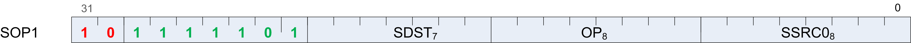
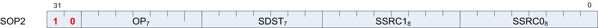
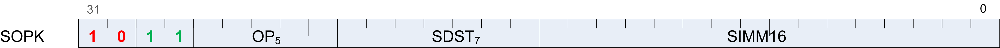
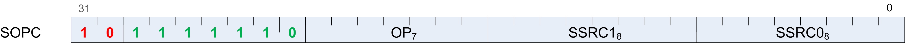

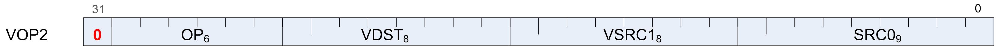
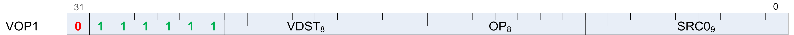

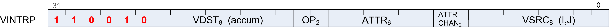
.. |microcode vop3a| image:: microcode/microcode_vop3a.png
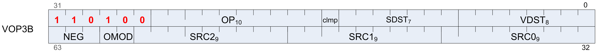
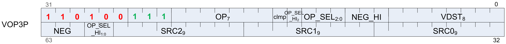
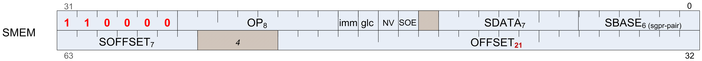
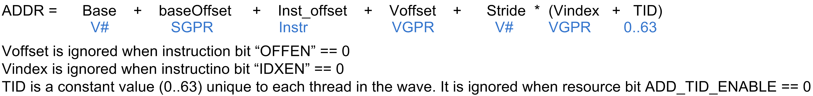
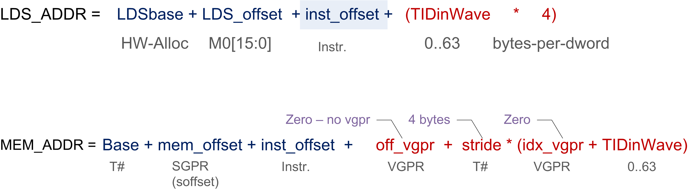
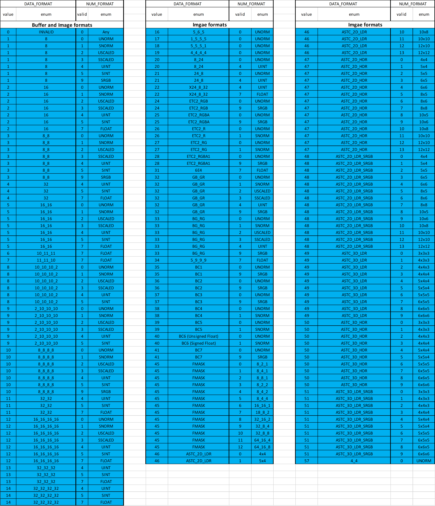
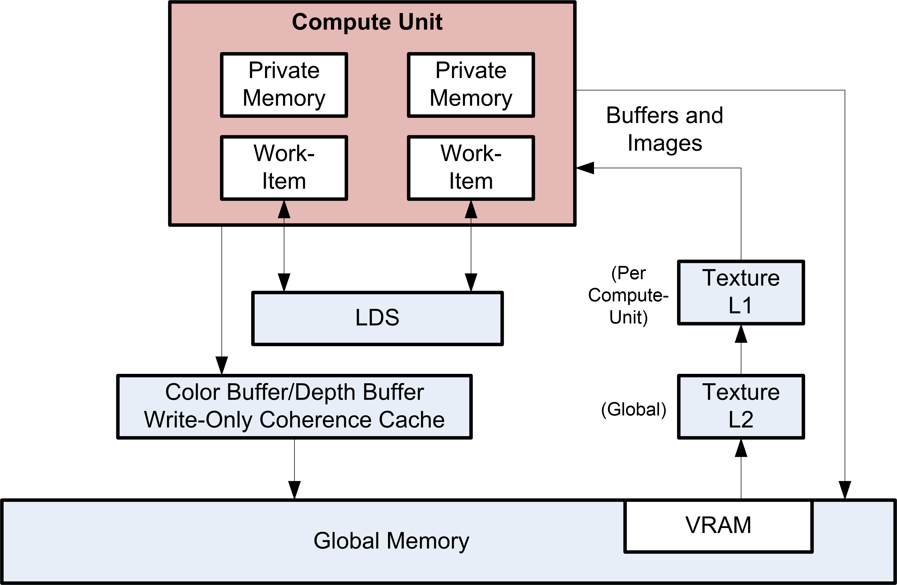
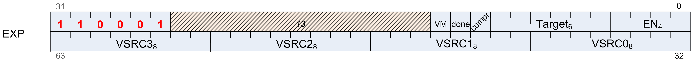
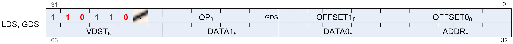
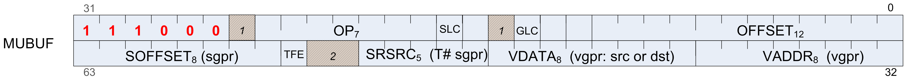
.. |microcode mtbuf| image:: images/microcode/microcode_mtbuf.png
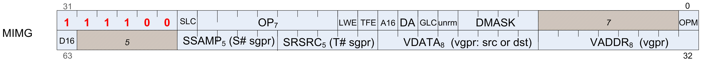
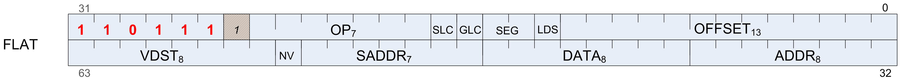
.. |microcode sdwa| image:: microcode/microcode_sdwa.png
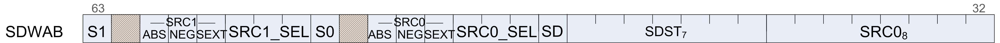
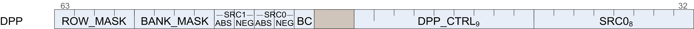
