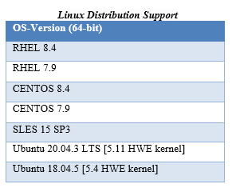

.. image:: /Installation_Guide/amdblack.jpg
|
==============================================
AMD ROCm Installation Guide v4.5
==============================================

.. contents::

Overview of ROCm Installation Methods
--------------------------------------

In addition to the installation method using the native Package Manager, AMD ROCm v4.5 introduces new methods to install ROCm. With this release, the ROCm installation uses the amdgpu-install and amdgpu-uninstall scripts.  

The amdgpu-install script streamlines the installation process by:

- Abstracting the distribution-specific package installation logic

- Performing the repository set-up

- Allowing a user to specify the use case and automating the installation of all the required packages

- Performing post-install checks to verify whether the installation was completed successfully 

- Installing the uninstallation script

The amdgpu-uninstall script allows the removal of the entire ROCm stack by using a single command.

Some of the ROCm-specific use cases that the installer currently supports are: 

- OpenCL (ROCr/KFD based) runtime

- HIP runtimes

- ROCm libraries and applications

- ROCm Compiler and device libraries

- ROCr runtime and thunk

For more information, refer to the Installation Methods section in this guide.

About This Document
====================

This document is intended for users familiar with the Linux environments and discusses the installation/uninstallation of ROCm programming models on the various flavors of Linux. 

This document also refers to Radeon™ Software for Linux® as AMDGPU stack, including the kernel-mode driver amdgpu-dkms.

The guide provides the installation instructions for the following:

- ROCm Installation

- Heterogeneous-Computing Interface for Portability (HIP) SDK

- OPENCL ™ SDK

- Kernel Mode Driver

System Requirements
======================

The system requirements for the ROCm v4.5 installation are as follows:

 
 
.. note::
 
      Installing ROCm on Linux will require superuser privileges. For systems that have enabled sudo packages, ensure you use the sudo prefix for all required commands.
 
 
 Prerequisite Actions
 ---------------------
 

 You must perform the following steps before installing ROCm programming models and check if the system meets all of the requirements to proceed with the installation.
 
- Confirm the system has a supported Linux distribution version

- Confirm the system has a ROCm-capable GPU

- Confirm the system has standard compilers and tools installed

Confirm You Have a Supported Linux Distribution Version
=========================================================

The ROCm installation is supported only on specific Linux distributions and their kernel versions. 

.. note::

      The ROCm installation is not supported on 32-bit operating systems.

How to Check Linux Distribution and Kernel Versions on Your System
*******************************************************************

Linux Distribution Information
^^^^^^^^^^^^^^^^^^^^^^^^^^^^^^^

Ensure you obtain the distribution information of the system by using the following command on your system from the Command Line Interface (CLI),

:: 

               $ uname -m && cat /etc/*release
            
            
 For example, running the command above on an Ubuntu system results in the following output: 
 
 ::
 
            x86_64
            DISTRIB_ID=Ubuntu
            DISTRIB_RELEASE=18.04
            DISTRIB_CODENAME=bionic
            DISTRIB_DESCRIPTION="Ubuntu 18.04.5 LTS"
         

Kernel Information
^^^^^^^^^^^^^^^^^^^

Type the following command to check the kernel version of your Linux system.

::
            $ uname -srmv

The output of the command above lists the kernel version in the following format: 

::
            Linux 5.4.0-77-generic #86~18.04.5-Ubuntu SMP Fri Jun 18 01:23:22 UTC 2021 x86_64

OS and Kernel Version Match
^^^^^^^^^^^^^^^^^^^^^^^^^^^^^

Confirm that the obtained Linux distribution and kernel versions match with System Requirements.

Confirm You Have a ROCm-Capable GPU
=====================================

The ROCm platform is designed to support the following list of GPUs: 

 .. image:: Images/ROCmProgMod.png
   :alt: Screenshot 
   
   
How to Verify Your System Has a ROCm-Capable GPU

**************************************************

To verify that your system has a ROCm-capable GPU, enter the following command from the Command Line Interface (CLI):

::

               $ lshw -class display
               The command displays the details of detected GPUs on the system in the following format:
               *-display
               description: VGA compatible controller
               product: Vega 20
               vendor: Advanced Micro Devices, Inc. [AMD/ATI]
               physical id: 0
               bus info: pci@0000:43:00.
               version: c1
               width: 64 bits
                      clock: 33MHz
                      capabilities: vga_controller bus_master cap_list rom
                      configuration: driver=amdgpu latency=0
                      resources: irq:66 memory:80000000-8fffffff memory:90000000-901fffff ioport:2000(size=256) memory:9f600000-9f67ffff memory:c0000-dffff
                      
                      

.. note::

      Verify from the output that the product field value matches the supported GPU Architecture in the table above.
      
      
Confirm the System Has Compiler and Tools Installed
======================================================

You must install and configure Devtoolset-7 to use RHEL/CentOS 7.9

How to Install and Configure Devtoolset-7
*******************************************

Refer to the RHEL/CentOS Environment section for more information on the steps necessary for installing and setting up Devtoolset-7. 

Meta-packages in ROCm Programming Models 
------------------------------------------

This section provides information about the required meta-packages for the following AMD ROCm™ programming models:

- Heterogeneous-Computing Interface for Portability (HIP) 

- OpenCL™

ROCm Package Naming Conventions
================================

A meta-package is a grouping of related packages and dependencies used to support a specific use-case, for example, running HIP applications. All meta-packages exist in both versioned and non-versioned forms.

- Non-versioned packages – For a single installation of the latest version of ROCm

- Versioned packages – For multiple installations of ROCm

 .. image:: Images/PackName.png
   :alt: Screenshot 

The image above demonstrates the single and multi-version ROCm packages' naming structure, including examples for various Linux distributions.

Components of ROCm Programming Models
========================================

The following image demonstrates the high-level layered architecture of ROCm programming models and their meta-packages. All meta-packages are a combination of required packages and libraries. For example, 

- rocm-hip-runtime is used to deploy on supported machines to execute HIP applications. 

- rocm-hip-sdk contains runtime components to deploy and execute HIP applications and tools to develop the applications. 

