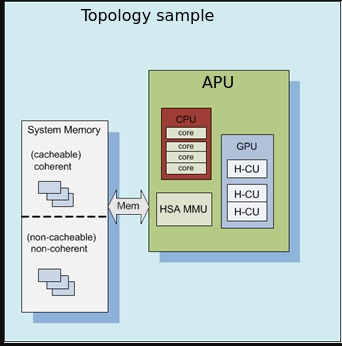

.. _ROCm-System-Management:

*******************************
System Management Interface  
*******************************

A System Management Interface (SMI) event interface is added to the kernel and a ROCm SMI library for system administrators to get notified when specific events occur. On the kernel side, AMDKFD_IOC_SMI_EVENTS input/output control is enhanced to allow notifications propagation to user mode through the event channel. 

On the ROCm SMI lib side, APIs are added to set an event mask and receive event notifications with a timeout option. Further, ROCm SMI API details can be found in the PDF generated by Doxygen from source or by referring to the rocm_smi.h header file (see the rsmi_event_notification_* functions).

For more information, download the latest System Management Interface API guide at:

https://github.com/RadeonOpenCompute/ROCm

ROCm SMI library
------------------

ROCm System Management Interface (ROCm SMI) Library
----------------------------------------------------

The ROCm System Management Interface Library, or ROCm SMI library, is part of the Radeon Open Compute `ROCm <https://github.com/RadeonOpenCompute>`_ software stack . It is a C library for Linux that provides a user space interface for applications to monitor and control GPU applications.

Important note about Versioning and Backward Compatibility
===========================================================

The ROCm SMI library is currently under development, and therefore subject to change either at the ABI or API level. The intention is to keep the API as stable as possible even while in development, but in some cases we may need to break backwards compatibility in order to ensure future stability and usability. Following `Semantic Versioning <https://semver.org/>`_ rules, while the ROCm SMI library is in high state of change, the major version will remain 0, and backward compatibility is not ensured.

Once new development has leveled off, the major version will become greater than 0, and backward compatibility will be enforced between major versions.

Building ROCm SMI
------------------

Additional Required software for building
==========================================

In order to build the ROCm SMI library, the following components are required. Note that the software versions listed are what was used in development. Earlier versions are not guaranteed to work:

    * CMake (v3.5.0)
    * g++ (5.4.0)

In order to build the latest documentation, the following are required:

    * Doxygen (1.8.11)
    * latex (pdfTeX 3.14159265-2.6-1.40.16)

The source code for ROCm SMI is available on `Github <https://github.com/RadeonOpenCompute/rocm_smi_lib>`_.

After the the ROCm SMI library git repository has been cloned to a local Linux machine, building the library is achieved by following the typical CMake build sequence. Specifically,

::

  $ mk -p build
  $ cd build
  $ cmake <location of root of ROCm SMI library CMakeLists.txt>
  $ make
  # Install library file and header; default location is /opt/rocm
  $ make install

The built library will appear in the build folder.

Building Documentation
========================

The documentation PDF file can be built with the following steps (continued from the steps above):

::

  $ make doc
  $ cd latex
  $ make

The reference manual, refman.pdf will be in the latex directory upon a successful build.

Building Tests
===================

In order to verify the build and capability of ROCm SMI on your system and to see an example of how ROCm SMI can be used, you may build and run the tests that are available in the repo. To build the tests, follow these steps:

::

  # Set environment variables used in CMakeLists.txt file
  $ ROCM_DIR=<location of ROCm SMI library>
  $ mkdir <location for test build>
  $ cd <location for test build>
  $ cmake -DROCM_DIR=<location of ROCM SMI library .so> <ROCm SMI source root>/tests/rocm_smi_test
  $ make

To run the test, execute the program rsmitst that is built from the steps above. 

Usage Basics
--------------

Device Indices
================

Many of the functions in the library take a "device index". The device index is a number greater than or equal to 0, and less than the number of devices detected, as determined by rsmi_num_monitor_devices(). The index is used to distinguish the detected devices from one another. It is important to note that a device may end up with a different index after a reboot, so an index should not be relied upon to be constant over reboots.

Hello ROCm SMI
================

The only required ROCm-SMI call for any program that wants to use ROCm-SMI is the rsmi_init() call. This call initializes some internal data structures that will be used by subsequent ROCm-SMI calls.

When ROCm-SMI is no longer being used, rsmi_shut_down() should be called. This provides a way to do any releasing of resources that ROCm-SMI may have held. In many cases, this may have no effect, but may be necessary in future versions of the library.

A simple "Hello World" type program that displays the device ID of detected devices would look like this:

::

  #include <stdint.h>
  #include "rocm_smi/rocm_smi.h"
  int main() {
  rsmi_status_t ret; 
  uint32_t num_devices; 
  uint64_t dev_id; 
 
  // We will skip return code checks for this example, but it 
  // is recommended to always check this as some calls may not
  // apply for some devices or ROCm releases
 
  ret = rsmi_init(0);
  ret = rsmi_num_monitor_devices(&num_devices);
 
  for (int i=0; i < num_devices; ++i) {
    ret = rsmi_dev_id_get(i, &dev_id);
    // dev_id holds the device ID of device i, upon a
    // successful call  
  }  
  ret = rsmi_shut_down();
  return 0;
  } 

SYSFS Interface
----------------

Naming and data format standards for sysfs files
=================================================

The libsensors library offers an interface to the raw sensors data through the sysfs interface. Since lm-sensors 3.0.0, libsensors is completely chip-independent. It assumes that all the kernel drivers implement the standard sysfs interface described in this document. This makes adding or updating support for any given chip very easy, as libsensors, and applications using it, do not need to be modified. This is a major improvement compared to lm-sensors 2.

Note that motherboards vary widely in the connections to sensor chips. There is no standard that ensures, for example, that the second temperature sensor is connected to the CPU, or that the second fan is on the CPU. Also, some values reported by the chips need some computation before they make full sense. For example, most chips can only measure voltages between 0 and +4V. Other voltages are scaled back into that range using external resistors. Since the values of these resistors can change from motherboard to motherboard, the conversions cannot be hard coded into the driver and have to be done in user space.

For this reason, even if we aim at a chip-independent libsensors, it will still require a configuration file (e.g. /etc/sensors.conf) for proper values conversion, labeling of inputs and hiding of unused inputs.

An alternative method that some programs use is to access the sysfs files directly. This document briefly describes the standards that the drivers follow, so that an application program can scan for entries and access this data in a simple and consistent way. That said, such programs will have to implement conversion, labeling and hiding of inputs. For this reason, it is still not recommended to bypass the library.

Each chip gets its own directory in the sysfs /sys/devices tree. To find all sensor chips, it is easier to follow the device symlinks from /sys/class/hwmon/hwmon*.

Up to lm-sensors 3.0.0, libsensors looks for hardware monitoring attributes in the "physical" device directory. Since lm-sensors 3.0.1, attributes found in the hwmon "class" device directory are also supported. Complex drivers (e.g. drivers for multifunction chips) may want to use this possibility to avoid namespace pollution. The only drawback will be that older versions of libsensors won't support the driver in question.

All sysfs values are fixed point numbers.

There is only one value per file, unlike the older /proc specification. The common scheme for files naming is: <type><number>_<item>. Usual types for sensor chips are "in" (voltage), "temp" (temperature) and "fan" (fan). Usual items are "input" (measured value), "max" (high threshold, "min" (low threshold). Numbering usually starts from 1, except for voltages which start from 0 (because most data sheets use this). A number is always used for elements that can be present more than once, even if there is a single element of the given type on the specific chip. Other files do not refer to a specific element, so they have a simple name, and no number.

Alarms are direct indications read from the chips. The drivers do NOT make comparisons of readings to thresholds. This allows violations between readings to be caught and alarmed. The exact definition of an alarm (for example, whether a threshold must be met or must be exceeded to cause an alarm) is chip-dependent.

When setting values of hwmon sysfs attributes, the string representation of the desired value must be written, note that strings which are not a number are interpreted as 0! For more on how written strings are interpreted see the "sysfs attribute writes interpretation" section at the end of this file.

======== ==============================================
  [0-*]	  denotes any positive number starting from 0
  [1-*]	  denotes any positive number starting from 1
  RO	  read only value
  WO	  write only value
  RW	  read/write value
======== ==============================================

Read/write values may be read-only for some chips, depending on the hardware implementation.

All entries (except name) are optional, and should only be created in a given driver if the chip has the feature.

Global Attributes
--------------------
 
================ ============================================================================================
name		  | The chip name.This should be a short, lowercase string, not containing whitespace,
		  | dashes, or the wildcard character '*'.This attribute represents the chip name. 
		  | It is the only mandatory attribute.I2C devices get this attribute created automatically.
		  | RO

update_interval	  | The interval at which the chip will update readings.
		  | Unit: millisecond
		  | RW
		  | Some devices have a variable update rate or interval.
		  | This attribute can be used to change it to the desired value.
================ ============================================================================================

 
Voltages 
----------

====================== ===============================================================================================
in[0-*]_min	        |  Voltage min value.
		        |  Unit: millivolt
		        |  RW
		
in[0-*]_lcrit	        |  Voltage critical min value.
		        |  Unit: millivolt
		        |  RW
		        |  If voltage drops to or below this limit, the system may take drastic action such as power
		        |  down or reset. At the very least, it should report a fault.
 
in[0-*]_max	        | Voltage max value.
		        | Unit: millivolt
		        | RW
		
in[0-*]_crit	        | Voltage critical max value.
		        | Unit: millivolt
			| RW
			| If voltage reaches or exceeds this limit, the system may take drastic action such as power 
			| down or reset. At the very least, it should report a fault.

in[0-*]_input		| Voltage input value.
			| Unit: millivolt
			| RO
			| Voltage measured on the chip pin.Actual voltage depends on the scaling resistors on the
			| motherboard, as recommended in the chip datasheet.This varies by chip and by motherboard.
			| Because of this variation, values are generally NOT scaled by the chip driver, and must be 
			| done by the application.However, some drivers (notably lm87 and via686a) do scale, because 
			| of internal resistors built into a chip.These drivers will output the actual voltage. Rule of
			| thumb: drivers should report the voltage values at the "pins" of the chip.

in[0-*]_average  	| Average voltage
			| Unit: millivolt
			| RO

in[0-*]_lowest   	| Historical minimum voltage
			| Unit: millivolt
			| RO

in[0-*]_highest  	| Historical maximum voltage
			| Unit: millivolt
			| RO

in[0-*]_reset_history 	| Reset inX_lowest and inX_highest
			| WO

in_reset_history 	| Reset inX_lowest and inX_highest for all sensors
			| WO

in[0-*]_label		| Suggested voltage channel label.
			| Text string Should only be created if the driver has hints about what this voltage channel
			| is being used for, and user-space doesn't. In all other cases, the label is provided by
			| user-space.
			| RO

in[0-*]_enable          | Enable or disable the sensors.
                        | When disabled the sensor read will return -ENODATA.
                        | 1: Enable
                        | 0: Disable
                        | RW

cpu[0-*]_vid		| CPU core reference voltage.
			| Unit: millivolt
			| RO
			| Not always correct.

vrm			| Voltage Regulator Module version number. 
			| RW (but changing it should no more be necessary)
			| Originally the VRM standard version multiplied by 10, but now an arbitrary number, as not
			| all standards have a version number.Affects the way the driver calculates the CPU core 
			| reference voltage from the vid pins.
====================== ===============================================================================================

Also see the Alarms section for status flags associated with voltages.

Fans 
---------

=============== =============================================================================================
fan[1-*]_min	 | Fan minimum value
		 | Unit: revolution/min (RPM)
		 | RW

fan[1-*]_max	 | Fan maximum value
		 | Unit: revolution/min (RPM)
		 | Only rarely supported by the hardware.
		 | RW

fan[1-*]_input	 | Fan input value.
		 | Unit: revolution/min (RPM)
		 | RO

fan[1-*]_div	 | Fan divisor.
		 | Integer value in powers of two (1, 2, 4, 8, 16, 32, 64, 128).
		 | RW
		 | Some chips only support values 1, 2, 4 and 8.
		 | Note that this is actually an internal clock divisor, which
		 | affects the measurable speed range, not the read value.

fan[1-*]_pulses	 | Number of tachometer pulses per fan revolution.
		 | Integer value, typically between 1 and 4.
		 | RW
		 | This value is a characteristic of the fan connected to the device's input, 
 		 | so it has to be set in accordance with the fan model.Should only be created 
		 | if the chip has a register to configure the number of pulses. In the absence 
		 | of such a register (and thus attribute) the value assumed by all devices is 2 pulses
		 | per fan revolution.

fan[1-*]_target  | Desired fan speed
		 | Unit: revolution/min (RPM)
		 | RW
		 | Only makes sense if the chip supports closed-loop fan speed
		 | control based on the measured fan speed.

fan[1-*]_label	 | Suggested fan channel label.
		 | Text string
		 | Should only be created if the driver has hints about what this fan channel is being 
		 | used for, and user-space doesn't.In all other cases, the label is provided by user-space.
		 | RO

fan[1-*]_enable  | Enable or disable the sensors
                 | When diabled the sensor read will return -ENODATA
                 | 1: Enable
                 | 0: Disable
                 | RW
=============== =============================================================================================

Also see the Alarms section for status flags associated with fans.

Pulse with Modulation
------------------------------

+--------------------------------------+-----------------------------------------------------------------------------------------+
| pwm[1-*]	 		       | | Pulse width modulation fan control.							 |
|				       | | Integer value in the range 0 to 255							 |
|				       | | RW											 | 
|			               | | 255 is max or 100%.									 |
+--------------------------------------+-----------------------------------------------------------------------------------------+
| pwm[1-*]_enable  	   	       | | Fan speed control method:								 |
|				       | | 0: no fan speed control (i.e. fan at full speed)					 |
|				       | | 1: manual fan speed control enabled (using pwm[1-*])					 |
|				       | | 2+: automatic fan speed control enabled						 |
|				       | | Check individual chip documentation files for automatic mode details.		 |
|				       | | RW											 |
+--------------------------------------+-----------------------------------------------------------------------------------------+
| pwm[1-*]_mode		   	       | | 0: DC mode (direct current)								 |
|				       | | 1: PWM mode (pulse-width modulation)							 |
|				       | | RW											 |
+--------------------------------------+-----------------------------------------------------------------------------------------+
| pwm[1-*]_freq			       | | Base PWM frequency in Hz.								 |
|				       | | Only possibly available when pwmN_mode is PWM, but not always present even then.	 |
|				       | | RW											 |
+--------------------------------------+-----------------------------------------------------------------------------------------+
| pwm[1-*]_auto_channels_temp          | | Select which temperature channels affect this PWM output in auto mode. Bitfield, 	 |
|				       | | 1 is temp1, 2 is temp2, 4 is temp3 etc...						 |
|				       | | Which values are possible depend on the chip used.					 |
|				       | | RW											 |
+--------------------------------------+-----------------------------------------------------------------------------------------+
| | pwm[1-*]_auto_point[1-*]_pwm       | | Define the PWM vs temperature curve. Number of trip points is chip-dependent.Use this |
| | pwm[1-*]_auto_point[1-*]_temp      | | for chips which associate trip points to PWM output channels.			 |
| | pwm[1-*]_auto_point[1-*]_temp_hyst | | RW											 |
+--------------------------------------+-----------------------------------------------------------------------------------------+
| | temp[1-*]_auto_point[1-*]_pwm      | | Define the PWM vs temperature curve. Number of trip points is chip dependent.	 |
| | temp[1-*]_auto_point[1-*]_temp     | | Use this for chips which associate trip points to temperature channels.		 |
| | temp[1-*]_auto_point[1-*]_temp_hyst| | RW											 |
+--------------------------------------+-----------------------------------------------------------------------------------------+

There is a third case where trip points are associated to both PWM output channels and temperature channels: the PWM values are associated to PWM output channels while the temperature values are associated to temperature channels. In that case, the result is determined by the mapping between temperature inputs and PWM outputs. When several temperature inputs are mapped to a given PWM output, this leads to several candidate PWM values.The actual result is up to the chip, but in general the highest candidate
value (fastest fan speed) wins.

Temperatures 
---------------

========================= ==========================================================================================
temp[1-*]_type		  | Sensor type selection.
			  | Integers 1 to 6
			  | RW
			  | 1: CPU embedded diode
			  | 2: 3904 transistor
			  | 3: thermal diode
			  | 4: thermistor
			  | 5: AMD AMDSI
			  | 6: Intel PECI
			  | Not all types are supported by all chips

temp[1-*]_max		  | Temperature max value.
			  | Unit: millidegree Celsius (or millivolt, see below)
			  | RW

temp[1-*]_min		  | Temperature min value.
			  | Unit: millidegree Celsius
			  | RW

temp[1-*]_max_hyst 	  | Temperature hysteresis value for max limit.
			  | Unit: millidegree Celsius
			  | Must be reported as an absolute temperature, NOT a delta from the max value.
			  | RW

temp[1-*]_min_hyst 	  | Temperature hysteresis value for min limit.
			  | Unit: millidegree Celsius
			  | Must be reported as an absolute temperature, NOT a delta from the min value.
			  | RW

temp[1-*]_input 	  | Temperature input value.
			  | Unit: millidegree Celsius
			  | RO

temp[1-*]_crit		  | Temperature critical max value, typically greater than
			  | corresponding temp_max values.
			  | Unit: millidegree Celsius
			  | RW

temp[1-*]_crit_hyst 	  | Temperature hysteresis value for critical limit.
			  | Unit: millidegree Celsius
			  | Must be reported as an absolute temperature, NOT a delta from the critical value.
			  | RW

temp[1-*]_emergency       | Temperature emergency max value, for chips supporting more than two upper 
			  | temperature limits. Must be equal or greater than corresponding temp_crit values.
			  | Unit: millidegree Celsius
			  | RW

temp[1-*]_emergency_hyst  | Temperature hysteresis value for emergency limit.
			  | Unit: millidegree Celsius
			  | Must be reported as an absolute temperature, NOT a delta from the emergency value.
			  | RW

temp[1-*]_lcrit		  | Temperature critical min value, typically lower than corresponding temp_min values.
			  | Unit: millidegree Celsius
			  | RW

temp[1-*]_lcrit_hyst      | Temperature hysteresis value for critical min limit.
			  | Unit: millidegree Celsius
			  | Must be reported as an absolute temperature, NOT a delta from the critical min value.
			  | RW

temp[1-*]_offset          | Temperature offset which is added to the temperature reading by the chip.
			  | Unit: millidegree Celsius
			  | Read/Write value.

temp[1-*]_label		  | Suggested temperature channel label.
			  | Text string Should only be created if the driver has hints about what this temperature 
			  | channel is being used for, and user-space doesn't. In all other cases, the label is 
			  | provided by user-space.
			  | RO

temp[1-*]_lowest    	  | Historical minimum temperature
			  | Unit: millidegree Celsius
			  | RO

temp[1-*]_highest   	  | Historical maximum temperature
			  | Unit: millidegree Celsius
			  | RO

temp[1-*]_reset_history   | Reset temp_lowest and temp_highest
		 	  | WO

temp_reset_history        | Reset temp_lowest and temp_highest for all sensors
			  | WO

temp[1-*]_enable          | Enable or diable the sensors
                          | When diabled the sensor read will return -ENODATA
                          | 1: Enable
                          | 0: Disable
                          | RW
========================= ==========================================================================================

Some chips measure temperature using external thermistors and an ADC, and report the temperature measurement as a voltage. Converting this voltage back to a temperature (or the other way around for limits) requires mathematical functions not available in the kernel, so the conversion must occur in user space. For these chips, all temp* files described above should contain values expressed in millivolt instead of millidegree Celsius. In other words, such temperature channels are handled as voltage channels by the driver.

Also see the Alarms section for status flags associated with temperatures.

Currents 
----------

======================= ========================================================
curr[1-*]_max		 |  Current max value
			 |  Unit: milliampere
			 |  RW

curr[1-*]_min		 |  Current min value.
			 |  Unit: milliampere
			 |  RW

curr[1-*]_lcrit	 	 |  Current critical low value
			 |  Unit: milliampere
			 |   RW

curr[1-*]_crit		 |  Current critical high value.
			 |  Unit: milliampere
			 |  RW

curr[1-*]_input		 |  Current input value
			 |  Unit: milliampere
			 |  RO

curr[1-*]_average  	 |  Average current use
			 |  Unit: milliampere
			 |  RO

curr[1-*]_lowest 	 |  Historical minimum current
			 |  Unit: milliampere
			 |  RO

curr[1-*]_highest  	 |  Historical maximum current
			 |  Unit: milliampere
			 |  RO

curr[1-*]_reset_history  |  Reset currX_lowest and currX_highest
			 |  WO

curr_reset_history 	 |  Reset currX_lowest and currX_highest for all sensors
			 |  WO

curr[1-*]_enable         | Enable or disable the sensors
                         | When diabled the sensor read will return -ENODATA
                         | 1: Enable
                         | 0: Disable
                         | RW
======================= ========================================================

Also see the Alarms section for status flags associated with currents.

Power
--------

================================ ===============================================================================
power[1-*]_average		 | Average power use
				 | Unit: microWatt
				 | RO

power[1-*]_average_interval	 | Power use averaging interval.  A poll notification is sent to this 
 				 | file if the hardware changes the averaging interval.
				 | Unit: milliseconds
				 | RW

power[1-*]_average_interval_max	 | Maximum power use averaging interval
				 | Unit: milliseconds
				 | RO

power[1-*]_average_interval_min	 | Minimum power use averaging interval
				 | Unit: milliseconds
				 | RO

power[1-*]_average_highest	 | Historical average maximum power use
				 | Unit: microWatt
				 | RO

power[1-*]_average_lowest	 | Historical average minimum power use
				 | Unit: microWatt
				 | RO

power[1-*]_average_max		 | A poll notification is sent to power[1-*]_average when power use
				 | rises above this value.
				 | Unit: microWatt
				 | RW

power[1-*]_average_min		 | A poll notification is sent to power[1-*]_average when power use
				 | sinks below this value.
				 | Unit: microWatt
				 | RW

power[1-*]_input		 | Instantaneous power use
				 | Unit: microWatt
				 | RO

power[1-*]_input_highest	 | Historical maximum power use
				 | Unit: microWatt
				 | RO

power[1-*]_input_lowest		 | Historical minimum power use
				 | Unit: microWatt
				 | RO

power[1-*]_reset_history	 | Reset input_highest, input_lowest,
				 | average_highest and average_lowest.
				 | WO

power[1-*]_accuracy		 | Accuracy of the power meter.
				 | Unit: Percent
				 | RO

power[1-*]_cap			 | If power use rises above this limit, the system should take action to 
				 | reduce power use.A poll notification is sent to this file if the cap is 
				 | changed by the hardware.The *_cap files only appear if the cap is known
				 | to be enforced by hardware.
				 | Unit: microWatt
				 |  RW

power[1-*]_cap_hyst		 | Margin of hysteresis built around capping and notification.
				 | Unit: microWatt
				 | RW

power[1-*]_cap_max		 | Maximum cap that can be set.
				 | Unit: microWatt
				 | RO

power[1-*]_cap_min		 | Minimum cap that can be set.
				 | Unit: microWatt
				 | RO

power[1-*]_max			 | Maximum power.
				 | Unit: microWatt
				 | RW

power[1-*]_crit			 | Critical maximum power.
				 | If power rises to or above this limit, the system is expected take drastic
				 | action to reduce power consumption, such as a system shutdown or
				 | a forced powerdown of some devices.
				 | Unit: microWatt
				 | RW

power[1-*]_enable                | Enable or disable the sensors.
                                 | When diabled the sensor read will return -ENODATA
                                 | 1: Enable
                                 | 0: Disable
                                 | RW
================================ ===============================================================================

Also see the Alarms section for status flags associated with power readings.

Energy 
----------

==================== ========================
energy[1-*]_input    |  Cumulative energy use
		     |  Unit: microJoule
		     |  RO

energy[1-*]_enable   | Enable or disable the sensors
                     | When diabled the sensor read will return -ENODATA
                     | 1: Enable
                     | 0: Disable
                     | RW
==================== ========================

Humidity
-----------

==================== ===========================================
humidity[1-*]_input  | Humidity
		     | Unit: milli-percent (per cent mille, pcm)
		     | RO

humidity[1-*]_enable | Enable or disable the sensors
                     | When diabled the sensor read will return -ENODATA
                     | 1: Enable
                     | 0: Disable
                     | RW
==================== ===========================================

Alarms
--------

Each channel or limit may have an associated alarm file, containing a
boolean value. 1 means than an alarm condition exists, 0 means no alarm.

Usually a given chip will either use channel-related alarms, or
limit-related alarms, not both. The driver should just reflect the hardware
implementation.

+---------------------+------------------+
| | in[0-*]_alarm     | | Channel alarm  | 
| | curr[1-*]_alarm   | | 0: no alarm    |
| | power[1-*]_alarm  | | 1: alarm       |
| | fan[1-*]_alarm    | | RO 	         |
| | temp[1-*]_alarm   | 		 |	
+---------------------+------------------+
		
OR

+----------------------------+---------------+
| | in[0-*]_min_alarm        | | Limit alarm |
| | in[0-*]_max_alarm        | | 0: no alarm |
| | in[0-*]_lcrit_alarm      | | 1: alarm    |
| | in[0-*]_crit_alarm	     | | RO          |
| | curr[1-*]_min_alarm	     |               |
| | curr[1-*]_max_alarm      |               |
| | curr[1-*]_lcrit_alarm    |               |
| | curr[1-*]_crit_alarm     |               |
| | power[1-*]_cap_alarm     |               |
| | power[1-*]_max_alarm     |               |
| | power[1-*]_crit_alarm    |               |
| | fan[1-*]_min_alarm	     |               |
| | fan[1-*]_max_alarm       |               |
| | temp[1-*]_min_alarm	     |               |
| | temp[1-*]_max_alarm	     |               |
| | temp[1-*]_lcrit_alarm    |               |
| | temp[1-*]_crit_alarm     |               |
| | temp[1-*]_emergency_alarm|               |
+----------------------------+---------------+
		
Each input channel may have an associated fault file. This can be used
to notify open diodes, unconnected fans etc. where the hardware
supports it. When this boolean has value 1, the measurement for that
channel should not be trusted.

+-------------------+-------------------------+
| | fan[1-*]_fault  | | Input fault condition |
| | temp[1-*]_fault | | 0: no fault occurred  |
|		    | | 1: fault condition    |
|		    | | RO		      |	
+-------------------+-------------------------+
		
Some chips also offer the possibility to get beeped when an alarm occurs:

+-----------------+----------------------+
| beep_enable     | | Master beep enable |
|	          | | 0: no beeps        |	
|	          | | 1: beeps	         |	
|	          | | RW		 |	
+-----------------+----------------------+
| | in[0-*]_beep  | | Channel beep	 |	
| | curr[1-*]_beep| | 0: disable	 |
| | fan[1-*]_beep | | 1: enable 	 |
| | temp[1-*]_beep| | RW 		 |
+-----------------+----------------------+		
		
In theory, a chip could provide per-limit beep masking, but no such chip
was seen so far.

Old drivers provided a different, non-standard interface to alarms and
beeps. These interface files are deprecated, but will be kept around
for compatibility reasons:

============= ===========================================================
alarms	       | Alarm bitmask.
	       | RO
	       | Integer representation of one to four bytes.
	       | A '1' bit means an alarm.
	       | Chips should be programmed for 'comparator' mode so that
	       | the alarm will 'come back' after you read the register
	       | if it is still valid.
	       | Generally a direct representation of a chip's internal
	       | alarm registers; there is no standard for the position
	       | of individual bits. For this reason, the use of this
	       | interface file for new drivers is discouraged. Use
	       | individual *_alarm and *_fault files instead.
	       | Bits are defined in kernel/include/sensors.h.

beep_mask      | Bitmask for beep.
	       | Same format as 'alarms' with the same bit locations,
	       | use discouraged for the same reason. Use individual
	       | *_beep files instead.
	       | RW
============= ===========================================================

Intrusion detection 
-----------------------

======================= ===========================================================
intrusion[0-*]_alarm
			| Chassis intrusion detection
			| 0: OK
			| 1: intrusion detected
			| RW
			| Contrary to regular alarm flags which clear themselves
			| automatically when read, this one sticks until cleared by
			| the user. This is done by writing 0 to the file. Writing
			| other values is unsupported.

intrusion[0-*]_beep
			| Chassis intrusion beep
			| 0: disable
			| 1: enable
			| RW
======================= ===========================================================

Average Sample Configuration
------------------------------

Devices allowing for reading {in,power,curr,temp}_average values may export attributes for controlling number of samples used to compute average.

======================= ==================================================================

samples			| Sets number of average samples for all types of measurements.
                        | RW

in_samples              | Sets number of average samples for specific type of measurements.
power_samples           | Note that on some devices it won't be possible to set all of 
curr_samples            | them to different values so changing one might also change 
curr_samples            | some others.
                        | RW
======================= ==================================================================

sysfs attribute writes interpretation
-------------------------------------

hwmon sysfs attributes always contain numbers, so the first thing to do is to convert the input to a number, there are 2 ways todo this depending whether the number can be negative or not:
unsigned long u = simple_strtoul(buf, NULL, 10); long s = simple_strtol(buf, NULL, 10);

With *buf* being the buffer with the user input being passed by the kernel. Notice that we do not use the second argument of strto[u]l, and thus cannot tell when 0 is returned, if this was really 0 or is caused by invalid input. This is done deliberately as checking this everywhere would add a lot of code to the kernel.

Notice that it is important to always store the converted value in an unsigned long or long, so that no wrap around can happen before any further checking.

After the input string is converted to an (unsigned) long, the value should be checked if its acceptable. Be careful with further conversions on the value before checking it for validity, as these conversions could still cause a wrap around before the check. For example do not multiply the result, and only
add/subtract if it has been divided before the add/subtract.

What to do if a value is found to be invalid, depends on the type of the sysfs attribute that is being set. If it is a continuous setting like a tempX_max or inX_max attribute, then the value should be clamped to its limits using clamp_val(value, min_limit, max_limit). If it is not continuous like for example a tempX_type, then when an invalid value is written, -EINVAL should be returned.

Example1, temp1_max, register is a signed 8 bit value (-128 - 127 degrees):

::

	long v = simple_strtol(buf, NULL, 10) / 1000;
	v = clamp_val(v, -128, 127);
	/* write v to register */

Example2, fan divider setting, valid values 2, 4 and 8:

::

	unsigned long v = simple_strtoul(buf, NULL, 10);

	switch (v) {
	case 2: v = 1; break;
	case 4: v = 2; break;
	case 8: v = 3; break;
	default:
		return -EINVAL;
	}
	/* write v to register */

Performance 
--------------

The pcie_bw sysfs file will report the usage of the PCIe bus over the last second, as a string with 3 integers: "bytes-received bytes-sent mps" . As there is no efficient way to calculate the size of each packet transmitted to and from the GPU in real time, the maximum payload size (mps), or the largest size of a PCIe packet, is included. The estimated bandwidth can then be calculated using by "bytes-received*mps + bytes-sent*mps" sed and multiplied by the number of packets received and sent.  

KFD Topology
---------------

Application software needs to understand the properties of the underlying hardware to leverage the performance capabilities of the platform for feature utilization and task scheduling. The sysfs topology exposes this information in a loosely hierarchal order. The information is populated by the KFD driver is gathered from ACPI (CRAT) and AMDGPU base driver.

| The sysfs topology is arranged hierarchically as following. The root directory of the topology is 
| **/sys/devices/virtual/kfd/kfd/topology/nodes/**

Based on the platform inside this directory there will be sub-directories corresponding to each HSA Agent. A system with N HSA Agents will have N directories as shown below.

| /sys/devices/virtual/kfd/kfd/topology/nodes/0/
| /sys/devices/virtual/kfd/kfd/topology/nodes/1/
| .
| .
| /sys/devices/virtual/kfd/kfd/topology/nodes/N-1/

HSA Agent Information
-----------------------
The HSA Agent directory and the sub-directories inside that contains all the information about that agent. The following are the main information available.

Node Information
------------------
This is available in the root directory of the HSA agent. This provides information about the compute capabilities of the agent which includes number of cores or compute units, SIMD count and clock speed.

Memory
--------
The memory bank information attached to this agent is populated in “mem_banks” subdirectory.
/sys/devices/virtual/kfd/kfd/topology/nodes/N/mem_banks

Cache
------
The caches available for this agent is populated in “cache” subdirectory
/sys/devices/virtual/kfd/kfd/topology/nodes/N/cache

IO-LINKS
---------
The IO links provides HSA agent interconnect information with latency (cost) between agents. This is useful for peer-to-peer transfers.

How to use topology information
------------------------------------
The information provided in sysfs should not be directly used by application software. Application software should always use Thunk library API (libhsakmt) to access topology information. Please refer to Thunk API for more information.

The data are associated with a node ID, forming a per-node element list which references the elements contained at relative offsets within that list. A node associates with a kernel agent or agent. Node ID’s should be 0-based, with the “0” ID representing the primary elements of the system (e.g., “boot cores”, memory) if applicable. The enumeration order and—if applicable—values of the ID should match other information reported through mechanisms outside of the scope of the requirements;

For example, the data and enumeration order contained in the ACPI SRAT table on some systems should match the memory order and properties reported through HSA. Further detail is out of the scope of the System Architecture and outlined in the Runtime API specification.

Each of these nodes is interconnected with other nodes in more advanced systems to the level necessary to adequately describe the topology.

.. image:: More_advanced_topology.png

Where applicable, the node grouping of physical memory follows NUMA principles to leverage memory locality in software when multiple physical memory blocks are available in the system and agents have a different “access cost” (e.g., bandwidth/latency) to that memory.

**KFD Topology structure for AMDGPU :**

| :ref:`sysfsclasskfd`
| :ref:`sysfsclasskfdtopology`
| :ref:`sysfsclasskfdtopologynodes0`
| :ref:`sysfsclasskfdtopologynodes0iolinks01`
| :ref:`sysfsclasskfdtopologynodes0membanks0`
| sysfs-class-kfd-topology-nodes-N-caches

 [--setsclk LEVEL [LEVEL ...]] [--setmclk LEVEL [LEVEL ...]] [--setpcie LEVEL [LEVEL ...]]                 [--setslevel
		

SMI Event Interface and Library
------------------------------------

An SMI event interface is added to the kernel and ROCm SMI  lib for system administrators to get notified when specific events occur. On the kernel side, AMDKFD_IOC_SMI_EVENTS input/output control is added to allow notifications propagation to user mode through the event channel. 

On the ROCm SMI lib side, APIs are added to set an event mask and receive event notifications with a timeout option. Further, ROCm SMI API details can be found in the PDF generated by Doxygen from source or by referring to the rocm_smi.h header file (see the rsmi_event_notification_* functions).

ROCR_VISIBLE_DEVICES
-----------------------

It is possible to rearrange or isolate the collection of ROCm GPU/GCD devices that are available on a ROCm platform. This can be achieved at the start of an application by way of ROCR_VISIBLE_DEVICES environment variable.

To make devices visible to an application, they must be specified as a comma-separated list of enumerable devices, where devices are identified by their enumeration index or UUID.

For example, consider a ROCm platform with the following devices:

======== ==================== ==========================
Device     Enumeration Index         UUID
======== ==================== ==========================
Device 1      0                 GPU-365628c172834d70
Device 2      1                 GPU-368988c172123d70
Device 3      2                 GPU-367458c172345d70
Device 4      4                 GPU-363688c172386d70
======== ==================== ==========================

To use devices 0 and 2 from the above-mentioned ROCm platform and to enumerate them in that order, one can employ ROCR_VISIBLE_DEVICES in the following ways:

    * ROCR_VISIBLE_DEVICES=0,2
    
    * ROCR_VISIBLE_DEVICES=0,GPU-367458c172345d70
    
    * ROCR_VISIBLE_DEVICES=GPU-365628c172834d70,2
    
    * ROCR_VISIBLE_DEVICES=GPU-365628c172834d70,GPU-363688c172386d70

Cooperative applications can use this to effectively allocate GPU/GCDs among themselves.

Interaction between ROCR_VISIBLE_DEVICES and CUDA_VISIBLE_DEVICES
===================================================================

The ROCR_VISIBLE_DEVICES (RVD) environment is defined by ROCm stack to operate at the ROCr level. The ROCr implementation surfaces all GPU devices when users have not explicitly defined the environment. If defined, ROCr surfaces only those GPU devices that fulfil user requests.

CUDA_VISIBLE_DEVICES (CVD) controls the subset of GPU devcies that are available to an application. It builds on GPU devices surfaced by ROCr. The CVD value is legal only if it is a subset of the GPU device indices surfaced by ROCr.

This is best illustrated by the following example:

1. Consider a system that has 8 devices - 0, 1, 2, 3, 4, 5, 6, 7
2. User specifies RVD to select 4 devices - 4, 5, 6, 7
3. These four devices will be available to application as 0, 1, 2, 3

Note the indices of GPU devices as they become available to an application. Users can specify CVD to select a subset of these 4 devices. For example, they can specify CVD as 1,2 or 1,3 or 0,3 or 3,2 etc

Setting both RVD and CVD is typically unnecessary and may be harmful. Use of both environments can play a role when using multiple GPUs and mixing high level languages within a single process. For example,  if a single Linux process uses both HIP and OpenCL and wants to use two GPUs such that HIP uses one GPU and OpenCL uses the other, then RVD will select the two GPUs that are assigned to the process, and CVD will select a single GPU (index 0 or 1), from those allowed by RVD, for use by HIP.  OpenCL has its own variable enabling it to use the other GPU as allowed by RVD. 

Usually, users will not need per language controls either because the process only runs one language or the languages need to cooperate within the same device and will be best served by RVD alone. 

It is therefore recommended that ROCm applications use RVD.

Device cgroup
----------------

At a system administration level, the GPU/GCD isolation is possible using the device control group (cgroup). For all the AMD GPUs in a compute node, the ROCk-Kernel-Driver exposes a single compute device file /dev/kfd and a separate (Direct Rendering Infrastructure) render device files /dev/dri/renderDN for each device. To participate in the Linux kernel’s cgroup infrastructure, the ROCk driver relies on the render device files.

For example, consider a compute node with the two AMD GPUs. The ROCk-Kernel-Driver exposes the following device files:

crw-rw-rw- 1 root root 240, 0 Apr 22 10:31 /dev/kfd

crw-rw---- 1 root video 226, 128 Apr 22 10:31 /dev/dri/renderD128

crw-rw---- 1 root video 226, 129 Apr 22 10:31 /dev/dri/renderD129

A ROCm application running on this compute node can use both GPUs only if it has access to all the above-listed device files. The administrator can restrict the devices an application can access by using device cgroup. The device cgroup subsystem allows or denies access to devices by applications in a cgroup. If a cgroup has whitelisted only /dev/kfd and /dev/dri/renderD129, then applications in that cgroup will have access only to that single GPU.

Refer to the Linux kernel's cgroup documentation for information on how to create a cgroup and whitelist devices. 

For cgroup-v1, refer https://www.kernel.org/doc/Documentation/cgroup-v1/devices.txt 

For cgroup-v2, refer https://www.kernel.org/doc/Documentation/cgroup-v2.txt

