.. _Optimization-Opencl:

========================
OPENCL Optimization
========================

.. Note:: Re-Write in Progress to move this to Vega and FIJI/Polaris optimization guide 

Chapter 1 OpenCL Performance and Optimization
==============================================

This chapter discusses performance and optimization when programming for AMD heterogeneous compute GPU compute devices, as well as CPUs and multiple devices. Details specific to the GCN family (Southern Islands, Sea Islands, and Volcanic Islands series) of GPUs are at the end of the chapter.

1.1 AMD CodeXL
--------------
AMD's CodeXL is an OpenCL kernel debugging and memory and performance analysis tool that gathers data from the OpenCL run-time and OpenCL devices during the execution of an OpenCL application. This information is used to discover bottlenecks in the application and find ways to optimize the application's performance for AMD platforms.

CodeXL 1.7, the latest version as of this writing, is available as an extension to Microsoft® Visual Studio®, a stand-alone version for Windows, and a stand-alone version for Linux.

For a high-level summary of CodeXL features, see Chapter 4 in the AMD OpenCL User Guide. For information about how to use CodeXL to gather performance data about your OpenCL application, such as application traces and timeline views, see the `CodeXL home page <https://gpuopen.com/compute-product/codexl/?webSyncID=aa83689b-1c51-8139-08ba-c72c235854a7&sessionGUID=ab8d35ae-1db8-2ec6-4d4a-290691c91072>`_.

The Timeline View can be useful for debugging your OpenCL application. Examples are given below.

* The Timeline View lets you easily confirm that the high-level structure of your application is correct by verifying that the number of queues and contexts created match your expectations for the application.
* You can confirm that synchronization has been performed properly in the application. For example, if kernel A execution is dependent on a buffer operation and outputs from kernel B execution, then kernel A execution must appear after the completion of the buffer execution and kernel B execution in the time grid. It can be hard to find this type of synchronization error using traditional debugging techniques.
* You can confirm that the application has been using the hardware efficiently.

For example, the timeline should show that non-dependent kernel executions and data transfer operations occurred simultaneously.

CodeXL also provides information about GPU kernel performance counters. This information can be used to find possible bottlenecks in the kernel execution. You can find the list of performance counters supported by AMD Radeon™ GPUs in the CodeXL documentation. Once the trace data has been used to discover which kernel is most in need of optimization, you can collect the GPU performance counters to drill down into the kernel execution on a GPU device.

The Analyze Mode in CodeXL provides the Statistics View, which can be used to gather useful statistics regarding the GPU usage of kernels.

1.2 Estimating Performance
---------------------------

1.2.1 Measuring Execution Time
++++++++++++++++++++++++++++++

The OpenCL runtime provides a built-in mechanism for timing the execution of kernels by setting the CL_QUEUE_PROFILING_ENABLE flag when the queue is created. Once profiling is enabled, the OpenCL runtime automatically records timestamp information for every kernel and memory operation submitted to the queue.

OpenCL provides four timestamps:

- **CL_PROFILING_COMMAND_QUEUED** - Indicates when the command is enqueued into a command-queue on the host. This is set by the OpenCL runtime when the user calls an clEnqueue* function.
- **CL_PROFILING_COMMAND_SUBMIT** - Indicates when the command is submitted to the device. For AMD GPU devices, this time is only approximately defined and is not detailed in this section.
- **CL_PROFILING_COMMAND_START** - Indicates when the command starts execution on the requested device.
- **CL_PROFILING_COMMAND_END** - Indicates when the command finishes execution on the requested device.

The sample code below shows how to compute the kernel execution time (End- Start)::

 cl_event myEvent;
 cl_ulong startTime, endTime;

 clCreateCommandQueue (..., CL_QUEUE_PROFILING_ENABLE, NULL);
 clEnqueueNDRangeKernel(..., &myEvent);
 ``clFinish`` (myCommandQ); // wait for all events to finish

 clGetEventProfilingInfo(myEvent, CL_PROFILING_COMMAND_START, sizeof(cl_ulong), &startTime, NULL);
 clGetEventProfilingInfo(myEvent,	CL_PROFILING_COMMAND_END, sizeof(cl_ulong), &endTimeNs, NULL);
 cl_ulong kernelExecTimeNs = endTime-startTime;

The CodeXL GPU Profiler also can record the execution time for a kernel automatically. The Kernel Time metric reported in the Profiler output uses the built-in OpenCL timing capability and reports the same result as the
``kernelExecTimeNs`` calculation shown above.

Another interesting metric to track is the kernel launch time (Start - Queue). The kernel launch time includes both the time spent in the user application (after enqueuing the command, but before it is submitted to the device), as well as the time spent in the runtime to launch the kernel. For CPU devices, the kernel launch time is fast (tens of 1's), but for discrete GPU devices it can be several hundred μs. Enabling profiling on a command queue adds approximately 10 μs to 40 μs overhead to all clEnqueue calls. Much of the profiling overhead affects the start time; thus, it is visible in the launch time. Be careful when interpreting this metric. To reduce the launch overhead, the AMD OpenCL runtime combines several command submissions into a batch. Commands submitted as batch report similar start times and the same end time.

Measure performance of your test with CPU counters. Do not use OCL profiling. To determine if an application is executed asynchonically, build a dependent execution with OCL events. This is a "generic" solution; however, there is an exception when you can enable profiling and have overlap transfers. DRMDMA engines do not support timestamps ("GPU counters"). To get OCL profiling data, the runtime must synchronize the main command processor (CP) with the DMA engine; this disables overlap. Note, however, that Southern Islands has two independent main CPs and runtime pairs them with DMA engines. So, the application can still execute kernels on one CP, while another is synced with a DRM engine for profiling; this lets you profile it with APP or OCL profiling.

1.2.2 Using the OpenCL timer with Other System Timers
++++++++++++++++++++++++++++++++++++++++++++++++++++++
The resolution of the timer, given in ns, can be obtained from::
 
 clGetDeviceInfo(...,CL_DEVICE_PROFILING_TIMER_RESOLUTION...);

AMD CPUs and GPUs report a timer resolution of 1 ns. AMD OpenCL devices are required to correctly track time across changes in frequency and power states. Also, the AMD APP SDK uses the same time-domain for all devices in the platform; thus, the profiling timestamps can be directly compared across the CPU and GPU devices.

The sample code below can be used to read the current value of the OpenCL timer clock. The clock is the same routine used by the AMD OpenCL runtime to generate the profiling timestamps. This function is useful for correlating other program events with the OpenCL profiling timestamps.
::
 
 uint64_t timeNanos()
 {
 #ifdef linux
  struct timespec tp;
  clock_gettime(CLOCK_MONOTONIC, &tp);
  return (unsigned long long) tp.tv_sec * (1000ULL * 1000ULL * 1000ULL) +(unsigned long long) tp.tv_nsec;

 #else
   LARGE_INTEGER current; QueryPerformanceCounter(&current);
   return (unsigned long long)((double)current.QuadPart / m_ticksPerSec * 1e9);
 #endif
 }

Normal CPU time-of-day routines can provide a rough measure of the elapsed time of a GPU kernel. GPU kernel execution is non-blocking, that is, calls to ``enqueue*Kernel`` return to the CPU before the work on the GPU is finished. For an accurate time value, ensure that the GPU is finished. In OpenCL, you can force the CPU to wait for the GPU to become idle by inserting calls to ``clFinish()`` before and after the sequence you want to time; this increases the timing accuracy of the CPU routines. The routine ``clFinish()`` blocks the CPU until all previously enqueued OpenCL commands have finished.

For more information, see section 5.9, "Profiling Operations on Memory Objects and Kernels,"of the OpenCL 1.0 Specification.

1.2.3 Estimating Memory Bandwidth
++++++++++++++++++++++++++++++++++
The memory bandwidth required by a kernel is perhaps the most important performance consideration. To calculate this:
 
 Effective Bandwidth = (Br + Bw)/T

where:

 Br = total number of bytes read from global memory. Bw = total number of bytes written to global memory.
 T = time required to run kernel, specified in nanoseconds.

If Br and Bw are specified in bytes, and T in ns, the resulting effective bandwidth is measured in GB/s, which is appropriate for current CPUs and GPUs for which the peak bandwidth range is 20-260 GB/s. Computing Br and Bw requires a
thorough understanding of the kernel algorithm; it also can be a highly effective
way to optimize performance. For illustration purposes, consider a simple matrix addition: each element in the two source arrays is read once, added together, then stored to a third array. The effective bandwidth for a 1024x1024 matrix addition is calculated as:

Br = 2 x (1024 x 1024 x 4 bytes) = 8388608 bytes  ;; 2 arrays, 1024x1024, each element 4-byte float

Bw = 1 x (1024 x 1024 x 4 bytes) = 4194304 bytes ;; 1 array, 1024x1024, each element 4-byte float.

If the elapsed time for this copy as reported by the profiling timers is 1000000 ns
(1 million ns, or .001 sec), the effective bandwidth is: (Br+Bw)/T = (8388608+4194304)/1000000 = 12.6GB/s
 
The CodeXL GPU Profiler can report the number of dynamic instructions per thread that access global memory through the FetchInsts and WriteInsts counters. The Fetch and Write reports average the per-thread counts; these can be fractions if the threads diverge. The Profiler also reports the dimensions of the global NDRange for the kernel in the GlobalWorkSize field. The total number of threads can be determined by multiplying together the three components of the range. If all (or most) global accesses are the same size, the counts from the Profiler and the approximate size can be used to estimate Br and Bw:

Br = Fetch * GlobalWorkitems * Size

Bw = Write * GlobalWorkitems * Element Size where GlobalWorkitems is the dispatch size.
An example Profiler output and bandwidth calculation:

+-------------------+----------------+--------+-------+-------+
| Method            | GlobalWorkSize | Time   | Fetch | Write |
+===================+================+========+=======+=======+
| runKernel_Cypress | {192; 144; 1}  | 0.9522 | 70.8  | 0.5   |
+-------------------+----------------+--------+-------+-------+

WaveFrontSize = 192*144*1 = 27648 global work items.

In this example, assume we know that all accesses in the kernel are four bytes;
then, the bandwidth can be calculated as: Br = 70.8 * 27648 * 4 = 7829914 bytes Bw = 0.5 * 27648 * 4 = 55296 bytes
The bandwidth then can be calculated as:

(Br + Bw)/T = (7829914 bytes + 55296 bytes) / .9522 ms / 1000000
            = 8.2 GB/s

.. Note:: The performance model assumes zero cache utilization. If the kernel is reading the same data over and over again, it will be cached in the GPU L1/L2 memory and will not affect global memory bandwidth.

1.3 OpenCL Memory Objects
-------------------------
This section explains the AMD OpenCL runtime policy for memory objects. It also recommends best practices for best performance.

OpenCL uses memory objects to pass data to kernels. These can be either buffers or images. Space for these is managed by the runtime, which uses several types of memory, each with different performance characteristics. Each type of memory is suitable for a different usage pattern. The following subsections describe:

* the memory types used by the runtime;

* how to control which memory kind is used for a memory object;

* how the runtime maps memory objects for host access;
 
* how the runtime performs memory object reading, writing and copying;

* how best to use command queues; and

* some recommended usage patterns.

1.3.1 Types of Memory Used by the Runtime
+++++++++++++++++++++++++++++++++++++++++

Memory is used to store memory objects that are accessed by kernels executing on the device, as well as to hold memory object data when they are mapped for access by the host application. This section describes the different memory kinds used by the runtime. Table 1.1 lists the performance of each memory type given
a PCIe3-capable platform and a high-end AMD Radeon™ 7XXX discrete GPU. In Table 1.1, when host memory is accessed by the GPU shader, it is of type ``CL_MEM_ALLOC_HOST_PTR``. When GPU memory is accessed by the CPU, it is of type ``CL_MEM_PERSISTENT_MEM_AMD``.

**Table 1.1 Memory Bandwidth in GB/s (R = read, W = write) in GB/s**

**Table 2:**
	
+-------------+---------+---------+--------------+--------------+-----------+-------------+
|             | CPU R   | GPU W   | GPU Shader R | GPU Shader W | GPU DMA R | GPU DMA W   |
+=============+=========+=========+==============+==============+===========+=============+
| Host Memory | 10 - 20 | 10 - 20 | 9 - 10       | 2.5          | 11 - 12   | 11 - 12     |
+-------------+---------+---------+--------------+--------------+-----------+-------------+
| GPU Memory  | .01     | 9 - 10  | 230          | 120 -150     | n/a       | n/a         |
+-------------+---------+---------+--------------+--------------+-----------+-------------+

Host memory and device memory in the above table consists of one of the subtypes given below.

1.3.1.1 Unpinned Host Memory
############################
This regular CPU memory can be accessed by the CPU at full memory bandwidth; however, it is not directly accessible by the GPU. For the GPU to transfer host memory to device memory (for example, as a parameter to ``clEnqueueReadBuffer`` or ``clEnqueueWriteBuffer``), it first must be pinned (see section 1.3.1.2). Pinning takes time, so avoid incurring pinning costs where CPU overhead must be avoided.

When unpinned host memory is copied to device memory, the OpenCL runtime uses the following transfer methods.

 * <=32 kB: For transfers from the host to device, the data is copied by the CPU to a runtime pinned host memory buffer, and the DMA engine transfers the data to device memory. The opposite is done for transfers from the device to the host.
 * >32 kB and <=16 MB: The host memory physical pages containing the data are pinned, the GPU DMA engine is used, and the pages then are unpinned.
 * >16 MB: Runtime pins host memory in stages of 16 MB blocks and transfers data to the device using the GPU DMA engine. Double buffering for pinning is used to overlap the pinning cost of each 16 MB block with the DMA transfer.

Due to the cost of copying to staging buffers, or pinning/unpinning host memory, host memory does not offer the best transfer performance.

1.3.1.2 Pinned Host Memory
###########################
This is host memory that the operating system has bound to a fixed physical address and that the operating system ensures is resident. The CPU can access pinned host memory at full memory bandwidth. The runtime limits the total amount of pinned host memory that can be used for memory objects. (See Section 1.3.2, "Placement" , for information about pinning memory.

If the runtime knows the data is in pinned host memory, it can be transferred to, and from, device memory without requiring staging buffers or having to perform pinning/unpinning on each transfer. This offers improved transfer performance.

Currently, the runtime recognizes only data that is in pinned host memory for operation arguments that are memory objects it has allocated in pinned host memory. For example, the buffer argument of ``clEnqueueReadBuffer/clEnqueueWriteBuffer`` and ``image`` argument of ``clEnqueueReadImage/clEnqueueWriteImage.`` It does not detect that the ptr arguments of these operations addresses pinned host memory, even if they are the result of ``clEnqueueMapBuffer/clEnqueueMapImage`` on a memory object that is in pinned host memory.

The runtime can make pinned host memory directly accessible from the GPU. Like regular host memory, the CPU uses caching when accessing pinned host memory. For discrete devices, the GPU access to this memory is through the PCIe bus, which also limits bandwidth. For APU devices that do not have the PCIe overhead, GPU access is significantly slower than accessing device-visible host memory (see section 1.3.1.3), which does not use the cache coherency protocol. 

1.3.1.3 Device-Visible Host Memory
###################################

The runtime allocates a limited amount of pinned host memory that is accessible by the GPU without using the CPU cache coherency protocol. This allows the GPU to access the memory at a higher bandwidth than regular pinned host memory.

A portion of this memory is also configured to be accessible by the CPU as uncached memory. Thus, reads by the CPU are significantly slower than those from regular host memory. However, these pages are also configured to use the memory system write combining buffers. A user allocated buffer is internally partitioned by the chip-set to write combine regions. The size and alignment of these regions are chip-set dependent. Typically, the regions are 64 bytes in size, each aligned to start on a 64-byte memory address.

These allow writes to adjacent memory locations to be combined into a single memory access. This allows CPU streaming writes to perform reasonably well. Scattered writes that do not fill the write combining buffers before they have to be flushed do not perform as well.

APU devices have no device memory and use device-visible host memory for their global device memory.

1.3.1.4 Device Memory
######################
Discrete GPU devices have their own dedicated memory, which provides the highest bandwidth for GPU access. The CPU cannot directly access device memory on a discrete GPU (except for the host-visible device memory portion described in section 1.3.1.5).

On an APU, the system memory is shared between the GPU and the CPU; it is visible by either the CPU or the GPU at any given time. A significant benefit of this is that buffers can be zero copied between the devices by using map/unmap operations to logically move the buffer between the CPU and the GPU address space. (Note that in the system BIOS at boot time, it is possible to allocate the size of the frame buffer. This section of memory is divided into two parts, one of which is invisible to the CPU. Thus, not all system memory supports zero copy. See Table 1.1, specifically the Default row.) See Section 1.3.4, "Mapping", for more information on zero copy.

1.3.1.5 Host-Visible Device Memory
##################################
A limited portion of discrete GPU device memory is configured to be directly accessible by the CPU. It can be accessed by the GPU at full bandwidth, but CPU access is over the PCIe bus; thus, it is much slower than host memory bandwidth. The memory is mapped into the CPU address space as uncached, but using the memory system write combining buffers. This results in slow CPU reads and scattered writes, but streaming CPU writes perform much better because they reduce PCIe overhead.

1.3.2 Placement
++++++++++++++++
Every OpenCL memory object has a location that is defined by the flags passed to clCreateBuffer/clCreateImage. A memory object can be located either on a device, or it can be located on the host and accessed directly by all the devices. The Location column of Table 1.1 gives the memory type used for each of the allocation flag values for different kinds of devices. When a device kernel is executed, it accesses the contents of memory objects from this location. The performance of these accesses is determined by the kind of memory used.

An OpenCL context can have multiple devices, and a memory object that is located on a device has a location on each device. To avoid over-allocating device memory for memory objects that are never used on that device, space is not allocated until first used on a device-by-device basis. For this reason, the first use of a memory object after it is created can be slower than subsequent uses.

**Table 1.1 OpenCL Memory Object Properties**

**Table 2:**

+--------------------------------------------------+-------------+--------------------------------------------------------------------------------------------------------+------------+---------------------------------------------------------------------------------------------------------------+
| clCreateBuffer/                                  | Device Type | Location                                                                                               | clEnqueueMapBuffer/                                                                                                        |
| clCreateImage FlagsArgument                      |             |                                                                                                        | clEnqueueMapImage/                                                                                                         |
|                                                  |             |                                                                                                        | clEnqueueUnmapMemObject                                                                                                    |
+                                                  +             +                                                                                                        +------------+---------------------------------------------------------------------------------------------------------------+
|                                                  |             |                                                                                                        | MapMode    | Map Location                                                                                                  |
+==================================================+=============+========================================================================================================+============+===============================================================================================================+
| Default(none of the following flags)             | DiscreteGPU | Device memory                                                                                          | Copy       | Host memory(different memoryarea can be used oneach map)                                                      |
+                                                  +-------------+--------------------------------------------------------------------------------------------------------+            +                                                                                                               +
|                                                  | APU         | Device-visible hostmemory                                                                              |            |                                                                                                               |
+                                                  +-------------+--------------------------------------------------------------------------------------------------------+------------+                                                                                                               +
|                                                  | CPU         | Use Map Locationdirectly                                                                               | Zero copy  |                                                                                                               |
+--------------------------------------------------+-------------+--------------------------------------------------------------------------------------------------------+------------+---------------------------------------------------------------------------------------------------------------+
| CL_MEM_ALLOC_HOST_PTR,                           | DiscreteGPU | Pinned hostmemory shared byall devices incontext (unlessonly device incontext is CPU;then, hostmemory) | Zero copy  | Use Location directly(same memory areais used on eachmap).                                                    |
+ CL_MEM_USE_HOST_PTR                              +-------------+                                                                                                        +            +                                                                                                               +
| (clCreateBuffer when VM isenabled)               | APU         |                                                                                                        |            |                                                                                                               |
+                                                  +-------------+                                                                                                        +            +                                                                                                               +
|                                                  | CPU         |                                                                                                        |            |                                                                                                               |
+--------------------------------------------------+-------------+--------------------------------------------------------------------------------------------------------+------------+---------------------------------------------------------------------------------------------------------------+
| CL_MEM_ALLOC_HOST_PTR,                           | DiscreteGPU | Device memory                                                                                          | copy       | Pinned host memory,unless only device incontext is CPU; then,host memory (samememory area is usedon each map) |
+ CL_MEM_USE_HOST_PTR                              +-------------+--------------------------------------------------------------------------------------------------------+            +                                                                                                               +
| (for clCreateImage andclCreateBuffer without VM) | APU         | Device-visiblememory                                                                                   |            |                                                                                                               |
+                                                  +-------------+--------------------------------------------------------------------------------------------------------+------------+                                                                                                               +
|                                                  | CPU         |                                                                                                        | Zerocopy   |                                                                                                               |
+--------------------------------------------------+-------------+--------------------------------------------------------------------------------------------------------+------------+---------------------------------------------------------------------------------------------------------------+
| CL_MEM_USE_PERSISTENT_MEM_AMD                    | DiscreteGPU | Host-visible devicememory                                                                              | Zerocopy   | Use Location directly(different memoryarea can be used oneach map).                                           |
+ (when VM is enabled)                             +-------------+--------------------------------------------------------------------------------------------------------+            +                                                                                                               +
|                                                  | APU         | Host-visible devicememory                                                                              |            |                                                                                                               |
+                                                  +-------------+--------------------------------------------------------------------------------------------------------+            +                                                                                                               +
|                                                  | CPU         | Host memory                                                                                            |            |                                                                                                               |
+--------------------------------------------------+-------------+--------------------------------------------------------------------------------------------------------+------------+---------------------------------------------------------------------------------------------------------------+
| CL_MEM_USE_PERSISTENT_MEM_AMD                    | Same as default.                                                                                                                                                                                                                                  |
| (when VM is not enabled)                         |                                                                                                                                                                                                                                                   |
+--------------------------------------------------+---------------------------------------------------------------------------------------------------------------------------------------------------------------------------------------------------------------------------------------------------+

1.3.3 Memory Allocation
++++++++++++++++++++++++

1.3.3.1 Using the CPU
#######################

Create memory objects with ``CL_MEM_ALLOC_HOST_PTR``, and use ``map/unmap;`` do not use ``read/write``. The reason for this is that if the object is created with ``CL_MEM_USE_HOST_PTR`` the CPU is running the kernel on the buffer provided by the application (a hack that all vendors use). This results in zero copy between the CPU and the application buffer; the kernel updates the application buffer, and in this case a map/unmap is actually a no-op. Also, when allocating the buffer on the host, ensure that it is created with the correct alignment. For example, a buffer to be used as float4* must be 128-bit aligned.

1.3.3.2 Using Both CPU and GPU Devices, or using APU an Device
###############################################################
When creating memory objects, create them with ``CL_MEM_USE_PERSISTENT_MEM_AMD``. This enables the zero copy feature, as explained in Section 1.3.3.1, "Using the CPU".

1.3.3.3 Buffers vs Images
##########################
Unlike GPUs, CPUs do not contain dedicated hardware (samplers) for accessing images. Instead, image access is emulated in software. Thus, a developer may prefer using buffers instead of images if no sampling operation is needed.

1.3.3.4 Choosing Execution Dimensions
######################################
Note the following guidelines.

 * Make the number of work-groups a multiple of the number of logical CPU cores (device compute units) for maximum use.
 * When work-groups number exceed the number of CPU cores, the CPU cores execute the work-groups sequentially.

1.3.4 Mapping
++++++++++++++

The host application can use ``clEnqueueMapBuffer/clEnqueueMapImage`` to obtain a pointer that can be used to access the memory object data. When finished accessing, ``clEnqueueUnmapMemObject`` must be used to make the data available to device kernel access. When a memory object is located on a device, the data either can be transferred to, and from, the host, or be accessed directly from the host. Memory objects that are located on the host, or located on the device but accessed directly by the host, are termed zero copy memory objects. The data is never transferred, but is accessed directly by both the host and device. Memory objects that are located on the device and transferred to, and from, the device when mapped and unmapped are termed copy memory objects. The Map Mode column of Table 1.1 specifies the transfer mode used for each kind of memory object, and the Map Location column indicates the kind of memory referenced by the pointer returned by the map operations.

1.3.4.1 Zero Copy Memory Objects
#################################
``CL_MEM_USE_PERSISTENT_MEM_AMD``, ``CL_MEM_USE_HOST_PTR,`` and ``CL_MEM_ALLOC_HOST_PTR`` support zero copy memory objects. The first provides device-resident zero copy memory objects, the other two provide host-resident zero copy memory objects.
 
Zero copy memory objects can be used by an application to optimize data movement. When ``clEnqueueMapBuffer / clEnqueueMapImage / clEnqueueUnmapMemObject`` are used, no runtime transfers are performed, and the operations are very fast; however, the runtime can return a different pointer value each time a zero copy memory object is mapped. Note that only images created with ``CL_MEM_USE_PERSISTENT_MEM_AMD`` can be zero copy.

From Southern Island on, devices support zero copy memory objects under Linux; however, only images created with ``CL_MEM_USE_PERSISTENT_MEM_AMD`` can be zero copy.

Zero copy host resident memory objects can boost performance when host memory is accessed by the device in a sparse manner or when a large host memory buffer is shared between multiple devices and the copies are too expensive. When choosing this, the cost of the transfer must be greater than the extra cost of the slower accesses.

Streaming writes by the host to zero copy device resident memory objects are about as fast as the transfer rates, so this can be a good choice when the host does not read the memory object to avoid the host having to make a copy of the data to transfer. Memory objects requiring partial updates between kernel executions can also benefit. If the contents of the memory object must be read by the host, use ``clEnqueueCopyBuffer`` to transfer the data to a separate ``CL_MEM_ALLOC_HOST_PTR`` buffer.

1.3.4.2 Copy Memory Objects
############################
For memory objects with copy map mode, the memory object location is on the device, and it is transferred to, and from, the host when ``clEnqueueMapBuffer / clEnqueueMapImage / clEnqueueUnmapMemObject`` are called. Table 1.1 shows how the ``map_flags`` argument affects transfers. The runtime transfers only the portion of the memory object requested in the ``offset`` and ``cb`` arguments. When accessing only a portion of a memory object, only map that portion for improved performance.

**Table 1.1 Transfer policy on clEnqueueMapBuffer / clEnqueueMapImage / clEnqueueUnmapMemObject for Copy Memory Objects**

**Table 2:**

+----------------------------------------------------------+---------------------------------------------------+-------------------------------------+
| clEnqueueMapBuffer /clEnqueueMapImage map_flags argument | Transfer on clEnqueueMapBuffer /clEnqueueMapImage | Transfer on clEnqueueUnmapMemObject |
+==========================================================+===================================================+=====================================+
| CL_MAP_READ                                              | Device to host, if map location is not current.   | None.                               |
+----------------------------------------------------------+---------------------------------------------------+-------------------------------------+
| CL_MAP_WRITE                                             | Device to host, if map location is not current.   | Host to device.                     |
+----------------------------------------------------------+---------------------------------------------------+-------------------------------------+
| CL_MAP_READ CL_MAP_WRITE                                 | Device to host if map location is not current.    | Host to device.                     |
+----------------------------------------------------------+---------------------------------------------------+-------------------------------------+
| CL_MAP_WRITE_INVALIDATE_REGION                           | None.                                             | Host to device.                     |
+----------------------------------------------------------+---------------------------------------------------+-------------------------------------+

For default memory objects, the pointer returned by ``clEnqueueMapBuffer / clEnqueueMapImage`` may not be to the same memory area each time because different runtime buffers may be used.

For ``CL_MEM_USE_HOST_PTR`` and ``CL_MEM_ALLOC_HOST_PTR`` the same map location is used for all maps; thus, the pointer returned is always in the same memory area. For other copy memory objects, the pointer returned may not always be to the same memory region.

For ``CL_MEM_USE_HOST_PTR`` and the ``CL_MEM_ALLOC_HOST_PTR`` cases that use copy map mode, the runtime tracks if the map location contains an up-to-date copy of the memory object contents and avoids doing a transfer from the device when mapping as ``CL_MAP_READ``. This determination is based on whether an operation such as ``clEnqueueWriteBuffer/clEnqueueCopyBuffer`` or a kernel execution has modified the memory object. If a memory object is created with ``CL_MEM_READ_ONLY``, then a kernel execution with the memory object as an argument is not considered as modifying the memory object. Default memory objects cannot be tracked because the map location changes between map calls; thus, they are always transferred on the map.

For ``CL_MEM_USE_HOST_PTR, clCreateBuffer/clCreateImage`` pins the host memory passed to the ``host_ptr`` argument. It is unpinned when the memory object is deleted. To minimize pinning costs, align the memory to 4KiB. This avoids the runtime having to pin/unpin on every map/unmap transfer, but does add to the total amount of pinned memory.

For ``CL_MEM_USE_HOST_PTR``, the host memory passed as the ptr argument of ``clCreateBuffer/clCreateImage`` is used as the map location. As mentioned earlier, host memory transfers incur considerable cost in pinning/unpinning on every transfer. If used, ensure the memory aligned to the data type size used in the kernels. If host memory that is updated once is required, use ``CL_MEM_ALLOC_HOST_PTR`` with the ``CL_MEM_COPY_HOST_PTR`` flag instead. If device memory is needed, use ``CL_MEM_USE_PERSISTENT_MEM_AMD`` and ``clEnqueueWriteBuffer``.

If ``CL_MEM_COPY_HOST_PTR`` is specified with ``CL_MEM_ALLOC_HOST_PTR`` when creating a memory object, the memory is allocated in pinned host memory and initialized with the passed data. For other kinds of memory objects, the deferred allocation means the memory is not yet allocated on a device, so the runtime has to copy the data into a temporary runtime buffer. The memory is allocated on the device when the device first accesses the resource. At that time, any data that must be transferred to the resource is copied. For example, this would apply when a buffer was allocated with the flag ``CL_MEM_COPY_HOST_PTR``. Using ``CL_MEM_COPY_HOST_PTR`` for these buffers is not recommended because of the extra copy. Instead, create the buffer without ``CL_MEM_COPY_HOST_PTR``, and initialize with ``clEnqueueWriteBuffer/clEnqueueWriteImage``.

When images are transferred, additional costs are involved because the image must be converted to, and from, linear address mode for host access. The runtime does this by executing kernels on the device.

1.3.5 Reading, Writing, and Copying
+++++++++++++++++++++++++++++++++++++++
There are numerous OpenCL commands to read, write, and copy buffers and images. The runtime performs transfers depending on the memory kind of the source and destination. When transferring between host memory and device memory the methods described in section Section 1.3.1.1, "Unpinned Host Memory", are used. ``Memcpy`` is used to transferring between the various kinds of host memory, this may be slow if reading from device visible host memory, as described in section Section 1.3.1.3, "Device-Visible Host Memory". Finally, device kernels are used to copy between device memory. For images, device kernels are used to convert to and from the linear address mode when necessary.

1.3.6 Command Queue
++++++++++++++++++++
It is best to use non-blocking commands to allow multiple commands to be queued before the command queue is flushed to the GPU. This sends larger batches of commands, which amortizes the cost of preparing and submitting work to the GPU. Use event tracking to specify the dependence between operations. It is recommended to queue operations that do not depend of the results of previous copy and map operations. This can help keep the GPU busy with kernel execution and DMA transfers. Command execution begins as soon as there are commands in the queue for execution.

For Southern Islands and later, devices support at least two hardware compute queues. That allows an application to increase the throughput of small dispatches with two command queues for asynchronous submission and possibly concurrent execution.

An OpenCL queue is assigned to a hardware queue on creation time. The hardware compute queues are selected according to the creation order within an OpenCL context. If the hardware supports K concurrent hardware queues, the Nth created OpenCL queue within a specific OpenCL context will be assigned to the (N mod K) hardware queue. The number of compute queues can be limited by specifying the ``GPU_NUM_COMPUTE_RINGS`` environment variable.

Devices in the Sea Islands and Volcanic Islands families contain between four and eight ACEs, and are multi-threaded (thereby supporting more hardware queues), so they offer more performance. For example, the AMD Radeon™ R9290X devices, in the VI family contain 8 ACEs and 44 CUs.
 
1.3.6.1 A note on hardware queues
#################################
A hardware queue can be thought of as a GPU entry point. The GPU can process kernels from several compute queues concurrently. All hardware queues ultimately share the same compute cores. The use of multiple hardware queues is beneficial when launching small kernels that do not fully saturate the GPU. For example, the AMD Radeon™ HD 290X compute device can execute up to 112,640 threads concurrently. The GPU can execute two kernels each spawning 56320 threads (assuming fully occupancy) twice as fast if launched concurrently through two hardware queues than serially through a single hardware queue.

1.4 OpenCL Data Transfer Optimization
--------------------------------------
The AMD OpenCL implementation offers several optimized paths for data transfer to, and from, the device. The following chapters describe buffer and image paths, as well as how they map to common application scenarios. To find out where the application's buffers are stored (and understand how the data transfer behaves), use the CodeXL GPU Profiler API Trace View, and look at the tool tips of the ``clEnqueueMapBuffer`` calls.

1.4.1 Definitions
++++++++++++++++++

 * *Deferred allocation* - The CL runtime attempts to minimize resource consumption by delaying buffer allocation until first use. As a side effect, the first accesses to a buffer may be more expensive than subsequent accesses.
 * *Peak interconnect bandwidth* - As used in the text below, this is the transfer bandwidth between host and device that is available under optimal conditions at the application level. It is dependent on the type of interconnect, the chipset, and the graphics chip. As an example, a high-performance PC with a PCIe 3.0 16x bus and a GCN architecture (AMD Radeon™ HD 7XXX series) graphics card has a nominal interconnect bandwidth of 16 GB/s.
 * *Pinning* - When a range of host memory is prepared for transfer to the GPU, its pages are locked into system memory. This operation is called pinning; it can impose a high cost, proportional to the size of the memory range. One of the goals of optimizing data transfer is to use pre-pinned buffers whenever possible. However, if pre-pinned buffers are used excessively, it can reduce the available system memory and result in excessive swapping. Host side zero copy buffers provide easy access to pre- pinned memory.
 * *WC* - Write Combine is a feature of the CPU write path to a select region of the address space. Multiple adjacent writes are combined into cache lines (for example, 64 bytes) before being sent to the external bus. This path typically provides fast streamed writes, but slower scattered writes. Depending on the chip set, scattered writes across a graphics interconnect can be very slow. Also, some platforms require multi-core CPU writes to saturate the WC path over an interconnect.
 * *Uncached accesses* - Host memory and I/O regions can be configured as uncached. CPU read accesses are typically very slow; for example: uncached CPU reads of graphics memory over an interconnect.
 * *USWC* - Host memory from the Uncached Speculative Write Combine heap can be accessed by the GPU without causing CPU cache coherency traffic. Due to the uncached WC access path, CPU streamed writes are fast, while CPU reads are very slow. On APU devices, this memory provides the fastest possible route for CPU writes followed by GPU reads.

1.4.2 Buffers
++++++++++++++
OpenCL buffers currently offer the widest variety of specialized buffer types and optimized paths, as well as slightly higher transfer performance.

1.4.2.1 Regular Device Buffers
###############################
Buffers allocated using the flags ``CL_MEM_READ_ONLY, CL_MEM_WRITE_ONLY``, or ``CL_MEM_READ_WRITE`` are placed on the GPU device. These buffers can be accessed by a GPU kernel at very high bandwidths. For example, on a high-end graphics card, the OpenCL kernel read/write performance is significantly higher than 100 GB/s. When device buffers are accessed by the host through any of the OpenCL read/write/copy and map/unmap API calls, the result is an explicit transfer across the hardware interconnect.

1.4.2.2 Zero Copy Buffers
##########################
If a buffer is of the zero copy type, the runtime tries to leave its content in place, unless the application explicitly triggers a transfer (for example, through ``clEnqueueCopyBuffer()``). Depending on its type, a zero copy buffer resides on the host or the device. Independent of its location, it can be accessed directly by the host CPU or a GPU device kernel, at a bandwidth determined by the capabilities of the hardware interconnect.

Calling clEnqueueMapBuffer() and clEnqueueUnmapMemObject() on a zero copy buffer is typically a low-cost operation.

Since not all possible read and write paths perform equally, check the application scenarios below for recommended usage. To assess performance on a given platform, use the BufferBandwidth sample.

If a given platform supports the zero copy feature, the following buffer types are available:

 * The CL_MEM_ALLOC_HOST_PTR and CL_MEM_USE_HOST_PTR buffers are:

	* zero copy buffers that resides on the host.
	
	* directly accessible by the host at host memory bandwidth.

	* directly accessible by the device across the interconnect.

	* a pre-pinned sources or destinations for CL read, write, and copy commands into device memory at peak interconnect bandwidth.
 

Note that buffers created with the flag CL_MEM_ALLOC_HOST_PTR together with CL_MEM_READ_ONLY may reside in uncached write-combined memory. As a result, CPU can have high streamed write bandwidth, but low read and potentially low write scatter bandwidth, due to the uncached WC path.
 
 * The CL_MEM_USE_PERSISTENT_MEM_AMD buffer is

	* a zero copy buffer that resides on the GPU device.

	* directly accessible by the GPU device at GPU memory bandwidth.

	* directly accessible by the host across the interconnect (typically with high streamed write bandwidth, but low read and potentially low write scatter bandwidth, due to the uncached WC path).

	* copyable to, and from, the device at peak interconnect bandwidth using CL read, write, and copy commands.

There is a limit on the maximum size per buffer, as well as on the total size of all buffers. This is platform-dependent, limited in size for each buffer, and also for the total size of all buffers of that type (a good working assumption is 64 MB for the per-buffer limit, and 128 MB for the total).

**Note:** The ``CL_MEM_USE_PERSISTENT_MEM_AMD`` buffer is very small. It must be used only for cases that can directly benefit by having the application directly update the contents of a resource on the device.

Zero copy buffers work well on APU devices. SDK 2.5 introduced an optimization that is of particular benefit on APUs. The runtime uses USWC memory for buffers allocated as ``CL_MEM_ALLOC_HOST_PTR | CL_MEM_READ_ONLY``. On APU systems, this type of zero copy buffer can be written to by the CPU at very high data rates, then handed over to the GPU at minimal cost for equally high GPU read-data rates over the Radeon memory bus. This path provides the highest data transfer rate for the CPU-to-GPU path. The use of multiple CPU cores may be necessary to achieve peak write performance.

	1. buffer = clCreateBuffer(CL_MEM_ALLOC_HOST_PTR | CL_MEM_READ_ONLY)
	2. address = clMapBuffer( buffer ).
	3. memset (address) or memcpy (address) (if possible, using multiple CPU cores)
	4. clEnqueueUnmapMemObject (buffer)
	5. clEnqueueNDRangeKernel (buffer)

As this memory is not cacheable, CPU read operations are very slow. This type of buffer also exists on discrete platforms, but transfer performance typically is limited by PCIe bandwidth.

Zero copy buffers can provide low latency for small transfers, depending on the transfer path. For small buffers, the combined latency of map/CPU memory access/unmap can be smaller than the corresponding DMA latency.
 

1.4.2.3 Pre-pinned Buffers
############################

Buffers of type ``CL_MEM_ALLOC_HOST_PTR or CL_MEM_USE_HOST_PTR`` are pinned at creation time. These buffers can be used directly as a source or destination for ``clEnqueueCopyBuffer`` to achieve peak interconnect bandwidth. Mapped buffers also can be used as a source or destination for ``clEnqueueRead/WriteBuffer`` calls, again achieving peak interconnect bandwidth. Note that using ``CL_MEM_USE_HOST_PTR`` permits turning an existing user memory region into pre- pinned memory. However, in order to stay on the fast path, that memory must be aligned to 256 bytes. Buffers of type ``CL_MEM_USE_HOST_PTR`` remain pre-pinned as long as they are used only for data transfer, but not as kernel arguments. If the buffer is used in a kernel, the runtime creates a cached copy on the device, and subsequent copies are not on the fast path. The same restriction applies to ``CL_MEM_ALLOC_HOST_PTR`` allocations under Linux.

See usage examples described for various options below. The pre-pinned path is supported for the following calls.
 * clEnqueueRead/WriteBuffer
 * clEnqueueRead/WriteImage
 * clEnqueueRead/WriteBufferRect

Offsets into mapped buffer addresses are supported, too.

Note that the CL image calls must use pre-pinned mapped buffers on the host side, and not pre-pinned images.

1.4.2.4 Application Scenarios and Recommended OpenCL Paths
###########################################################
The following section describes various application scenarios, and the corresponding paths in the OpenCL API that are known to work well on AMD platforms. The various cases are listed, ordered from generic to more specialized.

From an application point of view, two fundamental use cases exist, and they can be linked to the various options, described below.

 * An application wants to transfer a buffer that was already allocated through ``malloc()`` or ``mmap()``. In this case, options 2), 3) and 4) below always consist of a ``memcpy()`` plus a device transfer. Option 1) does not require a ``memcpy()``.
 * If an application is able to let OpenCL allocate the buffer, options 2) and 4) below can be used to avoid the extra ``memcpy()``. In the case of option 5), ``memcpy()`` and transfer are identical.

Note that the OpenCL runtime uses deferred allocation to maximize memory resources. This means that a complete roundtrip chain, including data transfer and kernel compute, might take one or two iterations to reach peak performance.

A code sample named BufferBandwidth can be used to investigate and benchmark the various transfer options in combination with different buffer types.
 

**Option 1** - clEnqueueWriteBuffer() and clEnqueueReadBuffer().
 This option is the easiest to use on the application side.  *CL_MEM_USE_HOST_PTR*  is an ideal choice if the application wants to transfer a buffer that has already been allocated through ``malloc( )`` or ``mmap( )``.
 There are two ways to use this option. The first uses clEnqueueRead/WriteBuffer on a pre-pinned, mapped host-side buffer: 
 
  a. pinnedBuffer = clCreateBuffer ( CL_MEM_ALLOC_HOST_PTR or CL_MEM_USE_HOST_PTR )
  b. deviceBuffer = clCreateBuffer( )
  c. void *pinnedMemory = clEnqueueMapBuffer (pinnedBuffer)
  d.  clEnqueueRead/WriteBuffer (deviceBuffer, pinnedMemory)
  e.  clEnqueueUnmapMemObject (pinnedBuffer, pinnedMemory)

 The pinning cost is incurred at step c. Step d does not incur any pinning cost. Typically, an application performs steps a, b, c, and e once. It then repeatedly reads or modifies the data in pinnedMemory, followed by step d.

 For the second way to use this option, clEnqueueRead/WriteBuffer is used directly on a user memory buffer. The standard clEnqueueRead/Write calls require to pin (lock in memory) memory pages before they can be copied (by the DMA engine). This creates a performance penalty that is proportional to the buffer size. The performance of this path is currently about two-thirds of peak interconnect bandwidth.

**Option 2** - clEnqueueCopyBuffer() on a pre-pinned host buffer (requires pre-pinned buffer support)

 This is analogous to Option 1. Performing a CL copy of a pre-pinned buffer to a device buffer (or vice versa) runs at peak interconnect bandwidth.
 
	a.  pinnedBuffer = clCreateBuffer( CL_MEM_ALLOC_HOST_PTR or CL_MEM_USE_HOST_PTR )
	b.  deviceBuffer = clCreateBuffer() *This is followed either by :*
	c.  void *memory = clEnqueueMapBuffer ( pinnedBuffer )
	d.  Application writes or modifies memory.
	e.  clEnqueueUnmapMemObject ( pinnedBuffer, memory )
	f.  clEnqueueCopyBuffer ( pinnedBuffer, deviceBuffer ) *or by:*
	g.  clEnqueueCopyBuffer ( deviceBuffer, pinnedBuffer )
	h.  void *memory = clEnqueueMapBuffer ( pinnedBuffer )
	i.  Application reads memory.
	j.  clEnqueueUnmapMemObject ( pinnedBuffer, memory )

 Since the pinnedBuffer resides in host memory, the   clMap()   and ``clUnmap()`` calls do not result in data transfers, and they are of very low latency. Sparse or dense memory operations by the application take place at host memory bandwidth.

**Option 3** - clEnqueueMapBuffer() and clEnqueueUnmapMemObject() of a Device Buffer

 This is a good choice if the application fills in the data on the fly, or requires a pointer for calls to other library functions (such as ``fread()`` or ``fwrite()`` ). An optimized path exists for regular device buffers; this path provides peak interconnect bandwidth at map/unmap time.

 For buffers already allocated through ``malloc()`` or ``mmap()``, the total transfer cost includes a ``memcpy()`` into the mapped device buffer, in addition to the interconnect transfer. Typically, this is slower than option 1), above.

 The transfer sequence is as follows:

 	a.  Data transfer from host to device buffer.
 	
		1. ptr = clEnqueueMapBuffer( .., buf, .., CL_MAP_WRITE, ..) Since the buffer is mapped write-only, no data is transferred from device buffer to host. The map operation is very low cost. A pointer to a pinned host buffer is returned.
		2. The application fills in the host buffer through memset( ptr ), memcpy ( ptr, srcptr ), fread( ptr ), or direct CPU writes. This happens at host memory bandwidth.
		3. clEnqueueUnmapMemObject( .., buf, ptr, .. ) The pre-pinned buffer is transferred to the GPU device, at peak interconnect bandwidth.
     
 	b.  Data transfer from device buffer to host.
 	 	
		1. ptr = clEnqueueMapBuffer(.., buf, .., CL_MAP_READ, .. ) 
		This command triggers a transfer from the device to host memory, into a pre-pinned temporary buffer, at peak interconnect bandwidth. A pointer to the pinned memory is returned.
		2. The application reads and processes the data, or executes a memcpy( dstptr, ptr ), fwrite (ptr),
		or similar function. Since the buffer resides in host memory, this happens at host memory bandwidth.
 		3. clEnqueueUnmapMemObject( .., buf, ptr, .. )
 	  
 	  Since the buffer was mapped as read-only, no transfer takes place, and the unmap operation is very low cost.

**Option 4** - Direct host access to a zero copy device buffer (requires zero copy support)

 This option allows overlapping of data transfers and GPU compute. It is also useful for sparse write updates under certain constraints.
 

 	a.  A zero copy buffer on the device is created using the following command: buf = clCreateBuffer ( .., CL_MEM_USE_PERSISTENT_MEM_AMD, ..)
              This buffer can be directly accessed by the host CPU, using the uncached WC path. This can take place at the same time the GPU executes a compute kernel. A common double buffering scheme has the kernel process data from one buffer while the CPU fills a second buffer. See the TransferOverlap code sample.
              A zero copy device buffer can also be used to for sparse updates, such as assembling sub-rows of a larger matrix into a smaller, contiguous block for GPU processing. Due to the WC path, it is a good design choice to try to align writes to the cache line size, and to pick the write block size as large as possible.

 	b.  Transfer from the host to the device.
 	
   	  1.ptr = clEnqueueMapBuffer( .., buf, .., CL_MAP_WRITE, .. )
   	  
       	     This operation is low cost because the zero copy device buffer is directly mapped into the host address space.

   	  2.The application transfers data via memset( ptr ), memcpy( ptr, srcptr ), or direct CPU writes.
       	     The CPU writes directly across the interconnect into the zero copy device buffer. Depending on the chipset, the bandwidth can be of the same order of magnitude as the interconnect bandwidth, although it typically is lower than peak.
   	  3.clEnqueueUnmapMemObject ( .., buf, ptr, .. )
   	  
	     As with the preceding map, this operation is low cost because the buffer continues to reside on the device.
       	     
 	c.  If the buffer content must be read back later, use clEnqueueReadBuffer( .., buf, ..) or clEnqueueCopyBuffer( .., buf, zero copy host buffer, .. )
 	
     	    This bypasses slow host reads through the uncached path. 

**Option 5** - Direct GPU access to a zero copy host buffer (requires zero copy support)

 This option allows direct reads or writes of host memory by the GPU. A GPU kernel can import data from the host without explicit transfer, and write data directly back to host memory. An ideal use is to perform small I/Os straight from the kernel, or to integrate the transfer latency directly into the kernel execution time.

 	a.  The application creates a zero copy host buffer.
 	    buf = clCreateBuffer( .., CL_MEM_ALLOC_HOST_PTR, .. )

 	b.  Next the application modifies or reads the zero copy host buffer.
 	
 	  1. ptr = clEnqueueMapBuffer( .., buf, .., CL_MAP_READ | CL_MAP_WRITE, .. )
 	     This operation is very low cost because it is a map of a buffer already residing in host memory.
 	  2. The application modifies the data through ``memset( ptr )``, ``memcpy`` (in either direction), sparse or dense CPU reads or writes. Since the application is modifying a host buffer, these operations take place at host memory bandwidth.
 	  3. clEnqueueUnmapMemObject( .., buf, ptr, .. )
 	  
 	     As with the preceding map, this operation is very low cost because the buffer continues to reside in host memory.
 	     
 	c.  The application runs clEnqueueNDRangeKernel(), using buffers of this type as input or output. GPU kernel reads and writes go across the interconnect to host memory, and the data transfer becomes part of the kernel execution.
 	    The achievable bandwidth depends on the platform and chipset, but can be of the same order of magnitude as the peak interconnect bandwidth. For discrete graphics cards, it is important to note that resulting GPU kernel bandwidth is an order of magnitude lower compared to a kernel accessing a regular device buffer located on the device.

 	d.  Following kernel execution, the application can access data in the host buffer in the same manner as described above.

1.5 Using Multiple OpenCL Devices
---------------------------------------
The AMD OpenCL runtime supports both CPU and GPU devices. This section introduces techniques for appropriately partitioning the workload and balancing it across the devices in the system.

1.5.1 CPU and GPU Devices
+++++++++++++++++++++++++++++
Table 1.1 lists some key performance characteristics of two exemplary CPU and GPU devices: a quad-core AMD Phenom II X4 processor running at 2.8 GHz, and a mid-range AMD Radeon™ HD 7770 GPU running at 1 GHz. The "best" device in each characteristic is highlighted, and the ratio of the best/other device is shown in the final column.

The GPU excels at high-throughput: the peak execution rate (measured in FLOPS) is 7X higher than the CPU, and the memory bandwidth is 2.5X higher than the CPU. The GPU also consumes approximately 65% the power of the CPU; thus, for this comparison, the power efficiency in flops/watt is 10X higher. While power efficiency can vary significantly with different devices, GPUs generally provide greater power efficiency (flops/watt) than CPUs because they optimize for throughput and eliminate hardware designed to hide latency.
 

	**Table 1.1 CPU and GPU Performance Characteristics**

+------------------------------------+-------------------+---------------------+--------------+
|                                    | CPU               | GPU                 | Winner Ratio |
+====================================+===================+=====================+==============+
| Example Device                     | AMD Phenom™ II X4 | AMD Radeon™ HD 7770 |              |
+------------------------------------+-------------------+---------------------+--------------+
| Core Frequency                     | 2800 MHz          | 1 GHz               | 3 X          |
+------------------------------------+-------------------+---------------------+--------------+
| Compute Units                      | 4                 | 10                  | 2.5 X        |
+------------------------------------+-------------------+---------------------+--------------+
| Approx. Power1                     | 95 W              | 80 W                | 1.2 X        |
+------------------------------------+-------------------+---------------------+--------------+
| Approx. Power/Compute Unit         | 19 W              | 8 W                 | 2.4 X        |
+------------------------------------+-------------------+---------------------+--------------+
| Peak Single-Precision              |                   |                     |              |
+------------------------------------+-------------------+---------------------+--------------+
| Billion Floating-Point Ops/Sec     | 90                | 1280                | 14 X         |
+------------------------------------+-------------------+---------------------+--------------+
| Approx GFLOPS/Watt                 | 0.9               | 16                  | 18 X         |
+------------------------------------+-------------------+---------------------+--------------+
| Max In-flight HW Threads           | 4                 | 25600               | 6400 X       |
+------------------------------------+-------------------+---------------------+--------------+
| Simultaneous Executing Threads     | 4                 | 640                 | 160 X        |
+------------------------------------+-------------------+---------------------+--------------+
| Memory Bandwidth                   | 26 GB/s           | 72 GB/s             | 2.8 X        |
+------------------------------------+-------------------+---------------------+--------------+
| Int Add latency                    | 0.4 ns            | 4 ns                | 10 X         |
+------------------------------------+-------------------+---------------------+--------------+
| FP Add Latency                     | 1.4 ns            | 4 ns                | 2.9 X        |
+------------------------------------+-------------------+---------------------+--------------+
| Approx DRAM Latency                | 50 ns             | 270 ns              | 5.4 X        |
+------------------------------------+-------------------+---------------------+--------------+
| L2+L3 (GPU only L2) cache capacity | 8192 KB           | 128 kB              | 64 X         |
+------------------------------------+-------------------+---------------------+--------------+
|                                    |                   |                     |              |
+------------------------------------+-------------------+---------------------+--------------+
| Approx Kernel Launch Latency       | 25 μs             | 50 μs               | 2 X          |
+------------------------------------+-------------------+---------------------+--------------+

.. [1] For the power specifications of the AMD Phenom™ II x4, see http://www.amd.com/us/products/desktop/processors/phenom-ii/Pages/phenom-ii-model-number-comparison.aspx .

Table 4.5 provides a comparison of the CPU and GPU performance charac- teristics in an AMD A8-4555M "Trinity" APU (19 W, 21 GB/s memory bandwidth).

                       **Table 1.2 CPU and GPU Performance Characteristics on APU**

+--------------------------------------------+-----------+------------+--------------+
|                                            | CPU       | GPU        | Winner Ratio |
+============================================+===========+============+==============+
| Core Frequency                             | 2400 MHz  | 424 MHz    | 5.7 x        |
+--------------------------------------------+-----------+------------+--------------+
| Compute Units                              | 4         | 6          | 1.5 x        |
+--------------------------------------------+-----------+------------+--------------+
| Peak Single Precision Floating-Point Ops/s | 77 GFLOPs | 326 GFLOPs | 4.2 x        |
+--------------------------------------------+-----------+------------+--------------+
| Approx. GFLOPs/W                           | 4.0       | 17.1       | 4.2 x        |
+--------------------------------------------+-----------+------------+--------------+
| Max Inflight HW Threads                    | 4         | 15872      | 3968 x       |
+--------------------------------------------+-----------+------------+--------------+
| Simultaneous Executing Threads             | 4         | 96         | 24 x         |
+--------------------------------------------+-----------+------------+--------------+
| Int Add Latency                            | 0.4 ns    | 18.9 ns    | 45.3 x       |
+--------------------------------------------+-----------+------------+--------------+
| FP Add Latency                             | 1.7 ns    | 9.4 ns     | 5.7 x        |
+--------------------------------------------+-----------+------------+--------------+
| Approx. DRAM Latency                       | 50 ns     | 270 ns     | 5.4 x        |
+--------------------------------------------+-----------+------------+--------------+
| L2 + L3 Cache Capacity                     | 4192 kB   | 256 kB     | 16.4 x       |
+--------------------------------------------+-----------+------------+--------------+

Conversely, CPUs excel at latency-sensitive tasks. For example, an integer add is 10X faster on the CPU than on the GPU. This is a product of both the CPUs higher clock rate (2800 MHz vs 1000 MHz for this comparison), as well as the operation latency; the CPU is optimized to perform an integer add in just one cycle, while the GPU requires four cycles. The CPU also has a latency-optimized path to DRAM, while the GPU optimizes for bandwidth and relies on many in- flight threads to hide the latency. The AMD Radeon™ HD 7770 GPU, for example, supports more than 25,000 in-flight work-items and can switch to a new wavefront (containing up to 64 work-items) in a single cycle. The CPU supports only four hardware threads, and thread-switching requires saving and restoring the CPU registers from memory. The GPU requires many active threads to both keep the execution resources busy, as well as provide enough threads to hide the long latency of cache misses.

Each GPU wavefront has its own register state, which enables the fast single- cycle switching between threads. Also, GPUs can be very efficient at gather/scatter operations: each work-item can load from any arbitrary address, and the registers are completely decoupled from the other threads. This is substantially more flexible and higher-performing than a classic Vector ALU-style architecture (such as SSE on the CPU), which typically requires that data be accessed from contiguous and aligned memory locations. SSE supports instructions that write parts of a register (for example, MOVLPS and MOVHPS, which write the upper and lower halves, respectively, of an SSE register), but these instructions generate additional microarchitecture dependencies and frequently require additional pack instructions to format the data correctly.

In contrast, each GPU thread shares the same program counter with 63 other threads in a wavefront. Divergent control-flow on a GPU can be quite expensive and can lead to significant under-utilization of the GPU device. When control flow substantially narrows the number of valid work-items in a wave-front, it can be faster to use the CPU device.

CPUs also tend to provide significantly more on-chip cache than GPUs. In this example, the CPU device contains 512 kB L2 cache/core plus a 6 MB L3 cache that is shared among all cores, for a total of 8 MB of cache. In contrast, the GPU device contains only 128 kB cache shared by the five compute units. The larger CPU cache serves both to reduce the average memory latency and to reduce memory bandwidth in cases where data can be re-used from the caches.

Finally, note the approximate 2X difference in kernel launch latency. The GPU launch time includes both the latency through the software stack, as well as the time to transfer the compiled kernel and associated arguments across the PCI- express bus to the discrete GPU. Notably, the launch time does not include the time to compile the kernel. The CPU can be the device-of-choice for small, quick- running problems when the overhead to launch the work on the GPU outweighs the potential speedup. Often, the work size is data-dependent, and the choice of device can be data-dependent as well. For example, an image-processing algorithm may run faster on the GPU if the images are large, but faster on the CPU when the images are small.

The differences in performance characteristics present interesting optimization opportunities. Workloads that are large and data parallel can run orders of magnitude faster on the GPU, and at higher power efficiency. Serial or small parallel workloads (too small to efficiently use the GPU resources) often run significantly faster on the CPU devices. In some cases, the same algorithm can exhibit both types of workload. A simple example is a reduction operation such as a sum of all the elements in a large array. The beginning phases of the operation can be performed in parallel and run much faster on the GPU. The end of the operation requires summing together the partial sums that were computed in parallel; eventually, the width becomes small enough so that the overhead to parallelize outweighs the computation cost, and it makes sense to perform a serial add. For these serial operations, the CPU can be significantly faster than the GPU.

1.5.2 When to Use Multiple Devices
+++++++++++++++++++++++++++++++++++

One of the features of GPU computing is that some algorithms can run substantially faster and at better energy efficiency compared to a CPU device. Also, once an algorithm has been coded in the data-parallel task style for OpenCL, the same code typically can scale to run on GPUs with increasing compute capability (that is more compute units) or even multiple GPUs (with a little more work).

For some algorithms, the advantages of the GPU (high computation throughput, latency hiding) are offset by the advantages of the CPU (low latency, caches, fast launch time), so that the performance on either devices is similar. This case is more common for mid-range GPUs and when running more mainstream algorithms. If the CPU and the GPU deliver similar performance, the user can get the benefit of either improved power efficiency (by running on the GPU) or higher peak performance (use both devices).

Usually, when the data size is small, it is faster to use the CPU because the start- up time is quicker than on the GPU due to a smaller driver overhead and avoiding the need to copy buffers from the host to the device.

1.5.3 Partitioning Work for Multiple Devices
+++++++++++++++++++++++++++++++++++++++++++++

By design, each OpenCL command queue can only schedule work on a single OpenCL device. Thus, using multiple devices requires the developer to create a separate queue for each device, then partition the work between the available command queues.

A simple scheme for partitioning work between devices would be to statically determine the relative performance of each device, partition the work so that faster devices received more work, launch all the kernels, and then wait for them to complete. In practice, however, this rarely yields optimal performance. The relative performance of devices can be difficult to determine, in particular for kernels whose performance depends on the data input. Further, the device performance can be affected by dynamic frequency scaling, OS thread scheduling decisions, or contention for shared resources, such as shared caches and DRAM bandwidth. Simple static partitioning algorithms which "guess wrong" at the beginning can result in significantly lower performance, since some devices finish and become idle while the whole system waits for the single, unexpectedly slow device.
 
For these reasons, a dynamic scheduling algorithm is recommended. In this approach, the workload is partitioned into smaller parts that are periodically scheduled onto the hardware. As each device completes a part of the workload, it requests a new part to execute from the pool of remaining work. Faster devices, or devices which work on easier parts of the workload, request new input faster, resulting in a natural workload balancing across the system. The approach creates some additional scheduling and kernel submission overhead, but dynamic scheduling generally helps avoid the performance cliff from a single bad initial scheduling decision, as well as higher performance in real-world system environments (since it can adapt to system conditions as the algorithm runs).

Multi-core runtimes, such as Cilk, have already introduced dynamic scheduling algorithms for multi-core CPUs, and it is natural to consider extending these scheduling algorithms to GPUs as well as CPUs. A GPU introduces several new aspects to the scheduling process:

* **Heterogeneous Compute Devices**
  Most existing multi-core schedulers target only homogenous computing devices. When scheduling across both CPU and GPU devices, the scheduler must be aware that the devices can have very different performance characteristics (10X or more) for some algorithms. To some extent, dynamic scheduling is already designed to deal with heterogeneous workloads (based on data input the same algorithm can have very different performance, even when run on the same device), but a system with heterogeneous devices makes these cases more common and more extreme. Here are some suggestions for these situations.

 - The scheduler should support sending different workload sizes to different devices. GPUs typically prefer larger grain sizes, and higher- performing GPUs prefer still larger grain sizes.
 - The scheduler should be conservative about allocating work until after it has examined how the work is being executed. In particular, it is important to avoid the performance cliff that occurs when a slow device is assigned an important long-running task. One technique is to use small grain allocations at the beginning of the algorithm, then switch to larger grain allocations when the device characteristics are well-known.
 - As a special case of the above rule, when the devices are substantially different in performance (perhaps 10X), load-balancing has only a small potential performance upside, and the overhead of scheduling the load probably eliminates the advantage. In the case where one device is far faster than everything else in the system, use only the fast device.
 - The scheduler must balance small-grain-size (which increase the adaptiveness of the schedule and can efficiently use heterogeneous devices) with larger grain sizes (which reduce scheduling overhead). Note that the grain size must be large enough to efficiently use the GPU.
* **Asynchronous Launch**

  OpenCL devices are designed to be scheduled asynchronously from a command-queue. The host application can enqueue multiple kernels, flush the kernels so they begin executing on the device, then use the host core for other work. The AMD OpenCL implementation uses a separate thread for each command-queue, so work can be transparently scheduled to the GPU in the background.

  Avoid starving the high-performance GPU devices. This can occur if the physical CPU core, which must re-fill the device queue, is itself being used as a device. A simple approach to this problem is to dedicate a physical CPU core for scheduling chores. The device fission extension (see the Extensions appendix in the AMD OpenCL User Guide) can be used to reserve a core for scheduling. For example, on a quad-core device, device fission can be used to create an OpenCL device with only three cores.

  Another approach is to schedule enough work to the device so that it can tolerate latency in additional scheduling. Here, the scheduler maintains a watermark of uncompleted work that has been sent to the device, and refills the queue when it drops below the watermark. This effectively increase the grain size, but can be very effective at reducing or eliminating device starvation. Developers cannot directly query the list of commands in the OpenCL command queues; however, it is possible to pass an event to each clEnqueue call that can be queried, in order to determine the execution status (in particular the command completion time); developers also can maintain their own queue of outstanding requests.

  For many algorithms, this technique can be effective enough at hiding latency so that a core does not need to be reserved for scheduling. In particular, algorithms where the work-load is largely known up-front often work well with a deep queue and watermark. Algorithms in which work is dynamically created may require a dedicated thread to provide low-latency scheduling.
* **Data Location**

  Discrete GPUs use dedicated high-bandwidth memory that exists in a separate address space. Moving data between the device address space and the host requires time-consuming transfers over a relatively slow PCI- Express bus. Schedulers should be aware of this cost and, for example, attempt to schedule work that consumes the result on the same device producing it.

  CPU and GPU devices share the same memory bandwidth, which results in additional interactions of kernel executions.

1.5.4	Synchronization Caveats
+++++++++++++++++++++++++++++++++
Enqueuing several commands before flushing can enable the host CPU to batch together the command submission, which can reduce launch overhead.

Command-queues that are configured to execute in-order are guaranteed to complete execution of each command before the next command begins. This synchronization guarantee can often be leveraged to avoid explicit clWaitForEvents() calls between command submissions. Using clWaitForEvents() requires intervention by the host CPU and additional

synchronization cost between the host and the GPU; by leveraging the in-order queue property, back-to-back kernel executions can be efficiently handled directly on the GPU hardware.

AMD Southern Islands GPUs can execute multiple kernels simultaneously when there are no dependencies.

The AMD OpenCL implementation spawns a new thread to manage each command queue. Thus, the OpenCL host code is free to manage multiple devices from a single host thread. Note that clFinish is a blocking operation; the thread that calls clFinish blocks until all commands in the specified command-queue have been processed and completed. If the host thread is managing multiple devices, it is important to call clFlush for each command- queue before calling clFinish, so that the commands are flushed and execute in parallel on the devices. Otherwise, the first call to clFinish blocks, the commands on the other devices are not flushed, and the devices appear to execute serially rather than in parallel.

For low-latency CPU response, it can be more efficient to use a dedicated spin loop and not call clFinish() Calling clFinish() indicates that the application wants to wait for the GPU, putting the thread to sleep. For low latency, the application should use ``clFlush()``, followed by a loop to wait for the event to complete. This is also true for blocking maps. The application should use non- blocking maps followed by a loop waiting on the event. The following provides sample code for this.
::
 
 if (sleep)
 
 {
 // this puts host thread to sleep, useful if power is a consideration or overhead is not a concern

 ``clFinish`` (cmd_queue_);
 
 }

 else
 
 {
 
 // this keeps the host thread awake, useful if latency is a concern
 
 clFlush(cmd_queue_);
 
 error_ = clGetEventInfo(event, CL_EVENT_COMMAND_EXECUTION_STATUS,
 sizeof(cl_int), &eventStatus, NULL);
 
 while (eventStatus > 0)
 
 {
 
 error_ = clGetEventInfo(event, CL_EVENT_COMMAND_EXECUTION_STATUS,
 sizeof(cl_int), &eventStatus, NULL);
  
 to find
 
 Sleep(0);	// be nice to other threads, allow scheduler

 other work if possible
 
 // Choose your favorite way to yield, SwitchToThread()
 for example,
 in place of Sleep(0)
 
 }
 
 }
 

1.5.5	GPU and CPU Kernels
+++++++++++++++++++++++++++++

While OpenCL provides functional portability so that the same kernel can run on any device, peak performance for each device is typically obtained by tuning the OpenCL kernel for the target device.

Code optimized for the Tahiti device (the AMD Radeon™ HD 7970 GPU) typically runs well across other members of the Southern Islands family.

CPUs and GPUs have very different performance characteristics, and some of these impact how one writes an optimal kernel. Notable differences include:

 * The Vector ALU floating point resources in a CPU (SSE/AVX) require the use of vectorized types (such as float4) to enable packed SSE code generation and extract good performance from the Vector ALU hardware. The GPU Vector ALU hardware is more flexible and can efficiently use the floating- point hardware; however, code that can use float4 often generates hi-quality code for both the CPU and the AMD GPUs.
 * The AMD OpenCL CPU implementation runs work-items from the same work-group back-to-back on the same physical CPU core. For optimally coalesced memory patterns, a common access pattern for GPU-optimized algorithms is for work-items in the same wavefront to access memory locations from the same cache line. On a GPU, these work-items execute in parallel and generate a coalesced access pattern. On a CPU, the first work- item runs to completion (or until hitting a barrier) before switching to the next. Generally, if the working set for the data used by a work-group fits in the CPU caches, this access pattern can work efficiently: the first work-item brings a line into the cache hierarchy, which the other work-items later hit. For large working-sets that exceed the capacity of the cache hierarchy, this access pattern does not work as efficiently; each work-item refetches cache lines that were already brought in by earlier work-items but were evicted from the cache hierarchy before being used. Note that AMD CPUs typically provide 512 kB to 2 MB of L2+L3 cache for each compute unit.
 * CPUs do not contain any hardware resources specifically designed to accelerate local memory accesses. On a CPU, local memory is mapped to the same cacheable DRAM used for global memory, and there is no performance benefit from using the ``__local`` qualifier. The additional memory operations to write to LDS, and the associated barrier operations can reduce performance. One notable exception is when local memory is used to pack values to avoid non-coalesced memory patterns.
 * CPU devices only support a small number of hardware threads, typically two to eight. Small numbers of active work-group sizes reduce the CPU switching overhead, although for larger kernels this is a second-order effect.

For a balanced solution that runs reasonably well on both devices, developers are encouraged to write the algorithm using float4 vectorization. The GPU is more sensitive to algorithm tuning; it also has higher peak performance potential. Thus, one strategy is to target optimizations to the GPU and aim for reasonable performance on the CPU. For peak performance on all devices, developers can choose to use conditional compilation for key code loops in the kernel, or in some cases even provide two separate kernels. Even with device-specific kernel optimizations, the surrounding host code for allocating memory, launching kernels, and interfacing with the rest of the program generally only needs to be written once.

Another approach is to leverage a CPU-targeted routine written in a standard high-level language, such as C++. In some cases, this code path may already exist for platforms that do not support an OpenCL device. The program uses OpenCL for GPU devices, and the standard routine for CPU devices. Load- balancing between devices can still leverage the techniques described in Section 1.5.3, "Partitioning Work for Multiple Devices,".

1.5.6 Contexts and Devices
++++++++++++++++++++++++++++

The AMD OpenCL program creates at least one context, and each context can contain multiple devices. Thus, developers must choose whether to place all devices in the same context or create a new context for each device. Generally, it is easier to extend a context to support additional devices rather than duplicating the context for each device: buffers are allocated at the context level (and automatically across all devices), programs are associated with the context, and kernel compilation (via ``clBuildProgram``) can easily be done for all devices in a context. However, with current OpenCL implementations, creating a separate context for each device provides more flexibility, especially in that buffer allocations can be targeted to occur on specific devices. Generally, placing the devices in the same context is the preferred solution.
 

Chapter 2 OpenCL Performance and Optimiza- tion for GCN Devices
================================================================

This chapter discusses performance and optimization when programming for AMD GPU compute devices that are based on the Graphic Core Next (GCN) architecture (such as the Southern Islands, Sea Islands, and Volcanic Islands devices and Kabini APUs), as well as CPUs and multiple devices. Details specific to the Evergreen and Northern Islands families of GPUs are provided in Chapter 3, "OpenCL Performance and Optimization for Evergreen and Northern Islands Devices."

2.1 Global Memory Optimization
-------------------------------
The GPU consists of multiple compute units. Each compute unit (CU) contains local (on-chip) memory, L1 cache, registers, and four SIMDs. Each SIMD consists of 16 processing element (PEs). Individual work-items execute on a single processing element; one or more work-groups execute on a single compute unit. On a GPU, hardware schedules groups of work-items, called wavefronts, onto compute units; thus, work-items within a wavefront execute in lock-step; the same instruction is executed on different data.

Each compute unit contains 64 kB local memory, 16 kB of read/write L1 cache, four vector units, and one scalar unit. The maximum local memory allocation is 32 kB per work-group. Each vector unit contains 512 scalar registers (SGPRs) for handling branching, constants, and other data constant across a wavefront. Vector units also contain 256 vector registers (VGPRs). VGPRs actually are scalar registers, but they are replicated across the whole wavefront. Vector units contain 16 processing elements (PEs). Each PE is scalar.

Since the L1 cache is 16 kB per compute unit, the total L1 cache size is 16 kB * (# of compute units). For the AMD Radeon™ HD 7970, this means a total of 512 kB L1 cache. L1 bandwidth can be computed as:
L1 peak bandwidth = Compute Units * (4 threads/clock) * (128 bits per thread) * (1 byte / 8 bits) * Engine Clock
For the AMD Radeon™ HD 7970, this is ~1.9 TB/s.

If two memory access requests are directed to the same controller, the hardware serializes the access. This is called a channel conflict. Similarly, if two memory access requests go to the same memory bank, hardware serializes the access. This is called a bank conflict. From a developer's point of view, there is not much difference between channel and bank conflicts. Often, a large power of two stride results in a channel conflict. The size of the power of two stride that causes a specific type of conflict depends on the chip. A stride that results in a channel conflict on a machine with eight channels might result in a bank conflict on a machine with four.

In this document, the term bank conflict is used to refer to either kind of conflict.

Typically, reads and writes go through L1 and L2. As reads and writes go through L2 in addition to through L1, there is no complete path or fast path to worry about unlike in pre-GCN devices.

2.1.1 Channel Conflicts
++++++++++++++++++++++++
The important concept is memory stride: the increment in memory address, measured in elements, between successive elements fetched or stored by consecutive work-items in a kernel. Many important kernels do not exclusively use simple stride one accessing patterns; instead, they feature large non-unit strides. For instance, many codes perform similar operations on each dimension of a two- or three-dimensional array. Performing computations on the low dimension can often be done with unit stride, but the strides of the computations in the other dimensions are typically large values. This can result in significantly degraded performance when the codes are ported unchanged to GPU systems. A CPU with caches presents the same problem, large power-of-two strides force data into only a few cache lines.

One solution is to rewrite the code to employ array transpositions between the kernels. This allows all computations to be done at unit stride. Ensure that the time required for the transposition is relatively small compared to the time to perform the kernel calculation.

For many kernels, the reduction in performance is sufficiently large that it is worthwhile to try to understand and solve this problem.

In GPU programming, it is best to have adjacent work-items read or write adjacent memory addresses. This is one way to avoid channel conflicts.

When the application has complete control of the access pattern and address generation, the developer must arrange the data structures to minimize bank conflicts. Accesses that differ in the lower bits can run in parallel; those that differ only in the upper bits can be serialized.

In this example:
::

 for (ptr=base; ptr<max; ptr += 16KB) 
 R0 = *ptr;

where the lower bits are all the same, the memory requests all access the same bank on the same channel and are processed serially.

This is a low-performance pattern to be avoided. When the stride is a power of 2 (and larger than the channel interleave), the loop above only accesses one channel of memory.

The hardware byte address bits are :

+---------+---------------------+----------+--------------+
| 31:x    |   bank              | channel  | 7:0 address  |
+---------+---------------------+----------+--------------+

* On all AMD Radeon™ HD 79XX-series GPUs, there are 12 channels. A crossbar distributes the load to the appropriate memory channel. Each memory channel has a read/write global L2 cache, with 64 kB per channel. The cache line size is 64 bytes.

Because 12 channels are not a part of the power of two memory and bank channel addressing, this is not straightforward for the AMD Radeon™ HD 79XX series. The memory channels are grouped in four quadrants, each which consisting of three channels. Bits 8, 9, and 10 of the address select a "virtual pipe." The top two bits of this pipe select the quadrant; then, the channel within the quadrant is selected using the low bit of the pipe and the row and bank address modulo three, according to the following conditional equation.
::
 
 If (({ row, bank} %3) == 1)
 channel_within_quadrant = 1
 else
 channel_within_quadrant = 2 * pipe[0]
 
 
Figure 2.1 illustrates the memory channel mapping.
 
 
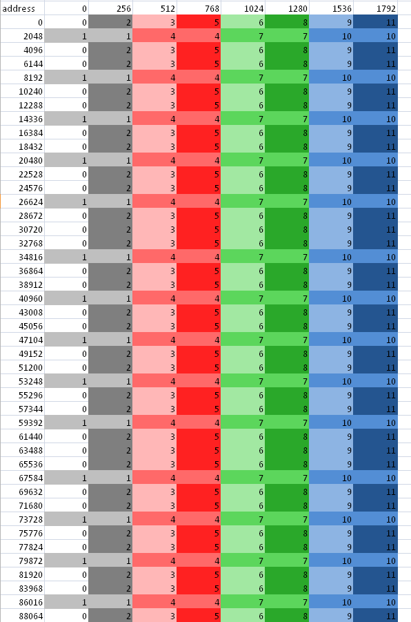

**Figure 2.1 Channel Remapping/Interleaving**

Note that an increase of the address by 2048 results in a 1/3 probability the same channel is hit; increasing the address by 256 results in a 1/6 probability the same channel is hit, etc.
 
On AMD Radeon™ HD 78XX GPUs, the channel selection are bits 10:8 of the byte address. For the AMD Radeon™ HD 77XX, the channel selection are bits 9:8 of the byte address. This means a linear burst switches channels every 256 bytes. Since the wavefront size is 64, channel conflicts are avoided if each work- item in a wave reads a different address from a 64-word region. All AMD Radeon™ HD 7XXX series GPUs have the same layout: channel ends at bit 8, and the memory bank is to the left of the channel.

For AMD Radeon HD 77XX and 78XX GPUs, a burst of 2 kB (# of channels *
256 bytes) cycles through all the channels.

For AMD Radeon™ HD 77XX and 78XX GPUs, when calculating an address as y*width+x, but reading a burst on a column (incrementing y), only one memory channel of the system is used, since the width is likely a multiple of 256 words = 2048 bytes. If the width is an odd multiple of 256B, then it cycles through all channels.

If every work-item in a work-group references consecutive memory addresses and the address of work-item 0 is aligned to 256 bytes and each work-item fetches 32 bits, the entire wavefront accesses one channel. Although this seems slow, it actually is a fast pattern because it is necessary to consider the memory access over the entire device, not just a single wavefront.

One or more work-groups execute on each compute unit. On the AMD Radeon™ HD 7000-series GPUs, work-groups are dispatched in a linear order, with x changing most rapidly. 
For a single dimension, this is:

 **DispatchOrder = get_group_id(0)**

For two dimensions, this is:

 **DispatchOrder = get_group_id(0) + get_group_id(1) * get_num_groups(0)**

This is row-major-ordering of the blocks in the index space. Once all compute units are in use, additional work-groups are assigned to compute units as needed. Work-groups retire in order, so active work-groups are contiguous.

At any time, each compute unit is executing an instruction from a single wavefront. In memory intensive kernels, it is likely that the instruction is a
memory access. Since there are 12 channels on the AMD Radeon™ HD 7970
GPU, at most 12 of the compute units can issue a memory access operation in one cycle. It is most efficient if the accesses from 12 wavefronts go to different channels. One way to achieve this is for each wavefront to access consecutive groups of 256 = 64 * 4 bytes. Note, as shown in Figure 2.1, fetching 256 * 12 bytes in a row does not always cycle through all channels.

An inefficient access pattern is if each wavefront accesses all the channels. This is likely to happen if consecutive work-items access data that has a large power of two strides.

In the next example of a kernel for copying, the input and output buffers are interpreted as though they were 2D, and the work-group size is organized as 2D.
 

The kernel code is::
 
 #define WIDTH 1024
 #define DATA_TYPE float
 #define A(y , x ) A[ (y) * WIDTH + (x ) ]
 #define C(y , x ) C[ (y) * WIDTH+(x ) ]
 kernel void copy_float (  global const
 DATA_TYPE * A,
   global DATA_TYPE* C)
 {
 int idx = get_global_id(0);
 int idy = get_global_id(1);
 C(idy, idx) = A( idy, idx);
 }  

By changing the width, the data type and the work-group dimensions, we get a set of kernels out of this code. 

Given a 64x1 work-group size, each work-item reads a consecutive 32-bit address. Given a 1x64 work-group size, each work-item reads a value separated by the width in a power of two bytes.

To avoid power of two strides:

* Add an extra column to the data matrix.
* Change the work-group size so that it is not a power of 21.
* It is best to use a width that causes a rotation through all of the memory channels, instead of using the same one repeatedly.
* Change the kernel to access the matrix with a staggered offset.

2.1.1.1 Staggered Offsets
##########################
Staggered offsets apply a coordinate transformation to the kernel so that the data is processed in a different order. Unlike adding a column, this technique does not use extra space. It is also relatively simple to add to existing code.

Figure 2.2 illustrates the transformation to staggered offsets.

**Figure 2.2 Transformation to Staggered Offsets**

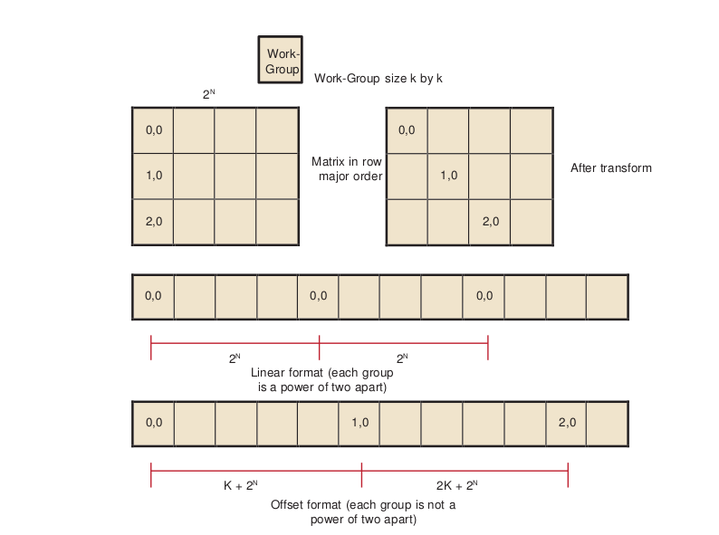

.. [1] Generally, it is not a good idea to make the work-group size something other than an integer multiple of the wavefront size, but that usually is less important than avoiding channel conflicts.

 

The global ID values reflect the order that the hardware initiates work-groups. The values of get group ID are in ascending launch order.
::

 global_id(0) = get_group_id(0) * get_local_size(0) + get_local_id(0)
 global_id(1) = get_group_id(1) * get_local_size(1) + get_local_id(1)

The hardware launch order is fixed, but it is possible to change the launch order, as shown in the following example.

Assume a work-group size of k x k, where k is a power of two, and a large 2D matrix of size 2n x 2m in row-major order. If each work-group must process a block in column-order, the launch order does not work out correctly: consecutive work-groups execute down the columns, and the columns are a large power-of- two apart; so, consecutive work-groups access the same channel.

By introducing a transformation, it is possible to stagger the work-groups to avoid channel conflicts. Since we are executing 2D work-groups, each work group is identified by four numbers.

1. ``get_group_id(0)`` - the x coordinate or the block within the column of the matrix.

2. ``get_group_id(1)`` - the y coordinate or the block within the row of the matrix.

3. ``get_global_id(0)`` - the x coordinate or the column of the matrix.

4. ``get_global_id(1)`` - the y coordinate or the row of the matrix.
 

To transform the code, add the following four lines to the top of the kernel.
::
 
 get_group_id_0 = get_group_id(0);
 get_group_id_1 = (get_group_id(0) + get_group_id(1)) % get_local_size(0);
 get_global_id_0 = get_group_id_0 * get_local_size(0) + get_local_id(0);
 get_global_id_1 = get_group_id_1 * get_local_size(1) + get_local_id(1);

Then, change the global IDs and group IDs to the staggered form. The result is:
::
 __kernel void copy_float (
 __global const DATA_TYPE * A,
 __global DATA_TYPE * C)
 {
 size_t get_group_id_0 = get_group_id(0);
 size_t get_group_id_1 = (get_group_id(0) + get_group_id(1)) %
 get_local_size(0);
  
 size_t get_global_id_0 = get_group_id_0 * get_local_size(0) +
 get_local_id(0);
 size_t get_global_id_1 = get_group_id_1 * get_local_size(1) +
 get_local_id(1); 
 
 int idx = get_global_id_0; //changed to staggered form int idy = get_global_id_1; //changed to staggered form 
 
 C(idy , idx) = A( idy , idx);
 }

 
2.1.1.2 Reads Of The Same Address
##################################
Under certain conditions, one unexpected case of a channel conflict is that reading from the same address is a conflict, even on the FastPath.

This does not happen on the read-only memories, such as constant buffers, textures, or shader resource view (SRV); but it is possible on the read/write UAV memory or OpenCL global memory.

From a hardware standpoint, reads from a fixed address have the same upper bits, so they collide and are serialized. To read in a single value, read the value in a single work-item, place it in local memory, and then use that location:

 
Avoid::
 
 temp = input[3] // if input is from global space

Use::
 
  if (get_local_id(0) == 0) {
  local = input[3]
   
  }
  barrier(CLK_LOCAL_MEM_FENCE);
 temp = local

2.1.2 Coalesced Writes
++++++++++++++++++++++++++
Southern Island devices do not support coalesced writes; however, continuous addresses within work-groups provide maximum performance.

Each compute unit accesses the memory system in quarter-wavefront units. The compute unit transfers a 32-bit address and one element-sized piece of data for each work-item. This results in a total of 16 elements + 16 addresses per quarter-wavefront. On GCN-based devices, processing quarter-wavefront requires two cycles before the data is transferred to the memory controller.

2.2 Local Memory (LDS) Optimization
-----------------------------------

AMD GCN-family GPUs include a Local Data Store (LDS) cache, which accelerates local memory accesses. LDS provides high-bandwidth access (more than 10X higher than global memory), efficient data transfers between work-items in a work-group, and high-performance atomic support. LDS is much faster than L1 cache access as it has twice the peak bandwidth and far lower latency. Additionally, using LDS memory can reduce global memory bandwidth usage. Local memory offers significant advantages when the data is re-used; for example, subsequent accesses can read from local memory, thus reducing global memory bandwidth. Another advantage is that local memory does not require coalescing.

To determine local memory size: **clGetDeviceInfo( ..., CL_DEVICE_LOCAL_MEM_SIZE, .... );**

All AMD Southern Islands, Sea Islands, and Volcanic Islands GPUs (collectively referred to as GCN devices) contain a 64 kB LDS for each compute unit; although only 32 kB can be allocated per work-group. The LDS contains 32- banks, each bank is four bytes wide and 256 bytes deep; the bank address is determined by bits 6:2 in the address. As shown below, programmers must carefully control the bank bits to avoid bank conflicts as much as possible. Bank conflicts are determined by what addresses are accessed on each half wavefront boundary. Threads 0 through 31 are checked for conflicts as are threads 32 through 63 within a wavefront.

In a single cycle, local memory can service a request for each bank (up to 32 accesses each cycle on the AMD Radeon™ HD 7970 GPU). For an AMD Radeon™ HD 7970 GPU, this delivers a memory bandwidth of over 100 GB/s for each compute unit, and more than 3.5 TB/s for the whole chip. This is more than 14X the global memory bandwidth. However, accesses that map to the same bank are serialized and serviced on consecutive cycles. LDS operations do not stall; however, the compiler inserts wait operations prior to issuing operations that depend on the results. A wavefront that generated bank conflicts does not stall implicitly, but may stall explicitly in the kernel if the compiler has inserted a wait command for the outstanding memory access. The GPU reprocesses the wavefront on subsequent cycles, enabling only the lanes receiving data, until all the conflicting accesses complete. The bank with the most conflicting accesses determines the latency for the wavefront to complete the local memory operation. The worst case occurs when all 64 work-items map to the same bank, since each access then is serviced at a rate of one per clock cycle; this case takes 64 cycles to complete the local memory access for the wavefront. A program with a large number of bank conflicts (as measured by the LDSBankConflict performance counter in the CodeXL GPU Profiler statistics) might benefit from using the constant or image memory rather than LDS.
 
Thus, the key to effectively using the LDS is to control the access pattern, so that accesses generated on the same cycle map to different banks in the LDS. One notable exception is that accesses to the same address (even though they have the same bits 6:2) can be broadcast to all requestors and do not generate a bank conflict. The LDS hardware examines the requests generated over two cycles (32 work-items of execution) for bank conflicts. Ensure, as much as possible, that the memory requests generated from a quarter-wavefront avoid bank conflicts by using unique address bits 6:2. A simple sequential address pattern, where each work-item reads a float2 value from LDS, generates a conflict-free access pattern on the AMD Radeon™ HD 7XXX GPU. Note that a sequential access pattern, where each work-item reads a float4 value from LDS, uses only half the banks on each cycle on the AMD Radeon™ HD 7XXX GPU and delivers half the performance of the float access pattern.

Each stream processor can generate up to two 4-byte LDS requests per cycle. Byte and short reads consume four bytes of LDS bandwidth. Developers can use the large register file: each compute unit has 256 kB of register space available (8X the LDS size) and can provide up to twelve 4-byte values/cycle (6X the LDS bandwidth). Registers do not offer the same indexing flexibility as does the LDS, but for some algorithms this can be overcome with loop unrolling and explicit addressing.

LDS reads require one ALU operation to initiate them. Each operation can initiate two loads of up to four bytes each.

The CodeXL GPU Profiler provides the following performance counter to help optimize local memory usage:

LDSBankConflict: The percentage of time accesses to the LDS are stalled due to bank conflicts relative to GPU Time. In the ideal case, there are no bank conflicts in the local memory access, and this number is zero.

Local memory is software-controlled "scratchpad" memory. In contrast, caches typically used on CPUs monitor the access stream and automatically capture recent accesses in a tagged cache. The scratchpad allows the kernel to explicitly load items into the memory; they exist in local memory until the kernel replaces them, or until the work-group ends. To declare a block of local memory, use the ``___local`` keyword; 
for example:

 **__local float localBuffer[64]**

These declarations can be either in the parameters to the kernel call or in the body of the kernel. The    local syntax allocates a single block of memory, which is shared across all work-items in the workgroup.

To write data into local memory, write it into an array allocated with ``__local``.

For example: **localBuffer[i] = 5.0;**
 
A typical access pattern is for each work-item to collaboratively write to the local memory: each work-item writes a subsection, and as the work-items execute in parallel they write the entire array. Combined with proper consideration for the access pattern and bank alignment, these collaborative write approaches can lead to highly efficient memory accessing.

The following example is a simple kernel section that collaboratively writes, then reads from, local memory::

 __kernel void localMemoryExample (  global float *In, __global float *Out) {
 __local float localBuffer[64];
 uint tx = get_local_id(0);
 uint gx = get_global_id(0); 

 // Initialize local memory:
 // Copy from this work-group's section of global memory to local:
 // Each work-item writes one element; together they write it all
 localBuffer[tx] = In[gx]; 
 
 // Ensure writes have completed:
 barrier(CLK_LOCAL_MEM_FENCE); 
 
 // Toy computation to compute a partial factorial, shows re-use from local float f = localBuffer[tx];
 for (uint i=tx+1; i<64; i++) {
 f *= localBuffer[i];
 }
 Out[gx] = f;
 } 

Note the host code cannot read from, or write to, local memory. Only the kernel can access local memory.

Local memory is consistent across work-items only at a work-group barrier; thus, before reading the values written collaboratively, the kernel must include a ``barrier()`` instruction. An important optimization is the case where the local work-group size is less than, or equal to, the wavefront size. Because the wavefront executes as an atomic unit, the explicit barrier operation is not required. The compiler automatically removes these barriers if the kernel specifies a ``reqd_work_group_size`` (see section 5.8 of the OpenCL Specification) that is less than the wavefront size. Developers are strongly encouraged to include the barriers where appropriate, and rely on the compiler to remove the barriers when possible, rather than manually removing the ``barriers()``. This technique results in more portable code, including the ability to run kernels on CPU devices.

2.3 Constant Memory Optimization
---------------------------------
Constants (data from read-only buffers shared by a wavefront) are loaded to SGPRs from memory through the L1 (and L2) cache using scalar memory read instructions. The scalar instructions can use up to two SGPR sources per cycle; vector instructions can use one SGPR source per cycle. (There are 512 SGPRs per SIMD, 4 SIMDs per CU; so a 32 CU configuration like Tahiti has 256 kB of SGPRs.)
 
GCN hardware supports specific inline literal constants. These constants are
"free" in that they do not increase code size::

  0
  integers 1..64
  integers -1..-16
  0.5 single or double floats
 -0.5
  1.0
 -1.0
  2.0
 -2.0
  4.0
 -4.0 
 
Any other literal constant increases the code size by at least 32 bits.

The AMD implementation of OpenCL provides three levels of performance for the "constant" memory type.

1.Simple Direct-Addressing Patterns
  Very high bandwidth can be attained when the compiler has available the constant address at compile time and can embed the constant address into the instruction. Each processing element can load up to 4x4-byte direct- addressed constant values each cycle. Typically, these cases are limited to simple non-array constants and function parameters. The executing kernel loads the constants into scalar registers and concurrently populates the constant cache. The constant cache is a tagged cache. Typically each 16 8k cache is shared among four compute units. If the constant data is already present in the constant cache, the load is serviced by the cache and does not require any global memory bandwidth. The constant cache size varies from 4k to 48k per GPU.
2.Same Index 
  Hardware acceleration also takes place when all work-items in a wavefront reference the same constant address. In this case, the data is loaded from memory one time, stored in the L1 cache, and then broadcast to all wave- fronts. This can reduce significantly the required memory bandwidth.
3.Varying Index
  More sophisticated addressing patterns, including the case where each work- item accesses different indices, are not hardware accelerated and deliver the same performance as a global memory read with the potential for cache hits.

To further improve the performance of the AMD OpenCL stack, two methods allow users to take advantage of hardware constant buffers. These are:
 
1. Globally scoped constant arrays. These arrays are initialized, globally scoped, and in the constant address space (as specified in section 6.5.3 of the OpenCL specification). If the size of an array is below 64 kB, it is placed in hardware constant buffers; otherwise, it uses global memory. An example of this is a lookup table for math functions.
2. Per-pointer attribute specifying the maximum pointer size. This is specified using the max_constant_size(N) attribute. The attribute form conforms to section 6.10 of the OpenCL 1.0 specification. This attribute is restricted to top-level kernel function arguments in the constant address space. This restriction prevents a pointer of one size from being passed as an argument to a function that declares a different size. It informs the compiler that indices into the pointer remain inside this range and it is safe to allocate a constant buffer in hardware, if it fits. Using a constant pointer that goes outside of this range results in undefined behavior. All allocations are aligned on the 16-byte boundary. For example:

:: 

 kernel void mykernel(global int* a,
 constant int* b   attribute__((max_constant_size (65536)))
 )
 {
 size_t idx = get_global_id(0);
 a[idx] = b[idx & 0x3FFF];
 }  
 

A kernel that uses constant buffers must use CL_DEVICE_MAX_CONSTANT_ARGS to query the device for the maximum number of constant buffers the kernel can support. This value might differ from the maximum number of hardware constant buffers available. In this case, if the number of hardware constant buffers is less than the CL_DEVICE_MAX_CONSTANT_ARGS, the compiler allocates the largest constant buffers in hardware first and allocates the rest of the constant buffers in global memory. As an optimization, if a constant pointer **A** uses n bytes of memory, where n is less than 64 kB, and constant pointer **B** uses m bytes of memory, where m is less than (64 kB - n) bytes of memory, the compiler can allocate the constant buffer pointers in a single hardware constant buffer. This optimization can be applied recursively by treating the resulting allocation as a single allocation and finding the next smallest constant pointer that fits within the space left in the constant buffer.

2.4 OpenCL Memory Resources: Capacity and Performance
------------------------------------------------------

Table 2.1 summarizes the hardware capacity and associated performance for the structures associated with the five OpenCL Memory Types. This information specific to the AMD Radeon™ HD 7970 GPUs with 3 GB video memory.

**Table 2.1 Hardware Performance Parameters**

+--------------------+---------------------------+---------+----------+----------------------+
| OpenCL Memory Type | Hardware Resource         | Size/CU | Size/GPU | Peak Read Bandwidth/ |
|                    |                           |         |          | Stream Core          |
+--------------------+---------------------------+---------+----------+----------------------+
| Private            | GPRs                      | 256k    | 8192k    | 12 bytes/cycle       |
+--------------------+---------------------------+---------+----------+----------------------+
| Local              | LDS                       | 64k     | 2048k    | 8 bytes/cycle        |
+--------------------+---------------------------+---------+----------+----------------------+
| Constant           | Direct-addressed constant |         | 48k      | 4 bytes/cycle        |
+                    +---------------------------+---------+----------+----------------------+
|                    | Same-indexed constant     |         |          | 4 bytes/cycle        |
+                    +---------------------------+---------+----------+----------------------+
|                    | Varying-indexed constant  |         |          | ~0.14 bytes/cycle    |
+--------------------+---------------------------+---------+----------+----------------------+
| Images             | L1 Cache                  | 16k     | 512k¹    | 1 bytes/cycle        |
+                    +---------------------------+---------+----------+----------------------+
|                    | L2 Cache                  |         | 768k²    | ~0.4 bytes/cycle     |
+                    +---------------------------+---------+----------+----------------------+
|                    | Global Memory             |         | 3G       | ~0.14 bytes/cycle    |
+--------------------+---------------------------+---------+----------+----------------------+

.. [1] ¹ Applies to images and buffers.
.. [2] ² Applies to images and buffers.

The compiler tries to map private memory allocations to the pool of GPRs in the GPU. In the event GPRs are not available, private memory is mapped to the "scratch" region, which has the same performance as global memory. Section 2.6.2, "Resource Limits on Active Wavefronts,", has more information on register allocation and identifying when the compiler uses the scratch region. GPRs provide the highest-bandwidth access of any hardware resource. In addition to reading up to 12 bytes/cycle per processing element from the register file, the hardware can access results produced in the previous cycle without consuming any register file bandwidth.

Same-indexed constants can be cached in the L1 and L2 cache. Note that "same-indexed" refers to the case where all work-items in the wavefront reference the same constant index on the same cycle. The performance shown assumes an L1 cache hit.

Varying-indexed constants, which are cached only in L2, use the same path as global memory access and are subject to the same bank and alignment constraints described in Section 2.1, "Global Memory Optimization,".

The L1 and L2 read/write caches are constantly enabled. Read only buffers can be cached in L1 and L2.

The L1 cache can service up to four address requests per cycle, each delivering up to 16 bytes. The bandwidth shown assumes an access size of 16 bytes; smaller access sizes/requests result in a lower peak bandwidth for the L1 cache. Using float4 with images increases the request size and can deliver higher L1 cache bandwidth.

Each memory channel on the GPU contains an L2 cache that can deliver up to 64 bytes/cycle. The AMD Radeon™ HD 7970 GPU has 12 memory channels; thus, it can deliver up to 768 bytes/cycle; divided among 2048 stream cores, this provides up to ~0.4 bytes/cycle for each stream core.

Global Memory bandwidth is limited by external pins, not internal bus bandwidth. The AMD Radeon™ HD 7970 GPU supports up to 264 GB/s of memory bandwidth which is an average of 0.14 bytes/cycle for each stream core.

Note that Table 2.1 shows the performance for the AMD Radeon™ HD 7970 GPU. The "Size/Compute Unit" column and many of the bandwidths/processing element apply to all Southern Islands-class GPUs; however, the "Size/GPU" column and the bandwidths for varying-indexed constant, L2, and global memory vary across different GPU devices.
 
2.5 Using LDS or L1 Cache
--------------------------

There are a number of considerations when deciding between LDS and L1 cache for a given algorithm.

LDS supports read/modify/write operations, as well as atomics. It is well-suited for code that requires fast read/write, read/modify/write, or scatter operations that otherwise are directed to global memory. On current AMD hardware, L1 is part of the read path; hence, it is suited to cache-read-sensitive algorithms, such as matrix multiplication or convolution.

LDS is typically larger than L1 (for example: 64 kB vs 16 kB on Southern Islands devices). If it is not possible to obtain a high L1 cache hit rate for an algorithm, the larger LDS size can help. On the AMD Radeon™ HD 7970 device, the theoretical LDS peak bandwidth is 3.8 TB/s, compared to L1 at 1.9 TB/sec.

The native data type for L1 is a four-vector of 32-bit words. On L1, fill and read addressing are linked. It is important that L1 is initially filled from global memory with a coalesced access pattern; once filled, random accesses come at no extra processing cost.

Currently, the native format of LDS is a 32-bit word. The theoretical LDS peak bandwidth is achieved when each thread operates on a two-vector of 32-bit words (16 threads per clock operate on 32 banks). If an algorithm requires coalesced 32-bit quantities, it maps well to LDS. The use of four-vectors or larger can lead to bank conflicts, although the compiler can mitigate some of these.

From an application point of view, filling LDS from global memory, and reading from it, are independent operations that can use independent addressing. Thus, LDS can be used to explicitly convert a scattered access pattern to a coalesced pattern for read and write to global memory. Or, by taking advantage of the LDS read broadcast feature, LDS can be filled with a coalesced pattern from global memory, followed by all threads iterating through the same LDS words simultaneously.

LDS reuses the data already pulled into cache by other wavefronts. Sharing across work-groups is not possible because OpenCL does not guarantee that LDS is in a particular state at the beginning of work-group execution. L1 content, on the other hand, is independent of work-group execution, so that successive work-groups can share the content in the L1 cache of a given Vector ALU. However, it currently is not possible to explicitly control L1 sharing across work- groups.

The use of LDS is linked to GPR usage and wavefront-per-Vector ALU count. Better sharing efficiency requires a larger work-group, so that more work-items share the same LDS. Compiling kernels for larger work-groups typically results in increased register use, so that fewer wavefronts can be scheduled simultaneously per Vector ALU. This, in turn, reduces memory latency hiding. Requesting larger amounts of LDS per work-group results in fewer wavefronts per Vector ALU, with the same effect.
 

LDS typically involves the use of barriers, with a potential performance impact. This is true even for read-only use cases, as LDS must be explicitly filled in from global memory (after which a barrier is required before reads can commence).

2.6 NDRange and Execution Range Optimization
---------------------------------------------

Probably the most effective way to exploit the potential performance of the GPU is to provide enough threads to keep the device completely busy. The programmer specifies a three-dimensional NDRange over which to execute the kernel; bigger problems with larger NDRanges certainly help to more effectively use the machine. The programmer also controls how the global NDRange is divided into local ranges, as well as how much work is done in each work-item, and which resources (registers and local memory) are used by the kernel. All of these can play a role in how the work is balanced across the machine and how well it is used. This section introduces the concept of latency hiding, how many wavefronts are required to hide latency on AMD GPUs, how the resource usage in the kernel can impact the active wavefronts, and how to choose appropriate global and local work-group dimensions.

2.6.1 Hiding Memory Latency with ALU Operations
++++++++++++++++++++++++++++++++++++++++++++++++

The read-after-write latency for most arithmetic operations (a floating-point add, for example) is only four cycles. For most Southern Island devices, each CU can execute 64 vector ALU instructions per cycle, 16 per wavefront. Also, a wavefront can issue a scalar ALU instruction every four cycles. To achieve peak ALU power, a minimum of four wavefronts must be scheduled for each CU.

Global memory reads generate a reference to the off-chip memory and experience a latency of 300 to 600 cycles. The wavefront that generates the global memory access is made idle until the memory request completes. During this time, the compute unit can process other independent wavefronts, if they are available.

Kernel execution time also plays a role in hiding memory latency: longer chains of ALU instructions keep the functional units busy and effectively hide more latency. To better understand this concept, consider a global memory access which takes 400 cycles to execute. Assume the compute unit contains many other wavefronts, each of which performs five ALU instructions before generating another global memory reference. As discussed previously, the hardware executes each instruction in the wavefront in four cycles; thus, all five instructions occupy the ALU for 20 cycles. Note the compute unit interleaves two of these wavefronts and executes the five instructions from both wavefronts (10 total instructions) in 40 cycles. To fully hide the 400 cycles of latency, the compute unit requires (400/40) = 10 pairs of wavefronts, or 20 total wavefronts. If the wavefront contains 10 instructions rather than 5, the wavefront pair would consume 80 cycles of latency, and only 10 wavefronts would be required to hide the 400 cycles of latency.

Generally, it is not possible to predict how the compute unit schedules the available wavefronts, and thus it is not useful to try to predict exactly which ALU block executes when trying to hide latency. Instead, consider the overall ratio of ALU operations to fetch operations - this metric is reported by the CodeXL GPU Profiler in the ``ALUFetchRatio`` counter. Each ALU operation keeps the compute unit busy for four cycles, so you can roughly divide 500 cycles of latency by `` (4*ALUFetchRatio)`` to determine how many wavefronts must be in-flight to hide that latency. Additionally, a low value for the ``ALUBusy`` performance counter can indicate that the compute unit is not providing enough wavefronts to keep the execution resources in full use. (This counter also can be low if the kernel exhausts the available DRAM bandwidth. In this case, generating more wavefronts does not improve performance; it can reduce performance by creating more contention.)

Increasing the wavefronts/compute unit does not indefinitely improve performance once the GPU has enough wavefronts to hide latency, additional active wavefronts provide little or no performance benefit. A closely related metric to wavefronts/compute unit is "occupancy," which is defined as the ratio of active wavefronts to the maximum number of possible wavefronts supported by the hardware. Many of the important optimization targets and resource limits are expressed in wavefronts/compute units, so this section uses this metric rather than the related "occupancy" term.

2.6.2 Resource Limits on Active Wavefronts
+++++++++++++++++++++++++++++++++++++++++++
AMD GPUs have two important global resource constraints that limit the number of in-flight wavefronts:

 * Southern Islands devices support a maximum of 16 work-groups per CU if a work-group is larger than one wavefront.
 * The maximum number of wavefronts that can be scheduled to a CU is 40, or 10 per Vector Unit.

These limits are largely properties of the hardware and, thus, difficult for developers to control directly. Fortunately, these are relatively generous limits. Frequently, the register and LDS usage in the kernel determines the limit on the number of active wavefronts/compute unit, and these can be controlled by the developer.

2.6.2.1  GPU Registers
#######################
Southern Islands registers are scalar, so each is 32-bits. Each wavefront can have at most 256 registers (VGPRs). To compute the number of wavefronts per CU, take (256/# registers)*4.

For example, a kernel that uses 120 registers (120x32-bit values) can run with eight active wavefronts on each compute unit. Because of the global limits described earlier, each compute unit is limited to 40 wavefronts; thus, kernels can use up to 25 registers (25x32-bit values) without affecting the number of wavefronts/compute unit.

AMD provides the following tools to examine the number of general-purpose registers (GPRs) used by the kernel.
 
* The CodeXL GPU Profiler displays the number of GPRs used by the kernel.
* Alternatively, the CodeXL GPU Profiler generates the ISA dump , which then can be searched for the string ``:NUM_GPRS.``
* The AMD CodeXL Analysis Mode shows the GPR used by the kernel, across a wide variety of GPU compilation targets.

The compiler generates spill code (shuffling values to, and from, memory) if it cannot fit all the live values into registers. Spill code uses long-latency global memory and can have a large impact on performance. Spilled registers can be cached in Southern Island devices, thus reducing the impact on performance. The CodeXL GPU Profiler reports the static number of register spills in the ScratchReg field. Generally, it is a good idea to re-write the algorithm to use fewer GPRs, or tune the work-group dimensions specified at launch time to expose more registers/kernel to the compiler, in order to reduce the scratch register usage to 0.

2.6.2.2  Specifying the Default Work-Group Size at Compile-Time
################################################################
The number of registers used by a work-item is determined by the compiler on compile time. The user later specifies the size of the work-group. Ideally, the OpenCL compiler knows the size of the work-group at compile-time, so it can make optimal register allocation decisions. Without knowing the work-group size, the compiler must assume an upper-bound size to avoid allocating more registers in the work-item than the hardware actually contains.

OpenCL provides a mechanism to specify a work-group size that the compiler can use to optimize the register allocation. In particular, specifying a smaller work-group size at compile time allows the compiler to allocate more registers for each kernel, which can avoid spill code and improve performance. The kernel
attribute syntax is::

 __attribute ((reqd_work_group_size(X, Y, Z)))

Section 6.7.2 of the OpenCL specification explains the attribute in more detail.

2.6.2.3 Local Memory (LDS) Size
################################
In addition to registers, shared memory can also serve to limit the active wavefronts/compute unit. Each compute unit has 64 kB of LDS, which is shared among all active work-groups. Note that the maximum allocation size is 32 kB. LDS is allocated on a per-work-group granularity, so it is possible (and useful) for multiple wavefronts to share the same local memory allocation. However, large LDS allocations eventually limits the number of workgroups that can be active. Table 2.2 provides more details about how LDS usage can impact the wavefronts/compute unit.
 
**Table 2.2  Effect of LDS Usage on Wavefronts/CU1**

+-------------------------+----------------------------------------------------------------------+------------------------------------------------------------------------+------------------------------------------------------------------------+-------------------------------------------------------------------------+
| Local Memory/Work-Group | LDS-Limited Wavefronts/Compute-Unit (Assume 4Wavefronts/ Work-Group) | LDS-Limited Wavefronts/ Compute-Unit (Assume 3 Wavefronts/ Work-Group) | LDS-Limited Wavefronts/ Compute-Unit (Assume 2 Wavefronts/ Work-Group) | LDS-Limited Wavefronts / Compute Unit (Assume 1 Wavefront / Work-Group) |
+=========================+======================================================================+========================================================================+========================================================================+=========================================================================+
| <=4K                    | 40                                                                   | 40                                                                     | 32                                                                     | 16                                                                      |
+-------------------------+----------------------------------------------------------------------+------------------------------------------------------------------------+------------------------------------------------------------------------+-------------------------------------------------------------------------+
| 4.0K-4.2K               | 40                                                                   | 40                                                                     | 30                                                                     | 15                                                                      |
+-------------------------+----------------------------------------------------------------------+------------------------------------------------------------------------+------------------------------------------------------------------------+-------------------------------------------------------------------------+
| 4.2K-4.5K               | 40                                                                   | 40                                                                     | 28                                                                     | 14                                                                      |
+-------------------------+----------------------------------------------------------------------+------------------------------------------------------------------------+------------------------------------------------------------------------+-------------------------------------------------------------------------+
| 4.5K-4.9K               | 40                                                                   | 39                                                                     | 26                                                                     | 13                                                                      |
+-------------------------+----------------------------------------------------------------------+------------------------------------------------------------------------+------------------------------------------------------------------------+-------------------------------------------------------------------------+
| 4.9K-5.3K               | 40                                                                   | 36                                                                     | 24                                                                     | 12                                                                      |
+-------------------------+----------------------------------------------------------------------+------------------------------------------------------------------------+------------------------------------------------------------------------+-------------------------------------------------------------------------+
| 5.3K-5.8K               | 40                                                                   | 33                                                                     | 22                                                                     | 11                                                                      |
+-------------------------+----------------------------------------------------------------------+------------------------------------------------------------------------+------------------------------------------------------------------------+-------------------------------------------------------------------------+
| 5.8K-6.4K               | 40                                                                   | 30                                                                     | 20                                                                     | 10                                                                      |
+-------------------------+----------------------------------------------------------------------+------------------------------------------------------------------------+------------------------------------------------------------------------+-------------------------------------------------------------------------+
| 6.4K-7.1K               | 36                                                                   | 27                                                                     | 18                                                                     | 9                                                                       |
+-------------------------+----------------------------------------------------------------------+------------------------------------------------------------------------+------------------------------------------------------------------------+-------------------------------------------------------------------------+
| 7.1K-8.0K               | 32                                                                   | 24                                                                     | 16                                                                     | 8                                                                       |
+-------------------------+----------------------------------------------------------------------+------------------------------------------------------------------------+------------------------------------------------------------------------+-------------------------------------------------------------------------+
| 8.0K-9.1K               | 28                                                                   | 21                                                                     | 14                                                                     | 7                                                                       |
+-------------------------+----------------------------------------------------------------------+------------------------------------------------------------------------+------------------------------------------------------------------------+-------------------------------------------------------------------------+
| 9.1K-10.6K              | 24                                                                   | 18                                                                     | 12                                                                     | 6                                                                       |
+-------------------------+----------------------------------------------------------------------+------------------------------------------------------------------------+------------------------------------------------------------------------+-------------------------------------------------------------------------+
| 10.6K-12.8K             | 20                                                                   | 15                                                                     | 10                                                                     | 5                                                                       |
+-------------------------+----------------------------------------------------------------------+------------------------------------------------------------------------+------------------------------------------------------------------------+-------------------------------------------------------------------------+
| 12.8K-16.0K             | 16                                                                   | 12                                                                     | 8                                                                      | 4                                                                       |
+-------------------------+----------------------------------------------------------------------+------------------------------------------------------------------------+------------------------------------------------------------------------+-------------------------------------------------------------------------+
| 16.0K-21.3K             | 12                                                                   | 9                                                                      | 6                                                                      | 3                                                                       |
+-------------------------+----------------------------------------------------------------------+------------------------------------------------------------------------+------------------------------------------------------------------------+-------------------------------------------------------------------------+
| 21.3K-32.0K             | 8                                                                    | 6                                                                      | 4                                                                      | 2                                                                       |
+-------------------------+----------------------------------------------------------------------+------------------------------------------------------------------------+------------------------------------------------------------------------+-------------------------------------------------------------------------+
.. [1] Assumes each work-group uses four wavefronts (the maximum supported by the AMD OpenCL SDK).

AMD provides the following tools to examine the amount of LDS used by the kernel:

* The CodeXL GPU Profiler displays the LDS usage. See the LocalMem counter.
* Alternatively, use the CodeXL GPU Profiler to generate the ISA dump, then search for the string ``SQ_LDS_ALLOC:SIZE`` in the ISA dump. Note that the value is shown in hexadecimal format.

2.6.3 Partitioning the Work
############################
In OpenCL, each kernel executes on an index point that exists in a global NDRange. The partition of the NDRange can have a significant impact on performance; thus, it is recommended that the developer explicitly specify the global `` (#work-groups)`` and local `` (#work-items/work-group)`` dimensions, rather than rely on OpenCL to set these automatically (by setting ``local_work_size`` to NULL in clEnqueueNDRangeKernel). This section explains the guidelines for partitioning at the global, local, and work/kernel levels.

2.6.3.1 Global Work Size
##########################
OpenCL does not explicitly limit the number of work-groups that can be submitted with a clEnqueueNDRangeKernel command. The hardware limits the available in- flight threads, but the OpenCL SDK automatically partitions a large number of work-groups into smaller pieces that the hardware can process. For some large workloads, the amount of memory available to the GPU can be a limitation; the problem might require so much memory capacity that the GPU cannot hold it all. In these cases, the programmer must partition the workload into multiple clEnqueueNDRangeKernel commands. The available device memory can be obtained by querying ``clDeviceInfo``.

At a minimum, ensure that the workload contains at least as many work-groups as the number of compute units in the hardware. Work-groups cannot be split across multiple compute units, so if the number of work-groups is less than the available compute units, some units are idle. Use clGetDeviceInfo(...CL_DEVICE_MAX_COMPUTE_UNITS) to determine the value dynamically.

2.6.3.2 Local Work Size (#Work-Items per Work-Group)
#####################################################
OpenCL limits the number of work-items in each group. Call clDeviceInfo with the CL_DEVICE_MAX_WORK_GROUP_SIZE to determine the maximum number of work-groups supported by the hardware. The latest generation AMD GPUs support a maximum of 256 work-items per work-group. Note the number of work- items is the product of all work-group dimensions; for example, a work-group with dimensions 32x16 requires 512 work-items, which is not allowed with the current AMD OpenCL runtime.

The fundamental unit of work on AMD GPUs is called a wavefront. Each wavefront consists of 64 work-items; thus, the optimal local work size is an integer multiple of 64 (specifically 64, 128, 192, or 256) work-items per work- group.

Work-items in the same work-group can share data through LDS memory and also use high-speed local atomic operations. Thus, larger work-groups enable more work-items to efficiently share data, which can reduce the amount of slower global communication. However, larger work-groups reduce the number of global work-groups, which, for small workloads, could result in idle compute units. Generally, larger work-groups are better as long as the global range is big enough to provide 1-2 Work-Groups for each compute unit in the system; for small workloads it generally works best to reduce the work-group size in order to avoid idle compute units. Note that it is possible to make the decision dynamically, when the kernel is launched, based on the launch dimensions and the target device characteristics.
 
2.6.3.3 Work-Group Dimensions vs Size
#######################################

The local NDRange can contain up to three dimensions, here labeled X, Y, and Z. The X dimension is returned by ``get_local_id(0)``, Y is returned by ``get_local_id(1)``, and Z is returned by ``get_local_id(2)``. The GPU hardware schedules the kernels so that the X dimension moves fastest as the work-items are packed into wavefronts. For example, the 128 threads in a 2D work-group of dimension 32x4 (X=32 and Y=4) are packed into two wavefronts as follows (notation shown in X,Y order).

+----------------+------+------+------+------+------+------+------+------+------+------+------+------+------+------+------+------+
| **WaveFront0** | 0,0  | 1,0  | 2,0  | 3,0  | 4,0  | 5,0  | 6,0  | 7,0  | 8,0  | 9,0  | 10,0 | 11,0 | 12,0 | 13,0 | 14,0 | 15,0 |
+                +------+------+------+------+------+------+------+------+------+------+------+------+------+------+------+------+
|                | 16,0 | 17,0 | 18,0 | 19,0 | 20,0 | 21,0 | 22,0 | 23,0 | 24,0 | 25,0 | 26,0 | 27,0 | 28,0 | 29,0 | 30,0 | 31,0 |
+                +------+------+------+------+------+------+------+------+------+------+------+------+------+------+------+------+
|                | 0,1  | 1,1  | 2,1  | 3,1  | 4,1  | 5,1  | 6,1  | 7,1  | 8,1  | 9,1  | 10,1 | 11,1 | 12,1 | 13,1 | 14,1 | 15,1 |
+                +------+------+------+------+------+------+------+------+------+------+------+------+------+------+------+------+
|                | 16,1 | 17,1 | 18,1 | 19,1 | 20,1 | 21,1 | 22,1 | 23,1 | 24,1 | 25,1 | 26,1 | 27,1 | 28,1 | 29,1 | 30,1 | 31,1 |
+----------------+------+------+------+------+------+------+------+------+------+------+------+------+------+------+------+------+
| **WaveFront1** | 0,2  | 1,2  | 2,2  | 3,2  | 4,2  | 5,2  | 6,2  | 7,2  | 8,2  | 9,2  | 10,2 | 11,2 | 12,2 | 13,2 | 14,2 | 15,2 |
+                +------+------+------+------+------+------+------+------+------+------+------+------+------+------+------+------+
|                | 16,2 | 17,2 | 18,2 | 19,2 | 20,2 | 21,2 | 22,2 | 23,2 | 24,2 | 25,2 | 26,2 | 27,2 | 28,2 | 29,2 | 30,2 | 31,2 |
+                +------+------+------+------+------+------+------+------+------+------+------+------+------+------+------+------+
|                | 0,3  | 1,3  | 2,3  | 3,3  | 4,3  | 5,3  | 6,3  | 7,3  | 8,3  | 9,3  | 10,3 | 11,3 | 12,3 | 13,3 | 14,3 | 15,3 |
+                +------+------+------+------+------+------+------+------+------+------+------+------+------+------+------+------+
|                | 16,3 | 17,3 | 18,3 | 19,3 | 20,3 | 21,3 | 22,3 | 23,3 | 24,3 | 25,3 | 26,3 | 27,3 | 28,3 | 29,3 | 30,3 | 31,3 |
+----------------+------+------+------+------+------+------+------+------+------+------+------+------+------+------+------+------+

The total number of work-items in the work-group is typically the most important parameter to consider, in particular when optimizing to hide latency by increasing wavefronts/compute unit. However, the choice of XYZ dimensions for the same overall work-group size can have the following second-order effects.

* Work-items in the same quarter-wavefront execute on the same cycle in the processing engine. Thus, global memory coalescing and local memory bank conflicts can be impacted by dimension, particularly if the fast-moving X dimension is small. Typically, it is best to choose an X dimension of at least 16, then optimize the memory patterns for a block of 16 work-items which differ by 1 in the X dimension.
* Work-items in the same wavefront have the same program counter and execute the same instruction on each cycle. The packing order can be important if the kernel contains divergent branches. If possible, pack together work-items that are likely to follow the same direction when control-flow is encountered. For example, consider an image-processing kernel where each work-item processes one pixel, and the control-flow depends on the color of the pixel. It might be more likely that a square of 8x8 pixels is the same color than a 64x1 strip; thus, the 8x8 would see less divergence and higher performance.
* When in doubt, a square 16x16 work-group size is a good start.

2.6.4 Summary of NDRange Optimizations
+++++++++++++++++++++++++++++++++++++++
As shown above, execution range optimization is a complex topic with many interacting variables and which frequently requires some experimentation to determine the optimal values. Some general guidelines are:
 * Select the work-group size to be a multiple of 64, so that the wavefronts are fully populated.
 * Schedule at least four wavefronts per compute unit.
 * Latency hiding depends on both the number of wavefronts/compute unit, as well as the execution time for each kernel. Generally, 8 to 32 wavefronts/compute unit is desirable, but this can vary significantly, depending on the complexity of the kernel and the available memory bandwidth. The CodeXL GPU Profiler and associated performance counters can help to select an optimal value.

2.7 Instruction Selection Optimizations
----------------------------------------
2.7.1 Instruction Bandwidths
+++++++++++++++++++++++++++++

**Table 2.3 Instruction Throughput (Operations/Cycle for Each Processing Element (ALU))**

+---------------------------+-----------------+--------------------------------------------------------------------------------------+
|                           |                 | Rate (Operations/Cycle) for each Processing Element (ALU)                            |
+---------------------------+-----------------+--------------------------------------------------------------------------------------+
|                           | Instruction     | One Quarter-Double-      | One Half-Double-                | Double-Precision-       |
|                           |                 |  Precision-Speed Devices | Precision-Speed Devices         | Speed-Devices           |
|                           |                 |                          |  (e.g. Tahiti, Cayman, Cypress) | (e.g. AMD FirePro 9100) |
+===========================+=================+==========================+=================================+=========================+
| Single Precision FP Rates | SPFP FMA        | 1/16                     | 1                               | 1                       |
+                           +-----------------+--------------------------+---------------------------------+-------------------------+
|                           | SPFP MAD        | 1                        | 1                               | 1                       |
+                           +-----------------+--------------------------+---------------------------------+-------------------------+
|                           | ADD             | 1                        | 1                               | 1                       |
+                           +-----------------+--------------------------+---------------------------------+-------------------------+
|                           | MUL             | 1                        | 1                               | 1                       |
+                           +-----------------+--------------------------+---------------------------------+-------------------------+
|                           | INV             | 1/4                      | 1/4                             | 1/2                     |
+                           +-----------------+--------------------------+---------------------------------+-------------------------+
|                           | RQSRT           | 1/4                      | 1/4                             | 1/2                     |
+                           +-----------------+--------------------------+---------------------------------+-------------------------+
|                           | LOG             | 1/4                      | 1/4                             | 1/2                     |
+---------------------------+-----------------+--------------------------+---------------------------------+-------------------------+
| Double Precision FP Rates | FMA             | 1/16                     | 1/4                             | 1/2                     |
+                           +-----------------+--------------------------+---------------------------------+-------------------------+
|                           | MAD             | 1/16                     | 1/4                             | 1/4                     |
+                           +-----------------+--------------------------+---------------------------------+-------------------------+
|                           | ADD             | 1/8                      | 1/2                             | 1                       |
+                           +-----------------+--------------------------+---------------------------------+-------------------------+
|                           | MUL             | 1/16                     | 1/4                             | 1/2                     |
+                           +-----------------+--------------------------+---------------------------------+-------------------------+
|                           | INV (approx.)   | 1/16                     | 1/4                             | 1/2                     |
+                           +-----------------+--------------------------+---------------------------------+-------------------------+
|                           | RQSRT (approx.) | 1/16                     | 1/4                             | 1/2                     |
+---------------------------+-----------------+--------------------------+---------------------------------+-------------------------+
| Integer Instruction Rates | MAD             | 1/4                      | 1/4                             | 1/4                     |
+                           +-----------------+--------------------------+---------------------------------+-------------------------+
|                           | ADD             | 1                        | 1                               | 1                       |
+                           +-----------------+--------------------------+---------------------------------+-------------------------+
|                           | MUL             | 1/4                      | 1/4                             | 1/2                     |
+                           +-----------------+--------------------------+---------------------------------+-------------------------+
|                           | Bit-shift       | 1                        | 1                               | 1                       |
+                           +-----------------+--------------------------+---------------------------------+-------------------------+
|                           | Bitwise XOR     | 1                        | 1                               | 1                       |
+---------------------------+-----------------+--------------------------+---------------------------------+-------------------------+
| Conversion                | Float-to-Int    | 1/4                      | 1/4                             | 1/2                     |
+                           +-----------------+--------------------------+---------------------------------+-------------------------+
|                           | Int-to-Float    | 1/4                      | 1/4                             | 1/2                     |
+---------------------------+-----------------+--------------------------+---------------------------------+-------------------------+
| 24-Bit Integer Inst Rates | MAD	      | 1                        | 1                               | 1                       |
+                           +-----------------+--------------------------+---------------------------------+-------------------------+
|                           | ADD             | 1                        | 1                               | 1                       |
+                           +-----------------+--------------------------+---------------------------------+-------------------------+
|                           | MUL             | 1                        | 1                               | 1                       |
+---------------------------+-----------------+--------------------------+---------------------------------+-------------------------+

Double-precision is supported on all GCN family devices at varying rates. The use of single-precision calculation is encouraged, if that precision is acceptable. Single-precision data is also half the size of double-precision, which requires less chip bandwidth and is not as demanding on the cache structures.

Generally, the throughput and latency for 32-bit integer operations is the same as for single-precision floating point operations.

24-bit integer MULs and MADs have four times the throughput of 32-bit integer multiplies. 24-bit signed and unsigned integers are natively supported on the GCN family of devices. The use of OpenCL built-in functions for ``mul24`` and ``mad24`` is encouraged. Note that ``mul24`` can be useful for array indexing operations.

Packed 16-bit and 8-bit operations are not natively supported; however, in cases where it is known that no overflow will occur, some algorithms may be able to effectively pack 2 to 4 values into the 32-bit registers natively supported by the hardware.

The MAD instruction is an IEEE-compliant multiply followed by an IEEE- compliant add; it has the same accuracy as two separate MUL/ADD operations. No special compiler flags are required for the compiler to convert separate MUL/ADD operations to use the MAD instruction.

Table 2.3 shows the throughput for each processing element. To obtain the peak throughput for the whole device, multiply the value in the table with the number of processing elements and the engine clock. For example, according to Table 2.3, an AMD Tahiti device can perform one double-precision ADD operations/2 cycles in each processing element. An AMD Radeon™ HD 7970 GPU has 2048 processing elements and an engine clock of 925 MHz, so the entire GPU has a throughput rate of (.5*2048*925 MHz) = 947 GFlops for double- precision adds.

Similarly, double-precision MADs on AMD Tahiti (including the AMD HD 79XX and the AMD R9 280 products) run at 1/4 rate. Double-precision MADs on AMD Hawaii have two rates: 1/2 rate for the AMD FirePro 9100 devices, and 1/8th rate for the non-FirePro AMD devices (AMD R9 290 for example). Double-precision MADs on the other GCN devices typically run at 1/16 rate.

In general, the rate for double-precision ADD operations is double the rate for double-precision MAD or FMA operations.

For information about the device parameters for some Southern Islands devices, see 2.10, "Device Parameters for Southern Islands Devices".
 
2.7.2 AMD Media Instructions
+++++++++++++++++++++++++++++
AMD provides a set of media instructions for accelerating media processing. Notably, the sum-of-absolute differences (SAD) operation is widely used in motion estimation algorithms. For the Southern Islands family of devices, new media instructions have been added; these are available under the ``cl_amd_media_ops2`` extensions.

2.7.3 Math Libraries
+++++++++++++++++++++

The GCN environment contains new instructions for increasing the previous performance of floating point division, trigonometric range reduction, certain type conversions with double-precision values, floating-point classification, and frexp/ldexp.

OpenCL supports two types of math library operation: ``native_function()`` and ``function()``. Native_functions are generally supported in hardware and can run substantially faster, although at somewhat lower accuracy. The accuracy for the non-native functions is specified in section 7.4 of the OpenCL Specification. The accuracy for the native functions is implementation-defined. Developers are encouraged to use the native functions when performance is more important than accuracy.

Compared to previous families of GPUs, the accuracy of certain native functions is increased in the Southern Islands family. We recommend retesting applications where native function accuracy was insufficient on previous GPU devices.

2.7.4 ompiler Optimizations
+++++++++++++++++++++++++++++++
The OpenCL compiler currently recognizes a few patterns and transforms them into a single instruction. By following these patterns, a developer can generate highly efficient code. The currently accepted patterns are:

* Bitfield extract on signed/unsigned integers.
  |(A >> B) & C ==> [u]bit_extract
 
 where
 
  | B and C are compile time constants,
  | A is a 8/16/32bit integer type, and
  | C is a mask.

* Bitfield insert on signed/unsigned integers
  | ((A & B) << C) | ((D & E) << F ==> ubit_insert
 
 where
 
  | B and E have no conflicting bits (B^E == 0),
  | B, C, E, and F are compile-time constants, and
  | B and E are masks.
  | The first bit set in B is greater than the number of bits in E plus the first bit set in E, or the first bit set in E is greater than the number of bits in B plus the first bit set in B.
  | If B, C, E, or F are equivalent to the value 0, this optimization is also supported.

2.8 Additional Performance Guidance
-------------------------------------

This section is a collection of performance tips for GPU compute and AMD-specific optimizations.

2.8.1 Loop Unroll pragma
+++++++++++++++++++++++++
The compiler directive ``#pragma unroll <unroll-factor>`` can be placed immediately prior to a loop as a hint to the compiler to unroll a loop. ``<unroll- factor>`` must be a positive integer, 1 or greater. When ``<unroll-factor>`` is 1, loop unrolling is disabled. When ``<unroll-factor>`` is 2 or greater, the compiler uses this as a hint for the number of times the loop is to be unrolled.

Examples for using this loop follow.
::
 No unrolling example::

  #pragma unroll 1 
  for (int i = 0; i < n; i++) {
  ...
  }
 Partial unrolling example::
  #pragma unroll 4
  for (int i = 0; i < 128; i++) {
  ...
  }

Currently, the unroll pragma requires that the loop boundaries can be determined at compile time. Both loop bounds must be known at compile time. If n is not given, it is equivalent to the number of iterations of the loop when both loop bounds are known. If the unroll-factor is not specified, and the compiler can determine the loop count, the compiler fully unrolls the loop. If the unroll-factor is not specified, and the compiler cannot determine the loop count, the compiler does no unrolling.

2.8.2 Memory Tiling
++++++++++++++++++++
There are many possible physical memory layouts for images. AMD devices can access memory in a tiled or in a linear arrangement.
* Linear - A linear layout format arranges the data linearly in memory such that element addresses are sequential. This is the layout that is familiar to CPU programmers. This format must be used for OpenCL buffers; it can be used for images.
* Tiled - A tiled layout format has a pre-defined sequence of element blocks arranged in sequential memory addresses (see Figure 2.3 for a conceptual illustration). A microtile consists of ABIJ; a macrotile consists of the top-left 16 squares for which the arrows are red. Only images can use this format. Translating from user address space to the tiled arrangement is transparent to the user. Tiled memory layouts provide an optimized memory access pattern to make more efficient use of the RAM attached to the GPU compute device. This can contribute to lower latency.

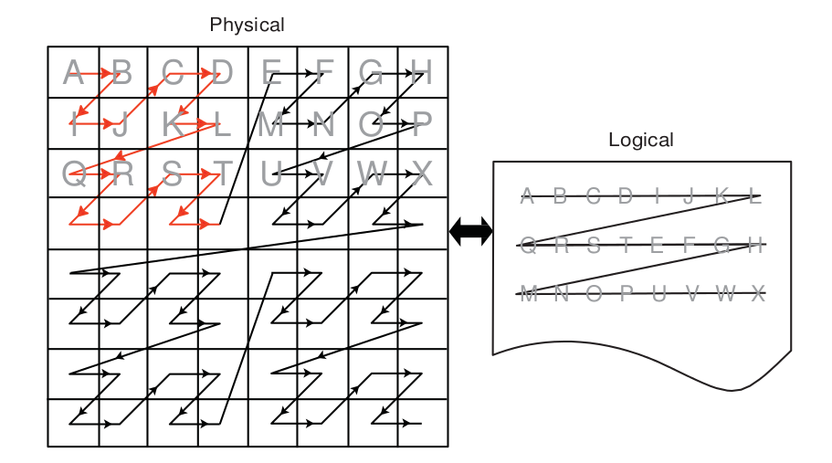

**Figure 2.3 One Example of a Tiled Layout Format**

**Memory Access Pattern -**

Memory access patterns in compute kernels are usually different from those in the pixel shaders. Whereas the access pattern for pixel shaders is in a hierarchical, space-filling curve pattern and is tuned for tiled memory performance (generally for textures), the access pattern for a compute kernel is linear across each row before moving to the next row in the global id space. This has an effect on performance, since pixel shaders have implicit blocking, and compute kernels do not. If accessing a tiled image, best performance is achieved if the application tries to use workgroups with 16x16 (or 8x8) work-items.

2.8.3 General Tips
+++++++++++++++++++
* Using dynamic pointer assignment in kernels that are executed on the GPU cause inefficient code generation.
* Many OpenCL specification compiler options that are accepted by the AMD OpenCL compiler are not implemented. The implemented options are ``-D`` , ``-I``, ``w``, ``Werror``, ``-clsingle-precision-constant``, ``-cl-opt-disable``, and ``-cl-fp32-correctly-rounded-divide-sqrt``.
* Avoid declaring global arrays on the kernel's stack frame as these typically cannot be allocated in registers and require expensive global memory operations.
* Use predication rather than control-flow. The predication allows the GPU to execute both paths of execution in parallel, which can be faster than attempting to minimize the work through clever control-flow. The reason for this is that if no memory operation exists in a ``?:`` operator (also called a ternary operator), this operation is translated into a single cmov_logical instruction, which is executed in a single cycle. An example of this is :

::

  If (A>B) { C += D;
  } else { C -= D;
  }

Replace this with:
::
  int factor = (A>B) ? 1:-1;
  C += factor*D;

In the first block of code, this translates into an IF/ELSE/ENDIF sequence of conditional code, each taking ~8 cycles. If divergent, this code executes in ~36 clocks; otherwise, in ~28 clocks. A branch not taken costs four cycles (one instruction slot); a branch taken adds four slots of latency to fetch instructions from the instruction cache, for a total of 16 clocks. Since the execution mask is saved, then modified, then restored for the branch, ~12 clocks are added when divergent, ~8 clocks when not.

In the second block of code, the ``?:`` operator executes in the vector units, so no extra CF instructions are generated. Since the instructions are sequentially dependent, this block of code executes in 12 cycles, for a 1.3x speed improvement. To see this, the first cycle is the (A>B) comparison, the result of which is input to the second cycle, which is the cmov_logical factor, bool, 1, -1. The final cycle is a MAD instruction that: mad C, factor, D, C. If the ratio between conditional code and ALU instructions is low, this is a good pattern to remove the control flow.

* Loop Unrolling
 * OpenCL kernels typically are high instruction-per-clock applications. Thus, the overhead to evaluate control-flow and execute branch instructions can consume a significant part of resource that otherwise can be used for high-throughput compute operations.
 * The AMD OpenCL compiler performs simple loop unrolling optimizations; however, for more complex loop unrolling, it may be beneficial to do this manually.

* If possible, create a reduced-size version of your data set for easier debugging and faster turn-around on performance experimentation. GPUs do not have automatic caching mechanisms and typically scale well as resources are added. In many cases, performance optimization for the reduced-size data implementation also benefits the full-size algorithm.
* When tuning an algorithm, it is often beneficial to code a simple but accurate algorithm that is retained and used for functional comparison. GPU tuning can be an iterative process, so success requires frequent experimentation, verification, and performance measurement.
* The profiling and analysis tools report statistics on a per-kernel granularity. To narrow the problem further, it might be useful to remove or comment-out sections of code, then re-run the timing and profiling tool.
* Avoid writing code with dynamic pointer assignment on the GPU. For example:
::

 kernel void dyn_assign(global int* a, global int* b, global int* c)
 {
 global int* d;
 size_t idx = get_global_id(0);
 if (idx & 1) {
 d = b;
 } else {
 d = c;
 }
 a[idx] = d[idx];
 }

This is inefficient because the GPU compiler must know the base pointer that every load comes from and in this situation, the compiler cannot determine what ‘d' points to. So, both B and C are assigned to the same GPU resource, removing the ability to do certain optimizations.

*If the algorithm allows changing the work-group size, it is possible to get better performance by using larger work-groups (more work-items in each work-group) because the workgroup creation overhead is reduced. On the other hand, the OpenCL CPU runtime uses a task-stealing algorithm at the work-group level, so when the kernel execution time differs because it contains conditions and/or loops of varying number of iterations, it might be better to increase the number of work-groups. This gives the runtime more flexibility in scheduling work-groups to idle CPU cores. Experimentation might be needed to reach optimal work-group size.
*Since the AMD OpenCL runtime supports only in-order queuing, using clFinish() on a queue and queuing a blocking command gives the same result. The latter saves the overhead of another API command.

For example::
  
  clEnqueueWriteBuffer(myCQ, buff, **CL_FALSE**, 0, buffSize, input, 0, NULL, NULL);
  clFinish(myCQ);

is equivalent, for the AMD OpenCL runtime, to::
  
  clEnqueueWriteBuffer(myCQ, buff, **CL_TRUE**, 0, buffSize, input, 0, NULL, NULL);

* GPU ISA: GCN-based GPUs have 32KB of dedicated L1 instruction cache. A single instruction cache instance serves up to 4 CUs (depending upon the architecture family and device), with each CU holding up to 40 wavefronts. As each wavefront includes its own program counter, a single instruction cache unit may serve up to 160 wavefronts with each executing a different instruction in the program.

.. Note:: If the program is larger than 32KB, the L1-L2 cache trashing can inhibit performance. The size of the ISA can be determined by using the CodeXL analysis mode, under the Statistics tab. For information about how to use CodeXL, see Chapter 4.

2.8.4 Guidance for CUDA Programmers Using OpenCL
+++++++++++++++++++++++++++++++++++++++++++++++++

* Porting from CUDA to OpenCL is relatively straightforward. Multiple vendors have documents describing how to do this, including AMD:http://developer.amd.com/documentation/articles/pages/OpenCL-and-the-ATI-Stream-v2.0-Beta.aspx#four
* Some specific performance recommendations which differ from other GPU architectures:

  * Use a workgroup size that is a multiple of 64. CUDA code can use a workgroup size of 32; this uses only half the available compute resources on an AMD Radeon™ HD 7970 GPU.
  * AMD GPUs have a very high single-precision flops capability (3.788 teraflops in a single AMD Radeon™ HD 7970 GPU). Algorithms that benefit from such throughput can deliver excellent performance on AMD hardware.

2.8.5 Guidance for CPU Programmers Using OpenCL to Program GPUs
+++++++++++++++++++++++++++++++++++++++++++++++++++++++++++++++++

OpenCL is the industry-standard toolchain for programming GPUs and parallel devices from many vendors. It is expected that many programmers skilled in CPU programming will program GPUs for the first time using OpenCL. This section provides some guidance for experienced programmers who are programming a GPU for the first time. It specifically highlights the key differences in optimization strategy.

* Study the local memory (LDS) optimizations. These greatly affect the GPU performance. Note the difference in the organization of local memory on the GPU as compared to the CPU cache. Local memory is shared by many work-items (64 on Tahiti). This contrasts with a CPU cache that normally is dedicated to a single work-item. GPU kernels run well when they collaboratively load the shared memory.
* GPUs have a large amount of raw compute horsepower, compared to memory bandwidth and to "control flow" bandwidth. This leads to some high- level differences in GPU programming strategy.

  * A CPU-optimized algorithm may test branching conditions to minimize the workload. On a GPU, it is frequently faster simply to execute the workload.
  * A CPU-optimized version can use memory to store and later load pre- computed values. On a GPU, it frequently is faster to recompute values rather than saving them in registers. Per-thread registers are a scarce resource on the CPU; in contrast, GPUs have many available per-thread register resources.

* Use ``float4`` and the OpenCL built-ins for vector types (``vload, vstore``, etc.). These enable the AMD OpenCL implementation to generate efficient, packed SSE instructions when running on the CPU. Vectorization is an optimization that benefits both the AMD CPU and GPU.

2.8.6 Optimizing Kernel Code
+++++++++++++++++++++++++++++
2.8.6.1 Using Vector Data Types
#################################
The CPU contains a vector unit, which can be efficiently used if the developer is writing the code using vector data types.

For architectures before Bulldozer, the instruction set is called SSE, and the vector width is 128 bits. For Bulldozer, there the instruction set is called AVX, for which the vector width is increased to 256 bits.

Using four-wide vector types (int4, float4, etc.) is preferred, even with Bulldozer.

2.8.6.2 Local Memory
#####################

The CPU does not benefit much from local memory; sometimes it is detrimental to performance. As local memory is emulated on the CPU by using the caches, accessing local memory and global memory are the same speed, assuming the information from the global memory is in the cache.

2.8.6.3 Using Special CPU Instructions
#######################################

The Bulldozer family of CPUs FMA4 supports instructions, exchanging instructions of the form ``a*b+c`` with ``fma(a,b,c)`` or ``mad(a,b,c)`` allows for the use of the special hardware instructions for multiplying and adding.

There also is hardware support for OpenCL functions that give the new hardware implementation of rotating.

For example:

**sum.x += tempA0.x * tempB0.x + tempA0.y * tempB1.x + tempA0.z * tempB2.x + tempA0.w * tempB3.x;**

can be written as a composition of mad instructions which use fused multiple add
(FMA):

**sum.x += mad(tempA0.x, tempB0.x, mad(tempA0.y, tempB1.x, mad(tempA0.z, tempB2.x, tempA0.w*tempB3.x)));**

2.8.6.4 Avoid Barriers When Possible
#####################################
Using barriers in a kernel on the CPU causes a significant performance penalty compared to the same kernel without barriers. Use a barrier only if the kernel requires it for correctness, and consider changing the algorithm to reduce barriers usage.
 
2.8.7 Optimizing Kernels for Southern Island GPUs
++++++++++++++++++++++++++++++++++++++++++++++++++

2.8.7.1 Remove Conditional Assignments
#######################################
A conditional of the form "if-then-else" generates branching. Use the ``select()`` function to replace these structures with conditional assignments that do not cause branching. For example:
::
 
 if(x==1) r=0.5;
 if(x==2) r=1.0;
 
becomes
::

 r = select(r, 0.5, x==1);
 r = select(r, 1.0, x==2);

Note that if the body of the ``if`` statement contains an I/O, the ``if`` statement cannot be eliminated.

2.8.7.2 Bypass Short-Circuiting
###############################

A conditional expression with many terms can compile into nested conditional code due to the C-language requirement that expressions must short circuit. To prevent this, move the expression out of the control flow statement. For example::
 
 if(a&&b&&c&&d){...}

becomes
::
 bool cond = a&&b&&c&&d;
 if(cond){...}

The same applies to conditional expressions used in loop constructs (do, while, for).

2.8.7.3 Unroll Small Loops
##########################
If the loop bounds are known, and the loop is small (less than 16 or 32 instructions), unrolling the loop usually increases performance.

2.8.7.4 Avoid Nested ifs
#########################
Because the GPU is a Vector ALU architecture, there is a cost to executing an ``if-then-else block`` because both sides of the branch are evaluated, then one result is retained while the other is discarded. When ``if`` blocks are nested, the results are twice as bad; in general, if blocks are nested k levels deep, 2^k nested conditional structures are generated. In this situation, restructure the code to eliminate nesting.

2.8.7.5 Experiment With do/while/for Loops
###########################################
``for`` loops can generate more conditional code than equivalent ``do`` or ``while`` loops. Experiment with these different loop types to find the one with best performance.
 

2.9 Specific Guidelines for GCN family GPUs
--------------------------------------------
The AMD Southern Islands (SI), Sea Islands (CI), and Volcanic Islands (VI) families of products are quite different from previous generations. These families are based on what is publicly called Graphics Core Next (GCN) and are collectively referred to as GCN chips.

The compute units in GCN devices are much different from those of previous chips. With previous generations, a compute unit (Vector ALU) was VLIW in nature, so four (Cayman GPUs) or five (all other Evergreen/Northern Islands GPUs) instructions could be packed into a single ALU instruction slot (called a bundle). It was not always easy to schedule instructions to fill all of these slots, so achieving peak ALU utilization was a challenge.

With GCN GPUs, the compute units are now scalar; however, there now are four Vector ALUs per compute unit. Each Vector ALU requires at least one wavefront scheduled to it to achieve peak ALU utilization.

Along with the four Vector ALUs within a compute unit, there is also a scalar unit. The scalar unit is used to handle branching instructions, constant cache accesses, and other operations that occur per wavefront. The advantage to having a scalar unit for each compute unit is that there are no longer large penalties for branching, aside from thread divergence.

The instruction set for SI is scalar, as are GPRs. Also, the instruction set is no longer clause-based. There are two types of GPRs: scalar GPRs (SGPRs) and vector GPRs (VGPRs). Each Vector ALU has its own SGPR and VGPR pool. There are 512 SGPRs and 256 VGPRs per Vector ALU. VGPRs handle all vector instructions (any instruction that is handled per thread, such as v_add_f32, a floating point add). SGPRs are used for scalar instructions: any instruction that is executed once per wavefront, such as a branch, a scalar ALU instruction, and constant cache fetches. (SGPRs are also used for constants, all buffer/texture definitions, and sampler definitions; some kernel arguments are stored, at least temporarily, in SGPRs.) SGPR allocation is in increments of eight, and VGPR allocation is in increments of four. These increments also represent the minimum allocation size of these resources.

Typical scalar instructions execute in four cycles. The scalar engine can accept one instruction per SIMD every four cycles. The latency of a scalar instruction is typically four clocks.

Typical vector instructions execute in four cycles.  SIMDs within a compute unit can overlap vector instruction execution; each SIMD unit is offset by one cycle from the previous one. This allows each SIMD unit to execute one Vector ALU instruction and one scalar ALU instruction every four clocks.

All GCN GPUs have double-precision support. For Tahiti (AMD Radeon™ HD 79XX series), double precision adds run at one-half the single precision add rate. Double-precision multiplies and MAD instructions run at one-quarter the floating- point rate.
 
The double-precision rate of Pitcairn (AMD Radeon™ HD 78XX series) and Cape Verde (AMD Radeon™ HD 77XX series) is one quarter that of Tahiti. This also affects the performance of single-precision fused multiple add (FMA).

Similar to previous generations local data share (LDS) is a shared resource within a compute unit. The maximum LDS allocation size for a work-group is still 32 kB, however each compute unit has a total of 64 kB of LDS. On SI GPUs, LDS memory has 32 banks; thus, it is important to be aware of LDS bank conflicts on half-wavefront boundaries. The allocation granularity for LDS is 256 bytes; the minimum size is 0 bytes. It is much easier to achieve high LDS bandwidth use on SI hardware.

L1 cache is still shared within a compute unit. The size has now increased to 16 kB per compute unit for all SI GPUs. The caches now are read/write, so sharing data between work-items in a work-group (for example, when LDS does not suffice) is much faster.

It is possible to schedule a maximum of 10 wavefronts per vector unit, assuming there are no limitations by other resources, such as registers or local memory; but there is a limit of 16 work-groups per compute unit if the work-groups are larger than a single wavefront. If the dispatch is larger than what can fit at once on the GPU, the GPU schedules new work-groups as others finish.

Since there are no more clauses in the instruction set architecture (ISA) for GCN devices, the compiler inserts "wait" commands to indicate that the compute unit needs the results of a memory operation before proceeding. If the scalar unit determines that a wait is required (the data is not yet ready), the Vector ALU can switch to another wavefront. There are different types of wait commands, depending on the memory access.

**Notes -**

* Vectorization is no longer needed, nor desirable; in fact, it can affect performance because it requires a greater number of VGPRs for storage. I is recommended not to combine work-items.
* Register spilling is no greater a problem with four wavefronts per work-group than it is with one wavefront per work-group. This is because each wavefront has the same number of SGPRs and VGPRs available in either case.
* Read coalescing does not work for 64-bit data sizes. This means reads for float2, int2, and double might be slower than expected.
* Work-groups with 256 work-items can be used to ensure that each compute unit is being used. Barriers now are much faster.
* The engine is wider than previous generations; this means larger dispatches are required to keep the all the compute units busy.
* A single wavefront can take twice as long to execute compared to previous generations (assuming ALU bound). This is because GPUs with VLIW-4 could execute the four instructions in a VLIW bundle in eight clocks (typical), and SI GPUs can execute one vector instruction in four clocks (typical).
* Execution of kernel dispatches can overlap if there are no dependencies between them and if there are resources available in the GPU. This is critical when writing benchmarks it is important that the measurements are accurate and that "false dependencies" do not cause unnecessary slowdowns.An example of false dependency is:
 
  a. Application creates a kernel "foo".
  b. Application creates input and output buffers.
  c. Application binds input and output buffers to kernel "foo".
  d. Application repeatedly dispatches "foo" with the same parameters.

If the output data is the same each time, then this is a false dependency because there is no reason to stall concurrent execution of dispatches. To avoid stalls, use multiple output buffers. The number of buffers required to get peak performance depends on the kernel.

Table 2.4 compares the resource limits for Northern Islands and Southern Islands
GPUs.
	**Table 2.4 Resource Limits for Northern Islands and Southern Islands**

+------------------+------------+---------------+-------+----------+---------------+--------+-------------+
|                  | VLIW Width | VGPRs         | SGPRs | LDS Size | LDS Max Alloc | L1$/CU | L2$/Channel |
+==================+============+===============+=======+==========+===============+========+=============+
| Northern Islands | 4          | 256 (128-bit) | -     | 32 kB    | 32 kB         | 8 kB   | 64 kB       |
+------------------+------------+---------------+-------+----------+---------------+--------+-------------+
| Southern Islands | 1          | 256(32-bit)   | 512   | 64 kB    | 32 kB         | 16 kB  | 64 kB       |
+------------------+------------+---------------+-------+----------+---------------+--------+-------------+
Table 2.4 provides a simplified picture showing the Northern Island compute unit arrangement.

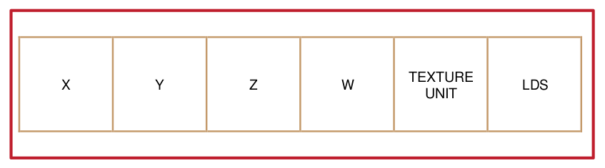

**Figure 2.4 Northern Islands Compute Unit Arrangement**

Table 2.5 provides a simplified picture showing the Southern Island compute unit arrangement.
 
.. image:: Opencl_optimization_images/2.5.png

**Figure 2.5 Southern Island Compute Unit Arrangement**

2.10 Device Parameters for Southern Islands Devices
---------------------------------------------------
The following table provides device-specific information for some AMD Southern Islands GPUs.

**Table 2.5 Parameters for AMD 7xxx Devices**

+-------------------------------+-----------+----------+--------------+-------------+------------+-----------+
|                               | Verde PRO | Verde XT | Pitcairn PRO | Pitcairn XT | Tahiti PRO | Tahiti XT |
+===============================+===========+==========+==============+=============+============+===========+
| Product Name (AMD Radeon™ HD) | 7750      | 7770     | 7850         | 7870        | 7950       | 7970      |
+-------------------------------+-----------+----------+--------------+-------------+------------+-----------+
| Engine Speed (MHz)            | 800       | 1000     | 860          | 1000        | 800        | 925       |
+-------------------------------+-----------+----------+--------------+-------------+------------+-----------+
| Compute Resources                                                                                          |
+-------------------------------+-----------+----------+--------------+-------------+------------+-----------+
| Compute Units                 | 8         | 10       | 16           | 20          | 28         | 32        |
+-------------------------------+-----------+----------+--------------+-------------+------------+-----------+
| Processing Elements           | 512       | 640      | 1024         | 1280        | 1792       | 2048      |
+-------------------------------+-----------+----------+--------------+-------------+------------+-----------+
| Peak Gflops                   | 819       | 1280     | 1761         | 2560        | 2867       | 3789      |
+-------------------------------+-----------+----------+--------------+-------------+------------+-----------+
| Cache and Register Sizes                                                                                   |
+-------------------------------+-----------+----------+--------------+-------------+------------+-----------+
| # of 32b Vector Registers/CU  | 65536     | 65536    | 65536        | 65536       | 65536      | 65536     |
+-------------------------------+-----------+----------+--------------+-------------+------------+-----------+
| Size of Vector Registers/CU   | 256 kB    | 256 kB   | 256 kB       | 256 kB      | 256 kB     | 256 kB    |
+-------------------------------+-----------+----------+--------------+-------------+------------+-----------+
| LDS Size/ CU                  | 64 kB     | 64 kB    | 64 kB        | 64 kB       | 64 kB      | 64 kB     |
+-------------------------------+-----------+----------+--------------+-------------+------------+-----------+
| LDS Banks / CU                | 32        | 32       | 32           | 32          | 32         | 32        |
+-------------------------------+-----------+----------+--------------+-------------+------------+-----------+
| Constant Cache / GPU          | 64 kB     | 64 kB    | 128 kB       | 128 kB      | 128 kB     | 128 kB    |
+-------------------------------+-----------+----------+--------------+-------------+------------+-----------+
| Max Constants / 4 CUs         | 16 kB     | 16 kB    | 16 kB        | 16 kB       | 16 kB      | 16 kB     |
+-------------------------------+-----------+----------+--------------+-------------+------------+-----------+
| L1 Cache Size / CU            | 16 kB     | 16 kB    | 16 kB        | 16 kB       | 16 kB      | 16 kB     |
+-------------------------------+-----------+----------+--------------+-------------+------------+-----------+
| L2 Cache Size / GPU           | 512 kB    | 512 kB   | 512 kB       | 512 kB      | 768 kB     | 768 kB    |
+-------------------------------+-----------+----------+--------------+-------------+------------+-----------+
| Peak GPU Bandwidths                                                                                        |
+-------------------------------+-----------+----------+--------------+-------------+------------+-----------+
| Register Read (GB/s)          | 4915      | 7680     | 10568        | 15360       | 17203      | 22733     |
+-------------------------------+-----------+----------+--------------+-------------+------------+-----------+
| LDS Read (GB/s)               | 819       | 1280     | 1761         | 2560        | 2867       | 3789      |
+-------------------------------+-----------+----------+--------------+-------------+------------+-----------+
| Constant Cache Read (GB/s)    | 102       | 160      | 220          | 320         | 358        | 474       |
+-------------------------------+-----------+----------+--------------+-------------+------------+-----------+
| L1 Read (GB/s)                | 410       | 640      | 881          | 1280        | 1434       | 1894      |
+-------------------------------+-----------+----------+--------------+-------------+------------+-----------+
| L2 Read (GB/s)                | 205       | 256      | 440          | 512         | 614        | 710       |
+-------------------------------+-----------+----------+--------------+-------------+------------+-----------+
| Global Memory (GB/s)          | 72        | 72       | 154          | 154         | 240        | 264       |
+-------------------------------+-----------+----------+--------------+-------------+------------+-----------+
| Global Limits                                                                                              |
+-------------------------------+-----------+----------+--------------+-------------+------------+-----------+
| Max Wavefronts / GPU          | 320       | 400      | 640          | 800         | 1120       | 1280      |
+-------------------------------+-----------+----------+--------------+-------------+------------+-----------+
| Max Wavefronts / CU (avg)     | 40        | 40       | 40           | 40          | 40         | 40        |
+-------------------------------+-----------+----------+--------------+-------------+------------+-----------+
| Max Work-Items / GPU          | 20480     | 25600    | 40960        | 51200       | 71680      | 81920     |
+-------------------------------+-----------+----------+--------------+-------------+------------+-----------+
| Memory                                                                                                     |
+-------------------------------+-----------+----------+--------------+-------------+------------+-----------+
| Memory Channels               | 4         | 4        | 8            | 8           | 12         | 12        |
+-------------------------------+-----------+----------+--------------+-------------+------------+-----------+
| Memory  Bus Width (bits)      | 128       | 128      | 256          | 256         | 384        | 384       |
+-------------------------------+-----------+----------+--------------+-------------+------------+-----------+
| Memory  Type and              | GDDR5     | GDDR5    | GDDR5        | GDDR5       | GDDR5      | GDDR5     |
+-------------------------------+-----------+----------+--------------+-------------+------------+-----------+
| Speed (MHZ)                   | 1125      | 1125     | 1200         | 1200        | 1250       | 1375      |
+-------------------------------+-----------+----------+--------------+-------------+------------+-----------+
| Frame Buffer                  | 1GB       | 1GB      | 2GB          | 1GB or 2GB  | 3GB        | 3GB       |
+-------------------------------+-----------+----------+--------------+-------------+------------+-----------+

Chapter 3 OpenCL Performance and Optimization for Evergreen and Northern Islands Devices
=========================================================================================

This chapter discusses performance and optimization when programming for AMD GPU compute devices that are part of the Southern Islands family, as well as CPUs and multiple devices. Details specific to the Evergreen and Northern Islands families of GPUs are provided in Chapter 2, "OpenCL Performance and Optimization for GCN Devices."

3.1 Global Memory Optimization
-------------------------------
Figure 3.1 is a block diagram of the GPU memory system. The up arrows are read paths, the down arrows are write paths. WC is the write combine cache.

The GPU consists of multiple compute units. Each compute unit contains 32 kB local (on-chip) memory, L1 cache, registers, and 16 processing element (PE). Each processing element contains a five-way (or four-way, depending on the GPU type) VLIW processor. Individual work-items execute on a single processing element; one or more work-groups execute on a single compute unit. On a GPU, hardware schedules the work-items. On the ATI Radeon™ HD 5000 series of GPUs, hardware schedules groups of work-items, called wavefronts, onto stream cores; thus, work-items within a wavefront execute in lock-step; the same instruction is executed on different data.

The L1 cache is 8 kB per compute unit. (For the ATI Radeon™ HD 5870 GPU, this means 160 kB for the 20 compute units.) The L1 cache bandwidth on the ATI Radeon™ HD 5870 GPU is one terabyte per second:

	L1 Bandwidth = Compute Units * Wavefront Size/Compute Unit * EngineClock

Multiple compute units share L2 caches.
The L2 cache size on the ATI Radeon™ HD 5870 GPUs is 512 kB:L2 Cache Size = Number or channels * L2 per Channel
The bandwidth between L1 caches and the shared L2 cache is 435 GB/s: 
  L2 Bandwidth = Number of channels * Wavefront Size * Engine Clock
 
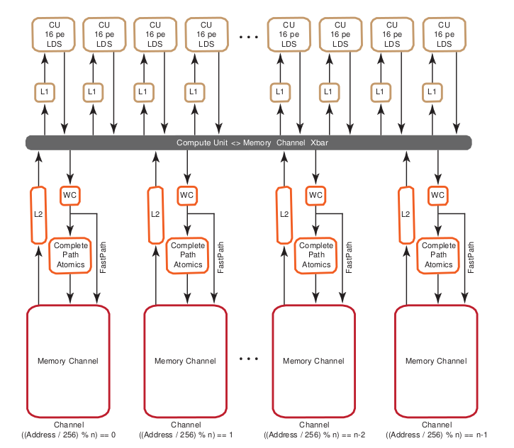

**Figure 3.1 Memory System**

The ATI Radeon™ HD 5870 GPU has eight memory controllers ("Memory Channel" in Figure 3.1). The memory controllers are connected to multiple banks of memory. The memory is GDDR5, with a clock speed of 1200 MHz and a data rate of 4800 Mb/pin. Each channel is 32-bits wide, so the peak bandwidth for the ATI Radeon™ HD 5870 GPU is: (8 memory controllers) * (4800 Mb/pin) * (32 bits) * (1 B/8b) = 154 GB/s

If two memory access requests are directed to the same controller, the hardware serializes the access. This is called a channel conflict. Similarly, if two memory access requests go to the same memory bank, hardware serializes the access. This is called a bank conflict. From a developer's point of view, there is not much difference between channel and bank conflicts. A large power of two stride results in a channel conflict; a larger power of two stride results in a bank conflict. The size of the power of two stride that causes a specific type of conflict depends on the chip. A stride that results in a channel conflict on a machine with eight channels might result in a bank conflict on a machine with four.

In this document, the term bank conflict is used to refer to either kind of conflict.

3.1.1 Two Memory Paths
++++++++++++++++++++++++

ATI Radeon™ HD 5000 series graphics processors have two, independent memory paths between the compute units and the memory:

* FastPath performs only basic operations, such as loads and stores (data sizes must be a multiple of 32 bits). This often is faster and preferred when there are no advanced operations.
* CompletePath, supports additional advanced operations, including atomics and sub-32-bit (byte/short) data transfers.

3.1.1.1 Performance Impact of FastPath and CompletePath
########################################################

There is a large difference in performance on ATI Radeon™ HD 5000 series hardware between FastPath and CompletePath. Figure 3.2 shows two kernels (one FastPath, the other CompletePath) and the delivered DRAM bandwidth for each kernel on the ATI Radeon™ HD 5870 GPU. Note that an atomic add forces CompletePath.

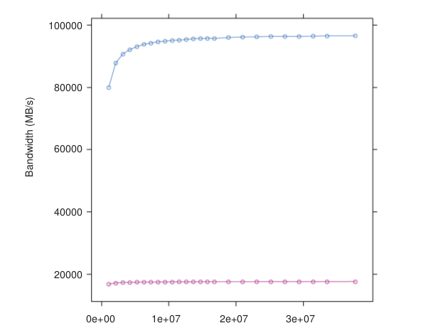

**Figure 3.2 FastPath (blue) vs CompletePath (red) Using float1**

.. [1] UAVs allow compute shaders to store results in (or write results to) a buffer at any arbitrary location.On DX11 hardware, UAVs can be created from buffers and textures. On DX10 hardware, UAVs can- not be created from typed resources (textures). This is the same as a random access target (RAT).

The kernel code follows. Note that the atomic extension must be enabled under OpenCL 1.0.
::
 
 __kernel void
 CopyFastPath(  global const float * input,
   global float * output)
 {
 int gid = get_global_id(0);
 output[gid] = input[gid];
 return ;
 }
   kernel void
 CopyComplete(  global const float * input,   global float* output)
 {
 int gid = get_global_id(0);
 if (gid <0){
 atom_add(( global int *) output,1);
 }
 output[gid] = input[gid];
 return ;
 } 

Table 3.1 lists the effective bandwidth and ratio to maximum bandwidth.

**Table 3.1 Bandwidths for 1D Copies**

================== =================== ========================
Kernel              EffectiveBandwidth  Ratio to PeakBandwidth
================== =================== ========================
copy 32-bit 1D FP       96 GB/s	       3%
------------------ ------------------- ------------------------
copy 32-bit 1D CP	    18 GB/s                12%
================== =================== ========================

The difference in performance between FastPath and CompletePath is significant. If your kernel uses CompletePath, consider if there is another way to approach the problem that uses FastPath. OpenCL read-only images always use FastPath.

3.1.1.2  Determining The Used Path
###################################
Since the path selection is done automatically by the OpenCL compiler, your kernel may be assigned to CompletePath. This section explains the strategy the compiler uses, and how to find out what path was used.

The compiler is conservative when it selects memory paths. The compiler often maps all user data into a single unordered access view (UAV),[1] so a single atomic operation (even one that is not executed) may force all loads and stores to use CompletePath.

The effective bandwidth listing above shows two OpenCL kernels and the associated performance. The first kernel uses the FastPath while the second uses the CompletePath. The second kernel is forced to CompletePath because in CopyComplete, the compiler noticed the use of an atomic.

There are two ways to find out which path is used. The first method uses the CodeXL GPU Profiler, which provides the following three performance counters for this purpose:

 1. FastPath counter: The total bytes written through the FastPath (no atomics,32-bit types only).
 2. CompletePath counter: The total bytes read and written through the CompletePath (supports atomics and  non-32-bit types).
 3. PathUtilization counter: The percentage of bytes read and written through the FastPath or CompletePath compared to the total number of bytes transferred over the bus.

The second method is static and lets you determine the path by looking at a machine-level ISA listing (using the AMD CodeXL Static Kernel Analyzer in OpenCL).
::
 
 MEM_RAT_CACHELESS -> FastPath
 MEM_RAT -> CompPath
 MEM_RAT_NOP_RTN -> Comp_load

FastPath operations appear in the listing as::

 ...
 TEX: ...
 ... VFETCH ...
 ... MEM_RAT_CACHELESS_STORE_RAW: ...
 ... 
 

The ``vfetch` Instruction is a load type that in graphics terms is called vertex a fetch (the group control TEX indicates that the load uses the L1 cache.)
The instruction ``MEM_RAT_CACHELESS`` indicates that FastPath operations are used. Loads in CompletePath are a split-phase operation. In the first phase, hardware copies the old value of a memory location into a special buffer. This is done by performing atomic operations on the memory location. After the value has reached the buffer, a normal load is used to read the value. Note that RAT stands for random access target, which is the same as an unordered access view (UAV); it allows, on DX11 hardware, writes to, and reads from, any arbitrary location in a buffer.

The listing shows::

 .. MEM_RAT_NOP_RTN_ACK: RAT(1)
 .. WAIT_ACK: Outstanding_acks <= 0
 .. TEX: ADDR(64) CNT(1)
 .. VFETCH ...

The instruction sequence means the following:

**MEM_RAT** - Read into a buffer using CompletePath, do no operation on the memory location, and send an ACK when done.

**WAIT_ACK** - Suspend execution of the wavefront until the ACK is received. If there is other work pending this might be free, but if there is no other work to be done this could take 100's of cycles.

**TEX** - Use the L1 cache for the next instruction.

**VFETCH** - Do a load instruction to (finally) get the value.
 

Stores appear as:
::

 .. MEM_RAT_STORE_RAW: RAT(1)

The instruction ``MEM_RAT_STORE`` is the store along the CompletePath. ``MEM_RAT`` means CompletePath; ``MEM_RAT_CACHELESS`` means FastPath.

3.1.2 Channel Conflicts
++++++++++++++++++++++++
The important concept is memory stride: the increment in memory address, measured in elements, between successive elements fetched or stored by consecutive work-items in a kernel. Many important kernels do not exclusively use simple stride one accessing patterns; instead, they feature large non-unit strides. For instance, many codes perform similar operations on each dimension of a two- or three-dimensional array. Performing computations on the low dimension can often be done with unit stride, but the strides of the computations in the other dimensions are typically large values. This can result in significantly degraded performance when the codes are ported unchanged to GPU systems. A CPU with caches presents the same problem, large power-of-two strides force data into only a few cache lines.

One solution is to rewrite the code to employ array transpositions between the kernels. This allows all computations to be done at unit stride. Ensure that the time required for the transposition is relatively small compared to the time to perform the kernel calculation.

For many kernels, the reduction in performance is sufficiently large that it is worthwhile to try to understand and solve this problem.

In GPU programming, it is best to have adjacent work-items read or write adjacent memory addresses. This is one way to avoid channel conflicts.

When the application has complete control of the access pattern and address generation, the developer must arrange the data structures to minimize bank conflicts. Accesses that differ in the lower bits can run in parallel; those that differ only in the upper bits can be serialized.

In this example::

 for (ptr=base; ptr<max; ptr += 16KB) 
  R0 = *ptr ;

where the lower bits are all the same, the memory requests all access the same bank on the same channel and are processed serially.

This is a low-performance pattern to be avoided. When the stride is a power of 2 (and larger than the channel interleave), the loop above only accesses one channel of memory.
 
The hardware byte address bits are:

+------+--------------------+----------------+----------------+
| 31:x | bank               | channel        | 7:0 address    |
+------+--------------------+----------------+----------------+

* On all ATI Radeon™ HD 5000-series GPUs, the lower eight bits select an element within a channel.
* The next set of bits select the channel. The number of channel bits varies, since the number of channels is not the same on all parts. With eight channels, three bits are used to select the channel; with two channels, a single bit is used.
* The next set of bits selects the memory bank. The number of bits used depends on the number of memory banks.
* The remaining bits are the rest of the address.

On the ATI Radeon™ HD 5870 GPU, the channel selection are bits 10:8 of the byte address. This means a linear burst switches channels every 256 bytes. Since the wavefront size is 64, channel conflicts are avoided if each work-item in a wave reads a different address from a 64-word region. All ATI Radeon™ HD 5000 series GPUs have the same layout: channel ends at bit 8, and the memory bank is to the left of the channel.

A burst of 2kB (8 * 256 bytes) cycles through all the channels.

When calculating an address as y*width+x, but reading a burst on a column (incrementing y), only one memory channel of the system is used, since the width is likely a multiple of 256 words = 2048 bytes. If the width is an odd multiple of 256B, then it cycles through all channels.

Similarly, the bank selection bits on the ATI Radeon™ HD 5870 GPU are bits 14:11, so the bank switches every 2 kB. A linear burst of 32 kB cycles through all banks and channels of the system. If accessing a 2D surface along a column, with a y*width+x calculation, and the width is some multiple of 2 kB dwords (32 kB), then only 1 bank and 1 channel are accessed of the 16 banks and 8 channels available on this GPU.

All ATI Radeon™ HD 5000-series GPUs have an interleave of 256 bytes (64 dwords).

If every work-item in a work-group references consecutive memory addresses and the address of work-item 0 is aligned to 256 bytes and each work-item fetches 32 bits, the entire wavefront accesses one channel. Although this seems slow, it actually is a fast pattern because it is necessary to consider the memory access over the entire device, not just a single wavefront.

One or more work-groups execute on each compute unit. On the ATI Radeon™ HD 5000-series GPUs, work-groups are dispatched in a linear order, with x changing most rapidly. For a single dimension, this is:

**DispatchOrder = get_group_id(0)**
 
For two dimensions, this is:

**DispatchOrder = get_group_id(0) + get_group_id(1) * get_num_groups(0)**

This is row-major-ordering of the blocks in the index space. Once all compute units are in use, additional work-groups are assigned to compute units as needed. Work-groups retire in order, so active work-groups are contiguous.

At any time, each compute unit is executing an instruction from a single wavefront. In memory intensive kernels, it is likely that the instruction is a memory access. Since there are eight channels on the ATI Radeon™ HD 5870 GPU, at most eight of the compute units can issue a memory access operation in one cycle. It is most efficient if the accesses from eight wavefronts go to different channels. One way to achieve this is for each wavefront to access consecutive groups of 256 = 64 * 4 bytes.

An inefficient access pattern is if each wavefront accesses all the channels. This is likely to happen if consecutive work-items access data that has a large power of two strides.

In the next example of a kernel for copying, the input and output buffers are interpreted as though they were 2D, and the work-group size is organized as 2D.

The kernel code is::

 #define WIDTH 1024
 #define DATA_TYPE float
 #define A(y , x ) A[ (y) * WIDTH + (x ) ]
 #define C(y , x ) C[ (y) * WIDTH+(x ) ]
 kernel void copy_float (  global const
 DATA_TYPE * A,
   global DATA_TYPE* C)
 {
 int idx = get_global_id(0);
 int idy = get_global_id(1);
 C(idy, idx) = A( idy, idx);
 } 

By changing the width, the data type and the work-group dimensions, we get a set of kernels out of this code.

Given a 64x1 work-group size, each work-item reads a consecutive 32-bit address. Given a 1x64 work-group size, each work-item reads a value separated by the width in a power of two bytes.

Table 3.2 shows how much the launch dimension can affect performance. It lists each kernel's effective bandwidth and ratio to maximum bandwidth.

**Table 3.2	Bandwidths for Different Launch Dimensions**

==================== ====================== ==========================
 Kernel                Effective Bandwidth   Ratio to Peak Bandwidth
==================== ====================== ==========================
 copy 32-bit 1D FP	        96 GB/s	              63%
 copy 32-bit 1D CP          18 GB/s	              12% 
 copy 32-bit 2D	      .3 - 93 GB/s 	             0 - 60% 
 copy 128-bit 2D	      7 - 122 GB/s	             5 - 80%
==================== ====================== ==========================

To avoid power of two strides:

* Add an extra column to the data matrix.
* Change the work-group size so that it is not a power of 21.
* It is best to use a width that causes a rotation through all of the memory channels, instead of using the same one repeatedly.
* Change the kernel to access the matrix with a staggered offset.

3.1.2.1 Staggered Offsets
##########################
Staggered offsets apply a coordinate transformation to the kernel so that the data is processed in a different order. Unlike adding a column, this technique does not use extra space. It is also relatively simple to add to existing code.

Figure 3.3 illustrates the transformation to staggered offsets.

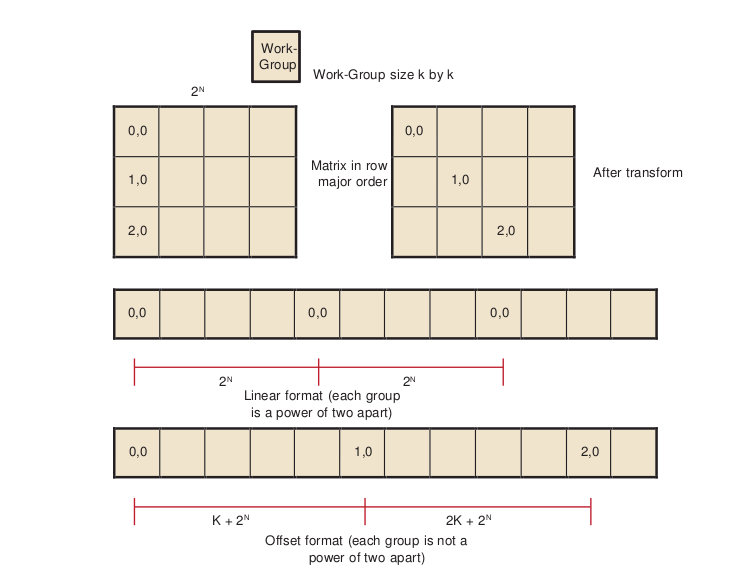

**Figure 3.3 Transformation to Staggered Offsets**

.. [1] Generally, it is not a good idea to make the work-group size something other than an integer multiple of the wavefront size, but that usually is less important than avoiding channel conflicts.
 

The global ID values reflect the order that the hardware initiates work-groups. The values of get group ID are in ascending launch order.
::
 global_id(0) = get_group_id(0) * get_local_size(0) + get_local_id(0)
 global_id(1) = get_group_id(1) * get_local_size(1) + get_local_id(1)

The hardware launch order is fixed, but it is possible to change the launch order, as shown in the following example.

Assume a work-group size of k x k, where k is a power of two, and a large 2D matrix of size 2n x 2m in row-major order. If each work-group must process a block in column-order, the launch order does not work out correctly: consecutive work-groups execute down the columns, and the columns are a large power-of- two apart; so, consecutive work-groups access the same channel.

By introducing a transformation, it is possible to stagger the work-groups to avoid channel conflicts. Since we are executing 2D work-groups, each work group is identified by four numbers.
1.``get_group_id(0)`` - the x coordinate or the block within the column of the matrix.
2.``get_group_id(1)`` - the y coordinate or the block within the row of the matrix.
3.``get_global_id(0)`` - the x coordinate or the column of the matrix.
4.``get_global_id(1)`` - the y coordinate or the row of the matrix.

To transform the code, add the following four lines to the top of the kernel.
::
 get_group_id_0 = get_group_id(0);
 get_group_id_1 = (get_group_id(0) + get_group_id(1)) % get_local_size(0);
 get_global_id_0 = get_group_id_0 * get_local_size(0) + get_local_id(0);
 get_global_id_1 = get_group_id_1 * get_local_size(1) + get_local_id(1);

Then, change the global IDs and group IDs to the staggered form. The result is::
 
 __kernel void
 copy_float (
  __global const DATA_TYPE * A,
  __global DATA_TYPE * C)
 {
  size_t get_group_id_0 = get_group_id(0);
  size_t get_group_id_1 = (get_group_id(0) + get_group_id(1)) % get_local_size(0);
  size_t get_global_id_0 = get_group_id_0 * get_local_size(0) + get_local_id(0);
  size_t get_global_id_1 = get_group_id_1 * get_local_size(1) + get_local_id(1); 
  int idx = get_global_id_0; //changed to staggered form int idy = get_global_id_1; //changed to staggered form
 
  C(idy , idx) = A( idy , idx);
 
 }

3.1.2.2 Reads Of The Same Address
##################################
Under certain conditions, one unexpected case of a channel conflict is that reading from the same address is a conflict, even on the FastPath.
 
This does not happen on the read-only memories, such as constant buffers, textures, or shader resource view (SRV); but it is possible on the read/write UAV memory or OpenCL global memory.

From a hardware standpoint, reads from a fixed address have the same upper bits, so they collide and are serialized. To read in a single value, read the value
in a single work-item, place it in local memory, and then use that location:
 
**Avoid:**
	``temp = input[3] // if input is from global space``

**Use:**
	 if (get_local_id(0) == 0) 
	 {
	 local = input[3]
 	 }
	barrier(CLK_LOCAL_MEM_FENCE);
	temp = local

3.1.3 Float4 Or Float1
+++++++++++++++++++++++
The internal memory paths on ATI Radeon™ HD 5000-series devices support 128-bit transfers. This allows for greater bandwidth when transferring data in float4 format. In certain cases (when the data size is a multiple of four), float4 operations are faster.

The performance of these kernels can be seen in Figure 3.4. Change to float4 after eliminating the conflicts.

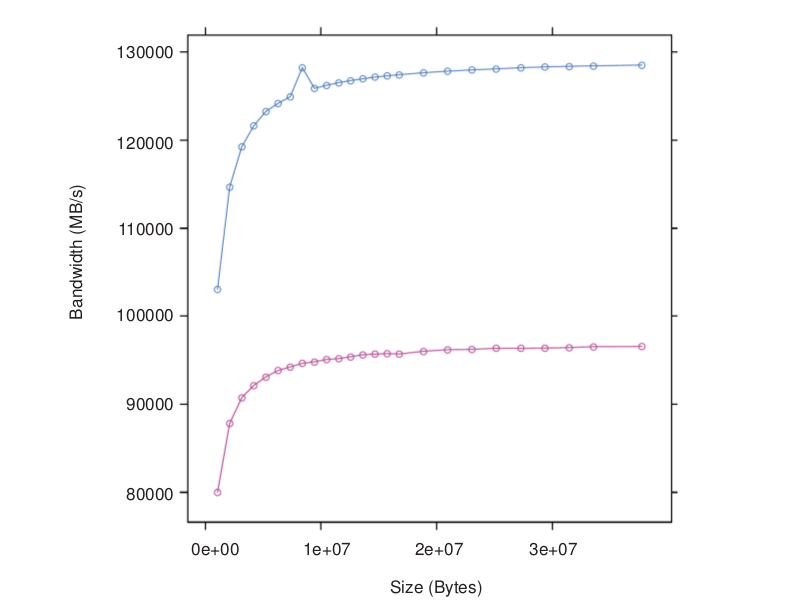

**Figure 3.4 Two Kernels: One Using float4 (blue), the Other float1 (red)**

The following code example has two kernels, both of which can do a simple copy, but Copy4 uses float4 data types.
::
   kernel void
 Copy4(  global const float4 * input,
   global float4 * output)
 {
 int gid = get_global_id(0);
 output[gid] = input[gid];
 return;
 }
   kernel void
 Copy1(  global const float * input,
   global float * output)
 {
 int gid = get_global_id(0);
 output[gid] = input[gid];
 return;
 }

Copying data as float4 gives the best result: 84% of absolute peak. It also speeds up the 2D versions of the copy (see  Table 3.3).

**Table 3.3 Bandwidths Including float1 and float4**

==================== ======================= ==========================
    Kernel             Effective Bandwidth    Ratio to Peak Bandwidth
==================== ======================= ==========================
 copy 32-bit 1D FP           96 GB/s                    63% 
 copy 32-bit 1D CP	         18 GB/s                    12% 
 copy 32-bit 2D	       .3 - 93 GB/s                0 - 61%
 copy 128-bit 2D	       7 - 122 GB/s	               5 - 80%
 copy4 float4 1D FP	        127 GB/s	                83%
==================== ======================= ==========================

3.1.4 Coalesced Writes
+++++++++++++++++++++++

On some other vendor devices, it is important to reorder your data to use coalesced writes. The ATI Radeon™ HD 5000-series devices also support coalesced writes, but this optimization is less important than other considerations, such as avoiding bank conflicts.

In non-coalesced writes, each compute unit accesses the memory system in quarter-wavefront units. The compute unit transfers a 32-bit address and one element-sized piece of data for each work-item. This results in a total of 16 elements + 16 addresses per quarter-wavefront. On ATI Radeon™ HD 5000-series devices, processing quarter-wavefront requires two cycles before the data is transferred to the memory controller.

In coalesced writes, the compute unit transfers one 32-bit address and 16 element-sized pieces of data for each quarter-wavefront, for a total of 16 elements +1 address per quarter-wavefront. For coalesced writes, processing quarter-wavefront takes one cycle instead of two. While this is twice as fast, the times are small compared to the rate the memory controller can handle the data. See Figure 3.5.
 
On ATI Radeon™ HD 5000-series devices, the coalescing is only done on the FastPath because it supports only 32-bit access.

If a work-item does not write, coalesce detection ignores it.

The first kernel Copy1 maximizes coalesced writes: work-item k writes to address k. The second kernel writes a shifted pattern: In each quarter-wavefront of 16 work-items, work-item k writes to address k-1, except the first work-item in each quarter-wavefront writes to address k+16. There is not enough order here to coalesce on some other vendor machines. Finally, the third kernel has work-item k write to address k when k is even, and write address 63-k when k is odd. This pattern never coalesces.

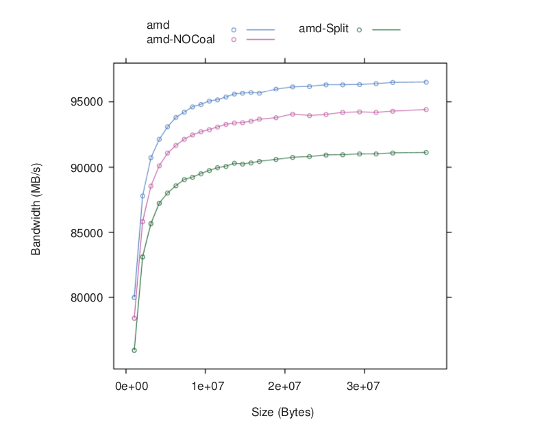

**Figure 3.5 Effect of Varying Degrees of Coalescing - Coal (blue), NoCoal red), Split (green)**

Write coalescing can be an important factor for AMD GPUs.

The following are sample kernels with different coalescing patterns.
::
 // best access pattern
   kernel void
 Copy1(  global const float * input,   global float * output)
 {
 uint gid = get_global_id(0); output[gid] = input[gid]; return;
 }
   
 
   kernel void NoCoal (  global const float * input,
   global float * output)
 // (shift by 16)
 {
 int gid = get_global_id(0)-1;
 if((get_local_id(0) & 0xf) == 0)
 {
 gid = gid +16;
 }
 output[gid] = input[gid];
 return;
 }
   kernel void
 // inefficient pattern
 Split ( global const float * input,   global float * output)
 {
 int gid = get_global_id(0);
 if((gid & 0x1) == 0) {
 gid = (gid & (˜63)) +62 - get_local_id(0);
 }
 output[gid] = input[gid];
 return;
 }
    
 
Table 3.4 lists the effective bandwidth and ratio to maximum bandwidth for each kernel type.

**Table 3.4 Bandwidths Including Coalesced Writes**

===================== ========================== ============================
   Kernel                  Effective Bandwidth      Ratio to Peak Bandwidth
===================== ========================== ============================
 copy 32-bit 1D FP              96 GB/s                     63%
 copy 32-bit 1D CP		  18 GB/s	                    12%
 copy 32-bit 2D	          .3 - 93 GB/s	         0 - 61% 
 copy 128-bit 2D	           7 - 122 GB/s	         5 - 80% 
 copy4 float4 1D FP		 127 GB/s	                    83% 
 Coal 32-bit                    97 GB/s                     63%
 NoCoal 32-bit		  93 GB/s	                    61% 
 Split 32-bit		  90 GB/s	                    59%
===================== ========================== ============================

There is not much performance difference, although the coalesced version is slightly faster.

3.1.5 Alignment
++++++++++++++++
The program in Figure 3.6 shows how the performance of a simple, unaligned access (float1) of this kernel varies as the size of offset varies. Each transfer was large (16 MB). The performance gain by adjusting alignment is small, so generally this is not an important consideration on AMD GPUs.
 
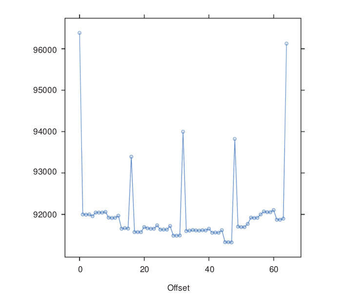

**Figure 3.6 Unaligned Access Using float1**

::
  __kernel void
  CopyAdd(global const float * input,
  __global float * output,
 const int offset)
 {
 int gid = get_global_id(0)+ offset;
 output[gid] = input[gid];
 return;
 }

Table 3.5 lists the effective bandwidth and ratio to maximum bandwidth for each kernel type.

**Table 3.5 Bandwidths Including Unaligned Access**

====================== ========================== ===========================
 Kernel                    Effective Bandwidth       Ratio to Peak Bandwidth
====================== ========================== ===========================
 copy 32-bit 1D FP              96 GB/s                      63%
 copy 32-bit 1D CP              18 GB/s                      12%
 copy 32-bit 2D                .3 - 93 GB/s                 0 - 61%
 copy 128-bit 2D                7 - 122 GB/s                5 - 80%
 copy4 float4 1D FP            127 GB/s                      83%
 Coal                             97                      	 63%
 NoCoal 32-bit                  90 GB/s                      59%
 Split 32-bit                   90 GB/s                      59%
 CopyAdd 32-bit                 92 GB/s                      60%
====================== ========================== ===========================
			 

3.1.6 Summary of Copy Performance
++++++++++++++++++++++++++++++++++

The performance of a copy can vary greatly, depending on how the code is written. The measured bandwidth for these copies varies from a low of 0.3 GB/s, to a high of 127 GB/s.

The recommended order of steps to improve performance is:

 1. Examine the code to ensure you are using FastPath, not CompletePath, everywhere possible. Check carefully to see if you are minimizing the number of kernels that use CompletePath operations. You might be able to use textures, image-objects, or constant buffers to help.
 2. Examine the data-set sizes and launch dimensions to see if you can eliminate bank conflicts.
 3. Try to use float4 instead of float1.
 4. Try to change the access pattern to allow write coalescing. This is important on some hardware platforms, but only of limited importance for AMD GPU devices.
 5. Finally, look at changing the access pattern to allow data alignment.

3.2 Local Memory (LDS) Optimization
------------------------------------
AMD Evergreen GPUs include a Local Data Store (LDS) cache, which accelerates local memory accesses. LDS is not supported in OpenCL on AMD R700-family GPUs. LDS provides high-bandwidth access (more than 10X higher than global memory), efficient data transfers between work-items in a work- group, and high-performance atomic support. Local memory offers significant advantages when the data is re-used; for example, subsequent accesses can read from local memory, thus reducing global memory bandwidth. Another advantage is that local memory does not require coalescing.

To determine local memory size::
 
 clGetDeviceInfo( ..., CL_DEVICE_LOCAL_MEM_SIZE, ... );

All AMD Evergreen GPUs contain a 32K LDS for each compute unit. On high- end GPUs, the LDS contains 32-banks, each bank is four bytes wide and 256 bytes deep; the bank address is determined by bits 6:2 in the address. On lower- end GPUs, the LDS contains 16 banks, each bank is still 4 bytes in size, and the bank used is determined by bits 5:2 in the address. As shown below, programmers should carefully control the bank bits to avoid bank conflicts as much as possible.

In a single cycle, local memory can service a request for each bank (up to 32 accesses each cycle on the ATI Radeon™ HD 5870 GPU). For an ATI Radeon™ HD 5870 GPU, this delivers a memory bandwidth of over 100 GB/s for each compute unit, and more than 2 TB/s for the whole chip. This is more than 14X the global memory bandwidth. However, accesses that map to the same bank are serialized and serviced on consecutive cycles. A wavefront that generates bank conflicts stalls on the compute unit until all LDS accesses have completed. The GPU reprocesses the wavefront on subsequent cycles, enabling only the lanes receiving data, until all the conflicting accesses complete. The bank with the most conflicting accesses determines the latency for the wavefront to complete the local memory operation. The worst case occurs when all 64 work- items map to the same bank, since each access then is serviced at a rate of one per clock cycle; this case takes 64 cycles to complete the local memory access for the wavefront. A program with a large number of bank conflicts (as measured by the LDSBankConflict performance counter) might benefit from using the constant or image memory rather than LDS.

Thus, the key to effectively using the local cache memory is to control the access pattern so that accesses generated on the same cycle map to different banks in the local memory. One notable exception is that accesses to the same address (even though they have the same bits 6:2) can be broadcast to all requestors and do not generate a bank conflict. The LDS hardware examines the requests generated over two cycles (32 work-items of execution) for bank conflicts. Ensure, as much as possible, that the memory requests generated from a quarter-wavefront avoid bank conflicts by using unique address bits 6:2. A simple sequential address pattern, where each work-item reads a float2 value from LDS, generates a conflict-free access pattern on the ATI Radeon™ HD 5870 GPU. Note that a sequential access pattern, where each work-item reads a float4 value from LDS, uses only half the banks on each cycle on the ATI Radeon™ HD 5870 GPU and delivers half the performance of the float access pattern.

Each stream processor can generate up to two 4-byte LDS requests per cycle. Byte and short reads consume four bytes of LDS bandwidth. Since each stream processor can execute five operations (or four, depending on the GPU type) in the VLIW each cycle (typically requiring 10-15 input operands), two local memory requests might not provide enough bandwidth to service the entire instruction. Developers can use the large register file: each compute unit has 256 kB of register space available (8X the LDS size) and can provide up to twelve 4-byte values/cycle (6X the LDS bandwidth). Registers do not offer the same indexing flexibility as does the LDS, but for some algorithms this can be overcome with loop unrolling and explicit addressing.

LDS reads require one ALU operation to initiate them. Each operation can initiate two loads of up to four bytes each.

The CodeXL GPU Profiler provides the following performance counter to help optimize local memory usage:
	**LDSBankConflict :** The percentage of time accesses to the LDS are stalled due to bank conflicts relative to GPU Time. In the ideal case, there are no bank conflicts in the local memory access, and this number is zero.

Local memory is software-controlled "scratchpad" memory. In contrast, caches typically used on CPUs monitor the access stream and automatically capture recent accesses in a tagged cache. The scratchpad allows the kernel to explicitly load items into the memory; they exist in local memory until the kernel replaces them, or until the work-group ends. To declare a block of local memory, use the ``__local`` keyword; for example: ``__local float localBuffer[64]``

These declarations can be either in the parameters to the kernel call or in the body of the kernel. The ``__local`` syntax allocates a single block of memory, which is shared across all work-items in the workgroup.

To write data into local memory, write it into an array allocated with ``__local``. For example: ``localBuffer[i] = 5.0;``

A typical access pattern is for each work-item to collaboratively write to the local memory: each work-item writes a subsection, and as the work-items execute in parallel they write the entire array. Combined with proper consideration for the access pattern and bank alignment, these collaborative write approaches can lead to highly efficient memory accessing. Local memory is consistent across work-items only at a work-group barrier; thus, before reading the values written collaboratively, the kernel must include a ``barrier()`` instruction.

The following example is a simple kernel section that collaboratively writes, then reads from, local memory::

 __kernel void localMemoryExample (  global float *In,  global float *Out) {
 __local float localBuffer[64];
 uint tx = get_local_id(0);
 uint gx = get_global_id(0); 
 
 // Initialize local memory:
 // Copy from this work-group's section of global memory to local:
 // Each work-item writes one element; together they write it all
 localBuffer[tx] = In[gx]; 
 
 // Ensure writes have completed:
 barrier(CLK_LOCAL_MEM_FENCE); 
 
 // Toy computation to compute a partial factorial, shows re-use from local float f = localBuffer[tx];
 for (uint i=tx+1; i<64; i++) {
 f *= localBuffer[i];
 }
 Out[gx] = f;
 } 

.. Note:: the host code cannot read from, or write to, local memory. Only the kernel can access local memory.

Local memory is consistent across work-items only at a work-group barrier; thus, before reading the values written collaboratively, the kernel must include a ``barrier()`` instruction. An important optimization is the case where the local work-group size is less than, or equal to, the wavefront size. Because the wavefront executes as an atomic unit, the explicit barrier operation is not required. The compiler automatically removes these barriers if the kernel specifies a ``reqd_work_group_size``

(see section 5.8 of the OpenCL Specification) that is less than the wavefront size. Developers are strongly encouraged to include the barriers where appropriate, and rely on the compiler to remove the barriers when possible, rather than manually removing the ``barriers()``. This technique results in more portable code, including the ability to run kernels on CPU devices.

3.3 Constant Memory Optimization
---------------------------------

The AMD implementation of OpenCL provides three levels of performance for the "constant" memory type.

1. Simple Direct-Addressing Patterns
  Very high bandwidth can be attained when the compiler has available the constant address at compile time and can embed the constant address into the instruction. Each processing element can load up to 4x4-byte direct- addressed constant values each cycle. Typically, these cases are limited to simple non-array constants and function parameters. The GPU loads the constants into a hardware cache at the beginning of the clause that uses the constants. The cache is a tagged cache, typically each 8k blocks is shared among four compute units. If the constant data is already present in the constant cache, the load is serviced by the cache and does not require any global memory bandwidth. The constant cache size for each device varies from 4k to 48k per GPU.

2. Same Index
  Hardware acceleration also takes place when all work-items in a wavefront reference the same constant address. In this case, the data is loaded from memory one time, stored in the L1 cache, and then broadcast to all wave- fronts. This can reduce significantly the required memory bandwidth.
3. Varying Index
  More sophisticated addressing patterns, including the case where each work- item accesses different indices, are not hardware accelerated and deliver the same performance as a global memory read with the potential for cache hits.

To further improve the performance of the AMD OpenCL stack, two methods allow users to take advantage of hardware constant buffers. These are:

1. Globally scoped constant arrays. These arrays are initialized, globally scoped, and in the constant address space (as specified in section 6.5.3 of the OpenCL specification). If the size of an array is below 64 kB, it is placed in hardware constant buffers; otherwise, it uses global memory. An example of this is a lookup table for math functions.
2. Per-pointer attribute specifying the maximum pointer size. This is specified using the max_constant_size(N) attribute. The attribute form conforms to section 6.10 of the OpenCL 1.0 specification. This attribute is restricted to top-level kernel function arguments in the constant address space. This restriction prevents a pointer of one size from being passed as an argument to a function that declares a different size. It informs the compiler that indices into the pointer remain inside this range and it is safe to allocate a constant buffer in hardware, if it fits. Using a constant pointer that goes outside of this range results in undefined behavior. All allocations are aligned on the 16-byte boundary. 

For example::
 
 kernel void mykernel(global int* a,
 constant int* b   attribute__((max_constant_size (65536)))
 )
 {
 size_t idx = get_global_id(0);
 a[idx] = b[idx & 0x3FFF];
 } 
 

A kernel that uses constant buffers must use CL_DEVICE_MAX_CONSTANT_ARGS to query the device for the maximum number of constant buffers the kernel can support. This value might differ from the maximum number of hardware constant buffers available. In this case, if the number of hardware constant buffers is less than the CL_DEVICE_MAX_CONSTANT_ARGS, the compiler allocates the largest constant buffers in hardware first and allocates the rest of the constant buffers in global memory. As an optimization, if a constant pointer **A** uses n bytes of memory, where n is less than 64 kB, and constant pointer **B** uses m bytes of memory, where m is less than (64 kB - n) bytes of memory, the compiler can allocate the constant buffer pointers in a single hardware constant buffer. This optimization can be applied recursively by treating the resulting allocation as a single allocation and finding the next smallest constant pointer that fits within the space left in the constant buffer.

3.4 OpenCL Memory Resources: Capacity and Performance
------------------------------------------------------

Table 3.6 summarizes the hardware capacity and associated performance for the structures associated with the five OpenCL Memory Types. This information
specific to the ATI Radeon™ HD5870 GPUs with 1 GB video memory.

**Table 3.6 Hardware Performance Parameters**

+--------------------+---------------------------+---------+----------+----------------------------------+
| OpenCL Memory Type | Hardware Resource         | Size/CU | Size/GPU | Peak Read Bandwidth/ Stream Core |
+====================+===========================+=========+==========+==================================+
| Private            | GPRs                      | 256k    | 5120k    | 48 bytes/cycle                   |
+--------------------+---------------------------+---------+----------+----------------------------------+
| Local              | LDS                       | 32k     | 640k     | 8 bytes/cycle                    |
+--------------------+---------------------------+---------+----------+----------------------------------+
| Constant           | Direct-addressed constant |         | 48k      | 16 bytes/cycle                   |
+                    +---------------------------+         +----------+----------------------------------+
|                    | Same-indexed constant     |         |          | 4 bytes/cycle                    |
+                    +---------------------------+         +----------+----------------------------------+
|                    | Varying-indexed constant  |         |          | ~0.6 bytes/cycle                 |
+--------------------+---------------------------+---------+----------+----------------------------------+
| Images             | L1 Cache                  | 8k      | 160k     | 4 bytes/cycle                    |
+                    +---------------------------+---------+----------+----------------------------------+
|                    | L2 Cache                  |         | 512k     | ~1.6 bytes/cycle                 |
+--------------------+---------------------------+---------+----------+----------------------------------+
| Global             | Global Memory             |         | 1G       | ~0.6 bytes/cycle                 |
+--------------------+---------------------------+---------+----------+----------------------------------+

The compiler tries to map private memory allocations to the pool of GPRs in the GPU. In the event GPRs are not available, private memory is mapped to the "scratch" region, which has the same performance as global memory. Section 3.6.2, "Resource Limits on Active Wavefronts", has more information on register allocation and identifying when the compiler uses the scratch region. GPRs provide the highest-bandwidth access of any hardware resource. In addition to reading up to 48 bytes/cycle from the register file, the hardware can access results produced in the previous cycle (through the Previous Vector/Previous Scalar register) without consuming any register file bandwidth. GPRs have some restrictions about which register ports can be read on each cycle; but generally, these are not exposed to the OpenCL programmer.

Same-indexed constants can be cached in the L1 and L2 cache. Note that "same-indexed" refers to the case where all work-items in the wavefront reference the same constant index on the same cycle. The performance shown assumes an L1 cache hit.

Varying-indexed constants use the same path as global memory access and are subject to the same bank and alignment constraints described in Section 3.1, "Global Memory Optimization".

The L1 and L2 caches are currently only enabled for images and same-indexed constants. Read only buffers can be cached in L1 and L2. To enable this, the developer must indicate to the compiler that the buffer is read only and does not alias with other buffers. For example, use::
 
 kernel void mykernel(  global int const * restrict mypointerName)

The ``const`` indicates to the compiler that mypointerName is read only from the kernel, and the ``restrict`` attribute indicates to the compiler that no other pointer aliases with ``mypointerName``.

The L1 cache can service up to four address request per cycle, each delivering up to 16 bytes. The bandwidth shown assumes an access size of 16 bytes; smaller access sizes/requests result in a lower peak bandwidth for the L1 cache. Using float4 with images increases the request size and can deliver higher L1 cache bandwidth.

Each memory channel on the GPU contains an L2 cache that can deliver up to 64 bytes/cycle. The ATI Radeon™ HD 5870 GPU has eight memory channels; thus, it can deliver up to 512bytes/cycle; divided among 320 stream cores, this provides up to ~1.6 bytes/cycle for each stream core.

Global Memory bandwidth is limited by external pins, not internal bus bandwidth. The ATI Radeon™ HD 5870 GPU supports up to 153 GB/s of memory bandwidth which is an average of 0.6 bytes/cycle for each stream core.

Note that Table 3.6 shows the performance for the ATI Radeon™ HD 5870 GPU. The "Size/Compute Unit" column and many of the bandwidths/processing element apply to all Evergreen-class GPUs; however, the "Size/GPU" column and the bandwidths for varying-indexed constant, L2, and global memory vary across different GPU devices.
 

3.5 Using LDS or L1 Cache
--------------------------

There are a number of considerations when deciding between LDS and L1 cache for a given algorithm.

LDS supports read/modify/write operations, as well as atomics. It is well-suited for code that requires fast read/write, read/modify/write, or scatter operations that otherwise are directed to global memory. On current AMD hardware, L1 is part of the read path; hence, it is suited to cache-read-sensitive algorithms, such as matrix multiplication or convolution.

LDS is typically larger than L1 (for example: 32 kB vs 8 kB on Cypress). If it is not possible to obtain a high L1 cache hit rate for an algorithm, the larger LDS size can help. The theoretical LDS peak bandwidth is 2 TB/s, compared to L1 at 1 TB/sec. Currently, OpenCL is limited to 1 TB/sec LDS bandwidth.

The native data type for L1 is a four-vector of 32-bit words. On L1, fill and read addressing are linked. It is important that L1 is initially filled from global memory with a coalesced access pattern; once filled, random accesses come at no extra processing cost.

Currently, the native format of LDS is a 32-bit word. The theoretical LDS peak bandwidth is achieved when each thread operates on a two-vector of 32-bit words (16 threads per clock operate on 32 banks). If an algorithm requires coalesced 32-bit quantities, it maps well to LDS. The use of four-vectors or larger can lead to bank conflicts.

From an application point of view, filling LDS from global memory, and reading from it, are independent operations that can use independent addressing. Thus, LDS can be used to explicitly convert a scattered access pattern to a coalesced pattern for read and write to global memory. Or, by taking advantage of the LDS read broadcast feature, LDS can be filled with a coalesced pattern from global memory, followed by all threads iterating through the same LDS words simultaneously.

LDS is shared between the work-items in a work-group. Sharing across work- groups is not possible because OpenCL does not guarantee that LDS is in a particular state at the beginning of work-group execution. L1 content, on the other hand, is independent of work-group execution, so that successive work-groups can share the content in the L1 cache of a given Vector ALU. However, it currently is not possible to explicitly control L1 sharing across work-groups.

The use of LDS is linked to GPR usage and wavefront-per-Vector ALU count. Better sharing efficiency requires a larger work-group, so that more work items share the same LDS. Compiling kernels for larger work groups typically results in increased register use, so that fewer wavefronts can be scheduled simultaneously per Vector ALU. This, in turn, reduces memory latency hiding. Requesting larger amounts of LDS per work-group results in fewer wavefronts per Vector ALU, with the same effect.
 
LDS typically involves the use of barriers, with a potential performance impact. This is true even for read-only use cases, as LDS must be explicitly filled in from global memory (after which a barrier is required before reads can commence).

3.6 NDRange and Execution Range Optimization
---------------------------------------------

Probably the most effective way to exploit the potential performance of the GPU is to provide enough threads to keep the device completely busy. The programmer specifies a three-dimensional NDRange over which to execute the kernel; bigger problems with larger NDRanges certainly help to more effectively use the machine. The programmer also controls how the global NDRange is divided into local ranges, as well as how much work is done in each work-item, and which resources (registers and local memory) are used by the kernel. All of these can play a role in how the work is balanced across the machine and how well it is used. This section introduces the concept of latency hiding, how many wavefronts are required to hide latency on AMD GPUs, how the resource usage in the kernel can impact the active wavefronts, and how to choose appropriate global and local work-group dimensions.

3.6.1 Hiding ALU and Memory Latency
++++++++++++++++++++++++++++++++++++

The read-after-write latency for most arithmetic operations (a floating-point add, for example) is only eight cycles. For most AMD GPUs, each compute unit can execute 16 VLIW instructions on each cycle. Each wavefront consists of 64 work- items; each compute unit executes a quarter-wavefront on each cycle, and the entire wavefront is executed in four consecutive cycles. Thus, to hide eight cycles of latency, the program must schedule two wavefronts. The compute unit executes the first wavefront on four consecutive cycles; it then immediately switches and executes the other wavefront for four cycles. Eight cycles have elapsed, and the ALU result from the first wavefront is ready, so the compute unit can switch back to the first wavefront and continue execution. Compute units running two wavefronts (128 threads) completely hide the ALU pipeline latency.

Global memory reads generate a reference to the off-chip memory and experience a latency of 300 to 600 cycles. The wavefront that generates the global memory access is made idle until the memory request completes. During this time, the compute unit can process other independent wavefronts, if they are available.

Kernel execution time also plays a role in hiding memory latency: longer kernels keep the functional units busy and effectively hide more latency. To better understand this concept, consider a global memory access which takes 400 cycles to execute. Assume the compute unit contains many other wavefronts, each of which performs five ALU instructions before generating another global memory reference. As discussed previously, the hardware executes each instruction in the wavefront in four cycles; thus, all five instructions occupy the ALU for 20 cycles. Note the compute unit interleaves two of these wavefronts and executes the five instructions from both wavefronts (10 total instructions) in 40 cycles. To fully hide the 400 cycles of latency, the compute unit requires (400/40) = 10 pairs of wavefronts, or 20 total wavefronts. If the wavefront contains 10 instructions rather than 5, the wavefront pair would consume 80 cycles of latency, and only 10 wavefronts would be required to hide the 400 cycles of latency.

Generally, it is not possible to predict how the compute unit schedules the available wavefronts, and thus it is not useful to try to predict exactly which ALU block executes when trying to hide latency. Instead, consider the overall ratio of ALU operations to fetch operations - this metric is reported by the CodeXL GPU Profiler in the ``ALUFetchRatio`` counter. Each ALU operation keeps the compute unit busy for four cycles, so you can roughly divide 500 cycles of latency by `` (4*ALUFetchRatio)`` to determine how many wavefronts must be in-flight to hide that latency. Additionally, a low value for the ``ALUBusy`` performance counter can indicate that the compute unit is not providing enough wavefronts to keep the execution resources in full use. (This counter also can be low if the kernel exhausts the available DRAM bandwidth. In this case, generating more wavefronts does not improve performance; it can reduce performance by creating more contention.)

Increasing the wavefronts/compute unit does not indefinitely improve performance; once the GPU has enough wavefronts to hide latency, additional active wavefronts provide little or no performance benefit. A closely related metric to wavefronts/compute unit is "occupancy," which is defined as the ratio of active wavefronts to the maximum number of possible wavefronts supported by the hardware. Many of the important optimization targets and resource limits are expressed in wavefronts/compute units, so this section uses this metric rather than the related "occupancy" term.

3.6.2 Resource Limits on Active Wavefronts
+++++++++++++++++++++++++++++++++++++++++++
AMD GPUs have two important global resource constraints that limit the number of in-flight wavefronts:

* Each compute unit supports a maximum of eight work-groups. Recall that AMD OpenCL supports up to 256 work-items (four wavefronts) per work- group; effectively, this means each compute unit can support up to 32 wavefronts.
* Each GPU has a global (across all compute units) limit on the number of active wavefronts. The GPU hardware is generally effective at balancing the load across available compute units. Thus, it is useful to convert this global limit into an average wavefront/compute unit so that it can be compared to the other limits discussed in this section. For example, the ATI Radeon™ HD 5870 GPU has a global limit of 496 wavefronts, shared among 20 compute units. Thus, it supports an average of 24.8 wavefronts/compute unit. Some AMD GPUs support up to 96 wavefronts/compute unit.

These limits are largely properties of the hardware and, thus, difficult for developers to control directly. Fortunately, these are relatively generous limits. Frequently, the register and LDS usage in the kernel determines the limit on the

number of active wavefronts/compute unit, and these can be controlled by the developer.

3.6.2.1  GPU Registers
+++++++++++++++++++++++
Each compute unit provides 16384 GP registers, and each register contains 4x32-bit values (either single-precision floating point or a 32-bit integer). The total register size is 256 kB of storage per compute unit. These registers are shared among all active wavefronts on the compute unit; each kernel allocates only the registers it needs from the shared pool. This is unlike a CPU, where each thread is assigned a fixed set of architectural registers. However, using many registers in a kernel depletes the shared pool and eventually causes the hardware to throttle the maximum number of active wavefronts.

Table 3.7 shows how the registers used in the kernel impacts the register-limited wavefronts/compute unit.

For example, a kernel that uses 30 registers (120x32-bit values) can run with eight active wavefronts on each compute unit. Because of the global limits described earlier, each compute unit is limited to 32 wavefronts; thus, kernels can use up to seven registers (28 values) without affecting the number of wavefronts/compute unit. Finally, note that in addition to the GPRs shown in the table, each kernel has access to four clause temporary registers.

**Table 3.7 Impact of Register Type on Wavefronts/CU**

+-----------------------------+-------------------------+
| GP Registers used by Kernel | Register-Limited        |
|                             | Wavefronts/Compute-Unit |
+=============================+=========================+
| 0-1                         | 248                     |
+-----------------------------+-------------------------+
| 2                           | 124                     |
+-----------------------------+-------------------------+
| 3                           | 82                      |
+-----------------------------+-------------------------+
| 4                           | 62                      |
+-----------------------------+-------------------------+
| 5                           | 49                      |
+-----------------------------+-------------------------+
| 6                           | 41                      |
+-----------------------------+-------------------------+
| 7                           | 35                      |
+-----------------------------+-------------------------+
| 8                           | 31                      |
+-----------------------------+-------------------------+
| 9                           | 27                      |
+-----------------------------+-------------------------+
| 10                          | 24                      |
+-----------------------------+-------------------------+
| 11                          | 22                      |
+-----------------------------+-------------------------+
| 12                          | 20                      |
+-----------------------------+-------------------------+
| 13                          | 19                      |
+-----------------------------+-------------------------+
| 14                          | 17                      |
+-----------------------------+-------------------------+
| 15                          | 16                      |
+-----------------------------+-------------------------+
| 16                          | 15                      |
+-----------------------------+-------------------------+
| 17                          | 14                      |
+-----------------------------+-------------------------+
| 18-19                       | 13                      |
+-----------------------------+-------------------------+
| 19-20                       | 12                      |
+-----------------------------+-------------------------+
| 21-22                       | 11                      |
+-----------------------------+-------------------------+
| 23-24                       | 10                      |
+-----------------------------+-------------------------+
| 25-27                       | 9                       |
+-----------------------------+-------------------------+
| 28-31                       | 8                       |
+-----------------------------+-------------------------+
| 32-35                       | 7                       |
+-----------------------------+-------------------------+
| 36-41                       | 6                       |
+-----------------------------+-------------------------+
| 42-49                       | 5                       |
+-----------------------------+-------------------------+
| 50-62                       | 4                       |
+-----------------------------+-------------------------+
| 63-82                       | 3                       |
+-----------------------------+-------------------------+
| 83-124                      | 2                       |
+-----------------------------+-------------------------+

AMD provides the following tools to examine the number of general-purpose registers (GPRs) used by the kernel.

*	The CodeXL GPU Profiler displays the number of GPRs used by the kernel.
*	Alternatively, the CodeXL GPU Profiler generates the ISA dump , which then can be searched for the string :NUM_GPRS.
*	The AMD CodeXL Static Kernel Analyzer also shows the GPR used by the kernel, across a wide variety of GPU compilation targets.

The compiler generates spill code (shuffling values to, and from, memory) if it cannot fit all the live values into registers. Spill code uses long-latency global memory and can have a large impact on performance. The CodeXL GPU Profiler reports the static number of register spills in the ScratchReg field. Generally, it is a good idea to re-write the algorithm to use fewer GPRs, or tune the work- group dimensions specified at launch time to expose more registers/kernel to the compiler, in order to reduce the scratch register usage to 0.

3.6.2.2 Specifying the Default Work-Group Size at Compile-Time
###############################################################

The number of registers used by a work-item is determined when the kernel is compiled. The user later specifies the size of the work-group. Ideally, the OpenCL compiler knows the size of the work-group at compile-time, so it can make optimal register allocation decisions. Without knowing the work-group size, the compiler must assume an upper-bound size to avoid allocating more registers in the work-item than the hardware actually contains.

For example, if the compiler allocates 70 registers for the work-item, Table 3.7 shows that only three wavefronts (192 work-items) are supported. If the user later launches the kernel with a work-group size of four wavefronts (256 work-items), the launch fails because the work-group requires 70*256=17920 registers, which is more than the hardware allows. To prevent this from happening, the compiler performs the register allocation with the conservative assumption that the kernel is launched with the largest work-group size (256 work-items). The compiler guarantees that the kernel does not use more than 62 registers (the maximum number of registers which supports a work-group with four wave-fronts), and generates low-performing register spill code, if necessary.

Fortunately, OpenCL provides a mechanism to specify a work-group size that the compiler can use to optimize the register allocation. In particular, specifying a smaller work-group size at compile time allows the compiler to allocate more registers for each kernel, which can avoid spill code and improve performance.

The kernel attribute syntax is::
 
 __attribute ((reqd_work_group_size(X, Y, Z)))

Section 6.7.2 of the OpenCL specification explains the attribute in more detail.

3.6.2.3 Local Memory (LDS) Size
################################

In addition to registers, shared memory can also serve to limit the active wavefronts/compute unit. Each compute unit has 32k of LDS, which is shared among all active work-groups. LDS is allocated on a per-work-group granularity, so it is possible (and useful) for multiple wavefronts to share the same local memory allocation. However, large LDS allocations eventually limits the number of workgroups that can be active. Table 3.8 provides more details about how LDS usage can impact the wavefronts/compute unit.

**Table 3.8 Effect of LDS Usage on Wavefronts/CU**

+-------------------------+----------------------------------------------------------------------+----------------------------------------------------------------------+----------------------------------------------------------------------+---------------------------------------------------------+
| Local Memory/Work-Group | LDS-Limited Wavefronts/Compute-Unit (Assume 4 Wavefronts/Work-Group) | LDS-Limited Wavefronts/Compute-Unit (Assume 3 Wavefronts/Work-Group) | LDS-Limited Wavefronts/Compute-Unit (Assume 2 Wavefronts/Work-Group) | LDS-Limited Work-Groups (Assume 1 Wavefront/Work-Group) |
+=========================+======================================================================+======================================================================+======================================================================+=========================================================+
| <=4K                    | 32                                                                   | 24                                                                   | 16                                                                   | 8                                                       |
+-------------------------+----------------------------------------------------------------------+----------------------------------------------------------------------+----------------------------------------------------------------------+---------------------------------------------------------+
| 4.0K-4.6K               | 28                                                                   | 21                                                                   | 14                                                                   | 7                                                       |
+-------------------------+----------------------------------------------------------------------+----------------------------------------------------------------------+----------------------------------------------------------------------+---------------------------------------------------------+
| 4.6K-5.3K               | 24                                                                   | 18                                                                   | 12                                                                   | 6                                                       |
+-------------------------+----------------------------------------------------------------------+----------------------------------------------------------------------+----------------------------------------------------------------------+---------------------------------------------------------+
| 5.3K-6.4K               | 20                                                                   | 15                                                                   | 10                                                                   | 5                                                       |
+-------------------------+----------------------------------------------------------------------+----------------------------------------------------------------------+----------------------------------------------------------------------+---------------------------------------------------------+
| 6.4K-8.0K               | 16                                                                   | 12                                                                   | 8                                                                    | 4                                                       |
+-------------------------+----------------------------------------------------------------------+----------------------------------------------------------------------+----------------------------------------------------------------------+---------------------------------------------------------+
| 8.0K-10.7K              | 12                                                                   | 9                                                                    | 6                                                                    | 3                                                       |
+-------------------------+----------------------------------------------------------------------+----------------------------------------------------------------------+----------------------------------------------------------------------+---------------------------------------------------------+
| 10.7K-16.0K             | 8                                                                    | 6                                                                    | 4                                                                    | 2                                                       |
+-------------------------+----------------------------------------------------------------------+----------------------------------------------------------------------+----------------------------------------------------------------------+---------------------------------------------------------+
| 16.0K-32.0K             | 4                                                                    | 3                                                                    | 2                                                                    | 1                                                       |
+-------------------------+----------------------------------------------------------------------+----------------------------------------------------------------------+----------------------------------------------------------------------+---------------------------------------------------------+

1.Assumes each work-group uses four wavefronts (the maximum supported by the AMD OpenCL SDK).

AMD provides the following tools to examine the amount of LDS used by the kernel:

* The CodeXL GPU Profiler displays the LDS usage. See the ``LocalMem`` counter.
* Alternatively, use the CodeXL GPU Profiler to generate the ISA dump , then search for the string ``SQ_LDS_ALLOC:SIZE`` in the ISA dump. Note that the value is shown in hexadecimal format.

3.6.3 Partitioning the Work
++++++++++++++++++++++++++++
In OpenCL, each kernel executes on an index point that exists in a global NDRange. The partition of the NDRange can have a significant impact on performance; thus, it is recommended that the developer explicitly specify the global (``#work-groups``) and local (``#work-items/work-group``) dimensions, rather than rely on OpenCL to set these automatically (by setting ``local_work_size`` to NULL in clEnqueueNDRangeKernel). This section explains the guidelines for partitioning at the global, local, and work/kernel levels.

3.6.3.1 Global Work Size
#########################
OpenCL does not explicitly limit the number of work-groups that can be submitted with a clEnqueueNDRangeKernel command. The hardware limits the available in- flight threads, but the OpenCL SDK automatically partitions a large number of work-groups into smaller pieces that the hardware can process. For some large workloads, the amount of memory available to the GPU can be a limitation; the problem might require so much memory capacity that the GPU cannot hold it all. In these cases, the programmer must partition the workload into multiple clEnqueueNDRangeKernel commands. The available device memory can be obtained by querying clDeviceInfo.

At a minimum, ensure that the workload contains at least as many work-groups as the number of compute units in the hardware. Work-groups cannot be split across multiple compute units, so if the number of work-groups is less than the available compute units, some units are idle. Evergreen and Northern Islands GPUs have 2-24 compute units. (Use clGetDeviceInfo(...CL_DEVICE_MAX_COMPUTE_UNITS) to determine the value dynamically).

3.6.3.2 Local Work Size (#Work-Items per Work-Group)
######################################################
OpenCL limits the number of work-items in each group. Call clDeviceInfo with the CL_DEVICE_MAX_WORK_GROUP_SIZE to determine the maximum number of work-groups supported by the hardware. The latest generation AMD GPUs support a maximum of 256 work-items per work-group. Note the number of work-items is the product of all work-group dimensions; for example, a work-group with dimensions 32x16 requires 512 work-items, which is not allowed with the current AMD OpenCL runtime.

The fundamental unit of work on AMD GPUs is called a wavefront. Each wavefront consists of 64 work-items; thus, the optimal local work size is an integer multiple of 64 (specifically 64, 128, 192, or 256) work-items per work- group.

Work-items in the same work-group can share data through LDS memory and also use high-speed local atomic operations. Thus, larger work-groups enable more work-items to efficiently share data, which can reduce the amount of slower global communication. However, larger work-groups reduce the number of global work-groups, which, for small workloads, could result in idle compute units. Generally, larger work-groups are better as long as the global range is big enough to provide 1-2 Work-Groups for each compute unit in the system; for small workloads it generally works best to reduce the work-group size in order to avoid idle compute units. Note that it is possible to make the decision dynamically, when the kernel is launched, based on the launch dimensions and the target device characteristics.

3.6.3.3 Moving Work to the Kernel
##################################
Often, work can be moved from the work-group into the kernel. For example, a matrix multiply where each work-item computes a single element in the output array can be written so that each work-item generates multiple elements. This technique can be important for effectively using the processing elements available in the five-wide (or four-wide, depending on the GPU type) VLIW processing engine (see the ALUPacking performance counter reported by the CodeXL GPU Profiler). The mechanics of this technique often is as simple as adding a for loop around the kernel, so that the kernel body is run multiple times inside this loop, then adjusting the global work size to reduce the work-items. Typically, the local work-group is unchanged, and the net effect of moving work into the kernel is that each work-group does more effective processing, and fewer global work-groups are required. When moving work to the kernel, often it is best to combine work-items that are separated by 16 in the NDRange index space, rather than combining adjacent work-items. Combining the work-items in this fashion preserves the memory access patterns optimal for global and local memory accesses. For example, consider a kernel where each kernel accesses one four-byte element in array A.
The resulting access pattern is:

+---------------+-----+-----+-----+-----+--------+
| **Work-item** | 0   | 1   | 2   | 3   |  ....  |
+---------------+-----+-----+-----+-----+        +
| **Cycle0**    | A+0 | A+1 | A+2 | A+3 |        |
+---------------+-----+-----+-----+-----+--------+

If we naively combine four adjacent work-items to increase the work processed per kernel, so that the first work-item accesses array elements A+0 to A+3 on
successive cycles, the overall access pattern is:

+---------------+-----+-----+------+------+------+------+------+
| **Work-item** | 0   | 1   | 2    | 3    | 4    | 5    | .... |
+---------------+-----+-----+------+------+------+------+      +
| **Cycle0**    | A+0 | A+4 | A+8  | A+12 | A+16 | A+20 |      |
+---------------+-----+-----+------+------+------+------+      +
| **Cycle1**    | A+1 | A+5 | A+9  | A+13 | A+17 | A+21 |      |
+---------------+-----+-----+------+------+------+------+      +
| **Cycle2**    | A+2 | A+6 | A+10 | A+14 | A+18 | A+22 |      |
+---------------+-----+-----+------+------+------+------+      +
| **Cycle3**    | A+3 | A+7 | A+11 | A+15 | A+19 | A+23 |      |
+---------------+-----+-----+------+------+------+------+------+

This pattern shows that on the first cycle the access pattern contains "holes." Also, this pattern results in bank conflicts on the LDS. A better access pattern is to combine four work-items so that the first work-item accesses array elements
A+0, A+16, A+32, and A+48. The resulting access pattern is:

+---------------+------+------+------+------+------+------+
| **Work-item** | 0    | 1    | 2    | 3    | 4    | 5    |
+---------------+------+------+------+------+------+------+
| **Cycle0**    | A+0  | A+1  | A+2  | A+3  | A+4  | A+5  |
+---------------+------+------+------+------+------+------+
| **Cycle1**    | A+16 | A+17 | A+18 | A+19 | A+20 | A+21 |
+---------------+------+------+------+------+------+------+
| **Cycle2**    | A+32 | A+33 | A+34 | A+35 | A+36 | A+37 |
+---------------+------+------+------+------+------+------+
| **Cycle3**    | A+48 | A+49 | A+50 | A+51 | A+52 | A+53 |
+---------------+------+------+------+------+------+------+

Note that this access patterns preserves the sequentially-increasing addressing of the original kernel and generates efficient global and LDS memory references.

Increasing the processing done by the kernels can allow more processing to be done on the fixed pool of local memory available to work-groups. For example, consider a case where an algorithm requires 32x32 elements of shared memory. If each work-item processes only one element, it requires 1024 work-items/work- group, which exceeds the maximum limit. Instead, each kernel can be written to process four elements, and a work-group of 16x16 work-items could be launched to process the entire array. A related example is a blocked algorithm, such as a matrix multiply; the performance often scales with the size of the array that can be cached and used to block the algorithm. By moving processing tasks into the kernel, the kernel can use the available local memory rather than being limited by the work-items/work-group.

3.6.3.4 Work-Group Dimensions vs Size
######################################
The local NDRange can contain up to three dimensions, here labeled X, Y, and Z. The X dimension is returned by get_local_id(0), Y is returned by get_local_id(1), and Z is returned by get_local_id(2). The GPU hardware schedules the kernels so that the X dimensions moves fastest as the work-items are packed into wavefronts. For example, the 128 threads in a 2D work-group of dimension 32x4 (X=32 and Y=4) would be packed into two wavefronts as follows (notation shown in X,Y order):

+----------------+------+------+------+------+------+------+------+------+------+------+------+------+------+------+------+------+
| **WaveFront0** | 0,0  | 1,0  | 2,0  | 3,0  | 4,0  | 5,0  | 6,0  | 7,0  | 8,0  | 9,0  | 10,0 | 11,0 | 12,0 | 13,0 | 14,0 | 15,0 |
+                +------+------+------+------+------+------+------+------+------+------+------+------+------+------+------+------+
|                | 16,0 | 17,0 | 18,0 | 19,0 | 20,0 | 21,0 | 22,0 | 23,0 | 24,0 | 25,0 | 26,0 | 27,0 | 28,0 | 29,0 | 30,0 | 31,0 |
+                +------+------+------+------+------+------+------+------+------+------+------+------+------+------+------+------+
|                | 0,1  | 1,1  | 2,1  | 3,1  | 4,1  | 5,1  | 6,1  | 7,1  | 8,1  | 9,1  | 10,1 | 11,1 | 12,1 | 13,1 | 14,1 | 15,1 |
+                +------+------+------+------+------+------+------+------+------+------+------+------+------+------+------+------+
|                | 16,1 | 17,1 | 18,1 | 19,1 | 20,1 | 21,1 | 22,1 | 23,1 | 24,1 | 25,1 | 26,1 | 27,1 | 28,1 | 29,1 | 30,1 | 31,1 |
+----------------+------+------+------+------+------+------+------+------+------+------+------+------+------+------+------+------+
| **WaveFront1** | 0,2  | 1,2  | 2,2  | 3,2  | 4,2  | 5,2  | 6,2  | 7,2  | 8,2  | 9,2  | 10,2 | 11,2 | 12,2 | 13,2 | 14,2 | 15,2 |
+                +------+------+------+------+------+------+------+------+------+------+------+------+------+------+------+------+
|                | 16,2 | 17,2 | 18,2 | 19,2 | 20,2 | 21,2 | 22,2 | 23,2 | 24,2 | 25,2 | 26,2 | 27,2 | 28,2 | 29,2 | 30,2 | 31,2 |
+                +------+------+------+------+------+------+------+------+------+------+------+------+------+------+------+------+
|                | 0,3  | 1,3  | 2,3  | 3,3  | 4,3  | 5,3  | 6,3  | 7,3  | 8,3  | 9,3  | 10,3 | 11,3 | 12,3 | 13,3 | 14,3 | 15,3 |
+                +------+------+------+------+------+------+------+------+------+------+------+------+------+------+------+------+
|                | 16,3 | 17,3 | 18,3 | 19,3 | 20,3 | 21,3 | 22,3 | 23,3 | 24,3 | 25,3 | 26,3 | 27,3 | 28,3 | 29,3 | 30,3 | 31,3 |
+----------------+------+------+------+------+------+------+------+------+------+------+------+------+------+------+------+------+

The total number of work-items in the work-group is typically the most important parameter to consider, in particular when optimizing to hide latency by increasing wavefronts/compute unit. However, the choice of XYZ dimensions for the same overall work-group size can have the following second-order effects.

* Work-items in the same quarter-wavefront execute on the same cycle in the processing engine. Thus, global memory coalescing and local memory bank conflicts can be impacted by dimension, particularly if the fast-moving X dimension is small. Typically, it is best to choose an X dimension of at least 16, then optimize the memory patterns for a block of 16 work-items which differ by 1 in the X dimension.
* Work-items in the same wavefront have the same program counter and execute the same instruction on each cycle. The packing order can be important if the kernel contains divergent branches. If possible, pack together work-items that are likely to follow the same direction when control-flow is encountered. For example, consider an image-processing kernel where each work-item processes one pixel, and the control-flow depends on the color of the pixel. It might be more likely that a square of 8x8 pixels is the same color than a 64x1 strip; thus, the 8x8 would see less divergence and higher performance.
* When in doubt, a square 16x16 work-group size is a good start.

3.6.4 Optimizing for Cedar
++++++++++++++++++++++++++

To focus the discussion, this section has used specific hardware characteristics that apply to most of the Evergreen series. The value Evergreen part, referred to as Cedar and used in products such as the ATI Radeon™ HD 5450 GPU, has different architecture characteristics, as shown below.

+-------------------------+-------------------------------------+-----------------+
|                         | Evergreen Cypress, Juniper, Redwood | Evergreen Cedar |
+=========================+=====================================+=================+
| Work-items/Wavefront    | 64                                  | 32              |
+-------------------------+-------------------------------------+-----------------+
| Stream Cores / CU       | 16                                  | 8               |
+-------------------------+-------------------------------------+-----------------+
| GP Registers / CU       | 16384                               | 8192            |
+-------------------------+-------------------------------------+-----------------+
| Local Memory Size       | 32K                                 | 32K             |
+-------------------------+-------------------------------------+-----------------+
| Maximum Work-Group Size | 256                                 | 128             |
+-------------------------+-------------------------------------+-----------------+

.. Note:: the maximum workgroup size can be obtained with clGetDeviceInfo...(...,CL_DEVICE_MAX_WORK_GROUP_SIZE,...). Applications must ensure that the requested kernel launch dimensions that are fewer than the threshold reported by this API call.

The difference in total register size can impact the compiled code and cause register spill code for kernels that were tuned for other devices. One technique that can be useful is to specify the required work-group size as 128 (half the default of 256). In this case, the compiler has the same number of registers available as for other devices and uses the same number of registers. The developer must ensure that the kernel is launched with the reduced work size (128) on Cedar-class devices.

3.6.5 Summary of NDRange Optimizations
+++++++++++++++++++++++++++++++++++++++

As shown above, execution range optimization is a complex topic with many interacting variables and which frequently requires some experimentation to determine the optimal values. Some general guidelines are:
 
 * Select the work-group size to be a multiple of 64, so that the wavefronts are fully populated.
 * Always provide at least two wavefronts (128 work-items) per compute unit. For a ATI Radeon™ HD 5870 GPU, this implies 40 wave-fronts or 2560 work- items. If necessary, reduce the work-group size (but not below 64 work- items) to provide work-groups for all compute units in the system.
 * Latency hiding depends on both the number of wavefronts/compute unit, as well as the execution time for each kernel. Generally, two to eight wavefronts/compute unit is desirable, but this can vary significantly, depending on the complexity of the kernel and the available memory bandwidth. The CodeXL GPU Profiler and associated performance counters can help to select an optimal value.

3.7 Using Multiple OpenCL Devices
----------------------------------

The AMD OpenCL runtime supports both CPU and GPU devices. This section introduces techniques for appropriately partitioning the workload and balancing it across the devices in the system.

3.7.1 CPU and GPU Devices
++++++++++++++++++++++++++

Table 3.9 lists some key performance characteristics of two exemplary CPU and GPU devices: a quad-core AMD Phenom II X4 processor running at 2.8 GHz, and a mid-range ATI Radeon™ 5670 GPU running at 750 MHz. The "best" device in each characteristic is highlighted, and the ratio of the best/other device is shown in the final column.

	**Table 3.9 CPU and GPU Performance Characteristics**

+--------------------------------+-------------------+---------------------+--------------+
|                                | CPU               | GPU                 | Winner Ratio |
+================================+===================+=====================+==============+
| Example Device                 | AMD Phenom™ II X4 | ATI Radeon™ HD 5670 |              |
+--------------------------------+-------------------+---------------------+--------------+
| Core Frequency                 | 2800 MHz          | 750 MHz             | 4 X          |
+--------------------------------+-------------------+---------------------+--------------+
| Compute Units                  | 4                 | 5                   | 1.3 X        | 
+--------------------------------+-------------------+---------------------+--------------+
| Approx. Power1                 | 95 W              | 64 W                | 1.5 X        |
+--------------------------------+-------------------+---------------------+--------------+
| Approx. Power/Compute Unit     | 19 W              | 13 W                | 1.5 X        |
+--------------------------------+-------------------+---------------------+--------------+
| Peak Single-Precision          | 90                | 600                 | 7 X          |
| Billion Floating-Point Ops/Sec |                   |                     |              |
+--------------------------------+-------------------+---------------------+--------------+
| Approx GFLOPS/Watt             | 0.9               | 9.4                 | 10 X         |
+--------------------------------+-------------------+---------------------+--------------+
| Max In-flight HW Threads       | 4                 | 15872               | 3968 X       |
+--------------------------------+-------------------+---------------------+--------------+
| Simultaneous Executing Threads | 4                 | 80                  | 20 X         |
+--------------------------------+-------------------+---------------------+--------------+
| Memory Bandwidth               | 26 GB/s           | 64 GB/s             | 2.5 X        |
+--------------------------------+-------------------+---------------------+--------------+
| Int Add latency                | 0.4 ns            | 10.7 ns             | 30 X FP      |
+--------------------------------+-------------------+---------------------+--------------+
| Add Latency                    | 1.4 ns            | 10.7 ns             | 7 X          |
+--------------------------------+-------------------+---------------------+--------------+
| Approx DRAM Latency            | 50 ns             | 300 ns              | 6 X          |
+--------------------------------+-------------------+---------------------+--------------+
| L2+L3 cache capacity           | 8192 KB           | 128 kB              | 64 X         |
+--------------------------------+-------------------+---------------------+--------------+
| Approx Kernel Launch Latency   | 25 μs             | 225 μs              | 9 X          |
+--------------------------------+-------------------+---------------------+--------------+
.. [1] For the power specifications of the AMD Phenom™ II x4, see http://www.amd.com/us/products/desk- top/processors/phenom-ii/Pages/phenom-ii-model-number-comparison.aspx. For the power specifications of the ATI Radeon™ HD 5670, see http://www.amd.com/us/products/desktop/graphics/ati-radeon- hd-5000/ati-radeon-hd-5670-overview/Pages/ati-radeon-hd-5670-specifications.aspx.

The GPU excels at high-throughput: the peak execution rate (measured in FLOPS) is 7X higher than the CPU, and the memory bandwidth is 2.5X higher than the CPU. The GPU also consumes approximately 65% the power of the CPU; thus, for this comparison, the power efficiency in flops/watt is 10X higher. While power efficiency can vary significantly with different devices, GPUs generally provide greater power efficiency (flops/watt) than CPUs because they optimize for throughput and eliminate hardware designed to hide latency.

Conversely, CPUs excel at latency-sensitive tasks. For example, an integer add is 30X faster on the CPU than on the GPU. This is a product of both the CPUs higher clock rate (2800 MHz vs 750 MHz for this comparison), as well as the operation latency; the CPU is optimized to perform an integer add in just one cycle, while the GPU requires eight cycles. The CPU also has a latency- optimized path to DRAM, while the GPU optimizes for bandwidth and relies on many in-flight threads to hide the latency. The ATI Radeon™ HD 5670 GPU, for example, supports more than 15,000 in-flight threads and can switch to a new thread in a single cycle. The CPU supports only four hardware threads, and thread-switching requires saving and restoring the CPU registers from memory. The GPU requires many active threads to both keep the execution resources busy, as well as provide enough threads to hide the long latency of cache misses.

Each GPU thread has its own register state, which enables the fast single-cycle switching between threads. Also, GPUs can be very efficient at gather/scatter operations: each thread can load from any arbitrary address, and the registers are completely decoupled from the other threads. This is substantially more flexible and higher-performing than a classic Vector ALU-style architecture (such as SSE on the CPU), which typically requires that data be accessed from contiguous and aligned memory locations. SSE supports instructions that write parts of a register (for example, ``MOVLPS`` and ``MOVHPS``, which write the upper and lower halves, respectively, of an SSE register), but these instructions generate additional microarchitecture dependencies and frequently require additional pack instructions to format the data correctly.

In contrast, each GPU thread shares the same program counter with 63 other threads in a wavefront. Divergent control-flow on a GPU can be quite expensive and can lead to significant under-utilization of the GPU device. When control flow substantially narrows the number of valid work-items in a wave-front, it can be faster to use the CPU device.

CPUs also tend to provide significantly more on-chip cache than GPUs. In this example, the CPU device contains 512k L2 cache/core plus a 6 MB L3 cache that is shared among all cores, for a total of 8 MB of cache. In contrast, the GPU device contains only 128 k cache shared by the five compute units. The larger CPU cache serves both to reduce the average memory latency and to reduce memory bandwidth in cases where data can be re-used from the caches.

Finally, note the approximate 9X difference in kernel launch latency. The GPU launch time includes both the latency through the software stack, as well as the time to transfer the compiled kernel and associated arguments across the PCI- express bus to the discrete GPU. Notably, the launch time does not include the time to compile the kernel. The CPU can be the device-of-choice for small, quick- running problems when the overhead to launch the work on the GPU outweighs the potential speedup. Often, the work size is data-dependent, and the choice of device can be data-dependent as well. For example, an image-processing algorithm may run faster on the GPU if the images are large, but faster on the CPU when the images are small.

The differences in performance characteristics present interesting optimization opportunities. Workloads that are large and data parallel can run orders of magnitude faster on the GPU, and at higher power efficiency. Serial or small parallel workloads (too small to efficiently use the GPU resources) often run significantly faster on the CPU devices. In some cases, the same algorithm can exhibit both types of workload. A simple example is a reduction operation such as a sum of all the elements in a large array. The beginning phases of the operation can be performed in parallel and run much faster on the GPU. The end of the operation requires summing together the partial sums that were computed in parallel; eventually, the width becomes small enough so that the overhead to parallelize outweighs the computation cost, and it makes sense to perform a serial add. For these serial operations, the CPU can be significantly faster than the GPU.

3.7.2 When to Use Multiple Devices
+++++++++++++++++++++++++++++++++++

One of the features of GPU computing is that some algorithms can run substantially faster and at better energy efficiency compared to a CPU device. Also, once an algorithm has been coded in the data-parallel task style for OpenCL, the same code typically can scale to run on GPUs with increasing compute capability (that is more compute units) or even multiple GPUs (with a little more work).

For some algorithms, the advantages of the GPU (high computation throughput, latency hiding) are offset by the advantages of the CPU (low latency, caches, fast launch time), so that the performance on either devices is similar. This case is more common for mid-range GPUs and when running more mainstream algorithms. If the CPU and the GPU deliver similar performance, the user can get the benefit of either improved power efficiency (by running on the GPU) or higher peak performance (use both devices).

Usually, when the data size is small, it is faster to use the CPU because the start- up time is quicker than on the GPU due to a smaller driver overhead and avoiding the need to copy buffers from the host to the device.

3.7.3 Partitioning Work for Multiple Devices
+++++++++++++++++++++++++++++++++++++++++++++

By design, each OpenCL command queue can only schedule work on a single OpenCL device. Thus, using multiple devices requires the developer to create a separate queue for each device, then partition the work between the available command queues.

A simple scheme for partitioning work between devices would be to statically determine the relative performance of each device, partition the work so that faster devices received more work, launch all the kernels, and then wait for them to complete. In practice, however, this rarely yields optimal performance. The relative performance of devices can be difficult to determine, in particular for kernels whose performance depends on the data input. Further, the device performance can be affected by dynamic frequency scaling, OS thread scheduling decisions, or contention for shared resources, such as shared caches and DRAM bandwidth. Simple static partitioning algorithms which "guess wrong" at the beginning can result in significantly lower performance, since some devices finish and become idle while the whole system waits for the single, unexpectedly slow device.

For these reasons, a dynamic scheduling algorithm is recommended. In this approach, the workload is partitioned into smaller parts that are periodically scheduled onto the hardware. As each device completes a part of the workload, it requests a new part to execute from the pool of remaining work. Faster devices, or devices which work on easier parts of the workload, request new input faster, resulting in a natural workload balancing across the system. The approach creates some additional scheduling and kernel submission overhead, but dynamic scheduling generally helps avoid the performance cliff from a single bad initial scheduling decision, as well as higher performance in real-world system environments (since it can adapt to system conditions as the algorithm runs).

Multi-core runtimes, such as Cilk, have already introduced dynamic scheduling algorithms for multi-core CPUs, and it is natural to consider extending these scheduling algorithms to GPUs as well as CPUs. A GPU introduces several new aspects to the scheduling process:

* **Heterogeneous Compute Devices**
  
  Most existing multi-core schedulers target only homogenous computing devices. When scheduling across both CPU and GPU devices, the scheduler must be aware that the devices can have very different performance characteristics (10X or more) for some algorithms. To some extent, dynamic scheduling is already designed to deal with heterogeneous workloads (based on data input the same algorithm can have very different performance, even when run on the same device), but a system with heterogeneous devices makes these cases more common and more extreme. Here are some suggestions for these situations.
  ~ The scheduler should support sending different workload sizes to different devices. GPUs typically prefer larger grain sizes, and higher- performing GPUs prefer still larger grain sizes.
  ~ The scheduler should be conservative about allocating work until after it has examined how the work is being executed. In particular, it is important to avoid the performance cliff that occurs when a slow device is assigned an important long-running task. One technique is to use small grain allocations at the beginning of the algorithm, then switch to larger grain allocations when the device characteristics are well-known.
  ~ As a special case of the above rule, when the devices are substantially different in performance (perhaps 10X), load-balancing has only a small potential performance upside, and the overhead of scheduling the load probably eliminates the advantage. In the case where one device is far faster than everything else in the system, use only the fast device.
  ~ The scheduler must balance small-grain-size (which increase the adaptiveness of the schedule and can efficiently use heterogeneous devices) with larger grain sizes (which reduce scheduling overhead). Note that the grain size must be large enough to efficiently use the GPU.

* **Asynchronous Launch**
  
  OpenCL devices are designed to be scheduled asynchronously from a command-queue. The host application can enqueue multiple kernels, flush the kernels so they begin executing on the device, then use the host core for other work. The AMD OpenCL implementation uses a separate thread for each command-queue, so work can be transparently scheduled to the GPU in the background.

  One situation that should be avoided is starving the high-performance GPU devices. This can occur if the physical CPU core, which must re-fill the device queue, is itself being used as a device. A simple approach to this problem is to dedicate a physical CPU core for scheduling chores. The device fission extension (see the Extensions appendix of the AMD OpenCL User Guide) can be used to reserve a core for scheduling. For example, on a quad-core device, device fission can be used to create an OpenCL device with only three cores.

  Another approach is to schedule enough work to the device so that it can tolerate latency in additional scheduling. Here, the scheduler maintains a watermark of uncompleted work that has been sent to the device, and refills the queue when it drops below the watermark. This effectively increase the grain size, but can be very effective at reducing or eliminating device starvation. Developers cannot directly query the list of commands in the OpenCL command queues; however, it is possible to pass an event to each ``clEnqueue`` call that can be queried, in order to determine the execution status (in particular the command completion time); developers also can maintain their own queue of outstanding requests. For many algorithms, this technique can be effective enough at hiding latency so that a core does not need to be reserved for scheduling. In particular, algorithms where the work-load is largely known up-front often work well with a deep queue and watermark. Algorithms in which work is dynamically created may require a dedicated thread to provide low-latency scheduling.

* **Data Location**

  Discrete GPUs use dedicated high-bandwidth memory that exists in a separate address space. Moving data between the device address space and the host requires time-consuming transfers over a relatively slow PCI- Express bus. Schedulers should be aware of this cost and, for example, attempt to schedule work that consumes the result on the same device producing it.
  
  CPU and GPU devices share the same memory bandwidth, which results in additional interactions of kernel executions.

3.7.4 Synchronization Caveats
++++++++++++++++++++++++++++++
The OpenCL functions that enqueue work  (clEnqueueNDRangeKernel) merely enqueue the requested work in the command queue; they do not cause it to begin executing. Execution begins when the user executes a synchronizing command, such as ``clFlush`` or ``clWaitForEvents``. Enqueuing several commands before flushing can enable the host CPU to batch together the command submission, which can reduce launch overhead.

Command-queues that are configured to execute in-order are guaranteed to complete execution of each command before the next command begins. This synchronization guarantee can often be leveraged to avoid explicit ``clWaitForEvents()`` calls between command submissions. Using ``clWaitForEvents()`` requires intervention by the host CPU and additional synchronization cost between the host and the GPU; by leveraging the in-order queue property, back-to-back kernel executions can be efficiently handled directly on the GPU hardware.

AMD Evergreen GPUs currently do not support the simultaneous execution of multiple kernels. For efficient execution, design a single kernel to use all the available execution resources on the GPU.

The AMD OpenCL implementation spawns a new thread to manage each command queue. Thus, the OpenCL host code is free to manage multiple devices from a single host thread. Note that ``clFinish`` is a blocking operation; the thread that calls ``clFinish`` blocks until all commands in the specified command-queue have been processed and completed. If the host thread is managing multiple devices, it is important to call clFlush for each command- queue before calling ``clFinish``, so that the commands are flushed and execute in parallel on the devices. Otherwise, the first call to ``clFinish`` blocks, the commands on the other devices are not flushed, and the devices appear to execute serially rather than in parallel.
 

For low-latency CPU response, it can be more efficient to use a dedicated spin loop and not call ``clFinish()`` Calling ``clFinish()`` indicates that the application wants to wait for the GPU, putting the thread to sleep. For low latency, the application should use ``clFlush()``, followed by a loop to wait for the event to complete. This is also true for blocking maps. The application should use non- blocking maps followed by a loop waiting on the event. The following provides sample code for this.
::
 
 if (sleep)
  {
  // this puts host thread to sleep, useful if power is a consideration or overhead is not a concern
  ``clFinish`` (cmd_queue_);
  }
  else
  {
  // this keeps the host thread awake, useful if latency is a concern clFlush(cmd_queue_);
  error_ = clGetEventInfo(event, CL_EVENT_COMMAND_EXECUTION_STATUS,
  sizeof(cl_int), &eventStatus, NULL);
  while (eventStatus > 0)
  {
  error_ = clGetEventInfo(event, CL_EVENT_COMMAND_EXECUTION_STATUS, sizeof(cl_int), &eventStatus, NULL);
  Sleep(0);	// be nice to other threads, allow scheduler to find
  other work if possible
  // Choose your favorite way to yield, SwitchToThread() for example, in place of Sleep(0)
  }
  }
 

3.7.5 GPU and CPU Kernels
++++++++++++++++++++++++++
While OpenCL provides functional portability so that the same kernel can run on any device, peak performance for each device is typically obtained by tuning the OpenCL kernel for the target device.

Code optimized for the Cypress device (the ATI Radeon™ HD 5870 GPU) typically runs well across other members of the Evergreen family. There are some differences in cache size and LDS bandwidth that might impact some kernels. The Cedar ASIC has a smaller wavefront width and fewer registers (see Section 3.6.4, "Optimizing for Cedar", for optimization information specific to this device).

As described in Section 3.9, "Clause Boundaries", CPUs and GPUs have very different performance characteristics, and some of these impact how one writes an optimal kernel. Notable differences include:

* The Vector ALU floating point resources in a CPU (SSE) require the use of vectorized types (float4) to enable packed SSE code generation and extract good performance from the Vector ALU hardware. The GPU VLIW hardware is more flexible and can efficiently use the floating-point hardware even without the explicit use of float4. See Section 3.8.4, "VLIW and SSE Packing", for more information and examples; however, code that can use float4 often generates hi-quality code for both the CPU and the AMD GPUs.
* The AMD OpenCL CPU implementation runs work-items from the same work-group back-to-back on the same physical CPU core. For optimally coalesced memory patterns, a common access pattern for GPU-optimized algorithms is for work-items in the same wavefront to access memory locations from the same cache line. On a GPU, these work-items execute in parallel and generate a coalesced access pattern. On a CPU, the first work- item runs to completion (or until hitting a barrier) before switching to the next. Generally, if the working set for the data used by a work-group fits in the CPU caches, this access pattern can work efficiently: the first work-item brings a line into the cache hierarchy, which the other work-items later hit. For large working-sets that exceed the capacity of the cache hierarchy, this access pattern does not work as efficiently; each work-item refetches cache lines that were already brought in by earlier work-items but were evicted from the cache hierarchy before being used. Note that AMD CPUs typically provide 512k to 2 MB of L2+L3 cache for each compute unit.
* CPUs do not contain any hardware resources specifically designed to accelerate local memory accesses. On a CPU, local memory is mapped to the same cacheable DRAM used for global memory, and there is no performance benefit from using the ``__local`` qualifier. The additional memory operations to write to LDS, and the associated barrier operations can reduce performance. One notable exception is when local memory is used to pack values to avoid non-coalesced memory patterns.
* CPU devices only support a small number of hardware threads, typically two to eight. Small numbers of active work-group sizes reduce the CPU switching overhead, although for larger kernels this is a second-order effect.

For a balanced solution that runs reasonably well on both devices, developers are encouraged to write the algorithm using float4 vectorization. The GPU is more sensitive to algorithm tuning; it also has higher peak performance potential. Thus, one strategy is to target optimizations to the GPU and aim for reasonable performance on the CPU. For peak performance on all devices, developers can choose to use conditional compilation for key code loops in the kernel, or in some cases even provide two separate kernels. Even with device-specific kernel optimizations, the surrounding host code for allocating memory, launching kernels, and interfacing with the rest of the program generally only needs to be written once.

Another approach is to leverage a CPU-targeted routine written in a standard high-level language, such as C++. In some cases, this code path may already exist for platforms that do not support an OpenCL device. The program uses OpenCL for GPU devices, and the standard routine for CPU devices. Load- balancing between devices can still leverage the techniques described in Section 3.7.3, "Partitioning Work for Multiple Devices".
 
3.7.6 Contexts and Devices
+++++++++++++++++++++++++++
The AMD OpenCL program creates at least one context, and each context can contain multiple devices. Thus, developers must choose whether to place all devices in the same context or create a new context for each device. Generally, it is easier to extend a context to support additional devices rather than duplicating the context for each device: buffers are allocated at the context level (and automatically across all devices), programs are associated with the context, and kernel compilation (via ``clBuildProgram``) can easily be done for all devices in a context. However, with current OpenCL implementations, creating a separate context for each device provides more flexibility, especially in that buffer allocations can be targeted to occur on specific devices. Generally, placing the devices in the same context is the preferred solution.

3.8 Instruction Selection Optimizations
----------------------------------------
3.8.1 Instruction Bandwidths
+++++++++++++++++++++++++++++

Table 3.10 lists the throughput of instructions for GPUs.

**Table 3.10 Instruction Throughput (Operations/Cycle for Each Stream Processor)**

+-------------------------------------------------+--------------------------------------------------------------+
|                               |                 | Rate (Operations/Cycle) for each Stream Processor            |
+-------------------------------+-----------------+-------------------------------+------------------------------+
|                               | Instruction     | Non-Double-Precision- Capable | Double-Precision-Capable     |
|                               |                 | (Evergreen and later) Devices | Devices(Evergreen and later) |
+===============================+=================+===============================+==============================+
| **Single Precision FP Rates** | SPFP FMA        | 0                             | 4                            |
+                               +-----------------+-------------------------------+------------------------------+
|                               | SPFP MAD        | 5                             | 5                            |
+                               +-----------------+-------------------------------+------------------------------+
|                               | ADD             | 5                             | 5                            |
+                               +-----------------+-------------------------------+------------------------------+
|                               | MUL             | 5                             | 5                            |
+                               +-----------------+-------------------------------+------------------------------+
|                               | INV             | 1                             | 1                            |
+                               +-----------------+-------------------------------+------------------------------+
|                               | RQSRT           | 1                             | 1                            |
+                               +-----------------+-------------------------------+------------------------------+
|                               | LOG             | 1                             | 1                            |
+-------------------------------+-----------------+-------------------------------+------------------------------+
| **Double PrecisionFP Rates**  | FMA             | 0                             | 1                            |
+                               +-----------------+-------------------------------+------------------------------+
|                               | MAD             | 0                             | 1                            |
+                               +-----------------+-------------------------------+------------------------------+
|                               | ADD             | 0                             | 2                            |
+                               +-----------------+-------------------------------+------------------------------+
|                               | MUL             | 0                             | 1                            |
+                               +-----------------+-------------------------------+------------------------------+
|                               | INV (approx.)   | 0                             | 1                            |
+                               +-----------------+-------------------------------+------------------------------+
|                               | RQSRT (approx.) | 0                             | 1                            |
+-------------------------------+-----------------+-------------------------------+------------------------------+
| **Integer Instruction Rates** | MAD             | 1                             | 1                            |
+                               +-----------------+-------------------------------+------------------------------+
|                               | ADD             | 5                             | 5                            |
+                               +-----------------+-------------------------------+------------------------------+
|                               | MUL             | 1                             | 1                            |
+                               +-----------------+-------------------------------+------------------------------+
|                               | Bit-shift       | 5                             | 5                            |
+                               +-----------------+-------------------------------+------------------------------+
|                               | Bitwise XOR     | 5                             | 5                            |
+-------------------------------+-----------------+-------------------------------+------------------------------+
| **Conversion**                | Float-to-Int    | 1                             | 1                            |
+                               +-----------------+-------------------------------+------------------------------+
|                               | Int-to-Float    | 1                             | 1                            |
+-------------------------------+-----------------+-------------------------------+------------------------------+
| **24-Bit Integer Inst Rates** | MAD             | 5                             | 5                            |
+                               +-----------------+-------------------------------+------------------------------+
|                               | ADD             | 5                             | 5                            |
+                               +-----------------+-------------------------------+------------------------------+
|                               | MUL             | 5                             | 5                            |
+-------------------------------+-----------------+-------------------------------+------------------------------+

Note that single precision MAD operations have five times the throughput of the double-precision rate, and that double-precision is only supported on the AMD Radeon™ HD69XX devices. The use of single-precision calculation is encouraged, if that precision is acceptable. Single-precision data is also half the size of double-precision, which requires less chip bandwidth and is not as demanding on the cache structures.
 
Generally, the throughput and latency for 32-bit integer operations is the same as for single-precision floating point operations.

24-bit integer MULs and MADs have five times the throughput of 32-bit integer multiplies. 24-bit unsigned integers are natively supported only on the Evergreen family of devices and later. Signed 24-bit integers are supported only on the Northern Island family of devices and later. The use of OpenCL built-in functions for ``mul24`` and ``mad24`` is encouraged. Note that ``mul24`` can be useful for array indexing operations.

Packed 16-bit and 8-bit operations are not natively supported; however, in cases where it is known that no overflow will occur, some algorithms may be able to effectively pack 2 to 4 values into the 32-bit registers natively supported by the hardware.

The MAD instruction is an IEEE-compliant multiply followed by an IEEE- compliant add; it has the same accuracy as two separate MUL/ADD operations. No special compiler flags are required for the compiler to convert separate MUL/ADD operations to use the MAD instruction.

Table 3.10 shows the throughput for each stream processing core. To obtain the peak throughput for the whole device, multiply the number of stream cores and the engine clock. For example, according to Table 3.10, a Cypress device can perform two double-precision ADD operations/cycle in each stream core. An ATI Radeon™ HD 5870 GPU has 320 Stream Cores and an engine clock of 850 MHz, so the entire GPU has a throughput rate of (2*320*850 MHz) = 544 GFlops for double-precision adds.

3.8.2 AMD Media Instructions
+++++++++++++++++++++++++++++
AMD provides a set of media instructions for accelerating media processing. Notably, the sum-of-absolute differences (SAD) operation is widely used in motion estimation algorithms. For a brief listing and description of the AMD media operations, see the Extensions appendix of the AMD OpenCL User Guide.

3.8.3 Math Libraries
+++++++++++++++++++++
OpenCL supports two types of math library operation: ``native_function()`` and ``function()``. Native_functions are generally supported in hardware and can run substantially faster, although at somewhat lower accuracy. The accuracy for the non-native functions is specified in section 7.4 of the OpenCL Specification. The accuracy for the native functions is implementation-defined. Developers are encouraged to use the native functions when performance is more important than precision. Table 3.11 lists the native speedup factor for certain functions.

 	**Table 3.11 Native Speedup Factor**

+----------+-----------------------+
| Function | Native Speedup Factor |
+==========+=======================+
| sin()    | 27.1x                 |
+----------+-----------------------+
| cos()    | 34.2x                 |
+----------+-----------------------+
| tan()    | 13.4x                 |
+----------+-----------------------+
| exp()    | 4.0x                  |
+----------+-----------------------+
| exp2()   | 3.4x                  |
+----------+-----------------------+
| exp10()  | 5.2x                  |
+----------+-----------------------+
| log()    | 12.3x                 |
+----------+-----------------------+
| log2()   | 11.3x                 |
+----------+-----------------------+
| log10()  | 12.8x                 |
+----------+-----------------------+
| sqrt()   | 1.8x                  |
+----------+-----------------------+
| rsqrt()  | 6.4x                  |
+----------+-----------------------+
| powr()   | 28.7x                 |
+----------+-----------------------+
| divide() | 4.4x                  |
+----------+-----------------------+

3.8.4 VLIW and SSE Packing
+++++++++++++++++++++++++++
Each stream core in the AMD GPU is programmed with a five-wide (or four-wide, depending on the GPU type) VLIW instruction. Efficient use of the GPU hardware requires that the kernel contain enough parallelism to fill all five processing elements; serial dependency chains are scheduled into separate instructions. A classic technique for exposing more parallelism to the compiler is loop unrolling. To assist the compiler in disambiguating memory addresses so that loads can be combined, developers should cluster load and store operations. In particular, re- ordering the code to place stores in adjacent code lines can improve performance. Figure 3.7 shows an example of unrolling a loop and then
clustering the stores.

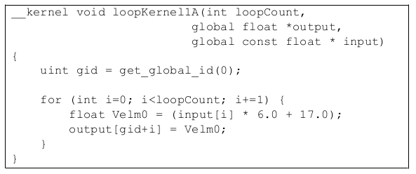

**Figure 3.7 Unmodified Loop**

Figure 3.8 is the same loop unrolled 4x.

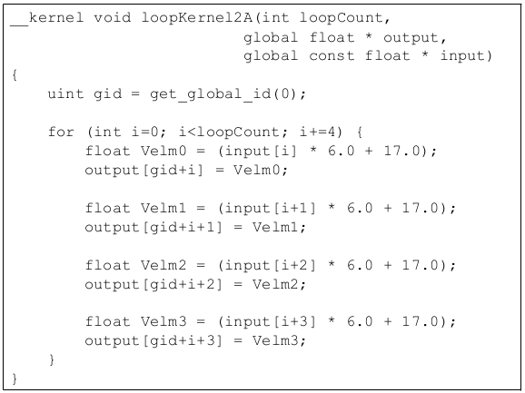

	**Figure 3.8 Kernel Unrolled 4X**

Figure 3.9 shows and example of an unrolled loop with clustered stores.

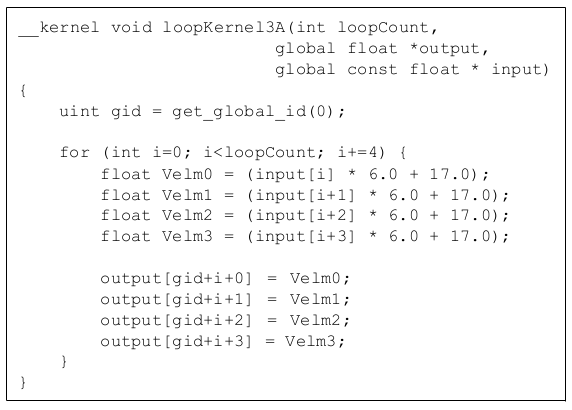

	**Figure 3.9 Unrolled Loop with Stores Clustered**

Unrolling the loop to expose the underlying parallelism typically allows the GPU compiler to pack the instructions into the slots in the VLIW word. For best results, unrolling by a factor of at least 5 (perhaps 8 to preserve power-of-two factors) may deliver best performance. Unrolling increases the number of required registers, so some experimentation may be required.

The CPU back-end requires the use of vector types (float4) to vectorize and generate packed SSE instructions. To vectorize the loop above, use float4 for the array arguments. Obviously, this transformation is only valid in the case where the array elements accessed on each loop iteration are adjacent in memory. The explicit use of float4 can also improve the GPU performance, since it clearly identifies contiguous 16-byte memory operations that can be more efficiently coalesced.

Figure 3.10 is an example of an unrolled kernel that uses float4 for vectorization.

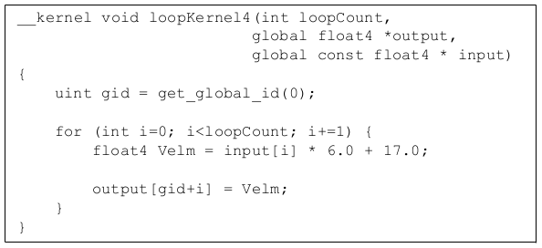

	**Figure 3.10 Unrolled Kernel Using float4 for Vectorization**

3.8.5 Compiler Optimizations
+++++++++++++++++++++++++++++

The OpenCL compiler currently recognizes a few patterns and transforms them into a single instruction. By following these patterns, a developer can generate highly efficient code. The currently accepted patterns are:

* Bitfield extract on signed/unsigned integers.
      | (A >> B) & C ==> [u]bit_extract
      
     where
     
      | B and C are compile time constants,
      | A is a 8/16/32bit integer type, and
      | C is a mask.
      
* Bitfield insert on signed/unsigned integers
      | ((A & B) << C) | ((D & E) << F ==> ubit_insert
      
     where
      
      | B and E have no conflicting bits (B^E == 0),
      | B, C, E, and F are compile-time constants, and
      | B and E are masks.
      | The first bit set in B is greater than the number of bits in E plus the first bit set in E, or the first bit set in E is greater than the number of bits in B plus the first bit set in B.
      | If B, C, E, or F are equivalent to the value 0, this optimization is also supported.
 
3.9 Clause Boundaries
----------------------

AMD GPUs groups instructions into clauses. These are broken at control-flow boundaries when:

 * the instruction type changes (for example, from FETCH to ALU), or
 * if the clause contains the maximum amount of operations (the maximum size for an ALU clause is 128 operations). 

ALU and LDS access instructions are placed in the same clause. FETCH, ALU/LDS, and STORE instructions are placed into separate clauses.

The GPU schedules a pair of wavefronts (referred to as the "even" and "odd" wavefront). The even wavefront executes for four cycles (each cycle executes a quarter-wavefront); then, the odd wavefront executes for four cycles. While the odd wavefront is executing, the even wavefront accesses the register file and prepares operands for execution. This fixed interleaving of two wavefronts allows the hardware to efficiently hide the eight-cycle register-read latencies.

With the exception of the special treatment for even/odd wavefronts, the GPU scheduler only switches wavefronts on clause boundaries. Latency within a clause results in stalls on the hardware. For example, a wavefront that generates an LDS bank conflict stalls on the compute unit until the LDS access completes; the hardware does not try to hide this stall by switching to another available wavefront.

ALU dependencies on memory operations are handled at the clause level. Specifically, an ALU clause can be marked as dependent on a FETCH clause. All FETCH operations in the clause must complete before the ALU clause begins execution.

Switching to another clause in the same wavefront requires approximately 40 cycles. The hardware immediately schedules another wavefront if one is available, so developers are encouraged to provide multiple wavefronts/compute unit. The cost to switch clauses is far less than the memory latency; typically, if the program is designed to hide memory latency, it hides the clause latency as well.

The address calculations for FETCH and STORE instructions execute on the same hardware in the compute unit as do the ALU clauses. The address calculations for memory operations consumes the same executions resources that are used for floating-point computations.
 
 * The ISA dump shows the clause boundaries. See the example shown below. For more information on clauses, see the AMD Evergreen-Family ISA Microcode

And Instructions (v1.0b) and the AMD R600/R700/Evergreen Assembly Language Format documents.

The following is an example disassembly showing clauses. There are 13 clauses in the kernel. The first clause is an ALU clause and has 6 instructions.
::

 
 00 ALU_PUSH_BEFORE: ADDR(32) CNT(13) KCACHE0(CB1:0-15) KCACHE1(CB0:0-15)
    0	x: MOV		R3.x, KC0[0].x
  	y: MOV		R2.y, KC0[0].y
  	z: MOV		R2.z, KC0[0].z
  	w: MOV		R2.w, KC0[0].w
     1	x: MOV		R4.x, KC0[2].x
  	y: MOV		R2.y, KC0[2].y 
  	z: MOV		R2.z, KC0[2].z
  	w: MOV		R2.w, KC0[2].w
  	t: SETGT_INT 	R5.x, PV0.x,	0.0f
      2 	t: MULLO_INT 	__, 	R1.x, 	KC1[1].x
       3 	y: ADD_INT 	__, 	R0.x, 	PS2
      4 	x: ADD_INT 	R0.x, 	PV3.y,	KC1[6].x
      5 	x: PREDNE_INT	__,	R5.x,	0.0f	UPDATE_EXEC_MASK UPDATE_PRED 
 
 01 JUMP	POP_CNT(1) ADDR(12)
 02 ALU: ADDR(45) CNT(5) KCACHE0(CB1:0-15)
      6	z: LSHL 		__, 	R0.x,
      7	y: ADD_INT	__,	KC0[1].x,	PV6.z
      8	x: LSHR		R1.x,	PV7.y,     (0x00000002, 2.802596929e-45f).x
 03 LOOP_DX10 i0 FAIL_JUMP_ADDR(11)
 04 ALU: ADDR(50) CNT(4)
      9	x: ADD_INT 	R3.x, 	-1,	R3.x
       	y: LSHR 		R0.y, 	R4.x, 	(0x00000002, 2.802596929e-45f).x 
 	t: ADD_INT	R4.x,	R4.x, 	(0x00000004, 5.605193857e-45f).y
 05 WAIT_ACK: Outstanding_acks <= 0
 06 TEX: ADDR(64) CNT(1)
      10	VFETCH 		R0.x__, 	R0.y, fc156 MEGA(4) 
 	FETCH_TYPE(NO_INDEX_OFFSET)
 07 ALU: ADDR(54) CNT(3)
      11 	x: MULADD_e 	R0.x, 	R0.x, (0x40C00000, 6.0f).y, 	(0x41880000, 17.0f).x
      	t: SETE_INT	R2.x,	R3.x,	0.0f
 08 MEM_RAT_CACHELESS_STORE_RAW_ACK: RAT(1)[R1].x__, 	R0,	 ARRAY_SIZE(4)	MARK	VPM
 09 ALU_BREAK: ADDR(57) CNT(1)
      12	x: PREDE_INT	__,	R2.x,	0.0f	UPDATE_EXEC_MASK UPDATE_PRED
 10 ENDLOOP i0 PASS_JUMP_ADDR(4)
 11 POP (1) ADDR(12)
 12 NOP NO_BARRIER
 END_OF_PROGRAM 
 

3.10 Additional Performance Guidance
-------------------------------------

This section is a collection of performance tips for GPU compute and AMD- specific optimizations.

3.10.1 Loop Unroll pragma
++++++++++++++++++++++++++
The compiler directive  ``#pragma unroll <unroll-factor>`` can be placed immediately prior to a loop as a hint to the compiler to unroll a loop. ``<unroll- factor>`` must be a positive integer, 1 or greater. When ``<unroll-factor>`` is 1, loop unrolling is disabled. When ``<unroll-factor>`` is 2 or greater, the compiler uses this as a hint for the number of times the loop is to be unrolled.

Examples for using this loop follow.

No unrolling example::
 
 #pragma unroll 1
 for (int i = 0; i < n; i++) {
 ...
 }

Partial unrolling example::

 #pragma unroll 4
 for (int i = 0; i < 128; i++) {
 ...
 } 
 

Currently, the unroll pragma requires that the loop boundaries can be determined at compile time. Both loop bounds must be known at compile time. If n is not given, it is equivalent to the number of iterations of the loop when both loop bounds are known. If the unroll-factor is not specified, and the compiler can determine the loop count, the compiler fully unrolls the loop. If the unroll-factor is not specified, and the compiler cannot determine the loop count, the compiler does no unrolling.

3.10.2 Memory Tiling
+++++++++++++++++++++

There are many possible physical memory layouts for images. AMD devices can access memory in a tiled or in a linear arrangement.
 
 * Linear - A linear layout format arranges the data linearly in memory such that element addresses are sequential. This is the layout that is familiar to CPU programmers. This format must be used for OpenCL buffers; it can be used for images.
 * Tiled - A tiled layout format has a pre-defined sequence of element blocks arranged in sequential memory addresses (see Figure 3.11 for a conceptual illustration). A microtile consists of ABIJ; a macrotile consists of the top-left 16 squares for which the arrows are red. Only images can use this format. Translating from user address space to the tiled arrangement is transparent to the user. Tiled memory layouts provide an optimized memory access pattern to make more efficient use of the RAM attached to the GPU compute device. This can contribute to lower latency.

.. image:: Opencl_optimization_images/3.11.png

**Figure 3.11 One Example of a Tiled Layout Format**

**Memory Access Pattern -**

Memory access patterns in compute kernels are usually different from those in the pixel shaders. Whereas the access pattern for pixel shaders is in a hierarchical, space-filling curve pattern and is tuned for tiled memory performance (generally for textures), the access pattern for a compute kernel is linear across each row before moving to the next row in the global id space. This has an effect on performance, since pixel shaders have implicit blocking, and compute kernels do not. If accessing a tiled image, best performance is achieved if the application tries to use workgroups as a simple blocking strategy.

3.10.3 General Tips
++++++++++++++++++++
* Using dynamic pointer assignment in kernels that are executed on the GPU cause inefficient code generation.
* Many OpenCL specification compiler options that are accepted by the AMD OpenCL compiler are not implemented. The implemented options are ``-D, -I, w, Werror, -clsingle-precision-constant, -cl-opt-disable,`` and ``-cl-fp32-correctly-rounded-divide-sqrt``.
* Avoid declaring global arrays on the kernel's stack frame as these typically cannot be allocated in registers and require expensive global memory operations.
* Use predication rather than control-flow. The predication allows the GPU to execute both paths of execution in parallel, which can be faster than attempting to minimize the work through clever control-flow. The reason for this is that if no memory operation exists in a ``?:`` operator (also called a ternary operator), this operation is translated into a single ``cmov_logical`` instruction, which is executed in a single cycle. An example of this is :
  ::
   
   If (A>B) { C += D;
   } else { C -= D;
   } 

  Replace this with::
   
   int factor = (A>B) ? 1:-1;
   C += factor*D;

In the first block of code, this translates into an IF/ELSE/ENDIF sequence of CF clauses, each taking ~40 cycles. The math inside the control flow adds two cycles if the control flow is divergent, and one cycle if it is not. This code executes in ~120 cycles.

In the second block of code, the ``?:`` operator executes in an ALU clause, so no extra CF instructions are generated. Since the instructions are sequentially dependent, this block of code executes in three cycles, for a ~40x speed improvement. To see this, the first cycle is the (A>B) comparison, the result of which is input to the second cycle, which is the ``cmov_logical`` factor, bool, 1, -1. The final cycle is a MAD instruction that: mad C, factor, D, C. If the ratio between CF clauses and ALU instructions is low, this is a good pattern to remove the control flow. 

 * Loop Unrolling
	* OpenCL kernels typically are high instruction-per-clock applications. Thus, the overhead to evaluate control-flow and execute branch instructions can consume a significant part of resource that otherwise can be used for high-throughput compute operations.
	* The AMD OpenCL compiler performs simple loop unrolling optimizations; however, for more complex loop unrolling, it may be beneficial to do this manually.
 * If possible, create a reduced-size version of your data set for easier debugging and faster turn-around on performance experimentation. GPUs do not have automatic caching mechanisms and typically scale well as resources are added. In many cases, performance optimization for the reduced-size data implementation also benefits the full-size algorithm.
 * When tuning an algorithm, it is often beneficial to code a simple but accurate algorithm that is retained and used for functional comparison. GPU tuning can be an iterative process, so success requires frequent experimentation, verification, and performance measurement.
 * The profiler and analysis tools report statistics on a per-kernel granularity. To narrow the problem further, it might be useful to remove or comment-out sections of code, then re-run the timing and profiling tool.
 * Writing code with dynamic pointer assignment should be avoided on the GPU. For example::
 
   kernel void dyn_assign(global int* a, global int* b, global int* c)
   {
   global int* d; 
   size_t idx = get_global_id(0);
   if (idx & 1) {
   d = b;
   } else {
   d = c;
   }
   a[idx] = d[idx];
   } 

   This is inefficient because the GPU compiler must know the base pointer that every load comes from and in this situation, the compiler cannot determine what ‘d' points to. So, both B and C are assigned to the same GPU resource, removing the ability to do certain optimizations.
 
 * If the algorithm allows changing the work-group size, it is possible to get better performance by using larger work-groups (more work-items in each work-group) because the workgroup creation overhead is reduced. On the other hand, the OpenCL CPU runtime uses a task-stealing algorithm at the work-group level, so when the kernel execution time differs because it contains conditions and/or loops of varying number of iterations, it might be better to increase the number of work-groups. This gives the runtime more flexibility in scheduling work-groups to idle CPU cores. Experimentation might be needed to reach optimal work-group size.
 * Since the AMD OpenCL runtime supports only in-order queuing, using ``clFinish`` () on a queue and queuing a blocking command gives the same result. The latter saves the overhead of another API command.
   For example::
     
     clEnqueueWriteBuffer(myCQ, buff, **CL_FALSE**, 0, buffSize, input, 0, NULL, NULL);``
     clFinish(myCQ);
   
   is equivalent, for the AMD OpenCL runtime, to::
     
     clEnqueueWriteBuffer(myCQ, buff, **CL_TRUE**, 0, buffSize, input, 0, NULL, NULL);``

3.10.4 Guidance for CUDA Programmers Using OpenCL
++++++++++++++++++++++++++++++++++++++++++++++++++

 * Porting from CUDA to OpenCL is relatively straightforward. Multiple vendors have documents describing how to do this, including AMD : http://developer.amd.com/tools-and-sdks/opencl-zone/
 * Some specific performance recommendations which differ from other GPU architectures:

	* Use a workgroup size that is a multiple of 64. CUDA code can use a workgroup size of 32; this uses only half the available compute resources on an ATI Radeon™ HD 5870 GPU.
 	* Vectorization can lead to substantially greater efficiency. The ``ALUPacking`` counter provided by the Profiler can track how well the kernel code is using the five-wide (or four-wide, depending on the GPU type) VLIW unit. Values below 70 percent may indicate that dependencies are preventing the full use of the processor. For some kernels, vectorization can be used to increase efficiency and improve kernel performance.
	* AMD GPUs have a very high single-precision flops capability (2.72 teraflops in a single ATI Radeon™ HD 5870 GPU). Algorithms that benefit from such throughput can deliver excellent performance on AMD hardware.

3.10.5 Guidance for CPU Programmers Using OpenCL to Program GPUs
++++++++++++++++++++++++++++++++++++++++++++++++++++++++++++++++++

OpenCL is the industry-standard toolchain for programming GPUs and parallel devices from many vendors. It is expected that many programmers skilled in CPU programming will program GPUs for the first time using OpenCL. This section provides some guidance for experienced programmers who are programming a GPU for the first time. It specifically highlights the key differences in optimization strategy.
 
 * Study the local memory (LDS) optimizations. These greatly affect the GPU performance. Note the difference in the organization of local memory on the GPU as compared to the CPU cache. Local memory is shared by many work-items (64 on Cypress). This contrasts with a CPU cache that normally is dedicated to a single work-item. GPU kernels run well when they collaboratively load the shared memory.
 * GPUs have a large amount of raw compute horsepower, compared to memory bandwidth and to "control flow" bandwidth. This leads to some high- level differences in GPU programming strategy.

	* A CPU-optimized algorithm may test branching conditions to minimize the workload. On a GPU, it is frequently faster simply to execute the workload.
	* A CPU-optimized version can use memory to store and later load pre- computed values. On a GPU, it frequently is faster to recompute values rather than saving them in registers. Per-thread registers are a scarce resource on the CPU; in contrast, GPUs have many available per-thread register resources.
 
 * Use ``float4`` and the OpenCL built-ins for vector types `` (vload, vstore,`` etc.). These enable the AMD OpenCL implementation to generate efficient, packed SSE instructions when running on the CPU. Vectorization is an optimization that benefits both the AMD CPU and GPU.
 
3.10.6 Optimizing Kernel Code
++++++++++++++++++++++++++++++

3.10.6.1 Using Vector Data Types
#################################

The CPU contains a vector unit, which can be efficiently used if the developer is writing the code using vector data types.

For architectures before Bulldozer, the instruction set is called SSE, and the vector width is 128 bits. For Bulldozer, there the instruction set is called AVX, for which the vector width is increased to 256 bits.

Using four-wide vector types (int4, float4, etc.) is preferred, even with Bulldozer.

3.10.6.2  Local Memory
#######################

The CPU does not benefit much from local memory; sometimes it is detrimental to performance. As local memory is emulated on the CPU by using the caches, accessing local memory and global memory are the same speed, assuming the information from the global memory is in the cache.

3.10.6.3 Using Special CPU Instructions
########################################

The Bulldozer family of CPUs supports FMA4 instructions, exchanging instructions of the form ``a*b+c`` with ``fma(a,b,c)`` or ``mad(a,b,c)`` allows for the use of the special hardware instructions for multiplying and adding.

There also is hardware support for OpenCL functions that give the new hardware implementation of rotating.

For example::
 
  sum.x += tempA0.x * tempB0.x + tempA0.y * tempB1.x + tempA0.z * tempB2.x + tempA0.w * tempB3.x;

can be written as a composition of mad instructions which use fused multiple add
(FMA)::
 
  sum.x += mad(tempA0.x, tempB0.x, mad(tempA0.y, tempB1.x, mad(tempA0.z, tempB2.x, tempA0.w*tempB3.x)));

3.10.6.4 Avoid Barriers When Possible
#######################################

Using barriers in a kernel on the CPU causes a significant performance penalty compared to the same kernel without barriers. Use a barrier only if the kernel requires it for correctness, and consider changing the algorithm to reduce barriers usage.

3.10.7 Optimizing Kernels for Evergreen and 69XX-Series GPUs
++++++++++++++++++++++++++++++++++++++++++++++++++++++++++++++

3.10.7.1 Clauses
#################

The architecture for the 69XX series of GPUs is clause-based. A clause is similar to a basic block, a sequence of instructions that execute without flow control or I/O. Processor efficiency is determined in large part by the number of instructions in a clause, which is determined by the frequency of branching and I/O at the source-code level. An efficient kernel averages at least 16 or 32 instructions per clause.

The AMD CodeXL Static Kernel Analyzer assembler listing lets you view clauses. Try the optimizations listed here from inside the AMD CodeXL Static Kernel Analyzer to see the improvements in performance.

3.10.7.2 Remove Conditional Assignments
########################################
A conditional of the form "if-then-else" generates branching and thus generates one or more clauses. Use the ``select()`` function to replace these structures with conditional assignments that do not cause branching. For example::
 
 if(x==1) r=0.5;
 if(x==2) r=1.0;

becomes
::
 r = select(r, 0.5, x==1);
 r = select(r, 1.0, x==2);

Note that if the body of the ``if`` statement contains an I/O, the if statement cannot be eliminated.

3.10.7.3  Bypass Short-Circuiting
##################################
A conditional expression with many terms can compile into a number of clauses due to the C-language requirement that expressions must short circuit. To prevent this, move the expression out of the control flow statement. For example::
 
 if(a&&b&&c&&d){...}

becomes
::
 bool cond = a&&b&&c&&d;
 if(cond){...}
 
The same applies to conditional expressions used in loop constructs `` (do, while, for)``.

3.10.7.4 Unroll Small Loops
############################

If the loop bounds are known, and the loop is small (less than 16 or 32 instructions), unrolling the loop usually increases performance.

3.10.7.5 Avoid Nested ifs
##########################
Because the GPU is a Vector ALU architecture, there is a cost to executing an if-then-else block because both sides of the branch are evaluated, then one result is retained while the other is discarded. When if blocks are nested, the results are twice as bad; in general, if blocks are nested k levels deep, there 2^k clauses are generated. In this situation, restructure the code to eliminate nesting.
 
3.10.7.6 Experiment With do/while/for Loops
#############################################
``for`` loops can generate more clauses than equivalent ``do`` or ``while`` loops. Experiment with these different loop types to find the one with best performance.

3.10.7.7  Do I/O With 4-Word Data
##################################

The native hardware I/O transaction size is four words (float4, int4 types). Avoid I/Os with smaller data, and rewrite the kernel to use the native size data. Kernel performance increases, and only 25% as many work items need to be dispatched.

