.. _Opencl-programming-guide:

OpenCL Programming Guide
========================

   * :ref:`OpenCL Architecture`
	* :ref:`Terminology`
	* :ref:`Opencl-overview`
	* :ref:`Programming-model`
	* :ref:`Synchronization`
	* :ref:`Memory-Arch`
	* :ref:`Example`
   
   * :ref:`AMD_Implementation` 
	* :ref:`AMD-ROCm-Implementation`
	* :ref:`Hardware-Overview-GCNDevices` 
	* :ref:`Communication-Host-GPU`
	* :ref:`Wavefront-Scheduling`
   
   * :ref:`Build_Run_Opencl`
	* :ref:`Compilin-Host-Program`
	* :ref:`Compiling-device-programs`
	* :ref:`Supported-Standard-OpenCL-Compiler`
	* :ref:`AMD-Developed-Supplemental-Compiler`
	* :ref:`Creating-device-specific-binaries`
	* :ref:`Command-execution-flow`
	* :ref:`Running-Program`
	* :ref:`note-on-thread-safety`
	* :ref:`Toolchain-considerations`
   
   * :ref:`Profiling_OpenCL`
	* :ref:`AMD-CodeXL-GPU`
   
   * :ref:`OpenCL_static` 
	* :ref:`Overview`
	* :ref:`OpenCL-C-Runtime` 
	* :ref:`C-Programming-Language`
	* :ref:`Examples`
   
   * :ref:`OpenCL_2.0` 
	* :ref:`Introduction`
	* :ref:`Shared-virtual-Memory`
	* :ref:`Generi`
	* :ref:`Device-side-enqueue`	
	* :ref:`Atomics`
	* :ref:`Pipes`
	* :ref:`Program-scope-global-Variables`
	* :ref:`Image-Enhancements`
	* :ref:`Non-uniform-work-group-size`
	* :ref:`Portability-considerations`
   
   * :ref:`OpenCL_Extentions`
   * :ref:`ICD`
   * :ref:`BIF`
   * :ref:`pre_GCN_Devices`
   * :ref:`OpenCL_OpenGL`
   * :ref:`Functions_OpenCL`
  
   
 .. _OpenCL Architecture:
OpenCL Architecture and AMD Accelerated Parallel Processing Technology
=======================================================================

.. _Terminology:

Terminology
############
**compute kernel :** 

To define a compute kernel, it is first necessary to define a kernel. A kernel is a small unit of execution that performs a clearly defined function and that can be executed in parallel. Such a kernel can be executed on each element of an input stream (called an NDRange), or simply at each point in an arbitrary index space. A kernel is analogous and, on some devices identical, to what graphics programmers call a shader program. This kernel is not to be confused with an OS kernel, which controls hardware. The most basic form of an NDRange is simply mapped over input data and produces one output item for each input tuple. Subsequent extensions of the basic model provide random-access functionality, variable output counts, and reduction/accumulation operations. Kernels are specified using the kernel keyword.

A compute kernel is a specific type of kernel that is not part of the traditional graphics pipeline. The compute kernel type can be used for graphics, but its strength lies in using it for non-graphics fields such as physics, AI, modeling, HPC, and various other computationally intensive applications.

In a compute kernel, the work-item spawn order is sequential. This means that on a chip with N work-items per wavefront, the first N work- items go to wavefront 1, the second N work-items go to wavefront 2, etc. Thus, the work-item IDs for wavefront K are in the range (K•N) to ((K+1)•N)-1.

**wavefronts and work-groups :**

Wavefronts and work-groups are two concepts relating to compute kernels that provide data-parallel granularity. On most AMD GPUs, a wavefront has 64 work-items. A wavefront is the lowest level that flow control can affect. This means that if two work-items inside of a wavefront go divergent paths of flow control, all work-items in the wavefront go to both paths of flow control.

Grouping is a higher-level granularity of data parallelism that is enforced in software, not hardware. Synchronization points in a kernel guarantee that all work-items in a work-group reach that point (barrier) in the code before the next statement is executed.

Work-groups are composed of wavefronts. Best performance is attained when the group size is an integer multiple of the wavefront size.

**local data store(LDS) :**

The LDS is a high-speed, low-latency memory private to each compute unit. It is a full gather/scatter model: a work-group can write anywhere in its allocated space. This model is unchanged for the AMD Radeon™ HD 7XXX series. The constraints of the current LDS model are:

 * The LDS size is allocated per work-group. Each work-group specifies how much of the LDS it requires. The hardware scheduler uses  	this information to determine which work groups can share a compute unit.
 * Data can only be shared within work-items in a work-group.
 * Memory accesses outside of the work-group result in undefined behavior.

.. _Opencl-overview:

OpenCL Overview
##################
The OpenCL programming model consists of producing complicated task graphs from data-parallel execution nodes.

In a given data-parallel execution, commonly known as a kernel launch, a computation is defined in terms of a sequence of instructions that executes at each point in an N-dimensional index space. It is a common, though by not required, formulation of an algorithm that each computation index maps to an element in an input data set.

The OpenCL data-parallel programming model is hierarchical. The hierarchical subdivision can be specified in two ways:

  * Explicitly - the developer defines the total number of work-items to execute in parallel, as well as the division of work-items 	into specific work-groups.
  * Implicitly - the developer specifies the total number of work-items to execute in parallel, and OpenCL manages the division into 	 work-groups.

OpenCL's API also supports the concept of a task dispatch. This is equivalent to executing a kernel on a compute device with a work-group and NDRange containing a single work-item. Parallelism is expressed using vector data types implemented by the device, enqueuing multiple tasks, and/or enqueuing native kernels developed using a programming model orthogonal to OpenCL.

.. _Programming-model:

Programming Model
#####################
The OpenCL programming model is based on the notion of a host device, supported by an application API, and a number of devices connected through a bus. These are programmed using OpenCL C. The host API is divided into platform and runtime layers. OpenCL C is a C-like language with extensions for parallel programming such as memory fence operations and barriers. Figure illustrates this model with queues of commands, reading/writing data, and
executing kernels for specific devices.

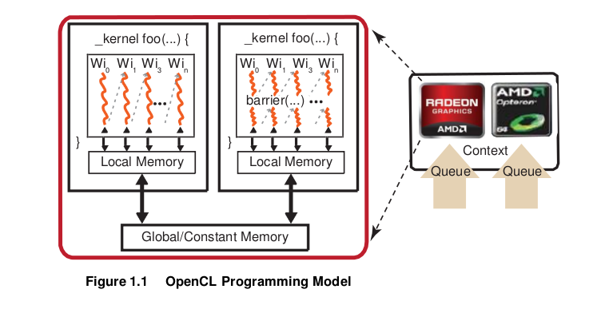
    

The devices are capable of running data- and task-parallel work. A kernel can be executed as a function of multi-dimensional domains of indices. Each element is called a work-item; the total number of indices is defined as the global work-size. The global work-size can be divided into sub-domains, called work-groups, and individual work-items within a group can communicate through global or locally shared memory. Work-items are synchronized through barrier or fence operations. Figure 1.1 is a representation of the host/device architecture with a single platform, consisting of a GPU and a CPU.

An OpenCL application is built by first querying the runtime to determine which platforms are present. There can be any number of different OpenCL implementations installed on a single system. The desired OpenCL platform can be selected by matching the platform vendor string to the desired vendor name, such as “Advanced Micro Devices, Inc.” The next step is to create a context. As shown in Figure 1.1, an OpenCL context has associated with it a number of compute devices (for example, CPU or GPU devices),. Within a context, OpenCL guarantees a relaxed consistency between these devices. This means that memory objects, such as buffers or images, are allocated per context; but changes made by one device are only guaranteed to be visible by another device at well-defined synchronization points. For this, OpenCL provides events, with the ability to synchronize on a given event to enforce the correct order of execution.

Many operations are performed with respect to a given context; there also are many operations that are specific to a device. For example, program compilation and kernel execution are done on a per-device basis. Performing work with a device, such as executing kernels or moving data to and from the device’s local memory, is done using a corresponding command queue. A command queue is associated with a single device and a given context; all work for a specific device is done through this interface. Note that while a single command queue can be associated with only a single device, there is no limit to the number of command queues that can point to the same device. For example, it is possible to have one command queue for executing kernels and a command queue for managing data transfers between the host and the device.

Most OpenCL programs follow the same pattern. Given a specific platform, select a device or devices to create a context, allocate memory, create device-specific command queues, and perform data transfers and computations. Generally, the platform is the gateway to accessing specific devices, given these devices and a corresponding context, the application is independent of the platform. Given a context, the application can:

  * Create one or more command queues.
  * Create programs to run on one or more associated devices.
  * Create kernels within those programs.
  * Allocate memory buffers or images, either on the host or on the device(s). (Memory can be copied between the host and device.)
  * Write data to the device.
  * Submit the kernel (with appropriate arguments) to the command queue for execution.
  * Read data back to the host from the device.

The relationship between context(s), device(s), buffer(s), program(s), kernel(s), and command queue(s) is best seen by looking at sample code. For an example, see the HelloWorld sample in the AMD Compute SDK.

.. _Synchronization:

Synchronization
###################

The two domains of synchronization in OpenCL are work-items in a single work- group and command-queue(s) in a single context. Work-group barriers enable synchronization of work-items in a work-group. Each work-item in a work-group must first execute the barrier before executing any instruction beyond this barrier. Either all of, or none of, the work-items in a work-group must encounter the barrier. A barrier or mem_fence operation does not have global scope, but is relevant only to the local workgroup on which they operate.

There are two types of synchronization between commands in a command- queue:

 * command-queue barrier - enforces ordering within a single queue. Any resulting changes to memory are available to the following   	commands in the queue.
 * events - enforces ordering between, or within, queues. Enqueued commands in OpenCL return an event identifying the command as well 	 as the memory object updated by it. This ensures that following commands waiting on that event see the updated memory objects     	before they execute.

OpenCL 2.0 provides additional synchronization options. For an overview, see “Atomics and synchronization.”.

.. _Memory-Arch:

Memory Architecture and Access
###################################

OpenCL has four memory domains: private, local, global, and constant; the AMD Compute Technology system also recognizes host (CPU) and PCI Express®  (PCIe® ) memory.

============= ====================================================================================================================
 Memory Type   Description
============= ====================================================================================================================
private	       Specific to a work-item; it is not visible to other work-items.

local          Specific to a work-group; accessible only by work-items belonging to that work-group.
global	       Accessible to all work-items executing in a context, as well as to the host
               (read, write, and map commands).

constant       Read-only region for host-allocated and -initialized objects that are not changed during kernel execution.

host (CPU)     Host-accessible region for an application’s data structures and program data.

PCIe	       Part of host (CPU) memory accessible from, and modifiable by, the host program and the GPU compute device. Modifying 		       this memory requires synchronization between the GPU compute device and the CPU.
============= ====================================================================================================================
 
				**Table: illustrates the interrelationship of the memories.**

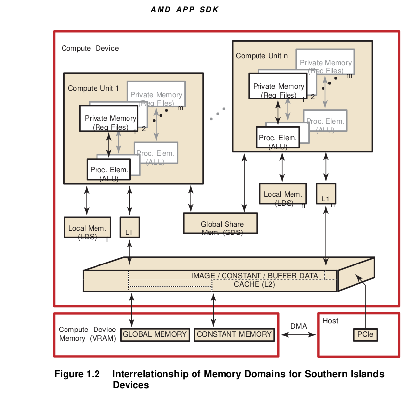

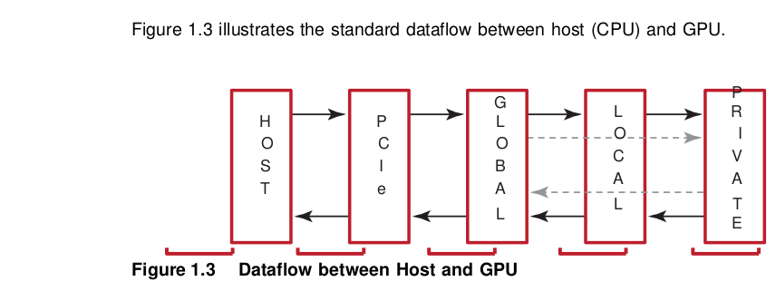

There are two ways to copy data from the host to the GPU compute device memory:

   * Implicitly by using ``clEnqueueMapBuffer`` and ``clEnqueueUnMapMemObject``.
   * Explicitly through  ``clEnqueueReadBuffer``, ``clEnqueueWriteBuffer`` and ``(clEnqueueReadImage, clEnqueueWriteImage).``

When using these interfaces, it is important to consider the amount of copying involved. There is a two-copy processes: between host and PCIe, and between PCIe and GPU compute device.

With proper memory transfer management and the use of system pinned memory (host/CPU memory remapped to the PCIe memory space), copying between host (CPU) memory and PCIe memory can be skipped.

Double copying lowers the overall system memory bandwidth. In GPU compute device programming, pipelining and other techniques help reduce these bottlenecks. See the AMD OpenCL Optimization Reference Guide for more specifics about optimization techniques.

Data Share Operations
***********************

Local data share (LDS) is a very low-latency, RAM scratchpad for temporary data located within each compute unit. The programmer explicitly controls all accesses to the LDS. The LDS can thus provide efficient memory access when used as a software cache for predictable re-use of data (such as holding parameters for pixel shader parameter interpolation), as a data exchange machine for the work-items of a work-group, or as a cooperative way to enable more efficient access to off-chip memory.

The high-speed write-to-read re-use of the memory space (full gather/read/load and scatter/write/store operations) is especially useful in pre-GCN devices with read-only caches. LDS offers at least one order of magnitude higher effective bandwidth than direct, uncached global memory.

Figure 1.4 shows the conceptual framework of the LDS is integration into the memory of AMD GPUs using OpenCL.

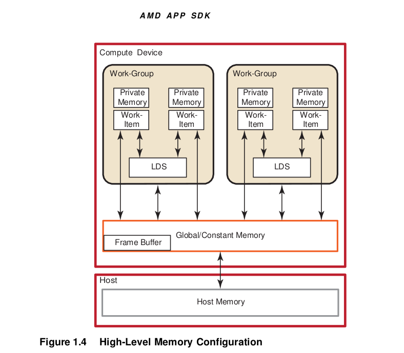

Physically located on-chip, directly next to the ALUs, the LDS is approximately one order of magnitude faster than global memory (assuming no bank conflicts).

GCN devices contain 64 kB memory per compute unit and allow up to a maximum of 32 kB per workgroup.

The high bandwidth of the LDS memory is achieved not only through its proximity to the ALUs, but also through simultaneous access to its memory banks. Thus, it is possible to concurrently execute 32 write or read instructions, each nominally
32-bits; extended instructions, read2/write2, can be 64-bits each. If, however, more than one access attempt is made to the same bank at the same time, a bank conflict occurs. In this case, for indexed and atomic operations, hardware prevents the attempted concurrent accesses to the same bank by turning them into serial accesses. This decreases the effective bandwidth of the LDS. For maximum throughput (optimal efficiency), therefore, it is important to avoid bank conflicts. A knowledge of request scheduling and address mapping is key to achieving this.

Dataflow in Memory Hierarchy
*******************************

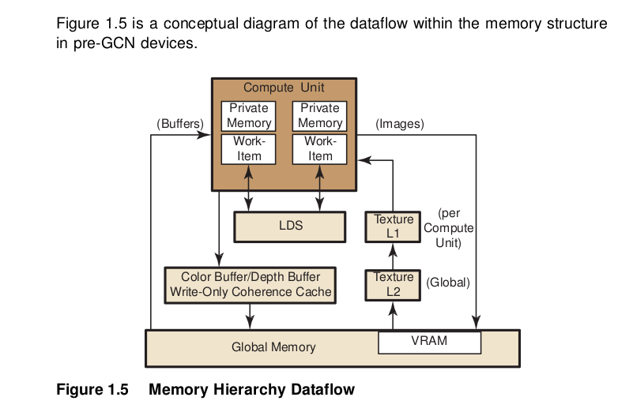

To load data into LDS from global memory, it is read from global memory and placed into the work-item’s registers; then, a store is performed to LDS. Similarly, to store data into global memory, data is read from LDS and placed into the work- item’s registers, then placed into global memory. To make effective use of the LDS, an algorithm must perform many operations on what is transferred between global memory and LDS. It also is possible to load data from a memory buffer directly into LDS, bypassing VGPRs.

LDS atomics are performed in the LDS hardware. (Thus, although ALUs are not directly used for these operations, latency is incurred by the LDS executing this function.) If the algorithm does not require write-to-read reuse (the data is read only), it usually is better to use the image dataflow (see right side of Figure 1.5) because of the cache hierarchy.

Actually, buffer reads may use L1 and L2. When caching is not used for a buffer, reads from that buffer bypass L2. After a buffer read, the line is invalidated; then, on the next read, it is read again (from the same wavefront or from a different clause). After a buffer write, the changed parts of the cache line are written to memory.

Buffers and images are written through the texture L2 cache, but this is flushed immediately after an image write.

In GCN devices, both reads and writes happen through L1 and L2.

The data in private memory is first placed in registers. If more private memory is used than can be placed in registers, or dynamic indexing is used on private arrays, the overflow data is placed (spilled) into scratch memory. Scratch memory is a private subset of global memory, so performance can be dramatically degraded if spilling occurs.

Global memory can be in the high-speed GPU memory (VRAM) or in the host memory, which is accessed by the PCIe bus. A work-item can access global memory either as a buffer or a memory object. Buffer objects are generally read and written directly by the work-items. Data is accessed through the L2 and L1 data caches on the GPU. This limited form of caching provides read coalescing among work-items in a wavefront. Similarly, writes are executed through the texture L2 cache.

Global atomic operations are executed through the texture L2 cache. Atomic instructions that return a value to the kernel are handled similarly to fetch instructions: the kernel must use S_WAITCNT to ensure the results have been written to the destination GPR before using the data.

Memory Access
**********************

Using local memory (known as local data store, or LDS, as shown in Figure 1.2) typically is an order of magnitude faster than accessing host memory through global memory (VRAM), which is one order of magnitude faster again than PCIe. However, stream cores do not directly access memory; instead, they issue memory requests through dedicated hardware units. When a work-item tries to access memory, the work-item is transferred to the appropriate fetch unit. The work-item then is deactivated until the access unit finishes accessing memory. Meanwhile, other work-items can be active within the compute unit, contributing to better performance. The data fetch units handle three basic types of memory operations: loads, stores, and streaming stores. GPU compute devices can store writes to random memory locations using global buffers.

Global Memory
*********************
The global memory lets applications read from, and write to, arbitrary locations in memory. When using global memory, such read and write operations from the stream kernel are done using regular GPU compute device instructions with the global memory used as the source or destination for the instruction. The programming interface is similar to load/store operations used with CPU programs, where the relative address in the read/write buffer is specified.

When using a global memory, each work-item can write to an arbitrary location within it. Global memory use a linear layout. If consecutive addresses are written, the compute unit issues a burst write for more efficient memory access. Only read-only buffers, such as constants, are cached.

Image Read/Write
************************
Image reads are done by addressing the desired location in the input memory using the fetch unit. The fetch units can process either 1D or 2 D addresses. These addresses can be normalized or un-normalized. Normalized coordinates are between 0.0 and 1.0 (inclusive). For the fetch units to handle 2D addresses and normalized coordinates, pre-allocated memory segments must be bound to the fetch unit so that the correct memory address can be computed. For a single kernel invocation, up to 128 images can be bound at once for reading, and eight for writing. The maximum number of addresses is 8192x8192 for Evergreen and Northern Islands-based devices, 16384x16384 for SI-based products.

Image reads are cached through the texture system (corresponding to the L2 and
L1 caches).

.. _Example:  

Example Programs
###################

The following subsections provide simple programming examples with explanatory comments.

First Example: Simple Buffer Write
************************************
This sample shows a minimalist OpenCL C program that sets a given buffer to some value. It illustrates the basic programming steps with a minimum amount of code. This sample contains no error checks and the code is not generalized. Yet, many simple test programs might look very similar. The entire code for this sample is provided at the end of this section.

1. The host program must select a platform, which is an abstraction for a given OpenCL implementation. Implementations by multiple vendors can coexist on a host, and the sample uses the first one available.

2. A device id for a GPU device is requested. A CPU device could be requested by using CL_DEVICE_TYPE_CPU instead. The device can be a physical device, such as a given GPU, or an abstracted device, such as the collection of all CPU cores on the host.

3. On the selected device, an OpenCL context is created. A context ties together a device, memory buffers related to that device, OpenCL programs, and command queues. Note that buffers related to a device can reside on either the host or the device. Many OpenCL programs have only a single context, program, and command queue.

4. Before an OpenCL kernel can be launched, its program source is compiled, and a handle to the kernel is created.

5. A memory buffer is allocated in the context.

6. The kernel is launched. While it is necessary to specify the global work size, OpenCL determines a good local work size for this device. Since the kernel was launch asynchronously, ``clFinish()`` is used to wait for completion.

7. The data is mapped to the host for examination. Calling clEnqueueMapBuffer ensures the visibility of the buffer on the host, which in this case probably includes a physical transfer. Alternatively, we could use ``clEnqueueWriteBuffer()``, which requires a pre-allocated host-side buffer.

**Example Code 1** 

::

  //
  // Copyright (c) 2010 Advanced Micro Devices, Inc. All rights reserved.
  //

  // A minimalist OpenCL program.

  #include <CL/cl.h>
  #include <stdio.h>

  #define NWITEMS 512
  // A simple memset kernel
  const char *source =
  "kernel void memset(   global uint *dst )		\n"
  "{							\n"
  "    dst[get_global_id(0)] = get_global_id(0);	\n"
  "}							\n";

  int main(int argc, char ** argv)
  {
    // 1. Get a platform.
    cl_platform_id platform;
    clGetPlatformIDs( 1, &platform, NULL );

    // 2. Find a gpu device.
    cl_device_id device;
    clGetDeviceIDs( platform,
                    CL_DEVICE_TYPE_GPU,
                    1,
                    &device, NULL);

    // 3. Create a context and command queue on that device.
    cl_context context = clCreateContext( NULL,
                                          1,
                                          &device,
                                          NULL, NULL, NULL);

    cl_command_queue queue = clCreateCommandQueue( context,
                                                   device,
                                                   0, NULL );

    // 4. Perform runtime source compilation, and obtain kernel entry point.
    cl_program program = clCreateProgramWithSource( context,
                                                    1,
                                                    &source,
                                                    NULL, NULL );

    clBuildProgram( program, 1, &device, NULL, NULL, NULL );

    cl_kernel kernel = clCreateKernel( program, "memset", NULL );

    // 5. Create a data buffer.
    cl_mem buffer = clCreateBuffer( context,
                                    CL_MEM_WRITE_ONLY,
                                    NWITEMS * sizeof(cl_uint),
                                    NULL, NULL );

    // 6. Launch the kernel. Let OpenCL pick the local work size.
    size_t global_work_size = NWITEMS;
    clSetKernelArg(kernel, 0, sizeof(buffer), (void*) &buffer);

    clEnqueueNDRangeKernel( queue,
                            kernel,
                            1,
                            NULL,
                            &global_work_size,
                            NULL,
                            0,
                            NULL, NULL);

    clFinish( queue );

    // 7. Look at the results via synchronous buffer map.
    cl_uint *ptr;
    ptr = (cl_uint *) clEnqueueMapBuffer( queue,
                                          buffer,
                                          CL_TRUE,
                                          CL_MAP_READ,
                                          0,
                                          NWITEMS * sizeof(cl_uint),
                                          0, NULL, NULL, NULL );

    int i;

    for(i=0; i < NWITEMS; i++)
        printf("%d %d\n", i, ptr[i]);

    return 0;
  }

Example: SAXPY Function
*************************
This section provides an introductory sample for beginner-level OpenCL
programmers using C++ bindings.

The sample implements the SAXPY function (Y = aX + Y, where X and Y are vectors, and a is a scalar). The full code is reproduced at the end of this section. It uses C++ bindings for OpenCL. These bindings are available in the CL/cl.hpp file in the AMD Compute SDK; they also are downloadable from the Khronos website: http://www.khronos.org/registry/cl 

The following steps guide you through this example.

1. Enable error checking through the exception handling mechanism in the C++
   bindings by using the following define.
   ::
   
   #define  CL ENABLE_EXCEPTIONS

   This removes the need to error check after each OpenCL call. If there is an error, the C++ bindings code throw an exception that is caught at the end of the try block, where we can clean up the host memory allocations. In this example, the C++ object representing OpenCL resources (cl::Context, cl::CommandQueue, etc.) are declared as automatic variables, so they do not need to be released. If an OpenCL call returns an error, the error code is defined in the CL/cl.h file.

2. The kernel is very simple: each work-item, i, does the SAXPY calculation for its corresponding elements ``Y[i] = aX[i] + Y[i]``. Both X and Y vectors are stored in global memory; X is read-only, Y is read-write.

   :: 
    
    kernel void saxpy(const __global float * X,
                            __global float * Y,
                      const float a)
    {
      uint gid = get_global_id(0);
      Y[gid] = a* X[gid] + Y[gid];
    }

3. List all platforms on the machine, then select one.

   ::

    cl::Platform::get(&platforms);

4. Create an OpenCL context on that platform.

   ::
    
    cl_context_properties cps[3] = { CL_CONTEXT_PLATFORM, (cl_context_properties)(*iter)(), 0 };
    context = cl::Context(CL_DEVICE_TYPE_GPU, cps);

5. Get OpenCL devices from the context.
   ::
   
    devices = context.getInfo<CL_CONTEXT_DEVICES>();

6. Create an OpenCL command queue.

   ::
    
    queue = cl::CommandQueue(context, devices[0]);

7. Create two buffers, corresponding to the X and Y vectors. Ensure the host- side buffers, pX and pY, are allocated and initialized. 	 The CL_MEM_COPY_HOST_PTR flag instructs the runtime to copy over the contents of the host pointer pX in order to initialize the   	buffer bufX. The bufX buffer uses the CL_MEM_READ_ONLY flag, while bufY requires the CL_MEM_READ_WRITE flag.

   ::
    
    bufX = cl::Buffer(context, CL_MEM_READ_ONLY | CL_MEM_COPY_HOST_PTR, sizeof(cl_float) * length, pX);

8. Create a program object from the kernel source string, build the program for our devices, and create a kernel object corresponding to the SAXPY kernel. (At this point, it is possible to create multiple kernel objects if there are more than one.)

   ::
   
    cl::Program::Sources sources(1, std::make_pair(kernelStr.c_str(), kernelStr.length()));
    program = cl::Program(context, sources);
    program.build(devices);
    kernel = cl::Kernel(program, "saxpy");

9. Enqueue the kernel for execution on the device (GPU in our example).

   Set each argument individually in separate kernel.setArg() calls. The arguments, do not need to be set again for subsequent kernelenqueue calls. Reset only those arguments that are to pass a new value to the kernel. Then, enqueue the kernel to the command queue with the appropriate global and local work sizes.
   ::
    
    kernel.setArg(0,bufX); kernel.setArg(1,bufY); kernel.setArg(2,a);
    queue.enqueueNDRangeKernel(kernel, cl::NDRange(), cl::NDRange(length), cl::NDRange(64));

10. Read back the results from bufY to the host pointer pY. We will make this a blocking call (using the CL_TRUE argument) since we 	do not want to proceed before the kernel has finished execution and we have our results back.
    ::
      
      queue.enqueueReadBuffer(bufY, CL_TRUE, 0, length * sizeof(cl_float), pY);

11. Clean up the host resources (pX and pY). OpenCL resources is cleaned up by the C++ bindings support code.
    
    The catch(cl::Error err) block handles exceptions thrown by the C++ bindings code. If there is an OpenCL call error, it prints  	out the name of the call and the error code (codes are defined in CL/cl.h). If there is a kernel compilation error, the error   	code is CL_BUILD_PROGRAM_FAILURE, in which case it is necessary to print out the build log.

**Example Code 2**

::

  #define __CL_ENABLE_EXCEPTIONS

  #include <CL/cl.hpp>
  #include <string>
  #include <iostream>
  #include <string>

  using std::cout;
  using std::cerr;
  using std::endl;
  using std::string;

  /////////////////////////////////////////////////////////////////
  // Helper function to print vector elements
  /////////////////////////////////////////////////////////////////
  void printVector(const std::string arrayName,
                   const cl_float * arrayData,
                   const unsigned int length)
  {
    int numElementsToPrint = (256 < length) ? 256 : length;
    cout << endl << arrayName << ":" << endl;
    for(int i = 0; i < numElementsToPrint; ++i)
      cout << arrayData[i] << " ";
    cout << endl;
  }
 
  /////////////////////////////////////////////////////////////////
  // Globals
  /////////////////////////////////////////////////////////////////
  int length      = 256;
  cl_float * pX   = NULL;
  cl_float * pY   = NULL;
  cl_float a      = 2.f;

  std::vector<cl::Platform> platforms;
  cl::Context context;
  std::vector<cl::Device> devices;
  cl::CommandQueue queue;
  cl::Program program;

  cl::Kernel kernel;
  cl::Buffer bufX;
  cl::Buffer bufY;

  /////////////////////////////////////////////////////////////////
  // The saxpy kernel
  /////////////////////////////////////////////////////////////////
  string kernelStr	=
      "__kernel void saxpy(const global float * x,\n"
      "                    __global float * y,\n"
      "                    const float a)\n"
      "{\n"
      "   uint gid = get_global_id(0);\n"
      "   y[gid] = a* x[gid] + y[gid];\n"
      "}\n";
 
  /////////////////////////////////////////////////////////////////
  // Allocate and initialize memory on the host
  /////////////////////////////////////////////////////////////////
  void initHost()
  {
    size_t sizeInBytes = length * sizeof(cl_float);
    pX = (cl_float *) malloc(sizeInBytes);
    if(pX == NULL)
      throw(string("Error: Failed to allocate input memory on host\n"));

    pY = (cl_float *) malloc(sizeInBytes);
    if(pY == NULL)
      throw(string("Error: Failed to allocate input memory on host\n"));

    for(int i = 0; i < length; i++)
    {
      pX[i] = cl_float(i);
      pY[i] = cl_float(length-1-i);
    }

    printVector("X", pX, length);
    printVector("Y", pY, length);
  }

  /////////////////////////////////////////////////////////////////
  // Release host memory
  /////////////////////////////////////////////////////////////////
  void cleanupHost()
  {
    if(pX)
    {
      free(pX);
      pX = NULL;
    }
    if(pY != NULL)
    {
      free(pY);
      pY = NULL;
    }
  }

  int main(int argc, char * argv[])
  {
    try
    {
      /////////////////////////////////////////////////////////////////
      // Allocate and initialize memory on the host
      /////////////////////////////////////////////////////////////////
      initHost();

      /////////////////////////////////////////////////////////////////
      // Find the platform
      /////////////////////////////////////////////////////////////////
      cl::Platform::get(&platforms);
      std::vector<cl::Platform>::iterator iter;
      for(iter = platforms.begin(); iter != platforms.end(); ++iter)
      {
        if( !strcmp((*iter).getInfo<CL_PLATFORM_VENDOR>().c_str(), "Advanced Micro Devices, Inc.") )
        {
          break;
        }
      }
 
      /////////////////////////////////////////////////////////////////
      // Create an OpenCL context
      /////////////////////////////////////////////////////////////////
      cl_context_properties cps[3] = { CL_CONTEXT_PLATFORM,
                                       (cl_context_properties)(*iter)(), 0 };
      context = cl::Context(CL_DEVICE_TYPE_GPU, cps);

      /////////////////////////////////////////////////////////////////
      // Detect OpenCL devices
      /////////////////////////////////////////////////////////////////
      devices = context.getInfo<CL_CONTEXT_DEVICES>();

      /////////////////////////////////////////////////////////////////
      // Create an OpenCL command queue
      /////////////////////////////////////////////////////////////////
      queue = cl::CommandQueue(context, devices[0]);

      /////////////////////////////////////////////////////////////////
      // Create OpenCL memory buffers
      /////////////////////////////////////////////////////////////////
      bufX = cl::Buffer(context,
                        CL_MEM_READ_ONLY | CL_MEM_COPY_HOST_PTR,
                        sizeof(cl_float) * length,
                        pX);
      bufY = cl::Buffer(context,
                        CL_MEM_READ_WRITE | CL_MEM_COPY_HOST_PTR,
                        sizeof(cl_float) * length,
                        pY);

      /////////////////////////////////////////////////////////////////
      // Load CL file, build CL program object, create CL kernel object
      /////////////////////////////////////////////////////////////////
      cl::Program::Sources sources(1, std::make_pair(kernelStr.c_str(),
                                   kernelStr.length()));
      program = cl::Program(context, sources);
      program.build(devices);
      kernel = cl::Kernel(program, "saxpy");

      /////////////////////////////////////////////////////////////////
      // Set the arguments that will be used for kernel execution
      /////////////////////////////////////////////////////////////////
      kernel.setArg(0, bufX);
      kernel.setArg(1, bufY);
      kernel.setArg(2, a);

      /////////////////////////////////////////////////////////////////
      // Enqueue the kernel to the queue
      // with appropriate global and local work sizes
      /////////////////////////////////////////////////////////////////
      queue.enqueueNDRangeKernel(kernel, cl::NDRange(),
      cl::NDRange(length), cl::NDRange(64));

      /////////////////////////////////////////////////////////////////
      // Enqueue blocking call to read back buffer Y
      /////////////////////////////////////////////////////////////////
      queue.enqueueReadBuffer(bufY, CL_TRUE, 0, length *
      sizeof(cl_float), pY);

      printVector("Y", pY, length);

      /////////////////////////////////////////////////////////////////
      // Release host resources
      /////////////////////////////////////////////////////////////////
      cleanupHost();
    }
    catch (cl::Error err)
    {
      /////////////////////////////////////////////////////////////////
      // Catch OpenCL errors and print log if it is a build error
      /////////////////////////////////////////////////////////////////
      cerr << "ERROR: " << err.what() << "(" << err.err() << ")" << endl;
      if (err.err() == CL_BUILD_PROGRAM_FAILURE)
      {
        string str = program.getBuildInfo<CL_PROGRAM_BUILD_LOG>(devices[0]);
        cout << "Program Info: " << str << endl;
      }
      cleanupHost();
    }
    catch(string msg)
    {
      cerr << "Exception caught in main(): " << msg << endl;
      cleanupHost();
    }
  }

Example: Parallel Min( ) Function
*****************************************

This medium-complexity sample shows how to implement an efficient parallel min() function.

The code is written so that it performs very well on either CPU or GPU. The number of threads launched depends on how many hardware processors are available. Each thread walks the source buffer, using a device-optimal access pattern selected at runtime. A multi-stage reduction using    local and    global atomics produces the single result value.

The sample includes a number of programming techniques useful for simple tests. Only minimal error checking and resource tear-down is used.

Runtime Code –

1. The source memory buffer is allocated, and initialized with a random pattern.
   Also, the actual min() value for this data set is serially computed, in order to later verify the parallel result.

2. The compiler is instructed to dump the intermediate IL and ISA files for further analysis.

3. The main section of the code, including device setup, CL data buffer creation, and code compilation, is executed for each device, 	in this case for CPU and GPU. Since the source memory buffer exists on the host, it is shared. All other resources are device     specific.

4. The global work size is computed for each device. A simple heuristic is used to ensure an optimal number of threads on each    	device. For the CPU, a given CL implementation can translate one work-item per CL compute unit into one thread per CPU core.

   On the GPU, an initial multiple of the wavefront size is used, which is adjusted to ensure even divisibility of the input data    	over all threads. The value of 7 is a minimum value to keep all independent hardware units of the compute units busy, and to      	provide a minimum amount of memory latency hiding for a kernel with little ALU activity.

5. After the kernels are built, the code prints errors that occurred during kernel compilation and linking.

6. The main loop is set up so that the measured timing reflects the actual kernel performance. If a sufficiently large NLOOPS is     chosen, effects from kernel launch time and delayed buffer copies to the device by the CL runtime are minimized. Note that while  	only a single clFinish() is executed at the end of the timing run, the two kernels are always linked using an event to ensure     	serial execution.
   
   The bandwidth is expressed as “number of input bytes processed.” For high- end graphics cards, the bandwidth of this algorithm is   	about an order of magnitude higher than that of the CPU, due to the parallelized memory subsystem of the graphics card.

7. The results then are checked against the comparison value. This also establishes that the result is the same on both CPU and GPU, 	which can serve as the first verification test for newly written kernel code.

8. Note the use of the debug buffer to obtain some runtime variables. Debug buffers also can be used to create short execution traces for each thread, assuming the device has enough memory.

9. You can use the Timer.cpp and Timer.h files from the TransferOverlap sample, which is in the SDK samples.

Kernel Code –

10. The code uses four-component vectors (uint4) so the compiler can identify concurrent execution paths as often as possible. On the GPU, this can be used to further optimize memory accesses and distribution across ALUs. On the CPU, it can be used to enable SSE  like execution.

11. The kernel sets up a memory access pattern based on the device. For the CPU, the source buffer is chopped into continuous   	buffers: one per thread. Each CPU thread serially walks through its buffer portion, which results in good cache and prefetch    	behavior for each core.

    On the GPU, each thread walks the source buffer using a stride of the total number of threads. As many threads are executed in  	parallel, the result is a maximally coalesced memory pattern requested from the memory back-end. For example, if each compute   	unit has 16 physical processors, 16 uint4 requests are produced in parallel, per clock, for a total of 256 bytes per clock.

12. The kernel code uses a reduction consisting of three stages:     global to private,private to local, which is flushed to  global, and finally global to global. In the first loop, each thread walks     global memory, and reduces all values into a min value   in private memory (typically, a register). This is the bulk of the work, and is mainly bound by global memory bandwidth. The    	subsequent reduction stages are brief in comparison.

13. Next, all per-thread minimum values inside the work-group are reduced to a
    local value, using an atomic operation. Access to the     local value is serialized; however, the number of these operations is 	very small compared to the work of the previous reduction stage. The threads within a work-group are synchronized through a local barrier(). The reduced min value is stored in     global memory.
14. After all work-groups are finished, a second kernel reduces all work-group values into a single value in     global memory, using an atomic operation. This is a minor contributor to the overall runtime.

**Example Code 3**

::

  //
  // Copyright (c) 2010 Advanced Micro Devices, Inc. All rights reserved.
  //

  #include <CL/cl.h>
  #include <stdio.h>
  #include <stdlib.h>
  #include <time.h>
  #include "Timer.h"

  #define NDEVS      1

  // A parallel min() kernel that works well on CPU and GPU

  const char *kernel_source =
  "                                                                                 \n"
  "#pragma OPENCL EXTENSION cl_khr_local_int32_extended_atomics : enable            \n"
  "#pragma OPENCL EXTENSION cl_khr_global_int32_extended_atomics : enable           \n"
  "                                                                                 \n"
  "// 9. The source buffer is accessed as 4-vectors.                                \n"
  "__kernel void minp(__global uint4 *src,                                          \n"
  "                   __global uint *gmin,                                          \n"
  "                   __local uint *lmin,                                           \n"
  "                   __global uint *dbg,                                           \n"
  "                   int nitems,                                                   \n"
  "                   uint dev )                                                    \n"
  "{                                                                                \n"
  "                                                                                 \n"
  "  // 10. Set up   global memory access pattern.                                  \n"
  "                                                                                 \n"
  "  uint count = ( nitems / 4 ) / get_global_size(0);                              \n"
  "  uint idx   = (dev == 0) ? get_global_id(0) * count                             \n"
  "                          :  get_global_id(0);                                   \n"
  "  uint stride = (dev == 0) ? 1 : get_global_size(0);                             \n"
  "  uint pmin  = (uint) -1;                                                        \n" 	
  "  // 11. First, compute private min, for this work-item.                         \n"
  "  for( int n=0; n < count; n++, idx += stride )                                  \n"
  "  {                                                                              \n"
  "    pmin = min( pmin, src[idx].x );                                              \n"
  "    pmin = min( pmin, src[idx].y );                                              \n"
  "    pmin = min( pmin, src[idx].z );                                              \n"
  "    pmin = min( pmin, src[idx].w );                                              \n"
  "  }                                                                              \n"
  "                                                                                 \n"
  "  // 12. Reduce min values inside work-group.                                    \n"
  "  if( get_local_id(0) == 0 )                                                     \n"
  "    lmin[0] = (uint) -1;                                                         \n"
  "  barrier( CLK_LOCAL_MEM_FENCE );                                                \n"
  "  (void) atom_min( lmin, pmin );                                                 \n"
  "  barrier( CLK_LOCAL_MEM_FENCE );                                                \n"
  "  // Write out to __global.                                                      \n"
  "  if( get_local_id(0) == 0 )                                                     \n"
  "    gmin[ get_group_id(0) ] = lmin[0];                                           \n"
  "  // Dump some debug information.                                                \n"
  "  if( get_global_id(0) == 0 )                                                    \n"
  "  {                                                                              \n"
  "    dbg[0] = get_num_groups(0);                                                  \n"
  "    dbg[1] = get_global_size(0);                                                 \n"
  "    dbg[2] = count;                                                              \n" 
  "    dbg[3] = stride;                                                             \n"
  "  }                                                                              \n"
  "}                                                                                \n"
  "                                                                                 \n"
  "// 13. Reduce work-group min values from __global to __global.                   \n"
  "kernel void reduce(__global uint4 *src,                                          \n"
  "                   __global uint *gmin )                                         \n"
  "{                                                                                \n"
  "  (void) atom_min( gmin, gmin[get_global_id(0)] );                               \n"
  "};                                                                               \n";
  
  int main(int argc, char ** argv)
  {
    cl_platform_id	platform;

    int	dev, nw;
    cl_device_type	devs[NDEVS] = { CL_DEVICE_TYPE_GPU };

    cl_uint	*src_ptr;
    unsigned int	num_src_items = 4096*4096;

    // 1. quick & dirty MWC random init of source buffer.
    // Random seed (portable).
    time_t ltime;
    time(&ltime);

    src_ptr = (cl_uint *) malloc( num_src_items * sizeof(cl_uint) );

    cl_uint a =	(cl_uint) ltime, b =	(cl_uint) ltime;
    cl_uint min = (cl_uint) -1;
    // Do serial computation of min() for result verification.
    for( int i=0; i < num_src_items; i++ )
    {
      src_ptr[i] = (cl_uint) (b = ( a * ( b & 65535 )) + ( b >> 16 ));
      min = src_ptr[i] < min ? src_ptr[i] : min;
    }

    // Get a platform.
    clGetPlatformIDs( 1, &platform, NULL );
    
    // 3. Iterate over devices.
    for(dev=0; dev < NDEVS; dev++)
    {
      cl_device_id      device;
      cl_context        context;
      cl_command_queue  queue;
      cl_program        program;
      cl_kernel         minp;
      cl_kernel         reduce;

      cl_mem            src_buf;
      cl_mem            dst_buf;
      cl_mem            dbg_buf;

      cl_uint           *dst_ptr,
                        *dbg_ptr;

      printf("\n%s: ", dev == 0 ? "CPU" : "GPU");
      // Find the device.
      clGetDeviceIDs( platform,
                      devs[dev],
                      1,
                      &device,
                      NULL);

      // 4. Compute work sizes.
      cl_uint compute_units;
      size_t global_work_size;
      size_t local_work_size;
      size_t num_groups;

      clGetDeviceInfo( device,
                       CL_DEVICE_MAX_COMPUTE_UNITS,
                       sizeof(cl_uint),
                       &compute_units,
                       NULL);

      if( devs[dev] == CL_DEVICE_TYPE_CPU )
      {
        global_work_size = compute_units * 1;	// 1 thread per core
        local_work_size = 1;
      }
      else
      {
        cl_uint ws = 64;
        global_work_size = compute_units * 7 * ws; // 7 wavefronts per SIMD
        while( (num_src_items / 4) % global_work_size != 0 )
          global_work_size += ws;
        local_work_size = ws;
      }
      num_groups = global_work_size / local_work_size;
      // Create a context and command queue on that device.
      context = clCreateContext( NULL,
                                 1,
                                 &device,
                                 NULL, NULL, NULL);

      queue = clCreateCommandQueue( context,
                                    device,
                                    0,
                                    NULL);
      // Minimal error check.
      if( queue == NULL )
      {
        printf("Compute device setup failed\n");
        return(-1);
      }

      // Perform runtime source compilation, and obtain kernel entry point.
      program = clCreateProgramWithSource( context,
                                           1,
                                           &kernel_source,
                                           NULL, NULL );

      //Tell compiler to dump intermediate .il and .isa GPU files.
      cl_int ret = clBuildProgram( program,
                            1,
                            &device,
                            "-save-temps",
                            NULL, NULL );

      // 5. Print compiler error messages
      if(ret != CL_SUCCESS)
      {
        printf("clBuildProgram failed: %d\n", ret);

        char buf[0x10000];

        clGetProgramBuildInfo( program,
                               device,
                               CL_PROGRAM_BUILD_LOG,
                               0x10000,
                               buf,
                               NULL);
        printf("\n%s\n", buf);
        return(-1);
      }

      minp	= clCreateKernel( program, "minp", NULL );
      reduce = clCreateKernel( program, "reduce", NULL );
      // Create input, output and debug buffers.
      src_buf = clCreateBuffer( context,
                                CL_MEM_READ_ONLY | CL_MEM_COPY_HOST_PTR,
                                num_src_items * sizeof(cl_uint),
                                src_ptr,
                                NULL );

      dst_buf = clCreateBuffer( context,
                                CL_MEM_READ_WRITE,
                                num_groups * sizeof(cl_uint),
                                NULL, NULL );

      dbg_buf = clCreateBuffer( context,
                                CL_MEM_WRITE_ONLY,
                                global_work_size * sizeof(cl_uint),
                                NULL, NULL );

      clSetKernelArg(minp, 0, sizeof(void *),        (void*) &src_buf);
      clSetKernelArg(minp, 1, sizeof(void *),        (void*) &dst_buf);
      clSetKernelArg(minp, 2, 1*sizeof(cl_uint),     (void*) NULL);
      clSetKernelArg(minp, 3, sizeof(void *),        (void*) &dbg_buf);
      clSetKernelArg(minp, 4, sizeof(num_src_items), (void*) &num_src_items);
      clSetKernelArg(minp, 5, sizeof(dev),           (void*) &dev);

      clSetKernelArg(reduce, 0, sizeof(void *),      (void*) &src_buf);
      clSetKernelArg(reduce, 1, sizeof(void *),      (void*) &dst_buf);

      CPerfCounter t;
      t.Reset();
      t.Start();

      // 6. Main timing loop.
      #define NLOOPS 500

      cl_event ev;
      int nloops = NLOOPS;

      while(nloops--)
      {
        clEnqueueNDRangeKernel( queue,
                                minp,
                                1,
                                NULL,
                                &global_work_size,
                                &local_work_size,
                                0,
                                NULL,
                                &ev);

        clEnqueueNDRangeKernel( queue,
                                reduce,
                                1,
                                NULL,
                                &num_groups,
                                NULL,
                                1,
                                &ev,
                                NULL);
      }

      clFinish( queue );
      t.Stop();

      printf("B/W %.2f GB/sec, ", ((float) num_src_items * sizeof(cl_uint) * NLOOPS) / t.GetElapsedTime() / 1e9 );

      // 7. Look at the results via synchronous buffer map.
      dst_ptr = (cl_uint *) clEnqueueMapBuffer( queue,
                                                dst_buf,
                                                CL_TRUE,
                                                CL_MAP_READ,
                                                0,
                                                num_groups * sizeof(cl_uint),
                                                0,
                                                NULL, NULL, NULL );

      dbg_ptr = (cl_uint *) clEnqueueMapBuffer( queue,
                                                dbg_buf,
                                                CL_TRUE,
                                                CL_MAP_READ,
                                                0,
                                                global_work_size * sizeof(cl_uint),
                                                0,
                                                NULL, NULL, NULL );

      // 8. Print some debug info.
      printf("%d groups, %d threads, count %d, stride %d\n", dbg_ptr[0], dbg_ptr[1], dbg_ptr[2], dbg_ptr[3] );

      if( dst_ptr[0] == min )
        printf("result correct\n");
      else
        printf("result INcorrect\n");
    }

    printf("\n");
    return 0;
  }

.. _AMD_Implementation:

AMD Implementation
==================

.. _AMD-ROCm-Implementation:

The AMD ROCm Implementation of OpenCL
#########################################
ROCm OpenCL runtime harnesses the tremendous processing power of GPUs for high- performance, data-parallel computing in a wide range of applications. The AMD system includes a software stack, AMD GPUs, and AMD multicore CPUs.

Figure 2.1 illustrates the relationship of the ROCm OpenCL components.

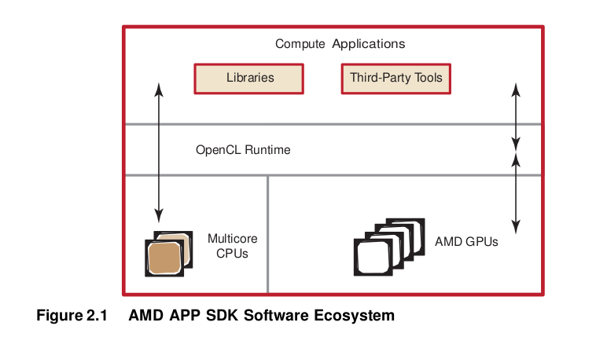

The AMD ROCm software stack provides end-users and developers with a complete, flexible suite of tools to leverage the processing power in AMD GPUs. AMD ROCm software embraces open-systems, open-platform standards. The AMD Accelerated Parallel Processing Technology open platform strategy enables AMD technology partners to develop and provide third-party development tools.

The software includes the following components:

  * OpenCL compiler and runtime
  * Debugging and Performance Profiling Tools – AMD CodeXL.
  * Performance Libraries – clMath and other OpenCL accelerated libraries for optimized NDRange-specific algorithms.

The latest generations of AMD GPUs use unified shader architectures capable of running different kernel types interleaved on the same hardware.Programmable GPU compute devices execute various user-developed programs,known to graphics programmers as shaders and to compute programmers as kernels. These GPU compute devices can execute non-graphics functions using a data-parallel programming model that maps executions onto compute units. Each compute unit contains one (pre-GCN devices) or more (GCN devices) vector (SIMD) units. In this programming model, known as AMD Accelerated Parallel Processing Technology, arrays of input data elements stored in memory are accessed by a number of compute units.

Each instance of a kernel running on a compute unit is called a work-item. Work- items are mapped to an n-dimensional index space, called an NDRange.

The GPU schedules the range of work-items onto a group of processing elements, until all work-items have been processed. Subsequent kernels then can be executed, until the application completes. A simplified view of the AMD Accelerated Parallel Processing Technology programming model and the mapping of work-items to processing elements is shown in Figure 2.2.

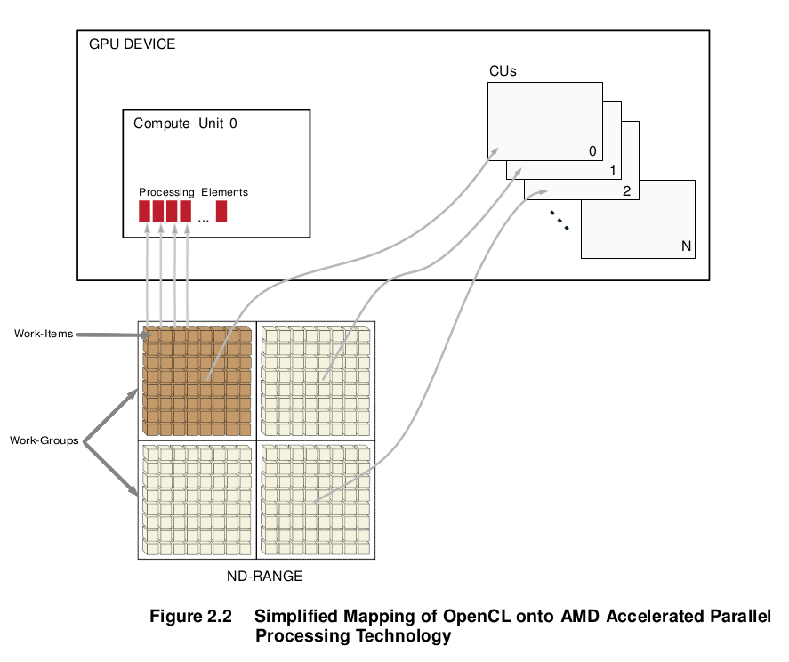

Work-groups are assigned to CUs. All work-items of a work-group can be processed only by the processing elements of a single CU. A processing element can process only one work-item at a time; however, a CU can process multiple work-groups.

Note that in OpenCL 2.0, the work-groups are not required to divide evenly into the NDRange.

OpenCL maps the total number of work-items to be launched onto an n- dimensional grid (ND-Range). The developer can specify how to divide these items into work-groups. AMD GPUs execute on wavefronts (groups of work-items executed in lock-step in a compute unit); there is an integer number of wavefronts in each work-group. Thus, as shown in Figure 2.3, hardware that schedules work-items for execution in the AMD Accelerated Parallel Processing Technology environment includes the intermediate step of specifying wavefronts within a work-group. This permits achieving maximum performance on AMD GPUs. For a more detailed discussion of wavefronts.

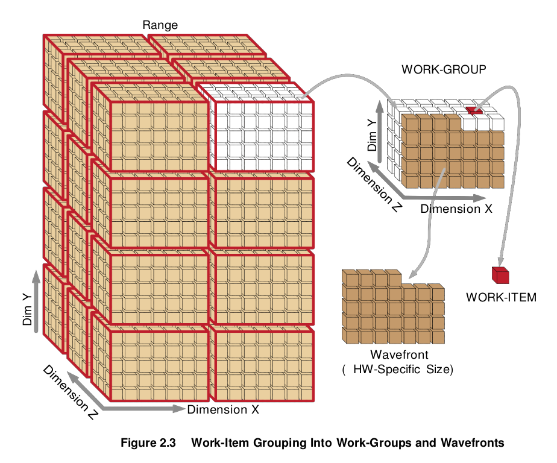

Work-Item Processing
*****************************

All processing elements within a vector unit execute the same instruction in each cycle. For a typical instruction, 16 processing elements execute one instruction for 64 work items over 4 cycles. The block of work-items that are executed together is called a wavefront. For example, on the AMD Radeon™ HD 290X

compute device, the 16 processing elements within each vector unit execute the same instruction for four cycles, which effectively appears as a 64-wide compute unit in execution width.

The size of wavefronts can differ on different GPU compute devices. For example, some of the low-end and older GPUs, such as the AMD Radeon™ HD 54XX series graphics cards, have a wavefront size of 32 work-items. Higher-end and newer AMD GPUs have a wavefront size of 64 work-items.

Compute units operate independently of each other, so it is possible for different compute units to execute different instructions. It is also possible for different vector units within a compute unit to execute different instructions.

Before discussing flow control, it is necessary to clarify the relationship of a wavefront to a work-group. If a user defines a work-group, it consists of one or more wavefronts. A wavefront is a hardware thread with its own program counter; it is capable of following control flow independently of other wavefronts. A wavefront consists of 64 or fewer work-items. The mapping is based on a linear work-item order. On a device with a wavefront size of 64, work-items 0-63 map to wavefront 0, work items 64-127 map to wavefront 1, etc. For optimum hardware usage, an integer multiple of 64 work-items is recommended.

work-Item Creation
******************
For each work-group, the GPU compute device spawns the required number of wavefronts on a single compute unit. If there are non-active work-items within a wavefront, the processing elements that would have been mapped to those work- items are idle. An example is a work-group that is a non-multiple of a wavefront size.

Flow Control
*************
Flow control, such as branching, is achieved by combining all necessary paths as a wavefront. If work-items within a wavefront diverge, all paths are executed serially. For example, if a work-item contains a branch with two paths, the wavefront first executes one path, then the second path. The total time to execute the branch is the sum of each path time. An important point is that even if only one work-item in a wavefront diverges, the rest of the work-items in the wavefront execute the branch. The number of work-items that must be executed during a branch is called the branch granularity. On AMD hardware, the branch granularity is the same as the number of work-items in a wavefront.

Masking of wavefronts is effected by constructs such as: ::

 if(x)
 {
 .	//items within these braces = A
 .
 .
 }
 else
 {
 .	//items within these braces = B
 .

 .
 }

The wavefront mask is set true for lanes (elements/items) in which x is true, then execute A. The mask then is inverted, and B is executed.

**Example 1:** If two branches, A and B, take the same amount of time t to execute over a wavefront, the total time of execution, if any work-item diverges, is 2t.

Loops execute in a similar fashion, where the wavefront occupies a compute unit as long as there is at least one work-item in the wavefront still being processed. Thus, the total execution time for the wavefront is determined by the work-item with the longest execution time.

**Example 2:** If t is the time it takes to execute a single iteration of a loop; and within a wavefront all work-items execute the loop one time, except for a single work-item that executes the loop 100 times, the time it takes to execute that entire wavefront is 100t.

.. _Hardware-Overview-GCNDevices:

Hardware Overview for GCN Devices
##################################

A general OpenCL device comprises compute units (CUs), each of which has sub-modules that ultimately have ALUs. A work-item (or SPMD kernel instance)
executes on an ALU, as shown in Figure 2.4).

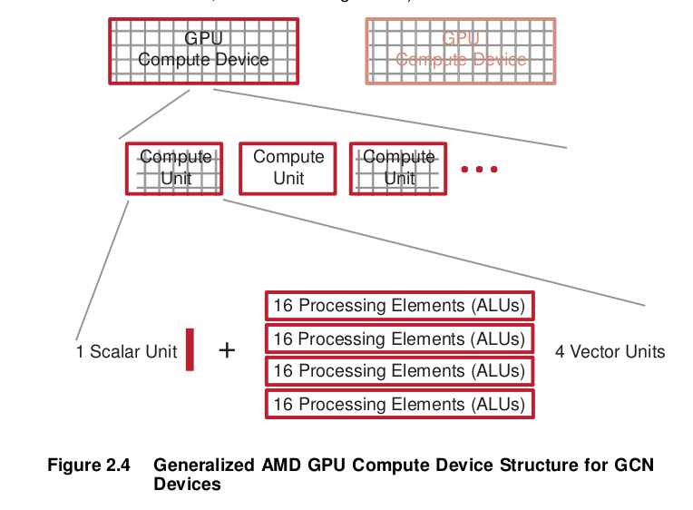

In GCN devices, each CU includes one Scalar Unit and four Vector (SIMD) units, each of which contains an array of 16 processing elements (PEs). Each PE contains one ALU. Each SIMD unit simultaneously executes a single operation across 16 work items, but each can be working on a separate wavefront.

For example, for the AMD Radeon™ HD 79XX devices each of the 32 CUs has one Scalar Unit and four Vector Units. Figure 2.5 shows only two compute engines/command processors of the array that comprises the compute device of
the AMD Radeon™ HD 79XX family.

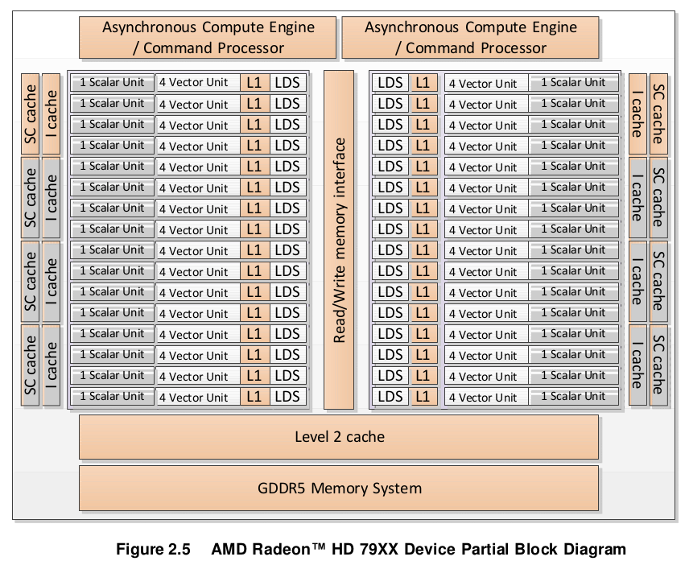

In Figure 2.5, there are two command processors, which can process two command queues concurrently. The Scalar Unit, Vector Unit, Level 1 data cache (L1), and Local Data Share (LDS) are the components of one compute unit, of which there are 32. The scalar (SC) cache is the scalar unit data cache, and the Level 2 cache consists of instructions and data.

On GCN devices, the instruction stream contains both scalar and vector instructions. On each cycle, it selects a scalar instruction and a vector instruction (as well as a memory operation and a branch operation, if available); it issues one to the scalar unit, the other to the vector unit; this takes four cycles to issue over the four vector cores (the same four cycles over which the 16 units execute 64 work-items).

The Asynchronous Compute Engines (ACEs) manage the CUs; a graphics command processor handles graphics shaders and fixed-function hardware.

Key differences between pre-GCN and GCN devices
***********************************************
In pre-GCN devices (for a hardware overview, see Appendix D, “Hardware overview of pre-GCN devices.”), each compute unit consists of a single vector unit, each containing up to 16 processing elements. Each processing element, which contains 4 or 5 ALUs, could execute bundles of 4 or 5 independent instructions co-issued in a VLIW (Very Long Instruction Word) format. All the processing elements within a vector unit execute a single wavefront (a group of
64 work items). If operations within a wavefront contain dependencies, they cannot be scheduled in the same clock cycle, leaving some ALUs un-utilized. In such cases, some processing elements (and hence, vector units) remain under- utilized.

In GCN devices, the CUs are arranged in four vector unit arrays consisting of 16 processing elements each. Each of these arrays executes a single instruction across each lane for each block of 16 work-items. That instruction is repeated over four cycles to make the 64-element vector called a wavefront.

Thus, in GCN devices, the four vector units within a CU can operate on four different wavefronts. If operations within a wavefront include dependencies, independent operations from different wavefronts can be selected to be assigned to a single vector unit to be executed in parallel every cycle.

GCN-based GPUs have 32KB of dedicated L1 instruction cache. A single instruction cache instance serves up to 4 CUs (depending upon the architecture family and device), with each CU holding up to 40 wavefronts. As each wavefront includes its own program counter, a single instruction cache unit may serve up to 160 wavefronts with each executing a different instruction in the program.

**Note:** If the program is larger than 32KB, the L1-L2 cache trashing can inhibit performance. The size of the ISA can be determined by using the CodeXL analysis mode, under the Statistics tab. For information about how to use CodeXL, see Chapter 4.

Key differences between Southern Islands, Sea Islands, and Volcanic Islands families
*************************************************************************************
The number of Asynchronous Compute Engines (ACEs) and CUs in an AMD GCN family GPU, and the way they are structured, vary with the GCN device family, as well as with the device designations within the family.

The ACEs are responsible for managing the CUs and for scheduling and resource allocation of the compute tasks (but not of the graphics shader tasks). The ACEs operate independently; the greater the number of ACEs, the greater is the performance. Each ACE fetches commands from cache or memory, and

creates task queues to be scheduled for execution on the CUs depending on their priority and on the availability of resources.

Each ACE contains up to eight hardware queues and, together with the graphics command processor, allows up to nine independent vector instructions to be executed per clock cycle. Some of these queues are not available for use by OpenCL.

Devices in the Southern Islands families typically have two ACEs. The ACE engines on the Southern Islands families are single-threaded, which means that they contain two hardware queues.

Devices in the Sea Islands and Volcanic Islands families contain between four and eight ACEs, and are multi-threaded (thereby supporting more hardware queues) so they offer more performance. For example, the AMD Radeon™ R9
290X devices, in the VI family contain 8 ACEs and 44 CUs.

A note on hardware queues
**************************
A hardware queue can be thought of as a GPU entry point. The GPU can process kernels from several compute queues concurrently. All hardware queues ultimately share the same compute cores. The use of multiple hardware queues is beneficial when launching small kernels that do not fully saturate the GPU. For example, the AMD Radeon™ HD 290X compute device can execute up to
112,640 threads concurrently. The GPU can execute two kernels each spawning
56320 threads (assuming fully occupancy) twice as fast if launched concurrently through two hardware queues than serially through a single hardware queue.

An OpenCL queue is assigned to a hardware queue on creation time. The hardware queue is selected according to the creation order of the OpenCL queue within an OpenCL context. If the GPU supports K hardware queues, the Nth created OpenCL queue will be assigned to the (N mod K) hardware queue. The number of compute queues can be limited by specifying the GPU_NUM_COMPUTE_RINGS environment variable.

.. _Communication-Host-GPU:

Communication Between Host and the GPU Compute Device
#######################################################
The following subsections discuss the communication between the host (CPU) and the GPU in a compute device. This includes an overview of the PCIe bus, processing API calls, and DMA transfers.

Communication and data transfers between the system and the GPU compute device occur on the PCIe channel. AMD graphics cards use PCIe 2.0 x16 (second generation, 16 lanes).  Generation 1 x16 has a theoretical maximum
throughput of 4 GBps in each direction. Generation 2 x16 doubles the throughput to 8 GBps in each direction. Southern Islands AMD GPUs support PCIe 3.0 with a theoretical peak performance of 16 GBps. Actual transfer performance is CPU and chipset dependent.

Transfers from the system to the GPU compute device are done either by the
command processor or by the DMA engine. The GPU compute device also can

read and write system memory directly from the compute unit through kernel instructions over the PCIe bus.

Processing API Calls: The Command Processor
*******************************************
The host application does not interact with the GPU compute device directly. A driver layer translates and issues commands to the hardware on behalf of the application.

Most commands to the GPU compute device are buffered in a command queue on the host side. The queue of commands is sent to, and processed by, the GPU compute device. There is no guarantee as to when commands from the command queue are executed, only that they are executed in order.

Command queue elements include:

 * Kernel execution calls
 * Kernels
 * Constants
 * Transfers between device and host

DMA Transfers
*************
Certain memory transfer calls use the DMA engine. To properly leverage the DMA engine, make the associated OpenCL data transfer calls. See the AMD OpenCL Optimization Reference Guide for more information.

Direct Memory Access (DMA) memory transfers can be executed separately from the command queue using the DMA engine on the GPU compute device. DMA calls are executed immediately; and the order of DMA calls and command queue flushes is guaranteed.

DMA transfers can occur asynchronously. This means that a DMA transfer is executed concurrently with other system or GPU compute operations when there are no dependencies. However, data is not guaranteed to be ready until the DMA engine signals that the event or transfer is completed. The application can use OpenCL to query the hardware for DMA event completion. If used carefully, DMA transfers are another source of parallelization.

All GCN devices have two DMA engines that can perform bidirectional transfers over the PCIe bus with multiple queues created in consecutive order, since each DMA engine is assigned to an odd or an even queue correspondingly.

Masking Visible Devices
***********************
By default, OpenCL applications are exposed to all GPUs installed in the system;
this allows applications to use multiple GPUs to run the compute task.

In some cases, the user might want to mask the visibility of the GPUs seen by the OpenCL application. One example is to dedicate one GPU for regular

graphics operations and the other three (in a four-GPU system) for Compute. To do that, set the GPU_DEVICE_ORDINAL environment parameter, which is a comma- separated list variable:

 * Under Windows: set GPU_DEVICE_ORDINAL=1,2,3
 * Under Linux: export GPU_DEVICE_ORDINAL=1,2,3

Another example is a system with eight GPUs, where two distinct OpenCL applications are running at the same time. The administrator might want to set GPU_DEVICE_ORDINAL to 0,1,2,3 for the first application, and 4,5,6,7 for the second application; thus, partitioning the available GPUs so that both applications can run at the same time.

.. _Wavefront-Scheduling:

Wavefront Scheduling
#####################
GPU compute devices are very efficient at parallelizing large numbers of work- items in a manner transparent to the application. Each GPU compute device uses the large number of wavefronts to hide memory access latencies by having the resource scheduler switch the active wavefront in a given compute unit whenever the current wavefront is waiting for a memory access to complete. Hiding memory access latencies requires that each work-item contain a large number of ALU operations per memory load/store.

Figure 2.6 shows the timing of a simplified execution of wavefronts in a single compute unit. At time 0, the wavefronts are queued and waiting for execution. In this example, only four wavefronts (T0…T3) are scheduled for the compute unit. The hardware limit for the number of active wavefront is dependent on the resource usage (such as the number of active registers used) of the program being executed. An optimally programmed GPU compute device typically has many of active wavefronts.

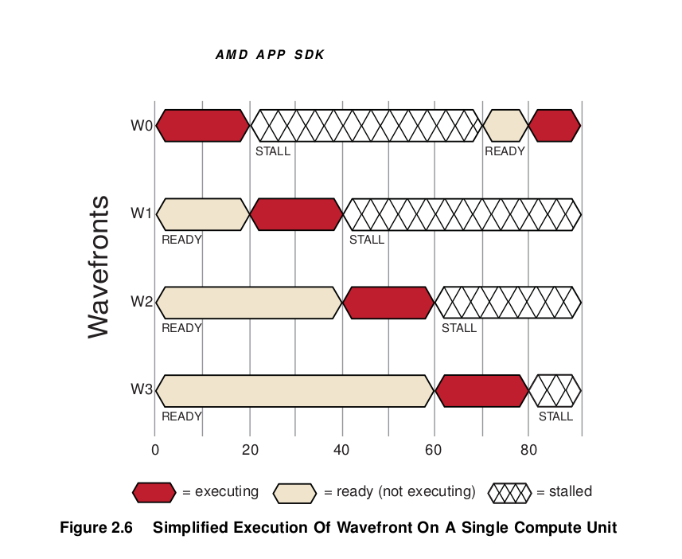

At runtime, wavefront T0 executes until cycle 20; at this time, a stall occurs due to a memory fetch request. The scheduler then begins execution of the next wavefront, T1. Wavefront T1 executes until it stalls or completes. New wavefronts execute, and the process continues until the available number of active wavefronts is reached. The scheduler then returns to the first wavefront, T0.

If the data wavefront T0 is waiting for has returned from memory, T0 continues execution. In the example in Figure 2.6, the data is ready, so T0 continues. Since there were enough wavefronts and processing element operations to cover the long memory latencies, the compute unit does not idle. This method of memory latency hiding helps the GPU compute device achieve maximum performance.

If none of T0 – T3 are runnable, the compute unit waits (stalls) until one of T0 – T3 is ready to execute. In the example shown in Figure 2.7, T0 is the first to continue execution.

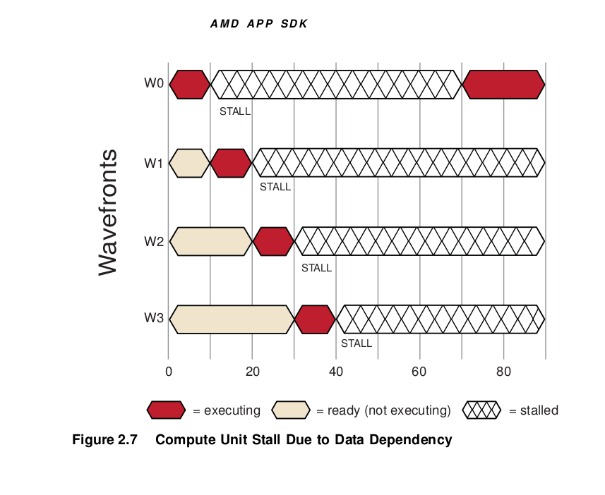

.. _Build_Run_Opencl:

Building and Running OpenCL Programs
====================================

An OpenCL application consists of a host program (C/C++) and an optional kernel program (.cl). To compile an OpenCL application, the host program must be compiled; this can be done using an off-the-shelf compiler such as g++ or MSVC++. The application kernels are compiled into device-specific binaries using the OpenCL compiler.

.. _Compilin-Host-Program:

Compiling the Host Program
###########################
In order to compile the host program, users must install the OpenCL Compiler and language runtime on the ROCm, On Ubuntu is rocm-opencl-dev which provides all the necessary OpenCL runtime headers and libraries required by the host compiler. If wish to support application build with the historical  APPS SDK sets an environmental variable named AMDAPPSDKROOT to the path of the directory in which the ROCm OpenCL is installed. It should be /opt/rocm/opencl.  The runtime headers and libraries are placed in the install directory under the “include” and “lib” sub-folders, respectively. 

While building the host program, these headers and libraries must be included in the project by choosing the appropriate options for the targeted operating system, IDE, and compiler.

Compiling on Linux
********************

To compile OpenCL applications on Linux, gcc or the Intel C compiler must be installed. There are two major steps: compiling and linking.

1. Compile all the C++ files (Template.cpp), and get the object files.
  64-bit object files on 64-bit system::
     
     g++ -o Template.o -c Template.cpp -I$ROCMOPENCL/include

2. Link all the object files generated in the previous step to the OpenCL library and create an executable.

   For linking to a 64-bit library::
   
     g++ -o Template Template.o -lOpenCL -L$ROCMOPENCL/lib/x86_64

.. _Compiling-device-programs:

Compiling the device programs
##############################

OpenCL device programs that will be executed in parallel by each work-item are expressed in terms of kernel functions. The device programs may also include other helper functions (which cannot be invoked by the host) in addition to the kernels.

The device programs are written in the OpenCL C language. The device programs must be built for each target device before they can be executed on the OpenCL device. As a result, the same source program may have multiple device-specific binaries. To manage this conveniently, the OpenCL runtime provides a container-like object, called a program object, that contains the source code as well as the device-specific binaries of all the kernels and helper functions that are defined in a program scope. Compiling the application kernels requires first creating program objects.

Creating OpenCL program objects
********************************
In general, OpenCL program objects are created in two ways:

 * From the OpenCL C source
 * From a pre-built binary (either device-specific or device-agnostic)

Creating program objects from the OpenCL C source
**************************************************
In this method, the OpenCL C source is passed to the
clCreateProgramWithSource runtime API (for more details, see the OpenCL

specification) as a text buffer to create the program object. If the source code is in an external file, then it must be read and placed in a text buffer before passing the buffer to the API.

Note: Most of the examples in this chapter are shown using runtime C APIs. In order to use the C++ wrapper APIs, one must map (a trivial step) the C APIs to corresponding C++ wrapper APIs. For cleanness, error checking is not shown.

**Example creation of program objects from an inline text string :**
::

  const char *source =
  " kernel void myKernel(  global uint *src,  global uint *dst)\n"
  "{ \n"
  " uint gid = get_global_id(0); \n"
  " dst[gid] = src[gid] * 10; \n"
  "} \n";

  cl_program program = clCreateProgramWithSource( context, 1,
  &source, NULL, NULL );

**Example creation of program objects from an external file :**

:: 

   std::ifstream f("my_kernel.cl");
   std::stringstream st;
   st << f.rdbuf();
   std::string ss = st.str();
   const char* source = ss.c_str();
   const size_t length = ss.length();

   cl_program program = clCreateProgramWithSource(context, 1, &source,
   &length, NULL)

Creating program objects from a pre-built binary
************************************************
OpenCL allows the creation of program object from binaries previously built for one or more specific device(s) or from intermediate device-agnostic binaries (using, for example, the Standard Portable Intermediate Representation (SPIR) format). Such binaries serve two useful purposes:

 * Software vendors can protect their IP by supplying the OpenCL library as a collection of pre-built binary programs instead of as  raw source code.
 * The consumer of the OpenCL library can create new program objects using those binaries for use with their own applications.

In this method, the OpenCL binary is passed to the binaries argument of the clCreateProgramWithBinary runtime API (for more details, see the OpenCL specification). If the binary program code is in a file, the binary must be loaded from the file, the content of the file must be placed in a character buffer, and the resulting buffer must be passed to the clCreateProgramWithBinary API.

Building the program executable from the program objects
*********************************************************
After the program object is created (from either sources or binaries), the program must be built for the targeted devices and the device executables must be generated. The executables are generated mainly in two ways:

 * Building (compile and link) the program in a single step (using clBuildProgram)
 * Compiling and linking the program separately (using clCompileProgram and clLinkProgram)

Building the program in a single step
**************************************
The most common way of building program objects, this method uses a single API, clBuildProgram, for both compiling and linking the program. For additional details about this API, see the OpenCL specification.

**Example(s):**

Suppose a program object has been created as follows:
  | cl_program program = clCreateProgramWithSource(context, 1, &source,&length, NULL);

Next, the program object can be built for all the devices in the context or for a list of selected devices.

* To build the program for all the devices, “NULL” must be passed against the target device list argument, as shown below:     	

:: 
    
  clBuildProgram(program, 0, NULL, NULL, NULL, NULL);

* To build for any particular GPU device or a list of devices :
  
:: 
    
  int nDevices = 0; 
  clGetDeviceIDs(platform, CL_DEVICE_TYPE_GPU, 0, NULL, &nDevices);
  cl_device_id * devices = malloc(nDevices * sizeof(cl_device_id));
  clGetDeviceIDs(platform, CL_DEVICE_TYPE_GPU, nDevices * sizeof(cl_device_id), devices, NULL);

* To build for the nth GPU device in a list of devices:

:: 
    
  clBuildProgram(program, 1, &devices[n], NULL, NULL, NULL);

* To build for the first n number of GPU devices

:: 
    clBuildProgram(program, n, devices, NULL, NULL, NULL);

**Build Options:**

A list of options can be passed during program build to control each stage of the building process. The full list includes various categories of options, such as preprocessor, compiler, optimization, linker, and debugger. Some of them are standard (specified by Khronos); others are vendor-specific. For details about the standard options, see the clBuildProgram API’s description in the OpenCL specification.

For information about the frequently used standard build options, see  “Supported Standard OpenCL Compiler Options”.

For information about AMD-developed supplemental options and environment variables, see  “AMD-Developed Supplemental Compiler Options”.

**Special note for building OpenCL 2.0 programs:**

In order to build the program with OpenCL 2.0 support, the ``-cl-std=CL2.0`` option must be specified; otherwise, the highest OpenCL C 1.x language version supported by each device is used when compiling the program for each device.

OpenCL 2.0 is backwards-compatible with OpenCL 1.X. Applications written on OpenCL 1.x should run on OpenCL 2.0 without requiring any changes to the application.

**Special note for debugging:**

OpenCL provides a way to check and query the compilation/linking errors that occur during program build. Various build parameters for each device in the program object can be queried by using the clGetProgramBuildInfo API. Retrieving the build, compile or link log by using the ``CL_PROGRAM_BUILD_LOG`` input parameter is a useful and frequently-used technique. For details, see the OpenCL specification.

**Example:**

:: 

  cl_int err = clBuildProgram(program, 1, &device, NULL, NULL, NULL);
  if (err != CL_SUCCESS)
  {
    printf("clBuildProgram failed: %d\n", err);
    char log[0x10000];
    clGetProgramBuildInfo( program, device, CL_PROGRAM_BUILD_LOG, 0x10000, log, NULL);
    printf("\n%s\n", log);
    return -1;
  }

Compiling and linking the program separately
*********************************************
In this method, two separate steps are performed to generate the device executable. First, program objects are compiled by using the clCompileProgram API (for details, see the OpenCL specification); then the compiled programs are linked together to generate the final executable by using the clLinkProgram API (for details, see the OpenCL specification). This method is particularly useful-- and is the only way--to link a previously-compiled program. By using this method, users can link their program objects with external program objects to build the final program object.

Both the APIs support similar options (depends on whether one is compiling or linking) as the options in clBuildProgram, to control the compiler and linker. For details about the options supported by each API, see the respective API description section in the OpenCL specification.

**Compiling the program**

The user must compile each program object separately. This step may be a little tedious if a source program depends on other header files. In that case, separate program objects corresponding each header file must be created first. Then, during compilation, those header programs must be passed as embedded headers along with the intended program object.

**Example (derived from the OpenCL specification):**

Consider the following program source:
 
:: 

  #include <foo.h>
  #include <mydir/myinc.h>
  __kernel void image_filter (int n, int m, constant float *filter_weights,
                              read_only image2d_t src_image, write_only image2d_t dst_image)
  {
  ...
  }

This kernel includes two headers, foo.h and mydir/myinc.h. So first create the program objects corresponding to each header as follows:

:: 

  cl_program foo_pg = clCreateProgramWithSource(context, 1, &foo_header_src, NULL, &err);

::

  cl_program myinc_pg = clCreateProgramWithSource(context, 1, &myinc_header_src, NULL, &err);

Suppose the program source described above is given by program_A and is loaded via clCreateProgramWithSource.

Now, these headers can be passed as embedded headers along with the program object

:: 

   cl_program input_headers[2] = { foo_pg, myinc_pg }; 
   char * input_header_names[2] = { “foo.h”, “mydir/myinc.h” };

   clCompileProgram(program_A, 0, NULL, // num_devices & device_list
      NULL, // compile_options
      2, // num_input_headers
      input_headers,
      input_header_names,
      NULL, NULL); // pfn_notify & user_data

**Linking the program**

In this phase, multiple pre-compiled program objects are linked together to create a new program object that contains the final executable. The executable binary can be queried by using ``clGetProgramInfo`` and can be specified to ``clCreateProgramWithBinary``, as shown earlier.

**Example :**

Assume there are two pre-compiled program objects, program_A and
program_B. These two can be linked together as follows:

::

  cl_program program_list[] = { program_A, program_B};
  cl_program program_final = clLinkProgram(context,
      0, NULL, // num_devices & device_list
      NULL, // compile_options
      2, // num_input_programs,
      program_list, // const cl_program
      *input_programs,

      user_data

      NULL, NULL, // pfn_notify &
      NULL); // errcode_ret

.. _Supported-Standard-OpenCL-Compiler:

Supported Standard OpenCL Compiler Options
###########################################
The frequently-used build options are:

 * -I dir — Add the directory dir to the list of directories to be searched for header files. When parsing #include directives, the 	OpenCL compiler resolves relative paths using the current working directory of the application.
 * -D name — Predefine name as a macro, with definition = 1. For -D name=definition, the contents of definition are tokenized and processed as if they appeared during the translation phase three  in a #define directive. In particular, the definition is truncated by embedded newline characters.
   -D options are processed in the order they are given in the options argument to ``clBuildProgram``.

For additional build options, see the :ref:OpenCL specification.

.. _AMD-Developed-Supplemental-Compiler:

AMD-Developed Supplemental Compiler Options
############################################

The following supported options are not part of the OpenCL specification:

 * -g — This is an experimental feature that lets you use the GNU project debugger, GDB, to debug kernels on x86 CPUs running Linux or
   cygwin/minGW under Windows. For more details, see Chapter 4, “Debugging and Profiling OpenCL.” This option does not affect the    	default optimization of the OpenCL code.
 * -O0 — Specifies to the compiler not to optimize. This is equivalent to the OpenCL standard option -cl-opt-disable.
 * -f[no-]bin-source — Does [not] generate OpenCL source in the .source section. For more information, see Appendix C, “OpenCL BinaryImage Format (BIF) v2.0.” by default, this option does NOT generate the source.
 * -f[no-]bin-llvmir — Does [not] generate LLVM IR in the .llvmir section.
   For more information, see Appendix C, “OpenCL Binary Image Format (BIF) v2.0.” By default, this option GENERATES the LLVM IR.
 * -f[no-]bin-amdil — Does [not] generate AMD IL in the .amdil section. For more information, see Appendix C, “OpenCL Binary Image  	Format (BIF) v2.0.” By default, this option does NOT generate the AMD IL.
 * -f[no-]bin-exe — Does [not] generate the executable (ISA) in the .text section. For more information, see Appendix C, “OpenCL    	Binary Image Format (BIF) v2.0.” By default, this option GENERATES the ISA.
 * -f[no-]bin-hsail — Does [not] generate HSAIL/BRIG in the binary. By default, this option does NOT generate HSA IL/BRIG in the    	binary.
 * -save-temps[=<prefix>] — This option dumps intermediate temporary files, such as IL and ISA code, for each OpenCL kernel. If      	<prefix> is not given, temporary files are saved in the default temporary directory (the current directory for Linux, C:\Users    	\<user>\AppData\Local for Windows). If <prefix> is given, those temporary files are saved with the given
   <prefix>. If <prefix> is an absolute path prefix, such as
   C:\your\work\dir\mydumpprefix, those temporaries are saved under C:\your\work\dir, with mydumpprefix as prefix to all temporary   	names. For example,

  | -save-temps
  | under the default directory
  | _temp_nn_xxx_yyy.il,  _temp_nn_xxx_yyy.isa

  |
  
  | -save-temps=aaa
  | under the default directory
  | aaa_nn_xxx_yyy.il,  aaa_nn_xxx_yyy.isa

  |
 
  | -save-temps=C:\you\dir\bbb
  | under C:\you\dir
  | bbb_nn_xxx_yyy.il,  bbb_nn_xxx_yyy.isa

where xxx and yyy are the device name and kernel name for this build, respectively, and nn is an internal number to identify a build to avoid overriding temporary files. Note that this naming convention is subject to change.

To avoid source changes, there are two environment variables that can be used to change CL options during the runtime.

* AMD_OCL_BUILD_OPTIONS — Overrides the CL options specified in clBuildProgram().
* AMD_OCL_BUILD_OPTIONS_APPEND — Appends options to those specified in clBuildProgram().

.. _Creating-device-specific-binaries:

Creating device-specific binaries
##################################
To generate pre-built device-specific binaries from the OpenCL C source or from other binaries (such as the SPIR binaries), certain add-on steps must be performed on the host side. The following is a typical sequence of steps if device- specific binaries are to be generated from the OpenCL C sources:

1. Create the program object from OpenCL C source using clCreateProgramWithSource().

2.   Build (i.e. compile and link) the program object (for details, see the “Generating program executable” section).

3.   Read the device-specific binaries from the program object using clGetProgramInfo() as shown below:

 ::

   //Get the number of devices attached with program object
   cl_uint nDevices = 0;
   clGetProgramInfo(program, CL_PROGRAM_NUM_DEVICES, sizeof(cl_uint), &nDevices, NULL);
 
   //Get the Id of all the attached devices
   cl_device_id *devices = new cl_device_id[nDevices]; clGetProgramInfo(program, CL_PROGRAM_DEVICES, sizeof(cl_device_id) * nDevices, devices, NULL);
   
   // Get the sizes of all the binary objects
   size_t *pgBinarySizes = new size_t[nDevices]; lGetProgramInfo(program, CL_PROGRAM_BINARY_SIZES, sizeof(size_t) * nDevices, pgBinarySizes, NULL);
  
   // Allocate storage for each binary objects
   unsigned char **pgBinaries = new unsigned char*[nDevices];
   for (cl_uint i = 0; i < nDevices; i++)
   {
     pgBinaries[i] = new unsigned char[pgBinarySizes[i]];
   }
  
   // Get all the binary objects
   clGetProgramInfo(program, CL_PROGRAM_BINARIES, sizeof(unsigned char*) * nDevices, pgBinaries, NULL);

Now, save these device specific binaries into the files for future use.

.. _Command-execution-flow:

Command execution flow
#######################
The runtime system assigns the work in the command queues to the underlying devices. Commands are placed into the queue using the ``clEnqueue`` commands shown in the listing below.

============================= ======================================================
OpenCL API Function       	Description
============================= ======================================================
clCreateCommandQueueWith       Create a command queue for a specific device 
Properties (in OpenCL 2.0)     (CPU,GPU.)
clCreateCommandQueue() 
(in OpenCL 1.x; deprecated 
in OpenCL 2.0) 

clCreateKernel()	       Creates a kernel object from the program object. 

clCreateBuffer()	       Creates a buffer object for use via OpenCL kernels.

clSetKernelArg()	       Set the kernel arguments, and enqueue the kernel in a 
clEnqueueNDRangeKernel()       command queue.

clEnqueueReadBuffer(), 	       Enqueue a command in a command queue to read from a 
clEnqueueWriteBuffer()	       buffer object to host memory, or write to the buffer 
			       object from host memory

clEnqueueWaitForEvents()	Wait for the specified events to complete.
============================= ====================================================== 

The commands can be broadly classified into three categories.

 * Kernel commands (for example, clEnqueueNDRangeKernel(), etc.),
 * Memory commands (for example, clEnqueueReadBuffer(), etc.), and
 * Event commands (for example, clEnqueueWaitForEvents(), etc.

As illustrated in Figure 3.1, the application can create multiple command queues (some in libraries, for different components of the application, etc.). These queues are mixed into one queue per device type. The figure shows command queues 1 and 3 merged into one CPU device queue (blue arrows); command queue 2 (and possibly others) are merged into the GPU device queue (red arrow). The device queue then schedules work onto the multiple compute resources present in the device. Here, K = kernel commands, M = memory commands, and E = event commands.

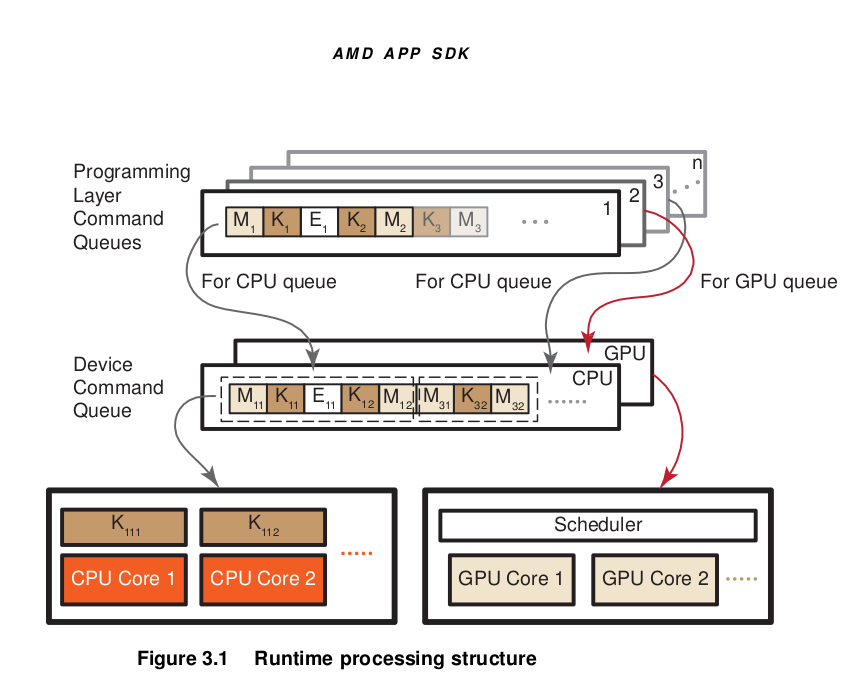

.. _Running-Program:

Running the Program
####################

Creating Kernel Objects
***********************
After a program is created and built, the next step is to run the kernel code on the devices. Running the kernel code requires the creation of one or more kernel objects for each kernel function (declared as “   kernel” or “kernel”). Kernel objects are run-time objects that bind the specific kernel function with the argument values to be used while executing it.

The clCreateKernel API creates a kernel object from a program object by using the name of the kernel function passed with program object. The arguments to kernel objects are set by the following APIs:

clSetKernelArg: used to set all the kernel arguments except SVM pointers.

clSetKernelArgSVMPointer: introduced in OpenCL2.0 as a new API to set
SVM pointers as the argument value.

**Example:**

A sample kernel definition is shown below.
::
  
  kernel void sample_kernel( global const uchar *normalPtr, global uchar *svmPtr)
  {  
    …
  }

To create a kernel object for the above kernel, you must pass the program object corresponding to the kernel to the clCreateKernel function. Assuming that the program object containing the above kernel function has been created and built as program, a kernel object for the above kernel would be created as follows:

``cl_kernel kernel = clCreateKernel(program, "sample_kernel", NULL);``

Suppose a buffer object and an SVM array have been created as follows:

``cl_mem buffer = clCreateBuffer(context, CL_MEM_READ_ONLY, length * sizeof(cl_uchar), NULL, NULL);``

``cl_uchar *svmPtr = clSVMAlloc(context,	CL_MEM_READ_WRITE, length * sizeof(cl_uchar), 0);``

Now, to set the kernel arguments for the kernel object, the buffer (or SVM array in OpenCL 2.0) and the corresponding index must be passed to the kernel as first and second argument, respectively:

``clSetKernelArg(kernel, 0, sizeof(cl_mem), (void *)&buffer);``

``clSetKernelArgSVMPointer(kernel, 1, (void *)( svmPtr));``

Creating a command queue
*************************
In order to run kernels or any other commands in a device, the host must create a command queue associated with the device and then en-queue the commands to that command queue. A command queue is associated with only one device; however, a device can have one or more command queues. The device executes the commands in-order or out-of-order depending on the mode set during command creation.

A command queue (host or device) is created by using the clCreateCommandQueueWithProperties API (clCreateCommandQueue in OpenCL 1.x, deprecated in OpenCL 2.0) by specifying the device ID of the targeted device within the context; and the queue properties, which specify the type of the queue (host or device) and the mode of command execution (in-order or out-of-order). For details, see the clCreateCommandQueueWithProperties or clCreateCommandQueue API in the OpenCL specification.

**Example: To create a default host-side command queue**
::

  cl_queue_properties *props = NULL; cl_command_queue commandQueue = clCreateCommandQueueWithProperties(context, deviceId, props, &status);

**Example: To create a host-side out-of-order command queue with profiling enabled**
::

   cl_queue_properties prop[] = { CL_QUEUE_PROPERTIES, CL_QUEUE_OUT_OF_ORDER_EXEC_MODE_ENABLE | CL_QUEUE_PROFILING_ENABLE, 0};
   cl_command_queue commandQueue = clCreateCommandQueueWithProperties(context, deviceId, props, &status);

**Example: To create a default device-side out-of-order command queue with a specific size**
::
  
   cl_queue_properties prop[] = { CL_QUEUE_PROPERTIES, CL_QUEUE_OUT_OF_ORDER_EXEC_MODE_ENABLE | CL_QUEUE_ON_DEVICE | CL_QUEUE_ON_DEVICE_DEFAULT, CL_QUEUE_SIZE, maxQueueSize, 0 };

   cl_command_queue commandQueue = clCreateCommandQueueWithProperties(context, deviceId, props, &status);

Running a Kernel (from the host)
*********************************
After a command queue has been created, the queue can be used to en-queue the commands to the associated device. The clEnqueueNDRangeKernel API en-queues a command to execute a kernel to a device. During the kernel en- queue, one must specify the total number of kernel instances or work-items to be executed by the device and the size of each work-group or block. This information is set by the work_dim, global_work_size, local_work_size and global_work_offset arguments. Like any other command en-queuing API, the clEnqueueNDRangeKernel returns an event object that conveys information about the en-queued kernel and can be used to synchronization other commands dependent on this kernel. In this API, a list of events that need to complete before this particular command can be executed can be specified.

For example, suppose a kernel object and command queue, named “kernel” and “commandQueue” respectively, have already been created. Suppose you want to launch the kernel over a 2-D dimensional space having total work-items
{1024x1024} and each block/group size {16x16}. To do this, the kernel can be en-queued into the command queue as follows:

 | cl_uint workDim = 2;
 | size_t globalWorkSize[] = {1024, 1024};
 | size_t localWorkSize[] = {16, 16};

 | clEnqueueNDRangeKernel(commandQueue, kernel, workDim, NULL, globalWorkSize, localWorkSize, 0, NULL, NULL);

.. _note-on-thread-safety:

A note on thread safety
##########################
As per the OpenCL specification, all OpenCL API calls except clSetKernelArg and clSetKernelArgSVMPointer, are thread safe. clSetKernelArg and clSetKernelArgSVMPointer are safe to call from any host thread. As long as concurrent calls operate on different cl_kernel objects, clSetKernelArg and clSetKernelArgSVMPointer are also safe to call re-entrantly. However, if clSetKernelArg or clSetKernelArgSVMPointer are called from multiple host threads on the same cl_kernel object at the same time, the behavior of the cl_kernel object is undefined.

For information about additional limitations, see the OpenCL specification.

.. _Toolchain-considerations:

Toolchain considerations
###########################
The compiler tool-chain provides a common framework for both CPUs and GPUs, sharing the front-end and some high-level compiler transformations. The back-ends are optimized for the device type (CPU or GPU). The kernels are compiled by the OpenCL compiler to either CPU binaries or GPU binaries, depending on the target device.

For CPU processing, the OpenCL runtime uses the LLVM AS to generate x86 binaries. The OpenCL runtime automatically determines the number of processing elements, or cores, present in the CPU and distributes the OpenCL kernel between them.

For GPU processing, the OpenCL compiler generates an intermediate representation, called AMDIL or HSAIL, depending on whether the OpenCL 1.2 or OpenCL 2.0 compile-with flag is specified. The OpenCL Runtime layer links the needed libraries and passes the complete IL to the Shader compiler for compilation to GPU-specific binaries.

.. _Profiling_OpenCL:

Profiling OpenCL
==============================
This chapter discusses how to profile OpenCL programs running on AMD GPU and CPU compute devices. The preferred method is to debug with AMD CodeXL, as described in  “AMD CodeXL GPU Debugger.” The second method, described in  “Debugging CPU Kernels with GDB,” is to use experimental features provided by ROCm (GNU project debugger, GDB) to debug kernels on x86 CPUs running Linux.

.. _AMD-CodeXL-GPU:

Downloading and installing CodeXL and Radeon Compute Profiler
##############################################################
Download the latest version of CodeXL from the CodeXL home page:
http://developer.amd.com/tools-and-sdks/opencl-zone/codexl/

Radeon Compute Profiler is a performance analysis tool that gathers data from the API run-time and GPU for OpenCL™ and ROCm/HSA applications

RCP is installed when you you use rocm-dev upon instal of the driver.  You can access the source code at https://github.com/GPUOpen-Tools/RCP

Installing CodeXL on Ubuntu and other Debian based Linux distributions
#######################################################################
Either install the tar archive, or install the .deb package.

**Tar archive:**

1. Download the AMD_CodeXL_Linux*.tar.gz 64-bit Linux tar package at https://github.com/GPUOpen-Tools/CodeXL/releases 

2. Run:
   $ tar –xvzf CodeXL_Linux*.tar.gz

**Debian package :**

1. Download the ``amdcodexl-*.deb 64-bit Linux Debian package.``

2. Run: ``$ sudo dpkg -i amdcodexl_x.x.x-1_amd64.deb ``
   
3. Run: ``$ sudo apt-get -f install``

Or build the project from source code https://github.com/GPUOpen-Tools/CodeXL 

Using CodeXL for profiling
###########################
Two modes in CodeXL are particularly useful for profiling:

*  GPU Profile Mode
*  Analyze Mode

GPU Profile Mode
*****************
The GPU Profile Mode helps developers analyze and profile OpenCL™ host and device code. Developers can profile the entire application or only the kernels by using one of the following modes:

 * Entire application profile: Collect application trace mode
 * Kernel profile: Collect GPU performance counter mode

**GPU Profile views:**

While running your application in the GPU Profile mode, CodeXL collects valuable information, which is summarized in different views:

 * **API trace:** View API calls with inputs and outputs View API input arguments and output results Find API hotspots
   Determine top ten data transfer and kernel execution operations
   Identify failed API calls, resource leaks and best practices

  .. image:: images/4.2.png
     :align: center

 * **Timeline visualization:** Visualize host and device execution in a timeline chart

   View number of OpenCL™ contexts and command queues created and the relationships between these items

   View data transfer operations and kernel executions on the device 

   Determine proper synchronization and load balancing
 
   
  .. image:: images/4.3.png
      :align: center

 * **Warnings/Errors:** View performance suggestions

    Includes a helpful list of best practices

    Includes recommendations to improve program performance
 
 *  **Summary pages:** Find top bottlenecks

    I/O bound

    Compute bound
  
 
 .. image:: images/4.4.png
    :align: center

 * **Kernel occupancy:** Estimate OpenCL™ kernel occupancy for AMD APUs and GPUs

  Visual indication of the limiting kernel resources for number of wavefronts in flight

  View the maximum number of wavefronts in flight limited by

  –Work group size

  –Number of allocated scalar or vector registers

  –Amount of allocated LDS

  –View the maximum resource limit for the GPU device

 .. image:: images/4.5.png
    :align: center

 * **performance counter:** view kernel performance bottlenecks

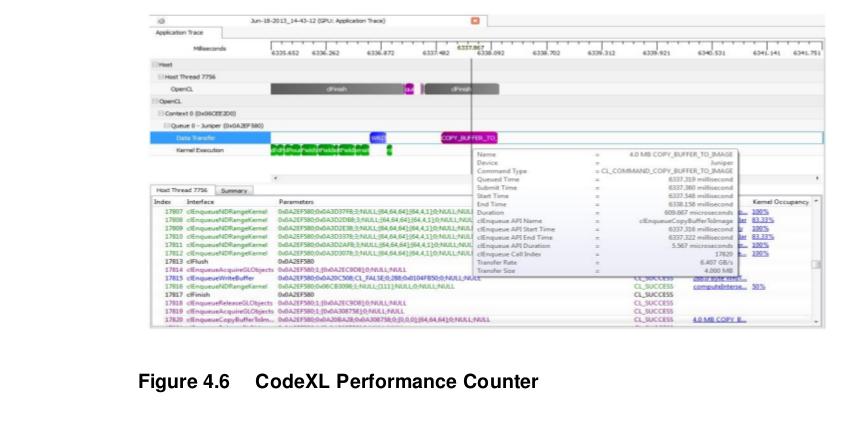

Analyze Mode
*************
The Analyze Mode provides a nice way to begin writing your kernel and to compile it to any supported device without the need to have the actual device installed on your machine. Upon successful compilation, the Statistics View can be used to gather useful statistics regarding the GPU usage of kernels.

The Analyze Mode allows a user to do the following:

* **Edit your OpenCL™ kernel inside CodeXL editor**
   Create a new file
   Drag and drop an existing OpenCL™ kernel file
* **Highlight keywords**
   The CodeXL editor highlights keywords for easier editing

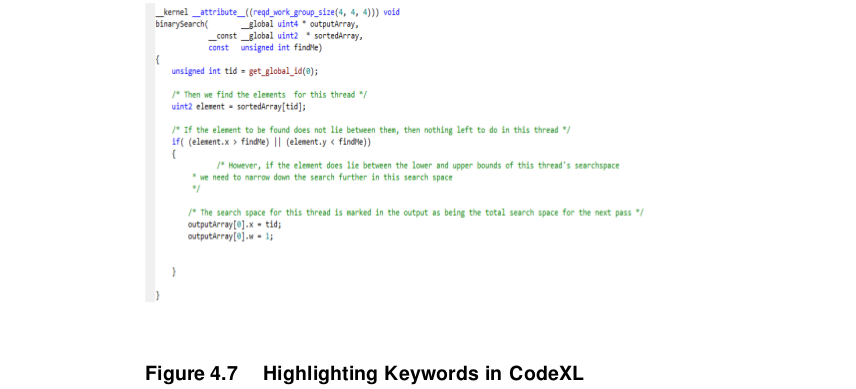

*  Choose your target device
   The Analyze Mode enables to compile to any supported device target, without the need to install the device
*  Fix OpenCL™ compiler errors and warnings in which the kernel file is the only input
   View OpenCL compilation errors and fix immediately.
*  Edit OpenCL™ Compiler options with an easy options tab
   CodeXL summarizes all the OpenCL options so that it is easy to use them.

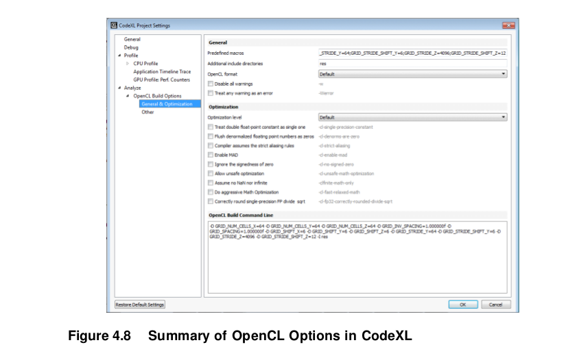

* View IL and ISA compilation results

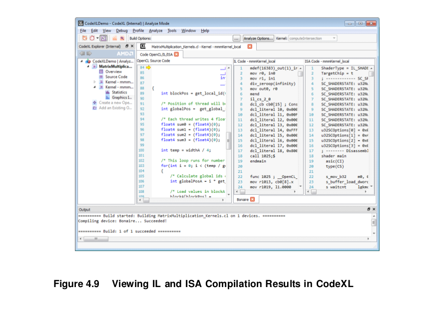

* Statistics view: AMD Compiler gathers statistics for the use of GPU resources
  Better understanding this data helps tune your kernel for better performance even before running on real GPU
  The Statistics tab helps detect where bottlenecks are even before running your application

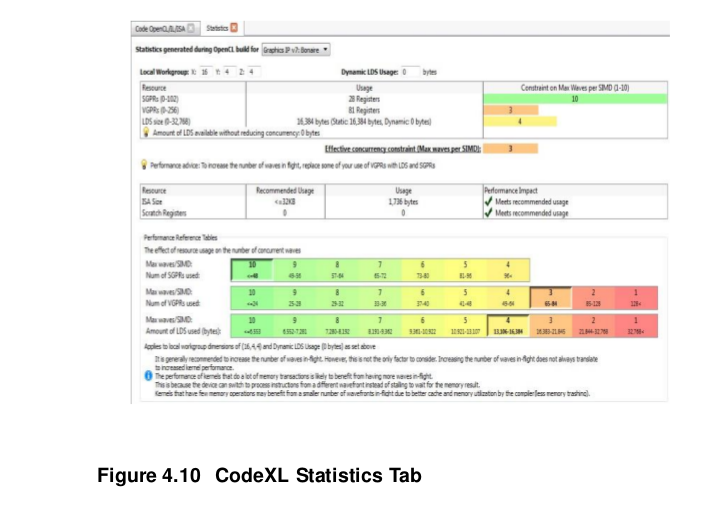

.. _OpenCL_static:

OpenCL Static C++ Programming Language
======================================

.. _Overview:

Overview
#########
This extension defines the OpenCL Static C++ kernel language, which is a form of the ISO/IEC Programming languages C++ specification1. This language supports overloading and templates that can be resolved at compile time (hence
static), while restricting the use of language features that require dynamic/runtime resolving. The language also is extended to support most of the features described in Section 6 of the OpenCL 1.2 specification: new data types (vectors, images, samples, etc.), OpenCL 1.2 Built-in functions, and more.

Supported Features
*********************
The following list contains the major static C++ features supported by this extension.

 * Kernel and function overloading.
 * Inheritance:
    | – Strict inheritance.
    | – Friend classes.
    | – Multiple inheritance.
 * Templates:
    | –Kernel templates.
    | –Member templates.
    | –Template default argument.
    | –Limited class templates (the virtual. keyword is not exposed).
    | –Partial template specialization
 * Namespaces.
 * References.
 * this operator.

Note that supporting templates and overloading highly improve the efficiency of writing code: it allows developers to avoid replication of code when not necessary.
Using kernel template and kernel overloading requires support from the runtime API as well. AMD provides a simple extension to ``clCreateKernel``, which enables the user to specify the desired kernel.

Unsupported Features
*********************

Static C++ features not supported by this extension are:

* Virtual functions (methods marked with the virtual keyword).
* Abstract classes (a class defined only of pure virtual functions).
* Dynamic memory allocation (non-placement new/delete support is not provided).
* Exceptions (no support for throw/catch).
* The :: operator.
* STL and other standard C++ libraries.
* The language specified in this extension can be easily expanded to support these features.

Relations with ISO/IEC C++
*************************** 

This extension focuses on documenting the differences between the OpenCL Static C++ kernel language and the ISO/IEC Programming languages C++ specification. Where possible, this extension leaves technical definitions to the ISO/IEC specification.

.. _OpenCL-C-Runtime:

Additions and Changes to Section 5 - The OpenCL C Runtime
###########################################################

Additions and Changes to Section 5.7.1 - Creating Kernel Objects
******************************************************************
In the static C++ kernel language, a kernel can be overloaded, templated, or both. The syntax explaining how to do it is defined in Sections 5.3.4 and 5.3.5, below.

To support these cases, the following error codes were added; these can be returned by clCreateKernel.

* CL_INVALID_KERNEL_TEMPLATE_TYPE_ARGUMENT_AMD if a kernel template argument is not a valid type (is neither a valid OpenCL C type or 	a user defined type in the same source file).
* CL_INVALID_KERNEL_TYPE_ARGUMENT_AMD if a kernel type argument, used for overloading resolution, is not a valid type (is neither a   	valid OpenCL C type or user-defined type in the same source program).

Passing Classes between Host and Device
***************************************
This extension allows a developer to pass classes between the host and the device. The mechanism used to pass the class to the device and back are the existing buffer object APIs. The class that is passed maintains its state (public and private members), and the compiler implicitly changes the class to use either the host-side or device-side methods.

On the host side, the application creates the class and an equivalent memory object with the same size (using the sizeof function). It then can use the class methods to set or change values of the class members. When the class is ready, the application uses a standard buffer API to move the class to the device (either Unmap or Write), then sets the buffer object as the appropriate kernel argument and enqueues the kernel for execution. When the kernel finishes the execution, the application can map back (or read) the buffer object into the class and continue working on it.

.. _C-Programming-Language:

Additions and Changes to Section 6 - The OpenCL 1.2 C Programming Language
#############################################################################
Building C++ Kernels
****************************
To compile a program that contains static C++ kernels and functions, the application must add the following compile option to clBuildProgramWithSource:

-x language

where language is defined as one of the following:

 * clc – the source language is considered to be OpenCL C, as defined in the
   The OpenCL Programming Language version 1.21.
 * clc++ - the source language is considered to be OpenCL C++, as defined in the following sections of the this document.

    x clc++ is required if the input language is static C++. -x clc++ may not be used with -cl-std=CL2.0 and may only be used with
    cl-std=CL1.2 if-cl-std=CLX.Y is used.

Classes and Derived Classes
***************************
OpenCL C is extended to support classes and derived classes as per Sections
9 and 10 of the static C++ language specification, with the limitation that virtual functions and abstracts classes are not supported. The virtual keyword is reserved, and the OpenCL C++ compiler is required to report a compile time
error if it is used in the input program.

This limitation restricts class definitions to be fully statically defined. There is nothing prohibiting a future version of OpenCL C++ from relaxing this restriction, pending performance implications.

A class definition can not contain any address space qualifier, either for members or for methods: ::

 class myClass{
 public:
   int myMethod1(){ return x;}
 void private:
   __local myMethod2(){x = 0;}
   int x;
   local y; // illegal
 };

The class invocation inside a kernel, however, can be either in private or local address space: ::

  kernel void myKernel()
  {
    myClass c1;
    local myClass c2;
    ...
  }

Classes can be passed as arguments to kernels, by defining a buffer object at the size of the class, and using it. The device invokes the adequate device- specific methods, and accesses the class members passed from the host.

OpenCL C kernels (defined with __kernel) may not be applied to a class constructor, destructor, or method, except in the case that the class method is defined static and thus does not require object construction to be invoked.

Namespaces
***********
Namespaces are support without change as per [1].

Overloading
************
As defined in the static C++ language specification, when two or more different declarations are specified for a single name in the same scope, that name is said to be overloaded. By extension, two declarations in the same scope that declare the same name but with different types are called overloaded declarations. Only kernel and function declarations can be overloaded, not object and type declarations.

As per of the static C++ language specification, a number of restrictions limit how functions can be overloaded; these restrictions are defined formally in Section 13 of the static C++ language specification. Note that kernels and functions cannot be overloaded by return type.

Also, the rules for well-formed programs as defined by Section 13 of the static C++ language specification are lifted to apply to both kernel and function declarations.

The overloading resolution is per Section 13.1 of the static C++ language specification, but extended to account for vector types. The algorithm for “best viable function”, Section 13.3.3 of the static C++ language specification, is extended for vector types by inducing a partial-ordering as a function of the partial-ordering of its elements. Following the existing rules for vector types in the OpenCL 1.2 specification, explicit conversion between vectors is not allowed. (This reduces the number of possible overloaded functions with respect to vectors, but this is not expected to be a particular burden to developers because explicit conversion can always be applied at the point of function evocation.)

For overloaded kernels, the following syntax is used as part of the kernel name:

foo(type1,...,typen)

where type1,...,typen must be either an OpenCL scalar or vector type, or can be a user-defined type that is allocated in the same source file as the kernel foo.

To allow overloaded kernels, use the following syntax:

 __attribute ((mangled_name(myMangledName)))

The kernel mangled_name is used as a parameter to pass to the clCreateKernel() API. This mechanism is needed to allow overloaded kernels without changing the existing OpenCL kernel creation API.

Templates
**********
OpenCL C++ provides unrestricted support for C++ templates, as defined in Section 14 of the static C++ language specification. The arguments to templates are extended to allow for all OpenCL base types, including vectors and pointers qualified with OpenCL C address spaces (i.e.     global,     local,     private, and     constant).

OpenCL C++ kernels (defined with     kernel) can be templated and can be called from within an OpenCL C (C++) program or as an external entry point (from the host).

For kernel templates, the following syntax is used as part of the kernel name
(assuming a kernel called foo):

foo<type1,...,typen>

where type1,...,typen must be either OpenCL scalar or vector type, or can be a user-defined type that is allocated in the same    source file as the kernel foo. In this case a kernel is both overloaded and templated:

foo<type1,...,typen>(typen+1,...,typem)

Note that here overloading resolution is done by first matching non-templated arguments in order of appearance in the definition, then substituting template parameters. This allows intermixing of template and non-template arguments in the signature.

To support template kernels, the same mechanism for kernel overloading is used. Use the following syntax:

  attribute ((mangled_name(myMangledName)))

The kernel mangled_name is used as a parameter to passed to the clCreateKernel() API. This mechanism is needed to allow template kernels without changing the existing OpenCL kernel creation API. An implementation is not required to detect name collision with the user-specified kernel_mangled names involved.

Exceptions
**********
Exceptions, as per Section 15 of the static C++ language specification, are not supported. The keywords try, catch, and throw are reserved, and the OpenCL C++ compiler must produce a static compile time error if they are used in the input program.

Libraries
**********
Support for the general utilities library, as defined in Sections 20-21 of the static C++ language specification, is not provided. The standard static C++ libraries and STL library are not supported.

Dynamic Operation
******************
Features related to dynamic operation are not supported:

 * the virtual modifier.
   OpenCL C++ prohibits the use of the virtual modifier. Thus, virtual member functions and virtual inheritance are not supported.
 * Dynamic cast that requires runtime check.
 * Dynamic storage allocation and deallocation.

OpenCL C Built-in Functions
****************************

All the all OpenCL 1.2 built-in functions are supported.
None of the new built-in functions added in OpenCL 2.0 are supported.

.. _Examples:

Examples
########

Passing a Class from the Host to the Device and Back
******************************************************
The class definition must be the same on the host code and the device code, besides the members’ type in the case of vectors. If the class includes vector data types, the definition must conform to the table that appears on Section 6.1.2

of the OpenCL Programming Specification 1.2, Corresponding API type for
OpenCL Language types.

**Example Kernel Code**

::

  Class Test
  {
    setX (int value);
    private:
    int x;
  }

  kernel foo ( global Test* InClass, ...)
  {
    if (get_global_id(0) == 0) InClass->setX(5);
  }

**Example Host Code**

::

  Class Test
  {
  setX (int value);
  private:
  int x;
  }

  MyFunc () 
  {
    tempClass = new(Test);
    ... // Some OpenCL startup code – create context, queue, etc.
    cl_mem classObj = clCreateBuffer(context, CL_MEM_USE_HOST_PTR, sizeof(Test), &tempClass, event);
    clEnqueueMapBuffer(...,classObj,...);
    tempClass.setX(10);
    clEnqueueUnmapBuffer(...,classObj,...); //class is passed to the Device
    clEnqueueNDRange(..., fooKernel, ...);
    clEnqueueMapBuffer(...,classObj,...); //class is passed back to the Host
  }
 

Kernel Overloading
*******************
This example shows how to define and use mangled_name for kernel overloading, and how to choose the right kernel from the host code. Assume the following kernels are defined:

:: 

  __attribute__((mangled_name(testAddFloat4))) kernel void
  testAdd(global float4 * src1, global float4 * src2, global float4 * dst)
  { 
    int tid = get_global_id(0);
    dst[tid] = src1[tid] + src2[tid];
  }
  __attribute ((mangled_name(testAddInt8))) kernel void testAdd(global int8 * src1, global int8 * src2, global int8 * dst)
  {
    int tid = get_global_id(0);
    dst[tid] = src1[tid] + src2[tid];
  }

The names testAddFloat4 and testAddInt8 are the external names for the two kernel instants. When calling ``clCreateKernel``, passing one of these kernel names leads to the correct overloaded kernel.

Kernel Template
****************
This example defines a kernel template, testAdd. It also defines two explicit instants of the kernel template, testAddFloat4 and testAddInt8. The names testAddFloat4 and testAddInt8 are the external names for the two kernel template instants that must be used as parameters when calling to the clCreateKernel API.

::

  template <class T>
  kernel void testAdd(global T * src1, global T * src2, global T * dst)
  {
    int tid = get_global_id(0);
    dst[tid] = src1[tid] + src2[tid];
  }

  template  attribute ((mangled_name(testAddFloat4))) kernel void testAdd(global float4 * src1, global float4 * src2, global float4 * dst);

  template  attribute ((mangled_name(testAddInt8))) kernel void testAdd(global int8 * src1, global int8 * src2, global int8 * dst);

.. _OpenCL_2.0:

OpenCL 2.0
==========

.. _Introduction:

Introduction
############

The OpenCL 2.0 specification is a significant evolution of OpenCL. It introduces features that allow closer collaboration between the host and OpenCL devices, such as Shared Virtual Memory (SVM) and device-side enqueue. Other features, such as pipes and new image-related additions provide effective ways of expressing heterogeneous programming constructs.

The following sections highlight the salient features of OpenCL 2.0 and provide usage guidelines.

  * Shared Virtual Memory (SVM)
  * Generic Address Space
  * Device-side enqueue and workgroup/sub-group level functions
  * Atomics and synchronization
  * Pipes
  * Program-scope global Variables
  * Image Enhancements
  * Non-uniform work group size

Sample code is included wherever appropriate; complete samples illustrating the
OpenCL 2.0 and 2.1 features are provided with the ROCm 2.0 OpenCL Language Runtime and Compiler .

For guidelines on how to migrate from OpenCL 1.2 to OpenCL 2.1 and for information about querying for image- and device-specific extensions, see Portability considerations.

For a list of the new and deprecated functions,  “New and deprecated functions in OpenCL 2.0.”

.. _Shared-virtual-Memory:

Shared Virtual Memory (SVM)
###########################

Overview
********
In OpenCL 1.2, the host and OpenCL devices do not share the same virtual address space. Consequently, the host memory, the device memory, and communication between the host and the OpenCL devices, need to be explicitly specified and managed. Buffers may need to be copied over to the OpenCL

device memory for processing and copied back after processing. To access locations within a buffer (or regions within an image), the appropriate offsets must be passed to and from the OpenCL devices; a host memory pointer cannot be used on the OpenCL device.

In OpenCL 2.0, the host and OpenCL devices may share the same virtual address space. Buffers need not be copied over between devices. When the host and the OpenCL devices share the address space, communication between the host and the devices can occur via shared memory (pointers). This simplifies programming in heterogeneous contexts.

Support for SVM does not imply or require that the host and the OpenCL devices in an OpenCL 2.0 compliant architecture share actual physical memory. The OpenCL runtime manages the transfer of data between the host and the OpenCL devices; the process is transparent to the programmer, who sees a unified address space.

A caveat, however, concerns situations in which the host and the OpenCL devices access the same region of memory at the same time. It would be highly inefficient for the host and the OpenCL devices to have a consistent view of the memory for each load/store from any device/host. In general, the memory model of the language or architecture implementation determines how or when a memory location written by one thread or agent is visible to another. The memory model also determines to what extent the programmer can control the scope of such accesses.

OpenCL 2.0 adopts the memory model defined in C++11 with some extensions. The memory orders taken from C++11 are: "relaxed", "acquire", "release", “acquire-release”, and "sequential consistent".

OpenCL 2.0 introduces a new (C++11-based) set of atomic operations with specific memory-model based semantics. Atomic operations are indivisible: a thread or agent cannot see partial results. The atomic operations supported are:

 * atomic_load/store
 * atomic_init
 * atomic_work_item_fence
 * atomic_exchange
 * atomic_compare_exchange
 * atomic_fetch_<op>, where <op> is "add", "sub", "xor", "and", or "or"

OpenCL 2.0 introduces the concept of "memory scope", which limits the extent to which atomic operations are visible. For example:

 * "workgroup" scope means that the updates are to be visible only within the work group
 * "device" scope means that the updates are to be visible only within the device (across workgroups within the device)

 * "all-svm-devices" scope means the updates are available across devices (GPUs and the host/CPU).

OpenCL 2.0 further differentiates between coarse-grained SVM buffer sharing and fine-grained SVM (buffer and system) sharing mechanisms. These mechanisms define the granularity at which the SVM buffers are shared.

Updates to coarse-grained or fine-grained SVM are visible to other devices at synchronization points:
 
 * For coarse-grained SVM, the synchronization points are: the mapping or un- mapping of the SVM memory and kernel launch or completion. This means that any updates are visible only at the end of the kernel or at the point of un-mapping the region of     	memory.
   Coarse-grained buffer memory has a fixed virtual address for all the devices it is allocated on. In the AMD implementation, the   	physical memory is allocated on Device Memory.

 * For fine-grained SVM, the synchronization points include those defined for coarse-grained SVM as well as atomic operations. This   	 means that updates are visible at the level of atomic operations on the SVM buffer (for fine- grained buffer SVM, allocated with   	 the CL_MEM_SVM_ATOMICS flag) or the SVM system, i.e. anywhere in the SVM (for fine-grained system SVM).
   Fine-grained buffer memory has the same virtual address for all devices it is allocated on. In the AMD implementation, the        	physical memory is allocated on the Device-Visible Host Memory. If the fine grain buffer is allocated with the CL_MEM_SVM_ATOMICS 	flag, the memory will be GPU-CPU coherent.

The OpenCL 2.0 specification mandates coarse-grained SVM but not fine- grained SVM.

For details, see the OpenCL 2.0 specification.

Usage
******
In OpenCL 2.0, SVM buffers shared between the host and OpenCL devices are created by calling clSVMAlloc (or malloc/new in the case of fine-grain system support). The contents of such buffers may include pointers (into SVM buffers). Pointer-based data structures are especially useful in heterogenous programming scenarios. A typical scenario is as follows:

1.   Host creates SVM buffer(s) with clSVMAlloc

2.   Host maps the SVM buffer(s) with the blocking call clEnqueueSVMMap

3.   Host fills/updates the SVM buffer(s) with data structures, including pointers

4.   Host unmaps the SVM buffer(s) by using clEnqueueSVMUnmap

5.   Host enqueues processing kernels, passing SVM buffers to the kernels with calls to clSetKernelArgSVMPointer and/or clSetKernelExecInfo

6.   The OpenCL 2.0 device processes the structures in SVM buffer(s) including following/updating pointers.

7.   Repeat step 2 through 6 as necessary.

Note that the map and unmap operations in Steps 2 and 4 may be eliminated if the SVM buffers are created by using the CL_MEM_SVM_FINE_GRAIN_BUFFER flag, which may not be supported on all devices.

Coarse-grained memory
**********************
Some applications do not require fine-grained atomics to ensure that the SVM is consistent across devices after each read/write access. After the initial map/creation of the buffer, the GPU or any other devices typically read from memory. Even if the GPU or other devices write to memory, they may not require a consistent view of the memory.

For example, while searching in parallel on a binary search tree , coarse-grain buffers are usually sufficient. In general, coarse-grain buffers provide faster access compared to fine grain buffers as the memory is not required to be consistent across devices.

:: 

  for (i = 0; i < keys_per_wi; i++) {
  key = search_keys[init_id + i]; tmp_node = root;
    while (1) {
      if (!tmp_node || (tmp_node->value == key))
        break;
      tmp_node = (key < tmp_node->value) ? tmp_node->left : tmp_node->right;
    }
    found_nodes[init_id + i] = tmp_node;
  }

In the above example, the binary search tree root is created using coarse- grain SVM on the host:

``svmTreeBuf = clSVMAlloc(context, CL_MEM_READ_WRITE, numNodes*sizeof(node), 0);``

``svmSearchBuf = clSVMAlloc(context, CL_MEM_READ_WRITE, numKeys*sizeof(searchKey), 0);``

The host creates two buffers, svmTreeBuf and svmSearchBuf, to hold the given tree and the search keys, respectively. After populating the given tree, these two buffers are passed to the kernel as parameters.

The next task is to create the tree and populate the svmTreeBuf using ``clSVMEnqueueMap`` and ``clSVMEnqueueUnmap``. The host-code method, cpuCreateBinaryTree, illustrates this mechanism; note the calls to these map/unmap APIs.

The host then creates the keys to be searched in svmSearchBuf, as the cpuInitSearchKeys method illustrates. Next, it enqueues the kernel to search the binary tree for the given keys in the svmSearchBuf, and it sets the parameters to the kernel using clSetKernelArgSVMPointer:
:: 

 int status = clSetKernelArgSVMPointer(sample_kernel, 0, (void *)(svmTreeBuf));
 
 status = clSetKernelArgSVMPointer(sample_kernel, 1, (void *)(svmSearchBuf));

Note that the routine passes both svmTreeBuf and svmSearchBuf to the kernel as parameters. The following node structure demonstrates how to create the tree on the host using pointers to the left and right children:

::

  typedef struct nodeStruct
  {
    int value;
    struct nodeStruct* left;
    struct nodeStruct* right;
  } node;

At this point, the advantage of using SVM becomes clear. Because the structure and its nodes are SVM memory, all the pointer values in these nodes are valid on the GPUs as well.

The kernel running on the OpenCL 2.0 device can directly search the tree as follows::

 while(NULL != searchNode)
 {
    if(currKey->key == searchNode->value)
    {
      /* rejoice on finding key */
      currKey->oclNode	= searchNode;
      searchNode	= NULL;
    }
    else if(currKey->key < searchNode->value)
    {
      /* move left */
      searchNode = searchNode->left;
    }
    else
    {
      /* move right */
      searchNode = searchNode->right;
    }
 }

Each work item searches one element in svmSearchKeys in parallel and sets oclNode in the searchKey structure for that node.

Updates to the tree occur on the host (CPU) or on the GPU, but not on both simultaneously.

Because the tree is created on the host, and because OpenCL 1.2 disallows SVM, implementing these steps is difficult in OpenCL 1.2. In OpenCL 1.2, you must store the tree as arrays, copy the arrays to the GPU memory (specifying the appropriate offsets), and then copy the arrays back to the host.

The “data” is the tree created by the host as a coarse-grain buffer and is passed to the kernel as an input pointer.

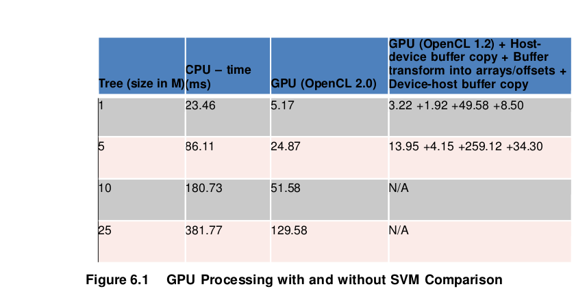

.. Note:::: All numbers were obtained on a Kaveri APU with 32 GB RAM running Windows 8.1. All numbers are in milli-seconds (ms).
The above table shows the performance of the 2.0 implementation over the 1.2 implementation. As you can see, the GPU times mentioned under the OpenCL 1.2 column include the GPU run time, time to transfer the buffers from the host
to the device, the time required to transform the buffers into arrays and offsets, and the time required to transfer the buffers from the device back to the host, respectively.

Finally, more than 5M nodes could not be allocated in 1.2, as the allowable memory allocation was limited by the amount of memory that could be used on the device. Overall, the 2.0 version exceeds the 1.2 version in both performance and usability.

.. _Generi:

Generic Address Space
######################

Overview
*********
In OpenCL 1.2, all pointer parameters in a function definition must have address spaces associated with them. (The default address space is the private address space.) This necessitates creating an explicit version of the function for each desired address space.

OpenCL 2.0 introduces a new address space called the generic address space. Data cannot be stored in the generic address space, but a pointer to this space can reference data located in the private, local, or global address spaces. A function with generic pointer arguments may be called with pointers to any address space except the constant address space. Pointers that are declared without pointing to a named address space, point to the generic address space. However, such pointers must be associated with a named address space before they can be used. Functions may be written with arguments and return values that point to the generic address space, improving readability and programmability.

Usage
******

Generic example
****************

In OpenCL 1.2, the developer needed to write three functions for a pointer p that can reference the local, private, or global address space::
  
  void fooL (local int *p) { … } 
  void fooP (private int *p) { … }
  void fooG (global int *p) { … }
 

In OpenCL 2.0, the developer needs to write only one function::
 
 void foo (int *p)

As foo is a generic function, the compiler will accept calls to it with pointers to any address space except the constant address space.
Note The generic address space feature also allows one to define a pointer-based data structure that can apply to different address spaces. In OpenCL 1.2, different structure types must be defined for different address spaces; in OpenCL 2.0, a single structure suffices, as shown below.

::

  struct node{
  struct node* next;	// generic address	space pointer
  } ;

.. Note:::: The OpenCL 2.0 spec itself shows most built-in functions that accept pointer arguments as accepting generic pointer arguments.
OpenCL example
********************

OpenCL sample, addMul2d is a generic function that uses generic address spaces for its operands. The function computes the convolution sum of two vectors. Two kernels compute the convolution: one uses data in the global address space (convolution2DUsingGlobal); the other uses the local address space (sepiaToning2DUsingLocal). The use of a single function improves the readability of the source.

::

  float4 addMul2D (uchar4 *src, float *filter, int2 filterDim, int width)
  {	
    int i, j;
    float4 sum = (float4)(0);
    for(i = 0; i < (filterDim.y); i++)
    {
      for(j = 0; j < (filterDim.x); j++)
      {
        sum += (convert_float4(src[(i*width)+j]))*((float4)(filter[(i*filterDim.x) +j]));
      }
    }
    return sum;
  }

.. Note:::: The compiler will try to resolve the address space at compile time. Otherwise, the runtime will decide whether the pointer references the local or the global address space. For optimum performance, the code must make it easy for the compiler to detect the pointer reference by avoiding data-dependent address space selection, so that run-time resolution -- which is costly -- is not required.
.. _Device-side-enqueue:

Device-side enqueue and workgroup/sub-group level functions
############################################################

Device-side enqueue
********************
In OpenCL 1.2, a kernel cannot be enqueued from a currently running kernel. Enqueuing a kernel requires returning control to the host -- potentially undermining performance.

OpenCL 2.0 allows kernels to enqueue other kernels. It provides a new construct, "clang blocks," and new built-in functions that allow a parent kernel to queue child

kernels. In addition, OpenCL 2.0 deprecates the run-time API call ``clCreateCommandQueue``, in favor of a new call, ``clCreateCommandQueueWithProperties``, that can create device-side command queues.

Because it eliminates the overhead of returning kernel-launch control to the host, device-side enqueue can in many cases improve application performance. Some platforms (such as AMD’s) provide a standard way of enqueuing work to the hardware, which can further improve the performance. Device-side enqueue has been observed to reduce by the overhead of enqueuing by more than 3x in some cases.

Applications that are inherently recursive or that require additional processing can derive particular benefit. A classic example of the latter case is a tree search that discovers new nodes when traversing from the root to the leaves.

Device enqueue is also useful in determining when all the workgroups of the parent kernel have finished executing. Doing so in OpenCL 1.2 requires waiting on a completion event from that kernel. If the host needs the result of a computation, the routine may also need to wait on the host. Since OpenCL 2.0 allows the parent kernel to launch child kernels, it can eliminate this delay.

Workgroup/subgroup-level functions
***********************************
OpenCL 2.0 introduces new built-in functions that operate at the workgroup or subgroup level. (A workgroup comprises one or more subgroups; the vendor handles the exact subgroup implementation.) For example, on AMD platforms, a subgroup maps to a “wavefront”. (For details, see the AMD OpenCL User Guide.)

Basically, a wavefront is an execution unit on the GPU. The OpenCL specification requires that all work items in a workgroup/subgroup executing the kernel handle these new functions; otherwise, their results may be undefined.

OpenCL 2.0 defines the following new built-in functions. Note that it also defines similar functions for subgroups under the cl_khr_subgroups extensions in CL_DEVICE_EXTENSIONS.

1. work_group_all and work_group_any: These functions test a given predicate on all work items in the workgroup. The “all” version effectively performs an AND operation on all predicates and returns the result to all work items; similarly, the “any” operation performs an OR operation. Thus, using the “all” function returns true if the predicate is true for all work items; “any” returns true if it is true for at least one work item.

2. work_group_broadcast: This function broadcasts a local value from each work item to all the others in the workgroup.

3. work_group_reduce: Given an operation, work_group_reduce performs the reduction operation on all work items and returns the result. The operation can be min, max or add. For example, when called for an array using the add operation, the function returns the sum of the array elements.

4. work_group_inclusive/exclusive_scan: The “scan” operation is a prefix operation, which performs a reduction up to the work-item ID. If it includes the current ID, the function applies an inclusive scan; otherwise, if it covers everything up to but not including the current work item, it applies an exclusive scan. Again, the operation can be min, max or add.

OpenCL 2.0 introduces a Khronos sub-group extension. Sub-groups are a logical abstraction of the hardware SIMD execution model akin to wavefronts, warps, or vectors and permit programming closer to the hardware in a vendor-independent manner.  This extension includes a set of cross-sub-group built-in functions that
match the set of the cross-work-group built-in functions specified above.

Usage
******

Iterate until convergence
**************************
Suppose a complex process requires 4 kernels, A, B, C, and Check, and that these kernels must be run in order repeatedly until the Check kernel produces a value indicating that the process has converged.

In OpenCL 1.2, the host side code to perform this might be structured as follows:

1. Enqueue kernel A

2. Enqueue kernel B

3. Enqueue kernel C

4. Enqueue kernel Check

5. Enqueue blocking map of Check result, e.g. with clEnqueueMapBuffer

6. If Check result is not "Converged" then: Enqueue unmap of Check result

7. Go to Step 1

However, with device-side enqueue in OpenCL 2.0, the Check kernel may be altered to enqueue blocks that carry out A, B, C, and Check when it detects that convergence has not been reached. This avoids a potentially costly interaction with the host on each iteration.  Also, a slight modification of Check might allow the replacement of the entire loop above with a single host-side enqueue of the Check kernel.

Data-dependent refinement
***************************
Consider a search or computational process that works from coarse levels to increasingly finer levels that operates something like this:

1. Search/Compute over current region
2. Loop over sub-regions in current region
3. If a sub-region is interesting:
	* Refine the sub-region
	* Apply a process to the refined sub-region

With OpenCL 1.2, this process would require a complex interaction between the host and the OpenCL device. The device-side kernel would need to somehow mark the sub-regions requiring further work, and the host side code would need to scan all of the sub-regions looking for the marked ones and then enqueue a kernel for each marked sub-region. This process is made more difficult by the lack of globally visible atomic operations in OpenCL 1.2.

However, with OpenCL 2.0, rather than just marking each interesting sub-region, the kernel can instead launch a new sub-kernel to process each marked sub- region. This significantly simplifies the code and improves efficiency due to the elimination of the interactions with, and dependence on, the host.

Binary search using device-side enqueueNote
********************************************
The power of device enqueue is aptly illustrated in the example of binary search. To make the problem interesting, multiple keys in a sorted array will be searched for. The versions written for OpenCL 1.2 and 2.0 will also be compared with respect to programmability and performance.

A binary search looks for a given key in a sorted sequence by dividing the sequence in two equal parts and then recursively checking the part that contains the key. Because a typical GPU processes more than two work items, we divide the sequence into several parts (globalThreads), and each work item searches its part for the key. Furthermore, to make things more interesting, a large number of keys are searched. At every recursion stage, the amount of work varies with the chunk size. Thus, the algorithm is a good candidate for device- side enqueue.

The OpenCL 1.2 version of the code that performs binary search is as follows:

::

  kernel void binarySearch_mulkeys( global int *keys, global uint
  *input, const unsigned int numKeys, global int *output)
  {
    int gid = get_global_id(0);
    int lBound = gid * 256;
    int uBound = lBound + 255;
    for(int i = 0; i < numKeys; i++)
    {
      if(keys[i] >= input[lBound] && keys[i] <=input[uBound])
        output[i]=lBound;
    }
  }

The search for multiple keys is done sequentially, while the sorted array is divided into 256 sized chunks. The NDRange is the size of the array divided by the chunk size. Each work item checks whether the key is present in the range and if the key is present, updates the output array.

The issue with the above approach is that if the input array is very large, the number of work items (NDRange) would be very large. The array is not divided into smaller, more-manageable chunks.

In OpenCL 2.0, the device enqueue feature offers clear advantages in binary search performance.

The kernel is rewritten in OpenCL 2.0 to enqueue itself. (For full details, see the complete sample in the AMD Compute SDK.) Each work item in the binarySearch_device_enqueue_multiKeys_child kernel searches its portion of the sequence for the keys; if it finds one, it updates the array bounds for that key and also sets a variable, , to declare that another enqueue is necessary. If all work items report failure, the search stops and reports that the sequence contains no keys.

Finally, the kernel launches itself again using device enqueue, but with new bounds:

:: 

  void (^binarySearch_device_enqueue_wrapper_blk)(void) =
   ^{binarySearch_device_enqueue_multiKeys_child(outputArray,
                                                 sortedArray,
                                                 subdivSize,
                                                 globalLowerIndex,
                                                 keys,nKeys,
                                                 parentGlobalids,
                                                 globalThreads);
    };
  int err_ret = enqueue_kernel(defQ,CLK_ENQUEUE_FLAGS_WAIT_KERNEL,ndrange1,binarySe arch_device_enqueue_wrapper_blk);

It also checks for missing keys; absent any such keys, the search stops by forgoing further enqueues::
 
 /**** Search continues only if at least one key is found in previous search ****/ 
 int Flag = atomic_load_explicit(&,memory_order_seq_cst);
 if(Flag == 0)
   return; 
 

The advantage is that when the input array is large, the OpenCL 2.0 version divides the input array into 1024-sized chunks. The chunk in which the given key falls is found and another kernel is enqueued which further divides it into 1024- sized chunks, and so on. In OpenCL 1.2, as the whole array is taken as the NDRange, a huge number of work groups require processing.

The following figure shows how the OpenCL 2.0 version compares to the OpenCL 1.2 as the array increases beyond a certain size.

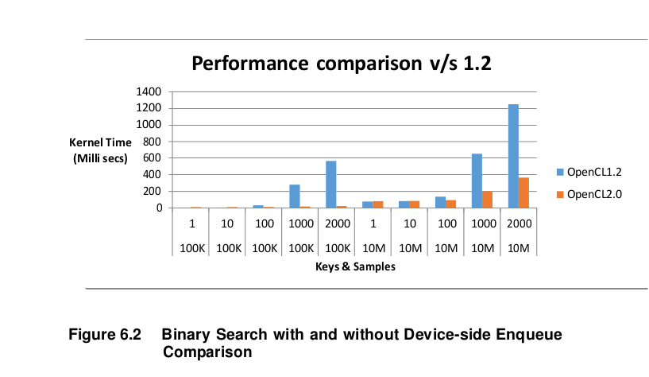

Note: These numbers are for an A10-7850K (3.7GHz) processor with 4GB of RAM running Windows 8.1.

The above figure shows the performance benefit of using OpenCL 2.0 over the same sample using OpenCL 1.2. In OpenCL 2.0, the reduced number of kernel launches from the host allow superior performance. The kernel enqueues are much more efficient when done from the device.

Device enqueue is a powerful feature, as the examples above help show. It can be especially useful when repeatedly applying a set of kernels to a data structure in accordance with a condition. For applications with dynamic data parallelism at run time-such as when searching a large space for which the amount of parallelism or the problem size is statically unknown from the outset-device enqueue offers many benefits.

The above examples also exemplify the new workgroup and subgroup functions that OpenCL 2.0 introduces. These functions can efficiently perform computation at the workgroup level because they can map directly to hardware instructions at the workgroup/subgroup level.

.. _Atomics:

Atomics and synchronization
############################
Overview
*********
In OpenCL 1.2, only work-items in the same workgroup can synchronize. OpenCL 2.0 introduces a new and detailed memory model which allows
developers to reason about the effects of their code on memory, and in particular understand whether atomic operations and fences used for synchronization ensure the visibility of variables being used to communicate between threads. In conjunction with the new memory model, OpenCL 2.0 adds a new set of atomic built-in functions and fences derived from C++11 (although the set of types is restricted), and also deprecates the 1.2 atomic built in functions and fences.

These additions allow synchronization between work-items in different work- groups, as well as fine-grained synchronization with the host using atomic operations on memory in fine-grained SVM buffers (allocated with the CL_MEM_SVM_ATOMICS flag) for fine-grained SVM system memory.

Usage
******
The following examples to illustrate the use of atomics are part of the AMD Compute SDK.

Atomic Loads/Stores
********************
This sample illustrates atomic loads/stores with the use of memory orders.

The first step is to create this memory on the host::
  
  buffer = (int * ) clSVMAlloc(context, CL_MEM_SVM_FINE_GRAIN_BUFFER, (N+1)*sizeof(int), 4);
  
  atomicBuffer = (int * ) clSVMAlloc(context, CL_MEM_SVM_FINE_GRAIN_BUFFER | CL_MEM_SVM_ATOMICS, (N+1)*sizeof(int), 4);

Note the flags sent as parameters: ``CL_MEM_SVM_FINE_GRAIN_BUFFER`` and ``CL_MEM_SVM_ATOMICS.`` The following kernel runs on all work items in parallel. It will atomically load atomicBuffer[0], check whether its value is 99, and wait till it is 99. The acquire memory order is used to indicate that the latest update must be done on the host and to ensure that the local L1 cache is not read from. This will be made 99 by the host (CPU) by
::

  std::atomic_store_explicit ((std::atomic<int> *)&atomicBuffer[0], 99, std::memory_order_release);

The host uses the C++11 compiler and the same memory model.

::

  __kernel void ldstore(volatile global int *buffer, global int* atomicBuffer)
  {
    int i;
    while (atomic_load_explicit ((global atomic_int*)&atomicBuffer[0], memory_order_acquire) != 99);
    i = get_global_id(0);
    buffer[i] += i;
    atomic_store_explicit ((global atomic_int*)&atomicBuffer[i], (100+i), memory_order_release);
  }

The kernel next stores (100+i), where i is the ID of the work-item into atomicBuffer[i]. The order used is memory_order_release which ensures that the updated copy reaches the CPU which is waiting for it to report PASS for the test.

After the atomic operation, the updates on fine-grain variables (such as buffer) will also be available at the host. The CPU checks for the following to ensure that the results are OK:

::
 
  for (i=0;i<N;i++)
    while(std::atomic_load_explicit ((std::atomic<int>*)&atomicBuffer[i], std::memory_order_acquire) != (100+i));
    /* check the results now */
    for (i=0;i<N;i++)
    {
      if (buffer[i] != (64+i))
        printf(" Test Failed \n");
      else
        printf (" Test Passed! \n");
    }

Atomic Compare and Exchange (CAS)
**********************************
This sample illustrates the use of the atomic CAS operation typically used for "lock-free" programming, in which a critical section can be created without having to use waiting mutexes/semaphores. The following kernel simultaneously inserts the IDs of various work items into the "list" array by using atomic CAS operation. The same loop also runs on the host and inserts the other half (N) work items. In this way, 2*N numbers are inserted into this "list".

::

  __kernel void linkKernel( global int *list) {
    int head, i;
    i = get_global_id(0) + 1;
    head = list[0];
    if (i != get_global_size(0)) {
      do {
        list[i] = head;
      } while (!atomic_compare_exchange_strong((global atomic_int *) &list[0], &head,i), memory_order_release, memory_order_acquire,      	memory_scope_system);
    }
  }

Note how there is no wait to enter the critical section, but list[0] and head are updated atomically. On the CPU too, a similar loop runs. Again note that the variables "list"and "head" must be in fine-grain SVM buffers. memory_order_release and memory_scope_system are used to ensure that the CPU gets the updates -- hence the name "platform atomics."

Atomic Fetch
*************
This sample illustrates the use of the atomic fetch operation. The fetch operation is an RMW (Read-Modify-Write) operation. The following kernel computes the maximum of the N numbers in array "A". The result of the intermediate comparisons is computed and the result is placed in a Boolean array "B". After the matrix "B" is computed, the row (i) is computed. The row which has all 1s will be the maximum (C[i]).

::

  __kernel void atomicMax(volatile global int *A, global int *B, global int *C, global int *P)
  {
    int	i = get_global_id(0);
    int	j = get_global_id(1);
    int N = *P, k;
    if (A[i] >= A[j])
      B[i*N+j] = 1;
    else
      B[i*N+j] = 0;
    if (j == 0)
    {
      C[i] = 1;
      for (k=0;k<N;k++)
        atomic_fetch_and_explicit((global atomic_int *)&C[i], B[i*N+k], memory_order_release, memory_scope_device);
    }
  }

Similarly, another sample includes the following kernel that increments 2*N times, N times in the kernel and another N times on the host:

::

  __kernel void counter( global int *count)
  {
    atomic_fetch_add((atomic _int)count, 1);
    //(*count)++;
  }

Note: If atomic_fetch_add is not used and instead an incrementing count (as performed in the commented line) is used, the sum will not be computed correctly.

.. _Pipes:

Pipes
#####

Overview
*********
OpenCL 2.0 introduces a new mechanism, pipes, for passing data between kernels. A pipe is essentially a structured buffer containing some space for a set of "packets"--kernel-specified type objects, and for bookkeeping information. As the name suggests, these packets of data are ordered in the pipe (as a FIFO).

Pipes are accessed via special read_pipe and write_pipe built-in functions. A given kernel may either read from or write to a pipe, but not both.  Pipes are only "coherent" at the standard synchronization points; the result of concurrent accesses to the same pipe by multiple kernels (even if permitted by hardware) is undefined. A pipe cannot be accessed from the host side; it can only be accessed by using the kernel built-in functions.

Pipes are created on the host with a call to ``clCreatePipe``, and may be passed between kernels. Pipes may be particularly useful when combined with device- size enqueue for dynamically constructing computational data flow graphs.

There are two types of pipes: a read pipe, from which a number of packets can be read; and a write pipe, to which a number of packets can be written.

Note: A pipe specified as read-only cannot be written into and a pipe specified as write-only cannot be read from. A pipe cannot be read from and written into at the same time.

Functions for accessing pipes
******************************
A new host API function has been added into the OpenCL 2.0 spec to create the
Pipe.

::

  cl_mem	clCreatePipe ( cl_context context, cl_mem_flags flags,  cl_uint pipe_packet_size, cl_uint pipe_max_packets,  const cl_pipe_properties * properties, cl_int *errcode_ret)

The memory allocated in the above function can be passed to kernels as read- only or write-only pipes. The pipe objects can only be passed as kernel arguments or kernel functions and cannot be declared inside a kernel or as program-scoped objects.

Also, a set of built-in functions have been added to operate on the pipes. The important ones are:
 
read_pipe (pipe p, gentype * ptr: for reading packet from pipe p into ptr.
 
write_pipe (pipe p, gentype * ptr: for writing packet pointed to by ptr to pipe p.

To ensure you have enough space in the pipe structure for reading and writing (before you actually do it), you can use built-in functions to “reserve” enough space. For example, you could reserve room by calling reserve_read_pipe or reserve_write_pipe. These functions return a reservation ID, which can be used when the actual operations are performed. Similarly, the standard has built-in functions for workgroup level reservations, such as work_group_reserve_read_pipe and work_group_reserve_write_pipe and for the workgroup order (in the program). These workgroup built-in functions operate at the workgroup level. Ordering across workgroups is undefined. Calls to commit_read_pipe and commit_write_pipe, as the names suggest, commit the actual operations (read/write).

Usage
******
The following example code illustrates a typical usage of pipes in the example code. The code contains two kernels: producer_kernel, which writes to the pipe, and consumer_kernel, which reads from the same pipe. In the example, the producer writes a sequence of random numbers; the consumer reads them and creates a histogram.

The host creates the pipe, which both kernels will use, as follows:

::

  rngPipe = clCreatePipe(context, CL_MEM_READ_WRITE, szPipePkt,
  szPipe, NULL,
  &status);

This code makes a pipe that the program kernels can access (read/write). The host creates two kernels, producer_kernel and consumer_kernel. The producer kernel first reserves enough space for the write pipe::
 
 //reserve space in pipe for writing random numbers. 
 reserve_id_t rid = work_group_reserve_write_pipe(rng_pipe, szgr);

Next, the kernel writes and commits to the pipe by invoking the following functions:

::

  write_pipe(rng_pipe,rid,lid, &gfrn); work_group_commit_write_pipe(rng_pipe, rid); Similarly, the consumer kernel reads from the   	pipe:
  //reserve pipe for reading
  reserve_id_t rid = work_group_reserve_read_pipe(rng_pipe, szgr);
  if(is_valid_reserve_id(rid)) {
  //read random number from the pipe. read_pipe(rng_pipe,rid,lid, &rn); work_group_commit_read_pipe(rng_pipe, rid); 
  }

The consumer_kernel then uses this set of random number and constructs the histogram. The CPU creates the same histogram and verifies whether the histogram created by the kernel is correct. Here, lid is the local id of the work item, obtained by get_local_id(0).

The example code demonstrates how you can use a pipe as a convenient data structure that allows two kernels to communicate.

In OpenCL 1.2, this kind of communication typically involves the host – although kernels can communicate without returning control to the host. Pipes, however, ease programming by reducing the amount of code that some applications require.

.. _Program-scope-global-Variables:

Program-scope global Variables
#################################

Overview
***********
OpenCL 1.2 permits the declaration of only constant address space variables at program scope.

OpenCL 2.0 permits the declaration of variables in the global address space at program (i.e. outside function) scope. These variables have the lifetime of the program in which they appear, and may be initialized.  The host cannot directly access program-scope variables; a kernel must be used to read/write their contents from/to a buffer created on the host.

Program-scope global variables can save data across kernel executions. Using program-scope variables can potentially eliminate the need to create buffers on the host and pass them into each kernel for processing. However, there is a limit to the size of such variables. The developer must ensure that the total size does not exceed the value returned by the device info query: CL_DEVICE_MAX_GLOBAL_VARIABLE_SIZE.

.. _Image-Enhancements:

Image Enhancements
######################

Overview
***********
OpenCL 2.0 introduces significant enhancements for processing images.

A read_write access qualifier for images has been added. The qualifier allows reading from and writing to certain types of images (verified against clGetSupportedImageFormats by using the CL_MEM_KERNEL_READ_AND_WRITE flag) in the same kernel, but reads must be sampler-less.  An atomic_work_item_fence with the CLK_IMAGE_MEM_FENCE flag and the memory_scope_work_item memory scope is required between reads and writes to the same image to ensure that the writes are visible to subsequent reads. If multiple work-items are writing to and reading from multiple locations in an image, a call to work_group_barrier with the CLK_IMAGE_MEM_FENCE flag is required.

OpenCL 2.0 also allows 2D images to be created from a buffer or another 2D image and makes the ability to write to 3D images a core feature. This extends the power of image operations to more situations.

The function ``clGetSupportedImageFormats`` returns a list of the image formats supported by the OpenCL platform. The Image format has two parameters, channel order and data type. The following lists some image formats OpenCL supports:

Channel orders: CL_A, CL_RG, CL_RGB, CL_RGBA
Channel data type: CL_UNORM_INT8, CL_FLOAT.

OpenCL 2.0 provides improved image support, specially support for sRGB
images and depth images.

sRGB
*****
sRGB is a standard RGB color space that is used widely on monitors, printers, digital cameras, and the Internet. Because the linear RGB value is used in most image processing algorithms, processing the images often requires converting sRGB to linear RGB.

OpenCL 2.0 provides a new feature for handling this conversion directly. Note that only the combination of data type CL_UNORM_INT8 and channel order CL_sRGBA is mandatory in OpenCL 2.0. The AMD implementations support this combination. The remaining combinations are optional in OpenCL 2.0.

When not using the mandatory combination (CL_sRGBA, CL_UNORM_INT8), the clGetSupportedImageFormats function must be used to get a list of supported image formats and data types before using the sRGB image,

Creating sRGB image objects is similar to creating an image object of existing supported channel order with OpenCL 2.0. The following snippet shows how to create CL_sRGBA image objects by using the read_image call.

::

  cl_image_format imageFormat; 
  imageFormat.image_channel_data_type = CL_UNORM_INT8;
  imageFormat.image_channel_order = CL_sRGBA
  cl_mem imageObj = clCreateImage(
  context,	// A valid OpenCL context
  CL_MEM_READ_ONY | CL_MEM_COPY_HOST_PTR,
  &imageFormat,
  &desc, //cl_image_desc
  pSrcImage,	// An pointer to the image data
  &retErr);	// Returned error code

A new sRGB image can also be created based on an existing RGB image object, so that the kernel can implicitly convert the sRGB image data to RGB. This is useful when the viewing pixels are sRGB but share the same data as the existing RGB image.

After an sRGB image object has been created, the read_imagef call can be used in the kernel to read it transparently. read_imagef implicitly converts sRGB values into linear RGB. Converting sRGB into RGB in the kernel explicitly is not necessary if the device supports OpenCL 2.0. Note that only read_imagef can be used for reading sRGB image data because only the CL_UNORM_INT8 data type is supported with OpenCL 2.0.

The following is a kernel sample that illustrates how to read an sRGB image object.

::

  // Read sRGBA image object (input) and convert it to linear RGB 
  values(results)
  kernel void sample_kernel( read_only image2d_t input, sampler_t imageSampler,	  global float *xOffsets,  global float *yOffsets,
  global float4 *results	)	// input: sRGBA image object
  {
  int tidX = get_global_id(0), tidY = get_global_id(1);
  int offset = tidY*get_image_width(input) + tidX;
  int2 coords = (int2)( xOffsets[offset], yOffsets[offset]);
  results[offset] = read_imagef( input, imageSampler, coords	);
  }

OpenCL 2.0 does not include writing sRGB images directly, but provides the cl_khr_srgb_image_writes extension. The AMD implementations do not support this extension as of this writing.

In order to write sRGB pixels in a kernel, explicit conversion from linear RGB to sRGB must be implemented in the kernel.

clFillImage is an exception for writing sRGB image directly. The AMD OpenCL platform supports clFillImage for filling linear RGB image to sRGB image directly.

Depth images
****************
As with other image formats, clCreateImage is used for creating depth image objects. However, the channel order must be set to CL_DEPTH, as illustrated below. For the data type of depth image, OpenCL 2.0 supports only CL_FLOAT and CL_UNORM_INT16.

::

  cl_image_format imageFormat;
  imageFormat.image_channel_data_type = CL_UNORM_INT16;
  imageFormat.image_channel_order = CL_DEPTH
  cl_mem imageObj = clCreateImage(
  valid OpenCL contextcontext,	// A
  CL_MEM_READ_ONLY | CL_MEM_COPY_HOST_PTR,
  &imageFormat,
  &desc, //cl_image_desc
  pSrcImage, // A pointer to the image data
  &retErr); // Returned error code

In OpenCL 2.0, depth images must be of type image2d or image2d array.
clCreateImage will fail for other dimensions when creating depth image.

A depth image object can be read by using the read_imagef call in the kernel. For write, write_imagef must be used. read_image(i|ui) and write_image(i|ui) are not supported for depth images.

OpenCL 2.0 C introduces two data types, image2d_depth_t and image2d_array_depth_t for declaring depth images. The following kernel code sample illustrates how to read depth image objects.

::

  // Read depth image object (input) based on sampler and offset and save it (results)
   kernel void sample_kernel( read_only image2d_depth_t input, sampler_t imageSampler,  global float *xOffsets,  global float
  *yOffsets,  global float *results	)
  {
  int tidX = get_global_id(0), tidY = get_global_id(1);
  int offset = tidY*get_image_width(input) + tidX;
  int2 coords = (int2)( xOffsets[offset], yOffsets[offset]);
  results[offset] = read_imagef( input, imageSampler, coords	);
  }

The AMD OpenCL 2.0 platform fully supports the cl_khr_depth_images extension but not the cl_khr_gl_depth_images extension. Consequently, the AMD OpenCL platform does not support creating a CL depth image from a GL depth or depth-stencil texture.

.. _Non-uniform-work-group-size:

Non-uniform work group size
##############################

Overview
***********
Prior to OpenCL 2.0, each work-group size needed to divide evenly into the corresponding global size. This requirement is relaxed in OpenCL 2.0; the last work-group in each dimension is allowed to be smaller than all of the other work- groups in the "uniform" part of the NDRange. This can reduce the effort required to map problems onto NDRanges.

A consequence is that kernels may no longer assume that calls to get_work_group_size return the same value in all work-groups.  However, a new call (get_enqueued_local_size) has been added to obtain the size in the uniform part, which is specified using the local_work_size argument to the clEnqueueNDRangeKernel.

A new compile time option (-cl-uniform-work-group-size) has been added to optimize the computation for cases in which the work-group size is known to, or required to, divide evenly into the global size.

.. _Portability-considerations:

Portability considerations
#############################

Migrating from OpenCL 1.2 to OpenCL 2.0
*****************************************

OpenCL 2.0 is backward compatible with OpenCL 1.2. Applications written on OpenCL 1.2 should run on OpenCL 2.0 without requiring any changes to the application.

OpenCL 2.0 includes changes in the runtime and the compiler. In the runtime, some new functions (such as for SVM) have been added. In the compiler, the - cl-std=CL2.0 option is needed in order to compile OpenCL 2.0 kernels.

If a program uses the OpenCL 2.0 functions and if one compiles a kernel by using the cl-std=CL2.0 option, the program will not build or compile on OpenCL 1.2 platforms. If a program uses only OpenCL 1.2 functions and if one

compiles a kernel without the cl-std=CL2.0 option, then the program should run on OpenCL 2.0 platforms.

Identifying implementation specifics
***************************************
Applications can query for the OpenCL extensions and use the values returned from the OpenCL functions.

For instance, clGetSupportedImageFormats will return all image formats supported by OpenCL. The supported images may differ across implementations. Similarly, clGetDeviceInfo with the CL_DEVICE_EXTENSIONS parameter returns all the supported extensions. The supported extensions may differ across implementations and between different versions of OpenCL.

.. _OpenCL_Extentions:

OpenCL Optional Extensions
============================
The OpenCL extensions are associated with the devices and can be queried for a specific device. Extensions can be queried for platforms also, but that means that all devices in the platform support those extensions.

Extension Name Convention
###########################
The name of extension is standardized and must contain the following elements without spaces in the name (in lower case):

 * cl_khr_<extension_name> - for extensions approved by Khronos Group. For example: ``cl_khr_fp64``
 * cl_ext_<extension_name> - for extensions provided collectively by multiple vendors. For example: ``cl_ext_device_fission``
 * cl_<vendor_name>_<extension_name> – for extension provided by a specific vendor. For example: ``cl_amd_media_ops``

The OpenCL Specification states that all API functions of the extension must have names in the form of cl<FunctionName>KHR, cl<FunctionName>EXT, or cl<FunctionName><VendorName>. All enumerated values must be in the form of CL_<enum_name>_KHR, CL_<enum_name>_EXT, or CL_<enum_name>_<VendorName>.

Querying Extensions for a Platform
*************************************
To query supported extensions for the OpenCL platform, use the clGetPlatformInfo() function, with the param_name parameter set to the enumerated value CL_PLATFORM_EXTENSIONS. This returns the extensions as a character string with extension names separated by spaces. To find out if a specific extension is supported by this platform, search the returned string for the required substring.

Querying Extensions for a Device
************************************
To get the list of devices to be queried for supported extensions, use one of the following:

* Query for available platforms using clGetPlatformIDs(). Select one, and query for a list of available devices with clGetDeviceIDs().
* For a specific device type, call clCreateContextFromType(), and query a list of devices by calling clGetContextInfo() with the param_name parameter set to the enumerated value CL_CONTEXT_DEVICES.

After the device list is retrieved, the extensions supported by each device can be queried with function call clGetDeviceInfo() with parameter param_name being set to enumerated value CL_DEVICE_EXTENSIONS.

The extensions are returned in a char string, with extension names separated by a space. To see if an extension is present, search the string for a specified substring.

Using Extensions in Kernel Programs
************************************
There are special directives for the OpenCL compiler to enable or disable available extensions supported by the OpenCL implementation, and, specifically, by the OpenCL compiler. The directive is defined as follows.
::

 #pragma OPENCL EXTENSION <extention_name> : <behavior>
 #pragma OPENCL EXTENSION all: <behavior>

The <extension_name> is described in Section A.1, “Extension Name
Convention.”. The second form allows to address all extensions at once. The <behavior> token can be either:

* **enable** - the extension is enabled if it is supported, or the error is reported if the specified extension is not supported or token “all” is used.
* **disable** - the OpenCL implementation/compiler behaves as if the specified extension does not exist.
* **all** - only core functionality of OpenCL is used and supported, all extensions are ignored. If the specified extension is not supported then a warning is issued by the compiler.

The order of directives in #pragma OPENCL EXTENSION is important: a later directive with the same extension name overrides any previous one.

The initial state of the compiler is set to ignore all extensions as if it was explicitly set with the following directive::
 
 #pragma OPENCL EXTENSION all : disable

This means that the extensions must be explicitly enabled to be used in kernel programs.

Each extension that affects kernel code compilation must add a defined macro with the name of the extension. This allows the kernel code to be compiled differently, depending on whether the extension is supported and enabled, or not. For example, for extension cl_khr_fp64 there should be a #define directive for macro cl_khr_fp64, so that the following code can be preprocessed::

 #ifdef cl_khr_fp64
 // some code
 #else
 // some code
 #endif

Getting Extension Function Pointers
**************************************
Use the following function to get an extension function pointer.

``void* clGetExtensionFunctionAddress(const char* FunctionName).``

This returns the address of the extension function specified by the FunctionName string. The returned value must be appropriately cast to a function pointer type, specified in the extension spec and header file.

A return value of NULL means that the specified function does not exist in the CL implementation. A non-NULL return value does not guarantee that the extension function actually exists – queries described in sec. 2 or 3 must be done to ensure the extension is supported.

The ``clGetExtensionFunctionAddress()`` function cannot be used to get core API function addresses.

List of Supported Extensions that are Khronos-Approved
***********************************************************
For a complete list of the supported extensions, see the OpenCL 1.2 and
OpenCL 2.0 specification documents. The typical extensions in OpenCL 1.2 are:

* cl_khr_global_int32_base_atomics – basic atomic operations on 32-bit integers in global memory.
* cl_khr_global_int32_extended_atomics – extended atomic operations on 32-bit integers in global memory.
* cl_khr_local_int32_base_atomics – basic atomic operations on 32-bit integers in local memory.
* cl_khr_local_int32_extended_atomics – extended atomic operations on 32-bit integers in local memory.
* cl_khr_int64_base_atomics – basic atomic operations on 64-bit integers in both global and local memory.
* cl_khr_int64_extended_atomics – extended atomic operations on 64-bit integers in both global and local memory.
* cl_khr_3d_image_writes – supports kernel writes to 3D images.
* cl_khr_byte_addressable_store – this eliminates the restriction of not allowing writes to a pointer (or array elements) of types    	less than 32-bit wide in kernel program.
* cl_khr_gl_sharing – allows association of OpenGL context or share group with CL context for interoperability.
* cl_khr_icd – the OpenCL Installable Client Driver (ICD) that lets developers select from multiple OpenCL runtimes which may be      	installed on a system.
* cl_khr_d3d10_sharing - allows association of D3D10 context or share group with CL context for interoperability.
* cl_dx9_media_sharing
* Cl_khr_fp16
* cl_khr_gl_event

The typical extensions in OpenCL 2.0 are:

 * cl_khr_int64_base_atomics
 * cl_khr_int64_extended_atomics
 * cl_khr_fp16
 * cl_khr_gl_sharing
 * cl_khr_gl_event
 * cl_khr_d3d10_sharing
 * cl_dx9_media_sharing
 * cl_khr_d3d11_sharing
 * cl_khr_gl_depth_images
 * cl_khr_gl_msaa_sharing
 * cl_khr_initialize_memory
 * cl_khr_terminate_context
 * cl_khr_spir
 * cl_khr_icd
 * cl_khr_subgroups
 * cl_khr_mipmap_image
 * cl_khr_mipmap_image_writes
 * cl_khr_egl_image
 * cl_khr_egl_event
 * cl_khr_device_enqueue_local_arg_types

cl_ext Extensions
**********************
* cl_ext_device_fission - Support for device fission in OpenCL™. For more information about this extension, see: http://www.khronos.org/registry/cl/extensions/ext/cl_ext_device_fission.txt
* cl_ext_atomic_counters_32 - Support for 32-bit atomic counters. For more information about this extension, see: https://www.khronos.org/registry/cl/extensions/ext/cl_ext_atomic_counters_32.txt

AMD Vendor-Specific Extensions
###################################

This section describes the AMD vendor-specific extensions.

cl_amd_fp64
***************
Before using double data types, double-precision floating point operators, and/or double-precision floating point routines in OpenCL™ C kernels, include the
#pragma OPENCL EXTENSION cl_amd_fp64 : enable directive. See Table A.1 for a list of supported routines.

cl_amd_vec3
************
This extension adds support for vectors with three elements: float3, short3, char3, etc. This data type was added to OpenCL 1.1 as a core feature. For more details, see section 6.1.2 in the OpenCL 1.1 or OpenCL 1.2 spec.

cl_amd_device_persistent_memory
********************************
This extension adds support for the new buffer and image creation flag CL_MEM_USE_PERSISTENT_MEM_AMD. Buffers and images allocated with this flag reside in host-visible device memory. This flag is mutually exclusive with the flags CL_MEM_ALLOC_HOST_PTR and CL_MEM_USE_HOST_PTR.

cl_amd_device_attribute_query
******************************
This extension provides a means to query AMD-specific device attributes. To enable this extension, include the #pragma OPENCL EXTENSION cl_amd_device_attribute_query : enable directive. Once the extension is enabled, and the clGetDeviceInfo parameter <param_name> is set to CL_DEVICE_PROFILING_TIMER_OFFSET_AMD, the offset in nano-seconds between an event timestamp and Epoch is returned.

cl_device_profiling_timer_offset_amd
**************************************
This query enables the developer to get the offset between event timestamps in nano-seconds. To use it, compile the kernels with the #pragma OPENCL EXTENSION cl_amd_device_attribute_query : enable directive. For

kernels complied with this pragma, calling clGetDeviceInfo with <param_name> set to CL_DEVICE_PROFILING_TIMER_OFFSET_AMD returns the offset in nano- seconds between event timestamps.

cl_amd_device_topology
************************
This query enables the developer to get a description of the topology used to connect the device to the host. Currently, this query works only in Linux. Calling clGetDeviceInfo with <param_name> set to CL_DEVICE_TOPOLOGY_AMD returns the following 32-bytes union of structures.

typedef union
{
struct { cl_uint type; cl_uint data[5]; } raw;
struct { cl_uint type; cl_char unused[17]; cl_char bus; cl_char
device; cl_char function; } pcie; } cl_device_topology_amd;

The type of the structure returned can be queried by reading the first unsigned int of the returned data. The developer can use this type to cast the returned union into the right structure type.

Currently, the only supported type in the structure above is PCIe (type value =
1). The information returned contains the PCI Bus/Device/Function of the device, and is similar to the result of the lspci command in Linux. It enables the developer to match between the OpenCL device ID and the physical PCI connection of the card.

cl_amd_device_board_name
*************************
This query enables the developer to get the name of the GPU board and model of the specific device. Currently, this is only for GPU devices.

Calling clGetDeviceInfo with <param_name> set to
CL_DEVICE_BOARD_NAME_AMD returns a 128-character value.

cl_amd_compile_options
***********************
This extension adds the following options, which are not part of the OpenCL specification.

* -g — This is an experimental feature that lets you use the GNU project debugger, GDB, to debug kernels on x86 CPUs running Linux or cygwin/minGW under Windows. For more details, see Chapter 4, “Debugging and Profiling OpenCL.” This option does not affect the default optimization of the OpenCL code.
* -O0 — Specifies to the compiler not to optimize. This is equivalent to the
  OpenCL standard option -cl-opt-disable.
* -f[no-]bin-source — Does [not] generate OpenCL source in the .source section. For more information, see Appendix C, “OpenCL Binary Image Format (BIF) v2.0.” By default, the source is NOT generated.
* -f[no-]bin-llvmir — Does [not] generate LLVM IR in the .llvmir section.
  For more information, see Appendix C, “OpenCL Binary Image Format (BIF)
  v2.0.” By default, LLVM IR IS generated.
* -f[no-]bin-amdil — Does [not] generate AMD IL in the .amdil section. For more information, see Appendix C, “OpenCL Binary Image Format (BIF) v2.0.” By Default, AMD IL is NOT generated.
* -f[no-]bin-exe — Does [not] generate the executable (ISA) in .text section.
  For more information, see Appendix C, “OpenCL Binary Image Format (BIF)
  v2.0.” By default, the executable IS generated.
* -f[no-]bin-hsail Does [not] generate HSAIL/BRIG in the binary. By default, HSA IL/BRIG is NOT generated.

To avoid source changes,  there are two environment variables that can be used to change CL options during the runtime.

* AMD_OCL_BUILD_OPTIONS — Overrides the CL options specified in clBuildProgram().
* AMD_OCL_BUILD_OPTIONS_APPEND — Appends options to the options specified in clBuildProgram().

cl_amd_offline_devices
***********************
To generate binary images offline, it is necessary to access the compiler for every device that the runtime supports, even if the device is currently not installed on the system. When, during context creation, CL_CONTEXT_OFFLINE_DEVICES_AMD is passed in the context properties, all supported devices, whether online or offline, are reported and can be used to create OpenCL binary images.

cl_amd_event_callback
***********************
This extension provides the ability to register event callbacks for states other than cl_complete. The full set of event states are allowed: cl_queued, cl_submitted, and cl_running. This extension is enabled automatically and does not need to be explicitly enabled through #pragma when using the AMD Compute SDK.

cl_amd_popcnt
**************
This extension introduces a “population count” function called popcnt. This extension was taken into core OpenCL 1.2, and the function was renamed popcount. The core 1.2 popcount function (documented in section 6.12.3 of the OpenCL Specification) is identical to the AMD extension popcnt function.

cl_amd_media_ops
******************
This extension adds the following built-in functions to the OpenCL language. Note: For OpenCL scalar types, n = 1; for vector types, it is {2, 4, 8, or 16}.

.. Note:::: in the following, n denotes the size, which can be 1, 2, 4, 8, or 16; [i] denotes the indexed element of a vector, designated 0 to n-1.
 | Built-in function: amd_pack
 | uint amd_pack(float4 src)
 | Return value
 | ((((uint)src[0]) & 0xFF) << 0) + ((((uint)src[1]) & 0xFF) << 8) + ((((uint)src[2]) & 0xFF) << 16) + ((((uint)src[3]) & 0xFF) << 24)
 
 |
 | Built-in function: amd_unpack0
 | floatn  amd_unpack0 (uintn src)
 | Return value for each vector component
 | (float)(src[i] & 0xFF)
 |
 
 | Built-in function: amd_unpack1
 | floatn  amd_unpack1 (uintn src)
 | Return value for each vector component
 | (float)((src[i] >> 8) & 0xFF)
 |
 | Built-in function: amd_unpack2
 | floatn  amd_unpack2 (uintn src)
 | Return value for each vector component
 | (float)((src[i] >> 16) & 0xFF)
 |
 | Built-in function: amd_unpack3
 | floatn amd_unpack3(uintn src)
 | Return value for each vector component
 | (float)((src[i] >> 24) & 0xFF)
 
 |
 | Built-in function: amd_bitalign
 | uintn amd_bitalign (uintn src0, uintn src1, uintn src2)
 | Return value for each vector component
 | (uint) (((((long)src0[i]) << 32) | (long)src1[i]) >> (src2[i] & 31))
 |
 | Built-in function: amd_bytealign
 | uintn amd_bytealign (uintn src0, uintn src1, uintn src2)
 | Return value for each vector component
 | (uint) (((((long)src0[i]) << 32) | (long)src1[i]) >> ((src2[i] & 3)*8))
 |
 | Built-in function: amd_lerp
 | uintn amd_lerp (uintn src0, uintn src1, uintn src2)
 | Return value for each vector component
 | (((((src0[i] >> 0) & 0xFF) + ((src1[i] >> 0) & 0xFF) + ((src2[i] >> 0) & 1)) >> 1) << 0) + (((((src0[i] >> 8) & 0xFF) + ((src1[i]  	
 | >> 8) & 0xFF) + ((src2[i] >> 8) & 1)) >> 1) << 8) + (((((src0[i] >> 16) & 0xFF) + ((src1[i] >> 16) & 0xFF) + ((src2[i] >> 16) &   	
 |1)) >> 1) << 16) + (((((src0[i] >> 24) & 0xFF) + ((src1[i] >> 24) & 0xFF) + ((src2[i] >> 24) & 1)) >> 1) << 24) ;
 |
 | Built-in function: amd_sad
 | uintn amd_sad (uintn src0, uintn src1, uintn src2)
 | Return value for each vector component
 | src2[i] +
 | abs(((src0[i] >> 0) & 0xFF) - ((src1[i] >> 0) & 0xFF)) +
 | abs(((src0[i] >> 8) & 0xFF) - ((src1[i] >> 8) & 0xFF)) +
 | abs(((src0[i] >> 16) & 0xFF) - ((src1[i] >> 16) & 0xFF)) +
 | abs(((src0[i] >> 24) & 0xFF) - ((src1[i] >> 24) & 0xFF));
 |
 | Built-in function: amd_sad4
 | uint amd_sad4 (uint4 a, uint4 b, uint c)
 | Return value for each vector component
 | src2[i] +
 | abs(((src0[i] >> 0) & 0xFF) - ((src1[i] >> 0) & 0xFF)) +
 | abs(((src0[i] >> 8) & 0xFF) - ((src1[i] >> 8) & 0xFF)) +
 | abs(((src0[i] >> 16) & 0xFF) - ((src1[i] >> 16) & 0xFF)) +
 | abs(((src0[i] >> 24) & 0xFF) - ((src1[i] >> 24) & 0xFF));
 |
 
 | Built-in function: amd_sadhi
 | uintn amd_sadhi (uintn src0, uintn src1, uintn src2)
 | Return value for each vector component
 | src2[i] +
 | (abs(((src0[i] >> 0) & 0xFF) - ((src1[i] >> 0) & 0xFF)) << 16) +
 | (abs(((src0[i] >> 8) & 0xFF) - ((src1[i] >> 8) & 0xFF)) << 16) +
 | (abs(((src0[i] >> 16) & 0xFF) - ((src1[i] >> 16) & 0xFF)) << 16) +
 | (abs(((src0[i] >> 24) & 0xFF) - ((src1[i] >> 24) & 0xFF)) << 16);
For more information, see: http://www.khronos.org/registry/cl/extensions/amd/cl_amd_media_ops.txt

cl_amd_printf
****************
The OpenCL™ Specification 1.1 and 1.2 support the optional AMD extension cl_amd_printf, which provides printf capabilities to OpenCL C programs. To use this extension, an application first must include::
 
 #pragma OPENCL EXTENSION cl_amd_printf : enable.

Built-in function::
 
 printf( constant char * restrict format, …);

This function writes output to the stdout stream associated with the host application. The format string is a character sequence that:

–is null-terminated and composed of zero and more directives,

–ordinary characters (i.e. not %), which are copied directly to the output stream unchanged, and

–conversion specifications, each of which can result in fetching zero or more arguments, converting them, and then writing the final result to the output stream.

The format string must be resolvable at compile time; thus, it cannot be dynamically created by the executing program. (Note that the use of variadic arguments in the built-in printf does not imply its use in other built- ins; more importantly, it is not valid to use printf in user-defined functions or kernels.)

The OpenCL C printf closely matches the definition found as part of the C99 standard. Note that conversions introduced in the format string with % are supported with the following guidelines:

* A 32-bit floating point argument is not converted to a 64-bit double, unless the extension cl_khr_fp64 is supported and enabled, as defined in section 9.3 of the OpenCL Specification 1.1. This includes the double variants if cl_khr_fp64 is supported and defined in the corresponding compilation unit.
* 64-bit integer types can be printed using %ld / %lx / %lu .
* %lld / %llx / %llu are not supported and reserved for 128-bit integer types (long long).
* All OpenCL vector types (section 6.1.2 of the OpenCL Specification 1.1) can be explicitly passed and printed using the modifier vn, where n can be 2, 3, 4, 8, or 16. This modifier appears before the original conversion specifier for the vector’s component type (for example, to print a float4 %v4f). Since vn is a conversion specifier, it is valid to apply optional flags, such as field width and precision, just as it is when printing the component types. 	Since a vector is an aggregate type, the comma separator is used between the components: 0:1, … , n-2:n-1.

cl_amd_predefined_macros
*************************
The following macros are predefined when compiling OpenCL™ C kernels. These macros are defined automatically based on the device for which the code is being compiled.

GPU devices:

  | __Barts__ 	
  | __Bheem__ 	
  | __Bonaire__ 	
  | __Caicos__ 	
  | __Capeverde__ 	
  | __Carrizo__ 	
  | __Cayman__ 	
  | __Cedar__ 	
  | __Cypress__ 	
  | __Devastator__
  | __Hainan__ 	
  | __Iceland__ 	
  | __Juniper__ 	
  | __Kalindi__ 	
  | __Kauai__ 	
  | __Lombok__ 	
  | __Loveland__ 	
  | __Mullins__ 	
  | __Oland__ 	
  | __Pitcairn__ 	
  | __RV710__ 	
  | __RV730__ 	
  | __RV740__ 	
  | __RV770__ 	
  | __RV790__ 	
  | __Redwood__ 	
  | __Scrapper__ 	
  | __Spectre__ 	
  | __Spooky__ 	
  | __Tahiti__ 	
  | __Tonga__ 	
  | __Turks__ 	
  | __WinterPark__
  | __GPU__ 	

CPU devices:

  | __CPU__ 	
  | __X86__ 	
  | __X86_64__ 	

Note that     GPU  or     CPU  are predefined whenever a GPU or CPU device is the compilation target.

An example kernel is provided below.

::

  #pragma OPENCL EXTENSION cl_amd_printf : enable const char* getDeviceName() {
  #ifdef   Cayman 	
  return "Cayman";
  #elif   Barts 	
  return "Barts";
  #elif   Cypress 	
  return "Cypress";
  #elif defined(  Juniper  )
  return "Juniper";
  #elif defined(  Redwood  )
  return "Redwood";
  #elif defined(  Cedar  )
  return "Cedar";
  #elif defined(  ATI_RV770  )
  return "RV770";
  #elif defined(  ATI_RV730  )
  return "RV730";
  #elif defined(  ATI_RV710  )
  return "RV710";
  #elif defined(  Loveland  )
  return "Loveland";
  #elif defined(  GPU  )
  return "GenericGPU";
  #elif defined(  X86  )
  return "X86CPU";
  #elif defined(  X86_64  )
  return "X86-64CPU";
  #elif defined(  CPU  )
  return "GenericCPU";
  #else
  #endif
  }
  return "UnknownDevice";
  kernel void test_pf(global int* a)
  {
  printf("Device Name: %s\n", getDeviceName()); 
  }

cl_amd_bus_addressable_memory
******************************
This extension defines an API for peer-to-peer transfers between AMD GPUs and other PCIe device, such as third-party SDI I/O devices. Peer-to-peer transfers have extremely low latencies by not having to use the host’s main memory or the CPU (see Figure A.1). This extension allows sharing a memory allocated by the graphics driver to be used by other devices on the PCIe bus (peer-to-peer transfers) by exposing a write-only bus address. It also allows memory allocated on other PCIe devices (non-AMD GPU) to be directly accessed by AMD GPUs. One possible use of this is for a video capture device to directly write into the GPU memory using its DMA.This extension is supported only on AMD FirePro™ professional graphics cards.

.. image:: images/a.1.png
    :align: center

Supported Functions for cl_amd_fp64 / cl_khr_fp64
**************************************************
AMD OpenCL is now cl_khr_fp64-compliant on devices compliant with OpenCL 1.1 and greater. Thus, cl_amd_fp64 is now a synonym for cl_khr_fp64 on all supported devices.

Extension Support by Device
****************************
Table A.1 and Table A.2 list the extension support for selected devices.

================================== ======== ========== =========== ============ =========== ============= ========== =================
Extensions			   Brazos     Llano      Trinity    Cape Verde3    Turks4      Cayman5      Barts6      Cypress7
================================== ======== ========== =========== ============ =========== ============= ========== =================
 cl_khr_*_atomics (32-bit)           Yes       Yes         Yes        Yes            Yes         Yes          Yes        Yes
 cl_ext_atomic_counters_32           Yes       Yes         Yes        Yes            Yes         Yes          Yes        Yes
 cl_khr_gl_sharing 		     Yes       Yes         Yes        Yes            Yes         Yes          Yes        Yes
 cl_khr_byte_addressable_store       Yes       Yes         Yes        Yes            Yes         Yes          Yes        Yes
 cl_ext_device_fission   	   onlyCPU   only CPU    onlyCPU      No              No          No           No         No
 cl_amd_device_attribute_query       Yes       Yes         Yes        Yes            Yes         Yes          Yes        Yes
 cl_khr_fp64  			   onlyCPU   only CPU    onlyCPU      Yes 	     Yes 	 Yes 	       No        Yes 
 cl_amd_fp64  			   onlyCPU   only CPU    onlyCPU      Yes 	     Yes 	 Yes 	       No	 Yes
 cl_amd_vec3 			    Yes       Yes         Yes        Yes            Yes         Yes          Yes        Yes
 cl_khr_d3d10_sharing 		    Yes       Yes         Yes        Yes            Yes         Yes          Yes        Yes
 cl_amd_media_ops 		    Yes       Yes         Yes        Yes            Yes         Yes          Yes        Yes	
 cl_amd_printf 			    Yes       Yes         Yes        Yes            Yes         Yes          Yes        Yes
 cl_amd_popcnt 			    Yes       Yes         Yes        Yes            Yes         Yes          Yes        Yes
 cl_khr_3d_image_writes 	    Yes       Yes         Yes        Yes            Yes         Yes          Yes        Yes
================================== ======== ========== =========== ============ =========== ============= ========== =================

**Table A.1 Extension Support for AMD GPU Devices 1**

1.  AMD Radeon™ HD 79XX series.
2.  AMD Radeon™ HD 78XX series.
3.  AMD Radeon™ HD 77XX series.
4.  AMD Radeon™ HD 75XX series and AMD Radeon™ HD 76XX series.
5.  AMD Radeon™ HD 69XX series.
6.  AMD Radeon™ HD 68XX series.
7.  ATI Radeon™ HD 59XX series and 58XX series, AMD FirePro™ V88XX series and V87XX series.

Note that an atomic counter is a device-level counter that can be added / decremented by different work-items, where the atomicity of the operation is guaranteed. The access to the counter is done only through add/dec built-in functions; thus, no two work-items have the same value returned in the case that a given kernel only increments or decrements the counter. (Also see http://www.khronos.org/registry/cl/extensions/ext/cl_ext_atomic_counters_32.txt.)

+---------------------------------+------------+-----------+----------+-----------------------------+
| Extension                       | Juniper 1  | Redwood 2 | Cedar 3  | x86 CPU with SSE2 or later  |
+---------------------------------+------------+-----------+----------+-----------------------------+
| cl_khr_*_atomics                | Yes        | Yes       | Yes      |          Yes                |
+---------------------------------+------------+-----------+----------+-----------------------------+
| cl_ext_atomic_counters_32       | Yes        | Yes       | Yes      |           No                |
+---------------------------------+------------+-----------+----------+-----------------------------+
| cl_khr_gl_sharing               | Yes        | Yes       | Yes      |          Yes                |
+---------------------------------+------------+-----------+----------+-----------------------------+
| cl_khr_byte_addressable_store   | Yes        | Yes       | Yes      |          Yes                |
+---------------------------------+------------+-----------+----------+-----------------------------+
| cl_ext_device_fission           | No         | No        | No       |          Yes                |
+---------------------------------+------------+-----------+----------+-----------------------------+
| cl_amd_device_attribute_query   | Yes        | Yes       | Yes      |          Yes                |
+---------------------------------+------------+-----------+----------+-----------------------------+
| cl_khr_fp64                     | Yes        | Yes       | Yes      |          Yes                |
+---------------------------------+------------+-----------+----------+-----------------------------+
| cl_amd_fp64 4                   | Yes        | Yes       | Yes      |          Yes                |
+---------------------------------+------------+-----------+----------+-----------------------------+
| cl_amd_vec3                     | Yes        | Yes       | Yes      |          Yes                |
+---------------------------------+------------+-----------+----------+-----------------------------+
| Images                          | Yes        | Yes       | Yes      |          Yes                |
+---------------------------------+------------+-----------+----------+-----------------------------+
| cl_khr_d3d10_sharing            | Yes        | Yes       | Yes      |          Yes                |
+---------------------------------+------------+-----------+----------+-----------------------------+
| cl_amd_media_ops                | Yes        | Yes       | Yes      |          Yes                |
+---------------------------------+------------+-----------+----------+-----------------------------+
| cl_amd_media_ops2               | Yes        | Yes       | Yes      |          Yes                |
+---------------------------------+------------+-----------+----------+-----------------------------+
| cl_amd_printf                   | Yes        | Yes       | Yes      |          Yes                |
+---------------------------------+------------+-----------+----------+-----------------------------+
| cl_amd_popcnt                   | Yes        | Yes       | Yes      |          Yes                |
+---------------------------------+------------+-----------+----------+-----------------------------+
| cl_khr_3d_image_writes          | Yes        | Yes       | Yes      |          Yes                |
+---------------------------------+------------+-----------+----------+-----------------------------+
| Platform Extensions             | Yes        | Yes       | Yes      |          Yes                |
+---------------------------------+------------+-----------+----------+-----------------------------+
| cl_khr_icd                      | Yes        | Yes       | Yes      |          Yes                |
+---------------------------------+------------+-----------+----------+-----------------------------+
| cl_amd_event_callback           | Yes        | Yes       | Yes      |          Yes                |
+---------------------------------+------------+-----------+----------+-----------------------------+
| cl_amd_offline_devices          | Yes        |Yes        | Yes      |           No                |
+---------------------------------+------------+-----------+----------+-----------------------------+
	
**Table A.2 Extension Support for Older AMD GPUs and CPUs**

1.  ATI Radeon™ HD 5700 series, AMD Mobility Radeon™ HD 5800 series, AMD FirePro™ V5800 series, AMD Mobility FirePro™ M7820.
2.  ATI Radeon™ HD 5600 Series, ATI Radeon™ HD 5600 Series, ATI Radeon™ HD 5500 Series, AMD Mobility Radeon™ HD 5700 Series, AMD Mobility Radeon™ HD 5600 Series, AMD FirePro™ V4800 Series, AMD FirePro™ V3800 Series, AMD Mobility FirePro™ M5800
3.  ATI Radeon™ HD 5400 Series, AMD Mobility Radeon™ HD 5400 Series
4.  Available on all devices that have double-precision, including all Southern Island devices.
5.  Environment variable CPU_IMAGE_SUPPORT must be set.

.. _ICD:

The OpenCL Installable Client Driver (ICD)
============================================

The OpenCL Installable Client Driver (ICD) is installed as part of the AMD Graphics driver software stack as well as the AMD Compute SDK.

Overview
###############
The ICD allows multiple OpenCL implementations to co-exist; also, it allows applications to select between these implementations at runtime.

Use the ``clGetPlatformIDs()`` and ``clGetPlatformInfo()`` functions to see the list of available OpenCL implementations, and select the one that is best for your requirements. It is recommended that developers offer their users a choice on first run of the program or whenever the list of available platforms changes.

A properly implemented ICD and OpenCL library is transparent to the end-user.

Using ICD
#############

Sample code that is part of the SDK contains examples showing how to query the platform API and call the functions that require a valid platform parameter.

This is a pre-ICD code snippet. ::
 
 context = clCreateContextFromType(0,
                                   dType,
                                   NULL,
                                   NULL,
                                   &status);

The ICD-compliant version of this code follows.

::
  
  /*
   * Have a look at the available platforms and pick either
   * the AMD one if available or a reasonable default.
  */
  
  cl_uint numPlatforms;
  cl_platform_id platform = NULL;
  status = clGetPlatformIDs(0, NULL, &numPlatforms);
  if(!sampleCommon->checkVal(status, CL_SUCCESS, "clGetPlatformIDs failed."))
  {
    return SDK_FAILURE;
  }
  if (0 < numPlatforms)
  {
    cl_platform_id* platforms = new cl_platform_id[numPlatforms];
    status = clGetPlatformIDs(numPlatforms, platforms, NULL);
    if(!sampleCommon->checkVal(status, CL_SUCCESS, "clGetPlatformIDs failed."))
    {
      return SDK_FAILURE;
    }
    for (unsigned i = 0; i < numPlatforms; ++i)
    {
      char pbuf[100];
      status = clGetPlatformInfo(platforms[i], CL_PLATFORM_VENDOR, sizeof(pbuf), pbuf, NULL);

      if(!sampleCommon->checkVal(status, CL_SUCCESS, "clGetPlatformInfo failed."))
      {
        return SDK_FAILURE;
      }

      platform = platforms[i];
      if (!strcmp(pbuf, "Advanced Micro Devices, Inc."))
      {
        break;
      }
    }
    delete[] platforms;
  }
  /*
  * If we could find our platform, use it. Otherwise pass a NULL and
  get whatever the
  * implementation thinks we should be using.
  */
  
  cl_context_properties cps[3] =
  {
    CL_CONTEXT_PLATFORM, (cl_context_properties)platform, 0
  };
  /* Use NULL for backward compatibility */
  cl_context_properties* cprops = (NULL == platform) ? NULL : cps;
   
  context = clCreateContextFromType(cprops, dType, NULL, NULL, &status);

Another example of a pre-ICD code snippet follows.
::
  
  status = clGetDeviceIDs(NULL, CL_DEVICE_TYPE_DEFAULT, 0, NULL, &numDevices);
  

The ICD-compliant version of the code snippet is::
  
 status= clGetDeviceiDs(platform, CL_DEVICE_TYPE_DEFAULT, 0, NULL, &nurnDevices);
 

.. Note:::: It is recommended that the host code look at the platform vendor string when searching for the desired OpenCL platform, instead of using the platform name string. The platform name string might change, whereas the platform vendor string remains constant for a particular vendor's implementation.
.. _BIF:

OpenCL Binary Image Format (BIF) v2.0
======================================

Overview
#########
OpenCL Binary Image Format (BIF) 2.0 is in the ELF format. BIF2.0 allows the OpenCL binary to contain the OpenCL source program, the LLVM IR, and the executable. The BIF defines the following special sections:

  * .source: for storing the OpenCL source program.
  * .llvmir: for storing the OpenCL immediate representation (LLVM IR).
  * .comment: for storing the OpenCL version and the driver version that created the binary.

The BIF can have other special sections for debugging, etc. It also contains several ELF special sections, such as:

  * .text for storing the executable.
  * .rodata for storing the OpenCL runtime control data.
  * other ELF special sections required for forming an ELF (for example: ``.strtab, .symtab, .shstrtab`` ).

By default, OpenCL generates a binary that has LLVM IR, and the executable for the GPU (,.llvmir, .amdil, and .text sections), as well as LLVM IR and the executable for the CPU (.llvmir and .text sections). The BIF binary always contains a .comment section, which is a readable C string. The default behavior can be changed with the BIF options described in Section C.2, “BIF Options,” page C-3.

The LLVM IR enables recompilation from LLVM IR to the target. When a binary is used to run on a device for which the original program was not generated and the original device is feature-compatible with the current device, OpenCL recompiles the LLVM IR to generate a new code for the device. Note that the LLVM IR is only universal within devices that are feature-compatible in the same device type, not across different device types. This means that the LLVM IR for the CPU is not compatible with the LLVM IR for the GPU. The LLVM IR for a GPU works only for GPU devices that have equivalent feature sets.

BIF2.0 is supported since Stream SDK 2.2.

Executable and Linkable Format (ELF) Header

For the ELF binary to be considered valid, the AMD OpenCL runtime expects certain values to be specified. The following header fields must be set for all binaries that are created outside of the OpenCL framework.

=========================== ======================== ==============================================
Field 				   Value 			Description
=========================== ======================== ==============================================
e_ident[EI_CLASS]   	     ELFCLASS32,ELFCLASS64    BIF can be either 32-bit ELF or 64bit ELF.
e_ident[EI_DATA] 	     ELFDATA2LSB              BIF is stored in little Endian order.
e_ident[EI_OSABI] 	     ELFOSABI_NONE 	      Not used.
e_ident[EI_ABIVERSION] 		0 		      Not used.
e_type 			      ET_NONE 		      Not used.
e_machine 		     oclElfTargets 	      Enum CPU/GPU machine ID.
E_version                    EV_CURRENT                Must be EV_CURRENT.
e_entry				 0 		      Not used.
E_phoff 			 0 		      Not used.
e_flags 		         0 		      Not used.
E_phentsize 			 0 		      Not used.
E_phnum 			 0 		       Not used.
=========================== ======================== ==============================================

**Table C.1 ELF Header Fields**

The fields not shown in Table C.1 are given values according to the ELF Specification. The e_machine value is defined as one of the oclElfTargets enumerants; the values for these are:

e_machine =    1001 + CaltargetEnum
	     | 2002
	     | 2003

::

  typedef enum CALtargetEnum {
  CAL_TARGET_600 = 0, /**< R600 GPU ISA */
  CAL_TARGET_610 = 1, /**< RV610 GPU ISA */
  CAL_TARGET_630 = 2, /**< RV630 GPU ISA */
  CAL_TARGET_670 = 3, /**< RV670 GPU ISA */
  CAL_TARGET_7XX = 4, /**< R700 class GPU ISA */
  CAL_TARGET_770 = 5, /**< RV770 GPU ISA */
  CAL_TARGET_710 = 6, /**< RV710 GPU ISA */
  CAL_TARGET_730 = 7, /**< RV730 GPU ISA */
  CAL_TARGET_CYPRESS = 8, /**< CYPRESS GPU ISA */
  CAL_TARGET_JUNIPER = 9, /**< JUNIPER GPU ISA */
  CAL_TARGET_REDWOOD = 10, /**< REDWOOD GPU ISA */
  CAL_TARGET_CEDAR= 11, /**< CEDAR GPU ISA */
  CAL_TARGET_SUMO = 12, /**< SUMO GPU ISA */
  CAL_TARGET_SUPERSUMO =13, /**< SUPERSUMO GPU ISA */
  CAL_TARGET_WRESTLER = 14, /**< WRESTLER GPU ISA */
  CAL_TARGET_CAYMAN =15, /**< CAYMAN GPU ISA */
  CAL_TARGET_KAUAI = 16, /**< KAUAI GPU ISA */
  CAL_TARGET_BARTS = 17 , /**< BARTS GPU ISA */
  CAL_TARGET_TURKS = 18 , /**< TURKS GPU ISA */
  CAL_TARGET_CAICOS = 19, /**< CAICOS GPU ISA */
  CAL_TARGET_TAHITI = 20,/**< TAHITI GPU ISA*/
  CAL_TARGET_PITCAIRN = 21,/**< PITCAIRN GPU ISA*/
  CAL_TARGET_CAPEVERDE = 22,/**< CAPE VERDE GPU ISA*/
  CAL_TARGET_DEVASTATOR = 23,/**< DEVASTATOR GPU ISA*/
  CAL_TARGET_SCRAPPER = 24, /**< SCRAPPER GPU ISA*/
  CAL_TARGET_OLAND = 25, /**< OLAND GPU ISA*/
  CAL_TARGET_BONAIRE = 26, /**< BONAIRE GPU ISA*/
  CAL_TARGET_KALINDI = 29, /**< KALINDI GPU ISA*/
  };

Bitness
********
The BIF can be either 32-bit ELF format or a 64-bit ELF format. For the GPU, OpenCL generates a 32-bit BIF binary; it can read either 32-bit BIF or 64-bit BIF binary. For the CPU, OpenCL generates and reads only 32-bit BIF binaries if the host application is 32-bit (on either 32-bit OS or 64-bit OS). It generates and reads only 64-bit BIF binary if the host application is 64-bit (on 64-bit OS).

BIF Options
*************
OpenCL provides the following options to control what is contained in the binary.

-f[no-]bin-source — [not] generate OpenCL source in .source section.

-f[no-]bin-llvmir — [not] generate LLVM IR in .llvmir section.

-f[no-]bin-exe — [not] generate the executable (ISA) in .text section. The option syntax follows the GCC option syntax.
By default, OpenCL generates the .llvmir section, .amdil section, and .text
section. The following are examples for using these options: Example 1: Generate executable for execution:

clBuildProgram(program, 0, NULL, "-fno-bin-llvmir -fno-bin-amdil", NULL,
NULL);

Example  2: Generate  only LLVM IR:

clBuildProgram(program, 0,  NULL,   "-fno-bin-exe -fno-bin-amdil", NULL,
NULL);

This binary can recompile  for all the other devices  of the same device type.

.. _pre_GCN_Devices:

Hardware overview of pre-GCN devices
=====================================

This chapter provides a hardware overview of pre-GCN devices. Pre-GCN devices include the Evergreen and Northern Islands families that are based on VLIW.

A general OpenCL device comprises compute units, each of which can have multiple processing elements. A work-item (or SPMD kernel instance) executes on a single processing element. The processing elements within a compute unit can execute in lock-step using SIMD execution. Compute units, however, execute independently (see Figure D.1).

AMD GPUs consist of multiple compute units. The number of them and the way they are structured varies with the device family, as well as device designations within a family. Each of these processing elements possesses ALUs. For devices in the Northern Islands and Southern Islands families, these ALUs are arranged in four (in the Evergreen family, there are five) processing elements with arrays of 16 ALUs. Each of these arrays executes a single instruction across each lane for each of a block of 16 work-items. That instruction is repeated over four cycles to make the 64-element vector called a wavefront. On Northern Islands and Evergreen family devices, the PE arrays execute instructions from one wavefront, so that each work-item issues four (for Northern Islands) or five (for Evergreen) instructions at once in a very-long-instruction-word (VLIW) packet.

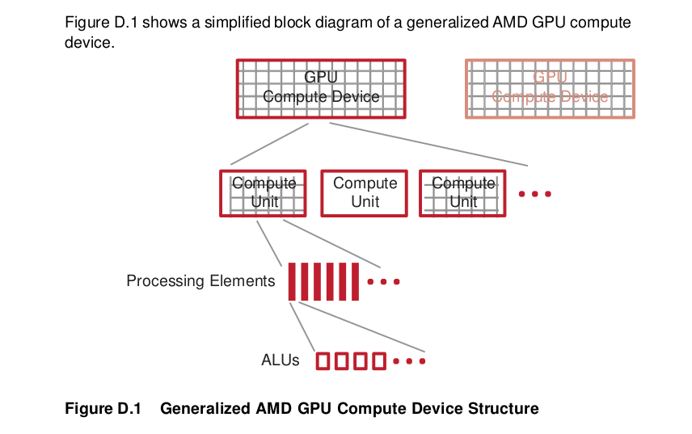

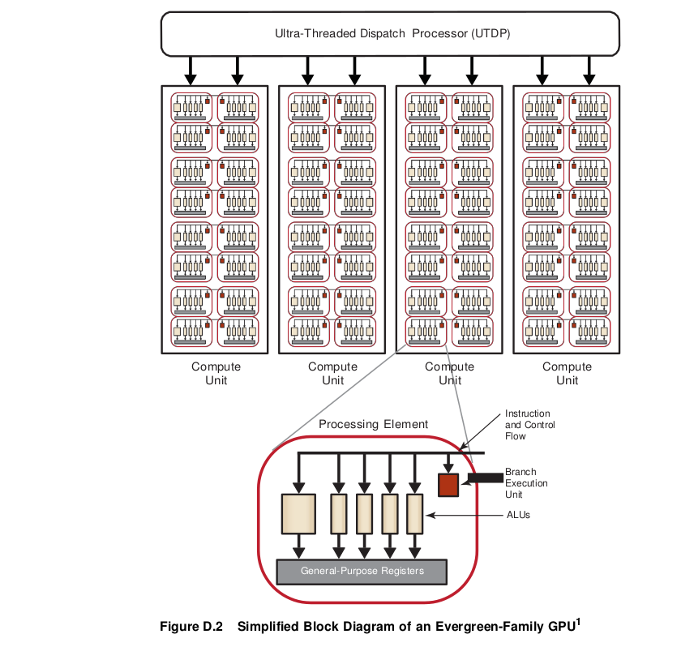

Figure D.2 is a simplified diagram of an AMD GPU compute device. Different GPU compute devices have different characteristics (such as the number of compute units), but follow a similar design pattern.

GPU compute devices comprise groups of compute units. Each compute unit contains numerous processing elements, which are responsible for executing kernels, each operating on an independent data stream. Processing elements, in turn, contain numerous processing elements, which are the fundamental, programmable ALUs that perform integer, single-precision floating-point, double- precision floating-point, and transcendental operations. All processing elements within a compute unit execute the same instruction sequence in lock-step for
Evergreen and Northern Islands devices; different compute units can execute

1. Much of this is transparent to the programmer.

different instructions.

A processing element is arranged as a five-way or four-way (depending on the
GPU type) very long instruction word (VLIW) processor (see bottom of
Figure D.2). Up to five scalar operations (or four, depending on the GPU type) can be co-issued in a VLIW instruction, each of which are executed on one of the corresponding five ALUs. ALUs can execute single-precision floating point or integer operations. One of the five ALUs also can perform transcendental operations (sine, cosine, logarithm, etc.). Double-precision floating point operations are processed (where supported) by connecting two or four of the ALUs (excluding the transcendental core) to perform a single double-precision operation. The processing element also contains one branch execution unit to handle branch instructions.

Different GPU compute devices have different numbers of processing elements. For example, the ATI Radeon™ HD 5870 GPU has 20 compute units, each with
16 processing elements, and each processing elements contains five ALUs; this
yields 1600 physical ALUs.

.. _OpenCL_OpenGL:

OpenCL-OpenGL Interoperability
===============================

This chapter explains how to establish an association between GL context and
CL context.

Please note the following guidelines.

1.   All devices used to create the OpenCL context associated with command_queue must support acquiring shared CL/GL objects. This constraint is enforced at context-creation time.

2.   clCreateContext and clCreateContextFromType fail context creation if the device list passed in cannot interoperate with the GLcontext. clCreateContext only permits GL-friendly device(s). clCreateFromContextType can only include GL-friendly device(s).

3.   Use clGetGLContextInfoKHR to determine GL-friendly device(s) from the following parameters:
	a.   CL_CURRENT_DEVICE_FOR_GL_CONTEXT_KHR only returns the device that can interoperate with the GL context.
	b.   CL_DEVICES_FOR_GL_CONTEXT_KHR includes all GL-context interoperable devices.

4.   While it is possible to create as many GL contexts on a GPU, do not create concurrently two GL contexts for two GPUs from the 	same process.

5.   For OpenGL interoperability with OpenCL, there is a strict order in which the OpenCL context is created and the texture/buffershared allocations can be made. To use shared resources, the OpenGL application must create an OpenGL context and afterwards an   OpenCL context. All resources (GL buffers and textures) created after the OpenCL context was created can be shared between OpenGL and OpenCL. If resources are allocated before the OpenCL context was created, they cannot be shared between OpenGL and OpenCL.

Linux Operating System
#######################

Single GPU Environment
************************

Creating CL Context from a GL Context
**************************************
Using GLUT

1.   Use glutInit to initialize the GLUT library and to negotiate a session with the windowing system. This function also processes the command-line options depending on the windowing system.

2.   Use glXGetCurrentContext to get the current rendering context (GLXContext).

3.   Use glXGetCurrentDisplay to get the display ( Display * ) that is associated with the current OpenGL rendering context of the calling thread.

4.   Use clGetGLContextInfoKHR (see Section 9.7 of the OpenCL Specification 1.1) and the CL_CURRENT_DEVICE_FOR_GL_CONTEXT_KHR parameter to get the device ID of the CL device associated with the OpenGL context.

5.   Use clCreateContext (see Section 4.3 of the OpenCL Specification 1.1) to create the CL context (of type cl_context).

The following code snippet shows how to create an interoperability context using
GLUT in Linux.

::

  glutInit(&argc, argv); glutInitDisplayMode(GLUT_RGBA | GLUT_DOUBLE); glutInitWindowSize(WINDOW_WIDTH, WINDOW_HEIGHT); glutCreateWindow("OpenCL SimpleGL");
  gGLXContext glCtx = glXGetCurrentContext(); Cl_context_properties cpsGL[] =
  {
  CL_CONTEXT_PLATFORM,

  (cl_context_properties)platform, CL_GLX_DISPLAY_KHR,
  (intptr_t) glXGetCurrentDisplay(), CL_GL_CONTEXT_KHR,
   (	intptr_t) glCtx, 0};

   status = clGetGLContextInfoKHR(cpsGL, CL_CURRENT_DEVICE_FOR_GL_CONTEXT_KHR, sizeof(cl_device_id),
  &interopDevice,
  NULL);

  // Create OpenCL context from device's id context = clCreateContext(cpsGL,
  1,
  &interopDevice,
  0,
  0,
  &status);

Using X Window System

1. Use XOpenDisplay to open a connection to the server that controls a display.

2. Use glXChooseFBConfig to get a list of GLX frame buffer configurations that match the specified attributes.

3. Use glXChooseVisual to get a visual that matches specified attributes.

4. Use XCreateColormap to create a color map of the specified visual type for the screen on which the specified window resides and returns the colormap ID associated with it. Note that the specified window is only used to determine the screen.

5. Use XCreateWindow to create an unmapped sub-window for a specified parent window, returns the window ID of the created window, and causes the X server to generate a CreateNotify event. The created window is placed on top in the stacking order with respect to siblings.

6. Use XMapWindow to map the window and all of its sub-windows that have had map requests. Mapping a window that has an unmapped ancestor does not display the window, but marks it as eligible for display when the ancestor becomes mapped. Such a window is called unviewable. When all its ancestors are mapped, the window becomes viewable and is visible on the screen if it is not    obscured by another window.

7. Use glXCreateContextAttribsARB to initialize the context to the initial state defined by the OpenGL specification, and returns a handle to it. This handle can be used to render to any GLX surface.

8. Use glXMakeCurrent to make argrument3 (GLXContext) the current GLX rendering context of the calling thread, replacing the previously current context if there was one, and attaches argument3 (GLXcontext) to a GLX drawable, either a window or a GLX pixmap.

9. Use clGetGLContextInfoKHR to get the OpenCL-OpenGL interoperability device corresponding to the window created in step 5.

10. Use clCreateContext to create the context on the interoperable device obtained in step 9.

The following code snippet shows how to create a CL-GL interoperability context using the X Window system in Linux.

::

  Display *displayName = XOpenDisplay(0);

  int nelements;
  GLXFBConfig *fbc = glXChooseFBConfig(displayName,
  DefaultScreen(displayName), 0, &nelements);
  static int attributeList[] = { GLX_RGBA,
  GLX_DOUBLEBUFFER,
  GLX_RED_SIZE,
  1,
  GLX_GREEN_SIZE,
  1,
  GLX_BLUE_SIZE,
  1,
  None
  };
  XVisualInfo *vi = glXChooseVisual(displayName,
  DefaultScreen(displayName),
  attributeList);

  XSetWindowAttributes swa;
  swa.colormap = XCreateColormap(displayName,
  RootWindow(displayName, vi->screen),
  vi->visual,
  AllocNone);
  swa.border_pixel = 0;
  swa.event_mask = StructureNotifyMask;

  Window win = XCreateWindow(displayName, RootWindow(displayName, vi->screen),
  10,
  10,
  WINDOW_WIDTH,
  WINDOW_HEIGHT,
  0,
  vi->depth,
  InputOutput,
  vi->visual,
  CWBorderPixel|CWColormap|CWEventMask,
  &swa);

  XMapWindow (displayName, win);
  std::cout	<< "glXCreateContextAttribsARB "
  << (void*) glXGetProcAddress((const
  GLubyte*)"glXCreateContextAttribsARB")
  << std::endl;

  GLXCREATECONTEXTATTRIBSARBPROC glXCreateContextAttribsARB = (GLXCREATECONTEXTATTRIBSARBPROC)
  glXGetProcAddress((const
  GLubyte*)"glXCreateContextAttribsARB");

  int attribs[] = {
  GLX_CONTEXT_MAJOR_VERSION_ARB, 3,
  GLX_CONTEXT_MINOR_VERSION_ARB, 0,
  0
  };

  GLXContext ctx = glXCreateContextAttribsARB(displayName,
  *fbc,
  0,
  true,
  attribs);
  glXMakeCurrent (displayName,

  win, ctx);
  cl_context_properties cpsGL[] = { CL_CONTEXT_PLATFORM,(cl_context_properties)platform, CL_GLX_DISPLAY_KHR, (intptr_t) glXGetCurrentDisplay(), CL_GL_CONTEXT_KHR, (intptr_t) gGlCtx, 0
  };
  status = clGetGLContextInfoKHR( cpsGL,
  CL_CURRENT_DEVICE_FOR_GL_CONTEXT_KHR,
  sizeof(cl_device_id),
  &interopDeviceId,
  NULL);

  // Create OpenCL context from device's id context = clCreateContext(cpsGL,
  1,
  &interopDeviceId,
  0,
  0,
  &status);

Multi-GPU Configuration
***********************

Creating CL Context from a GL Context
**************************************
Using X Window System

1. Use XOpenDisplay to open a connection to the server that controls a display.

2. Use ScreenCount to get the number of available screens.

3. Use XCloseDisplay to close the connection to the X server for the display specified in the Display structure and destroy all windows, resource IDs (Window, Font, Pixmap, Colormap, Cursor, and GContext), or other resources that the client created on this display.

4. Use a FOR loop to enumerate the displays. To change the display, change the value of the environment variable DISPLAY.

5. Inside the loop:
	a. Use putenv to set the environment variable DISPLAY with respect to the display number.
	b. Use OpenDisplay to open a connection to the server that controls a display.
	c. Use glXChooseFBConfig to get a list of GLX frame buffer configurations that match the specified attributes.
	d. Use glXChooseVisual to get a visual that matches specified attributes. e.   Use XCreateColormap to create a color map of the specified visual type for the screen on which the specified window resides and returns the colormap ID associated with it. Note that the specified window is only used to determine the screen.
	f. Use XCreateWindow to create an unmapped sub-window for a specified parent window, returns the window ID of the created window, and causes the X server to generate a CreateNotify event. The created window is placed on top in the stacking order with respect to siblings.
	g. Use XMapWindow to map the window and all of its sub-windows that have had map requests. Mapping a window that has an unmapped ancestor does not display the window but marks it as eligible for display when the ancestor becomes mapped. Such a window is called unviewable. When all its ancestors are mapped, the window becomes viewable and is visible on the screen, if it is not obscured by another window.
	h. Use glXCreateContextAttribsARB function to initialize the context to the initial state defined by the OpenGL specification and	return a handle to it. This handle can be used to render to any GLX surface.
	i. Use glXMakeCurrent to make argrument3 (GLXContext) the current GLX rendering context of the calling thread, replacing the previously current context, if there was one, and to attach argument3 (GLXcontext) to a GLX drawable, either a window or a GLX pixmap.
	j. Use clGetGLContextInfoKHR to get the number of OpenCL-OpenGL interoperability devices corresponding to the window created in f, above.
	k. If the number of interoperable devices is zero, use glXDestroyContext to destroy the context created at step h, and go to step A otherwise, exit from the loop (an OpenCL-OpenGL interoperable device has been found).

6. Use clGetGLContextInfoKHR to get the OpenCL-OpenGL interoperable device id.

7. Use clCreateContext to create the context on the interoperable device obtained in the previous step.

The following code segment shows how to create an OpenCL-OpenGL interoperability context on a system with multiple GPUs.

::

  displayName = XOpenDisplay(NULL);
  int screenNumber = ScreenCount(displayName);
  XCloseDisplay(displayName);

  for (int i = 0; i < screenNumber; i++)
  {
  if (isDeviceIdEnabled())
  {
  if (i < deviceId)
  {
  continue;
  }
  }
  char disp[100];
  sprintf(disp, "DISPLAY=:0.%d", i);
  putenv(disp);
  displayName = XOpenDisplay(0);
  int nelements;
  GLXFBConfig *fbc = glXChooseFBConfig(displayName,
  DefaultScreen(displayName),
  0,
  &nelements);
  static int attributeList[] = { GLX_RGBA,
  GLX_DOUBLEBUFFER,
  GLX_RED_SIZE,
  1,
  GLX_GREEN_SIZE,
  1,
  GLX_BLUE_SIZE,
  1,
  None
  };

  XVisualInfo *vi = glXChooseVisual(displayName, DefaultScreen(displayName), attributeList);
  XSetWindowAttributes swa;
  swa.colormap = XCreateColormap(displayName,
  RootWindow(displayName, vi->screen),
  vi->visual,
  AllocNone);
  swa.border_pixel = 0;
  swa.event_mask = StructureNotifyMask;

  win = XCreateWindow(displayName, RootWindow(displayName, vi->screen),
  10,
  10,
  width,
  height,
  0,
  vi->depth,
  InputOutput,
  vi->visual,
  CWBorderPixel|CWColormap|CWEventMask,
  &swa);

  XMapWindow (displayName, win);
  int attribs[] = {
  };

  GLX_CONTEXT_MAJOR_VERSION_ARB, 3, GLX_CONTEXT_MINOR_VERSION_ARB, 0,
  0
  GLXContext ctx = glXCreateContextAttribsARB(displayName,
  *fbc,
  0,
  true,
  attribs);
  glXMakeCurrent (displayName,
  win,
  ctx);

  gGlCtx = glXGetCurrentContext();
  properties cpsGL[] = {
  CL_CONTEXT_PLATFORM, (cl_context_properties)platform,
  CL_GLX_DISPLAY_KHR, (intptr_t) glXGetCurrentDisplay(),
  CL_GL_CONTEXT_KHR, (intptr_t) gGlCtx, 0
  };

  size_t deviceSize = 0;
  status = clGetGLContextInfoKHR(cpsGL,
  CL_CURRENT_DEVICE_FOR_GL_CONTEXT_KHR,
  0,
  NULL,
  &deviceSize);
  int numDevices = (deviceSize / sizeof(cl_device_id));

  if(numDevices == 0)
  {
  glXDestroyContext(glXGetCurrentDisplay(), gGlCtx);
  continue;
  }
  else 
  {
  //Interoperable device found std::cout<<"Interoperable device found "<<std::endl; break;
  }
  }

  status = clGetGLContextInfoKHR( cpsGL, CL_CURRENT_DEVICE_FOR_GL_CONTEXT_KHR, sizeof(cl_device_id),
  &interopDeviceId, NULL);

  // Create OpenCL context from device's id context = clCreateContext(cpsGL,
  1,
  &interopDeviceId,
  0,
  0,
  &status);

Additional GL Formats Supported
*******************************
The following is a list of GL formats beyond the minimum set listed in The OpenCL Extension Specification, v 1.2 that AMD supports.

==================================== ============================
AMD-Supported GL Formats 		GL internal format	
==================================== ============================		
GL_ALPHA8				 CL_A,CL_UNORM8
GL_R8, CL_R,				 CL_UNORM_INT8
GL_R8UI CL_R,				 CL_UNSIGNED_INT8
GL_R8I CL_R, 				 CL_SIGNED_INT8
GL_RG8 CL_RG, 				 CL_UNORM_INT8
GL_RG8UI CL_RG, 			 CL_UNSIGNED_INT8
GL_RG8I CL_RG,  			 CL_SIGNED_INT8
GL_RGB8 CL_RGB, 			 CL_UNORM_INT8
GL_RGB8UI CL_RGB,			 CL_UNSIGNED_INT8
GL_RGB8I CL_RGB, 			 CL_SIGNED_INT8
GL_R16 CL_R, 				 CL_UNORM_INT16
GL_R16UI CL_R, 				 CL_UNSIGNED_INT16
GL_R16I CL_R, 				 CL_SIGNED_INT16
GL_RG16 CL_RG, 				 CL_UNORM_INT16
GL_RG16UI CL_RG,	 		 CL_UNSIGNED_INT16
GL_RG16I CL_RG,				 CL_SIGNED_INT16
GL_RGB16 CL_RGB,			 CL_UNORM_INT16
GL_RGB16UI CL_RGB, 			 CL_UNSIGNED_INT16
GL_RGB16I CL_RGB, 			 CL_SIGNED_INT16
GL_R32I CL_R, 				 CL_SIGNED_INT32
GL_R32UI CL_R,				 CL_UNSIGNED_INT32
GL_R32F CL_R, 				 CL_FLOAT
GL_RG32I CL_RG, 			 CL_SIGNED_INT32
GL_RG32UI CL_RG,			 CL_UNSIGNED_INT32
GL_RG32F CL_RG, 			 CL_FLOAT
GL_RGB32I CL_RGB, 			 CL_SIGNED_INT32
GL_RGB32UI CL_RGB,			 CL_UNSIGNED_INT32
==================================== ============================

.. _Functions_OpenCL:

New built-in functions in OpenCL 2.0
========================================

List of Functions
##################

Work Item Functions
*********************
============================== =========================================================================== 
 get_enqueued_local_size 			local sizes in uniform part of NDRange
  get_global_linear_id 				unique 1D index for each work item in the NDRange
  get_local_linear_id 				unique 1D index for each work item in the work group
============================== =========================================================================== 

Integer functions
*******************
 | ctz 				:		count trailing zero bits

Synchronization Functions
**************************
 | work_group_barrier 		:		replaces barrier, adds scope

Address space qualifier functions
***********************************
============================== =========================================================================== 
  to_global 					convert generic pointer to global pointer
  to_local 					convert genericpointer to local pointer
  to_private 					convert generic pointer to private pointer
  get_fence 					get fence appropriate to address space
============================== =========================================================================== 

Atomic functions
******************

=========================================== ========================================
  atomic_init 					Initialize atomic value
  atomic_work_item_fence 			memory fence
  atomic_store[_explicit] 			atomic store
  atomic_load[_explicit] 			atomic load
  atomic_exchange[_explicit] 			atomic exchange
  atomic_compare_exchange_strong[_explicit] 	atomic compare and exchange (CAS)
  atomic_compare_exchange_weak[_explicit] 	atomic compare and exchange (CAS)
  atomic_fetch_add[_explicit] 			atomic fetch+add
  atomic_fetch_sub[_explicit] 			atomic fetch+sub
  atomic_fetch_or[_explicit] 			atomic fetch+or
  atomic_fetcn_xor[_explicit] 			atomic fetch+xor
  atomic_fetch_and[_explicit] 			atomic fetch+and
  atomic_fetch_max_[explicit] 			atomic fetch+max
  atomic_fetch_min[_explicit]
  atomic fetch+min
  atomic_flag_test_and_set[_explicit] 		atomic flag set
  atomic_flag_clear[_explicit] 		        atomic flag clear
=========================================== ========================================

Image Read and Write Functions
*********************************
 
 | read_imagef 		:			Read from 2D depth [array] image
 | write_imagef 	:			Write to 2D depth [array] image

Work group functions
*********************

=============================================== =========================================================================== 
 work_group_all 				Test all members of work group (and reduction)
 work_group_any 				Test any member of work group (or reduction)
 work_group_broadcast 				Brodcast value to every member of work group
 work_group_reduce_add 				Sum reduction across work group
 work_group_reduce_max 				Max reduction across work group
 work_group_reduce_min 				Min reduction across work group
 work_group_scan_exclusive_add 			Sum exclusive scan across work group
 work_group_scan_exclusive_max 			Max exclusive scan across work group
 work_group_scan_exclusive_min			Min exclusive scan across work group
 work_group_scan_inclusive_add Sum inclusive  	scan across work group
 work_group_scan_inclusive_max Max inclusive  	scan across work group
 work_group_scan_inclusive_min Min inclusive  	scan across work group
=============================================== =========================================================================== 

Pipe functions
***************

==================================== ======================================================
  read_pipe 					Read from pipe
  write_pipe					Write to pipe
  reserve_read_pipe				Reserve reads from pipe
  reserve_write_pipe 				Reserve writes to pipe
  commit_read_pipe 				Commit reserved pipe reads
  commit_write_pipe 				Commit reserved pipe writes
  is_valid_reserve_id 				Test reservation value
  work_group_reserve_read_pipe 			Work group read reservation
  work_group_reserve_write_pipe 		work group write reservation
  work_group_commit_read_pipe 			work group commit read reservation
  work_group_commit_write_pipe 			work group commit write reservation
  get_pipe_num_packets 				get current number of packets in pipe
  get_pipe_max_packets 				get capacity of pipe
==================================== ======================================================

Enqueueing Kernels
******************

============================================= =======================================================
  enqueue_kernel 				Enqueue block as kernel
  get_kernel_work_group_size 			Query max work group size
  get_kernel_preferred_work_group_size_m 	Query preferred divisor of work group size multiple
  enqueue_marker 				Enqueue a marker
  retain_event 					Increment refcount of event
  release_event 				Decrement refcount of event
  create_user_event 				Create user event
  is_valid_event 				Check if event is valid
  set_user_event_status 			Signal user event
  capture_event_profiling_info 			Schedule capture of profiling info
  get_default_queue 				Get default queue
  ndrange_1D 					Create 1D NDRange
  ndrange_2D 					Create 2D NDRange
  ndrange_3D 					Create 3D NDRange
============================================= =======================================================

Deprecated built-ins barrier
******************************
 | mem_fence
 | read_mem_fence
 | write_mem_fence
 | atomic_add
 | atomic_sub
 | atomic_xchg
 | atomic_inc
 | atomic_dec
 | atomic_cmpxchg
 | atomic_min
 | atomic_max
 | atomic_and
 | atomic_or
 | atomic_xor

New runtime APIs in OpenCL 2.0
********************************

New Types
***********
=============================================  ===============================================================
  cl_device_svm_capabilities 			Returned by clGetDeviceInfo(...CL_DEVICE_SVM_CAPABILITIES...)
  cl_queue_properties 				See clCreateCommandQueueWithProperties
  cl_svm_mem_flags 				See clSVMAlloc 
  cl_pipe_properties 				See clCreatePipe
  cl_pipe_info 					See clGetPipeInfo
  cl_sampler_properties 			See clCreateSamplerWithProperties
  cl_kernel_exec_info 				See clSetKernelExecInfo
  cl_image_desc 				A field name changed from buffer to mem_object
  cl_kernel_sub_group_info 			See clGetKernelSubGroupInfoKHR
=============================================  ===============================================================

New Macros
***********

 | CL_INVALID_PIPE_SIZE
 | CL_INVALID_DEVICE_QUEUE
 | CL_VERSION_2_0
 | CL_DEVICE_QUEUE_ON_HOST_PROPERTIES
 | CL_DEVICE_MAX_READ_WRITE_IMAGE_ARGS
 | CL_DEVICE_MAX_GLOBAL_VARIABLE_SIZE
 | CL_DEVICE_QUEUE_ON_DEVICE_PROPERTIES
 | CL_DEVICE_QUEUE_ON_DEVICE_PREFERRED_SIZE
 | CL_DEVICE_QUEUE_ON_DEVICE_MAX_SIZE
 | CL_DEVICE_MAX_ON_DEVICE_QUEUES
 | CL_DEVICE_MAX_ON_DEVICE_EVENTS
 | CL_DEVICE_SVM_CAPABILITIES
 | CL_DEVICE_GLOBAL_VARIABLE_PREFERRED_TOTAL_SIZE
 | CL_DEVICE_MAX_PIPE_ARGS
 | CL_DEVICE_PIPE_MAX_ACTIVE_RESERVATIONS
 | CL_DEVICE_PIPE_MAX_PACKET_SIZE
 | CL_DEVICE_PREFERRED_PLATFORM_ATOMIC_ALIGNMENT
 | CL_DEVICE_PREFERRED_GLOBAL_ATOMIC_ALIGNMENT
 | CL_DEVICE_PREFERRED_LOCAL_ATOMIC_ALIGNMENT
 | CL_QUEUE_ON_DEVICE
 | CL_QUEUE_ON_DEVICE_DEFAULT
 | CL_DEVICE_SVM_COARSE_GRAIN_BUFFER
 | CL_DEVICE_SVM_FINE_GRAIN_BUFFER
 | CL_DEVICE_SVM_FINE_GRAIN_SYSTEM
 | CL_DEVICE_SVM_ATOMICS
 | CL_QUEUE_SIZE
 | CL_MEM_SVM_FINE_GRAIN_BUFFER
 | CL_MEM_SVM_ATOMICS
 | CL_sRGB
 | CL_sRGBx
 | CL_sRGBA
 | CL_sBGRA
 | CL_ABGR
 | CL_MEM_OBJECT_PIPE
 | CL_MEM_USES_SVM_POINTER
 | CL_PIPE_PACKET_SIZE
 | CL_PIPE_MAX_PACKETS
 | CL_SAMPLER_MIP_FILTER_MODE
 | CL_SAMPLER_LOD_MIN
 | CL_SAMPLER_LOD_MAX
 | CL_PROGRAM_BUILD_GLOBAL_VARIABLE_TOTAL_SIZE
 | CL_KERNEL_ARG_TYPE_PIPE
 | CL_KERNEL_EXEC_INFO_SVM_PTRS
 | CL_KERNEL_EXEC_INFO_SVM_FINE_GRAIN_SYSTEM
 | CL_COMMAND_SVM_FREE
 | CL_COMMAND_SVM_MEMCPY
 | CL_COMMAND_SVM_MEMFILL
 | CL_COMMAND_SVM_MAP
 | CL_COMMAND_SVM_UNMAP
 | CL_PROFILING_COMMAND_COMPLETE

New API calls
****************

 | clCreateCommandQueueWithProperties See section 5.1
 | clCreatePipe See section 5.4.1
 | clGetPipeInfo See section 5.4.2
 | clSVMAlloc See section 5.6.1
 | clSVMFree See section 5.6.1
 | clEnqueueSVMFree See section 5.6.1
 | clEnqueueSVMMemcpy See section 5.6.1
 | clEnqueueSVMMemFill See section 5.6.1
 | clEnqueueSVMMap See section 5.6.1
 | clEnqueueSVMUnmap See section 5.6.1
 | clCreateSamplerWithProperties See section 5.7.1
 | clSetKernelArgSVMPointer See section 5.9.2
 | clSetKernelExecInfo See section 5.9.2
 | clGetKernelSubGroupInfoKHR See section 9.17.2.1

Deprecated runtimes
********************
 | clCreateCommandQueue
 | clCreateSampler
 | clEnqueueTask

