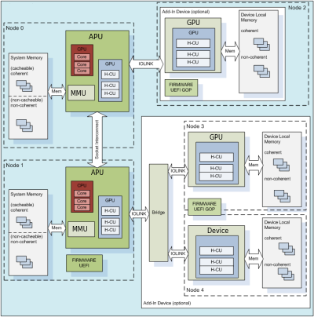

.. _ROCm-System-Management:

=======================
ROCm System Management
=======================

ROCm-SMI
=================

**ROCm System Management Interface**

This repository includes the rocm-smi tool. This tool exposes functionality for clock and temperature management of your ROCm enabled system.

**Installation**

You may find rocm-smi at the following location after installing the rocm package: ::

 /opt/rocm/bin/rocm-smi

Alternatively, you may clone this repository and run the tool directly.

**Usage**

For detailed and up to date usage information, we recommend consulting the help: ::

  /opt/rocm/bin/rocm-smi -h

For convenience purposes, following is a quick excerpt:

usage: rocm-smi [-h] [-d DEVICE] [-i] [-t] [-c] [-g] [-f] [-p] [-P] [-o] [-l] [-s] [-a] [-r]
                [--setsclk LEVEL [LEVEL ...]] [--setmclk LEVEL [LEVEL ...]] [--setfan LEVEL]
                [--setperflevel LEVEL] [--setoverdrive %] [--setprofile # # # # #] [--resetprofile]
                [--load FILE | --save FILE] [--autorespond RESPONSE]

AMD ROCm System Management Interface

optional arguments:

====================== ========================================================================
  -h, --help                  show this help message and exit
  --load FILE                 Load Clock, Fan, Performance and Profile settings from FILE
  --save FILE                 Save Clock, Fan, Performance and Profile settings to FILE
====================== ========================================================================

 -d DEVICE, --device DEVICE  Execute command on specified device

============================= ========================================================================
  -i, --showid                Show GPU ID
  -t, --showtemp              Show current temperature
  -c, --showclocks            Show current clock frequencies
  -g, --showgpuclocks         Show current GPU clock frequencies
  -f, --showfan               Show current fan speed
  -p, --showperflevel         Show current PowerPlay Performance Level
  -P, --showpower             Show current GPU ASIC power consumption
  -o, --showoverdrive         Show current OverDrive level
  -l, --showprofile           Show Compute Profile attributes
  -s, --showclkfrq            Show supported GPU and Memory Clock
  -a, --showallinfo           Show all SMI-supported values values

  -r, --resetclocks           Reset clocks to default values
  --setsclk LEVEL [LEVEL ...] Set GPU Clock Frequency Level Mask
  --setmclk LEVEL [LEVEL ...] Set GPU Memory Clock Frequency Mask
  --setfan LEVEL              Set GPU Fan Speed Level
  --setperflevel LEVEL        Set PowerPlay Performance Level
  --setoverdrive %            Set GPU OverDrive level
  --setprofile # # # # #      Specify Compute Profile attributes
  --resetprofile              Reset Compute Profile

  --autorespond RESPONSE      Response to automatically provide for all prompts (NOT RECOMMENDED)
============================= ========================================================================

**Detailed Option Descriptions**

**--setsclk/--setmclk # [# # ...]:**  This allows you to set a mask for the levels. For example, if a GPU has 8 clock levels, you can set a mask to use levels 0, 5, 6 and 7 with --setsclk 0 5 6 7 . This will only use the base level, and the top 3 clock levels. This will allow you to keep the GPU at base level when there is no GPU load, and the top 3 levels when the GPU load increases.

.. NOTE::
    The clock levels will change dynamically based on GPU load based on the default Compute and Graphics profiles. The thresholds and 	  delays for a custom mask cannot be controlled through the SMI tool

    This flag automatically sets the Performance Level to "manual" as the mask is not
    applied when the Performance level is set to auto

**--setfan LEVEL:** This sets the fan speed to a value ranging from 0 to 255 (not from 0-100%).

.. NOTE:: 
	While the hardware is usually capable of overriding this value when required, it is recommended to not set the fan level 	 lower than the default value for extended periods of time

**--setperflevel LEVEL:** This lets you use the pre-defined Performance Level values, which can include: auto (Automatically change       	PowerPlay values based on GPU workload low (Keep PowerPlay values low, regardless of workload) high (Keep PowerPlay values high,    	regardless of workload) manual (Only use values defined in sysfs values)

**--setoverdrive #:** This sets the percentage above maximum for the max Performance Level. For example, --setoverdrive 20 will increase 	the top sclk level by 20%. If the maximum sclk level is 1000MHz, then --setoverdrive 20 will increase the maximum sclk to 1200MHz

.. NOTE::
    This option can be used in conjunction with the --setsclk mask Operating the GPU outside of specifications can cause irreparable 	 damage to your hardware Please observe the warning displayed when using this option

**--setprofile # # # # #:** The Compute Profile accepts 5 parameters, which are (in order): Minimum SCLK - Minimum GPU clock speed in MHz Minimum MCLK - Minimum GPU Memory clock speed in MHz Activity threshold - Workload required before clock levels change (%) Hysteresis Up - Delay before clock level is increased in milliseconds Hysteresis Down - Delay before clock level is decresed in milliseconds

.. NOTE::
    When a compute queue is detected, these values will be automatically applied to the system
    Compute Power Profiles are only applied when the Performance Level is set to "auto"

**Testing changes**

After making changes to the SMI, run the test script to ensure that all functionality remains intact before uploading the patch. This can be done using:

./test-rocm-smi.sh /opt/rocm/bin/rocm-smi

The test can run all flags for the SMI, or specific flags can be tested with the -s option.

Any new functionality added to the SMI should have a corresponding test added to the test script.

Disclaimer

The information contained herein is for informational purposes only, and is subject to change without notice. While every precaution has been taken in the preparation of this document, it may contain technical inaccuracies, omissions and typographical errors, and AMD is under no obligation to update or otherwise correct this information. Advanced Micro Devices, Inc. makes no representations or warranties with respect to the accuracy or completeness of the contents of this document, and assumes no liability of any kind, including the implied warranties of noninfringement, merchantability or fitness for particular purposes, with respect to the operation or use of AMD hardware, software or other products described herein. No license, including implied or arising by estoppel, to any intellectual property rights is granted by this document. Terms and limitations applicable to the purchase or use of AMD's products are as set forth in a signed agreement between the parties or in AMD's Standard Terms and Conditions of Sale.

AMD, the AMD Arrow logo, and combinations thereof are trademarks of Advanced Micro Devices, Inc. Other product names used in this publication are for identification purposes only and may be trademarks of their respective companies.

Copyright (c) 2014-2017 Advanced Micro Devices, Inc. All rights reserved.

Programing ROCm-SMI
*********************

SYSFS Interface
=================

Naming and data format standards for sysfs files
************************************************

The libsensors library offers an interface to the raw sensors data through the sysfs interface. Since lm-sensors 3.0.0, libsensors is
completely chip-independent. It assumes that all the kernel drivers implement the standard sysfs interface described in this document.
This makes adding or updating support for any given chip very easy,as libsensors, and applications using it, do not need to be modified.

Note that motherboards vary widely in the connections to sensor chips.There is no standard that ensures connection of sensor to CPU,variation in external resistor value and conversion calculation we can not hard code this into the driver and have to be done in user space.

Each chip gets its own directory in the sysfs /sys/devices tree.  To find all sensor chips, it is easier to follow the device symlinks from /sys/class/hwmon/hwmon*. This document briefly describes the standards that the drivers follow, so that an application program can scan for entries and access this data in a simple and consistent way. That said, such programs will have to implement conversion, labeling and hiding of inputs

Up to lm-sensors 3.0.0, libsensors looks for hardware monitoring attributes in the "physical" device directory. Since lm-sensors 3.0.1, attributes found in the hwmon "class" device directory are also supported. Complex drivers (e.g. drivers for multifunction chips) may want to use this possibility to avoid namespace pollution. The only drawback will be that older versions of
libsensors won't support the driver in question.

All sysfs values are fixed point numbers.

There is only one value per file, unlike the older /proc specification.The common scheme for files naming is: <type><number>_<item>. Usual types for sensor chips are "in" (voltage), "temp" (temperature) and "fan" (fan). Usual items are "input" (measured value), "max" (high threshold, "min" (low threshold). Numbering usually starts from 1,except for voltages which start from 0 (because most data sheets use this). A number is always used for elements that can be present more than once, even if there is a single element of the given type on the specific chip. Other files do not refer to a specific element, so they have a simple name, and no number.

Alarms are direct indications read from the chips. The drivers do NOT make comparisons of readings to thresholds. This allows violations between readings to be caught and alarmed. The exact definition of an alarm (for example, whether a threshold must be met or must be exceeded to cause an alarm) is chip-dependent.

When setting values of hwmon sysfs attributes, the string representation of the desired value must be written, note that strings which are not a number are interpreted as 0! For more on how written strings are interpreted see the "sysfs attribute writes interpretation" section at the end of this file.

======== ==============================================
  [0-*]	  denotes any positive number starting from 0
  [1-*]	  denotes any positive number starting from 1
  RO	  read only value
  WO	  write only value
  RW	  read/write value
======== ==============================================

Read/write values may be read-only for some chips, depending on the hardware implementation.

All entries (except name) are optional, and should only be created in a given driver if the chip has the feature.

*********************
 Global attributes 
*********************

================ ============================================================================================
name		  | The chip name.This should be a short, lowercase string, not containing whitespace,
		  | dashes, or the wildcard character '*'.This attribute represents the chip name. 
		  | It is the only mandatory attribute.I2C devices get this attribute created automatically.
		  | RO

update_interval	  | The interval at which the chip will update readings.
		  | Unit: millisecond
		  | RW
		  | Some devices have a variable update rate or interval.
		  | This attribute can be used to change it to the desired value.
================ ============================================================================================

************
 Voltages 
************

====================== ===============================================================================================
in[0-*]_min	        |  Voltage min value.
		        |  Unit: millivolt
		        |  RW
		
in[0-*]_lcrit	        |  Voltage critical min value.
		        |  Unit: millivolt
		        |  RW
		        |  If voltage drops to or below this limit, the system may take drastic action such as power
		        |  down or reset. At the very least, it should report a fault.
 
in[0-*]_max	        | Voltage max value.
		        | Unit: millivolt
		        | RW
		
in[0-*]_crit	        | Voltage critical max value.
		        | Unit: millivolt
			| RW
			| If voltage reaches or exceeds this limit, the system may take drastic action such as power 
			| down or reset. At the very least, it should report a fault.

in[0-*]_input		| Voltage input value.
			| Unit: millivolt
			| RO
			| Voltage measured on the chip pin.Actual voltage depends on the scaling resistors on the
			| motherboard, as recommended in the chip datasheet.This varies by chip and by motherboard.
			| Because of this variation, values are generally NOT scaled by the chip driver, and must be 
			| done by the application.However, some drivers (notably lm87 and via686a) do scale, because 
			| of internal resistors built into a chip.These drivers will output the actual voltage. Rule of
			| thumb: drivers should report the voltage values at the "pins" of the chip.

in[0-*]_average  	| Average voltage
			| Unit: millivolt
			| RO

in[0-*]_lowest   	| Historical minimum voltage
			| Unit: millivolt
			| RO

in[0-*]_highest  	| Historical maximum voltage
			| Unit: millivolt
			| RO

in[0-*]_reset_history 	| Reset inX_lowest and inX_highest
			| WO

in_reset_history 	| Reset inX_lowest and inX_highest for all sensors
			| WO

in[0-*]_label		| Suggested voltage channel label.
			| Text string Should only be created if the driver has hints about what this voltage channel
			| is being used for, and user-space doesn't. In all other cases, the label is provided by
			| user-space.
			| RO

cpu[0-*]_vid		| CPU core reference voltage.
			| Unit: millivolt
			| RO
			| Not always correct.

vrm			| Voltage Regulator Module version number. 
			| RW (but changing it should no more be necessary)
			| Originally the VRM standard version multiplied by 10, but now an arbitrary number, as not
			| all standards have a version number.Affects the way the driver calculates the CPU core 
			| reference voltage from the vid pins.
====================== ===============================================================================================

Also see the Alarms section for status flags associated with voltages.

********
 Fans 
********

=============== =============================================================================================
fan[1-*]_min	 | Fan minimum value
		 | Unit: revolution/min (RPM)
		 | RW

fan[1-*]_max	 | Fan maximum value
		 | Unit: revolution/min (RPM)
		 | Only rarely supported by the hardware.
		 | RW

fan[1-*]_input	 | Fan input value.
		 | Unit: revolution/min (RPM)
		 | RO

fan[1-*]_div	 | Fan divisor.
		 | Integer value in powers of two (1, 2, 4, 8, 16, 32, 64, 128).
		 | RW
		 | Some chips only support values 1, 2, 4 and 8.
		 | Note that this is actually an internal clock divisor, which
		 | affects the measurable speed range, not the read value.

fan[1-*]_pulses	 | Number of tachometer pulses per fan revolution.
		 | Integer value, typically between 1 and 4.
		 | RW
		 | This value is a characteristic of the fan connected to the device's input, 
 		 | so it has to be set in accordance with the fan model.Should only be created 
		 | if the chip has a register to configure the number of pulses. In the absence 
		 | of such a register (and thus attribute) the value assumed by all devices is 2 pulses
		 | per fan revolution.

fan[1-*]_target  | Desired fan speed
		 | Unit: revolution/min (RPM)
		 | RW
		 | Only makes sense if the chip supports closed-loop fan speed
		 | control based on the measured fan speed.

fan[1-*]_label	 | Suggested fan channel label.
		 | Text string
		 | Should only be created if the driver has hints about what this fan channel is being 
		 | used for, and user-space doesn't.In all other cases, the label is provided by user-space.
		 | RO
=============== =============================================================================================

Also see the Alarms section for status flags associated with fans.

*******
 PWM 
*******
		
+--------------------------------------+-----------------------------------------------------------------------------------------+
| pwm[1-*]	 		       | | Pulse width modulation fan control.							 |
|				       | | Integer value in the range 0 to 255							 |
|				       | | RW											 | 
|			               | | 255 is max or 100%.									 |
+--------------------------------------+-----------------------------------------------------------------------------------------+
| pwm[1-*]_enable  	   	       | | Fan speed control method:								 |
|				       | | 0: no fan speed control (i.e. fan at full speed)					 |
|				       | | 1: manual fan speed control enabled (using pwm[1-*])					 |
|				       | | 2+: automatic fan speed control enabled						 |
|				       | | Check individual chip documentation files for automatic mode details.		 |
|				       | | RW											 |
+--------------------------------------+-----------------------------------------------------------------------------------------+
| pwm[1-*]_mode		   	       | | 0: DC mode (direct current)								 |
|				       | | 1: PWM mode (pulse-width modulation)							 |
|				       | | RW											 |
+--------------------------------------+-----------------------------------------------------------------------------------------+
| pwm[1-*]_freq			       | | Base PWM frequency in Hz.								 |
|				       | | Only possibly available when pwmN_mode is PWM, but not always present even then.	 |
|				       | | RW											 |
+--------------------------------------+-----------------------------------------------------------------------------------------+
| pwm[1-*]_auto_channels_temp          | | Select which temperature channels affect this PWM output in auto mode. Bitfield, 	 |
|				       | | 1 is temp1, 2 is temp2, 4 is temp3 etc...						 |
|				       | | Which values are possible depend on the chip used.					 |
|				       | | RW											 |
+--------------------------------------+-----------------------------------------------------------------------------------------+
| | pwm[1-*]_auto_point[1-*]_pwm       | | Define the PWM vs temperature curve. Number of trip points is chip-dependent.Use this |
| | pwm[1-*]_auto_point[1-*]_temp      | | for chips which associate trip points to PWM output channels.			 |
| | pwm[1-*]_auto_point[1-*]_temp_hyst | | RW											 |
+--------------------------------------+-----------------------------------------------------------------------------------------+
| | temp[1-*]_auto_point[1-*]_pwm      | | Define the PWM vs temperature curve. Number of trip points is chip dependent.	 |
| | temp[1-*]_auto_point[1-*]_temp     | | Use this for chips which associate trip points to temperature channels.		 |
| | temp[1-*]_auto_point[1-*]_temp_hyst| | RW											 |
+--------------------------------------+-----------------------------------------------------------------------------------------+

There is a third case where trip points are associated to both PWM output channels and temperature channels: the PWM values are associated to PWM output channels while the temperature values are associated to temperature channels. In that case, the result is determined by the mapping between temperature inputs and PWM outputs. When several temperature inputs are mapped to a given PWM output, this leads to several candidate PWM values.The actual result is up to the chip, but in general the highest candidate
value (fastest fan speed) wins.

****************
 Temperatures 
****************

========================= ==========================================================================================
temp[1-*]_type		  | Sensor type selection.
			  | Integers 1 to 6
			  | RW
			  | 1: CPU embedded diode
			  | 2: 3904 transistor
			  | 3: thermal diode
			  | 4: thermistor
			  | 5: AMD AMDSI
			  | 6: Intel PECI
			  | Not all types are supported by all chips

temp[1-*]_max		  | Temperature max value.
			  | Unit: millidegree Celsius (or millivolt, see below)
			  | RW

temp[1-*]_min		  | Temperature min value.
			  | Unit: millidegree Celsius
			  | RW

temp[1-*]_max_hyst 	  | Temperature hysteresis value for max limit.
			  | Unit: millidegree Celsius
			  | Must be reported as an absolute temperature, NOT a delta from the max value.
			  | RW

temp[1-*]_min_hyst 	  | Temperature hysteresis value for min limit.
			  | Unit: millidegree Celsius
			  | Must be reported as an absolute temperature, NOT a delta from the min value.
			  | RW

temp[1-*]_input 	  | Temperature input value.
			  | Unit: millidegree Celsius
			  | RO

temp[1-*]_crit		  | Temperature critical max value, typically greater than
			  | corresponding temp_max values.
			  | Unit: millidegree Celsius
			  | RW

temp[1-*]_crit_hyst 	  | Temperature hysteresis value for critical limit.
			  | Unit: millidegree Celsius
			  | Must be reported as an absolute temperature, NOT a delta from the critical value.
			  | RW

temp[1-*]_emergency       | Temperature emergency max value, for chips supporting more than two upper 
			  | temperature limits. Must be equal or greater than corresponding temp_crit values.
			  | Unit: millidegree Celsius
			  | RW

temp[1-*]_emergency_hyst  | Temperature hysteresis value for emergency limit.
			  | Unit: millidegree Celsius
			  | Must be reported as an absolute temperature, NOT a delta from the emergency value.
			  | RW

temp[1-*]_lcrit		  | Temperature critical min value, typically lower than corresponding temp_min values.
			  | Unit: millidegree Celsius
			  | RW

temp[1-*]_lcrit_hyst      | Temperature hysteresis value for critical min limit.
			  | Unit: millidegree Celsius
			  | Must be reported as an absolute temperature, NOT a delta from the critical min value.
			  | RW

temp[1-*]_offset          | Temperature offset which is added to the temperature reading by the chip.
			  | Unit: millidegree Celsius
			  | Read/Write value.

temp[1-*]_label		  | Suggested temperature channel label.
			  | Text string Should only be created if the driver has hints about what this temperature 
			  | channel is being used for, and user-space doesn't. In all other cases, the label is 
			  | provided by user-space.
			  | RO

temp[1-*]_lowest    	  | Historical minimum temperature
			  | Unit: millidegree Celsius
			  | RO

temp[1-*]_highest   	  | Historical maximum temperature
			  | Unit: millidegree Celsius
			  | RO

temp[1-*]_reset_history   | Reset temp_lowest and temp_highest
		 	  | WO

temp_reset_history        | Reset temp_lowest and temp_highest for all sensors
			  | WO
========================= ==========================================================================================

Some chips measure temperature using external thermistors and an ADC, and report the temperature measurement as a voltage. Converting this voltage back to a temperature (or the other way around for limits) requires mathematical functions not available in the kernel, so the conversion must occur in user space. For these chips, all temp* files described above should contain values expressed in millivolt instead of millidegree Celsius. In other words, such temperature channels are handled as voltage channels by the driver.

Also see the Alarms section for status flags associated with temperatures.

************
 Currents 
************

======================= ========================================================
curr[1-*]_max		 |  Current max value
			 |  Unit: milliampere
			 |  RW

curr[1-*]_min		 |  Current min value.
			 |  Unit: milliampere
			 |  RW

curr[1-*]_lcrit	 	 |  Current critical low value
			 |  Unit: milliampere
			 |   RW

curr[1-*]_crit		 |  Current critical high value.
			 |  Unit: milliampere
			 |  RW

curr[1-*]_input		 |  Current input value
			 |  Unit: milliampere
			 |  RO

curr[1-*]_average  	 |  Average current use
			 |  Unit: milliampere
			 |  RO

curr[1-*]_lowest 	 |  Historical minimum current
			 |  Unit: milliampere
			 |  RO

curr[1-*]_highest  	 |  Historical maximum current
			 |  Unit: milliampere
			 |  RO

curr[1-*]_reset_history  |  Reset currX_lowest and currX_highest
			 |  WO

curr_reset_history 	 |  Reset currX_lowest and currX_highest for all sensors
			 |  WO
======================= ========================================================

Also see the Alarms section for status flags associated with currents.

*********
 Power 
*********

================================ ===============================================================================
power[1-*]_average		 | Average power use
				 | Unit: microWatt
				 | RO

power[1-*]_average_interval	 | Power use averaging interval.  A poll notification is sent to this 
 				 | file if the hardware changes the averaging interval.
				 | Unit: milliseconds
				 | RW

power[1-*]_average_interval_max	 | Maximum power use averaging interval
				 | Unit: milliseconds
				 | RO

power[1-*]_average_interval_min	 | Minimum power use averaging interval
				 | Unit: milliseconds
				 | RO

power[1-*]_average_highest	 | Historical average maximum power use
				 | Unit: microWatt
				 | RO

power[1-*]_average_lowest	 | Historical average minimum power use
				 | Unit: microWatt
				 | RO

power[1-*]_average_max		 | A poll notification is sent to power[1-*]_average when power use
				 | rises above this value.
				 | Unit: microWatt
				 | RW

power[1-*]_average_min		 | A poll notification is sent to power[1-*]_average when power use
				 | sinks below this value.
				 | Unit: microWatt
				 | RW

power[1-*]_input		 | Instantaneous power use
				 | Unit: microWatt
				 | RO

power[1-*]_input_highest	 | Historical maximum power use
				 | Unit: microWatt
				 | RO

power[1-*]_input_lowest		 | Historical minimum power use
				 | Unit: microWatt
				 | RO

power[1-*]_reset_history	 | Reset input_highest, input_lowest,
				 | average_highest and average_lowest.
				 | WO

power[1-*]_accuracy		 | Accuracy of the power meter.
				 | Unit: Percent
				 | RO

power[1-*]_cap			 | If power use rises above this limit, the system should take action to 
				 | reduce power use.A poll notification is sent to this file if the cap is 
				 | changed by the hardware.The *_cap files only appear if the cap is known
				 | to be enforced by hardware.
				 | Unit: microWatt
				 |  RW

power[1-*]_cap_hyst		 | Margin of hysteresis built around capping and notification.
				 | Unit: microWatt
				 | RW

power[1-*]_cap_max		 | Maximum cap that can be set.
				 | Unit: microWatt
				 | RO

power[1-*]_cap_min		 | Minimum cap that can be set.
				 | Unit: microWatt
				 | RO

power[1-*]_max			 | Maximum power.
				 | Unit: microWatt
				 | RW

power[1-*]_crit			 | Critical maximum power.
				 | If power rises to or above this limit, the system is expected take drastic
				 | action to reduce power consumption, such as a system shutdown or
				 | a forced powerdown of some devices.
				 | Unit: microWatt
				 | RW

================================ ===============================================================================

Also see the Alarms section for status flags associated with power readings.

**********
 Energy 
**********

==================== ========================
energy[1-*]_input    |  Cumulative energy use
		     |  Unit: microJoule
		     |  RO
==================== ========================

************
 Humidity 
************

==================== ===========================================
humidity[1-*]_input  | Humidity
		     | Unit: milli-percent (per cent mille, pcm)
		     | RO
==================== ===========================================

**********
 Alarms 
**********

Each channel or limit may have an associated alarm file, containing a
boolean value. 1 means than an alarm condition exists, 0 means no alarm.

Usually a given chip will either use channel-related alarms, or
limit-related alarms, not both. The driver should just reflect the hardware
implementation.

+---------------------+------------------+
| | in[0-*]_alarm     | | Channel alarm  | 
| | curr[1-*]_alarm   | | 0: no alarm    |
| | power[1-*]_alarm  | | 1: alarm       |
| | fan[1-*]_alarm    | | RO 	         |
| | temp[1-*]_alarm   | 		 |	
+---------------------+------------------+
		
OR

+----------------------------+---------------+
| | in[0-*]_min_alarm        | | Limit alarm |
| | in[0-*]_max_alarm        | | 0: no alarm |
| | in[0-*]_lcrit_alarm      | | 1: alarm    |
| | in[0-*]_crit_alarm	     | | RO          |
| | curr[1-*]_min_alarm	     |               |
| | curr[1-*]_max_alarm      |               |
| | curr[1-*]_lcrit_alarm    |               |
| | curr[1-*]_crit_alarm     |               |
| | power[1-*]_cap_alarm     |               |
| | power[1-*]_max_alarm     |               |
| | power[1-*]_crit_alarm    |               |
| | fan[1-*]_min_alarm	     |               |
| | fan[1-*]_max_alarm       |               |
| | temp[1-*]_min_alarm	     |               |
| | temp[1-*]_max_alarm	     |               |
| | temp[1-*]_lcrit_alarm    |               |
| | temp[1-*]_crit_alarm     |               |
| | temp[1-*]_emergency_alarm|               |
+----------------------------+---------------+
		
Each input channel may have an associated fault file. This can be used
to notify open diodes, unconnected fans etc. where the hardware
supports it. When this boolean has value 1, the measurement for that
channel should not be trusted.

+-------------------+-------------------------+
| | fan[1-*]_fault  | | Input fault condition |
| | temp[1-*]_fault | | 0: no fault occurred  |
|		    | | 1: fault condition    |
|		    | | RO		      |	
+-------------------+-------------------------+
		
Some chips also offer the possibility to get beeped when an alarm occurs:

+-----------------+----------------------+
| beep_enable     | | Master beep enable |
|	          | | 0: no beeps        |	
|	          | | 1: beeps	         |	
|	          | | RW		 |	
+-----------------+----------------------+
| | in[0-*]_beep  | | Channel beep	 |	
| | curr[1-*]_beep| | 0: disable	 |
| | fan[1-*]_beep | | 1: enable 	 |
| | temp[1-*]_beep| | RW 		 |
+-----------------+----------------------+		
		
In theory, a chip could provide per-limit beep masking, but no such chip
was seen so far.

Old drivers provided a different, non-standard interface to alarms and
beeps. These interface files are deprecated, but will be kept around
for compatibility reasons:

============= ===========================================================
alarms	       | Alarm bitmask.
	       | RO
	       | Integer representation of one to four bytes.
	       | A '1' bit means an alarm.
	       | Chips should be programmed for 'comparator' mode so that
	       | the alarm will 'come back' after you read the register
	       | if it is still valid.
	       | Generally a direct representation of a chip's internal
	       | alarm registers; there is no standard for the position
	       | of individual bits. For this reason, the use of this
	       | interface file for new drivers is discouraged. Use
	       | individual *_alarm and *_fault files instead.
	       | Bits are defined in kernel/include/sensors.h.

beep_mask      | Bitmask for beep.
	       | Same format as 'alarms' with the same bit locations,
	       | use discouraged for the same reason. Use individual
	       | *_beep files instead.
	       | RW
============= ===========================================================

***********************
 Intrusion detection 
***********************

======================= ===========================================================
intrusion[0-*]_alarm
			| Chassis intrusion detection
			| 0: OK
			| 1: intrusion detected
			| RW
			| Contrary to regular alarm flags which clear themselves
			| automatically when read, this one sticks until cleared by
			| the user. This is done by writing 0 to the file. Writing
			| other values is unsupported.

intrusion[0-*]_beep
			| Chassis intrusion beep
			| 0: disable
			| 1: enable
			| RW
======================= ===========================================================

sysfs attribute writes interpretation
-------------------------------------

hwmon sysfs attributes always contain numbers, so the first thing to do is to
convert the input to a number, there are 2 ways todo this depending whether
the number can be negative or not:
unsigned long u = simple_strtoul(buf, NULL, 10);
long s = simple_strtol(buf, NULL, 10);

With buf being the buffer with the user input being passed by the kernel.
Notice that we do not use the second argument of strto[u]l, and thus cannot
tell when 0 is returned, if this was really 0 or is caused by invalid input.
This is done deliberately as checking this everywhere would add a lot of
code to the kernel.

Notice that it is important to always store the converted value in an
unsigned long or long, so that no wrap around can happen before any further
checking.

After the input string is converted to an (unsigned) long, the value should be
checked if its acceptable. Be careful with further conversions on the value
before checking it for validity, as these conversions could still cause a wrap
around before the check. For example do not multiply the result, and only
add/subtract if it has been divided before the add/subtract.

What to do if a value is found to be invalid, depends on the type of the
sysfs attribute that is being set. If it is a continuous setting like a
tempX_max or inX_max attribute, then the value should be clamped to its
limits using clamp_val(value, min_limit, max_limit). If it is not continuous
like for example a tempX_type, then when an invalid value is written,
-EINVAL should be returned.

Example1, temp1_max, register is a signed 8 bit value (-128 - 127 degrees):

::

	long v = simple_strtol(buf, NULL, 10) / 1000;
	v = clamp_val(v, -128, 127);
	/* write v to register */

Example2, fan divider setting, valid values 2, 4 and 8:

::

	unsigned long v = simple_strtoul(buf, NULL, 10);

	switch (v) {
	case 2: v = 1; break;
	case 4: v = 2; break;
	case 8: v = 3; break;
	default:
		return -EINVAL;
	}
	/* write v to register */

KFD Topology
==============

Application software needs to understand the properties of the underlying hardware to leverage the performance capabilities of the platform for feature utilization and task scheduling. The sysfs topology exposes this information in a loosely hierarchal order. The information is populated by the KFD driver is gathered from ACPI (CRAT) and AMDGPU base driver.

| The sysfs topology is arranged hierarchically as following. The root directory of the topology is 
| **/sys/devices/virtual/kfd/kfd/topology/nodes/**

Based on the platform inside this directory there will be sub-directories corresponding to each HSA Agent. A system with N HSA Agents will have N directories as shown below.

| /sys/devices/virtual/kfd/kfd/topology/nodes/0/
| /sys/devices/virtual/kfd/kfd/topology/nodes/1/
| .
| .
| /sys/devices/virtual/kfd/kfd/topology/nodes/N-1/

HSA Agent Information
**********************
The HSA Agent directory and the sub-directories inside that contains all the information about that agent. The following are the main information available.

Node Information
******************
This is available in the root directory of the HSA agent. This provides information about the compute capabilities of the agent which includes number of cores or compute units, SIMD count and clock speed.

Memory
********
The memory bank information attached to this agent is populated in “mem_banks” subdirectory.
/sys/devices/virtual/kfd/kfd/topology/nodes/N/mem_banks

Cache
********
The caches available for this agent is populated in “cache” subdirectory
/sys/devices/virtual/kfd/kfd/topology/nodes/N/cache

IO-LINKS
**********
The IO links provides HSA agent interconnect information with latency (cost) between agents. This is useful for peer-to-peer transfers.

How to use topology information
*********************************
The information provided in sysfs should not be directly used by application software. Application software should always use Thunk library API (libhsakmt) to access topology information. Please refer to Thunk API for more information.

The data are associated with a node ID, forming a per-node element list which references the elements contained at relative offsets within that list. A node associates with a kernel agent or agent. Node ID’s should be 0-based, with the “0” ID representing the primary elements of the system (e.g., “boot cores”, memory) if applicable. The enumeration order and—if applicable—values of the ID should match other information reported through mechanisms outside of the scope of the requirements;

For example, the data and enumeration order contained in the ACPI SRAT table on some systems should match the memory order and properties reported through HSA. Further detail is out of the scope of the System Architecture and outlined in the Runtime API specification.

.. image:: simple_platform.png

Each of these nodes is interconnected with other nodes in more advanced systems to the level necessary to adequately describe the topology.

Where applicable, the node grouping of physical memory follows NUMA principles to leverage memory locality in software when multiple physical memory blocks are available in the system and agents have a different “access cost” (e.g., bandwidth/latency) to that memory.

**KFD Topology structure for AMDGPU :**

| :ref:`sysfsclasskfd`
| :ref:`sysfsclasskfdtopology`
| :ref:`sysfsclasskfdtopologynodes0`
| :ref:`sysfsclasskfdtopologynodes0iolinks01`
| :ref:`sysfsclasskfdtopologynodes0membanks0`
| sysfs-class-kfd-topology-nodes-N-caches

