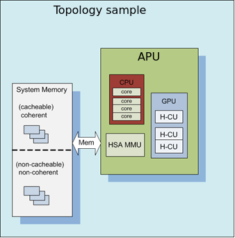

KFD Topology
==============

Here is a file structure topology of kfd kernel 

| :ref:`sysfsclasskfd`
| :ref:`sysfsclasskfdtopology`
| :ref:`sysfsclasskfdtopologynodes0`
| :ref:`sysfsclasskfdtopologynodes0iolinks01`
| :ref:`sysfsclasskfdtopologynodes0membanks0`

Depending on the platform, the data should be grouped hierarchically to correspond to components such as Agent, Memory, Compute Properties, Caches, and I/O.

| The data are associated with a node ID, forming a per-node element list which references the elements contained at relative offsets within that list. A node associates with a kernel agent or agent. Node ID’s should be 0-based, with the “0” ID representing the primary elements of the system (e.g., “boot cores”, memory) if applicable. The enumeration order and—if applicable—values of the ID should match other information reported through mechanisms outside of the scope of the requirements;
| For example, the data and enumeration order contained in the ACPI SRAT table on some systems should match the memory order and properties reported through HSA. Further detail is out of the scope of the System Architecture and outlined in the Runtime API specification.

Each of these nodes is interconnected with other nodes in more advanced systems to the level necessary to adequately describe the topology.

.. image:: More_advanced_topology.png

Where applicable, the node grouping of physical memory follows NUMA principles to leverage memory locality in software when multiple physical memory blocks are available in the system and agents have a different “access cost” (e.g., bandwidth/latency) to that memory.

