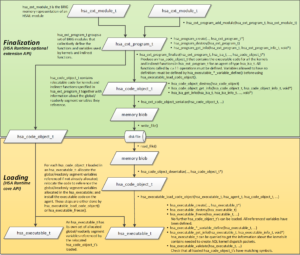

.. _rocncloc:

======================
CLOC offline compiler
======================

ROCm With Harmony: Combining OpenCL, HCC, and HSA in a Single Program
########################################################################

Introduction
*************

In a previous blog we discussed the different languages available on the ROCm platform.  Here we’ll show you how to combine several of these languages in a single program:

 * We’ll use an offline OpenCL™ compiler to compile the “BitonicSort” OpenCL kernel (from the AMD APP SDK) into a standard HSA code  	object (“hsaco”) format.
 * The host code will employ HCC’s hc dialect for device discovery (ie hc::accelerator and hc::accelerator_view) and memory 	     	management (hc::array)
 * The actual dispatch will use the low-level HSA Runtime calls.  Recall that ROCR is an implementation of the HSA Runtime with      	extensions for multi-GPU configurations.   We’ll show you how to extract HSA queue and agent structures from the HCC C++ ones, and 	 then use them to perform the kernel launch.

There are several reasons you might want to do something along these lines. First, many kernels exist in OpenCL and re-using this existing investment can save time.  The OpenCL kernel language is widely-used, and it enables programmers to use advanced GPU features including local memory, rich math functions, and vector operations.   But the OpenCL runtime can be verbose and the memory interface can be difficult to control and optimize. HCC provides the advantage of a full C++ runtime but also full control over the memory allocation and copies.  Using the techniques we'll show you here, you can employ OpenCL kernels without having to port the host runtime code to OpenCL. This approach offers a significant advantage for larger C++ programs that can use a few optimized OpenCL kernels while sticking with C++ kernels and features for the rest of the program.

hsaco : The Common Currency
****************************
Hsaco is informally pronounced “sock-o” (with a slight emphasis on the first letter to reflect the otherwise silent “h”).  It's a standard ELF file ;`ELF <https://en.wikipedia.org/wiki/Executable_and_Linkable_Format>`_ (“Executable and Linkable Format”) is a container format widely used in Linux to store object code, and the hsaco ELF container organization matches the one generated by the popular LLVM tool chain.  Hsaco stores the compiled GCN code in the .text section, it optionally contains debug information, and it defines symbols that allow the host code to find the kernel entrypoints and functions.  Like other ELF files, code objects can contain multiple kernels, functions, and data – so when using hsaco you will need to specify both the code object and the desired symbol.  Refer to the `detailed description <https://github.com/RadeonOpenCompute/ROCm-Docs>`_ of the hsaco format for more information. Many tools in AMD’s compiler chain generate and use the hsaco format including  OpenCL, HCC, HIP, the GCN assembler and the HSAIL Finalizer.  Kernel code contained in hsaco can be extracted and then launched onto the GPU.Additionally, the `dissembler tool <https://github.com/ROCm-Developer-Tools/LLVM-AMDGPU-Assembler-Extra>`_ can disassemble hsaco files so you can see what is going on inside the kernel.  In a future blog, we’ll talk about using the same techniques described here to assemble and then launch kernels written in GCN assembly.  Essentially, hsaco is the interchange format used to pass code between these different tools, and allows code written in different languages to be used together.

Compiling an OpenCL Kernel into hsaco
**************************************
The Makefile shows the usage of the `CLOC <https://github.com/HSAFoundation/CLOC>`_ (CL Offline Compiler) tool to compile the CL kernel into the hsaco file.  Here’s the relevant call to CLOC: /opt/rocm/cloc/bin/cloc.sh BitonicSort_Kernels.cl -o BitonicSort_Kernels.hsaco

Using hsaco:
************
This example shows two methods for accessing the hsaco data from the host application :

 * Use a separate file and load it using C++ file I/O code. See the load_hsa_from_file() command. This path is enabled when 	     	p_loadKernelFromFile=true.
 * Serialize the code into a global string and thus directly link the hsaco into the executable. This approach avoids the need to    	find the hsaco file at runtime.  This path is enabled when p_loadKernelFromFile=false.

The “load_hsa_code_object” shows the use of the standard HSA Runtime API calls to load the code object into memory and extract the pointer to the BitonicSort kernel.  If we were working with an HSAIL or BRIG kernel we would first call the finalizer which would produce hsaco data, and the use these exact same finalizer APIs to load the hsaco into memory and find the desired symbols.    This is a powerful and extremely useful concept that allows applications using the HSA Runtime to support either:

  * An industry standard portable intermediate language (HSAIL/BRIG) that can be finalized to a vendor-specific binary, or
  * A standard ELF container that stores vendor-specific binary code (hsaco). This flavor supports vendor-specific ISA inside a     	standard container format, and still benefits from the standard HSA runtime API.  Effectively this enables use cases where apps 	and tools can use the HSA Runtime APIs without using HSAIL, and still retain source code portability.

The picture below shows the different steps in the code loading process, and in particular the clean separation between the pre-finalization (green) and post-finalization (yellow) steps.

Making HCC Sing
******************
The example uses the hc `C++ dialect <gpuopen.com/rocm-do-you-speaka-my-language/>`_ to select the default accelerator and queue.  To launch the hsaco file we’ve created, we need to make HCC reveal the details of the HSA data structure that live under the covers. Here’s the critical piece of code that shows how to get from the HCC world to the HSA world using “hc::accelerator_view::get_hsa_queue”:

::

  //_acc is type hc::accelerator.

  // Select default queue

  hc::accelerator_view av = _acc.get_default_view();

  // Extract the HSA queue from the accelerator view:
  hsa_queue_t  *hsaQueue = static_cast<hsa_queue_t*> (av.get_hsa_queue());

Now that we have an HSA queue we can use the low-level HSA runtime API to enqueue the kernel for execution on the GPU. The code creates an "AQL" packet, uses the hsa runtime APIs (such as hsa_queue_store_write_index_relaxed) to place the packet into the queue and make it visible to the GPU for execution. More details in the code. This capability is a quite useful since we can now mix HCC kernels (submitted with parallel_for_each) with kernels in hsaco format (from OpenCL kernels, or assembly, or other sources) in the same application or even in the same queue.   For example, libraries can benefit from this architecture : the library interface can be based on HCC structures (accelerator, accelerator_view, completion_future) while the implementation uses HSA Runtime and hsacos.

Extracting Data Pointers
*************************
The example under discussion uses hc::array<>to store the array of integers that are sorted.  The original OpenCL kernel of course knows nothing of the  hc::array<> data-type.  Here’s the OpenCL kernel signature:

::

  __kernel
  void bitonicSort(__global uint * theArray, const uint stage, const uint passOfStage, const uint direction)

When calling this kernel, the first parameter (theArray) is an 8-byte pointer.  Fortunately the hc syntax defines an API that allows us to retrieve this pointer on the host side so we can later pass it to the kernel in the expected position:

::

  _inputAccPtr = _inputArray->;accelerator_pointer();

 

Our application is still responsible for ensuring that the data at this pointer is valid on the accelerator, before calling the kernel.   In this case, the application copies from host data (allocated with malloc) to the inputArray.

The code also shows the use of hc’s accelerator memory interface to allocate and copy the data.  This is an alternative to using hc::array<>, and can be select by setting p_useHcArray=false in the top of the source code.  Here’s the relevant code snippet:

::

   // Alternative allocation technique using am_alloc

  _inputAccPtr = hc::am_alloc(sizeBytes, _acc, 0);

  hc::am_copy(_inputAccPtr, _input, sizeBytes);

We do not recommended usinge  hc::array_view<> with the direct hsaco code launching techniques we are discussing here.  hc::array_view<> is designed to automatically synchronize the data before and after parallel_for_each blocks are launched.  Direct launching with HSA runtime APIs will not automatically synchronize hc::array_view<>.

Finally, HCC provides accessors that allow easy retrieval of the the HSA “regions” associated with an accelerator.  The HSA runtime API uses regions to specify where memory on an agent is located - for example coarse-grain device memory or fine-grain system memory.    When enumerating accelerators, HCC scans the supported regions for each underlying HSA agent and provides the following accessors:

::

  void* get_hsa_am_region();// Accelerator-memory region.  On discrete GPUs its the device memory ; on APUs its shared host memory

  void* get_hsa_am_system_region() // Pinned or registered host memory accessible to this accelerator

  void* get_hsa_kernarg_region() // Memory for kernel arguments.

This example uses get_hsa_kernarg_region() to allocate memory for the kernel arguments passed to the BitonicSort kernel.  Kernarg memory is typically written by the host CPU and read by the accelerator executing the kernel.  The example defines a host-side structure to describe the layout of the arguments expected by the kernel, and then typecasts the pointer returned by the kernarg pointer.

::

  /*

  * This is the host-side representation of the kernel arguments expected by the BitonicSort kernel.

  * The format and alignment for this structure must exactly match the kernel signature defined in the kernel

  */

  struct BitonicSort_args_t {

  uint32_t * theArray;

  uint32_t stage;

  uint32_t passOfStage;

  uint32_t direction;

  } ;

 

  /*

  * Allocate the kernel argument buffer from the correct region.

  */

  BitonicSort_args_t * args = NULL;

  hsa_region_t kernarg_region = *(static_cast<hsa_region_t*> (_acc.get_hsa_kernarg_region()));

  hsa_status = hsa_memory_allocate(kernarg_region, sizeof(args), (void**)(&args));

  aql.kernarg_address = args;

  assert(HSA_STATUS_SUCCESS == hsa_status);

 

  /*

  * Write the args directly into the kernargs buffer:

  */

   args->theArray = _inputAccPtr;

  args->stage = 0;

  args->passOfStage = 0;

  args->direction = _sortIncreasing;

Summary
***************
We learned how to use offline compilation to convert an OpenCL kernel into a standard hsaco file and then employed the HSA Runtime API to launch that kernel from an HCC program.  Harmony!  In the future we'll look at how to optimize the HSA Runtime calls, and also how to use other tools to create hsaco files (such as the AMDGCN assembler).   Stay tuned.
Reference:
`GitHub Code for this example <https://github.com/RadeonOpenCompute/HCC-Example-Application/tree/master/BitonicSort-CL-from-HCC>`_
https://en.wikipedia.org/wiki/Bitonic_sorter 
