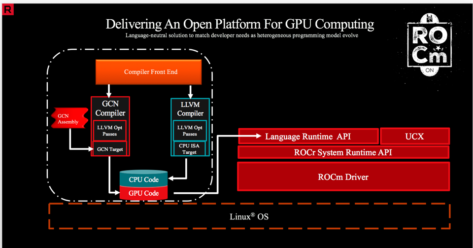
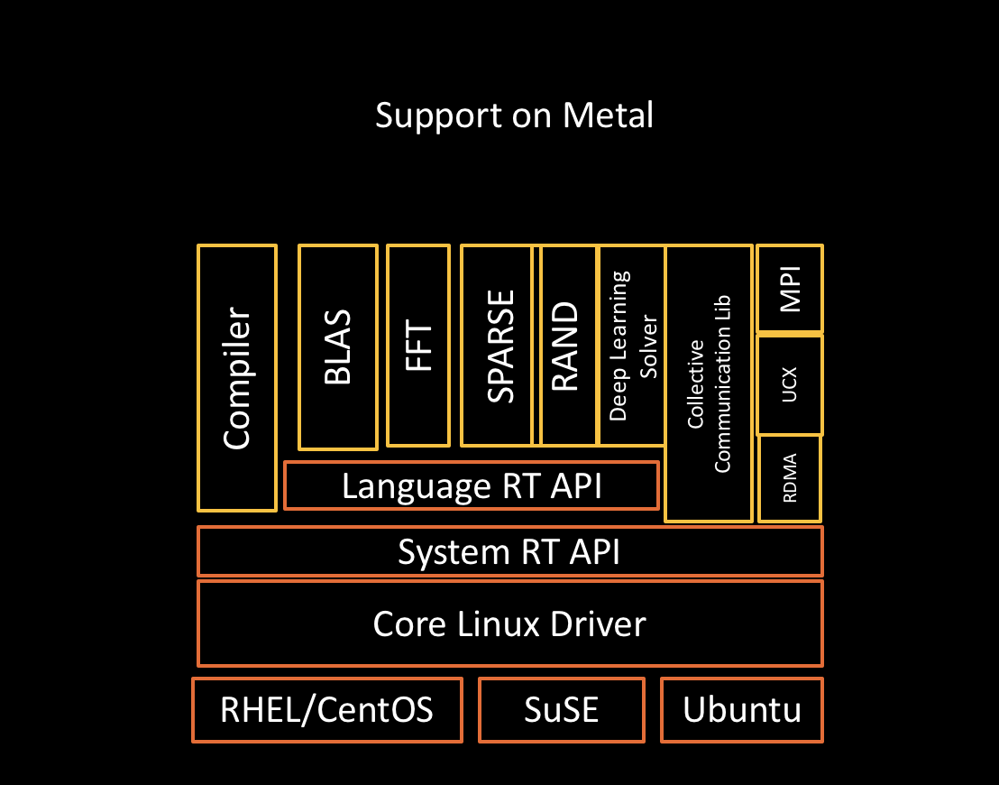

 .. rocm documentation master file, created by
   sphinx-quickstart on Tue Jul 11 20:12:28 2017.
   You can adapt this file completely to your liking, but it should at least
   contain the root `toctree` directive.

Welcome to ROCm Platform
=========================

We are excited to present ROCm, the first open-source HPC/Hyperscale-class platform for GPU computing that’s also programming-language independent. We are bringing the UNIX philosophy of choice, minimalism and modular software development to GPU computing. The new ROCm foundation lets you choose or even develop tools and a language run time for your application.

**ROCm is built for scale**; it supports multi-GPU computing in and out of server-node communication through RDMA. It also simplifies the stack when the driver directly incorporates RDMA peer-sync support.

**ROCm has a rich system run time** with the critical features that large-scale application, compiler and language-run-time development requires.

Going to 11: Amping Up the Programming-Language Run-Time Foundation
####################################################################
The ROCr System Runtime is language independent and makes heavy use of the Heterogeneous System Architecture (HSA) Runtime API. This approach provides a rich foundation to exectute programming languages such as HCC C++ and HIP, the Khronos Group’s OpenCL, and Continuum’s Anaconda Python.

    

Important features include the following:

    * Multi-GPU coarse-grain shared virtual memory
    * Process concurrency and preemption
    * Large memory allocations
    * HSA signals and atomics
    * User-mode queues and DMA
    * Standardized loader and code-object format
    * Dynamic and offline-compilation support
    * Peer-to-peer multi-GPU operation with RDMA support
    * Profiler trace and event-collection API
    * Systems-management API and tools

    
Solid Compilation Foundation and Language Support
####################################################
    * LLVM compiler foundation
    * HCC C++ and HIP for application portability
    * GCN assembler and disassembler

The frontiers of what you can accomplish with ROCm are vast and uncharted. We look forward to working with you to improve the platform so you can use it more effectively in your own projects. Our efforts have opened the door to unique heterogeneous-computing applications that explore what this growing technology can do.

.. toctree::
   :maxdepth: 6
   :hidden:
   
   ROCm
   Current_Release_Notes/Current-Release-Notes
   Installation_Guide/Installation-Guide
   Programming_Guides/Programming-Guides
   ROCm_GPU_Tunning_Guides/ROCm-GPU-Tunning-Guides
   GCN_ISA_Manuals/GCN-ISA-Manuals
   ROCm_API_References/ROCm-API-References
   ROCm_Tools/ROCm-Tools
   ROCm_Libraries/ROCm_Libraries
   ROCm_Compiler_SDK/ROCm-Compiler-SDK
   ROCm_System_Managment/ROCm-System-Managment
   ROCm_Virtualization_Containers/ROCm-Virtualization-&-Containers
   Remote_Device_Programming/Remote-Device-Programming
   Deep_learning/Deep-learning
   Other_Solutions/Other-Solutions
   Tutorial/Tutorial
   ROCm_Glossary/ROCm-Glossary

   
