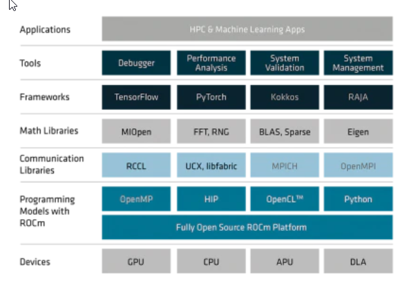

.. image:: amdblack.jpg
.. rocm documentation master file, created by
   sphinx-quickstart on Tue Jul 11 20:12:28 2017.
   You can adapt this file completely to your liking, but it should at least
   contain the root `toctree` directive.
|

Welcome to AMD ROCm Platform
=============================

AMD ROCm is the first open-source software development platform for HPC/Hyperscale-class GPU computing. AMD ROCm brings the UNIX philosophy of choice, minimalism and modular software development to GPU computing. 

Since the ROCm ecosystem is comprised of open technologies: frameworks (Tensorflow / PyTorch), libraries (MIOpen / Blas / RCCL), programming model (HIP), inter-connect (OCD) and up streamed Linux® Kernel support – the platform is continually optimized for performance and extensibility.  Tools, guidance and insights are shared freely across the ROCm GitHub community and forums.

AMD ROCm is built for scale; it supports multi-GPU computing in and out of server-node communication through RDMA. AMD ROCm also simplifies the stack when the driver directly incorporates RDMA peer-sync support.

The AMD ROCm Programming-Language Run-Time 
############################################

The AMD ROCr System Runtime is language independent and makes heavy use of the Heterogeneous System Architecture (HSA) Runtime API. This approach provides a rich foundation to execute programming languages, such as HIP and OpenMP.

.. image:: ROCm_Stack.png
    :align: center
    

Important features include the following:

    * Multi-GPU coarse-grain shared virtual memory
    * Process concurrency and preemption
    * Large memory allocations
    * HSA signals and atomics
    * User-mode queues and DMA
    * Standardized loader and code-object format
    * Dynamic and offline-compilation support
    * Peer-to-peer multi-GPU operation with RDMA support
    * Profiler trace and event-collection API
    * Systems-management API and tools

.. image:: ROCm_Core_Stack.png
    :align: center
    
Solid Compilation Foundation and Language Support
####################################################

•	LLVM compiler foundation
•	HIP for application portability
•	GCN assembler and disassembler

AMD ROCm gives developers the flexibility of choice for hardware and aids in the development of compute-intensive applications.

.. toctree::
   :maxdepth: 6
   :hidden:
   :caption: Release Documentation
  
   Release Notes
   Current_Release_Notes/Current-Release-Notes
   Installation_Guide/Installation-Guide
   
   
.. toctree::
   :maxdepth: 6
   :hidden:
   :caption:  Compiler Documentation
      
   Programming_Guides/Programming-Guides
   Programming_Guides/openmp_support
   Programming_Guides/gcn-assembler
   ROCm_Compiler_SDK/ROCm-Compiler-SDK
      
   

      
   
.. toctree::
   :maxdepth: 6
   :hidden:
   :caption: Library Documentation 
   
   ROCm_Libraries/ROCm_Libraries
   ROCm_API_References/ROCm-API-References
   Deep_learning/Deep-learning
   
   
  
.. toctree::
   :maxdepth: 6
   :hidden:
   :caption: ROCm-Tools
      
   ROCm_Tools/ROCm-Tools
   ROCm_Tools/ROCgdb.rst
   ROCm_Tools/rocm-debug-agent
   Other_Solutions/Other-Solutions
   Other_Solutions/rocm-validation-suite
   
   
.. toctree::
   :maxdepth: 6
   :hidden:
   :caption: System Management Information
      
   ROCm_System_Managment/ROCm-System-Managment
    
    
.. toctree::
   :maxdepth: 6
   :hidden:
   :caption: Additional Documentation 
   
   GCN_ISA_Manuals/GCN-ISA-Manuals
   ROCm_Glossary/ROCm-Glossary
   Remote_Device_Programming/Remote-Device-Programming
   Tutorial/Tutorial
   

   
